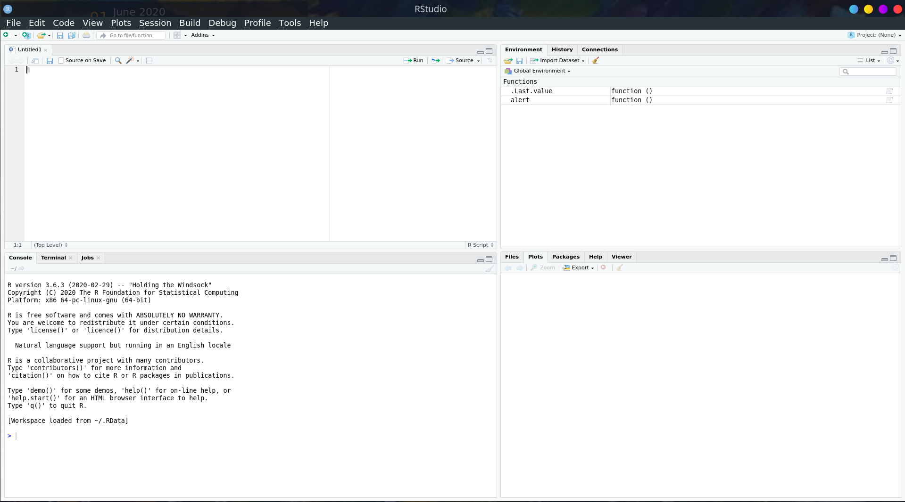
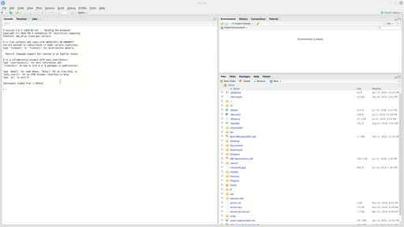
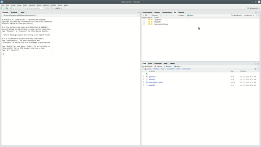

# Tools for Statistical Computing {#tools}

The goal of this class is to expose you to basic computing skills in R and SAS, which are two of the more common languages for statistical computing (python is the 3rd most common, and is particularly popular in data science and machine learning, but will not be explicitly taught in this class.)

Since we'll be learning how to use a bunch of different software, the first step is to get everythign set up on your machine:

- [git](https://help.github.com/en/github/getting-started-with-github/set-up-git)
- [SAS 9.4](https://statistics.unl.edu/how-obtain-sas-or-jmp-license) (or later)
- [R](https://www.r-project.org/) (3.5 or higher)
- [RStudio](https://rstudio.com/products/rstudio/download/#download)
- [LaTeX](https://www.latex-project.org/get/)

You will also need to sign up for a [GitHub account](https://help.github.com/en/github/getting-started-with-github/signing-up-for-a-new-github-account)

## Module Objectives {-}

- Set up R, Rstudio, SAS, LaTeX, and git on personal machines

- Use version control to track changes to documents and code

## R and RStudio

For an explanation of the differences between the R and RStudio and a short history lesson, see the expandable section below.
<!-- Differences between R and RStudio -->
<details>
R is a statistical computing language which originated as an open-source clone of Bell labs S computing language. S was inspired by Scheme, but also has features which are similar to Lisp. It is a scripting language (you don't have to compile the code before it runs) and is natively accessed using a command-line prompt. One feature of R that is relatively unique is that it uses vector-based math, which means that mathematical operations on vectors occur for the entire vector without having to use loops to iterate through the vector line-by-line (this feature is common in languages designed for data manipulation, like SAS, Matlab, and julia; it is rare in more general computing languages). R is optimized for working on data: unlike more general-purpose programming languages such as Python, R was built with the idea of facilitating data analysis. As a result, data structures in R tend to be more natural for statistical work than similar structures in Python or C, which can feel unwieldly. From a computer science perspective, though, R seems like an extremely odd language because the design choices that make data analysis easier are unconventional for more general-purpose languages.

RStudio is an integrated development environment for R. Basically, it adds a pretty graphical layer on top of R, providing an easy way to develop R code, evaluate that code, and keep track of all of the variables which are available in the computing environment. RStudio contains integrations which provide syntax highlighting, code folding, basic checks (missing parentheses, etc.), debugging tools, and many other features. RStudio was designed around the idea of making R easier to use and making it easy to develop statistical software reproducibly. RStudio (the company) is responsible for adding many features to the R ecosystem which facilitate running statistical analyses and presenting the results in user-friendly ways.

</details>
Another useful explanation of R and RStudio can be found in [Section 1 of ModernDive's book](https://moderndive.netlify.app/1-getting-started.html)

### Getting Set up: R

Note that the tutorial videos use versions of R that are *old*. You should be installing at least R 3.5 (if you have an older version, please update.) The basic installation process is the same, though, so the videos are still useful.

[R on Windows installation](https://www.youtube.com/watch?v=mfGFv-iB724)

[R on Mac installation](https://www.youtube.com/watch?v=Icawuhf0Yqo)

<details><summary>R on Linux installation</summary>

On Linux, instead of a youtube video, you get a text-based  [tutorial](https://github.com/swirldev/swirl/wiki/Installing-swirl-on-Linux). One of the Debian maintainers, Dirk Eddelbuettel, is also on R core, which means that R tends to work extremely well with Debian-based distributions, like Ubuntu and Linux Mint. R does work on RPM based distros, and you can of course also compile it from source for Arch/Gentoo, but I've stuck with Deb-based distributions for approximately 7 years because it seems to be a bit less hassle. Additional troubleshooting can be found [here](https://pages.github.nceas.ucsb.edu/NCEAS/help/installing_r_on_ubuntu.html).
</details>

### Getting Set up: RStudio

You can find RStudio at https://rstudio.com/products/rstudio/download/. You want the open source edition of RStudio Desktop. If you're feeling brave, you can install the [preview release](https://rstudio.com/products/rstudio/download/preview/#download) - this may have a few bugs, but tends to be relatively stable and has the latest features. Please install RStudio 1.3.9+ for this class. 

If you're on Linux, go ahead and [import RStudio's public key](https://rstudio.com/code-signing/) so that software validation works. (All of the commands are provided in the linked page)

### Exploring RStudio



In the top-left pane is the text editor. This is where you'll do most of your work.

In the top right, you'll find the environment, history, and connections tabs. The environment tab shows you the objects available in R (variables, data files, etc.), the history tab shows you what code you've run recently, and the connections tab is useful for setting up database connections.

On the bottom left is the console. There are also other tabs to give you a terminal (command line) prompt, and a jobs tab to monitor progress of long-running jobs. In this class we'll primarily use the console tab. 

On the bottom right, there are a set of tabs: 
- files (to give you an idea of where you are working, and what files are present), 
- plots (which will be self-explanatory), 
- packages (which extensions to R are installed and loaded), 
- the help window (where documentation will show up), and 
- the viewer window, which is used for interactive graphics or previewing HTML documents. 

To get started, type 2+2 into the console window and hit enter.

Now, type 2+2 into the text editor and press the run button that is on the pane's shortcut bar (or, you can hit Ctrl-Enter/CMD-Enter to send a single line to the console). 

If both of those things worked, you're probably set up correctly!

Next, try typing this into the text editor, then run the line. Look in the environment and see if you can see what has changed.

```{r}
a <- 3 # store 3 in the variable a
```


You can use the environment window to preview your data, check on the status of variables, and more. Note that while R is running, the window doesn't update (so you can't check on the status of a loop while the loop is running using the window).

## SAS

SAS is another extensively used statistical programming language. It is primarily used for mixed models and in the biostatistics community (for e.g. drug trials). 

For SAS installation, see Steve Westerholt. He manages UNL SAS installations. 

### Note {- .note}
SAS looks different on different machines. On Linux, SAS looks like you took a time machine back to the early 1990s. Screenshots from SAS will likely look *very* different on your machine than on mine. I will try to integrate screenshots from other OS's where it matters.

XXX TODO: Get Windows/Mac screenshots XXX

## Version Control with Git


Git is a program whose primary purpose is version control. Git tracks changes to each file that it is told to monitor, and as the files change, you provide short labels describing what the changes were and why they exist (called "commits"). The log of these changes (along with the file history) is called your git commit history. 

When writing papers, this means you can cut material out freely, so long as the paper is being tracked by git - you can always go back and get that paragraph you cut out if you need to. You also don't have to rename files - you can confidently overwrite your files, so long as you remember to commit frequently. 

The git material in this chapter is just going to link directly to the book "Happy Git with R" by Jenny Bryan. It's amazing, amusing, and generally well written. I'm not going to try to do better. 

[Go read Chapter 1.](https://happygitwithr.com/big-picture.html)


### Getting set up: github

See the instructions [here](https://happygitwithr.com/github-acct.html)

### Getting set up: git

See the instructions [here](https://happygitwithr.com/install-git.html)

Write down, or keep track of, the git installation path. This will make your life much easier.

There is a [troubleshooting guide](https://happygitwithr.com/troubleshooting.html) that has some common problems which occur during git installation.

### Introduce yourself to git

You need to tell git what your name and email address are, because every "commit" you make will be signed. 

You can follow the instructions [here](https://happygitwithr.com/hello-git.html), or just wait and run the R script to install and configure R, LaTeX, and packages.

### Optional: Install a git client

[Instructions](https://happygitwithr.com/git-client.html)

### Git and Github

Slightly crude (but memorable) analogy:
<details>
Git is to GitHub what Porn is to PornHub
</details>

Git is a program that runs on your machine and keeps track of changes to files that you tell it to monitor. 

If you want, you can hook Git up to GitHub, and make a copy of your local git repository that lives in the cloud. Then, if you configure things correctly, your local repository will talk to GitHub without too much trouble. 

Using Github with Git allows you to easily make a cloud backup of your important code, so that even if your  computer suddenly catches on fire, all of your important code files exist somewhere else. Remember: any data you don't have in 3 different places is data you don't care about.^[Yes, I'm aware that this sounds paranoid. It's been a very rare occasion that I've needed to restore something from another backup. You don't want to take chances. I knew a guy who had to retype his entire masters thesis from the printed out version the night before it was due because he had stored it on a network drive that was decommissioned. You don't want to be that guy.]

## Easy Extra Setup Script

Run [this script](code/01_setup_install.R) on your machine. It will ask you for some input - your name, email address, etc. Then it's going to run for a while, installing some packages (read the code file if you want to know what it's doing - I've provided short explanations of what each package does). 

```{r eval = F}
source("srvanderplas.github.io/unl-stat850/code/01_setup_install.R")
```

This script will set up git for you (e.g. the introduce yourself to git section above) and then will install `tinytex`, which is a version of LaTeX that is very simple and easy to install. 

## LaTeX

LaTeX is a typesetting program, which makes it different from most other document creation software, such as MS Word, which is "WYSIWYG" - what you see is what you get. In LaTeX, you'll type in code to create a document, and LaTeX will compile the document into something pretty. The goal is that you have to think less about formatting and what goes on which page - LaTeX will handle that part for you - so that you can think more about the content.

In practice, it doesn't usually work out like that, so there are programs like markdown which aim to simplify document creation even more to free you from the formatting that LaTeX requires. 

LaTeX is often used for typesetting statistical and mathematical papers because its equation editor is top notch. (It was actually written by Donald Knuth because he got so annoyed trying to write his dissertation that he took some time off to write TeX first, and then used it to write his dissertation).^[Amusingly, `knitr` was written in much the same manner. Yihui Xie had to substitute-teach ISU's version of 850 on the day we covered Sweave (a predecessor to knitr). He got so frustrated teaching the class that he went home and started writing `knitr`. Later, he developed Rmarkdown, bookdown, blogdown, and several other packages aimed at making writing documents + code easier to handle.

Moral of the story - if you get frustrated with the tools you have, you're in good company. Use it as fuel to make better tools.] 

We'll work with LaTeX later in the semester, but for now, we'll be primarily working with Markdown, which is much simpler. [Here's a quick cheatsheet](https://rmarkdown.rstudio.com/authoring_basics.html). 

## Topic Sequencing

In several places in this class, you'll have to use material that you haven't been formally taught yet. I will do my absolute best to provide thorough instructions, help you along as much as I can, and generally provide enough support that you can muddle through. But it's going to be hard to teach you everything you need to e.g. analyze some data, before providing you the opportunity to SEE that data using visualization packages. And it's silly to teach you plotting before you know how to read data in. But to teach you how to read data in, you need to be able to take a look at the data, and plots are the best way to do that. To do any of this stuff, you need to know about functions, but it can be easier to figure out how to run a function than to write a function. 

You see my problem.

So instead, what I'm going to do is to leave you lots of comments as to what a piece of code does when I'm using things you haven't been formally shown yet. Then, you can copy/paste/modify those pieces of code, and if they break, you can ask why and we'll dig into it (breaking code is usually a good thing, because it means you're learning how to program). For each chapter, focus on learning how to write code that accomplishes that chapter's objectives. If you understand some of the code you're modifying that covers other topics not in that chapter, so much the better. But it's not an expectation or a requirement.

If you're confused, please post on the class message boards so that those who have seen this material before can help you out.

- [SAS quick start guide](https://towardsdatascience.com/getting-started-with-sas-beginner-354a94a48f08)
- [R quick start guide](https://www.statmethods.net/)


## Using Version Control

I've set this class up so that you'll be using version control from the very beginning. Not only will  this help you to learn good habits, it will also give you a platform for collaboration, hosting your work online, and more. 

In this class, we'll be using Github Classroom. Basically, this allows me to set up a template repository for each assignment. You'll accept the assignment, which will create a copy of the repository on your GitHub account, and then your work will be saved to your repository using a fairly standard workflow which will be discussed  below. When you submit your assignment, you'll copy the link to the commit you want to be graded, and upload that to Canvas. I will clone your repository, compile your files (I'll change the SAS path if necessary), and grade the compiled result. 

So, what does your typical git/GitHub workflow look like? I'll go through this in chronological order. In most cases, you'll want to follow along on your own GitHub account. 

### Create a Repository
**Repositories** are single-project containers. You may have code, documentation, data, TODO lists, and more associated with a project. 

To create a repository, you can start with your local computer first, or you can start with the online repository first. 

#### Local repository first

Let's suppose you already have a folder on your machine named `hello-world-1` (you may want to create this folder now). You've created a starter document, say, a text file named README with "hello world" written in it. 

If you want, you can use the following R code to set this up:
```{r, eval = F}
dir <- "./hello-world-1"
if (!dir.exists(dir)) {
  dir.create(dir)
}
file <- file.path(dir, "README")
if (!file.exists(file)) {
  writeLines("hello world", con = file)
}
```

To create a local git repository, we can go to the terminal (in Mac/Linux) or the git bash shell (in Windows), navigate to our repository folder (not shown, will be different on each computer), and type in 

```
git init
```

Alternately, if you prefer a GUI (graphical user interface) approach, that will work too:

1. Open Rstudio
2. Project (upper right corner) -> New Project -> Existing Directory. Navigate to the directory.
3. (In your new project) Tools -> Project options -> Git/SVN -> select git from the dropdown, initialize new repository. RStudio will  need to restart.
4. Navigate to your new Git tab on the top right.


The next step is to add our file to the repository. 

Using the command line, you can type in `git add README` (this tells git to track the file) and then commit your changes (enter them into the record) using `git commit -m "Add readme file"`.

Using the GUI, you navigate to the git pane, check the box next to the README file, click the Commit button, write a message ("Add readme file"), and click the commit button. 



