# (PART) Fundamentals {-}

# Tools for Statistical Computing {#tools}

The goal of this class is to expose you to basic computing skills in R and SAS, which are two of the more common languages for statistical computing (python is the 3rd most common, and is particularly popular in data science and machine learning, but will not be explicitly taught in this class.)

Since we'll be learning how to use a bunch of different software, the first step is to get everything set up on your machine:

- [git](https://help.github.com/en/github/getting-started-with-github/set-up-git)
- [SAS 9.4](https://statistics.unl.edu/how-obtain-sas-or-jmp-license) (or later)
- [R](https://www.r-project.org/) (4.0 or higher)
- [RStudio](https://rstudio.com/products/rstudio/download/#download)
- [LaTeX](https://www.latex-project.org/get/)

You will also need to sign up for a [GitHub account](https://help.github.com/en/github/getting-started-with-github/signing-up-for-a-new-github-account)

## Module Objectives {- #module-1-objectives}

- Set up R, Rstudio, SAS, LaTeX, and git on personal machines

- Detect and resolve problems related to file systems, working directories, and system paths when troubleshooting software installation

- Use version control to track changes to a document (git add, commit, push, pull)


## Setting Up Software

First, lets cover the basics of setting up the software you're going to be using in this course. You don't at this point have to understand what the different software DOES, but you should at least get it installed and working -- this may be tricky, so we'll take it slow.

### SAS

For SAS installation, see Steve Westerholt. He manages UNL SAS installations. You can pay a small fee to get the full SAS installation, or you can use SAS community edition (but if you take this route, it may be more difficult to manage your paths, etc., and you may not be able to use SAS Markdown on your machine). You can also use the HCC environment (we will talk more about this in week 2 or thereabouts) set up for you to be able to do your homework. As long as you can run SAS code on a machine you have regular access to, I'm fine.


### R 

Note that the tutorial videos use versions of R that are *old*. You should be installing at least R 4.0 (if you have an older version, please update.) The basic installation process is the same, though, so the videos are still useful.

- <i class="fab fa-windows"></i> [R on Windows installation](https://www.youtube.com/watch?v=mfGFv-iB724)

- <i class="fab fa-apple"></i> [R on Mac installation](https://www.youtube.com/watch?v=Icawuhf0Yqo)

- <i class="fab fa-linux"></i> R on Linux installation    
On Linux, instead of a YouTube video, you get a text-based  [tutorial](https://github.com/swirldev/swirl/wiki/Installing-swirl-on-Linux). One of the Debian maintainers, Dirk Eddelbuettel, is also on R core, which means that R tends to work extremely well with Debian-based distributions, like Ubuntu and Linux Mint. R does work on RPM based distros, and you can of course also compile it from source for Arch/Gentoo, but I've stuck with Deb-based distributions for approximately 7 years because it seems to be a bit less hassle. Additional troubleshooting can be found [here](https://pages.github.nceas.ucsb.edu/NCEAS/help/installing_r_on_ubuntu.html).

Once you have R installed, try to run the following code, which will install (most of) the packages you need to run the code in this book. 

```{r install-req-pkgs, eval = F}
# Read in a list of all packages that are required
pkgs <- readLines("https://raw.githubusercontent.com/srvanderplas/unl-stat850/master/data/packages")

# Remove packages only available on github
pkgs <- setdiff(pkgs, c("nycsquirrels18", "emo", "tweetrmd", "classdata"))

# Remove any already installed packages from the list
pkgs <- setdiff(pkgs, installed.packages())

# The following code will not make a lot of sense... yet. Come back to it in a 
# few weeks and see how much you understand (or can decode)

# This ensures that if the installation fails, the code will keep running
try_install_pkg <- function(...) try(install.packages(..., dependencies = T))
lapply(pkgs, try_install_pkg)
pkgs <- setdiff(pkgs, installed.packages())

if (length(pkgs) > 0) {
  paste("The following packages did not install: \n", paste(pkgs, collapse = "\n"))
}

# Try installing github packages
devtools::install_github(c("mine-cetinkaya-rundel/nycsquirrels18", 
                           "hadley/emo", 
                           "gadenbuie/tweetrmd", 
                           "heike/classdata"))
```

If some packages did not install, feel free to post in Yellowdig with the error message(s) received and the list of packages you're having trouble installing (or contact me and we'll set up a time to debug). 

### RStudio


You can find RStudio at https://rstudio.com/products/rstudio/download/. You want the open source edition of RStudio Desktop. If you're feeling brave, you can install the [preview release](https://rstudio.com/products/rstudio/download/preview/#download) - this may have a few bugs, but tends to be relatively stable and has the latest features. Please install RStudio 1.3.9+ for this class. 

If you're on Linux, go ahead and [import RStudio's public key](https://rstudio.com/code-signing/) so that software validation works. (All of the commands are provided in the linked page)


### git

The git material in this chapter is just going to link directly to the book "Happy Git with R" by Jenny Bryan. It's amazing, amusing, and generally well written. I'm not going to try to do better. 

[Go read Chapter 1.](https://happygitwithr.com/big-picture.html)

#### Getting set up: GitHub

See the instructions [here](https://happygitwithr.com/github-acct.html)

#### Getting set up: git

To install git, see the instructions [here](https://happygitwithr.com/install-git.html)

Write down, or keep track of, the git installation path. This will make your life much easier.

There is a [troubleshooting guide](https://happygitwithr.com/troubleshooting.html) that has some common problems which occur during git installation.

#### Introduce yourself to git

You need to tell git what your name and email address are, because every "commit" you make will be signed. 

Follow the instructions [here](https://happygitwithr.com/hello-git.html), or run the lines below:

```{r}

user_name <- readline(prompt = "Your full name: ")
user_email <- readline(prompt = "The email address associated with your github account: ")

if (!"usethis" %in% installed.packages()) install.packages("usethis")

library(usethis)

use_git_config(user.name = user_name, user.email = user_email, scope = "user")

# Tell git to ignore all files that are OS-dependent and don't have useful data.
git_vaccinate() 

# Create a ssh key if one doesn't already exist
if (!file.exists(git2r::ssh_path("id_rsa.pub"))) {
  system("ssh-keygen -t rsa -b 4096") # Create an ssh key
  system("eval $(ssh-agent -s)")
  system("ssh-add ~/.ssh/id_rsa")
} 
```

Then, in RStudio, go to Tools > Global Options > Git/SVN. View your public key, and copy it to the clipboard. 

Then, proceed to github. Make sure you’re signed into GitHub. Click on your profile pic in upper right corner and go Settings, then SSH and GPG keys. Click “New SSH key”. Paste your public key in the “Key” box. Give it an informative title. For example, you might use 2018-mbp to record the year and computer. Click “Add SSH key”.

#### Optional: Install a git client

[Instructions](https://happygitwithr.com/git-client.html)

I don't personally use a git client other than RStudio, but you may prefer to have a client, especially if you anticipate doing lots of work in SAS.

### LaTeX

You will need to follow operating-system instructions to install LaTeX. If you are using R/RStudio/SAS on Parallels, install LaTeX in parallels using the windows instructions. 

- <i class="fab fa-windows"></i> Windows: https://miktex.org/download
- <i class="fab fa-apple"></i> Mac: http://www.tug.org/mactex/
- <i class="fab fa-linux"></i> Linux: https://www.tug.org/texlive/    
You may find TeXLive in your package manager, but it's usually easier to install it from source so that it can be easily updated. Just make sure you select the option to add LaTeX to your path!


## Looking Around Your Environment

Now that you have the software installed, it's useful to take a look at each program and learn just a little bit about each one. Where there is interesting history and commentary, I've added that in an expandable details section that you can read if you are interested.

### R and RStudio

R is an open-source statistical programming language. It is a domain-specific language -- that is, it is optimized for doing statistics, and is NOT a general-purpose programming language like C or python.  This means that R is very good for doing data-related tasks, but if you want to implement something that is not data related (or even not tabular data related), it may be harder than you expect.

<!-- Differences between R and RStudio -->
<details>
<summary> A short "history of R" </summary>
R is a statistical computing language which originated as an open-source clone of Bell labs S computing language. S was inspired by Scheme, but also has features which are similar to Lisp. It is a scripting language (you don't have to compile the code before it runs) and is natively accessed using a command-line prompt. One feature of R that is relatively unique is that it uses vector-based math, which means that mathematical operations on vectors occur for the entire vector without having to use loops to iterate through the vector line-by-line (this feature is more common in languages designed for data manipulation, like Matlab and Julia; it is rare in more general-purpose computing languages). R is optimized for working on data: unlike more general programming languages such as Python, R was built with the idea of facilitating data analysis. As a result, data structures in R tend to be more natural for statistical work than similar structures in Python or C, which can feel unwieldy. From a computer science perspective, though, R seems like an extremely odd language because the design choices that make data analysis easier are unconventional for more general-purpose languages.
</details>

For the most part, in this class, we will use R within RStudio.

RStudio is an integrated development environment(IDE) for R. Basically, it adds a pretty graphical layer on top of R, providing an easy way to develop R code, evaluate that code, and keep track of all of the variables which are available in the computing environment. RStudio contains integrations which provide syntax highlighting, code folding, basic checks (missing parentheses, etc.), debugging tools, and many other features. RStudio was designed around the idea of making R easier to use and making it easy to develop statistical software reproducibly. RStudio (the company) is responsible for adding many features to the R ecosystem which facilitate running statistical analyses and presenting the results in user-friendly ways.

RStudio is not R - it's just a layer on top of R. So if you have a question about the user interface, you have an RStudio question. If you have a question about the code, you have an R question.


Another useful explanation of R and RStudio can be found in [Section 1 of ModernDive's book](https://moderndive.netlify.app/1-getting-started.html)


In the top-left pane is the text editor. This is where you'll do most of your work.

In the top right, you'll find the environment, history, and connections tabs. The environment tab shows you the objects available in R (variables, data files, etc.), the history tab shows you what code you've run recently, and the connections tab is useful for setting up database connections.

On the bottom left is the console. There are also other tabs to give you a terminal (command line) prompt, and a jobs tab to monitor progress of long-running jobs. In this class we'll primarily use the console tab. 

On the bottom right, there are a set of tabs: 
- files (to give you an idea of where you are working, and what files are present), 
- plots (which will be self-explanatory), 
- packages (which extensions to R are installed and loaded), 
- the help window (where documentation will show up), and 
- the viewer window, which is used for interactive graphics or previewing HTML documents. 


### Try It Out {- .tryitout}
To get started, type 2+2 into the console window and hit enter.

Now, type 2+2 into the text editor and press the run button that is on the pane's shortcut bar (or, you can hit Ctrl-Enter/CMD-Enter to send a single line to the console). 

If both of those things worked, you're probably set up correctly!

Next, try typing this into the text editor, then run the line. Look in the environment tab and see if you can see what has changed.

```{r env-var-changes}
a <- 3 # store 3 in the variable a
```


You can use the environment window to preview your data, check on the status of variables, and more. Note that while R is running, the window doesn't update (so you can't check on the status of a loop while the loop is running using the window).

### SAS

SAS is another extensively used statistical programming language. It is primarily used for mixed models and in the biostatistics community (for e.g. drug trials). 

#### Note {- .note}
SAS looks different on different machines. On Linux, SAS looks like you took a time machine back to the early 1990s. Screenshots from SAS will likely look *very* different on your machine than on mine. I will try to integrate screenshots from other OS's where it matters.^[As I write this in late July 2020, I do not yet have access to a Windows or Mac machine. Sigh. XXX TODO: Get Windows/Mac screenshots XXX. 

I still don't have access to a Windows or Mac machine, and it's now April 2021. Sigh.]

#### SAS Windows/Panes

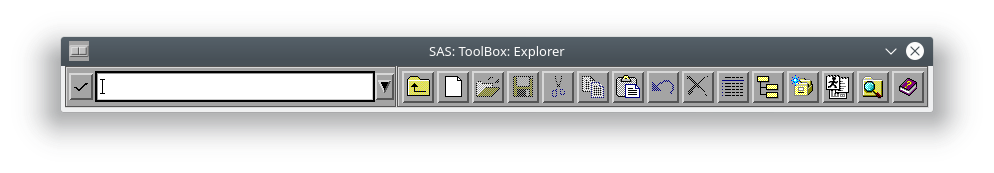


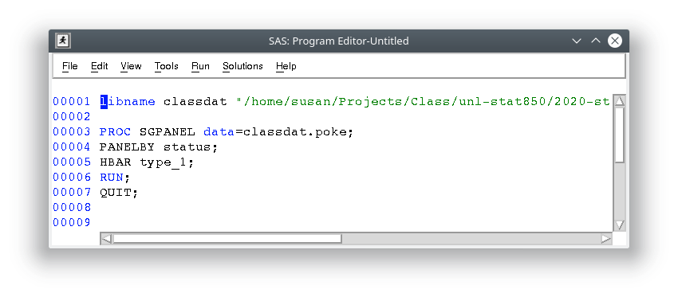

There are two different places your output may end up: if you're using the old output system, you'll get text output in the output pane.

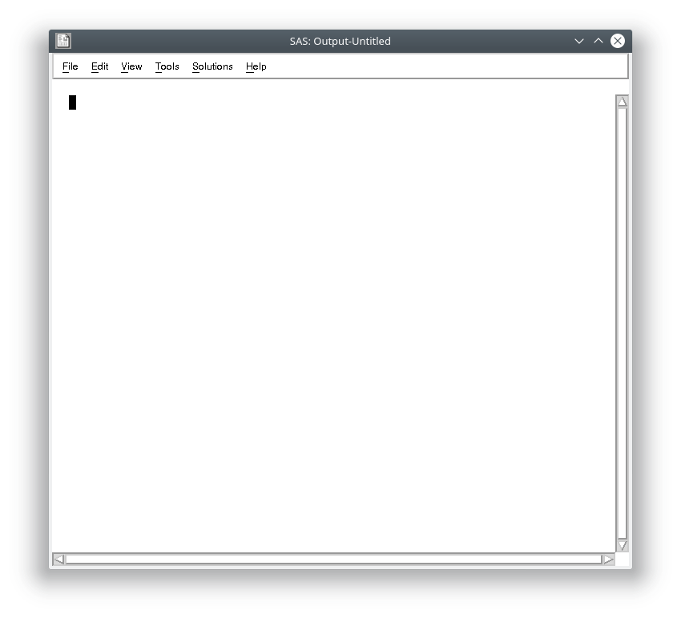

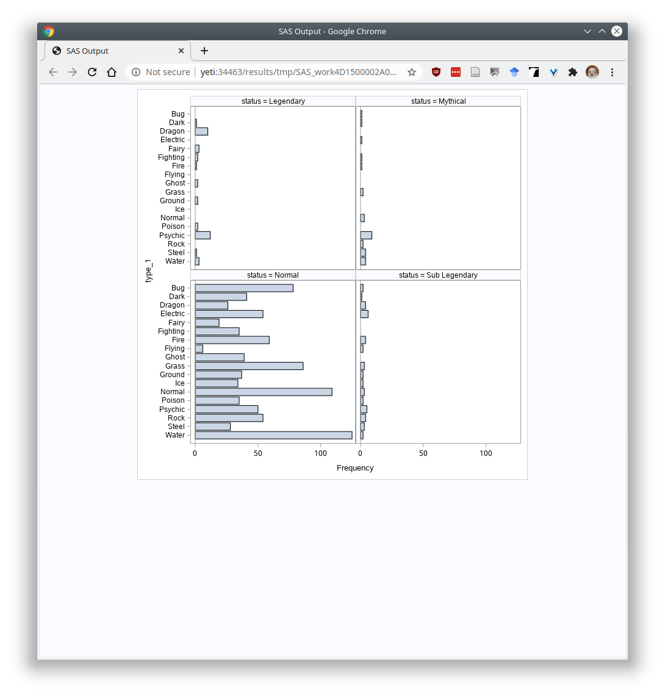

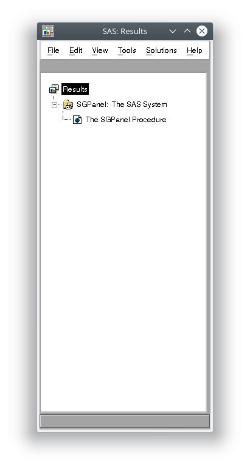

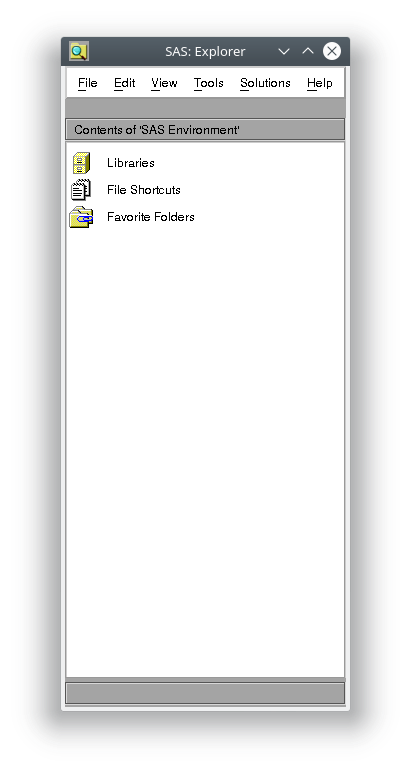

If you click on libraries, you get to this list:

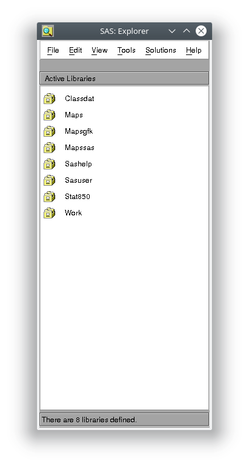

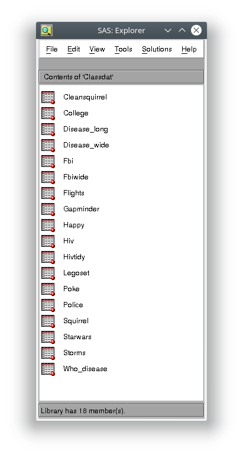


You can then click on a dataset and you will get a spreadsheet-like view. 


#### SAS Modules

SAS is a very large set of programs. In this class, we're primarily working with base SAS (the underlying language and interpreter), SAS/STAT (the statistical procedures, like PROC GLM), and SAS/IML, which is SAS's version of a scripting language. IML allows you to implement your own procedures "from scratch". 

Initially, we'll primarily focus on SAS/IML, because it contains information parallel to what you need to know to start programming in R. It's easier to teach general programming concepts at the same time, even if your typical SAS course would probably introduce you to the DATA step and simple PROC statements first. 

### Version Control with Git

This section discusses what version control and git are. For information on how to actually USE git, see this [subsection](#Using-Version-Control).


Git is a program whose primary purpose is **version control**. Git tracks changes to each file that it is told to monitor, and as the files change, you provide short labels describing what the changes were and why they exist (called "commits"). The log of these changes (along with the file history) is called your git commit history. 

When writing papers, this means you can cut material out freely, so long as the paper is being tracked by git - you can always go back and get that paragraph you cut out if you need to. You also don't have to rename files - you can confidently overwrite your files, so long as you remember to commit frequently. 

The git material in this chapter is just going to link directly to the book "Happy Git with R" by Jenny Bryan. It's amazing, amusing, and generally well written. I'm not going to try to do better. 

[Go read Chapter 1, if you haven't already.](https://happygitwithr.com/big-picture.html)

#### Git and Github

<details><summary>Slightly crude (but memorable) analogy (don't click if you're offended by PG13/R rated stuff)</summary>
Git is to GitHub what Porn is to PornHub. Specifically, GitHub hosts git repositories publicly, while PornHub hosts porn publicly. But it would be silly to equate porn and PornHub, and it's similarly silly to think of GitHub as the only place you can use git repositories.
</details>

Git is a program that runs on your machine and keeps track of changes to files that you tell it to monitor. GitHub is a website that hosts people's git repositories. You can use git without GitHub, but you can't use GitHub without git. 

If you want, you can hook Git up to GitHub, and make a copy of your local git repository that lives in the cloud. Then, if you configure things correctly, your local repository will talk to GitHub without too much trouble. Using Github with Git allows you to **easily make a cloud backup of your important code**, so that even if your  computer suddenly catches on fire, all of your important code files exist somewhere else. 

Remember: any data you don't have in 3 different places is data you don't care about.^[Yes, I'm aware that this sounds paranoid. It's been a very rare occasion that I've needed to restore something from another backup. You don't want to take chances. I knew a guy who had to retype his entire masters thesis from the printed out version the night before it was due because he had stored it on a network drive that was decommissioned. You don't want to be that person.]

### LaTeX

LaTeX is a typesetting program, which makes it different from most other document creation software, such as MS Word, which is "WYSIWYG" - what you see is what you get. In LaTeX, you'll type in code to create a document, and LaTeX will compile the document into something pretty. The goal is that you have to think less about formatting and what goes on which page - LaTeX will handle that part for you - so that you can think more about the content.

<details><summary>Why use LaTeX?</summary>
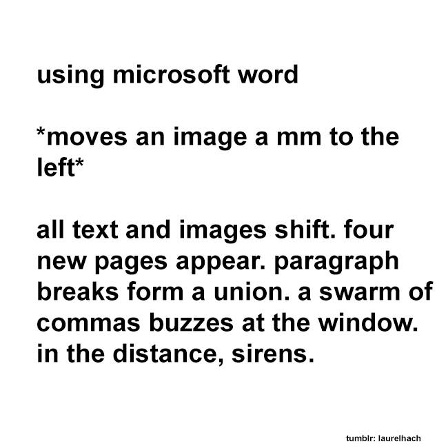

(shamelessly stolen from FB, which apparently stole it from Tumblr)

Latex is meant for you to focus on the content and not worry about the formatting - the computer optimizes figure placement according to directives you've given. 
</details>

In practice, it doesn't usually work out like that, so there are programs like markdown which aim to simplify document creation even more to free you from the formatting that LaTeX requires. 

LaTeX is often used for typesetting statistical and mathematical papers because its equation editor is top notch. (It was actually written by Donald Knuth because he got so annoyed trying to write his dissertation that he took some time off to write TeX first, and then used it to write his dissertation).^[Amusingly, `knitr` was written in much the same manner. Yihui Xie had to substitute-teach ISU's version of 850 on the day we covered Sweave (a predecessor to knitr). He got so frustrated teaching the class that he went home and started writing `knitr`. Later, he developed Rmarkdown, bookdown, blogdown, and several other packages aimed at making writing documents + code easier to handle.    
Moral of the story - if you get frustrated with the tools you have, you're in good company. Use it as fuel to make better tools.] 

### Markdown

We'll work with LaTeX later in the semester, but for now, we'll be primarily working with Markdown, which is much simpler. [Here's a quick cheatsheet](https://rmarkdown.rstudio.com/authoring_basics.html). 

When you use markdown within RStudio, you don't have to worry about where pandoc lives on your computer (e.g. the path). You can just click the button at the top of the file that says "Knit" or "Preview" to see what your file looks like.


## Some Computer Basics

### File Systems

File systems control how data is stored and accessed on your computer. You might be familiar with acronyms like NTFS, FAT32, etc. - basically, these systems help make sense of the storage on your computer, tracking where files start and end, how much space is left, directory structures, and so on.

For this class, it will probably be important to distinguish between local file storage (your C:/ drive on <i class="fab fa-windows"></i>, /user/your-name/ on <i class="fab fa-apple"></i>, or /home/your-name/ on <i class="fab fa-linux"></i>) and network/virtual file systems, such as OneDrive and iCloud. 

You want to save your files in this class to your physical hard drive. This will save you a lot of troubleshooting time.


### System Paths

When you install software, it is saved in a specific location on your computer, like C:/Program Files/ on <i class="fab fa-windows"></i>, /Applications/ on <i class="fab fa-apple"></i>, or /usr/local/bin/ on <i class="fab fa-linux"></i>. For the most part, you don't need to keep track of where programs are installed, because the install process (usually) automatically creates icons on your desktop or in your start menu, and you find your programs there.

Unfortunately, that isn't sufficient when you're programming, because you may need to know where a program is in order to reference that program -- for instance, if you need to pop open a browser window as part of your program, you're going to have to tell your computer where that browser executable file lives.

To simplify this process, operating systems have what's known as a "system path" or "user path" - a list of folders containing important places to look for executable and other important files. You may, at some point, have to edit your system path to add a new folder to it, making the executable files within that folder more easily available. [This](https://superuser.com/a/284361/391106) explanation of how to set system paths may be useful if it comes up; an additional (slightly different) explanation [here](https://gist.github.com/nex3/c395b2f8fd4b02068be37c961301caa7) may also help. Additional examples are available [<i class="fab fa-windows"></i> here](https://miktex.org/howto/modify-path), [<i class="fab fa-apple"></i> here](https://osxdaily.com/2014/08/14/add-new-path-to-path-command-line/), and [<i class="fab fa-linux"></i> here](https://linuxize.com/post/how-to-add-directory-to-path-in-linux/). 

If you run across an error that says something along the lines of 

- could not locate xxx.exe
- The system cannot find the path specified
- Command Not Found

you might start thinking about whether your system path is set correctly for what you're trying to do. 

If you want to locate where an executable is found (in this example, we'll use `git`), you can run `where git` on windows, or `which git` on OSX/Linux. 

Some programs, like RStudio, have places where you can set the locations of common dependencies. If you go to Tools > Global Options > Git/SVN, you can set the path to git. 

### Working Directories

When you launch a program, that program starts up with a specific directory as its "location" - the place where it will look for files. Most of the time, we don't think too much about this when using graphical programs, but it's much more important to get this right when programming things ourselves.

In RStudio, you can set your working directory in several ways:

1. Work in an RStudio Project (File > New Project), which will make it easy to access your project folder, and will set your working directory to the right folder automatically. I've created a project in `/home/susan/Projects/Class/unl-stat850/test-project`    
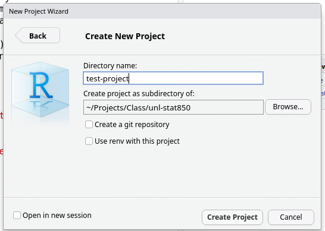

2. Use `setwd()` to set your working directory. If I'm not working in the RStudio project described above, I can set my working directory to that folder using:
`setwd("/home/susan/Projects/Class/unl-stat850/test-project")`

3. Use the files tab (bottom right) to navigate to your preferred folder. Then, click More > Set As Working Directory.

In SAS, you can set your working directory in the Program Editor, Log, or Explorer windows by clicking on Tools > Options > Change Directory, navigating to your preferred directory, and clicking ok.

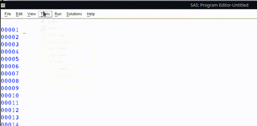


In this class, we're going to focus on reproducibility - making sure your code runs on any other computer with the right project setup. So with that in mind:

1. Work in projects
2. Store your data in your project folder
3. Use local paths - if you're in your project folder and trying to reference "data.xls", then you would just use "data.xls" as the path. If your data is in a "code" folder, you would use "code/data.xls" as the path.

This will ensure that your code should work on any other machine, as long as your data is in your git repository and your code uses local file paths.

In SAS, you'll want to store your .sas code file in the RStudio project folder as well, and I believe that should be sufficient to set your working directory for any SAS code you may write as part of e.g. a homework assignment.

## Using Version Control (with RStudio)


I've set this class up so that you'll be using version control from the very beginning. Not only will  this help you to learn good habits, it will also give you a platform for collaboration, hosting your work online, and more. 

In this class, we'll be using Github Classroom. Basically, this allows me to set up a template repository for each assignment. You'll accept the assignment, which will create a copy of the repository on your GitHub account, and then your work will be saved to your repository using a fairly standard workflow which will be discussed  below. When you submit your assignment, you'll copy the link to the commit you want to be graded, and upload that to Canvas. I will clone your repository, compile your files (I'll change the SAS path if necessary), and grade the compiled result. 

So, what does your typical git/GitHub workflow look like? I'll go through this in (roughly) chronological order. This is primarily my higher-level understanding of git - I do not have any idea how it works on the backend, but I'm pretty comfortable with the clone/push/pull/commit/add workflows, and I've used a few of the more complicated features (branches, pull requests) on occasion. 

### Create a Repository

**Repositories** are single-project containers. You may have code, documentation, data, TODO lists, and more associated with a project. 

To create a repository, you can start with your local computer first, or you can start with the online repository first. 

::: .watch-out
Both methods are relatively simple, but the options you choose depend on which method you're using, so be careful not to get them confused. 
:::

#### Local repository first

Let's suppose you already have a folder on your machine named `hello-world-1` (you may want to create this folder now). You've created a starter document, say, a text file named README with "hello world" written in it. 

If you want, you can use the following R code to set this up:

```{r git-local-repository-first, eval = F}
dir <- "./hello-world-1"
if (!dir.exists(dir)) {
  dir.create(dir)
}
file <- file.path(dir, "README")
if (!file.exists(file)) {
  writeLines("hello world", con = file)
}
```

To create a local git repository, we can go to the terminal (in Mac/Linux) or the git bash shell (in Windows), navigate to our repository folder (not shown, will be different on each computer), and type in 

```
git init
```

Alternately, if you prefer a GUI (graphical user interface) approach, that will work too:

1. Open Rstudio
2. Project (upper right corner) -> New Project -> Existing Directory. Navigate to the directory.
3. (In your new project) Tools -> Project options -> Git/SVN -> select git from the dropdown, initialize new repository. RStudio will  need to restart.
4. Navigate to your new Git tab on the top right.


The next step is to add our file to the repository. 

Using the command line, you can type in `git add README` (this tells git to track the file) and then commit your changes (enter them into the record) using `git commit -m "Add readme file"`.

Using the GUI, you navigate to the git pane, check the box next to the README file, click the Commit button, write a message ("Add readme file"), and click the commit button. 


The final step is to create a corresponding repository on GitHub. Navigate to your GitHub profile and make sure you're logged in. Create a new repository using the "New" button. Name your  repository whatever you want, fill in the description if you want (this can help you later, if you forget what exactly a certain repo was *for*), and DO NOT add a README, license file, or anything else (if you do, you will have a bad  time). 

You'll be taken to your empty repository, and git will provide you the lines to paste into your git shell (or terminal) -- you can access this within RStudio, as shown below. Paste those lines in, and you'll be good to  go.


####  GitHub repository first

In the GitHub-first method, you'll create a repository in GitHub and then clone it to your local machine (clone = create an exact copy locally). 

GUI method:

1. Log into GitHub and create a new repository
2. Initialize your repository with a README
3. Copy the repository location by clicking on the "Code" button on the repo homepage
4. Open RStudio -> Project -> New Project -> From version control. Paste your repository URL into the box. Hit enter.
5. Make a change to the README file
6. Click commit, then push your changes
7. Check that the remote repository (Github) updated


Command line method:

1. Log into GitHub and create a new repository
2. Initialize your repository with a README
3. Copy the repository location by clicking on the "Code" button on the repo homepage
4. Navigate to the location you want your repository to live on your machine.
5. Clone the repository by using the git shell or terminal: `git clone <your repo url here>`. In my case, this looks like `git clone git@github.com:stat850-unl/hello-world-2.git`
6. Make a change to your README file and save the change
7. Commit your changes: `git commit -a -m "change readme"` (-a = all, that is, any  changed file git is already tracking).
8. Push your changes to the remote (GitHub) repository and check that the repo has updated: `git push`

### Adding files

`git add` tells git that you want it to track a particular file. 

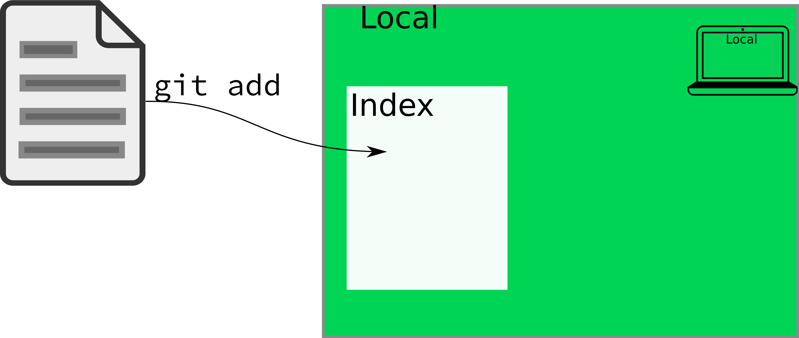

You don't need to understand exactly what git is doing on the backend, but it is important to know that the actual **contents** of the file aren't logged by `git add` - you have to **commit** your changes for the contents to change. `git add` deals solely with the index of files that git "knows about", and what it thinks belongs in each commit. 

If you use the RStudio GUI for your git interface, you generally won't have to do much with git add; it's (sort-of, kind-of) equivalent to clicking the check box.

#### What files should I add to git?

Git is built for tracking text files. It  will (begrudgingly) deal with small binary files (e.g. images, PDFs) without complaining too much, but it is NOT meant for storing large files, and GitHub will not allow you to push anything that has a file larger than 100MB^[Yes, I'm seriously pushing it with this book; several of the datasets are ~30 MB]. Larger files can be handled with git-lfs (large file storage), but storing large files online is not something you can get for free.

In general, you should only add a file to git if you created it by hand. If you compiled the result, that should  not be in the git repository under normal conditions (there are exceptions to this rule -- this book is hosted on GitHub, which means I've pushed the compiled book to the GitHub repository). 

You should also be  cautious about adding files like .Rprog, .directory, .DS_Store, etc. These files are used by your operating system or by RStudio, and pushing them may cause problems for your collaborators (if you're collaborating). Tracking changes to  these files also doesn't really do much good.

I **highly** recommend that you make a point to only add and commit files which you consciously want to track. 

### Staging your changes

In RStudio,  when you check a box next to the file name in the git tab, you are effectively adding the file (if it is not already added) AND staging all of the changes you've made to the file. In practice, `git add` will both add and stage all of the changes to any given file, but it is also useful in some cases to stage only certain lines from a file.

More formally, **staging** is saying "I'd like these changes to be added to the current version, I think". Before you **commit** your changes, you have to first **stage** them. You can think of this like going to the grocery store: you have items in your cart, but you can put them back at any point before checkout. Staging changes is like adding items to your cart; committing those changes is like checking out.

Individually staging lines of a file is most useful in situations where you've made changes which should be part of multiple commits. To stage individual lines of a file, you can use `git add -i` at the command line, or you can attempt to use RStudio's "stage selection" interface. Both  will work, though git can't always separate changes quite as finely as you might want (and as a result, RStudio's interface sometimes seems  unresponsive, even though the underlying issue is with what git can do).


### Committing your changes

A git **commit** is the equivalent of a log entry - it tells git to record the state of the file, along with a message about what that state means. On the back end, git will save a copy of the file in its current state to its cache. 


In general, you want your commit message to be relatively short, but also informative. The best way to do this is to commit **small** blocks of changes. Work to commit  every time you've accomplished a small task. This will do two things: 

1. You'll have small, bite-sized changes that are briefly described  to serve as a record of what you've done (and what still needs doing)
2. When you mess up (or end up in a merge conflict) you will have a much easier time pinpointing the spot where things went bad, what code was there before, and (because you have nice, descriptive commit messages) how the error occurred.

### Pushing and Pulling

When you're working alone, you generally won't need to worry about having to update your local copy of the repository (unless you're using multiple machines). However, statistics  is collaborative, and one of the most powerful parts of git is that you can use it to keep track of changes when multiple people are working on the same document. 

::: .watch-out
If you are working collaboratively and you and your collaborator are working on the same file, git will be able to resolve the change you make SO LONG AS YOU'RE NOT EDITING THE SAME LINE. Git works based on lines of text - it detects when there is a change in any line of a text document.

For this reason, I find it makes my life easier to put each sentence on a separate line, so that I can tweak things with fewer merge conflicts. Merge conflicts aren't a huge deal, but they slow the workflow down, and are best avoided where possible. 
:::

**Pulling** describes the process of updating your local copy of the repository (the copy on your computer) with the files that are "in the cloud" (on GitHub). `git pull` (or using the Pull button in RStudio) will perform this update for you. If you are working with collaborators in real time, it is good practice to pull, commit, and push often, because  this vastly reduces the merge conflict potential (and the scope of any conflicts that do pop up). 

**Pushing** describes the process of updating the copy of the repository on another machine (e.g. on GitHub) so that it has the most recent changes you've made to your machine. 

 

In general, your workflow will be 

1. Clone the project or create a new repository
2. Make some changes
3. Stage the changes with git add
4. Commit the changes with git commit
5. Pull any changes from the remote repository
6. Resolve any merge conflicts
7. Push the changes (and merged files) with git push

If you're working alone, steps 5 and 6 are not likely to be necessary, but it is good practice to just pull before you push anyways.

## Topic Sequencing {.note}

In several places in this class, you'll have to use material that you haven't been formally taught yet. I will do my absolute best to provide thorough instructions, help you along as much as I can, and generally provide enough support that you can muddle through. But it's going to be hard to teach you everything you need to e.g. analyze some data, before providing you the opportunity to SEE that data using visualization packages. And it's silly to teach you plotting before you know how to read data in. But to teach you how to read data in, you need to be able to take a look at the data, and plots are the best way to do that. To do any of this stuff, you need to know about functions, but it can be easier to figure out how to run a function than to write a function. 

You see my problem.

So instead, what I'm going to do is to leave you lots of comments as to what a piece of code does when I'm using things you haven't been formally shown yet. Then, you can copy/paste/modify those pieces of code, and if they break, you can ask why and we'll dig into it (breaking code is usually a good thing, because it means you're learning how to program). For each chapter, focus on learning how to write code that accomplishes that chapter's objectives. If you understand some of the code you're modifying that covers other topics not in that chapter, so much the better. But it's not an expectation or a requirement.

If you're confused, please post on the class message boards so that those who have seen this material before can help you out.

- [SAS quick start guide](https://towardsdatascience.com/getting-started-with-sas-beginner-354a94a48f08)
- [R quick start guide](https://www.statmethods.net/)

## References

- [Happy Git and GitHub for the useR](https://happygitwithr.com/index.html) - Guide to using git, R, and RStudio together. 

- [Git "Hello World" Tutorial on GitHub](https://guides.github.com/activities/hello-world/)

- [Crash course on git](https://www.youtube.com/watch?v=SWYqp7iY_Tc) (30 minute YouTube video)

- [Git and GitHub for poets](https://www.youtube.com/watch?v=BCQHnlnPusY&list=PLRqwX-V7Uu6ZF9C0YMKuns9sLDzK6zoiV) YouTube playlist (this is supposed to be the best introduction to Git out there...)

- [More advanced git concepts, in comic form](https://dev.to/erikaheidi/stage-commit-push-a-git-story-comic-a37), by Erika Heidi


