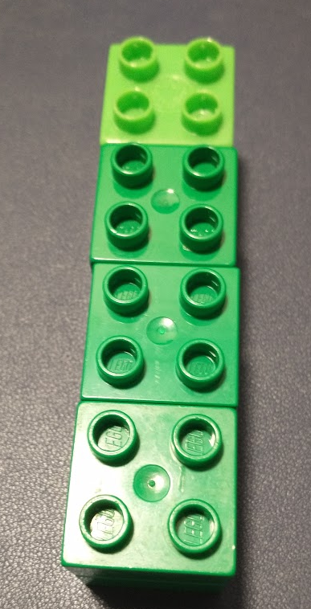
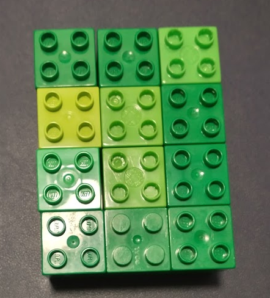

# Introduction to Statistical Programming {#intro-prog}


The only way to learn how to program effectively is to take something that works, break it, and then fix it again. There's plenty of theory and you should definitely learn that, but fundamentally, if you are not regularly breaking code, you're probably not programming. 

```{r out.width = "50%", fig.cap = "This is basically the class summarized, in meme format. ", echo = F}
knitr::include_graphics('image/learning_to_code_Orly.jpeg')
```

The goal for this chapter (and several chapters to come) is that you can modify example code and adapt it to the problem at hand. This is the best way to learn how to program, but it means you may break the code and not know how to fix it. If that happens, please try the following steps:

1. Google the error and see if you can understand why it happened.
2. Consult with a classmate to see if they can understand where things broke.
3. Post to the discussion board and see if anyone in the class can understand where things broke.    
(When you do this, post all of the code relevant to the problem, and the error you're getting, so that your classmates can replicate the problem)

If you do not hopelessly break code during this chapter, then please do your best to help others who may not have previously programmed (or previously programmed in these languages). While writing this chapter, I came across about 10 errors in SAS that I'd never encountered before. 

If all else fails, while you're waiting for someone to help you figure out what an error message means... [try this approach](https://xkcd.com/1024/).

## Module Objectives {-}

- Identify variable types, data structures, and common reserved words in R and SAS
- Use control structures (loops and conditionals) effectively
- Use matrix algebra functionality in R and SAS to perform basic calculations

More informally, the goal is to get familiar with the basics of each programming language.


## Definitions {-}

Many programming resources talk about 3, or 5, or 10 core concepts in any programming language. In this module, we're going to discuss the generic concepts, and then how these concepts are implemented in R and SAS.

Interestingly, the "core concepts" aren't necessarily the same across lists. So, here is a consensus list of concepts which are generic across languages and usually important:

1. **Variables** - a symbolic name or reference to some kind of information. In the expression `a + b > a`, both `a` and `b` are variables. Variables may have a specific type (what data can be stored in the variable), scope (where the variable can be accessed), location (in memory). [Here](https://dev.to/lucpattyn/basic-programming-concepts-for-beginners-2o73) is a nice explanation of the difference between variables in programming and variables in math.

2. **Conditional statements** (if statements) - These statements allow the program to handle information adaptively - if a statement is true, one set of instructions will be used, and if the statement is false, a different set of instructions will be used.

3. **Looping and iteration** - An iteration is any time a sequence of steps is executed. Most languages have several different types of loops or iteration: `for` loops, which allow for the sequence of steps to be executed a specific number of times, `while` loops, which allow for the sequence of steps to be executed while a conditional statement is true, `recursion`, where a block of code calls itself.

4. **Data types and data structures** - these concepts determine what information a variable can hold. Data types are lower-level, simple objects (floating-point numbers, integers, boolean T/F, characters, strings). Data structures may include lists (sequences of many objects) and vectors (sequences of many objects of the same type), dictionaries (a list of key-value pairs), objects (data structures which may hold multiple related pieces of information). 

5. **Functions**, or self-contained modules of code that accomplish a particular task. 

6. **Syntax**, the set of rules that define which combinations of symbols consist of correctly structured and interpretable commands in the language.

7. **Tools**, the set of external programs which may help with development and writing code. Some common tools are IDEs (Integrated Development Environments), which may correct syntax and typos, organize files for you, allow you to keep track of which variables you have defined, and assist you with code organization and navigation. Other tools include compilers (which take human-written code and translate it into efficient machine code), version control systems (which help you track changes to code over time), debuggers, and documentation generators. Not all of these tools are necessary for all languages - scripting languages such as python and R do not require compilers by default, for instance.  

8. **Sequence of commands**: It's important to have the right commands in the right order. Some recipes, like bread dough, are flexible, and you can add the ingredients in almost any order, but in other recipes, the order matters as much as the correct quantity of ingredients (try putting the cheese powder in before the noodles are boiled when making macaroni and cheese. Yuck.). Programming tends to be like these less flexible recipes. 


## Statistical Programming Languages {-}

Having established the generic definitions of the concepts which apply to almost any programming language, we now must examine how R and SAS implement these concepts. R and SAS are both statistical programming languages - they are specifically designed to work with data, which means that they make compromises that other languages do not in order to make it easier to write code where the data (rather than the functions, classes, methods, or objects) are the primary concern.

Both [R](https://bookdown.org/rdpeng/rprogdatascience/history-and-overview-of-r.html) and [SAS](https://en.wikipedia.org/wiki/SAS_(software)#History) have long histories. SAS in particular dates back to the 1960s, and has syntax which is unique compared to more modern languages such as C, python, Java, and R. R's predecessor, S, dates back to 1976 and was designed for internal use at Bell Labs. The histories of both languages are useful in understanding why they are useful for their respective tasks, but are not essential for this course (so read them at your leisure).

The biggest difference between R and SAS (at a fundamental level) is that R is a [**functional** language](http://adv-r.had.co.nz/Functional-programming.html) - it consists mainly of functions, which can (and do) manipulate objects, including other functions. SAS, on the other hand, is a procedural language - most SAS programs follow a specific series of steps, known as "proc"s. Procs are essentially functions (or compositions of multiple functions), but in SAS, it is simpler to think of an analysis as a series of procedural steps; in R, there are steps, but they may be implemented in a more flexible way (depending on the analysis). Another interesting feature of SAS is that it's really several languages - some commands work in PROC IML (interactive matrix language) but not in a DATA step. When looking for help in SAS, make sure you're referencing the correct part of the language documentation.

::: learn-more
**Basic Syntax and Cheatsheets**

- [SAS Cheatsheet (from another class like this)](https://sites.ualberta.ca/~ahamann/teaching/renr480/SAS-Cheat.pdf)
- [SAS Cheatsheet (by SAS)](https://support.sas.com/content/dam/SAS/support/en/books/data/base-syntax-ref.pdf)
- [R Cheatsheet](https://rstudio.com/wp-content/uploads/2016/10/r-cheat-sheet-3.pdf) - this is a simplified cheat sheet offered by RStudio. 
- [R Cheatsheet (classic)](https://cran.r-project.org/doc/contrib/Short-refcard.pdf)
- [SAS Programming for R Users (free book)](https://support.sas.com/content/dam/SAS/support/en/books/free-books/sas-programming-for-r-users.pdf)

I kept the classic R reference card by my computer for about 5 years, and referenced it at least once or twice a day for that entire period. There will be other cheat sheets and reference cards scattered through this book because if you can't remember something's name, you might be able to remember where it is on the reference card (or at least, that's how I learned R).

:::


## Variable types

Variable types are sufficiently different in R and SAS that we will cover R first, then SAS. For a general overview, though, [this video, titled 'Why TRUE + TRUE = 2'](https://youtu.be/6otW6OXjR8c?list=PL96C35uN7xGLLeET0dOWaKHkAlPsrkcha) is an excellent introduction. 

### R

In R, there are 4 commonly-used types: 

| Type | Description | 
| ---- | ----------- | 
| character | holds text-based information: "abcd" or "3.24a" are examples of values which would be stored as characters in R| 
| logical | holds binary information: 0/1, or FALSE/TRUE. Logical variables are stored as single bit information (e.g. either a 0 or 1), but display as TRUE and FALSE (which are reserved words and constants). | 
| integer | holds (as you might expect) integers. Note that integers are handled differently than doubles (floating point numbers), but in general, R will implicitly convert integers to doubles to avoid common pitfalls with integer divison (which does not allow for decimals). | 
| double | holds floating point numbers. By default, most numeric variables in R are doubles.| 


You can test to see whether a variable holds a value of a specific type using the `is.xxx()` functions, which are demonstrated below. You can convert a variable of one type to another with `as.xxx()` functions. You can test what type a variable is using `typeof()`.

::: note
Note that `<-` is used for assigning a value to a variable. So `x <- "R is awesome"` is read "x gets 'R is awesome'" or "x is assigned the value 'R is awesome'". 
:::

<details><summary>Character variables</summary>
```{r is-fcns-char}
x <- "R is awesome"
typeof(x)
is.character(x)
is.logical(x)
is.integer(x)
is.double(x)
```
</details>

<details><summary>Logical Variables</summary>
```{r is-fcns-lgl}
x <- FALSE
typeof(x)
is.character(x)
is.logical(x)
is.integer(x)
is.double(x)
```
It is possible to use the shorthand `F` and `T`, but be careful with this, because `F` and `T` are not reserved, and other information can be stored within them.
</details>

<details><summary>Integer Variables</summary>
```{r is-fcns-int}
x <- 2
typeof(x)
is.character(x)
is.logical(x)
is.integer(x)
is.double(x)
```

Wait, 2 is an integer, right?

2 is an integer, but in R, values are assumed to be doubles unless specified. So if we want R to treat 2 as an integer, we need to specify that it is an integer specifically. 

```{r is-fcns-int2}
x <- 2L # The L immediately after the 2 indicates that it is an integer.
typeof(x)
is.character(x)
is.logical(x)
is.integer(x)
is.double(x)
is.numeric(x)
```
</details>

<details><summary>Double Variables</summary>
```{r is-fcns-dbl}
x <- 2.45
typeof(x)
is.character(x)
is.logical(x)
is.integer(x)
is.double(x)
is.numeric(x)
```
</details>

<details><summary>Numeric Variables</summary>
A fifth common "type"^[`numeric` is not really a type, it's a mode. Run `?mode` for more information.], `numeric` is really the union of two types: integer and double, and you may come across it when using `str()` or `mode()`, which are similar to `typeof()` but do not quite do the same thing. The `numeric` category exists because when doing math, we can add an integer and a double, but adding an integer and a string is ... trickier. Testing for numeric variables guarantees that we'll be able to do math with those variables. `is.numeric()` and `as.numeric()` work as you would expect them to work.

The general case of this property of a language is called **implicit type conversion** - that is, R will implicitly (behind the scenes) convert your integer to a double and then add the other double, so that the result is unambiguously a double. 
</details>

#### Type Conversions
R will generally work hard to seamlessly convert variables to different types. So, for instance, 
```{r, error = T}
TRUE + 2

2L + 3.1415

"abcd" + 3
```

This conversion doesn't always work - there's no clear way to make "abcd" into a number we could use in addition. So instead, R will issue an error. This error pops up frequently when something went wrong with data import and all of a sudden you just tried to take the mean of a set of string/character variables. Whoops.

When you want to, you can also use `as.xxx()` to make the type conversion **explicit**. So, the analogue of the code above, with explicit conversions would be: 

```{r, error = T}
as.double(TRUE) + 2

as.double(2L) + 3.1415

as.numeric("abcd") + 3
```

When we make our intent explicit (convert "abcd" to a numeric variable) we get an NA - a missing value. There's still no easy way to figure out where "abcd" is on a number line, but our math will still have a result - NA + 3 is NA.

If you are unsure what the type of a variable is, use the `typeof()` function to find out. 

```{r}
w <- "a string"
x <- 3L
y <- 3.1415
z <- FALSE

typeof(w)
typeof(x)
typeof(y)
typeof(z)

```


#### Factors {#introfactors}

In R, there is one other type of variable to know about, and that is a factor. Factors are basically labeled integers. Instead of storing the data as a string or character, R instead stores the data as a series of integers, and then stores a separate table mapping the integers to labels. This is technically more efficient, but it is also (and this is the technical term) a pain in the ass. 

Factors are the default way to store characters for most base R functions. Or rather, they were. In R 4.0, the default way to read data in will change from `stringsAsFactors = T` to `stringsAsFactors = F`.^[You can read about why factors aren't ideal [here](https://developer.r-project.org/Blog/public/2020/02/16/stringsasfactors/index.html)]

::: example
<details><summary>Factors example</summary>
Let's look at the names of the months:
```{r}
month.name

df <- data.frame(num = 1:12, name = month.name, stringsAsFactors = T)
# I'm putting the argument in so that this is still relevant when everyone switches to R 4.0
# Even with stringsAsFactors = F, factors are still useful and we still need to work with them.

str(df)
```

Notice that as soon as we make that data.frame, the months are converted into a factor variable? The other big problem is that the order of the factor levels is ... not what we'd normally want. We don't want alphabetical ordering of month names - they have a different, implicit, and natural order.

To fix this, we can explicitly specify that we're dealing with a factor, and what we want the levels to be. If you specify the levels manually (instead of letting R do the work for you) then you get to determine the order. 
```{r}
month_fct <- factor(month.name, levels = month.name)
str(month_fct)
```

We can even be more explicit: 

```{r}
month_fct <- factor(month.name, levels = month.name, ordered = T)
str(month_fct)
```

Making the factor ordered lets us explicitly say which levels are less than other levels.

Factors are technically integers, with labels that are stored as an attribute. That doesn't mean you can do math with them, though. 
```{r, error = T}
month_fct[1] + month_fct[2]
```

Often, years or dates or other numeric-like information will end up as factor variables. When this happens, you need to be a little bit careful. 

```{r}
# This works pretty naturally for months, right?
as.numeric(month_fct)

yfact <- factor(2000:2020, levels = 2000:2020)
yfact
# But, this does not...
as.numeric(yfact)

as.character(yfact) # gets the labels
as.numeric(as.character(yfact)) # gets the info we want
```
When converting factors with numeric labels, you need to first convert the factor to a character, and then to a numeric variable. That will get the information you actually want back out.
</details>
:::

::: tryitout
#### Try It Out

1. Create variables `string`, `integer`, `decimal`, and `logical`, with types that match the relevant variable names.

```{r, eval = F}
string <- 
integer <- 
decimal <- 
logical <- 
```

2. Can you get rid of the error that occurs when this chunk is run?
```{r try-it-out-arithmetic, eval = F}
logical + decimal
integer + decimal
string + integer
```

3. What happens when you add string to string? logical to logical?


<details><summary>Solutions</summary>

```{r try-it-out-data-type-answers, error = T}
string <- "hi, I'm a string"
integer <- 4L
decimal <- 5.412
logical <- TRUE

logical + decimal
integer + decimal
as.numeric(string) + integer

"abcd" + "defg"
TRUE + TRUE
```

In R, adding a string to a string creates an error ("non-numeric argument to binary operator"). Adding a logical to a logical, e.g. TRUE + TRUE, results in `r TRUE + TRUE`, which is a numeric value.
</summary>
:::

### SAS

In SAS, there are two basic variable types: numeric and character variables. Thus, SAS does not differentiate between integers and floats or doubles. Functionally, though, the same basic operations can be performed in SAS. As with R, SAS does attempt to implicitly convert variable types, and will notify you that the conversion has taken place in the log file.

#### Type Conversions
SAS will attempt to implicitly convert variables when:

- a character value is assigned to a previously defined numeric variable
- a character value is used in arithmetic operations
- a character value is compared to a numeric value using a comparison operator (<, >, <=, >=)
- a character value is specified in a function that takes numeric arguments

::: note
Implicit conversion does not occur in WHERE statements. (This will make more sense later, but is here for reference)
:::

<details><summary>Manual type conversions</summary>
If you want to manually convert a value, the INPUT statement can be used. Unlike in R, the INPUT statement has the ability to read numbers which are formatted differently. For instance

```{sashtml sas-ex}
proc printto log="saslog.log" new;
data set1; /* This tells SAS we're defining some variables */
  x = 3;
  y = '3.1415';
  z = x * y; 
  /* this is arithmetic, so y will be converted */
  x = '3.14159'; 
  /* x previously had a number in it, */
  /* so it will be converted to a number here */
  zz = y<=2; 
  /* comparison operator: y will be converted */
  
  put z; /* This prints the result to the log */
  put x=;
  put zz=;
run;
```

Notice that in SAS, `zz`, which is the result of the logical statement `y<=2`, is a numeric variable. The value 0 signifies that the comparison was false. SAS does not have a logical data type, it uses the numeric variable with 0:=FALSE, 1:=TRUE.

```{r readlog-sas-ex, echo = F}
cat(readLines("saslog.log"), sep="\n")

# Do not forget to remove the log file when you are done!
unlink("saslog.log")
```
</details>


::: tryitout
#### Try it out {-}

1. Create variables `string1` and `string2` that each have text/character values. "Bob" and "Jane" might be good options. How does logical operation work with actual character values?

2. What happens if you use `string1` and add 3 to it? 

<details><summary>Solutions</summary>
```{sashtml try-it-out-data-type-answers-sas}

proc printto log="saslog.log" new;
data set1; 
  string1 = 'Bob';
  string2 = 'Jane';
  x = string1 < string2;
  put x=; /* This prints the result to the log */
run;

```

```{r readlog-sas-ex-answers, echo = F}
cat(readLines("saslog.log"), sep="\n")

# Do not forget to remove the log file when you are done!
unlink("saslog.log")
```

SAS will actually compare strings based on the first letter: Bob comes before Jane, so Bob < Jane. 


```{sashtml try-it-out-data-type-answers-sas2}
proc printto log="saslog.log" new;

data set2;
  string1 = 'Bob';
  y = string1 + 3;
  put y=;
run;
```

```{r readlog-sas-ex-answers2, echo = F}
cat(readLines("saslog.log"), sep="\n")

# Do not forget to remove the log file when you are done!
unlink("saslog.log")
```

</details>
:::

## Data structures

Data **structures** are more complex arrangements of information than single variables. Of primary interest in statistical programming are the following types of structures:

&nbsp;  | Homogeneous | Heterogeneous
-- | :---------- | :------------
1d | vector | list
2d | matrix | data frame (R) or data set (SAS)
nd | array (R) |

In the table above, homogeneous means that all entries in the structure must be of the same type. Heterogeneous means that the entries are allowed to be of different types. 

::: note
Figuring out what to call these types with two languages is hard - in SAS, an array is a group of columns of a data set, but in R, it's a multi-dimensional matrix. In this section, we'll discuss the generic concepts relevant to both languages. The differences between the two languages will be discussed as appropriate. As there are more similarities than differences, it's easier to do this in a single section rather than duplicating half of the content.
:::

### Homogeneous data structures (R and SAS)

R does not have scalar types - even single-value variables are technically vectors of length 1. SAS does have scalar types.

If we try to create a heterogeneous vector in R, using the `concatenate` function, `c()`, which combines scalar entries into a vector, what happens?

```{r data-structures-homogeneous}
c(1, 2, "a", "b", "c")
```
Because there were 3 character entries, the entire vector is now a character vector.

::: watchout
This behavior can cause some errors - for instance, R does not read in numeric data formatted with commas as numeric data. You may thus get the result

```{r data-structures-homogeneous2, error = T}
x <- c(356, 452, "1,325")
mean(x)
```

If you are reading in data from a file, this will cause some issues - the whole column of data will be formatted as characters. Keep an eye out for errors of this type. 
:::


Jenny Bryan has an excellent set of images to demonstrate [R data types as legos](https://twitter.com/JennyBryan/status/799639755344359426). She's released them under an open license, so I am shamelessly stealing them. 

Logical vector | Factor vector | Integer and Numeric vectors
-------------- | ------------- | --------------
 |  | 

These correspond to the 1-dimensional homogeneous data structures. Similarly, models can be made for 2-dimensional and 3-dimensional homogeneous data structures^[While there are both Duplo and Lego in my house, my toddler is a lot more willing to share than my husband, so Duplo will have to do.]:

Vector (1D) | Matrix (2D) | Array (3D)
----------- | ----------- | ----------
 |  | 


### Heterogeneous data structures

The heterogeneous data types are not much harder to grasp, as they're mostly different ways to combine various homogeneous data types.

#### Lists 

A **list** is, well, a list - a sequence of potentially different-typed values. Unlike when concatenating values, the `list()` command in R allows each value to keep its natural type. You can access elements of a list using `[]` (this will extract a subset of the list items) or `[[]]`, which will extract a single item from the list. (there will be more on this in the [Indexing section](#indexing) below)

<details><summary>Basic List Syntax in R</summary>
```{r list-index-demo, error = T}
x <- list("a", "b", "c", 1, 2, 3)

x
x[[3]]

x[[4]] + x[[5]]

x[1:2] # This will work

x[[1:2]] # This won't work
```
</details>

The lego version of a list looks like this: 
```{r lego-list, echo = F, out.width = "50%", fig.cap = "A list of 4 vectors. Even though the vectors in the list are all the same size in this case, they don't have to be, because they're not organized in any sort of cohesive rectangle shape. A data frame (see below) is essentially a list where all of the components are vectors or lists of the same length. "}
knitr::include_graphics("https://github.com/jennybc/lego-rstats/raw/master/lego-rstats_019.jpg?raw=TRUE")
```

<details><summary>Indexing in Lists</summary>

Some lists (and data frames) consist of named variables. These list components can be accessed either by index (as above) or by name, using the `$` operator. Names which have spaces or special characters must be enclosed in backticks (next to the 1 on the keyboard). Named components can also be accessed using the `[[ ]]` operator.

```{r list-name-demo, error = T}
dog <- list(name = "Edison Vanderplas", age = 8, 
            breed = "Jack Russell Terrorist", 
            `favorite toy` = "a blue and orange stuffed duck. Or rawhide.",
            `link(video)` = "https://youtu.be/zVeoQTOTIuQ")

dog

dog$name
dog$breed
dog$`favorite toy`
dog[["link(video)"]]
```
</details>
You can get a sense of the structure of a list (or any other object) in R using the `str()` command.

```{r list-name-str}

str(dog)

```

<details><summary>Recursive lists</summary>
Lists can also contain other lists. When accessing a list-within-a-list, just add another index or name reference (see below). 

```{r}
grocery_list <- list(
  dairy = list("asiago", "fontina", "mozzarella", "blue cheese"),
  baking = list("flour", "yeast", "salt"),
  canned_goods = list("pepperoni", "pizza sauce", "olives"),
  meat = list("bacon", "sausage", "anchovies"),
  veggies = list("bell pepper", "onion", "scallions", "tomatoes", "basil")
)

ick <- c(grocery_list[[4]][2:3], grocery_list$canned_goods[[3]])
ick

crust_ingredients <- c(grocery_list$baking, "water")
crust_ingredients

essential_toppings <- c(grocery_list$dairy[3], grocery_list$canned_goods[2])
essential_toppings

yummy_toppings <- c(grocery_list$dairy[c(1, 2, 4)], grocery_list$meat[1], grocery_list[[5]][c(3, 5)])
yummy_toppings
```
</details>

<details><summary>Basic List Syntax in SAS</summary>
There are also [lists in SAS IML](https://documentation.sas.com/?docsetId=imlug&docsetTarget=imlug_langref_sect040.htm&docsetVersion=15.1&locale=en) which function similarly to lists in R. To create a named object in a list, precede the name with `#`. In SAS, the `$` operator can be used to get items from a list, using either name or numeric references. 

```{sashtml}
proc iml;
  grocery_list = [
    #dairy  = ["asiago", "fontina", "mozzarella", "blue cheese"], 
    #baking = ["flour", "yeast", "salt"], 
    #canned = ["pepperoni", "pizza sauce", "olives"], 
    #meat   = ["bacon", "sausage", "anchovies"], 
    #veggies= ["bell pepper", "onion", "scallions", "tomatoes", "basil"]
  ];

  /* print only works on matrices and vectors */
  /* so we'll cheat and load another library to print lists */
  
  package load ListUtil;
  
  /* run ListPrint(grocery_list); */ 
  /* This would print the thing, but it's long */
  
  ick = [grocery_list$"canned"$3, grocery_list$4$2, grocery_list$4$3];
  crust = grocery_list$"baking";
  call ListAddItem(crust, "water"); /* add an item to a list */
  essential_toppings = [grocery_list$"dairy"$3, grocery_list$"canned"$2];
  yummy_toppings = [grocery_list$"dairy"$1, grocery_list$"dairy"$2, 
    grocery_list$"dairy"$4, grocery_list$"meat"$1, grocery_list$5$3] ;
  /* The || is a concatenation operator, like c(). */
  /* It is inefficient for large data sets */
  
  run ListPrint(ick);
  run ListPrint(crust);
  run ListPrint(yummy_toppings);
quit;

```
</details>

::: tryitout
##### Try it out {-}
Using the list of pizza toppings above as a starting point, make your own list of pizza toppings organized by grocery store section (approximately). Create your own vectors of yummy, essential, and ick toppings, using R and SAS.
:::


#### Data frames (R only) 

A data frame is a special type of list - one in which each element in the list is a vector of the same length. If you put these vectors side-by-side, you get a table of data that looks like a spreadsheet. 


The lego version of a data frame looks like this: 
```{r lego-df, echo = F, out.width = "50%", fig.cap = "A data frame with data frame 4 columns. A data frame is essentially a list where all of the components are vectors or lists, and are constrained to have the same length. "}
knitr::include_graphics("https://github.com/jennybc/lego-rstats/raw/master/lego-rstats_020.jpg?raw=TRUE")
```

<details><summary>Basic Data Frame Syntax</summary>
When you examine the structure of a data frame, as shown below, you get each column shown in a row, with its type and  the first few values in the column. The `head()` command shows the first 6 rows of a data frame (enough to see what's there, not enough to overflow your screen).

```{r dataframes}
head(mtcars) ## A data frame included in base R

str(mtcars)

```

You can change column values or add new columns easily using assignment. It's also easy to access specific columns to perform summary operations.

```{r dfcols-sum}
mtcars$gpm <- 1/mtcars$mpg # gpm is sometimes used to assess efficiency

summary(mtcars$gpm)
summary(mtcars$mpg)
```

Often, it is useful to know the dimensions of a data frame. The number of rows can be obtained by using `nrow(df)` and similarly, the columns can be obtained using `ncol(df)` (or, get both with `dim()`). There is also an easy way to get a summary of each column in the data frame, using `summary()`.


```{r}
summary(mtcars)
dim(mtcars)
nrow(mtcars)
ncol(mtcars)
```

Missing variables in an R data frame are indicated with NA. 
</details>

<details><summary>Creating an R data frame</summary>
```{r}
math_and_lsd <- data.frame(lsd_conc = c(1.17, 2.97, 3.26, 4.69, 5.83, 6.00, 6.41),
                           test_score = c(78.93, 58.20, 67.47, 37.47, 45.65, 32.92, 29.97))
math_and_lsd

# add a column - character vector
math_and_lsd$subjective <- c("finally coming back", "getting better", "it's totally better", "really tripping out", "is it over?", "whoa, man", "I can taste color, but I can't do math")

math_and_lsd
```
</details>

::: tryitout
##### Try it out {-}

The dataset `state.x77` contains information on US state statistics in the 1970s. By default, it is a matrix, but we can easily convert it to a data frame, as shown below. 

```{r}
data(state)
state_facts <- data.frame(state.x77)
state_facts <- cbind(state = row.names(state_facts), state_facts, stringsAsFactors = F) 
# State names were stored as row labels
# Store them in a variable instead, and add it to the data frame

row.names(state_facts) <- NULL # get rid of row names

head(state_facts)
```

1. How many rows and columns does it have? Can you find at least 3 ways to get that information?

2. The `Illiteracy` column contains the percent of the population of each state that is illiterate. Calculate the number of people in each state who are illiterate, and store that in a new column called `TotalNumIlliterate`. Note: `Population` contains the population in thousands.

3. Calculate the average population density of each state (population per square mile) and store it in a new column `PopDensity`. Using the R reference card, can you find functions that you can combine to get the state with the minimum population density?

<details><summary>Solutions</summary>
```{r}
# 3 ways to get rows and columns
str(state_facts)
dim(state_facts)
nrow(state_facts)
ncol(state_facts)

# Illiteracy
state_facts$TotalNumIlliterate <- state_facts$Population * 1e3 * (state_facts$Illiteracy/100) 

# Population Density
state_facts$PopDensity <- state_facts$Population * 1e3/state_facts$Area 
# in people per square mile

# minimum population
state_facts$state[which.min(state_facts$PopDensity)]
```
</details>
:::

##### Advanced Data Frames: Tibbles and List-columns {-}

If at this point you're bored because you've seen this material before, keep reading to find out about tibbles, list columns and other ways to make data frames even more powerful. 

<details>
<summary>Tibbles</summary>
A tibble is a fancy data frame that is optimized to work with the `tidyverse`, which is a collection of R packages that make data wrangling (getting the data clean and ready for analysis) easier. 

[You can read about tibbles [here](https://r4ds.had.co.nz/tibbles.html).]{.learn-more}
</details>

<details>
<summary>You like data frames? Lists? Let's put some lists inside a data frame! (All about list columns)</summary>

Let's start with the lego picture:


(The full explanation is available in slide form [here](https://speakerdeck.com/jennybc/data-rectangling?slide=17)). 

A list is just another object that could be stored in a data frame! It is a "generalized vector" in that each entry in a list can be thought of as another list - so a list is really a vector of lists. List-columns make it possible to store e.g. whole data sets in a nested, organized way. Another useful feature is that each entry in a list-column doesn't have to be the same length, which makes it easier to store "ragged" data. 

::: learn-more
You can see a couple of examples [here](https://jennybc.github.io/purrr-tutorial/ls13_list-columns.html) (but they assume that you know things that you'll only learn in a few modules). 
:::

</details>

#### Data Sets (SAS) {-}

The SAS data set structure is similar to a R data frame.


In SAS, missing values are indicated with `.`.

SAS datasets also come with a description which is attached to the table. The descriptor portion of the data set records names of variables (and attributes), numbers of observations, and date/time stamps of creation and updates.

<details><summary>Creating a SAS data set</summary>
In the next code chunk, we'll create a data set using a SAS Data step. We'll talk more about the anatomy of a SAS command later, but for now, notice that I'm specifying some metadata (the title), telling SAS what the variable names are (Drugs, Score), and then providing some data (indicated by the datalines statement). 
```{sashtml mj-data-step}
/* Data source: http://blog.yhat.com/posts/7-funny-datasets.html */
data mathMJ;
title 'Average math test scores under the influence of LSD';
input Drugs	Score;
datalines;
1.17 78.93
2.97 58.20
3.26 67.47
4.69 37.47
5.83 45.65
6.00 32.92
6.41 29.97
;

/* Describe the dataset */
proc datasets;
  contents data = mathMJ;
run;

proc print data = mathMJ;
run;
```
The last two blocks are SAS procedures (PROCs). In the first block, I'm asking SAS to describe the contents of the mathMJ dataset. In the second block, I'm telling SAS to print the whole mathMJ dataset out. 

</details>

### Indexing

The 1, 2, and multi-dimensional homogeneous data types should be familiar from e.g. linear algebra and calculus. Single elements of a vector can be extracted using single square brackets, e.g. `x[1]` will get the first element of the vector `x`. In a matrix, elements are indexed as row, column, so to get the (2, 2) entry of a matrix x, you would use `x[2,2]`. This is extended for multi-dimensional arrays in R, with each dimension added, e.g. `x[3,1,2]` or `x[4, 3, 2, 1]`. 

To get a full row or column from a matrix (in both SAS and R) you would use `x[1,]` (get the first row) or `x[,3]` (get the 3rd column). 

To select multiple rows or columns from a matrix, you would use `x[, c(1, 3)]` in R or `x[,{1 3}]` in SAS - both options get the first and third column of the matrix, with all rows of data included.

In both R and SAS, `a:b` where a and b are numbers will form a sequence from `a` to `b` by 1s. So `1:4` is `r 1:4`. This is often used to get a set of rows or columns: `x[3:4, 1:2]`.

<details><summary>R matrix example</summary>
```{r matrix-example}
x <- matrix(1:20, nrow = 5, byrow = T) 
# Create a matrix with values 1 to 20, 5 rows, and fill by row

x

x[3:4, 1:2]
# Gets a submatrix 
```
</details>

<details><summary>SAS matrix example</summary>
In SAS, the same basic code works (though matrix definition is a bit more manual). 

```{sas matrix-example-sas}
proc iml; /* Interactive Matrix Language */
  x = {1 2 3 4 5, 6 7 8 9 10, 11 12 13 14 15, 16 17 18 19 20};
  y = x[3:4, 1:2];
  print x; /* Here, print is used instead of put */
  print y;
quit; /* exit proc IML */
```
</details>

Both R and SAS are 1-indexed languages, so the elements of a list or vector are indexed as 1, 2, 3, 4, ...  ^[Most languages are 0-indexed languages: C, C++, python, Java, javascript. Vectors in these languages are indexed as 0, 1, 2, 3.  Other 1-indexed languages include FORTRAN, Matlab, Julia, Mathematica, and Lua, many of which were intended for mathematical processing or data analysis.]

As R has logical vectors, it is possible to index a vector using a logical vector of the same length.

<div class="tryitout">
##### Try it out {-}
(From project Euler)

If we list all the natural numbers below 10 that are multiples of 3 or 5,
   we get 3, 5, 6 and 9. The sum of these multiples is 23.
Find the sum of all the multiples of 3 or 5 below 1000.


Hint: The modulo operator, `%%`, gives the integer remainder of one number
      divided by another. So `a %% b` gives the integer remainder when
      dividing `a` by `b`. Modular division is often used to find multiples
      of a number.

<details><summary>R solution</summary>
```{r vectorindexing-solution}

x <- 1:999 # all nums below 1000

m3 <- (x %% 3) == 0 # multiple of 3
m5 <- (x %% 5) == 0 # multiple of 5
m3or5 <- m3 | m5

sum(x[m3or5])
```
</details>

<details><summary>SAS solution</summary>
```{sashtml vectorindexing-solution-sas}
data tmp;
  do x = 1 to 999;
  output;
  end;
run;

proc summary data=tmp; /* Summarize data */
  where (mod(x, 3) = 0) | (mod(x, 5) = 0); 
  /* Keep only obs where x is divisible by 3 or 5 */
  
  var x; /* what variable we want the summary for */
  
  output out=sum_x sum=; /* output sum_x to a new dataset */
run;

proc print data = sum_x; /* print our sum_x dataset */
run;
```
</details>
</div>
</div>

Most complicated structures in R are actually lists underneath. You should be able to access any of the pieces of a list using a combination of named references and indexing. 

If you have trouble distinguishing between `$`, `[`, and `[[`, you're not alone. The [R for Data Science book has an excellent illustration](https://r4ds.had.co.nz/vectors.html#lists-of-condiments), which I will summarize for you here in abbreviated form (pictures directly lifted from the book). 

<details>
<summary>R4DS indexing illustration</summary>
`x` | `x[1]` | `x[[1]]` | `x[[1]][[1]]`
--- | ------ | -------- | -------------
 |  |  | 
</details>


## Control structures

### If statements

If statements are just about as simple in programming as they are in real life. 

```{r, fig.cap = "[Source](https://xkcd.com/1652/). I've actually met some programmers who talk like this in real life.", fig.align = "center", echo = F}
knitr::include_graphics("https://imgs.xkcd.com/comics/conditionals.png")
```

<details><summary>General structure of an if statement</summary>
In general, the structure of an if statement is 

````
if (condition) then {
  # do something here
} 
````

If the condition is true, the inner code will be executed. Otherwise, nothing happens.

You can add an else statement that will execute if the condition is not true

````
if (condition) then {
  # do something
} else {
  # do a different thing
}
````

And in some languages, you can even have many sets of if statements: 

```{r, eval = F}
if (condition) {
  # do something
} else if (condition 2) {
  # do something else
} else {
  # do a third thing
}
```

Note that this could also be written (perhaps more clearly) as: 

````
if (condition) {
  # do something
} else {
  if (condition 2) {
    # do something else
  } else {
    # do a third thing
  }
}
````

That is, `condition 2` is only checked once it is known that `condition` is false. Often, programmers use logic flow maps, like the one shown below, to map out a logical sequence and ensure that every possible value is handled appropriately.


</details>

<details><summary>Example: If/then logic in SAS and R</summary>
The syntax for conditional statements using if/then logic is shown below using an example where Santa must determine which members of a household will receive a toy for Christmas and which members will receive coal. ^[Traditionally, naughty children get coal, while nice children get toys or candy.]

<details><summary>In R</summary>
```{r}
tmp <- data.frame(name = c("Alex", "Edison", "Susan", "Ryan"),
                  status = c("naughty", "nice", NA, "neutral"),
                  stringsAsFactors = F)
# Santa's decision process

if (tmp$status == "naughty") {
 tmp$present <- "coal"
} else {
 tmp$present <- "toy"
}

tmp
```

What happened? 

When evaluating if statements, R does not evaluate each entry in the vector `tmp$status` separately. Instead, it takes the first value and issues a warning message. One option would be to use a loop, and examine each row in the data set separately. We'll talk about loops in the next subsection. Another option is to use the `ifelse()` function, which is `ifelse(condition, thing to do if condition is true, thing to do if condition is false)`

```{r}
tmp$present <- ifelse(tmp$status == "naughty", "coal", "toy")

tmp
```

When R evaluates a missing value, (so ? NA == "naughty"), the result is `NA`. This is fine for us - if we don't have data on whether someone is naughty or nice, maybe we don't need to give them a present at all. But "neutral" is evaluated as getting a toy. Do we want that to happen? Maybe not. We might have to nest ifelse statements to solve this issue...

```{r}
tmp$present <- ifelse(tmp$status == "naughty", 
                      "coal", 
                      ifelse(tmp$status == "nice", "toy", NA))

tmp
```
</details>

<details><summary>In SAS</summary>
In a data step:
```{sashtml}
data santa;
  input name $ status $;
  datalines;
  Edison nice
  Alex naughty
  Susan .
  Ryan neutral
;

/* Modify santa_list and make a new dataset, present_list */
data presents;
  set santa;
  if status = "naughty" then present = "coal";
  else present = "toy";
run; /* must end with run if no datalines option */

proc print data=presents;
run;
```

Note that `.`, or missing data is handled the same as 'nice'. That might not be what we wanted... this is the natural thing to do, right?

````
data santa;
  input name $ status $;
  datalines;
  Edison nice
  Alex naughty
  Susan .
  Ryan neutral
;

/* Modify santa_list and make a new dataset, present_list */
data presents;
  set santa;
  if status = "naughty" then present = "coal";
  else (if status = "nice" then present = "toy" else present = .);
run; /* must end with run if no datalines option */

proc print data=presents;
run;
````

SAS doesn't handle nested if statements very well - they can be ambiguous. Instead, [SAS documentation suggests using `do;` and `end;` to denote the start and end points of each if statement](https://documentation.sas.com/?docsetId=basess&docsetTarget=p0pcj5ajwyngron1wlsq0tet0hce.htm&docsetVersion=9.4&locale=en) (like the `{}` in R). 

```{sashtml}
data santa;
  input name $ status $;
  datalines;
  Edison nice
  Alex naughty
  Susan .
  Ryan neutral
;
data presents;
  set santa;
  if status = "naughty" then 
    do;
      present = "coal";
    end;
  else if status = "nice" then
    do;
      present = "toy";
    end;
  else 
    do;
      present = .;
    end;
run;
          
proc print data=presents;
run;
```

Interestingly, if you set a character variable to be missing, SAS converts it to '.'. So, if we actually want to have the value be missing, we can set it to an empty string.

```{sashtml}
data santa;
  input name $ status $;
  datalines;
  Edison nice
  Alex naughty
  Susan .
  Ryan neutral
;
data presents;
  set santa;
  if status = "naughty" then 
    do;
      present = "coal";
    end;
  else if status = "nice" then
    do;
      present = "toy";
    end;
  else 
    do;
      present = '';
    end;
run;
          
proc print data=presents;
run;
```

Now things work the way we expected them to work.
</details>
</details>

There are more complicated if-statement like control structures, such as switch statements, which can save time and typing. In the interests of simplicity, we will skip these for now, as any conditional can be implemented with sequences of if statements in the proper order. If you would like to read about switch statements, here are links to [SAS case statement documentation](https://documentation.sas.com/?docsetId=sqlproc&docsetTarget=n0a85s0ijz65irn1h3jtariooea5.htm&docsetVersion=9.4&locale=en) and [base R switch statement explanation](https://www.tutorialgateway.org/r-switch-statement/) and [documentation](https://www.rdocumentation.org/packages/base/versions/3.6.2/topics/switch).

<div class="tryitout">
##### Try it out {-}
The `sample()` function selects a random sample of entries from a vector. Suppose we sample a random vector $x$ with 10 entries. Write one or more if statements to fulfill the following conditions

- if $x$ is divisible by 2, $y$ should be positive; otherwise, it should be negative.
- if $x$ is divisible by 3, $y$ should have a magnitude of 2; otherwise, it should have a magnitude of 1.

It may be helpful to define separate variables `y_mag` and `y_sign` and then multiply them afterwards. Once you have found the value of $y$ compute $\text{sum}(x * y)$.

You may use the following R and SAS code skeletons to set the problem up.
```{r}
set.seed(342502837)
x <- sample(1:50, size = 20, replace = F)

# Conditional statements go here

sum(x * y)
```

````
proc iml;
  call randseed(342502837);
  x = sample(1:50, 20)`;
  create sampledata from x [colname = "x"];
  append from x;
  close;
quit;

data xy;
  set sampledata;


  /* Conditional statements go here */
  
  
  /* Leave this so that the code below works */
  res = x * y;
run;

proc summary data=xy; /* Summarize data */
  var res; /* what variable we want the summary for */
  
  output out=tmpsum sum=; /* output tmpsum to a new dataset */
run;

proc print data = xy; /* print our original dataset to check result */
  var x y res;
  sum res;
run;

proc print data = tmpsum; /* print our tmpsum dataset */
run;
````

<details><summary>R Solution</summary>
```{r}
set.seed(342502837)
x <- sample(1:50, size = 20, replace = F)

y_sign <- ifelse(x %% 2 == 0, 1, -1)
y_mag <- ifelse(x %% 3 == 0, 2, 1)
y <- y_sign * y_mag

sum(x * y)
```
</details>
<details><summary>SAS Solution</summary>

```{sashtml}
proc iml;
  call randseed(342502837);
  x = sample(1:50, 20)`;
  create sampledata from x [colname = "x"];
  append from x;
  close;
quit;

data xy;
  set sampledata;

  y_sign = 0 * x;
  y_mag = 0 * x;

  /* Conditional statements go here */
  if MOD(x, 2) = 0 then y_sign = 1; 
    else y_sign = -1;
  if MOD(x, 3) = 0 then y_mag = 2; 
    else y_mag = 1;

  y = y_sign * y_mag;
  res = x * y;
run;

proc summary data=xy; /* Summarize data */
  var res; /* what variable we want the summary for */
  
  output out=tmpsum sum=; /* output tmpsum to a new dataset */
run;


proc print data = xy; /* print our original dataset to check result */
  var x y res;
  sum res;
run;

proc print data = tmpsum; /* print our tmpsum dataset */
run;
```

See [this](https://www.oreilly.com/library/view/sas-certification-prep/9781607649243/p12osnn9d1s4hgn12yf8ffocxhw7.htm) to understand how the print statement works and how to add column summary values. 
</details>
</div>

### Loops
Often, we need to do a single task many times - for instance, we may need to calculate the average data value for each week, using daily data. Rather than typing out 52 different iterations of the same code, it is likely easier to type out one single block of code which contains the steps necessary to complete one instance of the task, and then leverage variables to ensure that each task is completed the correct number of times, using the correct inputs.

Let us start with the most generic loop written in pseudocode (code that won't work, but provides the general idea of the steps which are taken)

````
loop_invocation(iteration variable, exit condition) {
  # Steps to repeat
}
````

We use the `loop_invocation` function to indicate what type of loop we use. We have at least one `iteration variable` that indicates where in the looping process we currently are. This may be an index (if we want to do something 500 times, it would take values from 1 to 500), or it may take a more complicated sequence of values (for instance, if we are testing convergence, we might put some sort of delta variable as the iteration variable). Most loops also have an explicit exit condition that is part of the loop invocation; more rarely, a loop may depend on `break` statements that cause the control flow of the code to exit. Without some sort of exit condition, our program would run forever, which is... not optimal.


#### Count controlled loops (FOR loops)

In a for loop, the steps in the loop body repeat a specified number of times. That is, *for* each value in a sequence, the steps within the loop are repeated. 

<details><summary>Example: Santa and if/else + loops in R (plus some debugging strategies)</summary>
For instance, suppose we want to revisit our R Santa example from the previous section. The original if/else code we wrote in R didn't work, because R evaluates if statements using a single (scalar or vector of length 1) condition. If we add a loop around that code, we can evaluate only one row at a time. We need to check every row, so we'll iterate over `1:nrow(tmp)` - it's better to get the upper bound from the data frame, rather than just using 4 - if we add another entry, the code will still work if we're using `nrow(tmp)` to define how many iterations we need.

We start by defining our data frame:
```{r}
tmp <- data.frame(name = c("Alex", "Edison", "Susan", "Ryan"),
                  status = c("naughty", "nice", NA, "neutral"),
                  stringsAsFactors = F)
```

And then we add the basic loop syntax:
```{r}
for (i in 1:nrow(tmp)) {
  
}
```

For some reason, `i` is often used as the iteration variable (with `j` and `k` for nested loops). 

What this loop says is that `i` will first take on the value 1, then 2, then 3, then 4. On each iteration, `i` will advance to the next value in the vector of options we have provided. 

Now we need to add the middle part by adapting the conditional statement we used before so that it looks at only the `i`th row. I've also added the catch-all else condition that assigns NA for any value that isn't "naughty" or "nice". 

It's good practice to initialize your variable (create a column for it) ahead of time and set the variable to a default value.

```{r, error = T}

tmp$present <- NA # Initialize column and set to NA by default

for (i in 1:nrow(tmp)) {
  # Santa's decision process
  if (tmp$status[i] == "naughty") {
   tmp$present[i] <- "coal"
  } else if (tmp$status[i] == "nice") {
   tmp$present[i] <- "toy"
  } else {
    tmp$present[i] <- NA_character_ 
    # use a special NA value that has 
    # character type to avoid any issues
  }
}
```

Well, that didn't work! We can see that the loop stopped at `i = 3` by printing out the value of `i` - because the loop failed, `i` will still contain the value which caused the loop to stop. 

```{r}
i
tmp[i,] # print tmp at that point
```


Combining this information with the error above, we can guess that R stopped evaluating the loop because the if statement returned NA (missing) instead of TRUE or FALSE. 

if/else statements in R can't evaluate to `NA`, so we need to restructure our conditional statement - first, we'll test for `NA` values, then, we can test for naughty and nice, and we'll keep the catch-all statement at the bottom. We'll test for an `NA` value using the function `is.na()`.

```{r}

tmp$present <- NA # Initialize column and set to NA by default

for (i in 1:nrow(tmp)) {
  # Santa's decision process
  if (is.na(tmp$status[i])) {
    tmp$present[i] <- NA_character_
  } else if (tmp$status[i] == "naughty") {
   tmp$present[i] <- "coal"
  } else if (tmp$status[i] == "nice") {
   tmp$present[i] <- "toy"
  } else {
    tmp$present[i] <- NA_character_ 
  }
}

tmp
```

Now the if/else logic works exactly as intended. This is longer than the version using `ifelse()`, but it is perhaps more readable. 

</details>

In most cases in R and SAS, it is possible to write code without needing loops at all, because both languages are vector-based - they will often use **vectorized** functions which implicitly loop over each row without having to write a loop to do so. `ifelse()` is a vectorized version of `if() {} else {}`. 

Here is an example of the most basic for loop logic - printing the numbers 1 through 10 - in both R and SAS. SAS code is provided for both PROC IML and DATA steps.

<details><summary>For loops in R</summary>
```{r forloop}
# R Example loop
for (i in 1:10) {
  print(i)
}
```
</details>

<details><summary>"For loops" in SAS IML (using `do`)</summary>
```{sas doloop1}
/* SAS IML example loop */
proc iml;
  do i = 1 to 10;
    print i;
  end; /* This ends the loop definition */
quit;
```
</details>

<details><summary>"For loops" in a SAS DATA step</summary>
```{sas doloop2}
/* SAS DATA step example loop */
proc printto log="saslog.log" new; /* shows output log in bookdown */
data A;
  do i = 1 to 10;
    put i=;
  end; /* This ends the loop definition */
run;
```

```{r readlog-sas-doloop-answers2, echo = F}
cat(readLines("saslog.log"), sep="\n")

# Do not forget to remove the log file when you are done!
unlink("saslog.log")
```
</details>


Another explanation of for loops is available at 
[Khan Academy](https://www.khanacademy.org/computing/ap-computer-science-principles/programming-101/repetition-with-loops/a/repetition-with-for-loops?modal=1).

While the most straighforward (and common) case of for-loop use in practice is to count from 1 to N, both R and SAS allow for loops to use other sequence structures.

<details><summary>Other sequences in loops in R</summary>

R allows loops to occur over any vector... even randomly generated numbers, or nonnumeric vectors (say, a character vector of URLs).
```{r}
x <- rnorm(5) # Generate 5 normal (0,1) samples

for (i in x) {
  print(i^2)
}

```

We can also iterate by non-integer values using `seq(from = , to = , by = )`
```{r}
# This loop counts down in 1/2 units from 5 to 0
for (i in seq(5, 0, -.5)) {
  # do nothing
}
```
</details>

<details><summary>Other sequence structures in SAS for loops</summary>
We can iterate by non-integer values:
```{sas}
proc printto log="saslog.log" new; /* to shows output log in bookdown */
data A;
y = 0;
do i = 5 to 0 by -0.5;
    put i=;
  end;
run;
```

```{r, echo = F}
cat(readLines("saslog.log"), sep="\n")

# Do not forget to remove the log file when you are done!
unlink("saslog.log")
```

We can even add additional conditions:

```{sas}
proc printto log="saslog.log" new; /* to shows output log in bookdown */
data A;
y = 0;
do i = 5 to 0 by -0.5 while (i**2 > 1);
    put i=;
  end;
run;
```
```{r, echo = F}
cat(readLines("saslog.log"), sep="\n")

# Do not forget to remove the log file when you are done!
unlink("saslog.log")
```
</details>


::: tryitout
##### Try it out (in R) {-}

The `beepr` package plays sounds in R to alert you when your code has finished running (or just to annoy your friends and classmates). ([Documentation](https://www.r-project.org/nosvn/pandoc/beepr.html))
You can install the package using the following command:
```{r, eval = F}
install.packages("beepr")
```
(if you are using Linux you will also need to make sure one of `paplay`, `aplay`, or `vlc` is installed)

Load the library and write a `for` loop which plays the 10 different sounds corresponding to integers 1 through 10. 
```{r, eval = F}
library(beepr) # load the beepr library

beep(sound = 1) # sound is any integer between 1 and 10.
```

It may be helpful to add the command `Sys.sleep(5)` into your loop to space out the noises so that they can be heard individually.

<details><summary>Solution</summary>
```{r, eval = F}
library(beepr)

for (i in 1:10) {
  beep(sound = i)
  Sys.sleep(5)
}

```
</details>
:::

::: tryitout
##### Try it out (in SAS) {-}

Write a for loop which will output the first 30 [fibbonacci numbers](https://en.wikipedia.org/wiki/Fibonacci_number). You can use the following code as a starting point:

````
/* SAS IML example loop */
proc iml;
  current = 1;
  prev = 0;

quit;

````

<details><summary>Solution</summary>

```{sas}
/* SAS IML example loop */
proc iml;
  current = 1;
  prev = 0;

  do i = 1 to 30;
    new = current + prev;
    prev = current;
    current = new;
    print current;
  end; /* This ends the loop definition */
quit;

```
</details>
:::

#### Condition-controlled loops (WHILE, DO WHILE)

Frequently, we do not know how many times a loop will need to execute a priori. We might be converging on a value, and want to repeat the calculation until the new value is within an acceptably epsilon of the previous iteration. In these cases, it can be helpful to use a [WHILE loop](https://en.wikipedia.org/wiki/While_loop), which loops while the condition is true (another variant, the do-while loop, is similar, except that a do-while loop will always execute once, and checks the condition at the end of the iteration). 

If a WHILE loop condition is never falsified, the loop will continue forever. Thus, it is usually wise to include a loop counter as well, and a condition to terminate the loop if the counter value is greater than a certain threshold.

Example: Let's solve the [Basel problem](https://en.wikipedia.org/wiki/Basel_problem) in R and SAS using WHILE loops - we'll repeat the calculation until the value changes by less than 0.000001. The Basel problem is the problem of calculating the precise infinite summation $$\sum_{n=1}^\infty \frac{1}{n^2}$$

We'll stick to calculating it computationally.

<details><summary>In R</summary>

```{r basel-problem}
# Start out by defining your starting values outside of the loop
i <- 1
basel_value <- 0 # initial guess
prev_basel_value <- -Inf # previous value 
while (abs(basel_value - prev_basel_value) > 0.000001) {
  prev_basel_value <- basel_value # update condition
  basel_value <- basel_value + 1/i^2
  i <- i + 1
  
  # Prevent infinite loops
  if (i > 1e6) {
    break
  }
  
  # Monitor the loop to know that it's behaving
  if (i %% 200 == 0) {
    print(c('i = ' = i, 'prev' = prev_basel_value, 'current' = basel_value, diff = basel_value - prev_basel_value))
  }
}

i
basel_value
prev_basel_value
```
</details>

<details><summary>In SAS</summary>
```{sas}
proc iml;
  i = 1;
  basel = 0;
  prev = -1;
  do while((basel - prev) > 1e-6);
    prev = basel;
    basel = basel + 1/i**2; /* ** is the exponent operator */
    i = i + 1;
    
    if i > 1e6 then
      do;
        leave;
    end;
      
    if MOD(i, 200) = 0 then
      do;
        print i, prev, basel;
    end;
  end;
  
  print i, basel;
quit;
  
```

</details>


Another explanation of while loops is available at [Khan Academy](https://www.khanacademy.org/computing/ap-computer-science-principles/programming-101/repetition-with-loops/a/conditional-repetition-of-instructions?modal=1).

::: tryitout
##### Try it out {-}

Write a while loop in R and in SAS to calculate $\displaystyle \lim_{x \rightarrow 4} \frac{2 - \sqrt{x}}{4-x}$ by starting at 3 and halving the distance to 4 with each iteration. Exit the loop when you are within 1e-6 of the value computed on the previous iteration, or when you are within 1e-6 from 4. Which exit condition did you hit first? How do you know?

Solutions:
<details>
```{r}
x <- 3
dist <- 4 - x
current_value <- 0
prev_value <- -Inf
while (abs(current_value - prev_value) > 1e-6 & dist > 1e-6) {
  prev_value <- current_value
  dist <- dist/2
  x <- 4 - dist
  current_value <- (2 - sqrt(x))/(4-x)
}

c(x = x, dist = dist, current_value = current_value, d_value = abs(current_value - prev_value))
```
Before $x$ got to 4 - 1e-6, the change in f(x) became less than 1e-6. 

```{sas}
proc iml;
  x = 3;
  dist = 4 - x;
  fx = 0;
  prev_fx = 1;
  dfx = abs(fx - prev_fx);
  do while(dfx > 1e-6 & dist > 1e-6);
    prev_fx = fx;
    dist = dist/2; 
    x = 4 - dist;
    fx = (2 - sqrt(x))/(4 - x);
    dfx = abs(fx - prev_fx);
  end;
  
  print x, dist, fx, dfx;
quit;

```
</details>
:::

#### Other Loops and Interative Structures

There are many different ways to implement iteration in any language, including very low-level controls like `repeat` (in R). Higher level iteration may include a FOREACH loop, where a series of commands is applied to a list or vector (the `*apply` commands in R are examples of this). An additional method of iteration that requires functions is the recursion (where a function calls itself). In every case, these alternative loop structures can be translated to for or while loops. 


## Overgrown Calculators

While R and SAS are both extremely powerful statistical programming languages, the core of both languages is the ability to do basic calculations and matrix arithmetic. As almost every dataset is stored as a matrix-like structure (data sets and data frames both allow for multiple types, which isn't quite compatible with more canonical matrices), it is useful to know how to do matrix-level calculations in R and SAS. 

In this section, we will essentially be using both R and SAS as overgrown calculators.

| Operation | R | SAS | 
| :--------- | :- | :--- |
| Addition | + | + |
| Subtraction | - | - |
| Elementwise Multiplication | \* | \# |
| Matrix/Vector Multiplication | %\*% | \* |
| Division | \ | \ |
| Elementwise Exponentiation | ^ | \#\# | 
| Matrix Exponentiation | ^ | \*\* |
| Matrix Transpose | `t(A)` | `A\\`` |

<details><summary>R basic mathematical operators</summary>
```{r}
# transpose these to make row vectors to match SAS
x <- t(1:10)
y <- t(seq(3, 30, by = 3))

x + y
x - y
x * y
x / y
x^2
t(x) %*% y
```
</details>

<details><summary>SAS basic mathematical operators</summary>
By default, SAS creates row vectors with `do(a, b, by = c)` syntax. The transpose operator (a single backtick) can be used to transform `A` into `A`\`. 
```{sashtml}
proc iml;
  x = do(1, 10, 1);
  y = do(3, 30, 3);

  z = x + y;
  z2 = x - y;
  z3 = x # y;
  z4 = x/y;
  z5 = x##2;
  z6 = x` * y;
  print z, z2, z3, z4, z5, z6;
quit;
```

</details>

Other matrix operations, such as determinants and extraction of the matrix diagonal, are similarly easy:

<details><summary>R matrix operations</summary>
```{r}
mat <- matrix(c(1, 2, 3, 6, 4, 5, 7, 8, 9), nrow = 3, byrow = T)
t(mat) # transpose
det(mat) # get the determinant
diag(mat) # get the diagonal
diag(diag(mat)) # get a square matrix with off-diag 0s
diag(1:3) # diag() also will create a diagonal matrix if given a vector
```
</details>
<details><summary>SAS matrix operations</summary>
```{sashtml}
proc iml;
  mat = {1 2 3, 6 4 5, 7 8 9};
  tmat = mat`; /* transpose */
  determinant = det(mat); /* get the determinant */
  diagonal_vector = vecdiag(mat); /* get the diagonal as a vector */
  diagonal_mat = diag(mat); /* get the diagonal as a square matrix */
                            /* with 0 on off-diagonal entries */
  
  dm = diag({1 2 3}); /* make a square matrix with vector as the diagonal */
  
  print tmat, determinant, diagonal_vector, diagonal_mat, dm;
quit;
```
</details>

The other important matrix-related function is the inverse. In R, `A^-1` will get you the elementwise reciprocal of the matrix. Not exactly what we'd like to see... Instead, in both languages, we use the `solve()` function. The inverse is defined as the matrix B such that `AB = I` where `I` is the identity matrix (1's on diagonal, 0's off-diagonal). So if we `solve(A)` (in R) or `solve(A, diag(n))` in SAS (where n is a vector of 1s the size of A), we will get the inverse matrix.

<details><summary>Invert a matrix in R</summary>
```{r}
mat <- matrix(c(1, 2, 3, 6, 4, 5, 7, 8, 9), nrow = 3, byrow = T)

minv <- solve(mat) # get the inverse

minv
mat %*% minv
```
</details>

<details><summary>Invert a matrix in SAS</summary>
[Documentation](https://documentation.sas.com/?docsetId=imlug&docsetTarget=imlug_langref_sect208.htm&docsetVersion=14.2&locale=en)
```{sashtml}
proc iml;
  mat = {1 2 3, 6 4 5, 7 8 9};

  mat_inv = solve(mat, diag({1 1 1})); /* get the inverse */
  mat_inv2 = inv(mat); /* less efficient and less accurate */
  print mat_inv, mat_inv2;

  id = mat * mat_inv;
  id2 = mat * mat_inv2;
  print id, id2;
quit;
```
</details>


## References and Links {- .learn-more}
Non-exhaustive list of general R and SAS references used in this chapter:

- SAS Matrix reference: http://www.math.wpi.edu/saspdf/iml/chap4.pdf
- Data structures in Advanced R: http://adv-r.had.co.nz/Data-structures.html
- [SAS Data set documentation](https://documentation.sas.com/?docsetId=basess&docsetTarget=p1f5xhmkdfhyjcn1n6k9wdcacba0.htm&docsetVersion=9.4&locale=en)
- [Loops in SAS](https://blogs.sas.com/content/iml/2011/09/07/loops-in-sas.html) and [SAS documentation for DO WHILE](https://support.sas.com/documentation/cdl/en/lestmtsref/63323/HTML/default/viewer.htm#p1awxgleif5wlen1pja0nrn6yi6i.htm) loops
- [Random number generation in SAS](https://www.sas.com/content/dam/SAS/support/en/sas-global-forum-proceedings/2018/1810-2018.pdf)
- [Repeatable random number generation in R](http://www.cookbook-r.com/Numbers/Generating_repeatable_sequences_of_random_numbers/)
- [Creating SAS Data Sets from IML](https://support.sas.com/content/dam/SAS/support/en/books/simulating-data-with-sas/65378_Appendix_A_A_SAS_IML_Primer.pdf) (also [this](https://education.illinois.edu/docs/default-source/carolyn-anderson/edpsy584/SAS_iml.pdf) friendly guide and [this](https://blogs.sas.com/content/iml/2019/07/17/write-numeric-character-matrices-data-set.html) blog post)
- [SAS Data Step options](https://libguides.library.kent.edu/SAS/DataStep)
- [SAS Mathematical Operators](https://www.tutorialspoint.com/sas/sas_operators.htm)
- [SAS and R compared (by SAS)](https://blogs.sas.com/content/sgf/2020/03/19/free-e-book-sas-programming-for-r-users/)
- [Lists and Data Structures in SAS](https://documentation.sas.com/?docsetId=imlug&docsetTarget=imlug_lists_gettingstarted03.htm&docsetVersion=14.3&locale=en)


Non-Exhaustive List of Sources used to aggregate "core programming concepts": 

- https://blog.upperlinecode.com/computer-language-fundamentals-five-core-concepts-1aa43e929f40
- https://howtoprogramwithjava.com/programming-101-the-5-basic-concepts-of-any-programming-language/
- https://dev.to/lucpattyn/basic-programming-concepts-for-beginners-2o73
- http://livecode.byu.edu/programmingconcepts/ControlStruct.php
- http://holowczak.com/programming-concepts-tutorial-programmers/
