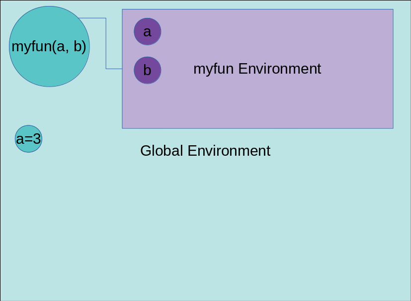
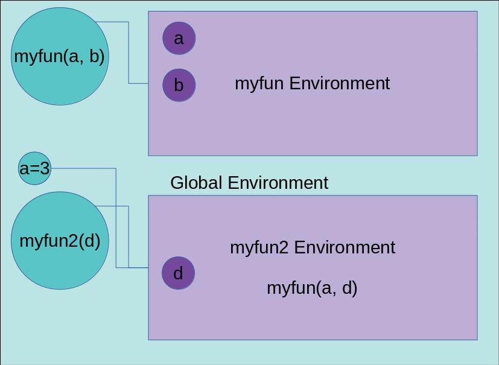

```{r, include = F}
.reset()
```
# Organization: Packages, Functions, Scripts, and Documents {#organization}

## Module Objectives {-}

- Use markdown to create dynamic documents which show code and results reproducibly
- Create functions and scripts to accomplish simple tasks
- Compare the structure and syntax of R and SAS programs
- Know where to find external software packages or modules to provide additional functionality

## Reproducibility

<!-- Why reproducibility is important in science and statistics -->
The concepts of **replication** and **reproducibility** is central to science - we do not trust studies whose results cannot be replicated by additional repetitions of the experiment, and we do not trust statistical analyses whose results are not backed up by valid methods that can be re-run to verify the reported results. While replication covers the lab methods, experimental design, and data collection procedures, reproducibility is concerned with the code and the data from an experiment which has already been run. Specifically, the idea is that the research paper is basically an advertisement - by exposing the code and data used in the analysis, readers can engage with the core of the analysis methods, leading to better peer feedback as well as easier adoption of the research for future work.

Reproducibility has several advantages:

1. It allows you to show the correctness of your results    
Trying to reproduce an analysis from the data and the description in the journal article is... challenging, if not impossible, in many cases. By providing the raw data and code to take the data from raw form to analysis results, readers can verify the legitimacy of each step in the analysis. This allows researchers to review each others methods, finding mistakes due to [bugs in the software used](https://www.sciencemag.org/news/2016/08/one-five-genetics-papers-contains-errors-thanks-microsoft-excel) or due to implementation errors. In one particularly prominent failure of reproducibility, a study used to support macroeconomic theories that shaped the response to the 2008-2009 recession [negatively correlating national debt with gdp growth](https://theconversation.com/the-reinhart-rogoff-error-or-how-not-to-excel-at-economics-13646) was found to be flawed due to an excel indexing mistake. Use of GUI-based (graphical user interface) statistical analysis software may make it harder to identify these mistakes, because the formulas and code are not visually displayed. 

2. It allows others to use your results more easily    
By sharing your code and raw data, you provide the wider scientific community with the ability to use your results to build new scientific studies. This increases the relevance of your work, the number of citations your papers get, and you also benefit from the community adopting a culture of openness and reproducibility.

3. In 2 years, when you need to find the code you used for that analysis in XXX paper, you'll be able to find the code (and the data) to see how it worked and what you did. The code may or may not run as-is (depending on software versioning, package updates, etc.), but you will have the methods clearly documented along with the data (so it's easy to replicate the data format needed, etc.)

There are other advantages (personal and public) described in an issue of [Biostatistics](https://academic.oup.com/biostatistics/issue/11/3) dedicated to reproducibility. [David Donoho's response is particularly useful.](https://doi.org/10.1093/biostatistics/kxq028) 

As you might expect, there are [many different](https://academic.oup.com/biostatistics/article/10/3/405/293660) [types of reproducibility](https://ropensci.github.io/reproducibility-guide/sections/introduction/). 

- Code reproducibility - allows replication of the computing aspects of the study. Includes code, software, hardware, and implementation details.
- Data reproducibility - allows replication of the non-computational parts of the study (e.g. experiment and data collection). This may include making protocols and data available.
- Statistical reproducibility - allows replication of the statistical methods. Includes details about model parameters, thresholds, etc. and may also include study pre-registration to prevent p-hacking.

There are also many levels of reproducibility. Much of the computer code written in the 1960s is no longer runnable today, because the computer architecture it was written for is not available anymore. Code which depends on URLs is vulnerable to website rearrangements or the content no longer being hosted. Archiving projects on GitHub is nice, but what happens if GitHub goes down? It's important to decide what type of reproducibility is important for a particular project, and then design the project's workflow around that process.

For most of my projects, I don't worry about software versioning (I may archive my sessionInfo() so that package versions are documented) and storing the software packages alongside the code and data. As much as possible, I keep the code and the data (if it's small) on GitHub in a public repository for people to access, along with any manuscripts or presentations related to the project. Manuscripts are written in knitr or r markdown, so that the code is documented by the context of the project, and every image in the article generated by R has corresponding code available. This ensures that 

1. my code (and data) is stored somewhere off-site (backed up in the cloud)
2. my code is available if others want to use it 
3. I can track my contributions to a project relative to any collaborators
4. I can undo changes that I make if something in the code breaks. 
5. I can undo changes my collaborators inadvertently make because all changes are recorded.
6. I can reuse blocks of code easily (and find them easily on GitHub)


In situations where I run experiments, I also make sure that any experimental stimuli or other code that would contribute to the execution and data collection part of the experiment is also included in the repository. This may involve archiving intermediate results that would not normally be archived so that exact stimuli can be regenerated "just in case". 

<!-- Why reproducibility is convenient -->

The github reproducibility work flow is convenient - it allows for me to easily collaborate with others, without emailing versions of code and documents back and forth or dealing with Dropbox version conflicts. I can revert changes that are made that had unintentional effects fairly easily. I can sync my files across multiple machines effortlessly. And if necessary, I can look back at the changes I've made and see why I made them, or what I've already tried.

### Reproducibility References and Reading {- .learn-more}

I highly recommend scanning these resources to get a good sense of the different ways the word "reproducibility" is used in the literature.

- [Advanced R's reproducibility guide](http://adv-r.had.co.nz/Reproducibility.html)
- [A reproducible R workflow](https://timogrossenbacher.ch/2017/07/a-truly-reproducible-r-workflow/)
- [ROpenSci's guide to reproducibility](https://ropensci.github.io/reproducibility-guide/sections/introduction/)
- [Roger Peng's Biostatistics editorial on reproducibility](https://doi.org/10.1093/biostatistics/kxp014)
- [The Biostatistics reproducibility issue w/ responses to the editorial and associated commentary](https://academic.oup.com/biostatistics/issue/11/3)


## Markdown and R {#rmarkdown}

In this class, we're primarily going to use rmarkdown to create dynamic documents. Markdown itself is a special style of text that is intended to allow you to do basic formatting without having to pause to actually click the buttons (if you were writing in word). It integrates equation functionality (so you can type mathematical equations using LaTeX syntax) and also allows for the use of templates (so you can write whole journal articles in a text editor). Markdown is also program agnostic - it will allow you to compile your work into HTML, word, or PDF form. 

Markdown documents must be *compiled* - a computer program runs and transforms the text file into a full document. RStudio has markdown functionality built-in, and also supports `rmarkdown`, which is a markdown variant designed to make it easy to integrate R code with document creation (so-called literate programming). There are other markdown programs which extend markdown's functionality so that you can write a book (like this one), create presentations or posters, or maintain a blog in markdown.

Rmarkdown, despite the name, also allows you to integrate the results from code in other languages. As you saw in [the last chapter](#intro-prog), SAS code can be integrated into markdown as well. Other languages commonly used include python, julia, SQL, Bash, C++, and Stan.

[There is a full set of [Rmarkdown tutorials](https://rmarkdown.rstudio.com/lesson-1.html) from RStudio. There is also a handy [cheatsheet](https://rmarkdown.rstudio.com/lesson-15.html). ]{.learn-more}

::: tryitout
Or, you can take the "jump right in" approach - open RStudio, File -> New -> Rmarkdown document. To compile it, click the knit button in the bar at the top of the text editor window. Make changes to the text and the R code, compile it, and see what happens. Voila! You're a markdow expert!
:::

Rmarkdown documents may contain code used to support an analysis, but they are usually not the best way to develop an analysis method - they are better for documentation, writing tutorials, and other scenarios where you need both text explanations and code/analysis/results. There are other "containers" for code, though, including functions, scripts, and packages. Each has their own advantages and disadvantages, and can be used together. 


### Rmarkdown with... SAS? 

You may have noticed that I've been including SAS chunks throughout this book, and even in your homework assignments. 

::: learn-more
Here's how that's set up.
[SAS in Rmarkdown -- guide](http://ritsokiguess.site/docs/2018/08/20/sas-in-r-markdown/).
:::

It's really fairly easy, which surprised me -- I was expecting it to be a lot more involved to set SASmarkdown up.  

## Functions and Modules

A function (or a module, in SAS) is a block of code which is only run when it is called. It takes arguments (known as parameters) and returns data or some other value. 

::: learn-more
There is some extensive material on this subject in [R for Data Science on functions](https://r4ds.had.co.nz/functions.html). If you aren't familiar with functions, you should read that material before proceeding.
:::

Let's look at the structure of a generic function in pseudocode (code that isn't really part of any language, but describes the steps of a program):

````
my_function_name = function(param1, param2 = 3) {
  step1 // do something
  
  step2 // do something else 
  
  return step_1/step2
}

````

The first part of a function declaration (storing information in a named object) is the function's intended name, `my_function_name`. Then, we indicate that we are defining a function, and what **parameters** our function requires. For `param1`, we do not provide a default value, but for `param2`, we indicate that the **default value** is 3. Thus, if we call the function (tell the program to run this function with certain arguments and provide the result), we could either say `my_function_name(param1 = value1, param2 = value2)` or `my_function_name(param1 = value1)` (which is equivalent to `my_function_name(param1 = value1, param2 = 3)`). In R, you can even say `my_function_name(value1, value2)` and the assumption is that you've supplied the parameters in the correct order.^[It's a good idea to specify your parameter names when you're using functions you're unfamiliar with, which at this point, is probably all of them.] Inside the function block (indicated by `{}` here, but some languages may use `do ... end;`), we perform whatever steps we've decided to include in the function, and then at the end of the function, we **return** a value - the function exits, and leaves behind some information.

In R, functions look like this: 

> `function( arglist ) {`    
> `   expr`    
> `return(value)`    
> `}`

In SAS, functions are called modules. The documentation for a module is below:
````
Statements That Define and Execute Modules
Modules are used to create a user-defined subroutine or function. 

A module definition begins with a START statement, which has the following general form:
START <name> <( arguments )> <GLOBAL( arguments )>;

A module definition ends with a FINISH statement, which has the following general form:
FINISH <name>;

To execute a module, you can use either a RUN statement or a CALL statement. 
The general forms of these statements are as follows:
`RUN <name> <( arguments)>;
`CALL <name> <( arguments)>;`
The only difference between the RUN and CALL statements is the order of resolution.
````

[Source: SAS function reference](https://support.sas.com/rnd/app/iml/programming.html)

Let's try functions out by writing a simple function that takes two numbers as arguments and adds them together.

```{r}
adder <- function(a, b) {
  return(a + b)
}

adder(3, 4)
```

```{sashtml}
proc IML;

  start adder(a, b);
    return(a + b);
  finish;

  c = adder(3, 4); /* In IML, you can use the function like this as well */
  print c;

quit;

```

Of course, it's not just important to be able to write your own functions. It's also helpful to be able to see how functions are written, both to explore how a method is implemented and for debugging purposes. In SAS, this is generally not an option, because SAS is closed source, but in R, you can see the code behind any function which is implemented in R (it is harder to see functions implemented in C or C++, but not impossible) by typing the function name (no parentheses) into the command prompt.

<details><summary>Let's examine how the colSums() function is implemented</summary>
```{r}
colSums
```

You can see that the first 3 steps in the function are if statements to test whether the inputs are acceptable - x must be a data frame, a matrix, or an array (with 2+ dimensions). 

The next couple of lines test to see whether there are additional "column" dimensions (don't worry if you don't understand what's going on in this code - it's highly optimized and a bit arcane). 

Then, the function checks to see if x is real-valued or complex, and if it's complex, computes the real and imaginary sums separately. 

The `.Internal(colSums(x...))` part is calling a C function - basically, functions written in C are faster than R because they're compiled, so this speeds basic operations up in R. 

Then there are statements that transfer dimension names over to the summed object. At the end of the function, the last value computed is returned automatically (in this case, z). 
</details>

<div class="tryitout">
### Try it out {-}
Write a function named `circle_area` which computes the area of a circle given the radius. Make sure to use reasonable parameter names! (Note: in R, pi is conveniently stored in the variable of the same name - it can be overwritten if you want to do so, but why would you want to do that? In SAS, you can get the value of pi using `constant("pi")`)

<details><summary>Solution</summary>
```{r}
circle_area <- function(r) {
  r^2*pi # automatically returned as the last computed value
}

circle_area(5)
```

A more complete and robust answer might include a test for numeric `r`:
```{r}
circle_area <- function(r) {
  if (!is.numeric(r)) {
    stop("Supplied radius must be numeric") # This issues an error
  }
  r^2*pi # automatically returned as the last computed value
}
circle_area(5)
```


```{sashtml}
proc IML;

  start circle_area(r);
    pi = constant("pi");
    return(pi*r**2);
  finish;

  c = circle_area(5);
  print c;

quit;

```
</details>
</div>

One last trick to note: functions generally can only return one object. If you need to return more than one thing, put the objects into a list or another data structure, and return that - then you can take the list/structure apart outside the function to use the returned values separately. 

### Scope

The scope of a variable is the space in the program where a variable is defined and can be accessed. A **local** variable is one which can only be accessed within a function or block of code - it does not exist outside of that code. A **global** variable is one which is available to the entire program. 


In R, every function is defined in a certain environment, and once it is defined, executed in a specific environment. Think of an environment as a space full of available variables, functions, and objects. Any defined object or variable that a function has access to is **in scope**. When you are inside of a function block, you have access to values defined within the function, plus any other values outside the function. When there are two variables with the same name, the object in the environment which is "closest" is used.

<details><summary>Demonstration of scoping in R</summary>

```{r}

a <- 3

myfun <- function(a, b) {
  a + b + 2
}

myfun(5, 6) # a is 5 inside the function, so that overrides the 
            # a defined outside the function

myfun(a, 3) # this references the a outside the function
```



```{r}
a <- 3

myfun2 <- function(d) {
  myfun(a, d)
}

myfun2(3) # the only a in scope inside fun2 is the a defined at the top of the chunk
```




```{r}
a <- 3

myfun3 <- function(a, d) {
  b <- a; # make a copy of the value
  a <- 250;
  myfun(b, d)
}

a

myfun3(5, 3) # now, a is defined inside fun3 as a = 5, so there is an a in 
             # fun3's scope that isn't in the global environment.

a # value of a hasn't changed

```


</details>

If you want to avoid too many issues with scoping (because scoping rules are complicated), the simplest way is to not reuse variable names inside of a function if you've already used those names outside the function (this holds for all languages, really).

R does have global variables and a global assignment operator, `<<-`, but the use of global variables is strongly discouraged, and global variables are not permitted in e.g. CRAN packages. 

In SAS, scoping rules are more like those in other programming languages - you have to keep track of how arguments are made available to the function. 

<details><summary>Demonstration of scoping in SAS. Environments do not inherit variables from the calling environment.</summary>

```{sashtml}
PROC IML;
a = 3;

start myfun(a, b);
  return a + b + 2;
finish;

r1 = myfun(5, 6); 
/* a is 5 inside the function, so that overrides the 
   a defined outside the function */

r2 = myfun(a, 3); 
/* this references the a outside the function */

print r1 r2;
quit;

```

In SAS, the equivalent version of the program used to demonstrate lexical scoping in R produces an error. In SAS, you cannot assume the function has access to values defined outside of that function that are not passed into the function as arguments.

````
PROC IML;
a = 3;

start myfun(a, b);
  return a + b + 2;
finish;

start myfun2(d);
  return myfun(a, d); /* SAS complains because a is not defined */
finish;

r1 = myfun2(3); 

print r1;
quit;

````
</details>


First, let's consider the similarities: like R, functions have a local scope, and changing a similarly named value inside the function doesn't change the value outside the function. 
```{sashtml}
PROC IML;
start myfun(x); 
  y = 2 * x;
  print y[label="y inside function (local)"];
  return 1;
finish;

y = 0;
x = 1:5;
res = myfun(x);
print y[label="y outside function"];

quit;

```

However, R's environment feature and lexical scoping is not common to many other programming languages. 
When values are passed into the function as arguments, the behavior in SAS deviates from the equivalent behavior in R. In SAS, arguments to functions are passed by **reference**. 

An argument that is passed **by value** makes a copy of the value (to a new memory location) for the local function scope (this is what R does). 

When an argument is passed **by reference**, the *address* of the argument is passed in instead^[if you're familiar with C, the argument passed in is just a pointer to the original memory]. 
This is faster and more efficient (because you aren't making a new copy of the data), but it does mean that changes inside the function persist outside that function. 

<details><summary>Argument passing in SAS</summary>
If we make a slight modification to `myfun(a, b)`, though, we see some interesting behavior in SAS that we wouldn't see in the equivalent R program.
```{sas}
PROC IML;
a = 3;

start myfun(a, b);
  a = a + 2;
  return a + b;
finish;

b = a;

r1 = myfun(5, 6); 
     
c = a;

r2 = myfun(a, 3); 

d = a;

print b[label="a before r1"] r1 c[label="a after r1"] r2 d[label="a after r2"];
quit;
```
</details>

<details><summary>Argument passing in R</summary>
In R, variables inside a function don't modify variables which are outside a function (generally speaking). In SAS, this is not necessarily the case. In the first call to myfun(), we pass in two numerical arguments, and we see that even though the value of a changes inside the function, that change doesn't affect the variable defined outside of the function. In the second call to myfun(), we pass a variable in as an argument, and we see that the variable changes after the function's execution! In the R chunk (below), you can see that the behavior of what is essentially the same code is different.
```{r}

a <- 3

myfun <- function(a, b) {
  a <- a + 2
  a + b
}

a

myfun(5, 6)

a

myfun(a, 3) 

a
```
</details>


<details><summary>Another example of SAS passing arguments by reference (and the unexpected effects that can have on a program's state)</summary>

```{sashtml}
PROC IML;
start myfun(x); 
  call sort(x, 1); /* sort the values */
  return (cusum(x)); /* cusum() = cumulative sum */
finish;

y = {3, 1, 4, 1, 5, 9, 2, 6, 5, 4};
z = y;

print y[label="y before function is called"];

cs = myfun(y);

print z[label="original y"]
      y[label="y after function is called"] 
      cs[label="cumulative sum of sorted y"];

quit;

```

Because arguments in SAS are passed by reference, you can "trick" a function into returning multiple values by passing the variables in as arguments to the function, changing their values in the function, and returning. This is not necessarily a good practice - it can make code very difficult to debug, and may lead to non-obvious dependencies - but for short, simple programs, you can probably get away with it.

```{sashtml}
PROC IML;
  start getDescriptive(Mean, SD, /* output args */
                         x /* input arg */);
    Mean = x[:]; /* this is shorthand for compute the mean of the column */
    SD = sqrt( ssq(x - Mean)/(nrow(x) - 1));
  finish;

m = 0;
s = 0;
y = {3, 1, 4, 1, 5, 9, 2, 6, 5, 4};

run GetDescriptive(m, s, y);
print m s;


quit;

```

If you want to avoid any of these side-effects of SAS's pass-by-reference behavior, you can very easily do so: just don't write any modules that modify input arguments. Always modify a copy of the variable instead. 
</details>

<div class="tryitout">
#### Try it out {-}

Can you predict what the output of this chunk will be?

```{r, eval = F}
f <- function(x) {
  f <- function(x) {
    f <- function(x) {
      x ^ 2
    }
    f(x) + 1
  }
  f(x) * 2
}
f(10)
```

Run it - were you right?

What happens when you run a similar program in SAS? (I only nested two functions this time, but you get the idea)

````
proc IML;
  start f(x);
    start f(x);
      return x**x;
    finish;
    return f(x)+1;
  finish;
quit;

````

<details><summary>Solution</summary>

Working through the R program: This gets much less confusing if you rename the functions following R's scoping rules.

```
f <- function(x) {
  f1 <- function(x) { # because inside of f(), the new definition will dominate 
    f2 <- function(x) { # because inside of f1(), the new definition will dominate
      x ^ 2
    }
    f2(x) + 1
  }
  f1(x) * 2
}
f(10)
```
Once this has been renamed, it is relatively easy to write out as a series of mathematical substitutions:

$$f(10) = f1(10) * 2 = (f2(10) + 1) * 2 = (10^2 + 1)*2 = 202$$

Running the similar program in SAS results in SAS complaining about a recursive function definition. 
</details>


What will this SAS program output?

```{sashtml}
proc IML;

start funwithSAS(x, y);
  a = x;
  x = x + 3;
  return x*y;
finish;

a = 0;
res1 = funwithSAS(a, 5);
a1 = a;

x = 3;
res2 = funwithSAS(x, 5);
a2 = a;
x2 = x;

y = 3;
res3 = funwithSAS(x, y);

/* print res1 a1 res2 a2 x2 res3 a x y; */ /* uncomment this when you're ready */

quit;

```

<details><summary>Solution</summary>
This is easiest if we step through the program and list what is passed around inside and outside of the function evaluation.

    a = 0
    res1 = ...? 
    (inside funwithsas res1) x = (location of a), y = 5
    (inside funwithsas res1) a = x = (location of a), x = (location of a) + 3 = 3, so (location of a) = 3 and x = 3.
    res1 returns x = 3 * y = 5 = 15
    
    a1 = 3
    res2 = ...?
    (inside funwithsas res2) x = (location of x), y = 5
    (inside funwithsas res2) a = (location of x), x = (location of x) + 3 = 6 (a outside the function is unaffected because a is not a parameter)
    res2 returns x = 6 * y = 5 = 30
    
    a2 = 3
    x2 = 6
    
    y = 3
    res3 = ...?
    (inside funwithsas res3) x = (location of x), y = (location of y)
    (inside funwithsas res3) a = (location of x), x = (location of x) + 3 = 9 (a outside the function is unaffected; y is unchanged)
    res3 returns x = 9 * y = 3 = 27
    
    at this point, x = 9 and y = 3.
    
    So the output is res1 = 15 a1 = 3 res2 = 30 a2 = 3 x2 = 6 res3 = 27 a = 3 x = 9 y = 3
    
The trick to this problem is to realize that inside of the function, when a variable is passed in (by reference) the thing that is assigned is the pointer to the value in memory where the original variable lives. So when a is passed in as x, x is assigned (location of a), which is then assigned to the local copy of a. So both variables now point at the outside (a), and any changes to x also affect both a and the local copy of a. 
</details>
</div>

### The Pipe


::: note
You do not need to understand the collapsed section below. If you're feeling comfortable with the material, go ahead and read it now. I've left it in the functions section, because it's a topic relating to functions, but it's not essential to understand to use R (even at an advanced level)^[I had been using R for ~8 years before I ever heard the term "infix operator" - and I'd been using infix operators for a long time at that point, just without thinking about what they were.]. 
:::

<details>
<summary>Infix operators</summary>
Most functions take arguments written after the function name. Can you think of any functions which work differently?

**Infix** functions are functions that take arguments on both sides of the function name. Say, a + b: technically, a and b are arguments to the function +, so we could think of this as +(a, b). 

R has a number of infix functions, but you can also create your own. User-defined infix functions start and end with %. So %>%, %in%, %dosomething% would all be valid infix operators. To define one, you need to enclose the name in back-ticks (\`). 

```{r}
`%dosomething%` <- function(a, b) {
  a^b - a + b
}

3 %dosomething% 4
```

You can also call default infix operators using this syntax: \`+\`(3, 4) = `r 3+4`

One of the most useful infix operators is the pipe, `%>%`, which is a part of the `magrittr` library and is commonly included in other packages, such as `dplyr`, and `tidyr` (we will talk about packages later in this chapter, but pipes are useful to discuss now, so roll with it for a few minutes). 
</details>

The one part of this section that is important to at least be able to use is the pipe: `%>%`. 

<div class="learn-more">
There is an [entire chapter dedicated to discussing the pipe in R4DS](https://r4ds.had.co.nz/pipes.html), including a discussion of when not to use the pipe. 
</div>

```{r}
library(magrittr)

3 %>% exp()
exp(3)

```
The pipe takes the left hand side and a function, and puts the left hand side as an argument to the function on the right hand side. It doesn't sound very impressive, but it allows you to do a very cool thing: "chain" operations.

Consider 3 functions:
```{r}
f1 <- function(x, y = 3) {
  x * y
}

f2 <- function(z) {
  z^2
}

f3 <- function(z2) {
  log10(z2)
}
```

Normally, you'd write `f3(f2(f1(4)))`, which you have to read from the inside to the outside if you want to describe what this function call is doing. With pipes, you can write the same operation as:
```{r}
4 %>% f1() %>% f2() %>% f3()
```

This is much simpler to read - it's like a recipe. "Take 4, do f1, then f2, then f3". 

You don't need to know how to define your own infix operators, but you will want to become familiar with the pipe. It's a central component of writing "tidy" R code. Incidentally, SAS also has a use for the pipe: [leveraging the operating system to work with files](https://blogs.sas.com/content/sgf/2016/03/11/using-a-pipe-to-return-the-output-of-an-operating-system-command-to-sas-software/). In SAS, you just use the keyword `pipe`, which is hopefully pretty obvious. 


## Procs  and Data steps
In R, the primary unit of code is a function, and nearly every operation in R is a function call, but the functions themselves are malleable and can be easily re-written. SAS is not that flexible - its procedures have been checked and double-checked and maintained for 30 years (in many cases). That level of validation explains its popularity in e.g. the pharmaceutical industry or government, but it does lead to a certain rigidity in the "flow" of a SAS data analysis. Personally, I find that using SAS generally doesn't require much thought, but I quickly get frustrated when it's not possible to do the exact thing I want to do in a direct or relatively easy way. 

The primary units of code in SAS are "steps", and come in two main flavors: data steps, and proc steps. Data steps are written by the user and customized extensively to the dataset you're creating or reading in. Proc steps, on the other hand, execute mainly pre-defined procedures that are built into SAS. Thus far, you've seen DATA steps and PROC PRINT and IML. In the next module, you'll see PROC IMPORT, PROC MEANS, PROC CORR, PROC SUMMARY, PROC FREQ, and PROC UNIVARIATE. 

There is a handy [overview of the SAS language](https://stats.idre.ucla.edu/sas/library/sas-libraryoverview-of-the-sas-language/) that may be useful in understanding the code that you've only been reading and copying up to this point. 

The bare SAS procedure with no options looks like this:
```
PROC MEANS;
RUN;
```
By default, SAS will use the last dataset created to run this procedure. 

<details><summary>SAS procedures can also be run with options that modify the statement. </summary>
```{sashtml}
PROC PRINT DATA=SASHELP.CARS (obs=10);
RUN;

PROC MEANS DATA=SASHELP.CARS;
RUN;
```
In the code above, both `DATA=SASHELP.CARS` and `(obs=10)` are options that modify their respective statements. 
</details>
<details><summary>
Some procs also support additional statements: for instance, we can use the VAR statement to tell SAS which variables we want to work with. </summary>
```{sashtml}
PROC MEANS DATA=SASHELP.CARS;
  VAR msrp cylinders;
RUN;
```
</details>
<details><summary>Another statement, CLASS, tells SAS to run the procedure for each level of a named categorical variable. </summary>
```{sashtml}
PROC MEANS DATA=SASHELP.CARS;
  CLASS type;
  VAR msrp cylinders;
RUN;
```
</details>
Some statements may have additional options that further modify the statement. 

The SAS documentation contains full lists of all statements (and all options for those statements). 

<div class="tryitout">
### Try It Out {-}
Take a look at the [Dictionary of SAS DATA step statements](https://documentation.sas.com/?docsetId=lestmtsref&docsetTarget=p0gct6ariiecuhn15jkq8pzfzgef.htm&docsetVersion=9.4&locale=en). Find the RENAME statement and read up on its syntax. Can you rename the variable msrp in the SASHELP.CARS dataset?
```
DATA tmp; /* Create a temporary dataset */
  SET SASHELP.CARS; /* use the CARS data */
  
  /* Your RENAME statement goes here */

RUN;
```
</div>

There is an overview of many common SAS procedures [here](https://stats.idre.ucla.edu/sas/library/sas-libraryoverview-of-sas-procedures/). 

## Scripts

Up until this point, you may have been writing code in an R Studio or SAS text editor window, or, you may have been typing commands into the command line without preserving them in a separate file. You might even have been working in R markdown documents, where you had code and non-code chunks of the file.

A **script** is a file which contains only code and comments. It is intended to run from start to finish, and usually completes one or more tasks - for instance, cleaning your data, or loading a series of custom functions into your R environment. Scripts are useful because they preserve code so that it can be re-run... and in some cases, they can even be re-run autonomously - I have several scripts which automatically run at specific times every day to complete various tasks (scraping data off the internet, mostly). 

I find that when doing data analysis, it is often easier to write a script as opposed to working in R markdown or typing commands into the console. Scripts are a record of what I've done, and ensure that commands are executed in the right order. As with any tool, it is important to know where to use the tool and where the tool is usually not the best option. 

You can source (run) an R script using the `source()` command with the file path of the script as the argument. 

Scripts in R end in `.r` or `.R`, while scripts in SAS end in `.sas`. 

Scripts can be run in one of (at least) two modes: batch mode, or interactive mode. In batch mode, the entire script is run without human intervention or monitoring. This is useful for repetitive jobs -- for instance, to record the weather at 6h intervals throughout the day. In interactive mode, scripts may be run line-by-line or block-wise, with small tweaks made to the code as you proceed through the file. I find that in some cases, what starts out as an interactive mode script can become a batch script as I work the kinks out.

If you ever need to use the high-performance computing resources on campus, you will need to write code to run in batch mode, because these jobs are generally not friendly to interactive programming. 

### Try it out {- .tryitout}

I maintain a list of packages that I find to be useful so that when I install R on a new machine (or update R), I don't have to spend 3 weeks realizing that I need to install X package. Instead of many repeated 5 minute pauses for package installation, I can just let this script run once and walk away.

I've pared down my list of packages a bit for this class (you don't need the packages for analysis of 3D bullet scan data, for instance), but this step should help populate your R installation with a few new packages.

Read the script (located [here](code/03_setup.R)) and try to understand what it is doing. Once you think you understand what it is doing, run the following command to run the script and install the packages on your machine. Were you right?

```{r, eval = F}
url <- "https://raw.githubusercontent.com/srvanderplas/unl-stat850/master/code/03_setup.R"
source(url)
```


## Packages

Both SAS and R have systems for extending the base system/language with additional functionality. In R, these extensions are called packages. In SAS, language extensions are called modules (for things sold by SAS), macros (for functions distributed by users), and in packages (which exist but are rarely used).^[Note that the various components of SAS can be *extremely* confusing to separate. I found [this](https://www.lexjansen.com/mwsug/2017/RF/MWSUG-2017-RF01.pdf) guide to be somewhat helpful.]

<details><summary>SAS packages</summary>
In SAS, there are packages of code that encapsulate scripts. However, unlike R (and many other languages), there is no centralized repository for SAS packages. Papers may include SAS packages to demonstrate new methods, and other packages may be found on GitHub or various SAS forums.

A more common way of distributing code in SAS seems to be through the use of single-file macros. (Even longtime SAS users don't necessarily know about the package system). These macros often need to be slightly customized to your environment (or you need to customize your environment to match the assumptions made in the macro, which can be harder). 
</details>

<details><summary>R packages</summary>
In R, there are two main sources for packages: CRAN (the Comprehensive R Archive Network) (and related archives, such as MRAN, which is Microsoft's version of CRAN) and github. R packages published on CRAN go through a basic verification process that makes sure that the package meets certain [standards](https://cran.r-project.org/) (for instance, packages must have proper dependencies specified, cannot conflict with previous package names, must have a software license, and cannot contain malicious code). Note that CRAN does not check the packages for statistical correctness!

On github, packages go through less verification. Many packages use a system where the version in development is on github and available for installation, but the version on CRAN is considered "stable". Sometimes, packages are never put on CRAN: I contribute to several packages which are too large for CRAN, and it's not worth the hassle to get an exception or figure out a workaround.

```{r}
library(rvest)
txt <- read_xml("https://cran.r-project.org/web/packages/") %>%
  html_node(css = "#pkgs") %>% 
  xml_parent() %>%
  html_text()
npkgs <- stringr::str_extract(txt, "features \\d{1,}") %>% stringr::str_remove("features ") %>% as.numeric()
```

Currently, the CRAN package repository features `r npkgs` available packages. How do you navigate them to find the one you need? Sometimes, the [CRAN Task Views](https://cran.r-project.org/web/views/) may be helpful - for instance, if you want to see all of the packages which are useful for Meta-Analysis, Finance, Bayesian statistics, etc. Other times, it's useful to let Google help you navigate: searching for "R CRAN" + "what you want the package to do" can often narrow things down (I recommend adding CRAN in because Google results for "R" are not particularly useful.)

Once you find and install a package (`install.packages()` for CRAN packages, `devtools::install_github()` for GitHub packages), you have to figure out how to use it. Many R packages come with **vignettes**, which are short articles that demonstrate how a package is used. 
You can browse the available vignettes using `browseVignettes()` (if you provide a package name as an argument, you will get only vignettes from that package). 

Another way to get help on a package is to use `?<package name>`, e.g. `?ggplot2`. That will take you to the main package description page, and there are often links to documentation. At the bottom of the description page, you can click on a link to get to the Index, which is a list of all functions that are provided in that package. From there, you can find the documentation for each function in the package. 
</details>

### Try it out {- .tryitout}

Install the R package `tibble` if it is not already installed. Pull up the vignettes for the `tibble` package, and read about tibbles. What is the equivalent base R object? How do tibbles differ from that object?

Get to the package index for the `tibble` package, either by navigating through the Packages tab in RStudio, or using `?tibble`. Access the documentation for the `tribble` function, and try loading the package and creating your own tibble using `tribble`. 

<details><summary>Solution</summary>
```{r, eval = -c(1, 3:4)}
install.packages("tibble")
library(tibble)
?tibble
?tribble
tribble(~var1, ~var2,
        1, 2, 
        3, 4,
        5, 6)
```
</details>


## References and Links {.learn-more -}

- A more advanced take on functions in R can be found [here](http://adv-r.had.co.nz/Functions.html) (Advanced R chapter)
- There is also a handy cheat sheet style summary of PROC IML in SAS [here](https://www.iuj.ac.jp/faculty/kucc625/sas/sas_iml.html) and some useful demonstrations of simple tasks in IML [here](https://faculty.tarleton.edu/crawford/documents/Math5364/ProcIMLandMacros.txt). 
- A helpful blog post for scoping in SAS is [here](https://blogs.sas.com/content/iml/2013/04/29/understanding-local-and-global-variables-in-the-sasiml-language.html)
- [Here is another explanation of pass-by-value vs. pass-by-reference](https://www.educative.io/edpresso/pass-by-value-vs-pass-by-reference) (intended for C programming)
- [A comparison of R, SAS, and python](https://scholar.smu.edu/cgi/viewcontent.cgi?article=1021&context=datasciencereview) - source of information about the SAS package distribution system. 
- [Another explanation of pipes](https://psyteachr.github.io/msc-data-skills/tidyr.html#pipes) (lots of examples)
