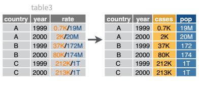
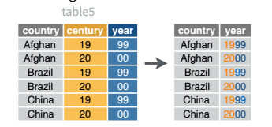

# Transforming Data {#transforming-data}

> “Happy families are all alike; every unhappy family is unhappy in its own way.” –– Leo Tolstoy

> “Tidy datasets are all alike, but every messy dataset is messy in its own way.” –– Hadley Wickham

## Module Objectives {-}

- Reshape data
- Transform variables to support analysis and visualization of data
- Join tables together in order to create a single coherent dataset

Most of the time, data does not come in a format suitable for analysis. Spreadsheets are generally optimized for data *viewing*, rather than for statistical analysis - they may be laid out so that there are multiple observations in a single row (e.g., commonly a year's worth of data, with monthly observations in each column). 

Unfortunately, this type of data structure is not usually useful to us when we analyze or visualize the data. 

::: note
This section is going to seem like it drags on forever. It covers a lot of material, and a few different concepts. I highly recommend separating it out into 3 different "sessions" - Strings, Pivot operations, and Table Joins. 

For now, you need to know this material well enough to 1) identify what operation needs to happen, and 2) know where to find the sample code for that operation. It will get easier to remember the specific syntax with practice. 
:::

## Identifying the problem: Messy data

These datasets all display the same data: TB cases documented by the WHO in Afghanistan, Brazil, and China, between 1999 and 2000. There are 4 variables: country, year, cases, and population, but each table has a different layout.
```{r, message = F}
library(tidyverse)
```

```{r, echo = F}
knitr::kable(table1, caption = "Table 1")
```

Here, each observation is a single row, each variable is a column, and everything is nicely arranged for e.g. regression or statistical analysis. We can easily compute another measure, such as cases per 100,000 population, by taking cases/population * 100000 (this would define a new column). 


```{r, echo = F}
knitr::kable(table2, caption = "Table 2")
```

Here, we have 4 columns again, but we now have 12 rows: one of the columns is an indicator of which of two numerical observations is recorded in that row; a second column stores the value. This form of the data is more easily plotted in e.g. ggplot2, if we want to show lines for both cases and population, but computing per capita cases would be much more difficult in this form than in the arrangement in table 1. 


```{r, echo = F}
knitr::kable(table3, caption = "Table 3")
```

This form has only 3 columns, because the rate variable (which is a character) stores both the case count and the population. We can't do *anything* with this format as it stands, because we can't do math on data stored as characters. However, this form might be easier to read and record for a human being. 


```{r, echo = F}
knitr::kable(table4a, caption = "Table 4a")
knitr::kable(table4b, caption = "Table 4b")
```

In this form, we have two tables - one for population, and one for cases. Each year's observations are in a separate column. This format is often found in separate sheets of an excel workbook. To work with this data, we'll need to transform each table so that there is a column indicating which year an observation is from, and then merge the two tables together by country and year. 


```{r, echo = F}
knitr::kable(table5, caption = "Table 5")
```

Table 5 is very similar to table 3, but the year has been separated into two columns - century, and year. This is more common with year, month, and day in separate columns  (or date and time in separate columns), often to deal with the fact that spreadsheets don't always handle dates the way you'd hope they would. 


These variations highlight the principles which can be said to define a tidy dataset:
1. Each variable must have its own column
2. Each observation must have its own row
3. Each value must have its own cell

<div class="tryitout">
### Try it out {-}
Go back through the 5 tables and determine whether each table is tidy, and if it is not, which rule or rules it violates. Figure out what you would have to do in order to compute a standardized TB infection rate per 100,000 people. 
<details><summary>Solution</summary>

1. table1 - this is tidy data. Computing a standardized infection rate is as simple as creating the variable rate = cases/population*100,000.

2. table2 - each variable does not have its own column (so a single year's observation of one country actually has 2 rows). Computing a standardized infection rate requires moving cases and population so that each variable has its own column, and then you can proceed using the process in 1.

3. table3 - each value does not have its own cell (and each variable does not have its own column). In Table 3, you'd have to separate the numerator and denominator of each cell, convert each to a numeric variable, and then you could proceed as in 1. 

4. table4a and table 4b - there are multiple observations in each row because there is not a column for year. To compute the rate, you'd need to "stack" the two columns in each table into a single column, add a year column that is 1999, 1999, 1999, 2000, 2000, 2000, and then merge the two tables. Then you could proceed as in 1. 

5. table 5 - each variable does not have its own column (there are two columns for year, in addition to the issues noted in table3). Computing the rate would be similar to table 3; the year issues aren't actually a huge deal unless you plot them, at which point 99 will seem to be bigger than 00 (so you'd need to combine the two year columns together first). 
</details>
</div>

It is actually impossible to have a table that violates only one of the rules of tidy data - you have to violate at least two. So a simpler way to state the rules might be: 

1. Each dataset goes into its own table (or tibble, if you are using R)
2. Each variable gets its own column

By the end of this module, you should have the skills to "tidy" each of these tables. 

## String operations: Creating new variables and separating multi-variable columns

Nearly always, when multiple variables are stored in a single column, they are stored as character variables. There are many different "levels" of working with strings in programming, from simple find-and-replaced of fixed (constant) strings to regular expressions, which are extremely powerful (and extremely complicated). 

> Some people, when confronted with a problem, think “I know, I’ll use regular expressions.” Now they have two problems. - Jamie Zawinski


The tidyverse package to deal with strings is [`stringr`](https://stringr.tidyverse.org/). The functions in stringr take the form of `str_XXX` where XXX is a verb. So `str_split()`, `str_replace()`, `str_remove()`, `str_to_lower()` all should make some sense.

```{r, eval = F, include = F}
college_data <- read_csv("https://ed-public-download.app.cloud.gov/downloads/Most-Recent-Cohorts-All-Data-Elements.csv") 
college_data2 <- college_data %>%
  select(UNITID, INSTNM, CITY, STABBR, ZIP, ACCREDAGENCY, INSTURL, PREDDEG, MAIN, NUMBRANCH, HIGHDEG, CONTROL, ST_FIPS, LOCALE, LATITUDE, LONGITUDE) %>%
  mutate(PREDDEG = factor(PREDDEG, levels = 0:4, labels = c("Not classified", "Predominantely certificate-degree granting", "Predominantely associate's-degree granting", "Predominantly bachelor's-degree granting", "Entirely graduate-degree granting")),
         MAIN = factor(MAIN, levels = 0:1, labels = c("Not main campus", "main campus")),
         HIGHDEG = factor(HIGHDEG, levels = 0:4, labels = c("Non-degree granting", "Certificate", "Associate", "Bachelors", "Graduate")),
         CONTROL = factor(CONTROL, levels = 1:3, labels = c("Public", "Private Non Profit", "Private For Profit")))
readr::write_csv(college_data2, "data/College_Data_Abbrev.csv")


college_fips <- read_csv("data/CollegeFips.csv", col_names = F) %>%
  set_names(c("ST_FIPS", "State")) %>%
  mutate_all(as.character)

college_data2 %>% select(STABBR, ST_FIPS) %>%
  mutate(ST_FIPS = as.character(ST_FIPS)) %>%
  unique() %>%
  left_join(college_fips) %>%
  write_csv("data/College_FIPS_Abbr.csv")

college_data2 <- left_join(college_data2, college_fips)
readr::write_csv(college_data2, "data/College_Data_Abbrev.csv", na = '.')
```

For this example, we'll use a subset of the US Department of Education College Scorecard data. [Documentation](https://collegescorecard.ed.gov/data/documentation/), [Data](https://collegescorecard.ed.gov/data/). I've selected a few columns from the institution-level data available on the College Scorecard site. 

<details><summary>Let's take a look (Read in the data)</summary>
```{r}
college <- read_csv("data/College_Data_Abbrev.csv", guess_max = 5000, na = '.')
str(college)
```

```{sashtml sas-college-read-data}
libname classdat "/home/susan/Projects/Class/unl-stat850/2020-stat850/sas/";

filename fileloc '~/Projects/Class/unl-stat850/2020-stat850/data/College_Data_Abbrev.csv';
PROC IMPORT  datafile = fileloc out=classdat.college REPLACE
DBMS = csv; /* comma delimited file */
GUESSINGROWS=500;
GETNAMES = YES;
RUN;

PROC PRINT DATA = classdat.college (obs = 5);
RUN;
```
</details>

### Basic String Operations

<details><summary>What proportion of the schools operating in each state have the state's name in the school name?</summary>

We'll use `str_detect()` to look for the state name in the college name. 
```{r, fig.width = 4, fig.height = 8, out.width = 4}
# Outside the pipe
str_detect(college$INSTNM, pattern = college$State)

# Using the pipe and mutate:
college <- college %>%
  mutate(uses_st_name = str_detect(INSTNM, State))

# By state - percentage of institution names
college %>%
  group_by(State) %>%
  summarize(pct_uses_st_name = mean(uses_st_name), n = n()) %>%
  filter(n > 5) %>% # only states/territories with at least 5 schools
  # Reorder state factor level by percentage that uses state name
  mutate(State = reorder(State, -pct_uses_st_name)) %>%
  ggplot(data = ., aes(x = State, y = pct_uses_st_name)) + 
  geom_col() + coord_flip() + 
  geom_text(aes(y = 1, label = paste("Total Schools:", n)), hjust = 1)
```

In SAS, we use `find(x, pattern, 't')` to find the location of the pattern, which is 0 if the pattern is not found. To get something equivalent to `str_detect`, we just test whether this quantity is greater than 0. (The R equivalent of `find` is `str_locate()`). 

Note that SAS pads character fields with spaces so that they are all the same length. So if we want to test for "Alabama    " we could omit the 't' option in the command, but since we usually don't want that, we need to tell SAS to trim the fields before searching for the pattern. 

```{sashtml sas-college-find}
libname classdat "/home/susan/Projects/Class/unl-stat850/2020-stat850/sas/";

DATA collegetmp;
set classdat.college;
uses_st_name = find(INSTNM, State, 't') GT 0;
RUN;


PROC PRINT DATA = collegetmp (obs = 5);
RUN;
```
</details>

<details><summary>What are some common substrings in a set of text?</summary>
For this, we'll start with working with the single column `INSTNM`. 

```{r}
head(college$INSTNM) %>% str_split(., " ") # Split on every space

# We may need to fix certain things that should stay together
# But doing too much of that gets tedious...
str_replace(college$INSTNM, "A & M", "A&M") %>%
  head() %>% 
  str_split(., "[ -]") # This pattern says "either ' ' or '-'" 
                       # (but the - has to be at the start or the end)
```
So we could take the time to clean up everything, making sure that e.g. San Diego is treated as a single word, but that's a pain in the rear. Instead, let's just see what happens if we brute-force it. 
```{r}
tmp <- college %>%
  select(INSTNM, State) %>% 
  mutate(name_words = str_split(INSTNM, '[ -]')) # This is a list-column
tmp
unnest(tmp) # Unnest duplicates rows so that the expanded data frame has the 
            # same structure as the original data
```
List columns are one way to maintain tidy data. They allow you to have several "sub-observations" for each observation and are useful for precisely cases like this, where there are uneven numbers of words in each university's name. We're not going to focus on list columns, but if you're interested, check out `purrr` and this [excellent tutorial](https://jennybc.github.io/purrr-tutorial/). 
```{r}
unnest(tmp) %>% 
  pull(name_words) %>% # this pulls out a single column
  table() %>% 
  sort(decreasing = T) %>% 
  head(50)
```

In SAS, this is a bit more tricky. Most people I know that use both SAS and R will do the data cleaning in R once things get complicated, and then read the clean data in to SAS. That's a valid approach, but it's worth seeing what has to be done in SAS this once. As we get further into this class, I'll probably be more willing to say "we're just going to use R for this" for two reasons - 1. I know R better, and 2. R is generally better at handling the weird stuff; SAS is built to quickly handle things that are already formatted in a reasonable way. SAS seems to be highly preferred for e.g. fitting mixed/linear models, but it isn't the easiest tool to use for data cleaning. 

But, in this particular case, there is [documentation about how to break a sentence into words](https://blogs.sas.com/content/iml/2016/07/11/break-sentence-into-words-sas.html) in SAS. 
```{sashtml sas-college-split-string-words}
libname classdat "/home/susan/Projects/Class/unl-stat850/2020-stat850/sas/";
DATA collegename;
SET classdat.college;
numWords = countw(INSTNM, " ");
DO i = 1 TO numWords;
  word = scan(INSTNM, i, " ");
  OUTPUT;
END;
KEEP word numWords;
;

PROC PRINT DATA=collegename (obs = 30);
run;

PROC FREQ DATA=collegename ORDER=FREQ;
TABLES word / MAXLEVELS=30;
RUN;
```
</details>

### Regular Expressions
Matching exact strings is easy - it's just like using find and replace.

```{r}
human_talk <- "blah, blah, blah. Do you want to go for a walk?"
dog_hears <- str_extract(human_talk, "walk")
dog_hears
```

But, if you can master even a small amount of regular expression notation, you'll have exponentially more power to do good (or evil) when working with strings. You can get by without regular expressions if you're creative, but often they're much simpler. 

You may find it helpful to follow along with this section using this [web  app](https://spannbaueradam.shinyapps.io/r_regex_tester/) built to test R regular expressions for R. A similar application for Perl compatible regular expressions (used by SAS) can be found [here](https://regex101.com/). The subset of regular expression syntax we're going to cover here is fairly limited (and common to both SAS and R, with a few adjustments), but [you can find regular expressions to do just about anything string-related](https://stackoverflow.com/questions/tagged/regex?tab=Votes). As with any tool, there are situations where it's useful, and situations where you should not use a regular expression, no matter how much you want to. 


<details><summary>Short Regular Expression Primer (with R examples)</summary>

- `[]` enclose sets of characters    
Ex: `[abc]` will match any single character `a`, `b`, `c`
  - `-` specifies a range of characters (`A-z` matches all upper and lower case letters)
  - to match `-` exactly, precede with a backslash (outside of `[]`) or put the `-` last (inside `[]`)
- `.` matches any character (except a newline)
- To match special characters, escape them using `\` (in most languages) or `\\` (in R). So `\\.` will match a literal `.`, `\\$` will match a literal `$`. 

```{r}
num_string <- "phone: 123-456-7890, nuid: 12345678, ssn: 123-45-6789"

ssn <- str_extract(num_string, "[0-9][0-9][0-9]-[0-9][0-9]-[0-9][0-9][0-9][0-9]")
ssn
```

Listing out all of those numbers can get repetitive, though. How do we specify repetition?

- `*` means repeat between 0 and inf times
- `+` means 1 or more times
- `?` means 0 or 1 times -- most useful when you're looking for something optional
- `{a, b}` means repeat between `a` and `b` times, where `a` and `b` are integers. `b` can be blank. So `[abc]{3,}` will match `abc`, `aaaa`, `cbbaa`, but not `ab`, `bb`, or `a`. For a single number of repeated characters, you can use `{a}`. So `{3, }` means "3 or more times" and `{3}` means "exactly 3 times"

```{r}
str_extract("banana", "[a-z]{1,}") # match any sequence of lowercase characters
str_extract("banana", "[ab]{1,}") # Match any sequence of a and b characters
str_extract_all("banana", "(..)") # Match any two characters
str_extract("banana", "(..)\\1") # Match a repeated thing
```

```{r}
num_string <- "phone: 123-456-7890, nuid: 12345678, ssn: 123-45-6789, bank account balance: $50,000,000.23"

ssn <- str_extract(num_string, "[0-9]{3}-[0-9]{2}-[0-9]{4}")
ssn
phone <- str_extract(num_string, "[0-9]{3}.[0-9]{3}.[0-9]{4}")
phone
nuid <- str_extract(num_string, "[0-9]{8}")
nuid
bank_balance <- str_extract(num_string, "\\$[0-9,]+\\.[0-9]{2}")
bank_balance
```

There are also ways to "anchor" a pattern to a part of the string (e.g. the beginning or the end)

- `^` has multiple meanings:
  - if it's the first character in a pattern, `^` matches the beginning of a string
  - if it follows `[`, e.g. `[^abc]`, `^` means "not" - for instance, "the collection of all characters that aren't a, b, or c". 
- `$` means the end of a string

Combined with pre and post-processing, these let you make sense out of semi-structured string data, such as addresses
```{r}
address <- "1600 Pennsylvania Ave NW, Washington D.C., 20500"

house_num <- str_extract(address, "^[0-9]{1,}")

 # Match everything alphanumeric up to the comma
street <- str_extract(address, "[A-z0-9 ]{1,}")
street <- str_remove(street, house_num) %>% str_trim() # remove house number

city <- str_extract(address, ",.*,") %>% str_remove_all(",") %>% str_trim()

zip <- str_extract(address, "[0-9-]{5,10}$") # match 5 and 9 digit zip codes
```


- `()` are used to capture information. So `([0-9]{4})` captures any 4-digit number
- `a|b` will select a or b. 

If you've captured information using (), you can reference that information using backreferences. In most languages, those look like this: `\1` for the first reference, `\9` for the ninth. In R, though, the `\` character is special, so you have to escape it. So in R, `\\1` is the first reference, and `\\2` is the second, and so on. 

```{r}
phone_num_variants <- c("(123) 456-7980", "123.456.7890", "+1 123-456-7890")
phone_regex <- "\\(?([0-9]{3})?\\)?.?([0-9]{3}).?([0-9]{4})"
# \\( and \\) match literal parentheses if they exist
# ([0-9]{3})? captures the area code, if it exists
# .? matches any character
# ([0-9]{3}) captures the exchange code
# ([0-9]{4}) captures the 4-digit individual code

str_extract(phone_num_variants, phone_regex)
str_replace(phone_num_variants, phone_regex, "\\1\\2\\3")
# We didn't capture the country code, so it remained in the string

human_talk <- "blah, blah, blah. Do you want to go for a walk? I think I'm going to treat myself to some ice cream for working so hard. "
dog_hears <- str_extract_all(human_talk, "walk|treat")
dog_hears
```
</details>

In SAS, much the same information is true, though you do not have to double-escape special characters. SAS uses PERL-compatible regular expressions (PCRE for short) (these can also be enabled in base-R string functions). 

In PCRE regular expressions, '/' are used as delimiters. SAS assigns each sequential regular expression a number (so that you can reference them if necessary).

<details><summary>PRXMATCH returns the first position of a string where a match is found (0 otherwise)</summary>

In this example, however, lets just test to see whether PRXMATCH finds a match or not

```{sashtml}
DATA strings;
  INFILE DATALINES DSD; /* This allows quoted strings */
  INPUT string ~ $150.; /* ~ says deal with quoted strings */
  DATALINES;
"abcdefghijklmnopqrstuvwxyzABAB"
"banana orange strawberry apple"
"ana went to montana to eat a banana"
"call me at 432-394-2873. Do you want to go for a walk? I'm going to treat myself to some ice cream for working so hard."
"phone: (123) 456-7890, nuid: 12345678, bank account balance: $50,000,000.23"
"1600 Pennsylvania Ave NW, Washington D.C., 20500"
RUN;

DATA info;
set strings;
  IF PRXMATCH("/\(?([0-9]{3})?\)?.?([0-9]{3}).([0-9]{4})/", string) GT 0 THEN phone = 1;
    ELSE phone = 0;
  IF PRXMATCH("/(walk|treat)/", string) GT 0 THEN dog = 1;
    ELSE dog = 0;
  IF PRXMATCH("/([0-9]*) ([A-z0-9 ]{3,}), ([A-z\. ]{3,}), ([0-9]{5})/", string) GT 0 THEN addr = 1;
    ELSE addr = 0; /* Changed to require at least 3 characters in street and city names */
  IF PRXMATCH("/(..)\1/", string) GT 0 THEN abab = 1;
    ELSE abab = 0;
;

PROC PRINT DATA=info;
RUN;
```

Note that the equivalent syntax in R would be:
```{r}
strings <- c("abcdefghijklmnopqrstuvwxyzABAB",
"banana orange strawberry apple",
"ana went to montana to eat a banana",
"call me at 432-394-2873. Do you want to go for a walk? I'm going to treat myself to some ice cream for working so hard.",
"phone: (123) 456-7890, nuid: 12345678, bank account balance: $50,000,000.23",
"1600 Pennsylvania Ave NW, Washington D.C., 20500")

phone_regex <- "\\(?([0-9]{3})?\\)?.?([0-9]{3}).([0-9]{4})"
dog_regex <- "(walk|treat)"
addr_regex <- "([0-9]*) ([A-z0-9 ]{3,}), ([A-z\\. ]{3,}), ([0-9]{5})"
abab_regex <- "(..)\\1"

tibble(
  text = strings,
  phone = str_detect(strings, phone_regex),
  dog = str_detect(strings, dog_regex),
  addr = str_detect(strings, addr_regex),
  abab = str_detect(strings, abab_regex))
```
</details>

When doing various operations with regular expressions, it can be useful to save the regular expression for later use. 

- PRXPARSE saves a regex for use later
- PRXSUBSTR saves the starting location and length of a string match
- SUBSTR extracts the string given the starting location and length

<details><summary>PRXPARSE, PRXSUBSTR, SUBSTR</summary>
```{sashtml}
DATA strings;
  INFILE DATALINES DSD; /* This allows quoted strings */
  INPUT string ~ $150.; /* ~ says deal with quoted strings */
  DATALINES;
"abcdefghijklmnopqrstuvwxyzABAB"
"banana orange strawberry apple"
"ana went to montana to eat a banana"
"call me at 432-394-2873. Do you want to go for a walk? I'm going to treat myself to some ice cream for working so hard."
"phone: (123) 456-7890, nuid: 12345678, bank account balance: $50,000,000.23"
"1600 Pennsylvania Ave NW, Washington D.C., 20500"
RUN;

DATA info;
  SET strings;
  /* This says use these variables for all rows */
  RETAIN REphone REdog REaddr REabab; 
  
  /* This block defined our variables */
  IF _N_ = 1 THEN DO;
    REphone = PRXPARSE("/\(?([0-9]{3})?\)?.?([0-9]{3}).([0-9]{4})/");
    REdog = PRXPARSE("/(walk|treat)/");
    REaddr = PRXPARSE("/([0-9]*) ([A-z0-9 ]{3,}), ([A-z\. ]{3,}), ([0-9]{5})/");
    REabab = PRXPARSE("/(..)\1/");
  END;
  
  /* This block identifies string start and length for matches */
  /* Note that phonestart, phonelength, dogstart, doglength, ... 
     are all defined implicitly in this block */
  CALL PRXSUBSTR(REphone, string, phonestart, phonelength);
  CALL PRXSUBSTR(REdog, string, dogstart, doglength);
  CALL PRXSUBSTR(REaddr, string, addrstart, addrlength);
  CALL PRXSUBSTR(REabab, string, ababstart, abablength);

  /* This block extracts all of the matches */
  IF phonestart GT 0 THEN DO;
    phonenumber = SUBSTR(string, phonestart, phonelength);
  END;
  IF dogstart GT 0 THEN DO;
    dogword = SUBSTR(string, dogstart, doglength);
  END;
  IF addrstart GT 0 THEN DO;
    addr = SUBSTR(string, addrstart, addrlength);
  END;
  IF ababstart GT 0 THEN DO;
    abab = SUBSTR(string, ababstart, abablength);
  END;


  /* This block keeps only rows with a phone number, dog keyword, or address */
  IF (phonestart GT 0) OR (dogstart GT 0) OR (addrstart GT 0) OR (ababstart GT 0) THEN DO;
    OUTPUT;
  END;

  /* This keeps only the variables we care about */
  KEEP string phonenumber dogword addr abab;
;

PROC PRINT DATA=info;
RUN;
```

Note that the equivalent syntax in R would be:
```{r}
strings <- c("abcdefghijklmnopqrstuvwxyzABAB",
"banana orange strawberry apple",
"ana went to montana to eat a banana",
"call me at 432-394-2873. Do you want to go for a walk? I'm going to treat myself to some ice cream for working so hard.",
"phone: (123) 456-7890, nuid: 12345678, bank account balance: $50,000,000.23",
"1600 Pennsylvania Ave NW, Washington D.C., 20500")

phone_regex <- "\\(?([0-9]{3})?\\)?.?([0-9]{3}).([0-9]{4})"
dog_regex <- "(walk|treat)"
addr_regex <- "([0-9]*) ([A-z0-9 ]{3,}), ([A-z\\. ]{3,}), ([0-9]{5})"
abab_regex <- "(..)\\1"

tibble(
  text = strings,
  phone = str_extract(strings, phone_regex),
  dog = str_extract(strings, dog_regex),
  addr = str_extract(strings, addr_regex),
  abab = str_extract(strings, abab_regex))
```
</details>

<details><summary>Find and Replace with PRXCHANGE</summary>
The next major task is find and replace, where we get to see another feature of perl-style regular expressions. 's/xxx/yyy/' is the general form of a find-and-replace regular expression. Think "substitue yyy for xxx". 

```{sashtml}
DATA ducks;
INFILE DATALINES DSD;
INPUT line ~ $50.;
DATALINES;
"Five little ducks went out one day,"
"Over the hills and far away."
"Mother duck said, quack quack quack quack,"
"But only four little ducks came back."
RUN;

DATA cats;
SET ducks;
/* define lengths of output strings */
LENGTH new_text $ 50 new_text2 $ 50;

IF _N_ = 1 THEN DO;
  REanimal = PRXPARSE("s/duck/cat/");
  REnoise = PRXPARSE("s/quack/meow/");
END;
RETAIN REanimal REnoise;

/* First, replace duck with cat */
CALL PRXCHANGE(REanimal, -1, line, new_text, r_length, trunc, n_of_changes);

/* Then, fix noises */
CALL PRXCHANGE(REnoise, -1, new_text, new_text2, r_length2, trunc2, n_of_changes2);

/* Warnings if anything was truncated */
IF trunc THEN PUT "Note: new_text was truncated";
IF trunc2 THEN PUT "Note: new_text2 was truncated";
RUN;

PROC PRINT DATA=cats;
RUN;
```

The equivalent R code:
```{r}
line <- c(
"Five little ducks went out one day,",
"Over the hills and far away.",
"Mother duck said, quack quack quack quack,",
"But only four little ducks came back."
)

str_replace_all(line, "duck", "cat") %>%
  str_replace_all("quack", "meow")

# Or, in one line... 
str_replace_all(line, c("duck" = "cat", "quack" = "meow"))
```


In PCRE, a backreference in the same expression would be `\1`, `\2`, etc., but if you are in the replace block of the regex, you would use `$1`, `$2`, .... 
</details>

::: note
Don't expect too much out of yourself as far as regular expressions go. I used them for almost a decade before I (mostly) quit googling "regex for ..." to find somewhere to start. 

Another thing to realize - regular expressions are 100% a language you write, but don't ever expect to read. So leave yourself lots of comments. 
:::


#### Try it out {- .tryitout}

The Squirrel Census (https://www.thesquirrelcensus.com/) is a multimedia science, design, and storytelling project focusing on the Eastern gray (Sciurus carolinensis) in NYC's Central Park. They count squirrels and present their findings to the public. This table contains squirrel data for each of the 3,023 sightings, including location coordinates, age, primary and secondary fur color, elevation, activities, communications, and interactions between squirrels and with humans.

```{r include = F, eval = F}
tmp <- read_csv("data/2018_Central_Park_Squirrel_Census_-_Squirrel_Data.csv")
```
<details><summary>Task 1: Fix the date!</summary>
In both SAS and R, read in the data ([link](data/2018_Central_Park_Squirrel_Census_-_Squirrel_Data.csv)) and format the date correctly. You can do this by carefully specifying how the date is read in (?read_csv in R, [informat](https://documentation.sas.com/?docsetId=etsug&docsetTarget=etsug_intervals_sect009.htm&docsetVersion=15.1&locale=en) in SAS)

<details><summary>R solution</summary>
```{r}
library(readr)
library(lubridate)

squirrels <- read_csv("data/2018_Central_Park_Squirrel_Census_-_Squirrel_Data.csv") %>%
  mutate(Date = as.character(Date) %>% mdy())
```
</details>

<details><summary>SAS solution</summary>
```{sashtml}
libname classdat "/home/susan/Projects/Class/unl-stat850/2020-stat850/sas/";

filename fileloc '~/Projects/Class/unl-stat850/2020-stat850/data/2018_Central_Park_Squirrel_Census_-_Squirrel_Data.csv';
PROC IMPORT  datafile = fileloc out=classdat.squirrel REPLACE
DBMS = csv; /* comma delimited file */
GUESSINGROWS=500;
GETNAMES = YES;
RUN;

PROC CONTENTS DATA=classdat.squirrel;
RUN;

DATA classdat.cleanSquirrel;
SET classdat.squirrel;
month = FLOOR(date/1000000);
day = MOD(FLOOR(date/10000), 100);
year = MOD(date, 10000);
date = MDY(month, day, year);
format date MMDDYY10.;
RUN;
```
</details>
</details>

<details><summary>Task 2: Clean up the Combination of primary and highlight fur color column</summary>
A. Get rid of leading and trailing `+` characters
B. Where two highlight colors exist, add the primary color to both of them (so `Gray+Cinnamon, White` becomes `Gray+Cinnamon, Gray+White`)

You can do this by working with the original values or the combination values; whatever is easiest. 

<details><summary>R solution</summary>
```{r}
squirrels_colorfix <- squirrels %>%
  # Make it easier to join things back together...
  mutate(id = 1:n()) %>% 
  # keep the stuff we need for this
  select(id, primary = `Primary Fur Color`, highlight = `Highlight Fur Color`, combo = `Combination of Primary and Highlight Color`) %>%
  
  # Remove all single character strings. 
  # ^ means "front of string", $ means "end of string", and . is a wildcard
  mutate(combo = str_remove(combo, "^.$")) %>%
  
  # Remove trailing + signs
  mutate(combo = str_remove(combo, "\\+$")) %>%
  
  # This allows only two highlight colors
  mutate(combo = str_replace(
    combo, 
    "^(Black|Cinnamon|Gray)\\+(Black|Cinnamon|Gray|White), (Black|Cinnamon|Gray|White)$", 
    "\\1+\\2, \\1+\\3")) %>%
  
  # This allows three highlight colors
  mutate(combo = str_replace(
    combo, 
    "^(Black|Cinnamon|Gray)\\+(Black|Cinnamon|Gray|White), (Black|Cinnamon|Gray|White), (Black|Cinnamon|Gray|White)$", 
    "\\1+\\2, \\1+\\3, \\1+\\4"))

table(squirrels_colorfix$combo)
```
</details>

<details><summary>SAS solution</summary>
```{sashtml}
libname classdat "/home/susan/Projects/Class/unl-stat850/2020-stat850/sas/";

DATA squirrelcolor;
SET classdat.cleanSquirrel;

LENGTH orig  $50 new_text1 $ 50 new_text2 $ 50 new_text3 $ 50;
orig = Combination_of_Primary_and_Highl;

IF _N_ = 1 THEN DO;
  REthree = PRXPARSE("s/^(Gray|Cinnamon|Black)\+(Black|Cinnamon|Gray|White), (Black|Cinnamon|Gray|White), (Black|Cinnamon|Gray|White)$/$1+$2, $1+$3, $1+$4/");
  REtwo = PRXPARSE("s/^(Gray|Cinnamon|Black)\+(Black|Cinnamon|Gray|White), (Black|Cinnamon|Gray|White)$/$1+$2, $1+$3/");
  REplus = PRXPARSE("s/[^A-z]$//");
END;
RETAIN REplus REtwo REthree;

CALL PRXCHANGE(REplus, -1, trim(orig), new_text1);
CALL PRXCHANGE(REthree, -1, trim(new_text1), new_text2);
CALL PRXCHANGE(REtwo, -1, trim(new_text2), new_text3);

keep orig new_text1 new_text2 new_text3;
RUN;

/* print all combinations that occur w/ new value */
PROC SQL; 
SELECT DISTINCT orig, new_text3 FROM squirrelcolor;
```
</details>
</details>

### Joining and Splitting Variables

There's another string-related task that is fairly commonly encountered: separating variables into two different columns (as in Table 3 above).
```{r, echo = F, out.width = "50%", fig.cap = "A visual representation of what separating variables means for data set operations."}

```
<details><summary>Separating Variables</summary>
We can use `str_extract()` if we want, but it's actually faster to use `separate()`, which is part of the `tidyr` package. There is also `extract()`, which is another `tidyr` function that uses regular expressions and capture groups to split variables up. 

```{r}
table3 %>%
  separate(col = rate, into = c("cases", "population"), sep = "/", remove = F)
```

I've left the rate column in the original data frame just to make it easy to compare and verify that yes, it worked. 

`separate()` will also take a full on regular expression if you want to capture only parts of a string to put into new columns. 

[The `scan()` function in SAS can be used similarly](https://communities.sas.com/t5/SAS-Procedures/Splitting-a-delimited-column-into-multiple-columns/td-p/351130), though it doesn't have quite the simplicity and convenience of `separate`.
```{sashtml sas-table3-scan}
data table3;
length country $12 rate $20;
input country $ year rate $;
datalines;
Afghanistan  1999 745/19987071     
Afghanistan  2000 2666/20595360    
Brazil       1999 37737/172006362  
Brazil       2000 80488/174504898  
China        1999 212258/1272915272
China        2000 213766/1280428583
;
data table3split;
set table3;
length var1-var2 $10.;
array var(2) $;
do i = 1 to dim(var);
  var[i]=scan(rate, i, '/', 'M');
end;
count = var1;
population = var2;
run;
```
</details>

And, of course, there is a complementary operation, which is when it's necessary to join two columns to get a useable data value. 
```{r, echo = F, out.width = "50%", fig.cap = "A visual representation of what uniting variables means for data set operations."}

```

<details><summary>Joining Variables</summary>
`separate()` has a complement, `unite()`, which is useful for handling situations like in table5:
```{r}
table5 %>%
  unite(col = "year", century:year, sep = '') %>%
  separate(col = rate, into = c("cases", "population"), sep = "/")
```

Note that separate and unite both work with character variables - it's not necessarily true that you'll always be working with character formats when you need to do these operations. For instance, it's relatively common to need to separate dates into year, month, and day as separate columns (or to join them together). 

Of course, it's much easier just to do a similar two-step operation (we have to convert to numeric variables to do math)
```{r}
table5 %>%
  mutate(year = as.numeric(century)*100 + as.numeric(year)) %>% 
  select(-century)
```

(Handy shortcut functions in `dplyr` don't completely remove the need to think).

Similarly, it is possible to do this operation in SAS as well (by string concatenation or using the numeric approach), as shown below:

```{sashtml sas-table5-concatenate}
/* read in the data */
DATA table5;
LENGTH country $12 century year rate $20;
INPUT country $ century year rate $;
DATALINES;
Afghanistan 19      99   745/19987071      
Afghanistan 20      00   2666/20595360     
Brazil      19      99   37737/172006362   
Brazil      20      00   80488/174504898   
China       19      99   212258/1272915272 
China       20      00   213766/1280428583 
;

/* Format the data */
DATA table5split;
  SET table5;
  LENGTH v1-v2 $10. yyc $3. centc $3. yyyyc $4.;
  ARRAY v(2) $;
  DO i = 1 TO dim(v);
    v[i]=scan(rate, i, '/', 'M');
  END;
  count = v1;
  population = v2;
  /* Numeric version */
  year = century*100 + year;
  /* Character version */
  yyc = PUT(year, 2.); /* convert to character */
  centc = PUT(century, 2.); /* convert to character */
  yyyyc = CATT('', centc, yearc); /* catt is truncate, then concatenate */
RUN;

/* Print the data */
PROC PRINT DATA=table5split;
  VAR country year yyyyc count population rate centc century yyc;
RUN;
```
</details>


## Pivot operations

It's fairly common for data to come in forms which are convenient for either human viewing or data entry. Unfortunately, these forms aren't necessarily the most friendly for analysis. 

### Longer

In many cases, the data come in what we might call "wide" form - some of the column names are not names of variables, but instead, are themselves values of another variable. 

Tables 4a and 4b are good examples of data which is in "wide" form and should be in long(er) form: the years, which are variables, are column names, and the values are cases and population respectively.  
```{r}
table4a
table4b
```

The solution to this is to rearrange the data into "long form": to take the columns which contain values and "stack" them, adding a variable to indicate which column each value came from. To do this, we have to duplicate the values in any column which isn't being stacked (e.g. country, in both the example above and the image below). 

```{r, echo = F, out.width = "50%", fig.cap = "A visual representation of what the pivot_longer operation looks like in practice."}
knitr::include_graphics("image/tidyr_pivot_longer.png")
```

Once our data are in long form, we can (if necessary) separate values that once served as column labels into actual variables, and we'll have tidy(er) data. 

<details><summary>In R, wide-to-long conversions are performed using `pivot_longer()`</summary>
```{r}
tba <- table4a %>% 
  pivot_longer(-country, names_to = "year", values_to = "cases")
tbb <- table4b %>% 
  pivot_longer(-country, names_to = "year", values_to = "population")

# To get the tidy data, we join the two together (see Table joins below)
left_join(tba, tbb, by = c("country", "year")) %>%
  # make year numeric b/c it's dumb not to
  mutate(year = as.numeric(year))

```

The columns are moved to a variable with the name passed to the argument "names_to" (hopefully, that is easy to remember), and the values are moved to a variable with the name passed to the argument "values_to" (again, hopefully easy to remember). 

We identify ID variables (variables which we don't want to pivot) by not including them in the pivot statement. We can do this in one of two ways:

- select only variables we want to pivot: `pivot_longer(table4a, cols = `1999`:`2000`, names_to = "year", values_to = "cases")`
- select variables we don't want to pivot, using `-` to remove them. (see above, where `-country` excludes country from the pivot operation)

Which option is easier depends how many things you're pivoting (and how the columns are structured). 

If we wanted to avoid the table join, we could do this process another way: first, we would add a column to each tibble called id with values "cases" and "population" respectively. Then, we could bind the two tables together by row (so stack them on top of each other). We could then do a wide-to-long pivot, followed by a long-to-wide pivot to get our data into tidy form. 

```{r}
# Create ID columns
table4a.x <- table4a %>% mutate(id = "cases")
table4b.x <- table4b %>% mutate(id = "population")
# Create one table
table4 <- bind_rows(table4a.x, table4b.x)

table4_long <- table4 %>%
  # rearrange columns
  select(country, id, `1999`, `2000`) %>%
  # Don't pivot country or id
  pivot_longer(-c(country:id), names_to = "year", values_to = "count")

# Intermediate fully-long form
table4_long

# make wider, with case and population columns
table4_tidy <- table4_long %>%
  pivot_wider(names_from = id, values_from = count)

table4_tidy
```
</details>

::: note
SAS will let you do a single transpose operation, where tidyr requires two separate pivots -- this is because tidyr is trying to make the steps readable, even though it means writing more code. 
:::

<details><summary>In SAS, we use PROC TRANSPOSE to perform wide-to-long pivot operations</summary>

[[Friendly guide to PROC TRANSPOSE](https://libguides.library.kent.edu/SAS/TransposeData)]{.learn-more}

```{sashtml}
DATA table4a;
input country $12. _1999 _2000;
datalines;
Afghanistan    745   2666
Brazil       37737  80488
China       212258 213766
;

PROC TRANSPOSE DATA=table4a out=table4atmp
  (rename=(COL1 = cases)) /* rename output variable ('values_to') */
  NAME = year /* where column names go ('names_to') */
;
BY country;  /* The combination of BY variables defines a row */
VAR _1999 _2000; /* Specify variables to pivot */
RUN;

DATA table4b;
input country $12. _1999 _2000;
datalines;
Afghanistan   19987071   20595360
Brazil       172006362  174504898
China       1272915272 1280428583
;

PROC TRANSPOSE DATA=table4b out=table4btmp 
  (rename=(COL1 = population)) /* rename output variable ('values_to') */
  NAME = year /* where the column names go ('names_to') */
;
BY country;  /* The combination of BY variables defines a row */
VAR _1999 _2000; /* Specify variables to pivot */
RUN;

DATA table4clean;
/* merge the two tables together */
/* (country and year selected automatically as merge vars) */
MERGE table4atmp table4btmp;
/* Remove the first character of year, which is _ */
/* Then convert to a numeric variable */
year = input(SUBSTR(year, 2, 5), 4.);
RUN;

PROC PRINT DATA=table4clean;
RUN;
```
In the above code, we let SAS name our output variable COL1, and then renamed it at the end by modifying the output statement. Another option would be to create an ID variable when inputting each data set, and use the ID statement to indicate that variable. 


```{sashtml}
DATA table4a;
input country $12. _1999 _2000;
id = "cases";
datalines;
Afghanistan    745   2666
Brazil       37737  80488
China       212258 213766
;

PROC TRANSPOSE DATA=table4a out=table4atmp
  NAME = year /* where column names go ('names_to') */
;
BY country;  /* The combination of BY variables defines a row */
VAR _1999 _2000; /* Specify variables to pivot */
ID id; /* This variable holds the output variable name ('values_to') */
RUN;

DATA table4b;
input country $12. _1999 _2000;
id = "population";
datalines;
Afghanistan   19987071   20595360
Brazil       172006362  174504898
China       1272915272 1280428583
;

PROC TRANSPOSE DATA=table4b out=table4btmp 
  NAME = year /* where the column names go ('names_to') */
;
BY country;  /* The combination of BY variables defines a row */
VAR _1999 _2000; /* Specify variables to pivot */
ID id; /* This variable holds the output variable name ('values_to') */
RUN;

DATA table4clean;
/* merge the two tables together */
/* (country and year selected automatically as merge vars) */
MERGE table4atmp table4btmp;
/* Remove the first character of year, which is _ */
/* Then convert to a numeric variable */
year = input(SUBSTR(year, 2, 5), 4.);
RUN;

PROC PRINT DATA=table4clean;
RUN;
```

This seems a bit odd, as we're defining constant variables, but it works -- and provides some insight into how the reverse operation (long to wide) might work (e.g. nonconstant variables). 
Imagine instead of transposing each dataset and then merging them, we just stack the two wide-format datasets on top of each other. Then we can do the same transpose operation, but we'll end up with two columns: cases, and population. 

```{sashtml}
DATA table4a;
input country $12. _1999 _2000;
id = "cases";
datalines;
Afghanistan    745   2666
Brazil       37737  80488
China       212258 213766
;

DATA table4b;
input country $12. _1999 _2000;
id = "population";
datalines;
Afghanistan   19987071   20595360
Brazil       172006362  174504898
China       1272915272 1280428583
;

DATA table4;
/* stack the two datasets on top of each other */
  SET table4b table4a;
/* sort by country */
  BY country;
RUN;

PROC TRANSPOSE DATA=table4 out=table4tmp NAME = year;
BY country;
VAR _1999 _2000;
ID id; /* This variable holds the output variable names ('values_to') */
RUN;

DATA table4tmp;
  SET table4tmp;
/* Remove the first character of year, which is _ */
/* Then convert to a numeric variable */
year = input(SUBSTR(year, 2, 5), 4.);
RUN;
  
PROC PRINT DATA=table4tmp;
RUN;
```
</details>

It's not too complicated -- and it definitely beats doing that operation by hand, even for short, simple tables. You can imagine how messy the cut/copy/paste job would be in Excel. 

It takes some getting used to, but once you get a feel for how to do these transpose operations, you'll be able to handle messy data reproducibly - instead of describing how you did XYZ operations in Excel, you can provide a script that will take the original data as input and spit out clean, analysis-ready data as output. 

::: warning
Because wide-to-long transformations end up combining values from several columns into a single column, you can run into issues with type conversions that happen implicitly. If you try to `pivot_longer()` using a character column mixed in with numeric columns, your "value" column will be converted to a character automatically. 
:::

Now, let's look at a "real data" example using HIV case data from the World Health Organization.  ([download page here](https://apps.who.int/gho/data/view.main.22500A?lang=en)).
<details><summary>WHO HIV data set up</summary>
```{r rw-hiv-data-R}
url <- "https://apps.who.int/gho/athena/data/xmart.csv?target=GHO/HIV_0000000026,SDGHIV&profile=crosstable&filter=COUNTRY:*;REGION:*;AGEGROUP:-&x-sideaxis=COUNTRY&x-topaxis=GHO;YEAR;SEX&x-collapse=true"

# create colnames in shorter form
hiv <- read_csv(url, na = "No data", ) %>%
  select(-2) # get rid of only column that has raw totals

# work with the names to make them shorter and more readable
# otherwise, they're too long for SAS
newnames <- names(hiv)  %>%
  str_remove("New HIV infections \\(per 1000 uninfected population\\); ") %>%
  str_replace_all("(\\d{4}); (Male|Female|Both)( sexes)?", "Rate_\\1_\\2")
hiv <- set_names(hiv, newnames) %>%
  # transliterate - get rid of non-ascii characters, replace w/ closest equiv
  mutate(Country = iconv(Country, to="ASCII//TRANSLIT"))

write_csv(hiv, path = "data/who_hiv.csv", na = '.') # make it easy for SAS
```
Since I've cheated a bit to make this easier to read in using SAS... hopefully that will be uneventful. 
```{sashtml read-hiv-data-sas}
libname classdat "/home/susan/Projects/Class/unl-stat850/2020-stat850/sas/";

filename fileloc '~/Projects/Class/unl-stat850/2020-stat850/data/who_hiv.csv';
PROC IMPORT  datafile = fileloc out=classdat.hiv REPLACE
DBMS = csv; /* comma delimited file */
GUESSINGROWS=500;
GETNAMES = YES;
RUN;

```
</details>

<details><summary>Original Data Structure (WHO HIV data)</summary>
```{r}
hiv %>%
  # Only look at 1st 6 cols, because there are too many
  select(1:6) %>%
  head()
```
Here, the column names (except for the first column) contain information about both group (Male, Female, total) and year. If we want to plot values over time, we're not going to have much fun. 
</details>

Thinking through the logical steps before writing the code can be helpful - even sketching out what you expect the data to (roughly) look like at each stage. 

Current data observations: 

- Our column names contain the year and the group (Both, Male, Female)
- Our values contain estimates with a confidence interval - so est (LB, UB)
    - Some intervals have `&lt;`, which is HTML code for `<`. We'll need to get rid of those.


Our final dataset should look like this:

Country | group | year | est | lb | ub
------- | ----- | ---- | --- | -- | --
narnia  | both  | 2020 | 0.3 | 0.2 | 0.4

(give or take column order, capitalization, and/or reality)

From this, our steps are:

1. Transpose the data - all columns except Country (our BY variable)
2. Separate the (what was column names) variable into group and year variables
    - convert year to numeric
3. Separate the (what was column values) variable into EST, LB, and UB columns
    - Remove `&lt;` from the variable so that it's readable as numeric
    - Remove `[`, `]` and `-` from the variable so that the values are separated by spaces
    - Read each value into a separate column that's  numeric
    - Rename the columns
4. Clean up any extra variables hanging around.

Now that we have a plan, lets execute that plan


<details><summary>Wide-to-long transformation in R  (WHO HIV data)</summary>
```{r}
hiv_tidier <- hiv %>%
  pivot_longer(-Country, names_to = "key", values_to = "rate")
hiv_tidier
```
From this point, it's pretty easy to use things we've used in the past (regular expressions, separate, extract)

```{r}
 hiv_tidy <- hiv_tidier %>%
  # Split the key into Rate (don't keep), year, and group (F, M, Both)
  separate(key, into = c(NA, "year", "group"), sep = "_", convert = T) %>%
  # Fix the HTML sign for less than - we could remove it as well
  mutate(rate = str_replace_all(rate, "&lt;", "<")) %>%
  # Split the rate into estimate, lower bound, and upper bound
  extract(rate, into = c("est", "lb", "ub"), regex = "([\\d\\.]{1,}) .([<\\d\\.]{1,}) - ([<\\d\\.]{1,}).", remove = T)
hiv_tidy
```
</details>

<details><summary>Wide-to-long transformation in SAS (WHO HIV data) </summary>
I've thoroughly commented the code below to hopefully make the logical steps clear. 

```{sashtml sas-transpose-hiv-clean, error = T, warning = T}
libname classdat "/home/susan/Projects/Class/unl-stat850/2020-stat850/sas/";

PROC TRANSPOSE DATA=classdat.hiv OUT = classdat.hivtidy
(rename=(col1=rate)) /* "values_to" in tidyr speak */
NAME = key;          /* "names_to" in tidyr speak */
/* specify notsorted unless you know your data are sorted */
  BY Country NOTSORTED; 
/* variables to transpose - just list start and end, with -- in between  */
  VAR Rate_2018_Both--Rate_1990_Female; 
RUN;

title 'Intermediate result'; 
PROC PRINT DATA=classdat.hivtidy(obs=5); RUN;

/* Data step to clean up */
DATA classdat.hivtidy;
  SET classdat.hivtidy ;
/* Create group and year variables from key */
  group = scan(key,3,"_");
  year = input(scan(key, 2, "_"), 4.);
  
/* just get rid of the less than sign */
  rate = PRXCHANGE("s/&lt;//", -1, rate);
  rate = PRXCHANGE("s/[\[\]-]//", -1, rate);
  
/* Create 3 columns for the 3 values - est, lb, ub */
  length v1-v3 4.2; /* define format */
  array v(3) $; /* create a 3 column array to store values in */
  do i = 1 to dim(v);
    v[i]=scan(rate, i, ' '); /* get values from each row of rate */
  end;
  
  rename v1 = est v2 = lb v3 = ub; /* rename things to be pretty */
  
/* get rid of extra vars */
  drop _name_ i key rate;
RUN;

title 'Final result'; 
PROC PRINT DATA=classdat.hivtidy(obs=5); RUN;

```
```{sashtml include = F}
title;
```
</details>

#### Try it out {- .tryitout}
In the next section, we'll be using the WHO surveillance of disease incidence data ([link](https://www.who.int/immunization/monitoring_surveillance/data/en/) - 3.1, [Excel link](http://www.who.int/entity/immunization/monitoring_surveillance/data/incidence_series.xls))

It will require some preprocessing before it's suitable for a demonstration. I'll do some of it, but in this section, you're going to do the rest :)

```{r}
library(readxl)
library(purrr) # This uses the map() function as a replacement for for loops. 
# It's pretty sweet

sheets <- excel_sheets("data/incidence_series.xls")
sheets <- sheets[-c(1, length(sheets))] # get rid of 1st and last sheet name

# This command says "for each sheet, read in the excel file with that sheet name"
# map_df means paste them all together into a single data frame
disease_incidence <- map_df(sheets, ~read_xls(path ="data/incidence_series.xls", sheet = .))

# export for SAS (and R, if you want)
write_csv(disease_incidence, path = "data/who_disease_incidence.csv", na = ".")
```
Download the exported data [here](data/who_disease_incidence.csv) and import it into SAS and R. Transform it into long format, so that there is a year column. You should end up with a table that has dimensions of approximately 6 columns and 83,000 rows (or something close to that). 

Can you make a line plot of cases of measles in Bangladesh over time?

<details><summary>R solution</summary>
```{r}
who_disease <- read_csv("data/who_disease_incidence.csv", na = ".")

who_disease_long <- who_disease %>%
  pivot_longer(matches("\\d{4}"), names_to = "year", values_to = "cases") %>%
  rename(Country = Cname) %>%
  mutate(Disease = str_replace(Disease, "CRS", "Congenital Rubella"),
         year = as.numeric(year))

filter(who_disease_long, Country == "Bangladesh", Disease == "measles") %>%
  ggplot(aes(x = year, y = cases)) + geom_line()
```
</details>

<details><summary>SAS solution</summary>
```{sashtml}
libname classdat "/home/susan/Projects/Class/unl-stat850/2020-stat850/sas/";

filename fileloc '~/Projects/Class/unl-stat850/2020-stat850/data/who_disease_incidence.csv';
PROC IMPORT  datafile = fileloc out=classdat.who_disease REPLACE
DBMS = csv; /* comma delimited file */
GUESSINGROWS=500;
GETNAMES = YES;
RUN;

/* Sort your data by the variables you want as the ID variables */
PROC SORT DATA=classdat.who_disease OUT=who_dis_tmp;
BY Disease Cname;
RUN;

PROC TRANSPOSE DATA = who_dis_tmp OUT = classdat.disease_long;
BY Disease Cname; /* Same variable order as used to sort */
VAR _2018--_1980; /* variables to transpose */
RUN;

title 'Intermediate result 1'; 
PROC PRINT DATA=classdat.disease_long(obs=5); RUN;

/* Data step to clean up */
DATA classdat.disease_long;
SET classdat.disease_long (rename=col1=cases);
year = input(scan(_name_,1,"_"), 4.);
drop _name_;
RUN;

title 'Final result'; 
PROC PRINT DATA=classdat.disease_long(obs=5); RUN;

PROC SQL;
CREATE TABLE bangladesh AS
SELECT * FROM classdat.disease_long WHERE (Cname = "Bangladesh") & (Disease = "measles");

title 'Measles in Bangladesh'; 
ODS GRAPHICS ON;
PROC SGPLOT DATA=bangladesh;
SERIES X = year Y = cases;
RUN;
ODS GRAPHICS OFF;
```
</details>

### Wider

While it's very common to need to transform data into a longer format, it's not that uncommon to need to do the reverse operation. When an observation is scattered across multiple rows, your data is too long and needs to be made wider again.  

Table 2 is an example of a table that is in long format but needs to be converted to a wider layout to be "tidy" - there are separate rows for cases and population, which means that a single observation (one year, one country) has two rows. 


```{r, echo = F, out.width = "50%", fig.cap = "A visual representation of what the pivot_wider operation looks like in practice."}
knitr::include_graphics("image/tidyr_pivot_wider.png")
```

<details><summary>In R, long-to-wide conversion operations are performed using `pivot_wider()`</summary>
```{r}
table2 %>%
  pivot_wider(names_from = type, values_from = count)
```
</details>
<details><summary>In SAS, we use PROC TRANSPOSE again</summary>
```{sashtml}
DATA table2;
input country $12. year  type$12. count 12.;
datalines;
Afghanistan  1999 cases              745
Afghanistan  1999 population    19987071
Afghanistan  2000 cases             2666
Afghanistan  2000 population    20595360
Brazil       1999 cases            37737
Brazil       1999 population   172006362
Brazil       2000 cases            80488
Brazil       2000 population   174504898
China        1999 cases           212258
China        1999 population  1272915272
China        2000 cases           213766
China        2000 population  1280428583
;

PROC TRANSPOSE DATA=table2 out=table2tmp;
ID type; /* Equivalent to names_from */
BY country year;  /* The combination of BY variables defines a row */
VAR count; /* Equivalent to values_from */
RUN;

PROC PRINT DATA=table2tmp;
RUN;
```
</summary>

::: warning
If you don't sort your data properly before PROC TRANSPOSE in SAS, you may get a result that has an unexpected shape. SAS works rowwise (compared to R's column-wise operations) so the row order actually matters in SAS (it generally doesn't matter much in R). 
:::

Returning to our WHO HIV example, we might want our data to look like this:

Country | year | measurement | Both | Male | Female
------- | ---- | ----------- | ---- | ---- | ------
Afghanistan | 2018 | est | .02 | .03 | .01
 | 2018 | lb | .01 | .02 | .01
 | 2018 | ub | .04 | .06 | .03
 
As a reminder, the data currently looks like this: 
```{r}
hiv_tidy
```
 
::: tryitout

Think through the steps you'd need to take to get the data into this form. Sketch out any intermediate state your data will need to go through.

:::

<details><summary>WHO HIV Data: long-to-wide steps</summary>
1. We need est, lb, and ub in long form first, so we need to use a wide-to-long (pivot_longer) transpose operation.
    - names_to = "measure"
    - values_to = "value"
    - BY variables: Country, year, group
    - pivot variables (VAR in SAS): est, lb, ub

2. We need group to be 3 columns: Both, Male, and Female. So we need to use a long-to-wide (pivot_wider) transpose operation. 
    - By variables: Country, year, measure (so we'll need to sort in SAS)
    - ID variable: group
    - VAR variable: value
    
The intermediate form of the data will look like this:

Country | year | group | measure | value
------ | ---- | ---- | ----- | -----
Afghanistan | 2018 | Both | est | 0.02
Afghanistan | 2018 | Both | lb | 0.01
Afghanistan | 2018 | Both | ub | 0.04
Afghanistan | 2018 | Male | est | 0.03

</details>

<details><summary>WHO HIV Data: long-to-wide in R</summary>
```{r}
hiv_tidy %>%
  pivot_longer(est:ub, names_to = "measure", values_to = "value") %>%
  # Take the opportunity to transform everything to numeric at once...
  mutate(value = parse_number(value)) %>%
  pivot_wider(names_from = group, values_from = value)
```
</details>
<details><summary>WHO HIV Data: long-to-wide in SAS</summary>
In SAS, we can do the pivot operations in one step, but we have to sort everything first. 
```{sashtml}
libname classdat "/home/susan/Projects/Class/unl-stat850/2020-stat850/sas/";

PROC SORT DATA = classdat.hivtidy;
BY Country year group;
RUN;

PROC TRANSPOSE DATA = classdat.hivtidy OUT = hivtmp name = measure;
BY Country year;
VAR est lb ub;
ID group;
RUN;

PROC PRINT data=hivtmp(obs=5);
RUN;
```
</details>

#### Try it out {- .tryitout}
Use the long-format data you have from the previous Try It Out section (WHO Disease Incidence). Reshape this data into a "wide" format such that each disease is shown in a separate column. 

Before you start: 
- Which variable(s) will uniquely identify a row in your output data?
- Which variable(s) will be used to create column names?

Can you create a plot of polio cases over time for your 3 favorite countries?

<details><summary>R solution</summary>
```{r}
who_disease_wide <- who_disease_long %>%
  pivot_wider(id_cols = c(Country, year), names_from = Disease, values_from = cases)

who_disease_wide %>%
  filter(Country %in% c("Guatemala", "Central African Republic (the)", "Pakistan")) %>%
  select(Country, year, polio) %>%
  ggplot(aes(x = year, y = polio, color = Country)) + geom_line()
```
</details>

<details><summary>SAS solution</summary>
```{sashtml}
libname classdat "/home/susan/Projects/Class/unl-stat850/2020-stat850/sas/";

PROC SORT DATA = classdat.disease_long OUT = dis_long;
BY Cname year; /* Variables we want to define rows of data */
RUN;

PROC TRANSPOSE DATA = dis_long OUT = classdat.disease_wide;
ID Disease; /* Variable we want to name columns of data */
VAR cases; /* Variable we want to be the values in each column */
BY Cname year; /* These define a single row */
RUN;

title 'Polio incidence'; 
PROC SGPLOT DATA=classdat.disease_wide 
/* We can use a where clause in the DATA statement, if we want */
  (WHERE=(Cname in ("Mexico", "Guatemala", "Pakistan")));
/* Specify the colors to use for lines */
styleattrs datacontrastcolors= (green orange purple);
/* Map variables to axes */
SERIES X = year Y = polio / 
  /* Color lines by Country */
  GROUP = Cname
  /* Give the color mapping a name so you can modify its legend */
  name = "a"
  /* Make lines thicker so they're visible */
  lineattrs=(thickness = 3);
/* Change the legend title and what it is showing (line color) */
KEYLEGEND "a" / title = "Country" type = linecolor;
RUN;
```
</details>

Congratulations! You now know how to reshape your data into all sorts of different formats. Use this knowledge wisely. 

## Relational Data and Joining Tables

We now know how to work extensively on one table at a time, but data doesn't always come organized in one table at a time. Instead, some data may be organized relationally - that is, certain aspects of the data apply to a group of data points, and certain aspects apply to individual data points, and there are relationships between individuals that have to be documented. 

<details><summary>Example: Primary School Organization</summary>

Each individual has certain characteristics: 
- full_name
- gender
- birth date
- ID number

Each student has specific characteristics:
- ID number 
- parent name
- parent phone number
- medical information
- Class ID

Teachers may also have additional information:
- ID number
- Class ID
- employment start date
- education level
- compensation level

There are also fields like grades, which occur for each student in each class, but multiple times  a year. 
- ID number
- Student ID
- Class ID
- year
- term number
- subject
- grade
- comment

And for teachers, there are employment records on a yearly basis
- ID number
- Employee ID
- year
- rating
- comment

But each class also has characteristics that describe the whole class as a unit: 
- location ID
- class ID
- meeting time
- grade level

Each location might also have some logistical information attached:
- location ID
- room number
- building
- number of seats
- AV equipment

<iframe width="560" height="315" src='https://dbdiagram.io/embed/5ef387179ea313663b3b048e' alt = "A diagram representation of the described database"> </iframe>


We could go on, but you can see that this data is hierarchical, but also relational: 
- each class has both a teacher and a set of students
- each class is held in a specific location that has certain equipment

It would be silly to store this information in a single table (though it probably can be done) because all of the teacher information would be duplicated for each student in each class; all of the student's individual info would be duplicated for each grade. There would be a lot of wasted storage space and the tables would be much more confusing as well. 

But, relational data also means we have to put in some work when we have a question that requires information from multiple tables. Suppose we want a list of all of the birthdays in a certain class. We would need to take the following steps: 

- get the Class ID
- get any teachers that are assigned that Class ID - specifically, get their ID number
- get any students that are assigned that Class ID - specifically, get their ID number
- append the results from teachers and students so that there is a list of all individuals in the class
- look through the "individual data" table to find any individuals with matching ID numbers, and keep those individuals' birth days. 
</details>

Table joins allow us to combine information stored in different tables, keeping certain information (the stuff we need) while discarding extraneous information. 

There are 3 main types of table joins:

- Filtering joins, which remove rows from a table based on whether or not there is a matching row in another table (but the columns in the original table don't change)    
Ex: finding all teachers or students who have class ClassID

- Set operations, which treat observations as set elements (e.g. union, intersection, etc.)    
Ex: taking the union of all student and teacher IDs to get a list of individual IDs

- Mutating joins, which add columns from one table to matching rows in another table    
Ex: adding birthday to the table of all individuals in a class

**keys** are values that are found in multiple tables that can be used to connect the tables. A key (or set of keys) uniquely identify an observation. A **primary key** identifies an observation in its own table. A **foreign key** identifies an observation in another table.

We're primarily going to focus on mutating joins, as filtering joins can be accomplished by ... filtering ... rather than by table joins. Feel free to read through the other types of joins [here](https://r4ds.had.co.nz/relational-data.html#filtering-joins)

### Demonstration dataset setup

We'll use the `nycflights13` package in R. Unfortunately, the data in this package are too big for me to reasonably store on github (you'll recall, I had to use a small sample the last time we played with this data...). So before we can work with this data, we have to load the tables into SAS, which means saving them out from R. 
<details><summary>Instructions</summary>
We'll use a function in the `dbplyr` package to do that.^[Incidentally, dbplyr is basically dplyr for databases, and is worth checking out, even if we aren't covering it in this class.]

```{r}
if (!"nycflights13" %in% installed.packages()) install.packages("nycflights13")
if (!"dbplyr" %in% installed.packages()) install.packages("dbplyr")
library(nycflights13)
library(dbplyr)
nycflights13_sqlite(path = "data/")
```

Then, you'll have to figure out where on your system database locations (DSNs) are stored. On Unix systems, it's /etc/odbc.ini (for system-wide access) and ~/.odbc.ini. On windows, you'll need to use the ODBC Data Source Administrator to set this up. 

````
[nycflight]
Description = NYC flights database
Driver = SQLite3
Database = /home/susan/Projects/Class/unl-stat850/2020-stat850/data/nycflights13.sqlite

````

</details>

```{sashtml sqlite3-nycflights, echo = F}
/* This code requires that I've set up a DSN connecting the sqlite file to */
/* a specific driver on my computer. You'll have to set up your machine to */
/* have a configuration that is appropriate for your setup */
  
libname nycair odbc complete = "dsn=nycflight; Database=~/Projects/Class/unl-stat850/2020-stat850/data/nycflights13.sqlite";

proc print data=nycair.flights (obs=3);
title 'Flights table';
run;
proc print data=nycair.airlines (obs=3);
title 'Airlines table';
run;
proc print data=nycair.airports (obs=3);
title 'Airports table';
run;
proc print data=nycair.planes (obs=3);
title 'Planes table';
run;
proc print data=nycair.weather (obs=3);
title 'Weather table';
run;

/* clear titles */ title;
```

#### Try it out {- .tryitout}

Sketch a diagram of which fields in each table match fields in other tables. 

You can find the solution [here](https://r4ds.had.co.nz/relational-data.html#nycflights13-relational) (scroll down a bit).


### Mutating joins

A mutating join combines variables in two tables. There are excellent visual representations of the types of mutating joins [here](https://r4ds.had.co.nz/relational-data.html#mutating-joins). 


Every join has a "left side" and a "right side" - so in `some_join(A, B)`, A is the left side, B is the right side. 

Joins are differentiated based on how they treat the rows and columns of each side. In mutating joins, the columns from both sides are always kept. 

<table><tr><td></td><td colspan = 2>Left Side</td><td colspan = 2>Right Side</td></tr>
<th><td>Join Type</td><td>Rows</td><td>Cols</td><td>Rows</td><td>Cols</td></th>
<tr><td>inner</td><td>matching</td><td>all</td><td>matching</td><td>all</td></tr>
<tr><td>left</td><td>all</td><td>all</td><td>matching</td><td>all</td></tr>
<tr><td>right</td><td>matching</td><td>all</td><td>all</td><td>all</td></tr>
<tr><td>outer</td><td>all</td><td>all</td><td>all</td><td>all</td></tr>
</table>

<details><summary>Mutating joins in R</summary>
```{r}
t1 <- tibble(x = c("A", "B", "D"), y = c(1, 2, 3))
t2 <- tibble(x = c("B", "C", "D"), z = c(2, 4, 5))
```

An inner join keeps only rows that exist on both sides, but keeps all columns.
```{r}
inner_join(t1, t2)
```

A left join keeps all of the rows in the left side, and adds any columns from the right side that match rows on the left. Rows on the left that don't match get filled in with NAs. 

```{r}
left_join(t1, t2)
left_join(t2, t1)
```

There is a similar construct called a right join that is equivalent to flipping the arguments in a left join. The row and column ordering may be different, but all of the same values will be there

```{r}
right_join(t1, t2)
right_join(t2, t1)
```

An outer join keeps everything - all rows, all columns. In dplyr, it's known as a `full_join`. 

```{r}
full_join(t1, t2)
```
</details>

In SAS, you can do joins using a data step or PROC SQL. To do a join with data steps, you have to have your data sorted by columns that overlap. PROC SQL has no such requirement.

[This guide shows the syntax for PROC SQL and DATA step joins side-by-side.](https://support.sas.com/resources/papers/proceedings/pdfs/sgf2008/178-2008.pdf)

<details><summary>PROC SQL Mutating joins</summary>
```{sashtml}
data t1;
input x $ y;
datalines;
A 1
B 2
D 3
;

data t2;
input x $ z;
datalines;
B 2
C 4
D 5
;

title 'Inner join';
PROC SQL;
SELECT * FROM t1 as p1
INNER JOIN t2 as p2 
ON p1.x = p2.x;

title 'Left join';
PROC SQL;
SELECT * FROM t1 as p1
LEFT JOIN t2 as p2 
ON p1.x = p2.x;

title 'Right join';
PROC SQL;
SELECT * FROM t1 as p1
RIGHT JOIN t2 as p2 
ON p1.x = p2.x;

title 'Full Outer join';
PROC SQL;
SELECT * FROM t1 as p1
FULL OUTER JOIN t2 as p2 
ON p1.x = p2.x;

/* Use coalesce to prevent column duplication */

title 'Inner join';
PROC SQL;
SELECT COALESCE(p1.x, p2.x) AS x, y, z
FROM t1 as p1 INNER JOIN  t2 as p2
on p1.x = p2.x;

title 'Left join';
PROC SQL;
SELECT COALESCE(p1.x, p2.x) AS x, y, z
FROM t1 as p1 LEFT JOIN t2 as p2 
ON p1.x = p2.x;

title 'Right join';
PROC SQL;
SELECT COALESCE(p1.x, p2.x) AS x, y, z
FROM t1 as p1 RIGHT JOIN t2 as p2 
ON p1.x = p2.x;

title 'Full Outer join';
PROC SQL;
SELECT COALESCE(p1.x, p2.x) AS x, y, z
FROM t1 as p1 FULL OUTER JOIN t2 as p2 
ON p1.x = p2.x;

title;
```
</details>

<details><summary>Data Step Mutating joins</summary>
```{sashtml}
data t1;
input x $ y;
datalines;
A 1
B 2
D 3
;

data t2;
input x $ z;
datalines;
B 2
C 4
D 5
;

DATA inner;
MERGE t1 (IN = p1) t2 (IN = p2);
BY x;
IF p1 AND p2;
RUN;

PROC PRINT DATA=inner;RUN;

DATA left;
MERGE t1 (IN = p1) t2 (IN = p2);
BY x;
IF p1;
RUN;

PROC PRINT DATA=left;RUN;

DATA right;
MERGE t1 (IN = p1) t2 (IN = p2);
BY x;
IF p2;
RUN;

PROC PRINT DATA=right;RUN;

DATA outer;
MERGE t1 (IN = p1) t2 (IN = p2);
BY x;
RUN;

PROC PRINT DATA=outer;RUN;
```
</details>

As before, these functions may become a bit more interesting once we try them out on real-world data. Using the flights data, let's determine whether there's a relationship between the age of a plane and its delays. 

<details><summary>In R</summary>
```{r flights-delay-age-R, out.width = "45%", fig.width = 6, fig.height = 6}
library(nycflights13)

plane_age <- planes %>%
  mutate(age = 2013 - year) %>% # This gets us away from having to deal with 2 different year columns
  select(tailnum, age, manufacturer)

delays_by_plane <- flights %>%
  select(dep_delay, arr_delay, carrier, flight, tailnum)

# We only need to keep delays that have a plane age, so use inner join
res <- inner_join(delays_by_plane, plane_age, by = "tailnum")

ggplot(res, aes(x = age, y = dep_delay, group = cut_width(age, 1, center = 0))) + 
  geom_boxplot() + 
  ylab("Departure Delay (min)") + 
  xlab("Plane age") + 
  coord_cartesian(ylim = c(-20, 50))

ggplot(res, aes(x = age, y = arr_delay, group = cut_width(age, 1, center = 0))) + 
  geom_boxplot() + 
  ylab("Arrival Delay (min)") + 
  xlab("Plane age") + 
  coord_cartesian(ylim = c(-30, 60))
```
It doesn't look like there's much of a relationship to me. If anything, older planes are more likely to be early, but I suspect there aren't enough of them to make that conclusion (`r sprintf("%.2f%%", mean(plane_age$age > 25, na.rm = T) * 100)` are over 25 years old, and `r sprintf("%.2f%%", mean(plane_age$age > 40, na.rm = T) * 100)` are over 40 years old).
</details>

<details><summary>In SAS</summary>
```{sashtml flights-delay-age-sas-prep, collectcode=T}
libname nycair odbc complete = "dsn=nycflight; Database=~/Projects/Class/unl-stat850/2020-stat850/data/nycflights13.sqlite";

PROC SQL;
CREATE TABLE tmp1 AS 
SELECT 2013 - year AS age, tailnum FROM nycair.planes
WHERE ^missing(year);

CREATE TABLE tmp2 AS 
SELECT tailnum, dep_delay, arr_delay, air_time, distance, hour, carrier, origin
FROM nycair.flights;
```
Now that the prep work is done, we can get on with answering the question.
```{sashtml flights-delay-age-sas-res, collectcode=T}

PROC SQL;
CREATE TABLE agedelay AS
SELECT COALESCE(p1.tailnum, p2.tailnum) AS tailnum, 
        age, dep_delay, arr_delay, air_time, distance, hour, carrier, origin
FROM tmp1 as p1 INNER JOIN tmp2 as p2 
ON p1.tailnum = p2.tailnum
WHERE age < 25 /* only work with areas where there's enough data */
ORDER BY age;

PROC MEANS DATA = agedelay NOPRINT;
BY age;
VAR dep_delay arr_delay;
OUTPUT OUT = agemeans;
RUN;

PROC TRANSPOSE DATA = agemeans(where = (_STAT_="MEAN")) 
  OUT = agemeanst(drop= _Label_) 
  name=VAR;
BY age _FREQ_; /* Just to keep _FREQ_ around */
VAR dep_delay arr_delay;
ID _STAT_;
RUN;
```
In theory, we could use some sort of linear model, but lets start with a simple plot of age * average delay and see where that takes us. 
```{sashtml flights-delay-age-sas-plot1, collectcode=T}
PROC SGPANEL DATA = agemeanst;
PANELBY VAR;
SCATTER X = age Y = MEAN;
RUN;
```
I started wondering about that pattern - to me, it doesn't look like there's any particular trend so much as there's just low - high - low clusters. So I decided to plot frequency as well, and, lo and behold, the frequency count is similarly distributed. So my current working hypothesis is that there are a lot more observations in the middle group of planes that are 5-15 years old.

```{sashtml flights-delay-age-sas-plot2, collectcode=T}

PROC SGPLOT DATA = agemeanst;
SCATTER X = age Y = _FREQ_;
RUN;
```
It's also entirely possible that planes between 5-15 years of age have more mechanical issues, but I suspect most delays are due to airport, weather, etc. rather than mechanical malfunctions.  
</details>

## References {- .learn-more}

String manipulation

- [R4DS chapter - strings](https://r4ds.had.co.nz/strings.html)
- [SAS and Perl regular expressions](https://support.sas.com/resources/papers/proceedings/proceedings/sugi29/265-29.pdf)
- [PCRE tester](https://regex101.com/)
- [R regex tester](https://spannbaueradam.shinyapps.io/r_regex_tester/) - has a short timeout period and will disconnect you if you're idle too long. But you can also clone the repo [here](https://github.com/AdamSpannbauer/r_regex_tester_app) and run it locally. 
- [SAS scan statement](https://documentation.sas.com/?docsetId=ds2ref&docsetTarget=p13adatt2vvhcxn1ext6w6eet24p.htm&docsetVersion=9.4&locale=en#p1ub8nub953289n1dpsvh7gm88qs)

Tidy data tutorials/references

- [Tidy Data - Data Skills for Reproducible Science](https://psyteachr.github.io/msc-data-skills/tidyr.html)
- [Five Ways to Flip-Flop Your Data](http://cinsug.org/uploads/3/6/2/9/36298586/horstman_five_ways_to_flip_flop_your_data_paper.pdf)
- [PROC TRANSPOSE reference](https://documentation.sas.com/?docsetId=proc&docsetVersion=9.4&docsetTarget=n1xno5xgs39b70n0zydov0owajj8.htm&locale=en)
- [tidyr reference](https://tidyr.tidyverse.org/)

Relational Data & Joins:

- [R4DS chapter - Relational data](https://r4ds.had.co.nz/relational-data.html)
- [Merge statement in SAS](https://documentation.sas.com/?docsetId=lestmtsref&docsetTarget=n1i8w2bwu1fn5kn1gpxj18xttbb0.htm&docsetVersion=9.4&locale=en)

Other references

- [SAS rename statement](https://documentation.sas.com/?docsetId=lestmtsref&docsetTarget=n0x16kvqkxxdx5n1t04voifvo8wo.htm&docsetVersion=9.4&locale=en)
- [SAS graph customization](https://www.pharmasug.org/proceedings/2016/DG/PharmaSUG-2016-DG04.pdf)
- [SAS SGPLOT procedure](https://documentation.sas.com/?docsetId=grstatproc&docsetTarget=n0yjdd910dh59zn1toodgupaj4v9.htm&docsetVersion=9.4&locale=en)
- [Data Visualization with ggplot](https://psyteachr.github.io/msc-data-skills/ggplot.html)
- [R graph gallery](https://www.r-graph-gallery.com/)
