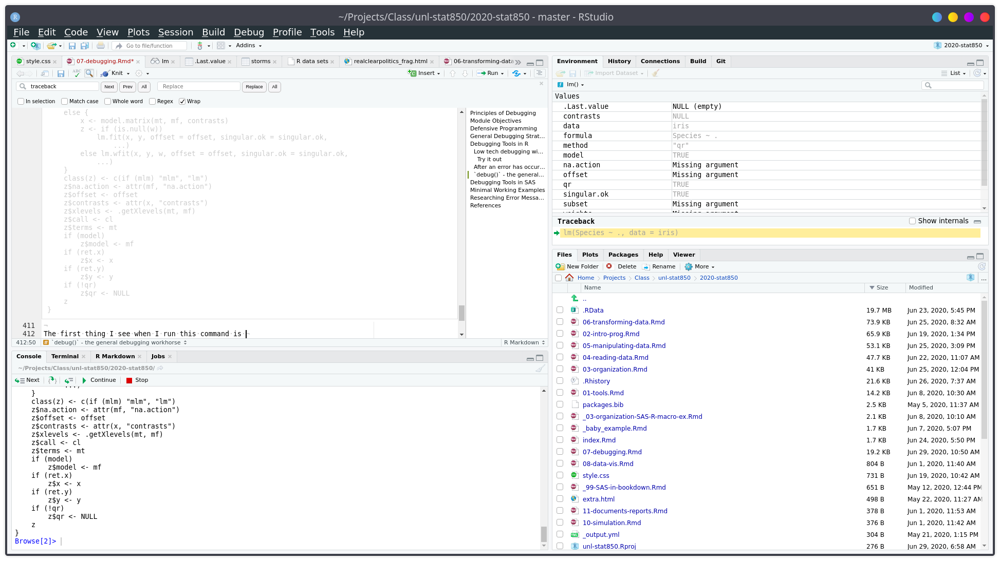
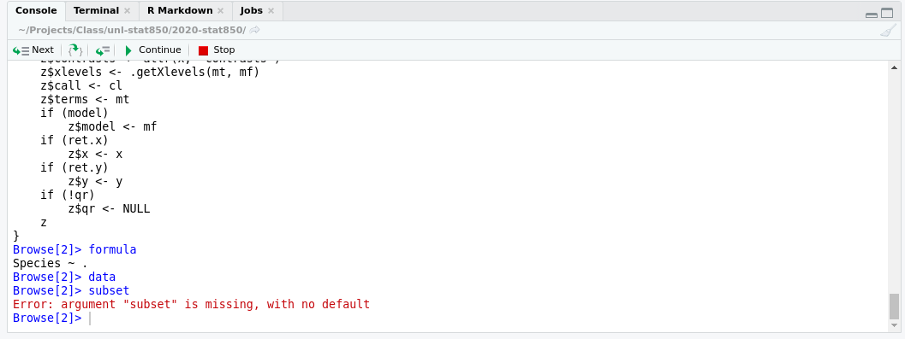
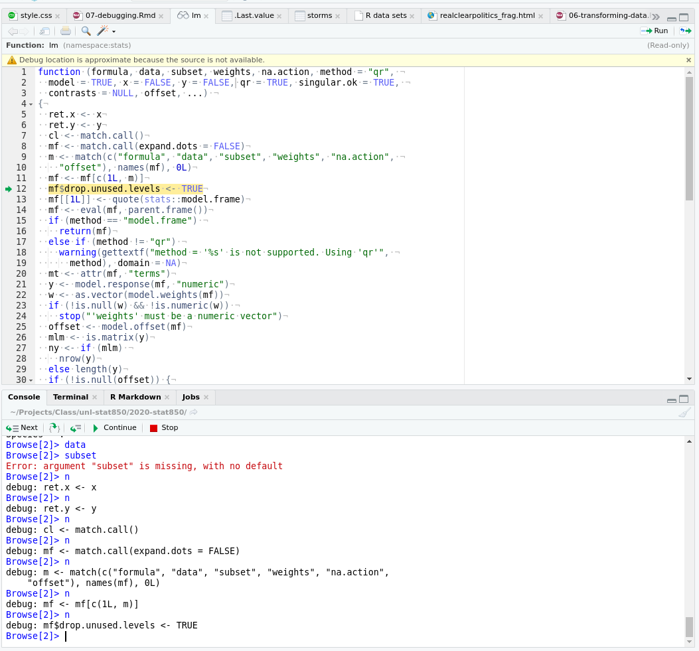

```{r, include = F}
.reset()
```

# Principles of Debugging {#debugging}

## Debugging: Module Objectives  {-} 

- Break down a complex procedure into simpler steps, mapping each step to a separate function which performs a single task.

- Simplify a problem to the minimal components necessary to reproduce the error, and use that information to ask for help appropriately.

- Use built-in debugging tools to trace an error to its source

- Use online forums and mailing lists to research error messages

Note: The skills in this chapter take a lifetime to truly master. The real goal here is that you know how to ask for help appropriately (and in a way that people will respond positively to) and that you know how to do the research to get help yourself. 


## Step 1: Check your spelling.

I'll guess that 80% of my personal debugging comes down to spelling errors and misplaced punctuation. 

```{r, echo = F}
if(!"tweetrmd"%in%installed.packages()) devtools::install_github("gadenbuie/tweetrmd")
if(!"webshot2"%in%installed.packages()) devtools::install_github("rstudio/webshot2")
# library(tweetrmd) # github.com/gadenbuie/tweetrmd
# library(memoise) # cache screenshots
tweet_cached <- memoise::memoise(tweetrmd::tweet_embed, cache = memoise::cache_filesystem('.tweets'))
tweet_shot_cached <- memoise::memoise(tweetrmd::tweet_screenshot, cache = memoise::cache_filesystem('.tweets'))

tweetrmd::tweet_screenshot(tweetrmd::tweet_url("Nasser_Junior", "1295805928315531264"))
```


## Defensive Programming

One of the best debugging strategies (that isn't a debugging strategy at all, really) is to code defensively. By that, I mean, code in a way that you will make debugging things easier later. 

- **Modularize your code**. Each function should do only one task, ideally in the least-complex way possible.

- **Make your code readable**. If you can read the code easily, you'll be able to narrow down the location of the bug more quickly.

- **Comment your code**. This makes it more likely that you will be able to locate the spot where the bug is likely to have occurred, and will remind you how things are calculated. Remember, comments aren't just for your collaborators or others who see the code. They're for future you.

- **Don't duplicate code**. If you have the same code (or essentially the same code) in two or three different places, put that code in a function and call the function instead. This will save you trouble when updating the code in the future, but also makes narrowing down the source of the bug less complex.

- **Reduce the number of dependencies** you have on outside software packages. Often bugs are introduced when a dependency is updated and the functionality changes slightly. The `tidyverse` is *notorious* for this.     
It's ok to write code using lots of dependencies, but as you transition from "experimental" code to "production" code (you're using the code without tinkering with it) you should work to reduce the dependencies, where possible. In addition, if you do need packages with lots of dependencies, try to make sure those packages are relatively popular, used by a lot of people, and currently maintained. (The tidyverse is a bit better from this perspective, because the constitutent packages are some of the most installed R packages on CRAN.)

- **Add safeguards against unexpected inputs**. Check to make sure inputs to the function are valid. Check to make sure intermediate results are reasonable (e.g. you don't compute the derivative of a function and come up with "a".)

- **Don't reinvent the wheel**. If you have working, tested code for a task, use that! If someone else has working code that's used by the community, don't write your own unless you have a very good reason. The implementation of `lm` has been better tested than your homegrown linear regression.    
(This is easier if you're writing modular code to begin with)

- Collect your often-reused code in packages (R) or scripts (SAS) that you can easily load and make available to "future you"

::: learn-more
Wikipedia's article on defensive programming is much more general than the applications to statistical programming, but may be [worth scanning](https://en.wikipedia.org/wiki/Defensive_programming). 
:::

## General Debugging Strategies

> Debugging: Being the detective in a crime movie where you are also the murderer. - some t-shirt I saw once

While defensive programming is a nice idea, if you're already at the point where you have an error you can't diagnose, then... it doesn't help that much. At that point, you'll need some general debugging strategies to work with. The overall process is well described in [Advanced R](https://adv-r.hadley.nz/debugging.html) by H. Wickham^[the 0th step is from the 1st edition, the remaining steps are from the 2nd.]; I've copied it here because it's such a succinct distillation of the process, but I've adapted some of the explanations to this class rather than the original c ontext of package development. 

0. Realize that you have a bug

1. **Google!** In R you can automate this with the `errorist` and `searcher` packages. In SAS, if the error message isn't that clear you'll find a SAS forum page where someone else has made the same mistake - I can almost guarantee it. 

2. **Make the error repeatable**: This makes it easier to figure out what the error is, faster to iterate, and easier to ask for help.
    - Use binary search (remove 1/2 of the code, see if the error occurs, if not go to the other 1/2 of the code. Repeat until you've isolated the error.)
    - Generate the error faster - use a minimal test dataset, if possible, so that you can ask for help easily and run code faster. This is worth the investment if you've been debugging the same error for a while. 
    - Note which inputs *don't* generate the bug -- this negative "data" is helpful when asking for help.

3. **Figure out where it is**. Debuggers may help with this, but you can also use the [scientific method](http://web.mit.edu/6.031/www/fa17/classes/13-debugging/#find_the_bug_using_the_scientific_method) to explore the code, or the tried-and-true method of using lots of `print()` statements.

4. **Fix it and test it**. The goal with tests is to ensure that the same error doesn't pop back up in a future version of your code. Generate an example that will test for the error, and add it to your documentation. If you're developing a package, unit test suites offer a more formalized way to test errors and you can automate your testing so that every time your code is changed, tests are run and checked.


There are several other general strategies for debugging:

- Visualize your data as it moves through the program. This may be done using `print()` statements, or the debugger, or some other strategy depending on your application.

- Tracing statements. Again, this is part of `print()` debugging, but these messages indicate progress - "got into function x", "returning from function y", and so on. 

- Rubber ducking. Have you ever tried to explain a problem you're having to someone else, only to have a moment of insight and "oh, nevermind"? Rubber ducking outsources the problem to a nonjudgemental entity, such as a rubber duck^[Some people use cats, but I find that they don't meet the nonjudgemental criteria. Of course, they're equally judgemental whether your code works or not, so maybe that works if you're a cat person, which I am not. Dogs, in my experience, can work, but often will try to comfort you when they realize you're upset, which both helps and lessens your motivation to fix the problem. A rubber duck is the perfect dispassionate listener.]. You simply explain, in terms simple enough for your rubber duck to understand, exactly what your code does, line by line, until you've found the problem. [A more thorough explanation can be found at gitduck.com](https://gitduck.com/blog/improve-how-to-code-with-rubber-duck-debugging/). 

```{r duck-cape, fig.cap = "You may find it helpful to procure a rubber duck expert for each language you work in. I use color-your-own rubber ducks to endow my ducks with certain language expertise. Other people use plain rubber ducks and give them capes.", out.width = '50%', echo = F}
knitr::include_graphics("image/rubber_duck_cape.png")
```

Do not be surprised if, in the process of debugging, you encounter new bugs. This is a problem that's well-known enough that it has its [own t-shirt](image/99bugs_shirt.png), in addition to an [xkcd comic](https://xkcd.com/1739/). At some point, getting up and going for a walk may help. Redesigning your code to be more modular and more organized is also a good idea. 

## Debugging Tools in R
Now that we've discussed general strategies for debugging that will work in any language, lets get down to the dirty details of debugging in R. 

### Low tech debugging with print() and other tools
Sometimes called "tracing" techniques, the most common, universal, and low tech strategy for debugging involves scattering messages throughout your code. When the code is executed, you get a window into what the variables look like during execution.

<details><summary>Simple example</summary>
Imagine we start with this:

```{r}
a <- function(x) {
  b <- function(y) {
    c <- function(z) {
      z + y
    }
    c(3)
  }
  x + b(4)
}

a(5)
```

and the goal is to understand what's happening in the code. We might add some lines:

```{r}
a <- function(x) {
  print(paste("Entering a(). x = ", x))
  b <- function(y) {
    print(paste("Entering b(). x = ", x, "y = ", y))
    c <- function(z) {
      print(paste("Entering c(). x = ", x, "y = ", y, "z = ", z))
      cres <- z + y
      print(paste("Returning", cres, "from c()"))
      cres
    }
    bres <- c(3)
    print(paste("Returning", bres, "from b()"))
    bres
  }
  ares <- x + b(4)
  print(paste("Returning",ares, "from a()"))
  ares
}

a(5)
```
</details>

For more complex data structures, it can be useful to add `str()`, `head()`, or `summary()` functions. 

<details><summary>Real world example</summary>
I was recently writing a webscraper to get election polling data from the RealClearPolitics site as part of the [`electionViz` package](github.com/heike/electionViz). I wrote the function `search_for_parent()` to get the parent HTML tag which matched the "tag" argument, that had the "node" argument as a descendant. 

I was assuming that the order of the parents would be "html", "body", "div", "table", "tbody", "tr" - descending from outer to inner (if you know anything about HTML/XML structure). 

```{r}
library(xml2) # read html

search_for_parent <- function(node, tag) {
  # Get all of the parent nodes 
  parents <- xml2::xml_parents(node)
  # Get the tags of every parent node
  tags <- purrr::map_chr(parents, rvest::html_name)
  print(tags)
  
  # Find matching taggs
  matches <- which(tags == tag)
  print(matches)
  
  # Take the minimum matching tag
  min_match <- min(matches)
  if (length(matches) == 1) return(parents[min_match]) else return(NULL)
}

page <- read_html("data/realclearpolitics_frag.html")
node <- xml_find_all(page, "//td[@class='lp-results']") # find all poll results in any table
search_for_parent(node[1], "table") # find the table that contains it
```
By printing out all of the tags that contain `node`, I could see the order -- inner to outer. I asked the function to return the location of the first table node, so the index (2nd value printed out) should match table in the character vector that was printed out first. I could then see that the HTML node that is returned is in fact the table node. 
</details>

#### Try it out {- .tryitout}

Not all bugs result in error messages, unfortunately, which makes higher-level techniques like `traceback()` less useful. The low-tech debugging tools, however, still work wonderfully. 

```{r setup-debug-code, message = F, warning = F}
library(ggplot2)
library(dplyr)
library(magrittr)
library(maps)
library(ggthemes)
worldmap <- map_data("world")

# Load the data
data(storms, package = "dplyr")
```


The code below is supposed to print out a map of the tracks of all hurricanes of a specific category, 1 to 5, in 2013. Use print statements to figure out what's wrong with my code. 

```{r, message = F, warning = F, out.width = "18%"}
# Make base map to be used for each iteration
basemap <-  ggplot() + 
  # Country shapes
  geom_polygon(aes(x = long, y = lat, group = group), 
               data = worldmap, fill = "white", color = "black") + 
  # Zoom in 
  coord_quickmap(xlim = c(-100, -10), ylim = c(10, 50)) + 
  # Don't need scales b/c maps provide their own geographic context...
  theme_map()

for (i in 1:5) {
  # Subset the data
  subdata <- storms %>%
    filter(year == 2013) %>%
    filter(status == i)
  
  # Plot the data - path + points to show the observations
  plot <- basemap +
    geom_path(aes(x = long, y = lat, color = name), data = subdata) + 
    geom_point(aes(x = long, y = lat, color = name), data = subdata) + 
    ggtitle(paste0("Category ", i, " storms in 2013"))
  print(plot)
}


```

<details><summary>Solution</summary>
First, lets split the setup from the loop. 
```{r, error = T}
# Make base map to be used for each iteration
basemap <-  ggplot() + 
  # Country shapes
  geom_polygon(aes(x = long, y = lat, group = group), 
               data = worldmap, fill = "white", color = "black") + 
  # Zoom in 
  coord_quickmap(xlim = c(-100, -10), ylim = c(10, 50)) + 
  # Don't need scales b/c maps provide their own geographic context...
  theme_map()

print(basemap) # make sure the basemap is fine

# Load the data
data(storms, package = "dplyr")

str(storms) # make sure the data exists and is formatted as expected
```

Everything looks ok in the setup chunk...

```{r}
for (i in 1:5) {
  print(paste0("Category ", i, " storms"))
  # Subset the data
  subdata <- storms %>%
    filter(year == 2013) %>%
    filter(status == i)
  
  print(paste0("subdata dims: nrow ", nrow(subdata), " ncol ", ncol(subdata)))
        # str(subdata) works too, but produces more clutter. I started
        # with str() and moved to dim() when I saw the problem
  
  # Plot the data - path + points to show the observations
  plot <- basemap +
    geom_path(aes(x = long, y = lat, color = name), data = subdata) + 
    geom_point(aes(x = long, y = lat, color = name), data = subdata) + 
    ggtitle(paste0("Category ", i, " storms in 2013"))
  # print(plot) # Don't print plots - clutters up output at the moment
}
```

Ok, so from this we can see that something is going wrong with our filter statement - we have no rows of data.

```{r}
head(storms)
```

Whoops. I meant "category" when I typed "status". 

```{r, error = T}
for (i in 1:5) {
  print(paste0("Category ", i, " storms"))
  # Subset the data
  subdata <- storms %>%
    filter(year == 2013) %>%
    filter(category == i)
  
  print(paste0("subdata dims: nrow ", nrow(subdata), " ncol ", ncol(subdata)))
        # str(subdata) works too, but produces more clutter. I started
        # with str() and moved to dim() when I saw the problem
  
  # Plot the data - path + points to show the observations
  plot <- basemap +
    geom_path(aes(x = long, y = lat, color = name), data = subdata) + 
    geom_point(aes(x = long, y = lat, color = name), data = subdata) + 
    ggtitle(paste0("Category ", i, " storms in 2013"))
  # print(plot) # Don't print plots - clutters up output at the moment
}
```

Ok, that's something, at least. We now have some data for category 1 storms...

```{r}
filter(storms, year == 2013) %>%
  # Get max category for each named storm
  group_by(name) %>%
  filter(category == max(category)) %>%
  ungroup() %>%
  # See what categories exist
  select(name, category) %>%
  unique()
```

It looks like 2013 was just an incredibly quiet year for tropical activity. 

2004, however, was not. So let's just make sure our code works by checking out 2004. 

```{r, error = T}
for (i in 1:5) {
  print(paste0("Category ", i, " storms"))
  # Subset the data
  subdata <- storms %>%
    filter(year == 2004) %>%
    filter(category == i)
  
  print(paste0("subdata dims: nrow ", nrow(subdata), " ncol ", ncol(subdata)))
        # str(subdata) works too, but produces more clutter. I started
        # with str() and moved to dim() when I saw the problem
  
  # Plot the data - path + points to show the observations
  plot <- basemap +
    geom_path(aes(x = long, y = lat, color = name), data = subdata) + 
    geom_point(aes(x = long, y = lat, color = name), data = subdata) + 
    ggtitle(paste0("Category ", i, " storms in 2013"))
  print(plot) # Don't print plots - clutters up output at the moment
}
```

If we want to only print informative plots, we could add an if statement. Now that the code works, we can also comment out our print() statements (we could delete them, too, depending on whether we anticipate future problems with the code). 


```{r, error = T}
for (i in 1:5) {
  # print(paste0("Category ", i, " storms"))
  
  # Subset the data
  subdata <- storms %>%
    filter(year == 2013) %>%
    filter(category == i)
  
  # print(paste0("subdata dims: nrow ", nrow(subdata), " ncol ", ncol(subdata)))
  #       # str(subdata) works too, but produces more clutter. I started
  #       # with str() and moved to dim() when I saw the problem
  
  # Plot the data - path + points to show the observations
  plot <- basemap +
    geom_path(aes(x = long, y = lat, color = name), data = subdata) + 
    geom_point(aes(x = long, y = lat, color = name), data = subdata) + 
    ggtitle(paste0("Category ", i, " storms in 2013"))
  
  if (nrow(subdata) > 0) print(plot) 
}
```
</details>

### After an error has occurred - `traceback()`

`traceback()` can help you narrow down where an error occurs by taking you through the series of function calls that led up to the error. This can help, but it can also be pretty arcane. 

<details><summary>`traceback()` example</summary>
```{r, error = T}
a <- function(x) {
  b <- function(y) {
    c <- function(z) {
     stop('there was a problem')  # This generates an error
    }
    c()
  }
  b()
}

a()
```

For more information, you could run traceback
```{r, eval = F}
traceback()
```

Which will provide the following output:
```
4: stop("there was a problem") at #4
3: c() at #6
2: b() at #8
1: a()
```

Reading through this, we see that a() was called, b() was called, c() was called, and then there was an error. It's even kind enough to tell us that the error occurred at line 4 of the code. 

If you are running this code interactively in RStudio, it's even easier to run `traceback()` by clicking on the "Show Traceback" option that appears when there is an error.

```{r echo = F, fig.cap = "Both Show Traceback and Rerun with Debug are useful tools", out.width = "50%"}
knitr::include_graphics("image/Rstudio_rerun_traceback.png")
```

If you are using `source()` to run the code in Rstudio, it will even provide a link to the file and line location of the error. 

</details>

### `browser()` - debugging your own code, interactively

The `browser()` function is useful for debugging your own code. If you're writing a function and something isn't working quite right, you can insert a call to `browser()` in that function, and examine what's going on. 

<details><summary>Example of using browser()</summary>
Suppose that I want to write a function that will plot an xkcd comic in R. 

I start with 
```{r}
library(png)
library(xml2)

# get the most current xkcd
get_xkcd <- function(id = NULL) {
  url <- "http://xkcd.com"
  page <- read_html(url)
  # Find the comic
  image <- xml_find_first(page, "//div[@id='comic']/img") %>%
    # pull the address out of the tag
    xml_attr("src")
  
  
  readPNG(source = image)
}
```

Watch this live-coding video to see how I use browser() to figure out what's going on in the function and how to fix it.

Here's the final function
```{r}
library(png)
library(xml2)

# get the most current xkcd
get_xkcd <- function(id = NULL) {
  
  url <- "http://xkcd.com"
  page <- read_html(url)
  # Find the comic
  image <- xml_find_first(page, "//div[@id='comic']/img") %>%
    # pull the address out of the tag
    xml_attr("src")
  
  # Fix image address so that we can access the image
  image <- substr(image, 3, nchar(image))
  
  # Download the file to a temp file and read from there
  file_location <- tempfile(fileext = ".png")
  download.file(image, destfile = file_location, quiet = T)
  
  readPNG(source = file_location)
}

get_xkcd() %>%
  as.raster() %>%
  plot()
```
</details>

#### Try it out {- .tryitout}
Each xkcd has a corresponding ID number (ordered sequentially from 1 to 2328 at the time this was written). Modify the XKCD function above to make use of the id parameter, so that you can pass in an ID number and get the relevant comic. Use browser() to help you figure out what logic you need to add. You should not need to change the web scraping code - the only change should be to the URL. 
What things might you add to make this function "defensive programming" compatible? 

<details><summary>Solution</summary>
```{r}
# get the most current xkcd or the specified number
get_xkcd <- function(id = NULL) {
  if (is.null(id)) {
    # Have to get the location of the image ourselves
    url <- "http://xkcd.com"
  } else if (is.numeric(id)) {
    url <- paste0("http://xkcd.com/", id, "/")
  } else {
    # only allow numeric or null input
    stop("To get current xkcd, pass in NULL, otherwise, pass in a valid comic number")
  }

  page <- read_html(url)
  # Find the comic
  image <- xml_find_first(page, "//div[@id='comic']/img") %>%
    # pull the address out of the tag
    xml_attr("src")
  # Fix image address so that we can access the image
  image <- substr(image, 3, nchar(image)) # cut the first 2 characters off

  # make temp file
  location <- tempfile(fileext = "png")
  download.file(image, destfile = location, quiet = T)

  # This checks to make sure we saved the file correctly
  if (file.exists(location)) {
    readPNG(source = location)
  } else {
    # Give a good informative error message
    stop(paste("Something went wrong saving the image at ", image, " to ", location))
  }
}

get_xkcd(2259) %>%
  as.raster() %>% 
  plot()
```
</details>

### `debug()` - the general debugging workhorse

In the `traceback()` Rstudio output, the other option is "rerun with debug". In short, debug mode opens up a new interactive session inside the function evaluation environment. This lets you observe what's going on in the function, pinpoint the error (and what causes it), and potentially fix the error, all in one neat workflow. 

`debug()` is most useful when you're working with code that you didn't write yourself. So, if you can't change the code in the function causing the error, `debug()` is the way to go. Otherwise, using `browser()` is generally easier. Essentially, `debug()` places a `browser()` statement at the first line of a function, but without having to actually alter the function's source code. 

<details><summary>Example of using debug </summary>
```{r, error = T}
data(iris)

tmp <- lm(Species ~ ., data = iris)
summary(tmp)
```
We get this weird warning, and then an error about factors when we use summary() to look at the coefficients. 

```{r, eval = F}
debug(lm) # turn debugging on


tmp <- lm(Species ~ ., data = iris)
summary(tmp)

undebug(lm) # turn debugging off)
```





After pressing "next" a few times, you can see that I've stepped through the first few lines of the lm function.


We can see that once we're at line 21, we get a warning about using type with a factor response, and that the warning occurs during a call to the `model.response` function. So, we've narrowed our problem down - we passed in a numeric variable as the response (y) variable, but it's a factor, so our results aren't going to mean much. We were using the function wrong.

We probably could have gotten there from reading the error message carefully, but this has allowed us to figure out exactly what happened, where it happened, and why it happened. 


But, until I run `undebug(lm)`, every call to `lm` will take me into the debug window. 
</details>

`undebug(f)` will remove the debug flag on the function `f`. `debugonce(f)` will only debug f the first time it is run. 


### Try it out {- .tryitout}
larger(x, y) is supposed to return the elementwise maximum of two vectors. 

```{r}
larger <- function(x, y) { 
  y.is.bigger <- y > x 
  x[y.is.bigger] <- y[y.is.bigger] 
  x
} 

larger(c(1, 5, 10), c(2, 4, 11))
```
```{r}
larger(c(1, 5, 10), 6)
```
Why is there an NA in the second example? It should be a 6. Figure out why this happens, then try to fix it. 

<details><summary>Solution</summary>
I'll replicate "debug" in non-interactive mode by setting up an environment where x and y are defined
```{r}

x <- c(1, 5, 10)
y <- 6

# Inside of larger() with x = c(1, 5, 10), y = 6
(y.is.bigger <- y > x ) # putting something in () prints it out
y[y.is.bigger] # This isn't quite what we were going for, but it's what's causing the issue
x[y.is.bigger] # What gets replaced


# Better option
larger <- function(x, y) { 
  y.is.bigger <- y > x 
  ifelse(y.is.bigger, y, x)
} 

```

</details>


## Debugging Tools in SAS

In SAS, there are two stages that occur after you submit lines to the console. 
- The Compilation Phase: code is parsed. In this step, SAS will catch the logic errors, misspellings, missing key words, etc.
- The Execution Phase: program is run. In this step, SAS will catch any wrong assignments, loop issues, etc.

Sas recognizes four types of errors:
- Syntax errors - violations of the language structure
- Semantic errors - structure of the statement is incorrect, but the syntax is correct. e.g. trying to reference an index that doesn't exist.
- Execution-time errors - errors that occur when the compiled function is run on data values -- e.g. division by zero
- Data errors - errors that occur when statements are correct but data is invalid (taking the log of a negative number, etc.)


SAS is built around enterprise users, as opposed to R's open-source philosophy. SAS code also is more formulaic than R code, which means it is usually easier to figure out what is going wrong with the code. As a result, you may find that errors in your SAS code are much easier to diagnose than errors in your R code. Generally, it will tell you exactly where you are missing a semicolon, or exactly what word it thinks you've misspelled (and usually, it tries to correct that for you, but it doesn't always succeed). In my experience with SAS (which is very limited and mostly contained in this book), SAS error messages are much easier to google and find solutions, right up until you're working in Linux or some other not-well-supported system and the error is related to how the underlying OS handles some task. As a downside, though, trying to do a task SAS doesn't think you need to do can be much more difficult than necessary. 

See the references section for a couple of good guides to SAS error statements and warnings. These guides are likely sufficient for most of your SAS debugging needs. 

There are certainly other errors which can occur in SAS -- logic errors are not something SAS can protect you from . These errors can have dramatic consequences, as demonstrated in [this twitter thread](https://twitter.com/eric_weinhandl/status/1253127109830156289) about a [JAMA retraction due to a coding error](https://twitter.com/hswapnil/status/1252783448055517185). To debug these types of errors, you can use the same print() techniques demonstrated in R. For these types of errors, there's nothing special about what language you're using (outside of the usual quirks of every language) - the error is in the logic, not the encoding of that logic. 

## Minimal Working Examples

If all else has failed, and you can't figure out what is causing your error, it's probably time to ask for help. If you have a friend or buddy that knows the language you're working in, by all means ask for help sooner - use them as a rubber duck if you have to. But when you ask for help online, often you're asking people who are much more knowledgeable about the topic - members of R core and SAS browse stackoverflow and may drop in and help you out. Under those circumstances, it's better to make the task of helping you as easy as possible because it shows respect for their time. The same thing goes for your supervisors and professors. 

So, with that said, there are numerous resources for writing what's called a "minimal working example", "reproducible example" (commonly abbreviated reprex), or MCVE (minimal complete verifiable example). Much of this is lifted directly from the StackOverflow post describing a [minimal reproducible example](https://stackoverflow.com/help/minimal-reproducible-example).

The goal is to reproduce the error message with information that is 
- **minimal** - as little code as possible to still reproduce the problem
- **complete** - everything necessary to reproduce the issue is contained in the description/question
- **reproducible** - test the code you provide to reproduce the problem. 

You should format your question to make it as easy as possible to help you. Make it so that code can be copied from your post directly and pasted into a terminal. Describe what you see and what you'd hope to see if the code were working. 

## References {- .learn-more}

- [Stalking the elusive computer bug](https://doi.org/10.1109/85.728224) - the etymology and historical use of the term "debugging", from Thomas Edison to Grace Hopper.

- [Debugging](http://web.mit.edu/6.031/www/fa17/classes/13-debugging/) (lecture materials from software construction class at MIT) - written with java, but mostly comprehensible for any language.

- [Debugging with RStudio](https://support.rstudio.com/hc/en-us/articles/205612627-Debugging-with-RStudio)

- [An Introduction to the Interactive Debugging Tools in R](http://www.biostat.jhsph.edu/~rpeng/docs/R-debug-tools.pdf)

- [Stackoverflow: General Suggestions for Debugging in R](https://stackoverflow.com/questions/4442518/general-suggestions-for-debugging-in-r)

- [WTF R - What They Forgot to Teach You about R Debugging chapter](https://rstats.wtf/debugging-r-code.html)

- [Debugging 101 in SAS](https://support.sas.com/resources/papers/proceedings16/2748-2016.pdf)

- [Debugging SAS Programs - Ch. 1: The Basics of Debugging](https://support.sas.com/publishing/pubcat/chaps/57743.pdf)

- [A webinar by Jenny Bryan/RStudio on Reproducible Examples](https://rstudio.com/resources/webinars/help-me-help-you-creating-reproducible-examples/)

