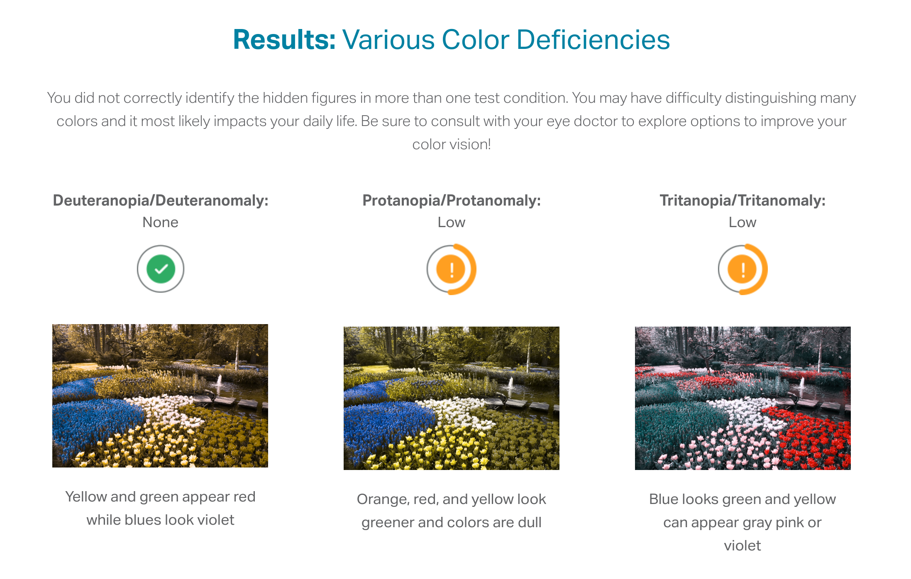
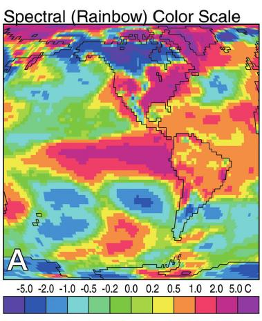
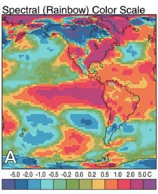
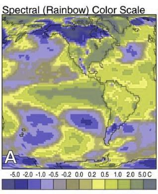
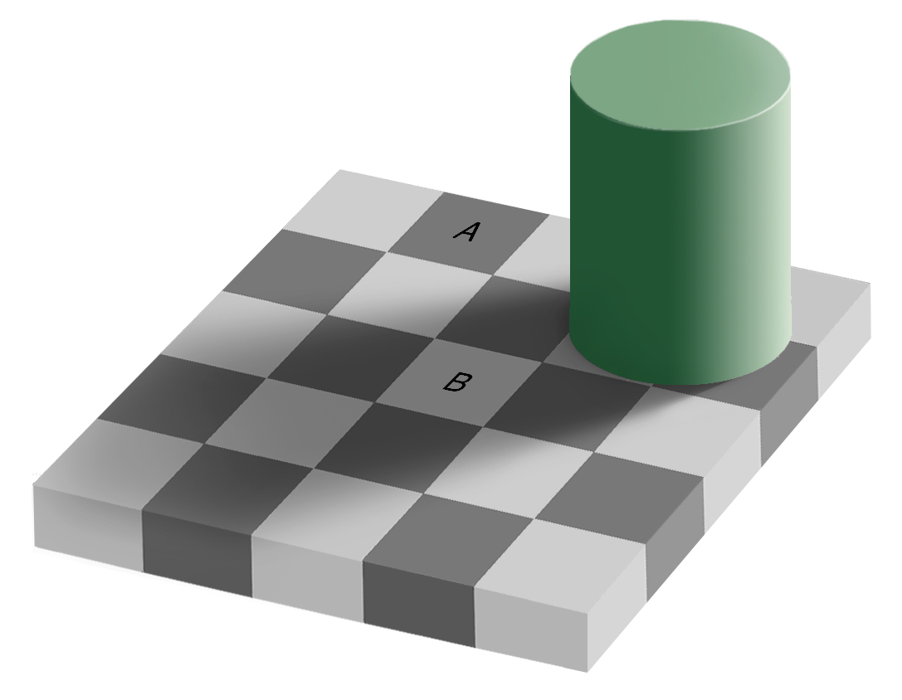
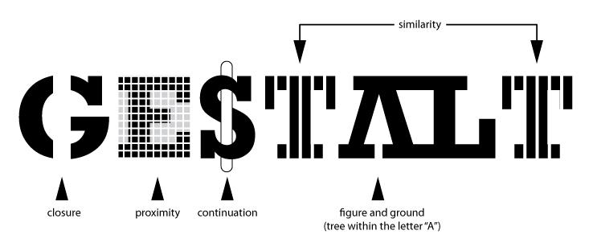

```{r, include = F}
.reset()
```
# Introduction to Data Visualization {#data-vis-intro}

## Module Objectives {-} {#08-module-objs}

- Create statistical charts in SAS and R
- Use the grammar of graphics to describe different types of charts and graphs
- Use the grammar of graphics to create layered graphics and highlight different features of a data set
- Modify or construct alternate charts showing the same material with better readability and accessibility


There are a lot of different types of charts, and equally many ways  to categorize and describe the different types of charts. <details><summary>This is one of the less serious schemes I've seen</summary>
But, in my opinion, Randall missed the opportunity to put a pie chart as Neutral Evil. 


</details>

Hopefully by the end of this, you will be able to at least make the charts which are most commonly used to show data and statistical concepts. 

This is going to be a fairly extensive chapter (in terms of content) because I want you to have a resource to access later, if you need it. But, this is also the chapter where we really start to focus on R instead of SAS. Even the hardcore SAS users I know (in this department and others) go into R when they want to make a publication-quality chart. 

Visualization and statistical graphics are also my research area, so I'm probably going to be a bit more passionate about this chapter, which means there's probably going to be more to read. Sorry about that in advance. I'll do my best to indicate which content is actually mission-critical and which content you can skip if you're not that interested.

<details><summary>R package setup</summary>
```{r, message = F}
library(readr)
library(dplyr)
library(tidyr)
library(ggplot2)
```
</details>

## Why do we create graphics?

> The greatest possibilities of visual display lie in vividness and inescapability of the intended message. A visual display can stop your mental flow in its tracks and make you think. A visual display can force you to notice what you never expected to see. ("Why, that scatter diagram has a hole in the middle!") -- John Tukey, [Data Based Graphics: Visual Display in the Decades to Come](https://projecteuclid.org/euclid.ss/1177012101)

<details><summary>Charts are easier to understand than raw data. (more details inside) </summary>
When you think about it, data is a pretty artificial thing. We exist in a world of tangible objects, but data are an abstraction - even when the data record information about the tangible world, the measurements are a way of removing the physical and transforming the "real world" into a virtual thing. As an artificial entity, it can be hard to wrap our heads around what our data contain. The solution to this is to transform our data back into something that is "tangible" in some way -- if not physical and literally touch-able, at least something we can view and "wrap our heads around". 

Consider this thought experiment: You have a simple data set - 2 variables, 500 observations. You want to get a sense of how the variables relate to each other. You can do one of the following options:

1. Print out the data set
2. Create some summary statistics of each variable and perhaps the covariance between the two variables
3. Draw a scatter plot of the two variables

Which one would you rather use? Why?

Our brains are very good at processing large amounts of visual information quickly - it's important to be able to e.g. survey a field and pick out the tiger that might eat you. When we present information visually, in a format that can leverage our visual processing abilities, we offload some of the work of understanding the data to a chart that organizes it for us. You could argue that printing out the data is a visual presentation, but it requires that you read that data in as text, which we're not nearly as equipped to process quickly (and in parallel). 

In addition, I've found that it's a lot easier to talk to non-experts about complicated statistics using visualizations. Moving the discussion from abstract concepts to concrete shapes and lines keeps people who are potentially already math or stat phobic from completely panicking and tuning out.
</details>

## General approaches to creating graphics

There are two general approaches to generating statistical graphics computationally: 

1. Manually specify the plot that you want, doing the preprocessing and summarizing before you create the plot.

2. Describe the relationship between the plot and the data, using sensible defaults that can be customized for common operations.

In the introduction to [The Grammar of Graphics](https://www.springer.com/gp/book/9780387245447), Leland Wilkinson suggests that the first approach is what we would call "charts" - pie charts, line charts, bar charts - objects that are "instances of much more general objects". He's arguing for the virtues of the 2nd approach -- the grammar of graphics, so his opinion is hardly unbiased, but it is an interesting distinction. His argument is that elegant graphical design means we have to think about an underlying theory of graphics, rather than how to create specific charts.

Base R graphics and the original SAS graphics engine fall firmly into the first camp. `ggplot2` was designed using the philosophy of the grammar of graphics, and is still the primary place that people learn about the grammar of graphics in statistics. The SAS ODS Graphics Engine^[I'll fully admit my bias here - I think ODS graphics are better than the default SAS graphics, but I still prefer the syntax and logic behind ggplot2. But, if you prefer SAS Graphics, you do you. Better you than me, is all I'm saying.] falls somewhere in between the two approaches - it provides some sensible defaults, but its design isn't rooted in the philosophy of the grammar of graphics, so if (as some SAS manuals have claimed) there is a similarity between the two, it's functional (in my opinion) and not because of an underlying similarity in the design strategy.

::: note
In either case, you're going to learn how to make graphics by finding sample code, changing that code to match your data set, and tweaking things as you go. That's the best way to learn this, and while option 2 does have a structure and some syntax to learn, once you're familiar with the principles, you'll still want to learn graphics by doing it. 
:::

There are other graphics systems in R (namely, `lattice`, plus some web-based rendering engines) that you could explore, but it's far more important that you know how to functionally create plots in R and/or SAS. I don't recommend you try to become proficient in all of them. Pick one (two at most) and get to know that, then google for the rest.


Before we delve into the grammar of graphics, let's motivate the philosophy using a simple task. Suppose we want to create a pie chart using some data. [Pie charts are terrible, and we've known it for 100 years](http://www.jstor.org/stable/2276829), so in the interests of showing that we know that pie charts are awful, we'll also create a stacked bar chart, which is the most commonly promoted alternative to a pie chart. We'll talk about what makes pie charts terrible at the end of this module. 

<details><summary>R base graphics example</summary>
```{r r-example-data-08, message = F}
# Setup the data
poke <- read_csv("data/pokemon_ascii.csv", na = '.') %>%
  mutate(generation = factor(generation))
```

Let's start with what we want: for each generation, we want the total number of pokemon. 

To get a pie chart, we want that information mapped to a circle, with each generation represented by an angle whose size is proportional to the number of pokemon in that generation.

```{r base-pie-08}
# Create summary of pokemon by type
tmp <- poke %>%
  group_by(generation) %>%
  count() 

pie(tmp$n, labels = tmp$generation)

# with(., <base command>) let you use the pipe easily with a base R command
# that is otherwise not pipe friendly, e.g. 
# with(tmp, pie(n, labels = generation))
```

We could alternately make a bar chart and stack the bars on top of each other. This also shows proportion (section vs. total) but does so in a linear fashion.

```{r base-barplot-08}
# Create summary of pokemon by type
tmp <- poke %>%
  group_by(generation) %>%
  count() 

# Matrix is necessary for a stacked bar chart
matrix(tmp$n, nrow = 8, ncol = 1, dimnames = list(tmp$generation)) %>%
barplot(beside = F, legend.text = T, main = "Generations of Pokemon")
```
</details>

<details><summary>R ggplot2 graphics</summary>
In ggplot2, we start by specifying which variables we want to be mapped to which features of the data. 

In a pie or stacked bar chart, we don't care about the x coordinate - the whole chart is centered at (0,0) or is contained in a single "stack". So it's easiest to specify our x variable as a constant, "". We care about the fill of the slices, though - we want each generation to have a different fill color, so we specify generation as our fill variable. 

Then, we want to summarize our data by the number of objects in each category - this is basically a stacked bar chart. Any variables specified in the plot statement are used to implicitly calculate the statistical summary we want -- that is, to count the rows (so if we had multiple x variables, the summary would be computed for both the x and fill variables). ggplot is smart enough to know that when we use `geom_bar`, we generally want the y variable to be the count, so we can get away with leaving that part out. We just have to specify that we want the bars to be stacked on top of one another (instead of next to each other, "dodge").

```{r gg-bar-08}
ggplot(aes(x = "", fill = generation), data = poke) + 
  geom_bar(position = "stack") 
```

If we want a pie chart, we can get one very easily - we transform the coordinate plane from Cartesian coordinates to polar coordinates. We specify that we want angle to correspond to the "y" coordinate, and that we want to start at $\theta = 0$. 

```{r gg-pie-08, message = F}
ggplot(aes(x = "", fill = generation), data = poke) + 
  geom_bar(position = "stack") + 
  coord_polar("y", start = 0)
```

Notice how the syntax and arguments to the functions didn't change much between the bar chart and the pie chart? That's because the `ggplot` package uses what's called the **grammar of graphics**, which is a way to describe plots based on the underlying mathematical relationships between data and plotted objects. In base R and SAS, different types of plots will have different syntax, arguments, etc., but in ggplot2, the arguments are consistently named, and for plots which require similar transformations and summary observations, it's very easy to switch between plot types by changing one word or adding one transformation.
</details>

<details><summary>SAS Examples</summary>
Original SAS graphics engine

Note: This code runs, but it causes every other sas chunk in this document to go haywire... so you'll have to copy the code and run it on your own to see what it looks like. 
```
libname classdat "sas/";

/* This step creates a constant variable in the data frame, 
so that all generations can be stacked in one bar */
DATA poketmp;
SET classdat.poke;
i = 1;
RUN;

PROC GCHART data=poketmp;
pie generation / other = 0;
RUN;
QUIT; 
  
PROC GCHART data=poketmp;
VBAR i / SUBGROUP = generation;
RUN;
QUIT; 
/* Note that if you forget the quit statement using SASMarkdown, things dont work well */
```

ODS Graphics    
Note: This is a terrible example in SAS because there isn't an easy way to create a pie chart^[It's not often you'll find me approving of SAS graphics, but making it hard to make pie charts is definitely a point in SAS's favor]. We have to resort to using SAS Graph Template Language. 

```{sashtml ods-pie, error = T, fig.path = "image/"}
libname classdat "sas/";

DATA poketmp;
SET classdat.poke;
i = 1;
RUN;

/* Define a pie chart template */
PROC TEMPLATE;
DEFINE STATGRAPH WORK.simplepie;
  BEGINGRAPH;
    LAYOUT REGION;
      PIECHART category=generation;
    ENDLAYOUT;
  ENDGRAPH;
END;
RUN;

/* Make the pie chart */ 
PROC SGRENDER data=classdat.poke template=WORK.simplepie;
RUN;
QUIT; 

/* Use SGPLOT to make a stacked bar chart */
PROC SGPLOT data=poketmp;
VBAR i / GROUP = generation;
RUN;
QUIT; 
```
As in base R, the syntax between the two types of charts is different, even though the underlying operations required to make the plots are very similar.  This is one example of why I don't agree with the assertion that ODS graphics is like ggplot2 syntax - the functionality may be similar, but the structure is not. 
</details>

If only because it provides us with a place to start (because otherwise, we would just work through a graph gallery or two, and that's boring), we'll talk first about the general idea behind the grammar of graphics. For each concept, I'll provide you first with the ggplot grammar of graphics code, and then, where it is possible to replicate the chart easily in base R or SAS ODS graphics, I will provide code for that as well - so that you can compare the approaches, but also so that you get a sense for what is easy and what is possible in each plotting system. 


## The Grammar of Graphics

<!-- A basic sentence has a subject and a predicate (usually, this contains a verb), but of course, there are infinintely many ways to combine and expand on a single sentence. The structure of the sentence describes how the subject relates to the predicate, with clauses and so on that modify the original meaning.  -->

<!-- The grammar of graphics is designed as an object-oriented graphics system. That is, the idea is that there are certain objects that communicate with each other. Each object does a few things well, and the intelligence is in the system, not in the objects themselves. This design principle means that objects can be repurposed for many things (because each object is relatively simple and modular).  -->

In the grammar of graphics, a plot consists of several mostly independent specifications:

1. **aesthetics** - links between data variables and graphical features (position, color, shape, size)
2. **layers** - geometric elements (points, lines, rectangles, text, ...) 
3. **transformations** - transformations specify a functional link between the data and the displayed information (identity, count, bins, density, regression). Transformations act on the variables. 
4. **scales** - scales map values in data space to values in the aesthetic space. Scales change the coordinate space of an aesthetic, but don't change the underlying value (so the change is at the visual level, not the mathematical level). 
5. **coordinate system** - e.g. polar or Cartesian
6. **faceting** - facets allow you to split plots by other variables to produce many sub-plots.
7. **theme** - formatting items, such as background color, fonts, margins...

We can contrast this with other plotting systems (e.g. Base R), where transformations and scales must be handled manually, there may be separate plotting systems for different coordinate systems, etc. 

Functionally, the biggest difference between the two systems is that in the grammar of graphics system (as implemented in ggplot2), we work with a full tabular data set. So like the rest of the tidyverse, ggplot2 will allow you to reference bare column names as if they were variables, so long as you've passed in the data set to the `data =` argument.^[This can sometimes be a pain, though, depending on the set up, because you may end up with labels that are repeated many, many times. As with any system, you just have to make sure you're formatting your data consistent with the underlying philosophy.] 

<details><summary>Let's get the data set up in both SAS and R</summary>
```{r r-data-setup-08, cache = F}
if (!"classdata" %in% installed.packages()) devtools::install_github("heike/classdata") 
# A package of data sets which are useful for class demonstrations
library(classdata)
library(tidyr)
library(dplyr)
data(happy) # you'll use this for try it out sections
data(fbi)


fbiwide <- fbi %>%
  select(-Violent.crime) %>%
  pivot_wider(names_from = Type, values_from = Count) %>%
  # Rename variables
  rename(Murder = Murder.and.nonnegligent.Manslaughter, 
         Assault = Aggravated.assault, 
         Larceny = Larceny.theft, 
         Auto.theft = Motor.vehicle.theft) %>%
  mutate(Rape = as.numeric(Rape))

# Write a csv out to a file to read into sas
if(!file.exists("data/happy.csv")) write_csv(happy, "data/happy.csv", na = ".")
if(!file.exists("data/fbi.csv")) write_csv(fbi, "data/fbi.csv", na = ".")
if(!file.exists("data/fbiwide.csv")) write_csv(fbiwide, "data/fbiwide.csv", na = ".")
```

```{sas sas-data-setup-08, error = T}
libname classdat "sas/";

PROC IMPORT datafile = "data/happy.csv" out=classdat.happy
    DBMS = CSV 
    REPLACE; 
    GETNAMES = YES;
    GUESSINGROWS = 5000;
RUN;

PROC IMPORT datafile = "data/fbi.csv" out=classdat.fbi
    DBMS = CSV 
    REPLACE; 
    GETNAMES = YES;
    GUESSINGROWS = 5000;
RUN;

PROC IMPORT datafile = "data/fbiwide.csv" out=classdat.fbiwide
    DBMS = CSV 
    REPLACE; 
    GETNAMES = YES;
    GUESSINGROWS = 2000;
RUN;
```
</details>


### Demonstration: Aesthetic Mappings and Basic Plots

<details><summary>Basic Scatter plots</summary>
A basic scatter plot is a combination of an aesthetic mapping for x and y (position), combined with the specification that the geometric object to be displayed is a point. Without any of the components (x, y, geom_point) you don't have a scatter plot. 
```{r aes-basic-08}
ggplot(fbiwide, aes(x = Burglary, y = Murder)) + geom_point()
```

<details><summary>Base R</summary>
```{r aes-baseR-08, error = T}
plot(x = Burglary, y = Murder, data = fbiwide) # this doesn't work

plot(x = fbiwide$Burglary, y = fbiwide$Murder) # you can use numeric vector arguments


# another option is to use formula notation, that is, y ~ x. 
# If you use formula notation, you can pass in a data frame using the 
# data argument and R will interpret things correctly
plot(Murder ~ Assault, data = fbiwide) 
```
</details>

<details><summary>SAS ODS Graphics</summary>
The workhorse of the ODS graphics engine is SGPLOT. 
```{sashtml basic-sgplot-scatterplot, error = T, fig.path = "image/"}
libname classdat "sas/";

PROC SGPLOT data=classdat.fbiwide;
SCATTER x = Burglary y = Murder;
RUN;
QUIT; 
```
</details>
</details>
<details><summary>Adding labels and titles</summary>
We can add a title to the plot
```{r gg-add-title-08}
ggplot(fbiwide, aes(x = Murder, y = Assault)) + geom_point() + 
  ggtitle("Murders and Assaults")
```
You can also add labels using `xlab()` and `ylab()`. We'll talk more about how to make fine-grained modifications of axis scales later, but the shorthand commands for changing the title and labels are convenient.

<details><summary>Base R</summary>
```{r base-add-title-08}
plot(Murder ~ Assault, data = fbiwide) 
title("Murders and Assaults")
```
</details>
<details><summary>SAS ODS Graphics</summary>
```{sashtml sas-add-title-08, error = T, collectcode = T, fig.path = "image/"}
libname classdat "sas/";

PROC SGPLOT data=classdat.fbiwide;
TITLE "Murders and Assaults";
SCATTER x = Assault y = Murder;
RUN;
QUIT; 
```
</details>
</details>

<details><summary>Changing characteristics of plotted objects</summary>
We can also modify the appearance of the plotted objects
```{r gg-adjust-aes-const-08}
ggplot(fbiwide, aes(x = Population, y = Assault)) +
  geom_point(color = "blue", alpha = .5)
```
Alpha blending, or transparency, allows us to see the structure in over-plotted (crowded) charts. Here, I've specified that the points should have 50% opacity.

Another point to note: inside the `aes()` function, variables are mapped to geometric object characteristics, but outside, those same parameters can be mapped to **constant values**. If something is inside aes(), it should be a variable. 

<details><summary>Base R</summary>
Base R doesn't support alpha blending by default, so we have to load the `scales` package in order to get that functionality.
```{r base-adj-aes-const-08}
library(scales)
# Using constant alpha:
plot(Assault ~ Population, 
     col = alpha("blue", .5),
     pch = 16,
     data = fbiwide) 
```
</details>
<details><summary>SAS ODS Graphics</summary>
```{sashtml sas-adj-aes-const-08, error = T, collectcode = T, fig.path = "image/"}
libname classdat "sas/";

PROC SGPLOT data=classdat.fbiwide;
SCATTER x = Population y = Assault /
  markerattrs=(size=8pt symbol=circlefilled color="blue") 
  transparency=0.5;
RUN;
QUIT; 
```
</details>
</details>

<details><summary>Mapping categorical variables to aesthetics like color</summary>
If we want to get fancy, we can map other **variables** to aesthetics like color, size, etc. We could explore the relationship between Population and Assault, but we'd expect that over time, observations from each state would be closely related. We could explore that by coloring each point by state (note, this doesn't allow us to really see which states belong to which points so much as it visually associates connected points.)

```{r gg-cat-aes-map-08}
ggplot(fbiwide, aes(x = Population, y = Assault, color = Abb)) + geom_point()
```

<details><summary>Base R variable mapping</summary>
In base R, you can also create scatter plots that have different plot aesthetics, but we have to get a bit more hands-on than we did with ggplot2.
```{r base-cat-aes-map-08-err, error = T}
# This doesn't work because the values in Abb aren't actually colors
# and plot() doesn't handle the mapping between color and abbreviation for us
plot(Assault ~ Population, col = Abb, data = fbiwide) 
```

We have to specify the values of color manually for each point that we want to plot - essentially, where ggplot2 handled the scale for us, now we have to manually specify it ourselves. We could specify a legend, but in this particular case it's unlikely to be that useful to us because the colors aren't allowing us to identify the lines, they're just differentiating the lines from other lines.

```{r base-cat-aes-map-08}
# We need a vector of colors equal to the number of abbreviations we have
state_colors <- rainbow(length(unique(fbiwide$Abb)))

# then we have to figure out which color goes with which abbreviation
fbiwide$Abb_factor <- factor(fbiwide$Abb)
fbiwide$state_color <- state_colors[fbiwide$Abb_factor]

plot(Assault ~ Population, col = state_color, data = fbiwide)
```
You can use `?points` to get information on all of the graphical parameters for points.
</details>
<details><summary>SAS ODS Graphics variable mapping</summary>
```{sashtml sas-cat-aes-map-08, error = T, collectcode = T, fig.path = "image/"}
libname classdat "sas/";

PROC SGPLOT data=classdat.fbiwide;
SCATTER x = Population y = Assault /
  markerattrs=(size=8pt symbol=circlefilled) 
  group = Abb; /* maps to point color by default */
RUN;
QUIT; 
  
PROC SGPLOT data=classdat.fbiwide NOAUTOLEGEND; /* dont generate a legend */
SCATTER x = Population y = Assault /
  markercharattrs=(size=8) 
  markerchar = Abb /* specify marker character variable */
    group = Abb
  ; 
RUN;
QUIT; 
```
</details>
</details>

<details><summary>Line plots</summary>
A better way to graphically examine this hypothesis (the patterns in the data are clusters of each state's points) might be to change the geometric object - we could use lines instead of points to show this data. In that case, we'd want to show separate lines (groups) for each state.

```{r gg-line-plot-group-08}
ggplot(fbiwide, aes(x = Population, y = Assault, group = Abb)) + geom_line()
```

Or, we could be lazy and leave color specified; which will have the same effect. Color and most other aesthetics implicitly group the data.

```{r gg-line-plot-color-08}
ggplot(fbiwide, aes(x = Population, y = Assault, color = Abb)) + geom_line()
```

One of the best parts of ggplot is that you can get away with only changing one or two things and end up with a totally different plot. 


<details><summary>Base R line plots</summary>

If we want to make a line plot, we can do it one of two ways: we can use a for loop to plot each state's line separately, subsetting the data each time, or, we can transform the data to wide format and plot that using the `matplot` function

```{r base-line-plot-loop-08}
# For loop method
plot(Assault ~ Population, pch = NA, data = fbiwide) # generate a blank plot
for (i in unique(fbiwide$Abb)) {
  subdata <- filter(fbiwide, Abb == i)
  lines(Assault ~ Population, data = subdata) # add the line to the plot
}
```

```{r base-line-plot-matrix-08}
# ggplot2 code
# ggplot(fbiwide, aes(x = Population, y = Assault, group = Abb)) + geom_line()

# matplot method
subdata <- fbiwide %>% 
  select(Assault, Population, Year, Abb) # get cols we need

# Matrix of x values - Population
popdat <- pivot_wider(subdata, id_cols = Year, names_from = Abb, values_from = Population) %>%
  arrange(Year) %>%
  select(-Year)
# Matrix of y values - Assaults
assaultdat <- pivot_wider(subdata, id_cols = Year, names_from = Abb, values_from = Assault) %>%
  arrange(Year) %>%
  select(-Year)

matplot(popdat, assaultdat, type = "l") 
# by default, matplot uses 5 different colors and linetypes
# so that you can differentiate the lines in different columns
```

If we want to add color in and have it mean something specific, it's relatively straightforward because we already defined a new column in fbiwide that has state colors.

```{r base-line-plot-color-08}
plot(Assault ~ Population, pch = NA, data = fbiwide) # generate a blank plot
for (i in unique(fbiwide$Abb)) {
  subdata <- filter(fbiwide, Abb == i)
  lines(Assault ~ Population, col = state_color, data = subdata) # add the line to the plot
}
```
</details>
<details><summary>SAS ODS line plots</summary>
```{sashtml sas-line-plot-color-08, error = T, collectcode = T, fig.path = "image/"}

libname classdat "sas/";
PROC SGPLOT data=classdat.fbiwide NOAUTOLEGEND;
SERIES x = Population y = Assault /
  lineattrs=(pattern=solid)
  group = Abb; /* maps to color by default */
RUN;
QUIT; 

```
[SAS Line attributes and patterns options](https://documentation.sas.com/?docsetId=grstatproc&docsetTarget=p0er4dg9tojp05n1sf7maeqdz1d8.htm&docsetVersion=9.4&locale=en)
</details>
</details>

<details><summary>Mapping numeric variables to aesthetics</summary>
So we can color our points (or lines) by a categorical variable, but that's not all! We can also map numeric variables to aesthetics!

There are perhaps too many data points in the FBI data to effectively show size variation, so let's temporarily switch to pokemon and examine the relationship between attack and special attack points. Let's also map alpha to weight, so that lighter points correspond to lighter pokemon.

```{r gg-numeric-aes-alpha-08}
poke %>% 
  ggplot(aes(x = attack, y = sp_attack, alpha = weight_kg)) + 
  geom_point()
```

<details><summary>See more numeric scales</summary>
We could get fancier still and map the Pokemon's height to size. 

```{r gg-numeric-aes-alpha-size-08}
poke %>% 
  ggplot(aes(x = attack, y = sp_attack, size = height_m, alpha = weight_kg)) + 
  geom_point()
```
Note that ggplot2 will create separate legends for size and height by default. If we map size and alpha to the same variable, however, it will automatically combine the legends. 

```{r gg-numeric-aes-legend-combine-08}
poke %>% 
  ggplot(aes(x = attack, y = sp_attack, size = weight_kg, alpha = weight_kg)) + 
  geom_point()
```
</details>

<details><summary>Base R legends, numeric variables, and aesthetics</summary>
If we use `?points` and find out that the size parameter is `cex` in base R, we might think something like this would work:
```{r base-numeric-aes-size-08}
plot(sp_attack ~ attack, cex = weight_kg, data = poke) 
# cex controls the point size argument
# note the lack of a legend
# Also, we have points that are *way* too big.
```

But, remember, in base graphics, we have to do the transformations ourselves. After some tinkering, I came up with this.
```{r base-numeric-aes-size-scale-08}
plot(sp_attack ~ attack, cex = 0.5 + weight_kg/1000*3, data = poke) 
# we have to do the scale transformation ourselves
# but there's no legend...
```

We also have to make the legend ourselves. Sigh.

```{r base-numeric-aes-size-scale-legend-08}
plot(sp_attack ~ attack, cex = 0.5 + weight_kg/1000*3, data = poke) 
legend("topleft", 
       legend = c(250, 500, 750, 1000), # labels
       pch = 1, # must specify point shape (pch = point character)
       pt.cex = 0.5 + c(250, 500, 750, 1000)/1000 * 3) # must specify cex value 
                                                       # for points specifically
```


If we want to map a value to alpha, we have to make our own scale again... but it may be easier to just make a transformation function that we can pass stuff into. That way we can create the legend and the data transformation using the same function (and if we want to change the transformation, it will be much easier to do so if we only have to change things in one place). 
```{r base-numeric-aes-alpha-trans-fcn-08}
library(scales)

# Define the transformation
wt_trans_alpha <- function(x) {
  # rescale function is from the scales package
  trans_x <- rescale(
    x = x, 
    to = c(.2, 1), # don't go to 0 because then we can't see the points
    from = range(poke$weight_kg, na.rm = T) # input domain
  ) 
  
  # alpha values have to be between 0 and 1, so we need to make sure to 
  # truncate the scale
  trans_x %>%
    pmin(., 1) %>% # don't go any higher than 1
    pmax(., 0)     # don't go any lower than 0
}
  
range(poke$weight_kg, na.rm = T) # get the range

# Make the legend variables
leg_label <- seq(0, 1000, length.out = 5) # cut weight range into 5 
leg_value <- alpha("black", alpha = wt_trans_alpha(leg_label))

select(poke, attack, sp_attack, weight_kg) %>% 
  mutate(alpha = wt_trans_alpha(weight_kg),
         color = alpha("black", alpha = alpha)) %>%
  plot(sp_attack ~ attack, col = color, pch = 16, data = .)

legend("topleft", 
       title = "Weight (kg)", 
       legend = leg_label, # labels
       pch = 16, # must specify point shape (pch = point character)
       col = leg_value) # must specify point color using alpha() function
```

If we want to do color and size simultaneously, we have to define another transformation, but we can re-use the same legend.

```{r base-numeric-aes-general-trans-fcn-08}
wt_trans_size <- function(x) {
  trans_x <- rescale(
    x = x, 
    to = c(0.5, 3), 
    from = range(poke$weight_kg, na.rm = T) # input domain
  ) 
  
  # cex values have to be >0, so we need to make sure to truncate the scale
  trans_x %>%
    pmax(., 0)     # don't go any lower than 0
}
  
range(poke$weight_kg, na.rm = T) # get the range

# Make the legend variables
leg_label <- seq(0, 1000, length.out = 5) # cut weight range into 5 
leg_color <- alpha("black", alpha = wt_trans_alpha(leg_label))
leg_size <- wt_trans_size(leg_label)

select(poke, attack, sp_attack, weight_kg) %>% 
  mutate(alpha = wt_trans_alpha(weight_kg),
         color = alpha("black", alpha = alpha),
         size = wt_trans_size(weight_kg)) %>%
  plot(sp_attack ~ attack, col = color, cex = size, pch = 16, data = .)

legend("topleft", 
       title = "Weight (kg)", 
       legend = leg_label, # labels
       pch = 16, # must specify point shape (pch = point character)
       col = leg_color,
       pt.cex = leg_size)
```
</details>

<details><summary>SAS ODS graphics and numeric variable transformations</summary>
In order to change point size to show a different variable value, we have to use BUBBLE instead of SCATTER.

```{sashtml sas-numeric-aes-bubble-08, error = T, collectcode = T, fig.path = "image/"}

libname classdat "sas/";
PROC SGPLOT data=classdat.poke;
BUBBLE x = attack y = sp_attack size = weight_kg /
  BRADIUSMAX=10 BRADIUSMIN =2
  transparency=0.5;
RUN;

QUIT; 
```

As best as I can tell, there's no similar plot option that would let us map a variable to transparency. There are attribute maps, but the options are discrete (which weight is not) or range (which would let us define ranges to map to a single value), and they don't appear to support transparency. In theory, I think we could go to SAS Template graph language, but ... ugh. To be honest, at this point, I'd move the data into R and graph things there.
</details>
</details>

#### Try it out {.tryitout}

Explore the happy data set, which is a selection of variables from the general social survey (`?happy`) related to happiness. What associations can you find between the variables? Can you use what you know about the graphics help resources to figure out how to create new plot types?

### Syntax and General Structure: Layers

One of the main advantages of ggplot2 is that the syntax is basically consistent across very different types of plots. In base R and SAS, this is not the case - you have to look up the available options for each different plot type. In ggplot2, I might have to look up what the aesthetic names are for a specific geom, but I can guess most of the time. So let's look a bit more into what ggplot2's approach to graph specification is and what it allows us to do.

You're fairly used to the syntax of the pipe by now; but ggplot works on a slightly different (but similar) concept that we've used implicitly up until this point. There is the initial plot statement, `ggplot()`, and successive layers are added using `+`. 

You can specify a data set and aesthetic variables in the `ggplot()` statement (which is what we'll usually do), but you can also have a completely blank `ggplot()` statement and specify your aesthetic mappings and data sets for each layer separately. This approach is more useful when you start creating complex plots, because you may need to plot summary information and raw data, or e.g. separate tables with city information, geographic boundaries, and rivers, all of which need to be represented in the same map.

In this extended example, we'll examine the different features we need to make a map and how to add new layers to a map. We'll also look at some new geoms: `geom_polygon` and `geom_path`.

```{r dataprep08, include = F, eval = F}
worship <- read_csv("data/All_Places_Of_Worship.csv", guess_max = 5000) %>%
  select(EIN, NAME, STREET, CITY, STATE, ZIP, AFFILIATION, FOUNDATION, long = X, lat = Y)

write_csv(worship, "data/Places_of_Worship.csv", na = '.')
```
```{r install-ggthemes-map-pkgs-08, eval = F}
pkgs <- installed.packages()
# Install any of the packages that you don't have
install.packages(setdiff(c("ggthemes", "mapdata", "maps"), pkgs))
```
<details><summary>Initial data set up and exploration of the data sets</summary>
```{r setup-map-data-08}
library(ggplot2)
library(maps)
library(mapdata)
library(ggthemes) # theme_map

# Create a data frame of the outline of the US
us_map <- map_data("usa")
states <- map_data("state")

# Read in some data about places of worship in the US (compiled from IRS filings)
worship <- read_csv("data/Places_of_Worship.csv", guess_max = 5000)
```

Let's look at the map data first:
```{r examine-map-data-08}
head(us_map)
```
It looks like we have longitude and latitude, group, and point order. What does group mean? 
```{r examine-group-08}
select(us_map, group, region) %>% unique()
```
The regions are all islands, and group is a number that corresponds to each region. This is important because if we plot polygons, we have to worry about what to do when we jump from one "island" to another (sometimes, regions might be contiguous areas, such as states or zip codes). As long as we pass in a group argument (so `group = group`) we should avoid most of the complications of plotting spatial data. 

The state data is similarly structured:
```{r examine-states-08}
head(states)
```

Now, let's look at our worship place data. The full data set was more extensive (and much larger), so I've reduced the number of columns so that I'm able to put it on GitHub. 
```{r examine-worship-08}
head(worship)
```

We have tax numbers, entity names, mailing address, affiliation, foundation, and latitude/longitude. [A codebook for the affiliation and foundation information is available from the IRS](https://www.irs.gov/pub/irs-soi/eo_info.pdf). 

While I'm tempted to play around with the names of the organizations a bit (for instance, how many different "First XXX Church" exist in the country?) it's probably for the best that we keep moving.
</details>

<details><summary>Basic map geoms - `geom_path` and `geom_polygon`</summary>
Let's try plotting this out. Maybe we can start with just plotting the outline using `geom_line`?
```{r gg-line-map-08}
ggplot() + 
  geom_line(aes(x = long, y = lat, group = group), data = us_map)
```

A line geom is plotted sequentially with respect to the magnitude of x. That doesn't really work for us - we want x and y to be plotted in order of the observations. To do that, we need `geom_path`. 
```{r gg-path-map-08}
ggplot() + 
  geom_path(aes(x = long, y = lat, group = group), data = us_map)
```
Not too bad. What if we want to fill in the country, so that it looks different from the background? To do that, we'll need `geom_polygon`

```{r gg-polygon-map-08}
ggplot() + geom_polygon(aes(x = long, y = lat, group = group), data = us_map)

# Let's make the fill white.
ggplot() + geom_polygon(aes(x = long, y = lat, group = group), data = us_map,
                        fill = "white", color = "black")

# What happens if we get rid of group?
ggplot() + geom_polygon(aes(x = long, y = lat), data = us_map,
                        fill = "white", color = "black")
```

Generally, your base map layer will be plotted with `geom_polygon`, and you will use `geom_path` and `geom_polygon` to plot additional layers on top of the base map. 
</details>

<details><summary>Let's add more layers!</summary>
Let's plot points for the location of every place of worship (according to the IRS) in the US. First, we can plot the points by themselves:

```{r gg-point-map-08}
ggplot() + geom_point(aes(x = long, y = lat), data = worship)
```

Wow. One problem we're going to have is Alaska -- it isn't on our base map of the contiguous states. Let's go ahead and remove those points for now - we could make the map more complicated, but it won't add much to the overall value of the example. 

```{r gg-point-map-noak-08}
worship_full <- worship
worship <- filter(worship, STATE != "AK")

ggplot() + geom_point(aes(x = long, y = lat), data = worship, size = .1, alpha = .1)
```

At this point it's worth remembering the [population density issue](https://xkcd.com/1138/). With that said, we have quite a lot of churches here, and while some of the darker areas are dense populations, not all of the church clusters are in areas I'd call "dense". 

Suppose we want to add our church data to our national map. We can plot our US map first, then add the points on top of it. 
```{r gg-layer-map-08}
ggplot()  + 
  geom_polygon(aes(x = long, y = lat, group = group), data = us_map,
               fill = "white", color = "grey") + 
  geom_point(aes(x = long, y = lat), data = worship, size = .1, alpha = .1)
```
The order of the geom statements determines the plotting order. 

It might help to add some state information in too. We could plot states on top of the full US map, but (hopefully) the states tile the national map, so it's better just to plot the states. 

```{r gg-layer-map-states-08}
ggplot()  + 
  geom_polygon(aes(x = long, y = lat, group = group), data = states,
               fill = "white", color = "grey") + 
  geom_point(aes(x = long, y = lat), data = worship, size = .1, alpha = .1)
```

It might be helpful to figure out where there are major cities - some of them are obvious, but I suspect there are certain areas where there are more churches per capita^[I've driven through enough small towns in the South, and I have relatives in NW Iowa. There are a LOT of churches in those places].

The `us.cities` database has all US cities over 40k people, plus state capitals of any size. Let's add major US cities as open circles (so that we don't obscure the church data too much). 

```{r gg-layer-map-cities-08}
large_cities <- us.cities %>%
  filter(country.etc != "AK") %>%
  filter(country.etc != "HI") %>%
  filter(pop > 100000 | capital == 2) %>%
  mutate(type = ifelse(capital == 2, "State Capital", "City"))


layer_map <- ggplot()  + 
  geom_polygon(aes(x = long, y = lat, group = group), data = states,
               fill = "white", color = "grey") + 
  geom_point(aes(x = long, y = lat), data = worship, size = .1, alpha = .1) + 
  geom_point(aes(x = long, y = lat, color = type, size = pop), data = large_cities,
             shape = 1) + 
  # put legend below the map
  theme(legend.position = "bottom")
layer_map
```

Just to examine the South in a little more depth, because there's an extremely dark area northeast of Atlanta, GA and southwest of Charlotte, NC that doesn't correspond to any major cities.
```{r gg-layer-map-zoom-08}
layer_map + 
  # coord_fixed maintains the proper aspect ratio
  coord_fixed(xlim = c(-86.5, -78.5), ylim = c(31, 36))
```
It looks like most of the dark area I noticed corresponds to sprawling Atlanta suburbs, which may not be big enough individually to meet our criteria of 100k people or more. There are also several smaller clusters of churches along what I suspect is the interstate between Atlanta and Charlotte, corresponding to the Greenville-Spartanburg metro (the metro is over 100k people, but individual cities don't meet the threshold). 

We could add a layer corresponding to the interstates to provide more geographic context, but I think the point here is pretty clear - you can do some very cool things with maps. 

</details>

#### Try it out {- .tryitout}

Pick a few denominations or religious organizations (or even just a more generic pattern, like names starting with ST, or schools) and do some rough string matching. What spatial patterns do you detect? (This won't be totally accurate, and doesn't need to be, in order to paint a picture of the country's religious affiliations and congregations)

<details><summary>One solution</summary>
First, let's do a bit of string processing.
```{r worship-tryitout-words-08}
common_words <- worship %>% 
  pull(NAME) %>%
  str_split("[- &/%]", simplify = T) %>% 
  as.character() %>%
  table() %>%
  sort(decreasing = TRUE)
common_words[1:40]
```
Let's work with the following denominations: BAPTIST, LUTHERAN, METHODIST, PRESBYTERIAN, EPISCOPAL - I've left out CHRISTIAN, ASSEMBLY (because it could be ASSEMBLY OF GOD or a more generic term for a congregation), and TEMPLE because it could refer to any number of religions - Jewish, Hindu, etc. This will give us a very rough categorization (e.g. there are Methodist Episcopal churches which will be counted as one and not the other, and UMC is a common abbreviation for United Methodist Church but won't be counted as one this way). 

```{r worship-many-denom-map-08}
worship <- worship %>%
  mutate(type = str_extract(NAME, "(BAPTIST|LUTHERAN|METHODIST|PRESBYTERIAN|EPISCOPAL)"))

denom_churches = worship %>% 
  filter(!is.na(type))

ggplot()  + 
  geom_polygon(aes(x = long, y = lat, group = group), data = states,
               fill = "white", color = "grey") + 
  geom_point(aes(x = long, y = lat, color = type), 
             data = denom_churches, size = .1, alpha = .1) + 
  # We want to see the legend, so we have to tell ggplot to override the aesthetics
  guides(color = guide_legend(override.aes = list(size = 2, alpha = 1))) + 
  theme(legend.position = "bottom") + 
  theme_map()
```

We could also look for other keywords: 
```{r worship-bahai-map-08}
bahai <- worship %>% filter(str_detect(NAME, "BAHAI"))

ggplot()  + 
  geom_polygon(aes(x = long, y = lat, group = group), data = states,
               fill = "white", color = "grey") + 
  geom_point(aes(x = long, y = lat), 
             data = bahai, alpha = .1) + 
  theme_map() + 
  ggtitle("Baha'i Organizations")
```

```{r worship-zen-map-08}
zen <- worship %>% filter(str_detect(NAME, "ZEN"))

ggplot()  + 
  geom_polygon(aes(x = long, y = lat, group = group), data = states,
               fill = "white", color = "grey") + 
  geom_point(aes(x = long, y = lat), 
             data = zen, alpha = .1) + 
  theme_map() + 
  ggtitle("Zen Organizations")
```


```{r worship-quaker-map-08}
friends <- worship %>% filter(str_detect(NAME, "(MEETING OF FRIENDS)|(FRIENDS MEETING)"))

ggplot()  + 
  geom_polygon(aes(x = long, y = lat, group = group), data = states,
               fill = "white", color = "grey") + 
  geom_point(aes(x = long, y = lat), 
             data = friends, alpha = .1) + 
  theme_map() + 
  ggtitle("Quaker Religious Organizations")
```

```{r worship-umc-map-08, include = F}
umc <- worship %>% filter(str_detect(NAME, "( UMC )|(UNITED METHODIST)|(WESLEY FOUNDATION)"))

ggplot()  + 
  geom_polygon(aes(x = long, y = lat, group = group), data = states,
               fill = "white", color = "grey") + 
  geom_point(aes(x = long, y = lat), 
             data = umc, alpha = .1) + 
  theme_map() + 
  ggtitle("United Methodist Organizations")
```

<details>


```{r clean-up-worship-data, include = F, message = F, error = T}
# Clean up a bit
objs <- ls()
rm_objs <- setdiff(objs, c("fbi", "fbiwide", "happy", "poke", "worship_full"))
rm(list = rm_objs)
rm(list = c("objs", "rm_objs"))
```


#### Try it out -- Middle Earth edition {- .tryitout}
<details><summary>Dedicated fans have re-created middle earth in digital format using ArcGIS files. These map file formats, called shape files, can be read into R and plotted. </summary>

You may need to install a few spatial packages first ([Mac and Windows](http://www.nickeubank.com/wp-content/uploads/2015/10/RGIS1_SpatialDataTypes_part0_setup.html), [Linux](https://philmikejones.me/tutorials/2014-07-14-installing-rgdal-in-r-on-linux/))

The `sf` package in R contains a special geom, `geom_sf`, which will plot map objects with an appropriate geom, whether they are points, lines, or polygons. In complicated maps with many layers, this is a really awesome feature. 

I've provided some code to get you started, but there are many other shapefiles in the dataset. Pick some layers which you think are interesting, and plot them with appropriate geoms to make a map of Middle Earth. 

Unfortunately, in this map there is not an underlying polygon (the coastline is a series of shorter segments). To resolve this, I have provided a theme statement that will have a white background, so that you can add useful layers without the grey grid background. 
```{r middle-earth-map}
library(ggplot2)
library(ggthemes)
library(sf)

if (!file.exists("data/MiddleEarthMap.zip")) {
  download.file("https://github.com/jvangeld/ME-GIS/archive/master.zip", "data/MiddleEarthMap.zip", mode = "wb")
}
if (!dir.exists("data/ME-GIS-master/")) {
  unzip("data/MiddleEarthMap.zip", exdir = "data/")
}

coastline <- read_sf("data/ME-GIS-master/Coastline2.shp")
cities <- read_sf("data/ME-GIS-master/Cities.shp")
forests <- read_sf("data/ME-GIS-master/Forests.shp")
lakes <- read_sf("data/ME-GIS-master/Lakes.shp")
rivers <- read_sf("data/ME-GIS-master/Rivers.shp")
roads <- read_sf("data/ME-GIS-master/Roads.shp")

ggplot() + 
  geom_sf(data = coastline) + 
  geom_sf(data = forests, color = NA, fill = "darkgreen", alpha = .2) + 
  geom_sf(data = rivers, color = "blue", alpha = .1) + 
  geom_sf(data = lakes, fill = "blue", color = NA, alpha = .2) + 
  theme_map()
```
</details>

```{r reset-again, include = F}
.reset()
```

```{r r-data-setup-08, include = F, cache = F}
```

### Statistics and Different Types of Plots

At this point, we've primarily looked at charts which have two continuous variables - scatter plots, and line plots. There are a number of situations where these types of charts are inadequate. For one thing, we might want to only look at the distribution of a single variable. Or, we might want to look at how a continuous response variable changes when the level of a categorical variable changes. In this section, we'll hit the most common types of plots, but there are almost infinite variations. Sites like [the Data Viz Catalogue](https://datavizcatalogue.com/search.html) can be useful if you're trying to accomplish a specific task and want to know what type of plot to use. 

In all of the plots which we discuss in this section, there is an implicit statistical function applied to the data before plotting. So while you may specify e.g. `x = var1`,  what is plotted is `f(var1)`, where `f()` might be the mean/median/quartiles, a binned count, or a computed kernel density. 

In ggplot2, you can formally specify a statistic by using `stat_xxx` functions, but many geoms implicitly call these same functions. 

#### Box Plots {-}
<details><summary>A box plot can show some summary information about the distribution of a single continuous variable, and usually is used to show differences in the level of a response variable at different levels of a categorical variable. </summary>

Let's look at the relative frequency of different types of crimes, putting all states on an equal scale of 100k residents so that the numbers are comparable and also meaningful. 

```{r gg-boxplot-08}
fbi %>%
  filter(Year == max(Year)) %>%
  mutate(per_100k = Count/Population*100000) %>%
  # make nicer names
  mutate(crime = str_replace_all(Type, c("Murder.*" = "Murder", 
                                         ".*[Rr]ape" = "Rape", 
                                         ".*vehicle.theft" = "Vehicle Theft",
                                         "Larceny.theft" = "Theft",
                                         ".*assault" = "Assault"))) %>%
  ggplot(aes(x = crime, y = per_100k)) + 
  geom_boxplot() + 
  ggtitle(paste("Crimes per 100k people,", max(fbi$Year)))
```

We might want to sort crimes by incidence level, because it makes the plot prettier and also gives us an ordered list of crimes in descending frequency.

```{r gg-boxplot-sort-08}
tmp <- fbi %>%
  filter(Year == max(Year)) %>%
  mutate(per_100k = Count/Population*100000) %>%
  # make nicer names
  mutate(crime = str_replace_all(as.character(Type), 
                                 c("Murder.*" = "Murder", 
                                   ".*[Rr]ape" = "Rape", 
                                   ".*vehicle.theft" = "GTA",
                                   "Larceny.theft" = "Theft",
                                   ".*assault" = "Assault")))
tmpsum <- tmp %>%
  group_by(crime) %>%
  summarize(ref = mean(per_100k, na.rm = T)) %>%
  ungroup() %>%
  arrange(desc(ref))

tmp <- tmp %>%
  mutate(crime = factor(crime, levels = tmpsum$crime))

tmp %>%
  ggplot(aes(x = crime, y = per_100k, color = Violent.crime)) + 
  geom_boxplot() + 
  ggtitle(paste("Crimes per 100k people,", max(fbi$Year)))
```

<details><summary>Box plots implicitly call `stat_fivenumber()`, which computes the five-number summary used to construct the box plot lines and box.</summary> 
You could, in theory, create a box plot by calling something like this (I stopped at the boxes, but you get the idea)
```{r gg-boxplot-fromscratch-08, echo = -1}
has_groups <- ggplot2:::has_groups
tibble(x = rep(1:2, each = 50),
       y = rnorm(100)) %>%
ggplot(aes(x = x, y = y, group = x)) +
  # the box - actually make 2 half-boxes
  geom_rect(aes(xmin = x - after_stat(width)/2, xmax = x + after_stat(width)/2, 
                ymin = after_stat(lower), ymax = after_stat(middle)), 
            stat = 'fivenumber',
            fill = "white", color = "black") + 
  geom_rect(aes(xmin = x - after_stat(width)/2, xmax = x + after_stat(width)/2, 
                ymin = after_stat(middle), ymax = after_stat(upper)), 
            stat = 'fivenumber',
            fill = "white", color = "black")
  

```
</details>

<details><summary>Box plots in base R</summary>
```{r base-boxplot-08}
boxplot(per_100k~crime, data = tmp)
```
</details>
<details><summary>Box plots in SAS</summary>
```{sashtml sas-boxplot-08, error = T, collectcode = T, fig.path = "image/"}
libname classdat "sas/";

DATA WORK.fbitmp;
SET classdat.fbi;
per_100k = Count/Population*100000;
RUN;

PROC SGPLOT data=fbitmp;
hbox per_100k / group = Type;
RUN;
QUIT; 
```
</details>

There are other variants of box plots (and similar concepts). Here is a violin plot, which attempts to show some more information about the distribution of the continuous variable (instead of hiding it all in the summary statistics). 

```{r gg-violin-08}
tmp %>%
  ggplot(aes(x = crime, y = per_100k, color = Violent.crime)) + 
  geom_violin(scale = "width", # This ensures all plots have the same max width
                               # Otherwise, theft is too skinny to really see
              draw_quantiles = c(.25, .5, .75)) + 
  ggtitle(paste("Crimes per 100k people,", max(fbi$Year)))
```

</details>

#### Histograms and Density Plots {-}
<details><summary>
Box plots aren't the only way to show distributions, though. If we want to, we can show distributions using histograms or density plots. A **histogram** is created by binning the variable, then counting the number of observations that fall within each specified range.</summary>
Usually, these ranges have constant width (but not always). 
```{r gg-hist-08}
poke %>%
  ggplot(aes(x = hp)) + 
  geom_histogram(color = "black", fill = "grey")

poke %>%
  ggplot(aes(x = hp)) + 
  geom_histogram(color = "black", fill = "grey", binwidth = 20)
```

You should always look at  a histogram under multiple bin widths, because that parameter can change the visual appearance of the distribution quite a bit. 

<details><summary>In a histogram, the statistic that is computed is `stat_bin` - we break the x range up into intervals and then count how many points lie in each interval. </summary>

```{r gg-hist-stat-08}
tibble(x = rnorm(100)) %>%
  ggplot(aes(x = x)) + 
  stat_bin(geom = "bar") # this is equivalent to geom_histogram
```
</details>

In base R, you can get histograms with the `hist()` function. 

<details><summary>Histograms in SAS</summary>
```{sashtml sas-hist-08, error = T, fig.path = "image/"}
libname classdat "sas/";

DATA WORK.fbitmp;
SET classdat.fbi;
per_100k = Count/Population*100000;
RUN;

PROC SGPLOT data=fbitmp(WHERE=(Type = "Robbery"));
HISTOGRAM per_100k;
RUN;
QUIT; 
```
</details>
</details>

<details><summary>
A **kernel density** is an empirical method of estimating the probability density function of a variable. In a density plot, instead of count, the y axis is labeled "density" and the continuous curve will be scaled so that the distribution integrates to 1.</summary> Density plots can be quite useful for continuous variables, but are also dependent on parameter selection - instead of a bin width, you may need to adjust a kernel width (though there are algorithms that will select this by default, so usually you only have to tweak it a bit). 

```{r gg-kernel-dens-08}

poke %>%
  ggplot(aes(x = hp)) + 
  geom_density(color = "black", fill = "grey")
```

If you try to create a density plot for a variable which has only a limited number of values, you'll often get an extremely spiky distribution. If your variable is e.g. measured in imprecise intervals, even though it's continuous, you can adjust the bandwidth, but you may be better off using a histogram and choosing your bin width to be a multiple of your measurement precision. A spiky density curve can alert you to other problems in your data - for instance, the presence of a large number of 0s might tell you a mixture distribution would be a more appropriate distribution when you're modeling the data. 

```{r gg-kernel-dens-cat-08}
poke %>%
  ggplot(aes(x = catch_rate)) + 
  geom_density(color = "black", fill = "grey")
```

In base R, you can get a density plot of a single variable with `plot(density(...))`. 

<details><summary>Density plots in SAS</summary>
```{sashtml sas-kernel-dens-08, error = T, fig.path = "image/"}
libname classdat "sas/";

DATA WORK.fbitmp;
SET classdat.fbi;
per_100k = Count/Population*100000;
RUN;

PROC SGPLOT data=fbitmp(WHERE=(Type = "Robbery"));
density per_100k / type = kernel;
RUN;
QUIT; 
```
</details>
</details>

 
::: tryitout
Read the help files for `stat_density` and `stat_histogram` and attempt to create your own histogram/density combination, before looking at the solution below
:::

<details><summary>If you're careful to specify your mappings properly, you can plot a density curve on top of a histogram.</summary>
Since both geoms compute statistics, you have to read the help files to see that they actually are computing multiple statistics.

`geom_histogram` lists computed variables count, density, ncount, and ndensity. It will be easiest just to use the computed variable density, which we access by putting `y = ..density..` in the aesthetic statement for the histogram geom. This moves the histogram to the same scale as the density - both will be scaled to integrate/sum to 1. 

```{r gg-hist-dens-08}
poke %>%
  ggplot(aes(x = catch_rate)) + 
  geom_histogram(aes(y = ..density..)) + 
  geom_density(color = "black", fill = "white", alpha = .25)
```

We could similarly tell the density function we want a plot on the count scale, but this is harder to read and compare. Personally, I prefer the first version. 
```{r gg-hist-dens-alt-08}
poke %>%
  ggplot(aes(x = catch_rate)) + 
  geom_histogram() + 
  geom_density(aes(y = ..count..), color = "black", fill = "white", alpha = .25)
```

In SAS, this is actually easier than it is in ggplot2: As long as you put the histogram first in the SGPLOT statement, you'll get the right scale. 

```{sashtml sas-hist-dens-08, error = T, fig.path = "image/"}
libname classdat "sas/";

DATA WORK.fbitmp;
SET classdat.fbi;
per_100k = Count/Population*100000;
RUN;

PROC SGPLOT data=fbitmp(WHERE=(Type = "Robbery"));
histogram per_100k;
density per_100k / type = kernel;
RUN;
QUIT; 
```
</details>

<details><summary>Higher Dimensional "histograms" and densities</summary>
You can use density plots and histograms in two dimensions to show the bivariate relationship between two variables, but at that point we have to represent the height of the density or number of points in the bin using another aesthetic (as x and y are taken by the two variables you're computing a density for). 

One common aesthetic choice is to map density (or counts) to the fill color, leaving you to imagine a "height" associated with the color.  
```{r gg-2d-bin-08}
poke %>%
  ggplot(aes(x = height_m, y = weight_kg)) + 
  geom_bin2d(aes(fill = ..count..), bins = 18, drop = F) + 
  scale_x_log10() + 
  scale_y_log10()

poke %>%
  ggplot(aes(x = height_m, y = weight_kg)) + 
  geom_hex(aes(fill = ..count..), drop = F) + 
  scale_x_log10() + 
  scale_y_log10()

poke %>%
  ggplot(aes(x = height_m, y = weight_kg)) + 
  geom_density2d_filled() + 
  scale_x_log10() + 
  scale_y_log10()
```

Alternately, it may be preferable to plot only the contour outlines.
```{r gg-contour-08}
poke %>%
  ggplot(aes(x = height_m, y = weight_kg)) + 
  geom_density2d(bins = 15) + 
  scale_x_log10() + 
  scale_y_log10()
```

I found a blog post describing how to compute two-dimensional bins and make a [heatmap bin plot in SAS.](https://blogs.sas.com/content/iml/2014/08/27/counts-in-2d-bins.html)


Of course, joint distributions can also be shown using a scatterplot. Another useful geom when examining distributions is `geom_rug`, which shows univariate distributions in the margins of the plot.
</details>

#### Bar Charts {-}
<details><summary>
A bar chart is a plot with a categorical variable on one axis and a summary statistic on the other (usually, this is a count).</summary> Note that a bar chart is NOT the same as a histogram (a histogram looks very similar, but has a binned numeric variable on one axis and counts on the other). Geometrically, bar charts are rectangles; typically each rectangle will have equal width and variable height.

```{r gg-bar-detail-08}
ggplot(poke, aes(x = generation)) + geom_bar()
```

As with other types of charts, we can add more information by adding aesthetic mappings:
```{r gg-bar-aes-08}
poke %>%
  mutate(status = factor(
    status, 
    levels = c("Normal", "Mythical", 
               "Sub Legendary", "Legendary") %>%
      rev() # ggplot orders things backwards of how you'd want them 
  )) %>%
ggplot(aes(x = generation, fill = status)) + 
  geom_bar() + 
  # The default colors are awful for colorblind people (like me), so lets fix it
  scale_fill_brewer(palette = "Paired")
```

We can get different visual information from the same data, if we switch which variable is on the axis and which is the fill variable.

```{r gg-bar-aes-alt-08}
poke %>%
  mutate(status = factor(
    status, 
    levels = c("Normal", "Mythical", 
               "Sub Legendary", "Legendary") %>%
      rev() # ggplot orders things backwards of how you'd want them 
  )) %>%
ggplot(aes(x = status, fill = generation)) + 
  geom_bar(position = "dodge")
```

We can also get useful information by changing the statistic: what if we use the proportion of responses in each category instead of the raw count? To do this, as far as I know, we have to do at least a little bit of pre-processing, because we need a nested order of grouping factors, and ggplot doesn't do that very well. 

```{r gg-stat-bar-08}
poke %>%
  mutate(status = factor(
    status, 
    levels = c("Normal", "Mythical", 
               "Sub Legendary", "Legendary") %>%
      rev() # ggplot orders things backwards of how you'd want them 
  )) %>%
  group_by(status, generation) %>%
  count() %>%
  group_by(status) %>%
  mutate(prop = n/sum(n)) %>%
  ungroup() %>%
ggplot(aes(x = status, fill = generation, weight = prop)) + 
  geom_bar() +
  # The default colors are awful for colorblind people (like me), so lets fix it
  scale_fill_brewer(palette = "Paired")

poke %>%
  mutate(status = factor(
    status, 
    levels = c("Normal", "Mythical", 
               "Sub Legendary", "Legendary") %>%
      rev() # ggplot orders things backwards of how you'd want them 
  )) %>%
  group_by(generation, status) %>%
  count() %>%
  group_by(generation) %>%
  mutate(prop = n/sum(n)) %>%
  ungroup() %>%
ggplot(aes(x = generation, fill = status, weight = prop)) + 
  geom_bar() +
  # The default colors are awful for colorblind people (like me), so lets fix it
  scale_fill_brewer(palette = "Paired")
```

<details><summary>Bar Charts in SAS</summary>
```{sashtml sas-bar-08, error = T, fig.path = "image/"}
libname classdat "sas/";


PROC SGPLOT data=classdat.poke;
VBAR status;
RUN;
QUIT; 

PROC SGPLOT data=classdat.poke;
HBAR type_1;
RUN;
QUIT; 
```
</details>
</details>

#### Other useful geoms {-}

There are a few other geoms which may be useful from time to time, especially when adding additional information to a plot. 

- `geom_hline` draws horizontal lines
- `geom_vline` draws vertical lines
- `geom_abline` draws a line in slope-intercept form
- `geom_function` draws a function over the domain of the plot
- `geom_smooth` draws a smooth line over e.g. a scatterplot. You can use this to fit an implicit linear regression, but by default it uses loess or generalized additive models to produce a more flexible fit. 


### Small Multiples

Sometimes, you want to show separate plots for each level of a factor (or a combination of factors). Often, this happens when you expect the gross shape of the plotted information to change - something relatively obvious. Other times, though, you might just have too much data and need to break it down somehow. 
<details><summary>
These sub-plots within a plot are called small multiples, or facets, or panel plots, depending on the software or discipline. </summary>

```{r gg-facet-08}
fbi %>%
  filter(Abb == "NE") %>%
  ggplot(aes(x = Year, y = Count/Population)) + 
  geom_col() + 
  facet_wrap(~Type)
```

The options to make panel plots in ggplot2 are `facet_wrap`, which wraps the specified panels into an overall plot with a reasonable aspect ratio, and `facet_grid`, which creates a grid of panels. 

We can control the scales on the panels - in some cases, it is advantageous to have the same scale for all panels, while at other times, such as in the example above, varying the scales at the panel level may allow you to see more detail. 


```{r gg-facet-scale-08}
fbi %>%
  filter(Abb == "NE") %>%
  ggplot(aes(x = Year, y = Count/Population)) + 
  geom_col() + 
  facet_wrap(~Type, scales = "free_y")
```

Using a grid-style facet, we can make it easy to compare the relative trends in sub-populations. 

```{r gg-facet-grid-08}
fbi %>%
  filter(Abb %in% c("D.C.", "NY"),
         Type %in% c("Burglary", "Robbery")) %>%
  ggplot(aes(x = Year, y = Count/Population)) + 
  geom_col() + 
  facet_grid(Abb~Type)
```

<details><summary>Panel plots in SAS</summary>
Basically the same syntax as SGPLOT, but using SGPANEL and a PANELBY statement. This is very similar to ggplot2's `facet_` addition. 
```{sashtml sas-facet-08, error = T, fig.path = "image/"}
libname classdat "sas/";

PROC SGPANEL data=classdat.poke;
PANELBY status;
HBAR type_1;
RUN;
QUIT; 
```
</details>

</details>

### Try it out {- .tryitout}

The classdata package contains the `box` dataset, which has weekly box office numbers. Conduct an exploratory data analysis of the dataset, using different types of plots appropriately. What is the most interesting aspect of the data you found in your exploration?

<details><summary>One possible solution</summary>
```{r gg-tryitout-boxoffice-08}
library(classdata)
library(lubridate) # Work with dates and times
data(box)

head(box)

ggplot(box, aes(x = Week, y = Gross, group = Movie)) + 
  geom_line(alpha = .1)

# Ok, that's weird. Some movie was in theaters for 100,000 weeks? Or re-released?
filter(box, Week > 100) %>%
  group_by(Movie) %>% 
  summarize(max_week = max(Week)) %>%
  arrange(desc(max_week))

box %>%
  filter(Week < 100) %>%
  ggplot(aes(x = Week, y = Gross, group = Movie)) + 
  geom_line(alpha = .01) + 
  scale_y_log10()
```
To me, this looks like there are two main groups of movies - the less common movies that are hugely grossing initially, but decline relatively quickly in weekly gross, and the more common movies that show a gradual decline until they are removed from theaters. Most movies don't seem to go beyond 25 weeks. 

```{r gg-tryitout-boxoffice-2-08}
# Still kind of a mess. Let's facet by year of initial release
movie_summary <- box %>%
  group_by(Movie) %>%
  summarize(release_year = min(year(Date)), 
            weeks = max(Week), 
            total.gross = Total.Gross[Week == max(Week)],
            .groups = "drop_last")

box %>%
  left_join(select(movie_summary, Movie, release_year))  %>%
  filter(Week < 25) %>%
  ggplot(aes(x = Week, y = Gross, group = Movie)) + 
  geom_line(alpha = .05) + 
  facet_wrap(~release_year) + 
  scale_y_log10()
```

This pattern is relatively consistent year after year, but some years have many more high-grossing movies. 

Let's look at the relationship between last week's rank and this week's rank.
```{r gg-tryitout-boxoffice-rank-08}
box %>%
  left_join(select(movie_summary, Movie, release_year))  %>%
  filter(Week < 25, Week > 1) %>%
  ggplot(aes(x = Rank.Last.Week, y = Rank, group = Movie)) + 
  geom_point(alpha = .05) + 
  scale_y_reverse() + 
  facet_wrap(~Week)
```
It's very strong, as expected, but this is extremely overplotted, so we might be missing some details. Let's look at the 2d density to see if we get anything interesting.

```{r gg-tryitout-boxoffice-rank-dens-08}
box %>%
  filter(Week < 15, Week > 1) %>%
  ggplot(aes(x = Rank.Last.Week, y = Rank)) + 
  geom_density2d_filled() + 
  scale_y_reverse() + 
  facet_wrap(~Week)
```

As we go week by week, we see the mode of the distribution shift down in rank. By week 9, it's extremely uncommon for a movie to be in the top 10. 

Next, lets look at the relationship between the number of theaters showing a movie and the weekly gross receipts. 
```{r gg-theater-receipts-08}
box %>%
  left_join(select(movie_summary, Movie, release_year))  %>%
  filter(Rank <= 25) %>%
  ggplot(aes(x = Thtrs., y = Gross)) + 
  geom_density2d_filled() + 
  scale_y_log10()
```

It would be interesting to see if this relationship is the same for all distributors. 
```{r gg-theater-distributors-08}
distributors <- box %>% group_by(Distributor, Movie) %>%
  filter(Week == max(Week)) %>%
  group_by(Distributor) %>%
  summarize(n = n(), median.gross = median(Total.Gross)) %>%
  arrange(desc(median.gross))

head(distributors, 10)

distributors %>%
  filter(n >= 25) %>% # want distributors with at least 25 movies
  slice(1:10) %>% # keep top 10 rows
  left_join(box) %>%
  mutate(Distributor = factor(Distributor) %>% reorder(-median.gross)) %>%
  filter(Week <= 10) %>% # Only look at the first 10 weeks of a movie
  ggplot(aes(x = Thtrs., y = Gross)) + 
  geom_density2d_filled(contour_var = "ndensity") + 
  scale_y_log10() + 
  facet_wrap(~Distributor)
```
It's rather obvious that Disney is the real outlier here - it has movies that are extremely widely released and very high grossing, and a limited-release movie is a relatively rare thing. Compare this to e.g. Lionsgate, where most movies are limited to a few theaters and it's relatively rare to have a widely released movie. </details>

## Good charts

Earlier, I mentioned that we've known pie charts suck for 100 years. But what makes a chart good? And how do we tell?

::: note
This is my area of research, so I'm going to *try* to keep this to a broad overview, but I may not succeed. Sorry in advance. 
:::

A chart is good if it allows the user to draw useful conclusions that are supported by data. Obviously, this definition depends on the purpose of the chart - a simple EDA chart is going to have a different purpose than a chart showing e.g. the predicted path of a hurricane, which people will use to make decisions about whether or not to evacuate. 

Unfortunately, while our visual system is *amazing*, it is not always as accurate as the computers we use to render graphics. We have physical limits in the number of colors we can perceive, our short term memory, attention, and our ability to accurately read information off of charts in different forms. 

### Perceptual and Cognitive Factors

#### Color
<details><summary>Color perception, color blindness, and context</summary>
Our eyes are optimized for perceiving the yellow/green region of the color spectrum. Why? Well, our sun produces yellow light, and plants tend to be green. It's pretty important to be able to distinguish different shades of green (evolutionarily speaking) because it impacts your ability to feed yourself. There aren't that many purple or blue predators, so there is less selection pressure to improve perception of that part of the visual spectrum.    


Not everyone perceives color in the same way. Some individuals are [colorblind or color deficient](https://en.wikipedia.org/wiki/Color_blindness). We have 3 cones used for color detection, as well as cells called rods which detect light intensity (brightness/darkness). In about 5% of the population (10% of XY individuals, <1% of XX individuals), one or more of the cones may be missing or malformed, leading to color blindness - a reduced ability to perceive different shades. The rods, however, function normally in almost all of the population, which means that light/dark contrasts are extremely safe, while contrasts based on the hue of the color are problematic in some instances. 

<details><summary>You can take a test designed to screen for colorblindness [here](https://www.eyeque.com/color-blind-test/test/) (your monitor may affect how you score on this test - I am colorblind, but on some monitors, I can pass the test, and on some, I perform worse than normal). A different test is available [here](https://www.color-blindness.com/farnsworth-munsell-100-hue-color-vision-test/). </summary>




In reality, I know that I have issues with perceiving some shades of red, green, and brown. I have particular trouble with very dark or very light colors, especially when they are close to grey or brown. 
</details>

<details><summary>It is possible to simulate the effect of color blindness and color deficiency on an image. </summary>
<table width="100%"><tr><td rowspan = 2 width="40%">
</td><td width="20%"></td><td width="20%"></td><td width="20%"></td></tr><tr><td width="20%"></td><td width="20%"></td><td width="20%"></td></tr></table>

In addition to colorblindness, there are other factors than the actual color value which are important in how we experience color. 

```{r checker-shadow-fig, fig.cap = "The color constancy illusion. The squares marked A and B are actually the same color", out.width = "45%"}
knitr::include_graphics("image/CheckerShadow.png")

```

Our brains are extremely dependent on context and make excellent use of the large amounts of experience we have with the real world. As a result, we implicitly "remove" the effect of things like shadows as we make sense of the input to the visual system. This can result in odd things, like the checkerboard and shadow shown above - because we're correcting for the shadow, B looks lighter than A even though when the context is removed they are clearly the same shade. 
</details>

**Implications and Guidelines**
- Do not use rainbow color gradient schemes - because of the unequal perception of different wavelengths, these schemes are _misleading_ - the color distance does not match the perceptual distance. 
- Avoid any scheme that uses green-yellow-red signaling if you have a target audience that may include colorblind people. 
- To "colorblind-proof" a graphic, you can use a couple of strategies: 
    - double encoding - where you use color, use another aesthetic (line type, shape) as well to help your colorblind readers out
    - If you can print your chart out in black and white and still read it, it will be safe for colorblind users. This is the only foolproof way to do it!
    - If you are using a color gradient, use a monochromatic color scheme where possible. This is perceived as light -> dark by colorblind people, so it will be correctly perceived no matter what color you use. 
    - If you have a bidirectional scale (e.g. showing positive and negative values), the safest scheme to use is purple - white - orange. In any color scale that is multi-hue, it is important to transition through white, instead of from one color to another directly. 
- Be conscious of what certain colors "mean"
    - Leveraging common associations can make it easier to read a color scale and remember what it stands for (e.g. blue for cold, orange/red for hot is a natural scale, red = Republican and blue = Democrat in the US, white -> blue gradients for showing rainfall totals) 
    - Some colors can can provoke emotional responses that may not be desirable.^[When the COVID-19 outbreak started, many maps were using white-to-red gradients to show case counts and/or deaths. [The emotional association between red and blood, danger, and death may have caused people to become more frightened than what was reasonable given the available information.](https://www.esri.com/arcgis-blog/products/product/mapping/mapping-coronavirus-responsibly/)] 
    - It is also important to be conscious of the social baggage that certain color schemes may have - the pink/blue color scheme often used to denote gender can be unnecessarily polarizing, and it may be easier to use a colder color (blue or purple) for men and a warmer color (yellow, orange, lighter green) for women^[Lisa Charlotte Rost. [What to consider when choosing colors for data visualization.](https://www.dataquest.io/blog/what-to-consider-when-choosing-colors-for-data-visualization/)]. 
- There are packages such as `RColorBrewer` and `dichromat` that have color palettes which are aesthetically pleasing, and, in many cases, colorblind friendly (`dichromat` is better for that than `RColorBrewer`). You can also take a look at other [ways to find nice color palettes](https://lisacharlotterost.de/2016/04/22/Colors-for-DataVis/). 


#### Short Term Memory

We have a limited amount of memory that we can instantaneously utilize. This mental space, called **short-term memory**, holds information for active use, but only for a limited amount of time. <details><summary>Without rehearsing information, short term memory lasts a few seconds. </summary>

::: tryitout

<details><summary>Click here, read the information, and then click to hide it.</summary> 1 4 2 2 3 9 8 0 7 8</details>

Wait a few seconds

<details>
What was the third number?
</details>
:::

Without rehearsing the information (repeating it over and over to yourself), the try it out task may have been challenging. Short term memory has a capacity of between 3 and 9 "bits" of information. 

In charts and graphs, short term memory is important because we need to be able to associate information from e.g. a key, legend, or caption with information plotted on the graph. As a result, if you try to plot more than ~6 categories of information, your reader will have to shift between the legend and the graph repeatedly, increasing the amount of cognitive labor required to digest the information in the chart.
</details>

Where possible, try to keep your legends to 6 or 7 characteristics. 

**Implications and Guidelines**
- Limit the number of categories in your legends to minimize the short term memory demands on your reader.
    - When using continuous color schemes, you may want to use a log scale to better show differences in value across orders of magnitude. 
- Use colors and symbols which have implicit meaning to minimize the need to refer to the legend.
- Add annotations on the plot, where possible, to reduce the need to re-read captions.

#### Grouping and Sense-making
<details><summary>Imposing order on visual chaos.</summary>
<details><summary>What does the figure below look like to you?</summary>

</details>

When faced with ambiguity, our brains use available context and past experience to try to tip the balance between alternate interpretations of an image. When there is still some ambiguity, many times the brain will just decide to interpret an image as one of the possible options. 


Did you see something like "3 circles, a triangle with a black outline, and a white triangle on top of that"? What's actually there are 3 angles and 3 pac-man shapes. But, it's much more likely that we're seeing layers of information, where some of the information is obscured (like the "mouth" of the pac-man circles, or the middle segment of each side of the triangle). This explanation is simpler, and more consistent with our experience. 

Now, look at the logo for the Pittsburgh Zoo. 

Do you see the gorilla and lionness? Or do you see a tree? Here, we're not entirely sure which part of the image is the figure and which is the background. 


The ambiguous figures shown above demonstrate that our brains are actively imposing order upon the visual stimuli we encounter. There are some heuristics for how this order is applied which impact our perception of statistical graphs. The catchphrase of Gestalt psychology is 
> The whole is greater than the sum of the parts

That is, what we perceive and the meaning we derive from the visual scene is more than the individual components of that visual scene. 



You can read about the gestalt rules [here](https://en.wikipedia.org/wiki/Principles_of_grouping), but they are also demonstrated in the figure above. 

In graphics, we can leverage the gestalt principles of grouping to create order and meaning. If we color points by another variable, we are creating groups of similar points which assist with the perception of groups instead of individual observations. If we add a trend line, we create the perception that the points are moving "with" the line (in most cases), or occasionally, that the line is dividing up two groups of points. Depending on what features of the data you wish to emphasize, you might choose different aesthetics mappings, facet variables, and factor orders. 
</details>

<details><summary>Example: Suppose I want to emphasize the change in the murder rate between 1980 and 2010. </summary>

<details><summary>I could use a bar chart</summary>
```{r chart-emphasis-bar-08, fig.height = 8, fig.width = 6}
fbiwide %>% 
  filter(Year %in% c(1980, 2010)) %>%
  ggplot(aes(x = State, y = Murder/Population*100000, fill = factor(Year))) + 
  geom_col(position = "dodge") +
  coord_flip() + 
  ylab("Murders per 100,000 residents")
```
</details>
<details><summary>Or, I could use a line chart</summary>
```{r chart-emphasis-line-08}
fbiwide %>% 
  filter(Year %in% c(1980, 2010)) %>%
  ggplot(aes(x = Year, y = Murder/Population*100000, group = State)) + 
  geom_line() + 
  ylab("Murders per 100,000 residents")
```
</details>
<details><summary>Or, I could use a box plot</summary>
```{r chart-emphasis-box-08}
fbiwide %>% 
  filter(Year %in% c(1980, 2010)) %>%
  ggplot(aes(x = factor(Year), y = Murder/Population*100000)) + 
  geom_boxplot() + 
  ylab("Murders per 100,000 residents")
```
</details>

Which one best demonstrates that in every state and region, the murder rate decreeased?

The line segment plot connects related observations (from the same state) but allows you to assess similarity between the lines (e.g. almost all states have negative slope). The same information goes into the creation of the other two plots, but the bar chart is extremely cluttered, and the boxplot doesn't allow you to connect single state observations over time. So while you can see an aggregate relationship (overall, the average number of murders in each state per 100k residents decreased) you can't see the individual relationships. 
</details>

The aesthetic mappings and choices you make when creating plots have a huge impact on the conclusions that you (and others) can easily make when examining those plots.^[See [this paper](https://doi.org/10.1080/10618600.2016.1209116) for more details.] 

### General guidelines for accuracy

There are certain tasks which are easier for us relative to other, similar tasks. 

```{r accuracy-guidelines-08, echo = F, fig.cap = "Which of the lines is the longest? Shortest? It is much easier to determine the relative length of the line when the ends are aligned. In fact, the line lengths are the same in both panels."}
segs <- bind_rows(
  tibble(x = 1:3, y1 = 0, y2 = c(2.5, 2.75, 2.25), type = "Aligned scale"),
  tibble(x = 1:3, y1 = c(1, 0, .5), y2 = c(1, 0, .5) + c(2.5, 2.75, 2.25), type = "Unaligned scale")
)
ggplot(segs, aes(x = x, xend = x, y = y1, yend = y2)) + 
  geom_segment() + facet_wrap(~type) + coord_fixed() + 
  theme(axis.text = element_blank(), axis.ticks = element_blank(), axis.title = element_blank())
```

In general, when making judgements corresponding to numerical quantities, there is an order of tasks from easiest (1) to hardest (6), with equivalent tasks at the same level.^[See [this paper](https://www.jstor.org/stable/2288400) for the major source of this ranking; other follow-up studies have been integrated, but the essential order is largely unchanged.] 

1. Position (common scale)
2. Position (non-aligned scale)
3. Length, Direction, Angle, Slope
4. Area
5. Volume, Density, Curvature
6. Shading, Color Saturation, Color Hue

If we compare a pie chart and a stacked bar chart, the bar chart asks readers to make judgements of position on a non-aligned scale, while a pie chart asks readers to assess angle. This is one reason why pie charts are not preferable -- they make it harder on the reader, and as a result we are less accurate when reading information from pie charts. 

When creating a chart, it is helpful to consider which variables you want to show, and how accurate reader perception needs to be to get useful information from the chart. In many cases, less is more - you can easily overload someone, which may keep them from engaging with your chart at all. Variables which require the reader to notice small changes should be shown on position scales (x, y) rather than using color, alpha blending, etc.

There is also a general increase in dimensionality from 1-3 to 4 (2d) to 5 (3d). In general, showing information in 3 dimensions when 2 will suffice is misleading - the addition of that extra dimension causes an increase in chart area allocated to the item that is disproportionate to the actual area. 

```{r disproportionate-pixels, include = F}
imgs <- list.files("image", "3d_pie", full.names = T)
tmp <- tibble(portfolio = c("Cash", "Bond", "Stocks"), 
              pct = c(.05, .35, .5),
              img = purrr::map(imgs, ~png::readPNG(source = .)),
              px = purrr::map_dbl(img, ~sum(.[,,4] != 0 ))) %>%
  mutate(px_pct = px/sum(px))
tmp
```
). In the first chart, stocks make up 60% of the portfolio, but have 67.5% of the pixels; Cash makes up 5% of the portfolio but those investments represent 2.3% of the pixels.](image/3d_graphs_suck.jpg). 

[Ted ED: How to spot a misleading graph - Lea Gaslowitz](https://youtu.be/E91bGT9BjYk)
[Business Insider: The Worst Graphs Ever](https://www.businessinsider.com/the-27-worst-charts-of-all-time-2013-6)

Extra dimensions and other annotations are sometimes called "chartjunk" and should only be used if they contribute to the overall numerical accuracy of the chart (e.g. they should not just be for decoration). 

### How do we know?

We do experiments on people (*evil cackle*)! No, seriously, we do. See [this paper](https://www.annualreviews.org/doi/abs/10.1146/annurev-statistics-031219-041252) for a review of graphical testing in statistics, and [this paper](https://doi.org/10.1109/TVCG.2012.230) for one example of how we test competing designs to figure out that polar coordinates make everything harder. 

If you're still curious after reading those, set up an appointment and let's talk!. 

## References

### Motivation
- [If you think this all sounds complicated, read this blog post about saving graphics from Excel.](https://policyviz.com/2020/07/21/high-resolution-excel-images/)

### R graphics

- [ggplot2 cheat sheet](https://github.com/rstudio/cheatsheets/raw/master/data-visualization-2.1.pdf)
- [ggplot2 aesthetics cheat sheet](https://drive.google.com/file/d/1Dvul1p6TYH6gWJzZRwpE0YX1dO0hDF-b/view) - aesthetic mapping one page cheatsheet
- [ggplot2 reference guide](https://ggplot2.tidyverse.org/reference/)
- [R graph cookbook](https://r-graphics.org/)
- [Data Visualization in R](https://ramnathv.github.io/pycon2014-r/visualize/base_graphics.html) (\@ramnathv)
- [Base R plots - Notes by Dr. Bilder](https://www.chrisbilder.com/stat850/R/graphics/Graphics1per.pdf)
- Combine multiple plots with the `cowplot` and `gridExtra` packages


### SAS graphics
- [SGPLOT cheat sheet](https://support.sas.com/rnd/app/ODSGraphics/TipSheet_SGPLOT.pdf)
- [Replicating ggplot2 in SAS SGPLOT](https://blogs.sas.com/content/graphicallyspeaking/2013/12/01/r-u-graphing-with-sas/)
- [ODS Graphics in SAS](https://support.sas.com/resources/papers/76822_ODSGraph2011.pdf)
- [Periodic Table of SAS ODS graphics](https://blogs.sas.com/content/sastraining/2018/04/19/a-periodic-table-of-sas-ods-graphics/) [(code and actual graphic)](http://robslink.com/SAS/democd97/periodic_table_ods_graphs_info.htm)
- [Holiday Graphics in SAS](http://www.scsug.org/wp-content/uploads/2018/10/Conway-Oh-There%E2%80%99s-No-Place-Like-SAS-ODS-Graphics-for-the-Holidays.pdf), and, on that same theme, [Captain America](https://communities.sas.com/t5/Graphics-Programming/Fun-with-SAS-ODS-Graphics-3-Cheers-for-the-Red-White-and-Blue/m-p/666607/highlight/true#M20162) in SAS


### Types of Charts and Chart Styling

- The [Data Vis Project](https://datavizproject.com/)
- [Data Visualization Catalogue](https://datavizcatalogue.com/)
- [The pros and cons of chart taxonomies](https://medium.com/nightingale/the-pros-and-cons-of-chart-taxonomies-5c8e094578c4)
- [Data Visualization Style Guidelines](https://medium.com/nightingale/style-guidelines-92ebe166addc)

### Other Graphics packages

- [plotnine](https://plotnine.readthedocs.io/en/stable/index.html) in python (ggplot2 clone)
- [matplotlib](https://matplotlib.org/) in python

- [Tableau](https://www.tableau.com/) - student licenses are free

- [d3](https://www.d3-graph-gallery.com/) - javascript graphics


