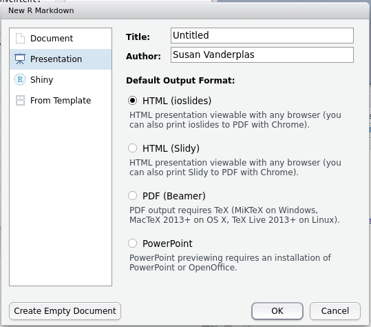
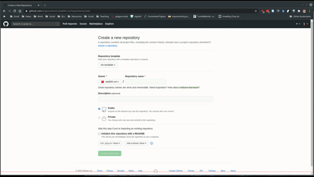
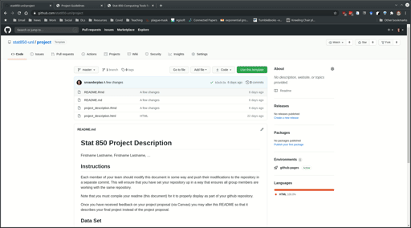

# Documents and Reports {#docs-reports}

## Documents and Reports: Module Objectives {-}
Be able to create 

- presentation slides in LaTeX and rmarkdown
- posters in LaTeX and rmarkdown
- A CV in LaTeX and/or rmarkdown

This chapter will be shorter in length than many of the rest, but you should not devote less time to it. Instead, you should spend the time playing with the different options presented here and deciding which one of each is your favorite. Rather than detailing all of the customization options in each package, I think you'll have an easier time looking at examples, trying to customize them yourself to get the effect you want, and figuring out how to do that by reading the documentation, stackoverflow posts, and other help files -- those are the skills you'll need when you try to put this knowledge into action. 

At the end of this chapter there are a few extras -- for instance, how to use GitHub to host your documents, how to create a blog with `blogdown`, and more. You should feel free to investigate, but as long as you are able to create presentation slides, posters, and a CV, you're good to go. 


## Literate Programming, `knitr`, and `rmarkdown`

[Literate programming](https://en.wikipedia.org/wiki/Literate_programming) is a programming method where you explain the code in natural language (e.g. English) in roughly the same space that you write the code (in a programming language). This solves two problems: code isn't always clear as to what its goals are, and natural language descriptions of algorithms aren't always clear enough to contain the details of  how something is actually implemented.

The `knitr` and `Rmarkdown` packages are both implementations of literate programming (and the two packages tend to overlap a bit, because both were written by the same author, Yihui Xie). `knitr` is primarily focused on the creation of Rnw (r no weave) files, which are essentially LaTeX files with R code inside. Rnw files are compiled into pdfs.  `rmarkdown` uses `Rmd` or `Rmarkdown` files, which  can then be compiled into many different formats: pdf, html, markdown, Microsoft Word. 

One major advantage of `knitr` and `Rmarkdown` from a practical perspective is that it largely removes the need to keep track of graphs and charts when you're writing a paper, making a presentation, etc. The charts and tables based on your method automatically update when the document is recompiled. 

If you're not reading this chapter early, you've been using Rmarkdown for the entire semester to submit your homework. Hopefully that's been fairly easy - you've been creating Rmarkdown *documents* all semester. In this chapter, we're going to explore some other applications of literate programming: creating slides, posters, and more. 

## A Very Brief Introduction to LaTeX

LaTeX is a document preparation utility that attempts to take the focus off of layout (so you don't have to spend 30 minutes trying to get the page break in the right place in e.g. Word) and bibliographic details. I'm not convinced LaTeX succeeds at freeing you from layout concerns, but it's certainly true that it is much more powerful than Word for  layout purposes. The philosophy of LaTeX is that presentation shouldn't get in the way of content: you should be able to change the presentation formatting systematically, without having to mess with the content. This allows you to switch templates easily, make document-wide changes in a single command, and more. 

<div class="tryitout">
In Rstudio, copy the text in the document below, paste it into a text file in the editor window, and name it `test.tex`. You should see a Compile PDF button show up at the top of the document. Click that button to compile the document. 

```
\documentclass{article} % this tells LaTeX what type of document to make 
% Note, comments are prefaced by a % sign. If you need to type the actual symbol
% you will have to escape it with \%.

\begin{document}
Hello \LaTeX!
\end{document}
```
</div>

Most commonly, you'll use the `article` document class for papers, and `beamer` for presentations and posters. Other useful classes include `moderncv` (for CVs) and `book`, as well as the [LaTeX class maintained by the UNL math department for thesis formatting](https://www.math.unl.edu/graduate/nuthesis/nuthesis.zip). Note that by changing the extension of any .tex file to .Rnw,  you can easily add R code chunks to a LaTeX file. 

There are several types of latex commands: 

- Declarations: statements like `\documentclass`, `\usepackage` or `\small`, which are stated once and take effect until further notice. 
- Environments: statements with matching `\begin{xxx}` and `\end{xxx}` clauses that define a block of the document which is treated differently. Common environments include figures and tables. 
- Special characters: another type of command that don't define formatting or structure, but may print special characters, e.g. `\%` to print a literal `%` character.

Both declarations and environments may come with  both optional and required arguments. Required arguments are placed in `{...}` brackets, while optional arguments are placed in `[...]` brackets. You can, for instance, start your document with `\documentclass[12pt]{article}` to specify the base font size. 

One of the most useful features in LaTeX is math mode, which you can enter by enclosing text in `$...$` (for inline statements), `$$...$$` (for statements on their own  line), or using other environments like `\begin{array}...\end{array}` that come in math-specific packages. Once in math mode, you can use [math symbol commands](https://www.caam.rice.edu/~heinken/latex/symbols.pdf) to get characters like $\theta, \pi, \sum, \int, \infty$, and more. 

### Try it out {- .tryitout}
With any document creation software, the easiest way to learn how to do it is to find a sample document, tinker with it, see if you can make things the way you want them to be, and then google the errors when you inevitably screw something up.

Take the sample document up above and see if you can do the following tasks:    
(I've linked to documentation that may be useful)

1. [Add an image](https://www.overleaf.com/learn/latex/Inserting_Images)

2. Add the [quadratic formula and the PDF of a normal distribution to the document](https://www.overleaf.com/learn/latex/Mathematical_expressions)

3. In extremely [large](https://www.overleaf.com/learn/latex/Font_sizes,_families,_and_styles) text, print LaTeX using the `\LaTeX` command

4. In extremely small, [italic](https://www.overleaf.com/learn/latex/Bold,_italics_and_underlining) text, print your name

<details><summary>Solution</summary>
```
\documentclass{article} % this tells LaTeX what type of document to make 

% Add the graphicx package so that we can include images
\usepackage{graphicx}

\begin{document}
Hello \LaTeX!

% Include a figure
\begin{figure}[h]
\centering
\includegraphics[width=.5\textwidth]{../image/IllusoryContour.png}
\caption{Illusory contour image}
\end{figure}

% Add the quadratic formula and the normal PDF to the document
$y = ax^2 + bx + c$ can be solved to get $$x = \frac{-b \pm \sqrt{b^2 - 4ac}}{2a}$$

The PDF of a normal distribution is $$f(x | \mu, \sigma) = \frac{1}{\sigma\sqrt{2\pi}} e^{-\frac{(x - \mu)^2}{2\sigma^2}}$$

% In extremely large text, print \LaTeX

\Huge\LaTeX

% In extremely small italic text, print your name

\tiny\emph{Your name}

\end{document}
```

You can see the compiled pdf [here](other/test.pdf).
</details>

### Knitr

R code chunks are embedded in LaTeX documents using:
```
% start of chunk
<<chunk-name, ...options...>>=

@
% end of chunk
```

You can embed numerical results inline using `\Sexpr{...}` where your R code goes in the `...`. 

Unfortunately, knitr does not work with SAS... for that, you'll need Rmarkdown (or you can use a Jupyter notebook). 

#### How this works {-}

To compile a Rnw document, knitr first runs all of the R code, generating any figures or tables or text output for each chunk. For each chunk, knitr  replaces the chunk code with LaTeX code to include the results; the result of this operation is saved to a tex file. Once the tex file is created, knitr compiles the tex file into a pdf.


## Slides

### Beamer (LaTeX) and knitr

[Beamer](https://www.overleaf.com/learn/latex/beamer) is a powerful LaTeX class which allows you to create slides. The only change necessary to turn a beamer slide deck into a knitr slide deck is to add `fragile` as an option to any slide with verbatim content.

You can also create Beamer slides with Rmarkdown. [Example presentation](http://svmiller.com/rmarkdown-example.pdf). Standard tradeoffs (formatting details vs. document complexity) apply.

#### Try it out {- .tryitout}

Download and compile [beamer-demo.Rnw](other/beamer-demo.Rnw). 

What happens when you remove the `[fragile]` from each frame declaration?

Can you change the theme of the presentation?

Add another slide, and on that slide, show an appropriate style ggplot2 graph of the distribution of board game ratings, reading in the board game ratings using the following code:
```{r, eval = F, echo = 1}
board_games <- readr::read_csv("https://raw.githubusercontent.com/rfordatascience/tidytuesday/master/data/2019/2019-03-12/board_games.csv")
library(ggplot2)
ggplot(board_games, aes(x = average_rating)) + geom_density()
```

[Karl Broman has a set of slides that show how to use beamer + knitr to make reproducible slides with notes.](https://kbroman.org/Tools4RR/assets/lectures/12_talks_posters_withnotes.pdf)

You can also create Beamer slides using Rmarkdown, if you want, but you'll probably have more control over the fine  details if you go straight to the Rnw file without going through Rmd first. It's a trade-off -- the file will probably be simpler in Rmarkdown, but you won't have nearly as much control.

### HTML slides

RStudio has a host of other options for html slide presentations. There are some definite advantages to HTML presentations: they're easy to share (via URL), you can add gifs, emojis, and interactive graphics, and you can set up github to host the presentations as well^[I have a repository for all of the presentations I've given, and I use github pages to render the html presentations. Very easy, convenient, and I never have to carry a flash drive around]. 

The downside to HTML slides is that there are approximately 100000 different javascript libraries that create HTML slides, and all of them have different capabilities. Many of these libraries have R extensions that will let you create Rmarkdown slides, but they each have slightly different markdown syntax and capabilities.



You can get the [full details](https://bookdown.org/yihui/rmarkdown/presentations.html) of any fully supported slide class in Rmarkdown by looking at the Rmarkdown book, which is freely available online. These guidelines will give you specifics about how to customize slides, add incremental information, change  transitions, print your slides to PDF, and include speaker notes. 

It should be relatively straightforward to create an ioslides or slidy presentation, given that you've been using Rmarkdown all semester. From some reading, it seems as if [slidy has more options, but ioslides is simpler to use](https://yintingchou.com/posts/ioslides-vs-slidify-in-r-markdown-presentation/).

However, the library I prefer at the moment is [`xaringan`](https://bookdown.org/yihui/rmarkdown/xaringan.html), which is a package written by  Yihui Xie (same guy that wrote rmarkdown/knitr). If you install the `xaringan` package, you can easily create a xaringan presentation by selecting the "From Template" option in the "New R markdown" window (shown above). Yihui has an excellent [blog post](https://yihui.org/en/2017/08/why-xaringan-remark-js/) describing the features of xaringan that aren't found in other libraries.

Rather than repeat the documentation for each slide package in this document, I think it is probably easier just to link you to the documentation and a sample presentation for each option. 

- [ioslides](https://bookdown.org/yihui/rmarkdown/ioslides-presentation.html) [Example presentation](https://github.com/rstudio/ShinyDeveloperConference/tree/master/Debugging)
- [slidy](https://bookdown.org/yihui/rmarkdown/slidy-presentation.html) [Example presentation](https://rpubs.com/sdplus/vulcan74)
- [xaringan](https://bookdown.org/yihui/rmarkdown/xaringan.html) [Example presentation](https://slides.yihui.org/xaringan/#1), [Example presentation 2 using UNL CSS theme](http://srvanderplas.github.io/Presentations/2020-DSSV/index.html#1)
- [reveal.js](https://bookdown.org/yihui/rmarkdown/revealjs.html) [Example presentation](https://github.com/rstudio/ShinyDeveloperConference/tree/master/Reactivity)


If you're familiar with CSS (or happier tinkering to get the look of something exactly right) then `xaringan` is an excellent full-featured option. 

A nice feature of reveal.js presentations (my favorite option before `xaringan`) is support for 2D slide layouts, so you can have multiple sections in your presentation, and move vertically through each section, or horizontally between sections. That is useful for presentations where you may not plan on covering everything, but where you want to have all of the information available if necessary. I relied heavily on that during my PhD prelim and defense. 

### Try it out {- .tryitout}
Take a few minutes and try each of them out to see what feels right to you. Each one has a slightly different "flavor" of Rmarkdown, so read through the example to get a sense for what is different.


## Posters

Posters are another common vehicle for presenting academic project results. Because posters are typically printed on paper or fabric, the standard file format is still PDF. With that said, a number of HTML poster options exist and seem to be relatively well polished^[See [this list of Rmarkdown poster options](https://gist.github.com/Pakillo/4854e5d760351206084f6be8abe476b2).], and some have PDF export capabilities so that you can have the best of both worlds - interactivity online, and static, stable PDF exports as well.

### LaTeX

[Overleaf has a fantastic gallery of posters made in LaTeX](https://www.overleaf.com/gallery/tagged/poster). 

There are several LaTeX options for making scientific posters: baposter, beamerposter, tikzposter are among the most common. We'll focus on `beamerposter` here, but you are free to explore the other poster classes at will. As with beamer, you can easily integrate knitr code chunks into a document, so that you are generating your images reproducibly. 

Basic code for a poster in beamer (along with the necessary style files) that I've minimally customized to meet UNL branding requirements can be found [here](other/beamer_poster/beamer_poster.zip). 

#### Try it out {- .tryitout}

Download the beamer template and do the following: 

1. Change the 3-column span box to a 2-column span box. 
2. Make the "Block Colors" box purple
3. Move the References block up to fill the 4th column.

### Posterdown

To start, install posterdown with `install.packages("posterdown")`. 


I have provided an example posterdown theme [here](other/posterdown/posterdown.zip). You can also find the additional customization options [here](https://github.com/brentthorne/posterdown/wiki/posterdown_html). As with other markdown items, you can customize things even more using CSS. The nice thing about HTML posters, though, is that you can directly [link to them](other/posterdown/index.html). 

You can also print a poster to PDF by running the following command: `pagedown::chrome_print("myfile.Rmd")`. See the [pdf version of my customized UNL-themed poster](other/posterdown/index.pdf). 

### Pagedown

The `pagedown` package also has a couple of poster templates, including [poster-relaxed](https://pagedown.rbind.io/poster-relaxed) and [poster-jacobs](https://user-images.githubusercontent.com/163582/49780277-7b326780-fcd3-11e8-9eb6-69e46292158c.png). 

There are also templates for letters, business cards, and more in pagedown, if you're feeling ambitious.


#### Try it out {- .tryitout}

Download the pagedown template and do the following: 

1. Change the 3-column layout to 4 columns. Adjust the breaks ({.mybreak}) accordingly to make the poster look good.
2. Make the 2nd-level headers #249ab5 (cerulean)
3. Move the References block to the 4th column.
4. Print your poster to a PDF

## Resume/CV

You can also create resumes and CVs in markdown and LaTeX. There is no real substitute for playing around with these classes, but I really like [moderncv](http://www.latextemplates.com/template/moderncv-cv-and-cover-letter) in LaTeX^[You can see my highly customized version [here](https://github.com/srvanderplas/CV), with timelines and numbered publications. It has to be compiled multiple times to get everything right, though.]


Pagedown also comes with a html resume template (Use the menu -> Rmarkdown -> From Template -> HTML Resume) that can be printed to html and pdf simultaneously. There is also the `vitae` package, which has even more templates, integration with other packages/sites, and more.^[At this point, the biggest reason I haven't switched to HTML is that I really like my timeline CV and I don't have enough time to fiddle with it more.]


## Using Github Pages

Github will host HTML content for you using Github pages (case in point: this textbook). This means you can version control your content (for instance, presentations or your CV) and have GitHub do the hosting (so you don't have to find a webserver, buy a domain name, etc). 

1. Create a new repository named username.github.io
2. Clone your repository
3. Add an index.html file (this can be anything, e.g. a text file that says "hello world", so long as it has an extension of html) and push your changes
4. Go to https://username.github.io 


([YouTube Link](https://youtu.be/L8AWVUs817k))

Github will render any README.md file as actual HTML; it will also allow you to host straight HTML pages. By default, the README file is rendered first, but in subsequent directories, a file named index.html will be rendered as the "home page" for the subdirectory, if you have such a file. Otherwise you'll have to know the file name.

I tend to separate things out into separate repositories, but you can host HTML content on other repositories too, by enabling github pages in the repository settings. On my personal page, I have repositories for my CV, Presentations^[I've been putting my presentations on Github since 2014, so it has a pretty good record of every set of slides I've created for anything important (and many not-so-important things as well). I highly recommend this strategy - by storing everything online, you make it very easy to share your work with others, very easy to reference later, and more importantly, easy for you to find in 3 years when you need that one specific picture.], etc. Each repository that has pages enabled can be accessed via srvanderplas.github.io/\<repository name\>/\<repository file path\>. So, to see my unl-stat850 repository, you'd go to https://srvanderplas.github.io/unl-stat850/ (but you're already there!). 


([YouTube Link](https://youtu.be/A1Gu7vqZqeg))

This mechanism provides a very convenient way to showcase your work, share information with collaborators, and more - instead of sending files, you can send a URL and no one has to download anything overtly. 

If you want to track your Rmarkdown code and then render the output to a separate folder, you can use the docs/ folder. Github has this as an option as well -- where we selected "master" branch above, we would select "docs/" instead (it's greyed out b/c there isn't a docs folder in the repo). That is how this book is hosted - the book compiles to the docs/ folder, and that way the book is rendered in final form and you don't have to see all of the other crud that is in the repository. 

## References

There are many other XXXdown packages, including

- [`blogdown`](https://bookdown.org/yihui/blogdown/)
- [`bookdown`](https://bookdown.org/yihui/bookdown/) (what I'm using to make this book)
- [`pkgdown`](https://pkgdown.r-lib.org/) (to easily build documentation websites for R packages)

- ROpenSci tutorial: How to set up [hosting on github](https://ropenscilabs.github.io/actions_sandbox/websites-using-pkgdown-bookdown-and-blogdown.html)

- [liftr](https://nanx.me/talks/jsm2018-liftr-nanxiao.pdf) - use Docker to make persistently reproducible documents
