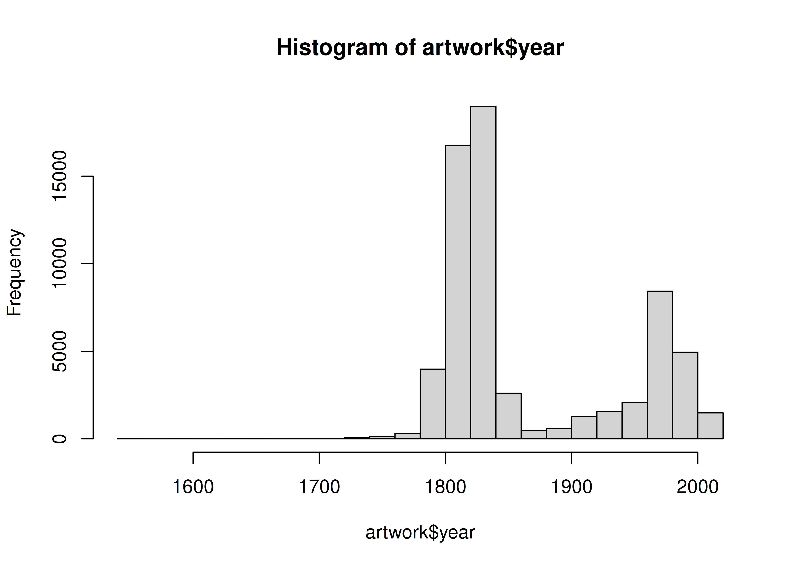
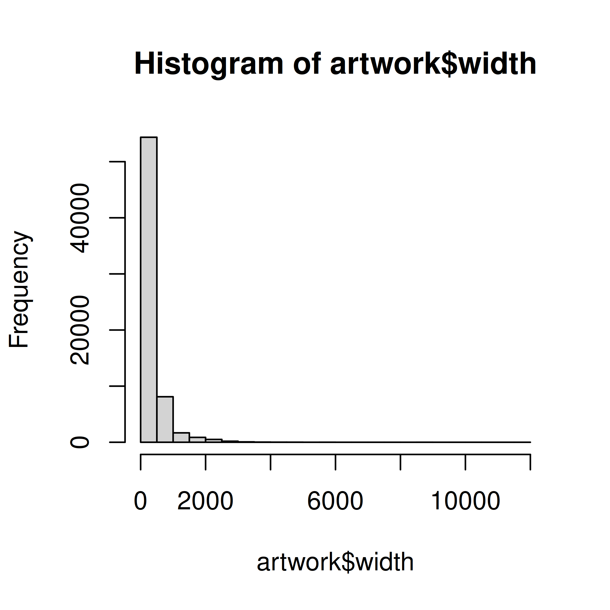
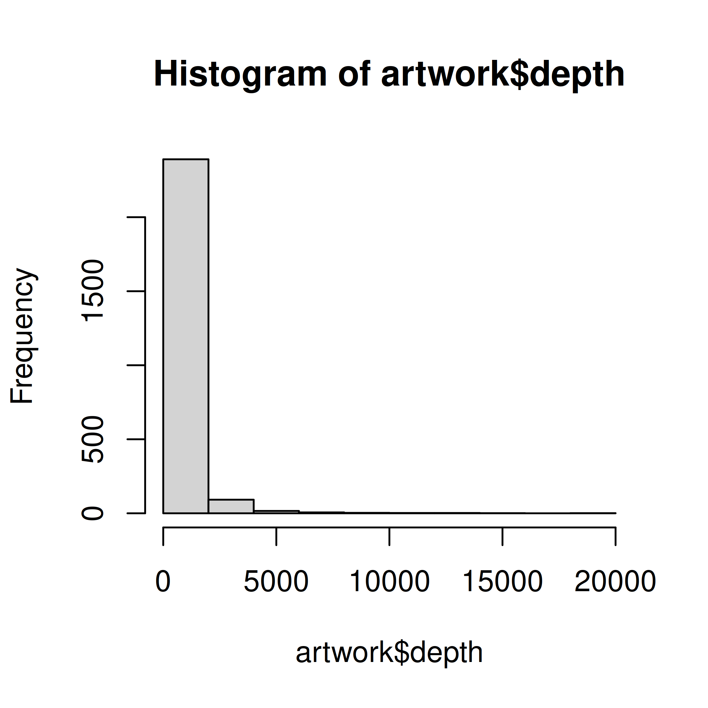
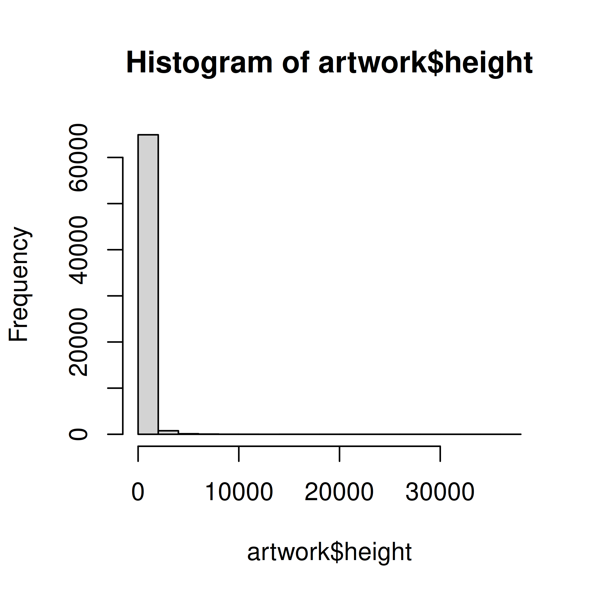
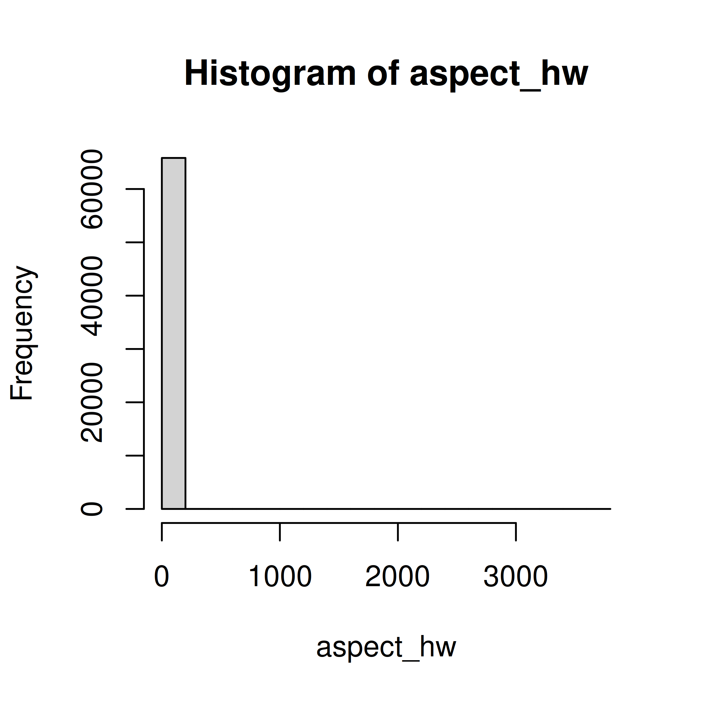
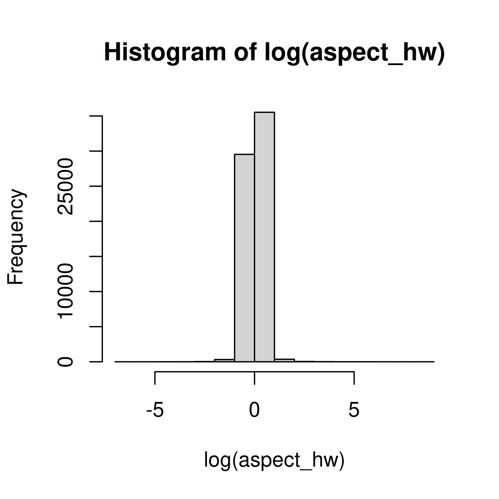

# (PART) Data Programming {-}

# Basics {#data-programming-basics}

## Module Objectives  {- #module4-objectives}

- Write basic functions and procedures to create simple plots and data summaries
- Apply syntax knowledge to reference variables and observations in common data structures
- Create new variables and columns or reformat existing columns in provided data structures


## Introduction

At this point in the course, you've learned how to write functions. You know the basics of how to create new variables, how data frames and lists work, and how to use markdown.

And yet... these are skills that take some practice when applied to new data. So this week, we're going to focus on working with datasets, but we're not going to learn much in the way of new material (though I'll provide sample code for tasks like basic plots and tables). This week is about reinforcing the skills you've already learned, and helping you find your feet a bit as you work through a data analysis. It will also provide a preview of some of the packages we're going to work with in the coming weeks (because I'm going to show you how to e.g. summarize a dataset and plot a few things, even without having covered that material). 


As you've probably guessed by now, this week's reading will primarily be focused on examples.

## Example 1: Art
The Tate Art Museum assembled a collection of 70,000 artworks (last updated in 2014). They catalogued information including accession number, artwork dimensions, units, title, date, medium, inscription, and even URLs for images of the art. 


```r
library(readr)
library(skimr)
artwork <- read_csv('https://raw.githubusercontent.com/rfordatascience/tidytuesday/master/data/2021/2021-01-12/artwork.csv')
## 
## ── Column specification ────────────────────────────────────────────────────────
## cols(
##   .default = col_character(),
##   id = col_double(),
##   artistId = col_double(),
##   year = col_double(),
##   acquisitionYear = col_double(),
##   width = col_double(),
##   height = col_double(),
##   depth = col_double(),
##   thumbnailCopyright = col_logical()
## )
## ℹ Use `spec()` for the full column specifications.

skim(artwork)
```


Table: (\#tab:read-art-data)Data summary

|                         |        |
|:------------------------|:-------|
|Name                     |artwork |
|Number of rows           |69201   |
|Number of columns        |20      |
|_______________________  |        |
|Column type frequency:   |        |
|character                |12      |
|logical                  |1       |
|numeric                  |7       |
|________________________ |        |
|Group variables          |None    |


**Variable type: character**

|skim_variable    | n_missing| complete_rate| min| max| empty| n_unique| whitespace|
|:----------------|---------:|-------------:|---:|---:|-----:|--------:|----------:|
|accession_number |         0|          1.00|   6|   7|     0|    69201|          0|
|artist           |         0|          1.00|   4| 120|     0|     3336|          0|
|artistRole       |         0|          1.00|   5|  24|     0|       19|          0|
|title            |         0|          1.00|   1| 320|     0|    43529|          0|
|dateText         |         0|          1.00|   4|  75|     0|     2736|          0|
|medium           |      6384|          0.91|   3| 120|     0|     3401|          0|
|creditLine       |         3|          1.00|  14| 820|     0|     3209|          0|
|dimensions       |      2433|          0.96|   4| 248|     0|    25575|          0|
|units            |      3341|          0.95|   2|   2|     0|        1|          0|
|inscription      |     62895|          0.09|  14|  14|     0|        1|          0|
|thumbnailUrl     |     10786|          0.84|  55|  57|     0|    58415|          0|
|url              |         0|          1.00|  48| 134|     0|    69201|          0|


**Variable type: logical**

|skim_variable      | n_missing| complete_rate| mean|count |
|:------------------|---------:|-------------:|----:|:-----|
|thumbnailCopyright |     69201|             0|  NaN|:     |


**Variable type: numeric**

|skim_variable   | n_missing| complete_rate|     mean|       sd|   p0|      p25|   p50|   p75|   p100|hist  |
|:---------------|---------:|-------------:|--------:|--------:|----:|--------:|-----:|-----:|------:|:-----|
|id              |         0|          1.00| 39148.03| 25980.47|    3| 19096.00| 37339| 54712| 129068|▇▇▅▁▁ |
|artistId        |         0|          1.00|  1201.06|  2019.42|    0|   558.00|   558|  1137|  19232|▇▁▁▁▁ |
|year            |      5397|          0.92|  1867.23|    72.01| 1545|  1817.00|  1831|  1953|   2012|▁▁▇▆▆ |
|acquisitionYear |        45|          1.00|  1910.65|    64.20| 1823|  1856.00|  1856|  1982|   2013|▇▁▁▁▅ |
|width           |      3367|          0.95|   323.47|   408.81|    3|   118.00|   175|   345|  11960|▇▁▁▁▁ |
|height          |      3342|          0.95|   346.44|   538.04|    6|   117.00|   190|   359|  37500|▇▁▁▁▁ |
|depth           |     66687|          0.04|   479.20|  1051.14|    1|    48.25|   190|   450|  18290|▇▁▁▁▁ |

When you first access a new dataset, it's fun to explore it a bit. I've shown a summary of the variables (character variables summarized with completion rates and # unique values, numeric variables summarized with quantiles and mean/sd) generated using the `skimr` package (which we'll talk about next week). 

<details class="ex"><summary>First, let's pull out the year for each piece of artwork in the dataset and see what we can do with it...</summary>

```r
head(artwork$year)
## [1]   NA   NA 1785   NA 1826 1826
```

We reference a column of the dataset by name using `dataset_name$column_name`, and since our data is stored in `artwork`, and we want the column named `year`, we use `artwork$year` to get access to the data we want.

I've used the `head` command to show only the first few values (so that the output isn't overwhelming). When we have output like this, it is useful to summarize the output in some way:


```r
summary(artwork$year)
##    Min. 1st Qu.  Median    Mean 3rd Qu.    Max.    NA's 
##    1545    1817    1831    1867    1953    2012    5397
```

That's much less output, but we might want to instead make a chart:

```r
hist(artwork$year)
```


Personally, I much prefer the graphical version. It's informative (though it does leave out NA values) and shows that there are pieces going back to the 1500s, but that most pieces were made in the early 1800s or late 1900s. 

</details>

<details class="ex"><summary>We might be interested in the aspect ratio of the artwork - let's take a look at the input variables and define new variables related to aspect ratio(s)</summary>


```r
hist(artwork$width)
hist(artwork$depth)
hist(artwork$height)
```



So all of our variables are skewed quite a bit, and we know from the existence of the `units` column that they may not be in the same unit, either...


```r
table(artwork$units)
## 
##    mm 
## 65860
```

Except apparently they are, so ... cool. That does make life easier.

To define a new variable that exists on its own, we might do something like this:

```r
aspect_hw <- artwork$height/artwork$width
hist(aspect_hw)
hist(log(aspect_hw))
```



Ok, interesting. Most things are pretty square-ish, but there are obviously quite a few exceptions in both directions.

The one problem with how we've done this is that we now have a data frame with all of our data in it, and a separate variable `aspect_hw`, that is not attached to our data frame. That's not ideal - it's easy to lose track of the variable, it's easy to accidentally "sort" the variable so that the row order isn't the same as in the original data frame... there are all sorts of potential issues.

So, the better way to define a new variable is to add a new **column** to the data frame:

```r
artwork$aspect_hw <- artwork$height/artwork$width
```

(We'll learn an easier way to do this later, but this is functional, if not pretty, for now).

The downside to this is that we have to write out `artwork$aspect_hw` each time we want to reference the variable. That is a pain, but one that's relatively temporary (we'll get to a better way to do this in a couple of weeks). A little bit of extra typing is definitely worth it if you don't lose data you want to keep.

</details>

One mistake I see people make frequently is to calculate `artwork$height/artwork$width`, but then not assign that value to a variable. If you're not using `<-` (or `=` or `->` if you're a total heathen) then you're not saving that information to be referenced later - you're just calculating values temporarily. It's important to keep track of where you're putting the pieces you create during an analysis - just as important as keeping track of the different sub-components when you're putting a lego set together or making a complex recipe in the kitchen. Forgetting to assign your calculation to a variable is like dumping your mixture down the sink or throwing that small lego component into the trash.


