# External Data {#reading-data}

## Module Objectives  {- #module5-objectives}

- Apply syntax to read in data from common formats into R or SAS
- Manage basic exploratory data analysis:
    - examine data formats
    - identify necessary data cleaning steps
    - describe artifacts of the data set

## External Data Formats

In order to use statistical software to do anything interesting, we need to be able to get data into the program so that we can work with it effectively. For the moment, we'll focus on tabular data - data that is stored in a rectangular shape, with rows indicating observations and columns that show variables. This type of data can be stored on the computer in multiple ways:

- **as raw text**, usually in a file that ends with .txt, .tsv, .csv, .dat, or sometimes, there will be no file extension at all. These types of files are human-readable. If part of a text file gets corrupted, the rest of the file may be recoverable. 


- **in a spreadsheet**. Spreadsheets, such as those created by MS Excel, Google Sheets, or LibreOffice Calc, are not completely binary formats, but they're also not raw text files either. They're a hybrid. Practically, they may function like a poorly laid-out database, a text file, or a total nightmare, depending on who designed the spreadsheet.     

::: learn-more
There is a collection of spreadsheet horror stories [here](https://github.com/jennybc/scary-excel-stories) and a series of even more horrifying tweets [here](https://twitter.com/JennyBryan/status/722954354198597632).    
Also, there's this amazing comic:    
[](https://xkcd.com/1667/)
:::

- **as a binary file**. Binary files are compressed files that are readable by computers but not by humans. They generally take less space to store on disk (but the same amount of space when read into computer memory). If part of a binary file is corrupted, the entire file is usually affected.
    - R, SAS, Stata, SPSS, and Minitab all have their own formats for storing binary data. Packages such as `foreign` in R will let you read data from other programs, and packages such as `haven` in R will let you write data into binary formats used by other programs. To read data from R into SAS, the easiest way is probably to [call R from PROC IML](http://proc-x.com/2015/05/import-rdata-to-sas-along-with-labels/). 
    - [Here](https://betterexplained.com/articles/a-little-diddy-about-binary-file-formats/) is a very thorough explanation of why binary file formats exist, and why they're not necessarily optimal.


- **in a database**. Databases are typically composed of a set of one or more tables, with information that may be related across tables. Data stored in a database may be easier to access, and may not require that the entire data set be stored in computer memory at the same time, but you may have to join several tables together to get the full set of data you want to work with. 

There are, of course, many other non-tabular data formats -- some open and easy to work with, some inpenetrable. A few which may be more common:

- **Web related data structures**: XML (eXtensible markup language), JSON (JavaScript Object Notation), YAML. These structures have their own formats and field delimiters, but more importantly, are not necessarily easily converted to tabular structures. They are, however, useful for handling nested objects, such as trees. When read into R or SAS, these file formats are usually treated as lists, and may be restructured afterwards into a format useful for statistical analysis.

- **Spatial files**: Shapefiles are by far the most common version of spatial files^[though there are a seemingly infinite number of actual formats, and they pop up at the most inconvenient times]. Spatial files often include structured encodings of geographic information plus corresponding tabular format data that goes with the geographic information. We'll explore these a bit more when we talk about maps. 


To be minimally functional in R and SAS, it's important to know how to read in text files (CSV, tab-delimited, etc.). It can be helpful to also know how to read in XLSX files. We will briefly cover binary files and databases, but it is less critical to remember how to read these in without consulting one or more online references. 


### Text Files

There are several different variants of text data which are relatively common, but for the most part, text data files can be broken down into fixed-width and delimited formats. What's the difference, you say?

#### Fixed-width files

In a fixed-width text file, the position of the data indicates which field (variable/column) it belongs to. These files are fairly common outputs from older FORTRAN-based programs, but may be found elsewhere as well - if you have a very large amount of data, a fixed-width format may be more efficient to read, because you can select only the portions of the file which matter for a particular analysis (and so you don't have to read the whole thing into memory). 

```
Col1    Col2    Col3
 3.4     4.2     5.4
27.3    -2.4    15.9
```


<details class="ex"> <summary>In base R (no extra packages), you can read fwf files in using `read.fwf`, but you must specify the column breaks yourself.</summary>

```r
## url <- "https://www.mesonet.org/index.php/dataMdfMts/dataController/getFile/202006070000/mdf/TEXT/"
data <- read.fwf(url, 
         skip = 3, # Skip the first 2 lines (useless) + header line
         widths = c(5, 6, 6, 7, 7, 7, 7, 6, 7, 7, 7, 8, 9, 6, 7, 7, 7, 7, 7, 7, 
7, 8, 8, 8)) # There is a row with the column names specified
Warning in readLines(file, n = thisblock): incomplete final line found on 'data/
mesodata.txt'

data[1:6,] # first 6 rows
     V1     V2 V3 V4   V5  V6  V7  V8   V9 V10  V11 V12    V13 V14  V15 V16
1  ACME    110  0 53 31.8 5.2 5.1 146  8.5 0.7  6.9   0 964.79 272 31.8 4.0
2  ADAX      1  0 55 32.4 1.0 0.8 108 36.5 0.4  2.2   0 976.20 245 32.0 0.2
3  ALTU      2  0 31 35.6 8.9 8.7 147 10.9 1.1 11.5   0 960.94 296 34.7 6.8
4  ALV2    116  0 27 35.8 6.7 6.7 145  8.2 1.2  9.0   0 957.45 298 35.5 5.4
5  ANT2    135  0 73 27.8 0.0 0.0   0  0.0 0.0  0.0   0 990.11 213 27.8 0.0
6  APAC    111  0 52 32.3 6.2 6.1 133  9.8 0.8  7.9   0 959.54 277 31.9 4.6
   V17  V18  V19  V20    V21  V22  V23     V24
1 29.2 36.2 31.6 25.2   21.7 3.09 2.22    1.48
2 28.8 38.2 29.6 26.8 -998.0 2.61 1.88 -998.00
3 29.3 34.1 30.7 26.1 -998.0 3.39 2.47 -998.00
4 24.7 34.7 25.6 22.6 -998.0 2.70 1.60 -998.00
5 29.5 31.1 30.2 26.8   23.8 1.96 1.73    1.33
6 30.4 35.2 34.7 28.2   22.8 1.79 1.53    1.78
```
</details>


<details class="ex"><summary>You can count all of those spaces by hand (not shown), you can use a different function, or you can write code to do it for you. </summary>

```r

# I like to cheat a bit....
# Read the first few lines in
tmp <- readLines(url, n = 20)[-c(1:2)]

# split each line into a series of single characters
tmp_chars <- strsplit(tmp, '') 

# Bind the lines together into a character matrix
# do.call applies a function to an entire list - so instead of doing 18 rbinds, 
# one command will put all 18 rows together
tmp_chars <- do.call("rbind", tmp_chars) # (it's ok if you don't get this line)

# Make into a logical matrix where T = space, F = not space
tmp_chars_space <- tmp_chars == " "

# Add up the number of rows where there is a non-space character
# space columns would have 0s/FALSE
tmp_space <- colSums(!tmp_chars_space)

# We need a nonzero column followed by a zero column
breaks <- which(tmp_space != 0 & c(tmp_space[-1], 0) == 0)

# Then, we need to get the widths between the columns
widths <- diff(c(0, breaks))

# Now we're ready to go
mesodata <- read.fwf(url, skip = 3, widths = widths, header = F)
Warning in readLines(file, n = thisblock): incomplete final line found on 'data/
mesodata.txt'
# read header separately - if you use header = T, it errors for some reason.
# It's easier just to work around the error than to fix it :)
mesodata_names <- read.fwf(url, skip = 2, n = 1, widths = widths, header = F, 
                           stringsAsFactors = F)
names(mesodata) <- as.character(mesodata_names)

mesodata[1:6,] # first 6 rows
   STID   STNM   TIME    RELH    TAIR    WSPD    WVEC   WDIR    WDSD    WSSD
1  ACME    110      0      53    31.8     5.2     5.1    146     8.5     0.7
2  ADAX      1      0      55    32.4     1.0     0.8    108    36.5     0.4
3  ALTU      2      0      31    35.6     8.9     8.7    147    10.9     1.1
4  ALV2    116      0      27    35.8     6.7     6.7    145     8.2     1.2
5  ANT2    135      0      73    27.8     0.0     0.0      0     0.0     0.0
6  APAC    111      0      52    32.3     6.2     6.1    133     9.8     0.8
     WMAX     RAIN      PRES   SRAD    TA9M    WS2M    TS10    TB10    TS05
1     6.9        0    964.79    272    31.8     4.0    29.2    36.2    31.6
2     2.2        0    976.20    245    32.0     0.2    28.8    38.2    29.6
3    11.5        0    960.94    296    34.7     6.8    29.3    34.1    30.7
4     9.0        0    957.45    298    35.5     5.4    24.7    34.7    25.6
5     0.0        0    990.11    213    27.8     0.0    29.5    31.1    30.2
6     7.9        0    959.54    277    31.9     4.6    30.4    35.2    34.7
     TS25    TS60     TR05     TR25     TR60
1    25.2    21.7     3.09     2.22     1.48
2    26.8  -998.0     2.61     1.88  -998.00
3    26.1  -998.0     3.39     2.47  -998.00
4    22.6  -998.0     2.70     1.60  -998.00
5    26.8    23.8     1.96     1.73     1.33
6    28.2    22.8     1.79     1.53     1.78
```
</details>

But, there's an even simpler way...

The `readr` package creates data-frame like objects called tibbles (really, they're a souped-up data frame), but it is *much* friendlier to use. Tibbles also do not have the problems with factors (see the [introduction to factors](#factors)) - they will always read characters in as characters. 
<details class="ex"><summary>`readr demo`</summary>


```r
library(readr) # Better data importing in R

read_table(url, skip = 2) # Gosh, that was much easier!
# A tibble: 121 x 24
   STID   STNM  TIME  RELH  TAIR  WSPD  WVEC  WDIR  WDSD  WSSD  WMAX  RAIN  PRES
   <chr> <dbl> <dbl> <dbl> <dbl> <dbl> <dbl> <dbl> <dbl> <dbl> <dbl> <dbl> <dbl>
 1 ACME    110     0    53  31.8   5.2   5.1   146   8.5   0.7   6.9     0  965.
 2 ADAX      1     0    55  32.4   1     0.8   108  36.5   0.4   2.2     0  976.
 3 ALTU      2     0    31  35.6   8.9   8.7   147  10.9   1.1  11.5     0  961.
 4 ALV2    116     0    27  35.8   6.7   6.7   145   8.2   1.2   9       0  957.
 5 ANT2    135     0    73  27.8   0     0       0   0     0     0       0  990.
 6 APAC    111     0    52  32.3   6.2   6.1   133   9.8   0.8   7.9     0  960.
 7 ARD2    126     0    46  32.9   2.6   2.5   150  11.8   0.5   3.6     0  979.
 8 ARNE      6     0    28  33.5   6.5   6.3   163  11.9   1.5  10       0  927.
 9 BEAV      8     0    23  34.9  11.2  11.1   165   7.3   1.4  15.2     0  921.
10 BESS      9     0    37  33.8   8.3   8.3   156   6.6   1.3  11.2     0  951.
# … with 111 more rows, and 11 more variables: SRAD <dbl>, TA9M <dbl>,
#   WS2M <dbl>, TS10 <dbl>, TB10 <dbl>, TS05 <dbl>, TS25 <dbl>, TS60 <dbl>,
#   TR05 <dbl>, TR25 <dbl>, TR60 <dbl>
```
</details>

You can also write fixed-width files if you *really* want to:
<details class="ex"><summary> Fixed-width file writing demo</summary>


```r
if (!"gdata" %in% installed.packages()) install.packages("gdata")

library(gdata)

write.fwf(mtcars, file = "data/04_mtcars-fixed-width.txt")
```
</details>

&nbsp;

<details class="ex"> <summary>In SAS, it's a bit more complicated, but not that much - the biggest difference is that you generally have to specify the column names for SAS. For complicated data, as in R, you may also have to specify the column widths. </summary>


```sashtmllog
6          /* This downloads the file to my machine */
7          /* x "curl
7        ! https://www.mesonet.org/index.php/dataMdfMts/dataController/getF
7        ! ile/202006070000/mdf/TEXT/
8          > data/mesodata.txt" */
9          /* only run this once */
10         
11         /* Specifying WORK.mesodata means the dataset will cease to
11       ! exist after this chunk exits */
12         data WORK.mesodata;
13         
14         infile  "data/mesodata.txt" firstobs = 4;
15         /* Skip the first 3 rows */
16           length STID $ 4; /* define ID length */
17           input STID $ STNM TIME RELH TAIR
18                 WSPD WVEC WDIR WDSD WSSD WMAX
19                 RAIN PRES SRAD TA9M WS2M TS10
20                 TB10 TS05 TS25 TS60 TR05 TR25 TR60;
21         run;

NOTE: The infile "data/mesodata.txt" is:
      
      Filename=/home/susan/Projects/Class/unl-stat850/stat850-textbook/data
      /mesodata.txt,
      Owner Name=susan,Group Name=susan,
      Access Permission=-rw-rw-r--,
      Last Modified=07Jun2020:16:59:37,
      File Size (bytes)=20580

NOTE: LOST CARD.
STID=</pr STNM=. TIME=. RELH=. TAIR=. WSPD=. WVEC=. WDIR=. WDSD=. WSSD=.
WMAX=. RAIN=. PRES=. SRAD=. TA9M=. WS2M=. TS10=. TB10=. TS05=. TS25=.
TS60=. TR05=. TR25=. TR60=. _ERROR_=1 _N_=121
NOTE: 121 records were read from the infile "data/mesodata.txt".
      The minimum record length was 6.
      The maximum record length was 168.
NOTE: SAS went to a new line when INPUT statement reached past the end of 
      a line.
NOTE: The data set WORK.MESODATA has 120 observations and 24 variables.
NOTE: DATA statement used (Total process time):
      real time           0.01 seconds
      cpu time            0.00 seconds
      

22         
23         proc print data=mesodata (obs=10); /* print the first 10
23       ! observations */
24           run;

NOTE: There were 10 observations read from the data set WORK.MESODATA.
NOTE: PROCEDURE PRINT used (Total process time):
      real time           0.01 seconds
      cpu time            0.01 seconds
      
```


<div class="branch">
<a name="IDX"></a>
<div>
<div align="center">
<!--BEGINTABLE--><table class="table" cellspacing="0" cellpadding="7" rules="groups" frame="hsides" summary="Procedure Print: Data Set WORK.MESODATA">
<colgroup>
<col>
</colgroup>
<colgroup>
<col>
<col>
<col>
<col>
<col>
<col>
<col>
<col>
<col>
<col>
<col>
<col>
<col>
<col>
<col>
<col>
<col>
<col>
<col>
<col>
<col>
<col>
<col>
<col>
</colgroup>
<thead>
<tr>
<th class="r header" scope="col">Obs</th>
<th class="l header" scope="col">STID</th>
<th class="r header" scope="col">STNM</th>
<th class="r header" scope="col">TIME</th>
<th class="r header" scope="col">RELH</th>
<th class="r header" scope="col">TAIR</th>
<th class="r header" scope="col">WSPD</th>
<th class="r header" scope="col">WVEC</th>
<th class="r header" scope="col">WDIR</th>
<th class="r header" scope="col">WDSD</th>
<th class="r header" scope="col">WSSD</th>
<th class="r header" scope="col">WMAX</th>
<th class="r header" scope="col">RAIN</th>
<th class="r header" scope="col">PRES</th>
<th class="r header" scope="col">SRAD</th>
<th class="r header" scope="col">TA9M</th>
<th class="r header" scope="col">WS2M</th>
<th class="r header" scope="col">TS10</th>
<th class="r header" scope="col">TB10</th>
<th class="r header" scope="col">TS05</th>
<th class="r header" scope="col">TS25</th>
<th class="r header" scope="col">TS60</th>
<th class="r header" scope="col">TR05</th>
<th class="r header" scope="col">TR25</th>
<th class="r header" scope="col">TR60</th>
</tr>
</thead>
<tbody>
<tr>
<th class="r rowheader" scope="row">1</th>
<td class="l data">ACME</td>
<td class="r data">110</td>
<td class="r data">0</td>
<td class="r data">53</td>
<td class="r data">31.8</td>
<td class="r data">5.2</td>
<td class="r data">5.1</td>
<td class="r data">146</td>
<td class="r data">8.5</td>
<td class="r data">0.7</td>
<td class="r data">6.9</td>
<td class="r data">0</td>
<td class="r data">964.79</td>
<td class="r data">272</td>
<td class="r data">31.8</td>
<td class="r data">4.0</td>
<td class="r data">29.2</td>
<td class="r data">36.2</td>
<td class="r data">31.6</td>
<td class="r data">25.2</td>
<td class="r data">21.7</td>
<td class="r data">3.09</td>
<td class="r data">2.22</td>
<td class="r data">1.48</td>
</tr>
<tr>
<th class="r rowheader" scope="row">2</th>
<td class="l data">ADAX</td>
<td class="r data">1</td>
<td class="r data">0</td>
<td class="r data">55</td>
<td class="r data">32.4</td>
<td class="r data">1.0</td>
<td class="r data">0.8</td>
<td class="r data">108</td>
<td class="r data">36.5</td>
<td class="r data">0.4</td>
<td class="r data">2.2</td>
<td class="r data">0</td>
<td class="r data">976.20</td>
<td class="r data">245</td>
<td class="r data">32.0</td>
<td class="r data">0.2</td>
<td class="r data">28.8</td>
<td class="r data">38.2</td>
<td class="r data">29.6</td>
<td class="r data">26.8</td>
<td class="r data" nowrap>-998.0</td>
<td class="r data">2.61</td>
<td class="r data">1.88</td>
<td class="r data" nowrap>-998.00</td>
</tr>
<tr>
<th class="r rowheader" scope="row">3</th>
<td class="l data">ALTU</td>
<td class="r data">2</td>
<td class="r data">0</td>
<td class="r data">31</td>
<td class="r data">35.6</td>
<td class="r data">8.9</td>
<td class="r data">8.7</td>
<td class="r data">147</td>
<td class="r data">10.9</td>
<td class="r data">1.1</td>
<td class="r data">11.5</td>
<td class="r data">0</td>
<td class="r data">960.94</td>
<td class="r data">296</td>
<td class="r data">34.7</td>
<td class="r data">6.8</td>
<td class="r data">29.3</td>
<td class="r data">34.1</td>
<td class="r data">30.7</td>
<td class="r data">26.1</td>
<td class="r data" nowrap>-998.0</td>
<td class="r data">3.39</td>
<td class="r data">2.47</td>
<td class="r data" nowrap>-998.00</td>
</tr>
<tr>
<th class="r rowheader" scope="row">4</th>
<td class="l data">ALV2</td>
<td class="r data">116</td>
<td class="r data">0</td>
<td class="r data">27</td>
<td class="r data">35.8</td>
<td class="r data">6.7</td>
<td class="r data">6.7</td>
<td class="r data">145</td>
<td class="r data">8.2</td>
<td class="r data">1.2</td>
<td class="r data">9.0</td>
<td class="r data">0</td>
<td class="r data">957.45</td>
<td class="r data">298</td>
<td class="r data">35.5</td>
<td class="r data">5.4</td>
<td class="r data">24.7</td>
<td class="r data">34.7</td>
<td class="r data">25.6</td>
<td class="r data">22.6</td>
<td class="r data" nowrap>-998.0</td>
<td class="r data">2.70</td>
<td class="r data">1.60</td>
<td class="r data" nowrap>-998.00</td>
</tr>
<tr>
<th class="r rowheader" scope="row">5</th>
<td class="l data">ANT2</td>
<td class="r data">135</td>
<td class="r data">0</td>
<td class="r data">73</td>
<td class="r data">27.8</td>
<td class="r data">0.0</td>
<td class="r data">0.0</td>
<td class="r data">0</td>
<td class="r data">0.0</td>
<td class="r data">0.0</td>
<td class="r data">0.0</td>
<td class="r data">0</td>
<td class="r data">990.11</td>
<td class="r data">213</td>
<td class="r data">27.8</td>
<td class="r data">0.0</td>
<td class="r data">29.5</td>
<td class="r data">31.1</td>
<td class="r data">30.2</td>
<td class="r data">26.8</td>
<td class="r data">23.8</td>
<td class="r data">1.96</td>
<td class="r data">1.73</td>
<td class="r data">1.33</td>
</tr>
<tr>
<th class="r rowheader" scope="row">6</th>
<td class="l data">APAC</td>
<td class="r data">111</td>
<td class="r data">0</td>
<td class="r data">52</td>
<td class="r data">32.3</td>
<td class="r data">6.2</td>
<td class="r data">6.1</td>
<td class="r data">133</td>
<td class="r data">9.8</td>
<td class="r data">0.8</td>
<td class="r data">7.9</td>
<td class="r data">0</td>
<td class="r data">959.54</td>
<td class="r data">277</td>
<td class="r data">31.9</td>
<td class="r data">4.6</td>
<td class="r data">30.4</td>
<td class="r data">35.2</td>
<td class="r data">34.7</td>
<td class="r data">28.2</td>
<td class="r data">22.8</td>
<td class="r data">1.79</td>
<td class="r data">1.53</td>
<td class="r data">1.78</td>
</tr>
<tr>
<th class="r rowheader" scope="row">7</th>
<td class="l data">ARD2</td>
<td class="r data">126</td>
<td class="r data">0</td>
<td class="r data">46</td>
<td class="r data">32.9</td>
<td class="r data">2.6</td>
<td class="r data">2.5</td>
<td class="r data">150</td>
<td class="r data">11.8</td>
<td class="r data">0.5</td>
<td class="r data">3.6</td>
<td class="r data">0</td>
<td class="r data">979.23</td>
<td class="r data">256</td>
<td class="r data">32.6</td>
<td class="r data">2.1</td>
<td class="r data">30.2</td>
<td class="r data">37.1</td>
<td class="r data">30.1</td>
<td class="r data">26.2</td>
<td class="r data">23.5</td>
<td class="r data">2.59</td>
<td class="r data">1.41</td>
<td class="r data">1.42</td>
</tr>
<tr>
<th class="r rowheader" scope="row">8</th>
<td class="l data">ARNE</td>
<td class="r data">6</td>
<td class="r data">0</td>
<td class="r data">28</td>
<td class="r data">33.5</td>
<td class="r data">6.5</td>
<td class="r data">6.3</td>
<td class="r data">163</td>
<td class="r data">11.9</td>
<td class="r data">1.5</td>
<td class="r data">10.0</td>
<td class="r data">0</td>
<td class="r data">927.19</td>
<td class="r data">334</td>
<td class="r data">33.4</td>
<td class="r data">4.3</td>
<td class="r data">31.9</td>
<td class="r data">35.0</td>
<td class="r data">33.1</td>
<td class="r data">26.9</td>
<td class="r data">22.6</td>
<td class="r data">2.64</td>
<td class="r data">3.02</td>
<td class="r data">2.57</td>
</tr>
<tr>
<th class="r rowheader" scope="row">9</th>
<td class="l data">BEAV</td>
<td class="r data">8</td>
<td class="r data">0</td>
<td class="r data">23</td>
<td class="r data">34.9</td>
<td class="r data">11.2</td>
<td class="r data">11.1</td>
<td class="r data">165</td>
<td class="r data">7.3</td>
<td class="r data">1.4</td>
<td class="r data">15.2</td>
<td class="r data">0</td>
<td class="r data">921.20</td>
<td class="r data">335</td>
<td class="r data">34.6</td>
<td class="r data">8.9</td>
<td class="r data">32.2</td>
<td class="r data">30.6</td>
<td class="r data">34.2</td>
<td class="r data">27.1</td>
<td class="r data">22.8</td>
<td class="r data">3.53</td>
<td class="r data">2.43</td>
<td class="r data">2.11</td>
</tr>
<tr>
<th class="r rowheader" scope="row">10</th>
<td class="l data">BESS</td>
<td class="r data">9</td>
<td class="r data">0</td>
<td class="r data">37</td>
<td class="r data">33.8</td>
<td class="r data">8.3</td>
<td class="r data">8.3</td>
<td class="r data">156</td>
<td class="r data">6.6</td>
<td class="r data">1.3</td>
<td class="r data">11.2</td>
<td class="r data">0</td>
<td class="r data">950.82</td>
<td class="r data">306</td>
<td class="r data">33.4</td>
<td class="r data">6.4</td>
<td class="r data">32.5</td>
<td class="r data">35.5</td>
<td class="r data">33.5</td>
<td class="r data">26.2</td>
<td class="r data" nowrap>-998.0</td>
<td class="r data">3.15</td>
<td class="r data">3.34</td>
<td class="r data" nowrap>-998.00</td>
</tr>
</tbody>
</table>
<!--ENDTABLE--></div>
</div>
<br>
</div>
</details>

In SAS data statements, you generally need to specify the data names explicitly. 

In theory you can also get SAS to write out a fixed-width file, but it's much easier to just... not. You can generally use a CSV or format of your choice -- and you should definitely do that, because delimited files are much easier to work with. 


#### Delimited Text Files

Delimited text files are files where fields are separated by a specific character, such as " ", ",", tab, etc. Often, delimited text files will have the column names as the first row in the file. 

<details class="ex"><summary>
As long as you know the delimiter, it's pretty easy to read in data from these files in R using the `readr` package. </summary>

```r
url <- "https://raw.githubusercontent.com/shahinrostami/pokemon_dataset/master/pokemon_gen_1_to_8.csv"

pokemon_info <- read_csv(url)
Warning: Missing column names filled in: 'X1' [1]

── Column specification ────────────────────────────────────────────────────────
cols(
  .default = col_double(),
  name = col_character(),
  german_name = col_character(),
  japanese_name = col_character(),
  status = col_character(),
  species = col_character(),
  type_1 = col_character(),
  type_2 = col_character(),
  ability_1 = col_character(),
  ability_2 = col_character(),
  ability_hidden = col_character(),
  growth_rate = col_character(),
  egg_type_1 = col_character(),
  egg_type_2 = col_character()
)
ℹ Use `spec()` for the full column specifications.
pokemon_info[1:6, 1:6] # Show only the first 6 lines & cols
# A tibble: 6 x 6
     X1 pokedex_number name         german_name japanese_name         generation
  <dbl>          <dbl> <chr>        <chr>       <chr>                      <dbl>
1     0              1 Bulbasaur    Bisasam     フシギダネ (Fushigid…          1
2     1              2 Ivysaur      Bisaknosp   フシギソウ (Fushigis…          1
3     2              3 Venusaur     Bisaflor    フシギバナ (Fushigib…          1
4     3              3 Mega Venusa… Bisaflor    フシギバナ (Fushigib…          1
5     4              4 Charmander   Glumanda    ヒトカゲ (Hitokage)            1
6     5              5 Charmeleon   Glutexo     リザード (Lizardo)             1

# a file delimited with |

url <- "https://raw.githubusercontent.com/srvanderplas/unl-stat850/master/data/NE_Features_20200501.txt"
nebraska_locations <- read_delim(url, delim = "|")

── Column specification ────────────────────────────────────────────────────────
cols(
  .default = col_character(),
  FEATURE_ID = col_double(),
  PRIM_LAT_DEC = col_double(),
  PRIM_LONG_DEC = col_double(),
  SOURCE_LAT_DEC = col_double(),
  SOURCE_LONG_DEC = col_double(),
  ELEV_IN_M = col_double(),
  ELEV_IN_FT = col_double()
)
ℹ Use `spec()` for the full column specifications.
nebraska_locations[1:6, 1:6]
# A tibble: 6 x 6
  FEATURE_ID FEATURE_NAME    FEATURE_CLASS STATE_ALPHA STATE_NUMERIC COUNTY_NAME
       <dbl> <chr>           <chr>         <chr>       <chr>         <chr>      
1     171013 Peetz Table     Area          CO          08            Logan      
2     171029 Sidney Draw     Valley        NE          31            Cheyenne   
3     182687 Highline Canal  Canal         CO          08            Sedgwick   
4     182688 Cottonwood Cre… Stream        CO          08            Sedgwick   
5     182689 Sand Draw       Valley        CO          08            Sedgwick   
6     182690 Sedgwick Draw   Valley        CO          08            Sedgwick   
```
</details>

<details class="ex"><summary>
You can also read in the same files using read.csv and read.delim, which are the equivalent base R functions. </summary>

```r
url <- "https://raw.githubusercontent.com/shahinrostami/pokemon_dataset/master/pokemon_gen_1_to_8.csv"

pokemon_info <- read.csv(url, header = T, stringsAsFactors = F)
pokemon_info[1:6, 1:6] # Show only the first 6 lines & cols
  X pokedex_number          name german_name            japanese_name
1 0              1     Bulbasaur     Bisasam フシギダネ (Fushigidane)
2 1              2       Ivysaur   Bisaknosp  フシギソウ (Fushigisou)
3 2              3      Venusaur    Bisaflor フシギバナ (Fushigibana)
4 3              3 Mega Venusaur    Bisaflor フシギバナ (Fushigibana)
5 4              4    Charmander    Glumanda      ヒトカゲ (Hitokage)
6 5              5    Charmeleon     Glutexo       リザード (Lizardo)
  generation
1          1
2          1
3          1
4          1
5          1
6          1


# a file delimited with |

url <- "https://raw.githubusercontent.com/srvanderplas/unl-stat850/master/data/NE_Features_20200501.txt"
nebraska_locations <- read.delim(url, sep = "|", header = T)
nebraska_locations[1:6, 1:6]
  FEATURE_ID     FEATURE_NAME FEATURE_CLASS STATE_ALPHA STATE_NUMERIC
1     171013      Peetz Table          Area          CO             8
2     171029      Sidney Draw        Valley          NE            31
3     182687   Highline Canal         Canal          CO             8
4     182688 Cottonwood Creek        Stream          CO             8
5     182689        Sand Draw        Valley          CO             8
6     182690    Sedgwick Draw        Valley          CO             8
  COUNTY_NAME
1       Logan
2    Cheyenne
3    Sedgwick
4    Sedgwick
5    Sedgwick
6    Sedgwick
```
</details>

SAS also has procs to accommodate CSV and other delimited files. PROC IMPORT may be the simplest way to do this, but of course a DATA step will work as well. We do have to tell SAS to treat the data file as a UTF-8 file (because of the japanese characters). 

::: learn-more
Don't know what UTF-8 is? [Watch this excellent YouTube video explaining the history of file encoding!](https://www.youtube.com/watch?v=MijmeoH9LT4)
:::

While writing this code, I got an error of "Invalid logical name" because originally the filename was pokemonloc. Let this be a friendly reminder that your dataset names in SAS are limited to 8 characters in SAS. 

<details class="ex"><summary>CSV Import in SAS</summary>


```sashtml
/* x "curl https://raw.githubusercontent.com/shahinrostami/pokemon_dataset/master/pokemon_gen_1_to_8.csv > data/pokemon.csv";
only run this once to download the file... */
filename pokeloc 'data/pokemon.csv' encoding="utf-8";


proc import datafile = pokeloc out=poke
  DBMS = csv; /* comma delimited file */
  GETNAMES = YES
  ;
proc print data=poke (obs=10); /* print the first 10 observations */
  run;
```


<div class="branch">
<a name="IDX"></a>
<div>
<div align="center">
<!--BEGINTABLE--><table class="table" cellspacing="0" cellpadding="7" rules="groups" frame="hsides" summary="Procedure Print: Data Set WORK.POKE">
<colgroup>
<col>
</colgroup>
<colgroup>
<col>
<col>
<col>
<col>
<col>
<col>
<col>
<col>
<col>
<col>
<col>
<col>
<col>
<col>
<col>
<col>
<col>
<col>
<col>
<col>
<col>
<col>
<col>
<col>
<col>
<col>
<col>
<col>
<col>
<col>
<col>
<col>
<col>
<col>
<col>
<col>
<col>
<col>
<col>
<col>
<col>
<col>
<col>
<col>
<col>
<col>
<col>
<col>
<col>
<col>
<col>
</colgroup>
<thead>
<tr>
<th class="r header" scope="col">Obs</th>
<th class="r header" scope="col">VAR1</th>
<th class="r header" scope="col">pokedex_number</th>
<th class="l header" scope="col">name</th>
<th class="l header" scope="col">german_name</th>
<th class="l header" scope="col">japanese_name</th>
<th class="r header" scope="col">generation</th>
<th class="l header" scope="col">status</th>
<th class="l header" scope="col">species</th>
<th class="r header" scope="col">type_number</th>
<th class="l header" scope="col">type_1</th>
<th class="l header" scope="col">type_2</th>
<th class="r header" scope="col">height_m</th>
<th class="r header" scope="col">weight_kg</th>
<th class="r header" scope="col">abilities_number</th>
<th class="l header" scope="col">ability_1</th>
<th class="l header" scope="col">ability_2</th>
<th class="l header" scope="col">ability_hidden</th>
<th class="r header" scope="col">total_points</th>
<th class="r header" scope="col">hp</th>
<th class="r header" scope="col">attack</th>
<th class="r header" scope="col">defense</th>
<th class="r header" scope="col">sp_attack</th>
<th class="r header" scope="col">sp_defense</th>
<th class="r header" scope="col">speed</th>
<th class="r header" scope="col">catch_rate</th>
<th class="r header" scope="col">base_friendship</th>
<th class="r header" scope="col">base_experience</th>
<th class="l header" scope="col">growth_rate</th>
<th class="r header" scope="col">egg_type_number</th>
<th class="l header" scope="col">egg_type_1</th>
<th class="l header" scope="col">egg_type_2</th>
<th class="r header" scope="col">percentage_male</th>
<th class="r header" scope="col">egg_cycles</th>
<th class="r header" scope="col">against_normal</th>
<th class="r header" scope="col">against_fire</th>
<th class="r header" scope="col">against_water</th>
<th class="r header" scope="col">against_electric</th>
<th class="r header" scope="col">against_grass</th>
<th class="r header" scope="col">against_ice</th>
<th class="r header" scope="col">against_fight</th>
<th class="r header" scope="col">against_poison</th>
<th class="r header" scope="col">against_ground</th>
<th class="r header" scope="col">against_flying</th>
<th class="r header" scope="col">against_psychic</th>
<th class="r header" scope="col">against_bug</th>
<th class="r header" scope="col">against_rock</th>
<th class="r header" scope="col">against_ghost</th>
<th class="r header" scope="col">against_dragon</th>
<th class="r header" scope="col">against_dark</th>
<th class="r header" scope="col">against_steel</th>
<th class="r header" scope="col">against_fairy</th>
</tr>
</thead>
<tbody>
<tr>
<th class="r rowheader" scope="row">1</th>
<td class="r data">0</td>
<td class="r data">1</td>
<td class="l data">Bulbasaur</td>
<td class="l data">Bisasam</td>
<td class="l data">フシギダネ (Fushigidane)</td>
<td class="r data">1</td>
<td class="l data">Normal</td>
<td class="l data">Seed Pokémon</td>
<td class="r data">2</td>
<td class="l data">Grass</td>
<td class="l data">Poison</td>
<td class="r data">0.7</td>
<td class="r data">6.9</td>
<td class="r data">2</td>
<td class="l data">Overgrow</td>
<td class="l data"> </td>
<td class="l data">Chlorophyll</td>
<td class="r data">318</td>
<td class="r data">45</td>
<td class="r data">49</td>
<td class="r data">49</td>
<td class="r data">65</td>
<td class="r data">65</td>
<td class="r data">45</td>
<td class="r data">45</td>
<td class="r data">70</td>
<td class="r data">64</td>
<td class="l data">Medium Slow</td>
<td class="r data">2</td>
<td class="l data">Grass</td>
<td class="l data">Monster</td>
<td class="r data">87.5</td>
<td class="r data">20</td>
<td class="r data">1</td>
<td class="r data">2</td>
<td class="r data">0.5</td>
<td class="r data">0.5</td>
<td class="r data">0.25</td>
<td class="r data">2</td>
<td class="r data">0.5</td>
<td class="r data">1</td>
<td class="r data">1</td>
<td class="r data">2</td>
<td class="r data">2</td>
<td class="r data">1</td>
<td class="r data">1</td>
<td class="r data">1</td>
<td class="r data">1</td>
<td class="r data">1</td>
<td class="r data">1</td>
<td class="r data">0.5</td>
</tr>
<tr>
<th class="r rowheader" scope="row">2</th>
<td class="r data">1</td>
<td class="r data">2</td>
<td class="l data">Ivysaur</td>
<td class="l data">Bisaknosp</td>
<td class="l data">フシギソウ (Fushigisou)</td>
<td class="r data">1</td>
<td class="l data">Normal</td>
<td class="l data">Seed Pokémon</td>
<td class="r data">2</td>
<td class="l data">Grass</td>
<td class="l data">Poison</td>
<td class="r data">1</td>
<td class="r data">13</td>
<td class="r data">2</td>
<td class="l data">Overgrow</td>
<td class="l data"> </td>
<td class="l data">Chlorophyll</td>
<td class="r data">405</td>
<td class="r data">60</td>
<td class="r data">62</td>
<td class="r data">63</td>
<td class="r data">80</td>
<td class="r data">80</td>
<td class="r data">60</td>
<td class="r data">45</td>
<td class="r data">70</td>
<td class="r data">142</td>
<td class="l data">Medium Slow</td>
<td class="r data">2</td>
<td class="l data">Grass</td>
<td class="l data">Monster</td>
<td class="r data">87.5</td>
<td class="r data">20</td>
<td class="r data">1</td>
<td class="r data">2</td>
<td class="r data">0.5</td>
<td class="r data">0.5</td>
<td class="r data">0.25</td>
<td class="r data">2</td>
<td class="r data">0.5</td>
<td class="r data">1</td>
<td class="r data">1</td>
<td class="r data">2</td>
<td class="r data">2</td>
<td class="r data">1</td>
<td class="r data">1</td>
<td class="r data">1</td>
<td class="r data">1</td>
<td class="r data">1</td>
<td class="r data">1</td>
<td class="r data">0.5</td>
</tr>
<tr>
<th class="r rowheader" scope="row">3</th>
<td class="r data">2</td>
<td class="r data">3</td>
<td class="l data">Venusaur</td>
<td class="l data">Bisaflor</td>
<td class="l data">フシギバナ (Fushigibana)</td>
<td class="r data">1</td>
<td class="l data">Normal</td>
<td class="l data">Seed Pokémon</td>
<td class="r data">2</td>
<td class="l data">Grass</td>
<td class="l data">Poison</td>
<td class="r data">2</td>
<td class="r data">100</td>
<td class="r data">2</td>
<td class="l data">Overgrow</td>
<td class="l data"> </td>
<td class="l data">Chlorophyll</td>
<td class="r data">525</td>
<td class="r data">80</td>
<td class="r data">82</td>
<td class="r data">83</td>
<td class="r data">100</td>
<td class="r data">100</td>
<td class="r data">80</td>
<td class="r data">45</td>
<td class="r data">70</td>
<td class="r data">236</td>
<td class="l data">Medium Slow</td>
<td class="r data">2</td>
<td class="l data">Grass</td>
<td class="l data">Monster</td>
<td class="r data">87.5</td>
<td class="r data">20</td>
<td class="r data">1</td>
<td class="r data">2</td>
<td class="r data">0.5</td>
<td class="r data">0.5</td>
<td class="r data">0.25</td>
<td class="r data">2</td>
<td class="r data">0.5</td>
<td class="r data">1</td>
<td class="r data">1</td>
<td class="r data">2</td>
<td class="r data">2</td>
<td class="r data">1</td>
<td class="r data">1</td>
<td class="r data">1</td>
<td class="r data">1</td>
<td class="r data">1</td>
<td class="r data">1</td>
<td class="r data">0.5</td>
</tr>
<tr>
<th class="r rowheader" scope="row">4</th>
<td class="r data">3</td>
<td class="r data">3</td>
<td class="l data">Mega Venusaur</td>
<td class="l data">Bisaflor</td>
<td class="l data">フシギバナ (Fushigibana)</td>
<td class="r data">1</td>
<td class="l data">Normal</td>
<td class="l data">Seed Pokémon</td>
<td class="r data">2</td>
<td class="l data">Grass</td>
<td class="l data">Poison</td>
<td class="r data">2.4</td>
<td class="r data">155.5</td>
<td class="r data">1</td>
<td class="l data">Thick Fat</td>
<td class="l data"> </td>
<td class="l data"> </td>
<td class="r data">625</td>
<td class="r data">80</td>
<td class="r data">100</td>
<td class="r data">123</td>
<td class="r data">122</td>
<td class="r data">120</td>
<td class="r data">80</td>
<td class="r data">45</td>
<td class="r data">70</td>
<td class="r data">281</td>
<td class="l data">Medium Slow</td>
<td class="r data">2</td>
<td class="l data">Grass</td>
<td class="l data">Monster</td>
<td class="r data">87.5</td>
<td class="r data">20</td>
<td class="r data">1</td>
<td class="r data">1</td>
<td class="r data">0.5</td>
<td class="r data">0.5</td>
<td class="r data">0.25</td>
<td class="r data">1</td>
<td class="r data">0.5</td>
<td class="r data">1</td>
<td class="r data">1</td>
<td class="r data">2</td>
<td class="r data">2</td>
<td class="r data">1</td>
<td class="r data">1</td>
<td class="r data">1</td>
<td class="r data">1</td>
<td class="r data">1</td>
<td class="r data">1</td>
<td class="r data">0.5</td>
</tr>
<tr>
<th class="r rowheader" scope="row">5</th>
<td class="r data">4</td>
<td class="r data">4</td>
<td class="l data">Charmander</td>
<td class="l data">Glumanda</td>
<td class="l data">ヒトカゲ (Hitokage)</td>
<td class="r data">1</td>
<td class="l data">Normal</td>
<td class="l data">Lizard Pokémon</td>
<td class="r data">1</td>
<td class="l data">Fire</td>
<td class="l data"> </td>
<td class="r data">0.6</td>
<td class="r data">8.5</td>
<td class="r data">2</td>
<td class="l data">Blaze</td>
<td class="l data"> </td>
<td class="l data">Solar Power</td>
<td class="r data">309</td>
<td class="r data">39</td>
<td class="r data">52</td>
<td class="r data">43</td>
<td class="r data">60</td>
<td class="r data">50</td>
<td class="r data">65</td>
<td class="r data">45</td>
<td class="r data">70</td>
<td class="r data">62</td>
<td class="l data">Medium Slow</td>
<td class="r data">2</td>
<td class="l data">Dragon</td>
<td class="l data">Monster</td>
<td class="r data">87.5</td>
<td class="r data">20</td>
<td class="r data">1</td>
<td class="r data">0.5</td>
<td class="r data">2</td>
<td class="r data">1</td>
<td class="r data">0.5</td>
<td class="r data">0.5</td>
<td class="r data">1</td>
<td class="r data">1</td>
<td class="r data">2</td>
<td class="r data">1</td>
<td class="r data">1</td>
<td class="r data">0.5</td>
<td class="r data">2</td>
<td class="r data">1</td>
<td class="r data">1</td>
<td class="r data">1</td>
<td class="r data">0.5</td>
<td class="r data">0.5</td>
</tr>
<tr>
<th class="r rowheader" scope="row">6</th>
<td class="r data">5</td>
<td class="r data">5</td>
<td class="l data">Charmeleon</td>
<td class="l data">Glutexo</td>
<td class="l data">リザード (Lizardo)</td>
<td class="r data">1</td>
<td class="l data">Normal</td>
<td class="l data">Flame Pokémon</td>
<td class="r data">1</td>
<td class="l data">Fire</td>
<td class="l data"> </td>
<td class="r data">1.1</td>
<td class="r data">19</td>
<td class="r data">2</td>
<td class="l data">Blaze</td>
<td class="l data"> </td>
<td class="l data">Solar Power</td>
<td class="r data">405</td>
<td class="r data">58</td>
<td class="r data">64</td>
<td class="r data">58</td>
<td class="r data">80</td>
<td class="r data">65</td>
<td class="r data">80</td>
<td class="r data">45</td>
<td class="r data">70</td>
<td class="r data">142</td>
<td class="l data">Medium Slow</td>
<td class="r data">2</td>
<td class="l data">Dragon</td>
<td class="l data">Monster</td>
<td class="r data">87.5</td>
<td class="r data">20</td>
<td class="r data">1</td>
<td class="r data">0.5</td>
<td class="r data">2</td>
<td class="r data">1</td>
<td class="r data">0.5</td>
<td class="r data">0.5</td>
<td class="r data">1</td>
<td class="r data">1</td>
<td class="r data">2</td>
<td class="r data">1</td>
<td class="r data">1</td>
<td class="r data">0.5</td>
<td class="r data">2</td>
<td class="r data">1</td>
<td class="r data">1</td>
<td class="r data">1</td>
<td class="r data">0.5</td>
<td class="r data">0.5</td>
</tr>
<tr>
<th class="r rowheader" scope="row">7</th>
<td class="r data">6</td>
<td class="r data">6</td>
<td class="l data">Charizard</td>
<td class="l data">Glurak</td>
<td class="l data">リザードン (Lizardon)</td>
<td class="r data">1</td>
<td class="l data">Normal</td>
<td class="l data">Flame Pokémon</td>
<td class="r data">2</td>
<td class="l data">Fire</td>
<td class="l data">Flying</td>
<td class="r data">1.7</td>
<td class="r data">90.5</td>
<td class="r data">2</td>
<td class="l data">Blaze</td>
<td class="l data"> </td>
<td class="l data">Solar Power</td>
<td class="r data">534</td>
<td class="r data">78</td>
<td class="r data">84</td>
<td class="r data">78</td>
<td class="r data">109</td>
<td class="r data">85</td>
<td class="r data">100</td>
<td class="r data">45</td>
<td class="r data">70</td>
<td class="r data">240</td>
<td class="l data">Medium Slow</td>
<td class="r data">2</td>
<td class="l data">Dragon</td>
<td class="l data">Monster</td>
<td class="r data">87.5</td>
<td class="r data">20</td>
<td class="r data">1</td>
<td class="r data">0.5</td>
<td class="r data">2</td>
<td class="r data">2</td>
<td class="r data">0.25</td>
<td class="r data">1</td>
<td class="r data">0.5</td>
<td class="r data">1</td>
<td class="r data">0</td>
<td class="r data">1</td>
<td class="r data">1</td>
<td class="r data">0.25</td>
<td class="r data">4</td>
<td class="r data">1</td>
<td class="r data">1</td>
<td class="r data">1</td>
<td class="r data">0.5</td>
<td class="r data">0.5</td>
</tr>
<tr>
<th class="r rowheader" scope="row">8</th>
<td class="r data">7</td>
<td class="r data">6</td>
<td class="l data">Mega Charizard X</td>
<td class="l data">Glurak</td>
<td class="l data">リザードン (Lizardon)</td>
<td class="r data">1</td>
<td class="l data">Normal</td>
<td class="l data">Flame Pokémon</td>
<td class="r data">2</td>
<td class="l data">Fire</td>
<td class="l data">Dragon</td>
<td class="r data">1.7</td>
<td class="r data">110.5</td>
<td class="r data">1</td>
<td class="l data">Tough Claws</td>
<td class="l data"> </td>
<td class="l data"> </td>
<td class="r data">634</td>
<td class="r data">78</td>
<td class="r data">130</td>
<td class="r data">111</td>
<td class="r data">130</td>
<td class="r data">85</td>
<td class="r data">100</td>
<td class="r data">45</td>
<td class="r data">70</td>
<td class="r data">285</td>
<td class="l data">Medium Slow</td>
<td class="r data">2</td>
<td class="l data">Dragon</td>
<td class="l data">Monster</td>
<td class="r data">87.5</td>
<td class="r data">20</td>
<td class="r data">1</td>
<td class="r data">0.25</td>
<td class="r data">1</td>
<td class="r data">0.5</td>
<td class="r data">0.25</td>
<td class="r data">1</td>
<td class="r data">1</td>
<td class="r data">1</td>
<td class="r data">2</td>
<td class="r data">1</td>
<td class="r data">1</td>
<td class="r data">0.5</td>
<td class="r data">2</td>
<td class="r data">1</td>
<td class="r data">2</td>
<td class="r data">1</td>
<td class="r data">0.5</td>
<td class="r data">1</td>
</tr>
<tr>
<th class="r rowheader" scope="row">9</th>
<td class="r data">8</td>
<td class="r data">6</td>
<td class="l data">Mega Charizard Y</td>
<td class="l data">Glurak</td>
<td class="l data">リザードン (Lizardon)</td>
<td class="r data">1</td>
<td class="l data">Normal</td>
<td class="l data">Flame Pokémon</td>
<td class="r data">2</td>
<td class="l data">Fire</td>
<td class="l data">Flying</td>
<td class="r data">1.7</td>
<td class="r data">100.5</td>
<td class="r data">1</td>
<td class="l data">Drought</td>
<td class="l data"> </td>
<td class="l data"> </td>
<td class="r data">634</td>
<td class="r data">78</td>
<td class="r data">104</td>
<td class="r data">78</td>
<td class="r data">159</td>
<td class="r data">115</td>
<td class="r data">100</td>
<td class="r data">45</td>
<td class="r data">70</td>
<td class="r data">285</td>
<td class="l data">Medium Slow</td>
<td class="r data">2</td>
<td class="l data">Dragon</td>
<td class="l data">Monster</td>
<td class="r data">87.5</td>
<td class="r data">20</td>
<td class="r data">1</td>
<td class="r data">0.5</td>
<td class="r data">2</td>
<td class="r data">2</td>
<td class="r data">0.25</td>
<td class="r data">1</td>
<td class="r data">0.5</td>
<td class="r data">1</td>
<td class="r data">0</td>
<td class="r data">1</td>
<td class="r data">1</td>
<td class="r data">0.25</td>
<td class="r data">4</td>
<td class="r data">1</td>
<td class="r data">1</td>
<td class="r data">1</td>
<td class="r data">0.5</td>
<td class="r data">0.5</td>
</tr>
<tr>
<th class="r rowheader" scope="row">10</th>
<td class="r data">9</td>
<td class="r data">7</td>
<td class="l data">Squirtle</td>
<td class="l data">Schiggy</td>
<td class="l data">ゼニガメ (Zenigame)</td>
<td class="r data">1</td>
<td class="l data">Normal</td>
<td class="l data">Tiny Turtle Pokémon</td>
<td class="r data">1</td>
<td class="l data">Water</td>
<td class="l data"> </td>
<td class="r data">0.5</td>
<td class="r data">9</td>
<td class="r data">2</td>
<td class="l data">Torrent</td>
<td class="l data"> </td>
<td class="l data">Rain Dish</td>
<td class="r data">314</td>
<td class="r data">44</td>
<td class="r data">48</td>
<td class="r data">65</td>
<td class="r data">50</td>
<td class="r data">64</td>
<td class="r data">43</td>
<td class="r data">45</td>
<td class="r data">70</td>
<td class="r data">63</td>
<td class="l data">Medium Slow</td>
<td class="r data">2</td>
<td class="l data">Monster</td>
<td class="l data">Water 1</td>
<td class="r data">87.5</td>
<td class="r data">20</td>
<td class="r data">1</td>
<td class="r data">0.5</td>
<td class="r data">0.5</td>
<td class="r data">2</td>
<td class="r data">2</td>
<td class="r data">0.5</td>
<td class="r data">1</td>
<td class="r data">1</td>
<td class="r data">1</td>
<td class="r data">1</td>
<td class="r data">1</td>
<td class="r data">1</td>
<td class="r data">1</td>
<td class="r data">1</td>
<td class="r data">1</td>
<td class="r data">1</td>
<td class="r data">0.5</td>
<td class="r data">1</td>
</tr>
</tbody>
</table>
<!--ENDTABLE--></div>
</div>
<br>
</div>

The only abnormal thing is that on my computer, the japanese characters don't render.
[Here is the output from SAS running the above code interactively](other/04Pokemon_output.html)

</details>

Alternately (because UTF-8 is finicky depending on your OS and the OS the data file was created under), you can convert the UTF-8 file to ASCII or some other safer encoding before trying to read it in.

<details class="ex"><summary>CSVs in SAS (via R)</summary>
If I fix the file in R (because I know how to fix it there... another option is to fix it manually), 

```r
library(readr)
library(dplyr)

Attaching package: 'dplyr'
The following objects are masked from 'package:gdata':

    combine, first, last
The following objects are masked from 'package:stats':

    filter, lag
The following objects are masked from 'package:base':

    intersect, setdiff, setequal, union
tmp <- read_csv("data/pokemon.csv")[,-1]
Warning: Missing column names filled in: 'X1' [1]

── Column specification ────────────────────────────────────────────────────────
cols(
  .default = col_double(),
  name = col_character(),
  german_name = col_character(),
  japanese_name = col_character(),
  status = col_character(),
  species = col_character(),
  type_1 = col_character(),
  type_2 = col_character(),
  ability_1 = col_character(),
  ability_2 = col_character(),
  ability_hidden = col_character(),
  growth_rate = col_character(),
  egg_type_1 = col_character(),
  egg_type_2 = col_character()
)
ℹ Use `spec()` for the full column specifications.
# You'll learn how to do this later
tmp <- select(tmp, -japanese_name) %>%
  mutate_all(iconv, from="UTF-8", to = "ASCII//TRANSLIT")
write_csv(tmp, "data/pokemon_ascii.csv", na='.')
```

Then, reading in the new file allows us to actually see the output.

```sashtmllog
6          libname classdat "sas/";
NOTE: Libref CLASSDAT was successfully assigned as follows: 
      Engine:        V9 
      Physical Name: 
      /home/susan/Projects/Class/unl-stat850/stat850-textbook/sas
7          /* Create a library of class data */
8          
9          filename pokeloc  "data/pokemon_ascii.csv";
10         
11         proc import datafile = pokeloc out=classdat.poke
12           DBMS = csv /* comma delimited file */
13           replace;
14           GETNAMES = YES;
15           GUESSINGROWS = 1028 /* use all data for guessing the variable
15       ! type */
16           ;

17         proc print data=classdat.poke (obs=10); /* print the first 10
17       ! observations */
18          /**************************************************************
18       ! ********
19          *   PRODUCT:   SAS
20          *   VERSION:   9.4
21          *   CREATOR:   External File Interface
22          *   DATE:      06MAY21
23          *   DESC:      Generated SAS Datastep Code
24          *   TEMPLATE SOURCE:  (None Specified.)
25          ***************************************************************
25       ! ********/
26             data CLASSDAT.POKE    ;
27             %let _EFIERR_ = 0; /* set the ERROR detection macro variable
27       !  */
28             infile POKELOC delimiter = ',' MISSOVER DSD  firstobs=2 ;
29                informat pokedex_number best32. ;
30                informat name $33. ;
31                informat german_name $12. ;
32                informat generation best32. ;
33                informat status $13. ;
34                informat species $21. ;
35                informat type_number best32. ;
36                informat type_1 $8. ;
37                informat type_2 $8. ;
38                informat height_m best32. ;
39                informat weight_kg best32. ;
40                informat abilities_number best32. ;
41                informat ability_1 $16. ;
42                informat ability_2 $16. ;
43                informat ability_hidden $16. ;
44                informat total_points best32. ;
45                informat hp best32. ;
46                informat attack best32. ;
47                informat defense best32. ;
48                informat sp_attack best32. ;
49                informat sp_defense best32. ;
50                informat speed best32. ;
51                informat catch_rate best32. ;
52                informat base_friendship best32. ;
53                informat base_experience best32. ;
54                informat growth_rate $11. ;
55                informat egg_type_number best32. ;
56                informat egg_type_1 $12. ;
57                informat egg_type_2 $10. ;
58                informat percentage_male best32. ;
59                informat egg_cycles best32. ;
60                informat against_normal best32. ;
61                informat against_fire best32. ;
62                informat against_water best32. ;
63                informat against_electric best32. ;
64                informat against_grass best32. ;
65                informat against_ice best32. ;
66                informat against_fight best32. ;
67                informat against_poison best32. ;
68                informat against_ground best32. ;
69                informat against_flying best32. ;
70                informat against_psychic best32. ;
71                informat against_bug best32. ;
72                informat against_rock best32. ;
73                informat against_ghost best32. ;
74                informat against_dragon best32. ;
75                informat against_dark best32. ;
76                informat against_steel best32. ;
77                informat against_fairy best32. ;
78                format pokedex_number best12. ;
79                format name $33. ;
80                format german_name $12. ;
81                format generation best12. ;
82                format status $13. ;
83                format species $21. ;
84                format type_number best12. ;
85                format type_1 $8. ;
86                format type_2 $8. ;
87                format height_m best12. ;
88                format weight_kg best12. ;
89                format abilities_number best12. ;
90                format ability_1 $16. ;
91                format ability_2 $16. ;
92                format ability_hidden $16. ;
93                format total_points best12. ;
94                format hp best12. ;
95                format attack best12. ;
96                format defense best12. ;
97                format sp_attack best12. ;
98                format sp_defense best12. ;
99                format speed best12. ;
100               format catch_rate best12. ;
101               format base_friendship best12. ;
102               format base_experience best12. ;
103               format growth_rate $11. ;
104               format egg_type_number best12. ;
105               format egg_type_1 $12. ;
106               format egg_type_2 $10. ;
107               format percentage_male best12. ;
108               format egg_cycles best12. ;
109               format against_normal best12. ;
110               format against_fire best12. ;
111               format against_water best12. ;
112               format against_electric best12. ;
113               format against_grass best12. ;
114               format against_ice best12. ;
115               format against_fight best12. ;
116               format against_poison best12. ;
117               format against_ground best12. ;
118               format against_flying best12. ;
119               format against_psychic best12. ;
120               format against_bug best12. ;
121               format against_rock best12. ;
122               format against_ghost best12. ;
123               format against_dragon best12. ;
124               format against_dark best12. ;
125               format against_steel best12. ;
126               format against_fairy best12. ;
127            input
128                        pokedex_number
129                        name  $
130                        german_name  $
131                        generation
132                        status  $
133                        species  $
134                        type_number
135                        type_1  $
136                        type_2  $
137                        height_m
138                        weight_kg
139                        abilities_number
140                        ability_1  $
141                        ability_2  $
142                        ability_hidden  $
143                        total_points
144                        hp
145                        attack
146                        defense
147                        sp_attack
148                        sp_defense
149                        speed
150                        catch_rate
151                        base_friendship
152                        base_experience
153                        growth_rate  $
154                        egg_type_number
155                        egg_type_1  $
156                        egg_type_2  $
157                        percentage_male
158                        egg_cycles
159                        against_normal
160                        against_fire
161                        against_water
162                        against_electric
163                        against_grass
164                        against_ice
165                        against_fight
166                        against_poison
167                        against_ground
168                        against_flying
169                        against_psychic
170                        against_bug
171                        against_rock
172                        against_ghost
173                        against_dragon
174                        against_dark
175                        against_steel
176                        against_fairy
177            ;
178            if _ERROR_ then call symputx('_EFIERR_',1);  /* set ERROR
178      ! detection macro variable */
179            run;

NOTE: The infile POKELOC is:
      
      Filename=/home/susan/Projects/Class/unl-stat850/stat850-textbook/data
      /pokemon_ascii.csv,
      Owner Name=susan,Group Name=susan,
      Access Permission=-rw-rw-r--,
      Last Modified=06May2021:12:19:40,
      File Size (bytes)=207032

NOTE: 1028 records were read from the infile POKELOC.
      The minimum record length was 164.
      The maximum record length was 236.
NOTE: The data set CLASSDAT.POKE has 1028 observations and 49 variables.
NOTE: DATA statement used (Total process time):
      real time           0.00 seconds
      cpu time            0.01 seconds
      

1028 rows created in CLASSDAT.POKE from POKELOC.
  
  
  
NOTE: CLASSDAT.POKE data set was successfully created.
NOTE: The data set CLASSDAT.POKE has 1028 observations and 49 variables.
NOTE: PROCEDURE IMPORT used (Total process time):
      real time           0.63 seconds
      cpu time            0.63 seconds
      

180          run;

NOTE: There were 10 observations read from the data set CLASSDAT.POKE.
NOTE: PROCEDURE PRINT used (Total process time):
      real time           0.01 seconds
      cpu time            0.02 seconds
      

```


<div class="branch">
<a name="IDX"></a>
<div>
<div align="center">
<!--BEGINTABLE--><table class="table" cellspacing="0" cellpadding="7" rules="groups" frame="hsides" summary="Procedure Print: Data Set CLASSDAT.POKE">
<colgroup>
<col>
</colgroup>
<colgroup>
<col>
<col>
<col>
<col>
<col>
<col>
<col>
<col>
<col>
<col>
<col>
<col>
<col>
<col>
<col>
<col>
<col>
<col>
<col>
<col>
<col>
<col>
<col>
<col>
<col>
<col>
<col>
<col>
<col>
<col>
<col>
<col>
<col>
<col>
<col>
<col>
<col>
<col>
<col>
<col>
<col>
<col>
<col>
<col>
<col>
<col>
<col>
<col>
<col>
</colgroup>
<thead>
<tr>
<th class="r header" scope="col">Obs</th>
<th class="r header" scope="col">pokedex_number</th>
<th class="l header" scope="col">name</th>
<th class="l header" scope="col">german_name</th>
<th class="r header" scope="col">generation</th>
<th class="l header" scope="col">status</th>
<th class="l header" scope="col">species</th>
<th class="r header" scope="col">type_number</th>
<th class="l header" scope="col">type_1</th>
<th class="l header" scope="col">type_2</th>
<th class="r header" scope="col">height_m</th>
<th class="r header" scope="col">weight_kg</th>
<th class="r header" scope="col">abilities_number</th>
<th class="l header" scope="col">ability_1</th>
<th class="l header" scope="col">ability_2</th>
<th class="l header" scope="col">ability_hidden</th>
<th class="r header" scope="col">total_points</th>
<th class="r header" scope="col">hp</th>
<th class="r header" scope="col">attack</th>
<th class="r header" scope="col">defense</th>
<th class="r header" scope="col">sp_attack</th>
<th class="r header" scope="col">sp_defense</th>
<th class="r header" scope="col">speed</th>
<th class="r header" scope="col">catch_rate</th>
<th class="r header" scope="col">base_friendship</th>
<th class="r header" scope="col">base_experience</th>
<th class="l header" scope="col">growth_rate</th>
<th class="r header" scope="col">egg_type_number</th>
<th class="l header" scope="col">egg_type_1</th>
<th class="l header" scope="col">egg_type_2</th>
<th class="r header" scope="col">percentage_male</th>
<th class="r header" scope="col">egg_cycles</th>
<th class="r header" scope="col">against_normal</th>
<th class="r header" scope="col">against_fire</th>
<th class="r header" scope="col">against_water</th>
<th class="r header" scope="col">against_electric</th>
<th class="r header" scope="col">against_grass</th>
<th class="r header" scope="col">against_ice</th>
<th class="r header" scope="col">against_fight</th>
<th class="r header" scope="col">against_poison</th>
<th class="r header" scope="col">against_ground</th>
<th class="r header" scope="col">against_flying</th>
<th class="r header" scope="col">against_psychic</th>
<th class="r header" scope="col">against_bug</th>
<th class="r header" scope="col">against_rock</th>
<th class="r header" scope="col">against_ghost</th>
<th class="r header" scope="col">against_dragon</th>
<th class="r header" scope="col">against_dark</th>
<th class="r header" scope="col">against_steel</th>
<th class="r header" scope="col">against_fairy</th>
</tr>
</thead>
<tbody>
<tr>
<th class="r rowheader" scope="row">1</th>
<td class="r data">1</td>
<td class="l data">Bulbasaur</td>
<td class="l data">Bisasam</td>
<td class="r data">1</td>
<td class="l data">Normal</td>
<td class="l data">Seed Pokemon</td>
<td class="r data">2</td>
<td class="l data">Grass</td>
<td class="l data">Poison</td>
<td class="r data">0.7</td>
<td class="r data">6.9</td>
<td class="r data">2</td>
<td class="l data">Overgrow</td>
<td class="l data"> </td>
<td class="l data">Chlorophyll</td>
<td class="r data">318</td>
<td class="r data">45</td>
<td class="r data">49</td>
<td class="r data">49</td>
<td class="r data">65</td>
<td class="r data">65</td>
<td class="r data">45</td>
<td class="r data">45</td>
<td class="r data">70</td>
<td class="r data">64</td>
<td class="l data">Medium Slow</td>
<td class="r data">2</td>
<td class="l data">Grass</td>
<td class="l data">Monster</td>
<td class="r data">87.5</td>
<td class="r data">20</td>
<td class="r data">1</td>
<td class="r data">2</td>
<td class="r data">0.5</td>
<td class="r data">0.5</td>
<td class="r data">0.25</td>
<td class="r data">2</td>
<td class="r data">0.5</td>
<td class="r data">1</td>
<td class="r data">1</td>
<td class="r data">2</td>
<td class="r data">2</td>
<td class="r data">1</td>
<td class="r data">1</td>
<td class="r data">1</td>
<td class="r data">1</td>
<td class="r data">1</td>
<td class="r data">1</td>
<td class="r data">0.5</td>
</tr>
<tr>
<th class="r rowheader" scope="row">2</th>
<td class="r data">2</td>
<td class="l data">Ivysaur</td>
<td class="l data">Bisaknosp</td>
<td class="r data">1</td>
<td class="l data">Normal</td>
<td class="l data">Seed Pokemon</td>
<td class="r data">2</td>
<td class="l data">Grass</td>
<td class="l data">Poison</td>
<td class="r data">1</td>
<td class="r data">13</td>
<td class="r data">2</td>
<td class="l data">Overgrow</td>
<td class="l data"> </td>
<td class="l data">Chlorophyll</td>
<td class="r data">405</td>
<td class="r data">60</td>
<td class="r data">62</td>
<td class="r data">63</td>
<td class="r data">80</td>
<td class="r data">80</td>
<td class="r data">60</td>
<td class="r data">45</td>
<td class="r data">70</td>
<td class="r data">142</td>
<td class="l data">Medium Slow</td>
<td class="r data">2</td>
<td class="l data">Grass</td>
<td class="l data">Monster</td>
<td class="r data">87.5</td>
<td class="r data">20</td>
<td class="r data">1</td>
<td class="r data">2</td>
<td class="r data">0.5</td>
<td class="r data">0.5</td>
<td class="r data">0.25</td>
<td class="r data">2</td>
<td class="r data">0.5</td>
<td class="r data">1</td>
<td class="r data">1</td>
<td class="r data">2</td>
<td class="r data">2</td>
<td class="r data">1</td>
<td class="r data">1</td>
<td class="r data">1</td>
<td class="r data">1</td>
<td class="r data">1</td>
<td class="r data">1</td>
<td class="r data">0.5</td>
</tr>
<tr>
<th class="r rowheader" scope="row">3</th>
<td class="r data">3</td>
<td class="l data">Venusaur</td>
<td class="l data">Bisaflor</td>
<td class="r data">1</td>
<td class="l data">Normal</td>
<td class="l data">Seed Pokemon</td>
<td class="r data">2</td>
<td class="l data">Grass</td>
<td class="l data">Poison</td>
<td class="r data">2</td>
<td class="r data">100</td>
<td class="r data">2</td>
<td class="l data">Overgrow</td>
<td class="l data"> </td>
<td class="l data">Chlorophyll</td>
<td class="r data">525</td>
<td class="r data">80</td>
<td class="r data">82</td>
<td class="r data">83</td>
<td class="r data">100</td>
<td class="r data">100</td>
<td class="r data">80</td>
<td class="r data">45</td>
<td class="r data">70</td>
<td class="r data">236</td>
<td class="l data">Medium Slow</td>
<td class="r data">2</td>
<td class="l data">Grass</td>
<td class="l data">Monster</td>
<td class="r data">87.5</td>
<td class="r data">20</td>
<td class="r data">1</td>
<td class="r data">2</td>
<td class="r data">0.5</td>
<td class="r data">0.5</td>
<td class="r data">0.25</td>
<td class="r data">2</td>
<td class="r data">0.5</td>
<td class="r data">1</td>
<td class="r data">1</td>
<td class="r data">2</td>
<td class="r data">2</td>
<td class="r data">1</td>
<td class="r data">1</td>
<td class="r data">1</td>
<td class="r data">1</td>
<td class="r data">1</td>
<td class="r data">1</td>
<td class="r data">0.5</td>
</tr>
<tr>
<th class="r rowheader" scope="row">4</th>
<td class="r data">3</td>
<td class="l data">Mega Venusaur</td>
<td class="l data">Bisaflor</td>
<td class="r data">1</td>
<td class="l data">Normal</td>
<td class="l data">Seed Pokemon</td>
<td class="r data">2</td>
<td class="l data">Grass</td>
<td class="l data">Poison</td>
<td class="r data">2.4</td>
<td class="r data">155.5</td>
<td class="r data">1</td>
<td class="l data">Thick Fat</td>
<td class="l data"> </td>
<td class="l data"> </td>
<td class="r data">625</td>
<td class="r data">80</td>
<td class="r data">100</td>
<td class="r data">123</td>
<td class="r data">122</td>
<td class="r data">120</td>
<td class="r data">80</td>
<td class="r data">45</td>
<td class="r data">70</td>
<td class="r data">281</td>
<td class="l data">Medium Slow</td>
<td class="r data">2</td>
<td class="l data">Grass</td>
<td class="l data">Monster</td>
<td class="r data">87.5</td>
<td class="r data">20</td>
<td class="r data">1</td>
<td class="r data">1</td>
<td class="r data">0.5</td>
<td class="r data">0.5</td>
<td class="r data">0.25</td>
<td class="r data">1</td>
<td class="r data">0.5</td>
<td class="r data">1</td>
<td class="r data">1</td>
<td class="r data">2</td>
<td class="r data">2</td>
<td class="r data">1</td>
<td class="r data">1</td>
<td class="r data">1</td>
<td class="r data">1</td>
<td class="r data">1</td>
<td class="r data">1</td>
<td class="r data">0.5</td>
</tr>
<tr>
<th class="r rowheader" scope="row">5</th>
<td class="r data">4</td>
<td class="l data">Charmander</td>
<td class="l data">Glumanda</td>
<td class="r data">1</td>
<td class="l data">Normal</td>
<td class="l data">Lizard Pokemon</td>
<td class="r data">1</td>
<td class="l data">Fire</td>
<td class="l data"> </td>
<td class="r data">0.6</td>
<td class="r data">8.5</td>
<td class="r data">2</td>
<td class="l data">Blaze</td>
<td class="l data"> </td>
<td class="l data">Solar Power</td>
<td class="r data">309</td>
<td class="r data">39</td>
<td class="r data">52</td>
<td class="r data">43</td>
<td class="r data">60</td>
<td class="r data">50</td>
<td class="r data">65</td>
<td class="r data">45</td>
<td class="r data">70</td>
<td class="r data">62</td>
<td class="l data">Medium Slow</td>
<td class="r data">2</td>
<td class="l data">Dragon</td>
<td class="l data">Monster</td>
<td class="r data">87.5</td>
<td class="r data">20</td>
<td class="r data">1</td>
<td class="r data">0.5</td>
<td class="r data">2</td>
<td class="r data">1</td>
<td class="r data">0.5</td>
<td class="r data">0.5</td>
<td class="r data">1</td>
<td class="r data">1</td>
<td class="r data">2</td>
<td class="r data">1</td>
<td class="r data">1</td>
<td class="r data">0.5</td>
<td class="r data">2</td>
<td class="r data">1</td>
<td class="r data">1</td>
<td class="r data">1</td>
<td class="r data">0.5</td>
<td class="r data">0.5</td>
</tr>
<tr>
<th class="r rowheader" scope="row">6</th>
<td class="r data">5</td>
<td class="l data">Charmeleon</td>
<td class="l data">Glutexo</td>
<td class="r data">1</td>
<td class="l data">Normal</td>
<td class="l data">Flame Pokemon</td>
<td class="r data">1</td>
<td class="l data">Fire</td>
<td class="l data"> </td>
<td class="r data">1.1</td>
<td class="r data">19</td>
<td class="r data">2</td>
<td class="l data">Blaze</td>
<td class="l data"> </td>
<td class="l data">Solar Power</td>
<td class="r data">405</td>
<td class="r data">58</td>
<td class="r data">64</td>
<td class="r data">58</td>
<td class="r data">80</td>
<td class="r data">65</td>
<td class="r data">80</td>
<td class="r data">45</td>
<td class="r data">70</td>
<td class="r data">142</td>
<td class="l data">Medium Slow</td>
<td class="r data">2</td>
<td class="l data">Dragon</td>
<td class="l data">Monster</td>
<td class="r data">87.5</td>
<td class="r data">20</td>
<td class="r data">1</td>
<td class="r data">0.5</td>
<td class="r data">2</td>
<td class="r data">1</td>
<td class="r data">0.5</td>
<td class="r data">0.5</td>
<td class="r data">1</td>
<td class="r data">1</td>
<td class="r data">2</td>
<td class="r data">1</td>
<td class="r data">1</td>
<td class="r data">0.5</td>
<td class="r data">2</td>
<td class="r data">1</td>
<td class="r data">1</td>
<td class="r data">1</td>
<td class="r data">0.5</td>
<td class="r data">0.5</td>
</tr>
<tr>
<th class="r rowheader" scope="row">7</th>
<td class="r data">6</td>
<td class="l data">Charizard</td>
<td class="l data">Glurak</td>
<td class="r data">1</td>
<td class="l data">Normal</td>
<td class="l data">Flame Pokemon</td>
<td class="r data">2</td>
<td class="l data">Fire</td>
<td class="l data">Flying</td>
<td class="r data">1.7</td>
<td class="r data">90.5</td>
<td class="r data">2</td>
<td class="l data">Blaze</td>
<td class="l data"> </td>
<td class="l data">Solar Power</td>
<td class="r data">534</td>
<td class="r data">78</td>
<td class="r data">84</td>
<td class="r data">78</td>
<td class="r data">109</td>
<td class="r data">85</td>
<td class="r data">100</td>
<td class="r data">45</td>
<td class="r data">70</td>
<td class="r data">240</td>
<td class="l data">Medium Slow</td>
<td class="r data">2</td>
<td class="l data">Dragon</td>
<td class="l data">Monster</td>
<td class="r data">87.5</td>
<td class="r data">20</td>
<td class="r data">1</td>
<td class="r data">0.5</td>
<td class="r data">2</td>
<td class="r data">2</td>
<td class="r data">0.25</td>
<td class="r data">1</td>
<td class="r data">0.5</td>
<td class="r data">1</td>
<td class="r data">0</td>
<td class="r data">1</td>
<td class="r data">1</td>
<td class="r data">0.25</td>
<td class="r data">4</td>
<td class="r data">1</td>
<td class="r data">1</td>
<td class="r data">1</td>
<td class="r data">0.5</td>
<td class="r data">0.5</td>
</tr>
<tr>
<th class="r rowheader" scope="row">8</th>
<td class="r data">6</td>
<td class="l data">Mega Charizard X</td>
<td class="l data">Glurak</td>
<td class="r data">1</td>
<td class="l data">Normal</td>
<td class="l data">Flame Pokemon</td>
<td class="r data">2</td>
<td class="l data">Fire</td>
<td class="l data">Dragon</td>
<td class="r data">1.7</td>
<td class="r data">110.5</td>
<td class="r data">1</td>
<td class="l data">Tough Claws</td>
<td class="l data"> </td>
<td class="l data"> </td>
<td class="r data">634</td>
<td class="r data">78</td>
<td class="r data">130</td>
<td class="r data">111</td>
<td class="r data">130</td>
<td class="r data">85</td>
<td class="r data">100</td>
<td class="r data">45</td>
<td class="r data">70</td>
<td class="r data">285</td>
<td class="l data">Medium Slow</td>
<td class="r data">2</td>
<td class="l data">Dragon</td>
<td class="l data">Monster</td>
<td class="r data">87.5</td>
<td class="r data">20</td>
<td class="r data">1</td>
<td class="r data">0.25</td>
<td class="r data">1</td>
<td class="r data">0.5</td>
<td class="r data">0.25</td>
<td class="r data">1</td>
<td class="r data">1</td>
<td class="r data">1</td>
<td class="r data">2</td>
<td class="r data">1</td>
<td class="r data">1</td>
<td class="r data">0.5</td>
<td class="r data">2</td>
<td class="r data">1</td>
<td class="r data">2</td>
<td class="r data">1</td>
<td class="r data">0.5</td>
<td class="r data">1</td>
</tr>
<tr>
<th class="r rowheader" scope="row">9</th>
<td class="r data">6</td>
<td class="l data">Mega Charizard Y</td>
<td class="l data">Glurak</td>
<td class="r data">1</td>
<td class="l data">Normal</td>
<td class="l data">Flame Pokemon</td>
<td class="r data">2</td>
<td class="l data">Fire</td>
<td class="l data">Flying</td>
<td class="r data">1.7</td>
<td class="r data">100.5</td>
<td class="r data">1</td>
<td class="l data">Drought</td>
<td class="l data"> </td>
<td class="l data"> </td>
<td class="r data">634</td>
<td class="r data">78</td>
<td class="r data">104</td>
<td class="r data">78</td>
<td class="r data">159</td>
<td class="r data">115</td>
<td class="r data">100</td>
<td class="r data">45</td>
<td class="r data">70</td>
<td class="r data">285</td>
<td class="l data">Medium Slow</td>
<td class="r data">2</td>
<td class="l data">Dragon</td>
<td class="l data">Monster</td>
<td class="r data">87.5</td>
<td class="r data">20</td>
<td class="r data">1</td>
<td class="r data">0.5</td>
<td class="r data">2</td>
<td class="r data">2</td>
<td class="r data">0.25</td>
<td class="r data">1</td>
<td class="r data">0.5</td>
<td class="r data">1</td>
<td class="r data">0</td>
<td class="r data">1</td>
<td class="r data">1</td>
<td class="r data">0.25</td>
<td class="r data">4</td>
<td class="r data">1</td>
<td class="r data">1</td>
<td class="r data">1</td>
<td class="r data">0.5</td>
<td class="r data">0.5</td>
</tr>
<tr>
<th class="r rowheader" scope="row">10</th>
<td class="r data">7</td>
<td class="l data">Squirtle</td>
<td class="l data">Schiggy</td>
<td class="r data">1</td>
<td class="l data">Normal</td>
<td class="l data">Tiny Turtle Pokemon</td>
<td class="r data">1</td>
<td class="l data">Water</td>
<td class="l data"> </td>
<td class="r data">0.5</td>
<td class="r data">9</td>
<td class="r data">2</td>
<td class="l data">Torrent</td>
<td class="l data"> </td>
<td class="l data">Rain Dish</td>
<td class="r data">314</td>
<td class="r data">44</td>
<td class="r data">48</td>
<td class="r data">65</td>
<td class="r data">50</td>
<td class="r data">64</td>
<td class="r data">43</td>
<td class="r data">45</td>
<td class="r data">70</td>
<td class="r data">63</td>
<td class="l data">Medium Slow</td>
<td class="r data">2</td>
<td class="l data">Monster</td>
<td class="l data">Water 1</td>
<td class="r data">87.5</td>
<td class="r data">20</td>
<td class="r data">1</td>
<td class="r data">0.5</td>
<td class="r data">0.5</td>
<td class="r data">2</td>
<td class="r data">2</td>
<td class="r data">0.5</td>
<td class="r data">1</td>
<td class="r data">1</td>
<td class="r data">1</td>
<td class="r data">1</td>
<td class="r data">1</td>
<td class="r data">1</td>
<td class="r data">1</td>
<td class="r data">1</td>
<td class="r data">1</td>
<td class="r data">1</td>
<td class="r data">0.5</td>
<td class="r data">1</td>
</tr>
</tbody>
</table>
<!--ENDTABLE--></div>
</div>
<br>
</div>

This trick works in so many different situations. It's very common to read and do initial processing in one language, then do the modeling in another language, and even move to a different language for visualization. Each programming language has its strengths and weaknesses; if you know enough of each of them, you can use each tool where it is most appropriate. 
</details>

<details class="ex"><summary>Non-comma delimited files in SAS (via R)</summary>
To read in a pipe delimited file (the '|' character), we have to make some changes. Here is the proc import code. Note that I am reading in a version of the file that I've converted to ASCII (see details below) because while the import works with the original file, it causes the SAS -> R pipeline that the book is built on to break. 


```r
tmp <- readLines("data/NE_Features_20200501.txt")
tmp_ascii <- iconv(tmp, to = "ASCII//TRANSLIT")
writeLines(tmp_ascii, "data/NE_Features_ascii.txt")
```


```sashtmllog
6          /* Without specifying the library to store the data in, it is
6        ! stored in WORK */
7          proc import datafile = "data/NE_Features_ascii.txt"
7        ! out=nefeatures
8            DBMS = DLM /* delimited file */
9            replace;
10           GETNAMES = YES;
11           DELIMITER = '|';
12           GUESSINGROWS = 31582;
13         run;

14          /**************************************************************
14       ! ********
15          *   PRODUCT:   SAS
16          *   VERSION:   9.4
17          *   CREATOR:   External File Interface
18          *   DATE:      06MAY21
19          *   DESC:      Generated SAS Datastep Code
20          *   TEMPLATE SOURCE:  (None Specified.)
21          ***************************************************************
21       ! ********/
22             data WORK.NEFEATURES    ;
23             %let _EFIERR_ = 0; /* set the ERROR detection macro variable
23       !  */
24             infile 'data/NE_Features_ascii.txt' delimiter = '|' MISSOVER
24       !  DSD lrecl=32767 firstobs=2 ;
25                informat FEATURE_ID best32. ;
26                informat FEATURE_NAME $81. ;
27                informat FEATURE_CLASS $15. ;
28                informat STATE_ALPHA $2. ;
29                informat STATE_NUMERIC best32. ;
30                informat COUNTY_NAME $13. ;
31                informat COUNTY_NUMERIC best32. ;
32                informat PRIMARY_LAT_DMS $7. ;
33                informat PRIM_LONG_DMS $8. ;
34                informat PRIM_LAT_DEC best32. ;
35                informat PRIM_LONG_DEC best32. ;
36                informat SOURCE_LAT_DMS $7. ;
37                informat SOURCE_LONG_DMS $8. ;
38                informat SOURCE_LAT_DEC best32. ;
39                informat SOURCE_LONG_DEC best32. ;
40                informat ELEV_IN_M best32. ;
41                informat ELEV_IN_FT best32. ;
42                informat MAP_NAME $26. ;
43                informat DATE_CREATED mmddyy10. ;
44                informat DATE_EDITED mmddyy10. ;
45                format FEATURE_ID best12. ;
46                format FEATURE_NAME $81. ;
47                format FEATURE_CLASS $15. ;
48                format STATE_ALPHA $2. ;
49                format STATE_NUMERIC best12. ;
50                format COUNTY_NAME $13. ;
51                format COUNTY_NUMERIC best12. ;
52                format PRIMARY_LAT_DMS $7. ;
53                format PRIM_LONG_DMS $8. ;
54                format PRIM_LAT_DEC best12. ;
55                format PRIM_LONG_DEC best12. ;
56                format SOURCE_LAT_DMS $7. ;
57                format SOURCE_LONG_DMS $8. ;
58                format SOURCE_LAT_DEC best12. ;
59                format SOURCE_LONG_DEC best12. ;
60                format ELEV_IN_M best12. ;
61                format ELEV_IN_FT best12. ;
62                format MAP_NAME $26. ;
63                format DATE_CREATED mmddyy10. ;
64                format DATE_EDITED mmddyy10. ;
65             input
66                         FEATURE_ID
67                         FEATURE_NAME  $
68                         FEATURE_CLASS  $
69                         STATE_ALPHA  $
70                         STATE_NUMERIC
71                         COUNTY_NAME  $
72                         COUNTY_NUMERIC
73                         PRIMARY_LAT_DMS  $
74                         PRIM_LONG_DMS  $
75                         PRIM_LAT_DEC
76                         PRIM_LONG_DEC
77                         SOURCE_LAT_DMS  $
78                         SOURCE_LONG_DMS  $
79                         SOURCE_LAT_DEC
80                         SOURCE_LONG_DEC
81                         ELEV_IN_M
82                         ELEV_IN_FT
83                         MAP_NAME  $
84                         DATE_CREATED
85                         DATE_EDITED
86             ;
87             if _ERROR_ then call symputx('_EFIERR_',1);  /* set ERROR
87       ! detection macro variable */
88             run;

NOTE: The infile 'data/NE_Features_ascii.txt' is:
      
      Filename=/home/susan/Projects/Class/unl-stat850/stat850-textbook/data
      /NE_Features_ascii.txt,
      Owner Name=susan,Group Name=susan,
      Access Permission=-rw-rw-r--,
      Last Modified=06May2021:12:19:41,
      File Size (bytes)=4227269

NOTE: 31582 records were read from the infile 'data/NE_Features_ascii.txt'.
      The minimum record length was 82.
      The maximum record length was 204.
NOTE: The data set WORK.NEFEATURES has 31582 observations and 20 variables.
NOTE: DATA statement used (Total process time):
      real time           0.04 seconds
      cpu time            0.04 seconds
      

31582 rows created in WORK.NEFEATURES from data/NE_Features_ascii.txt.
  
  
  
NOTE: WORK.NEFEATURES data set was successfully created.
NOTE: The data set WORK.NEFEATURES has 31582 observations and 20 variables.
NOTE: PROCEDURE IMPORT used (Total process time):
      real time           9.67 seconds
      cpu time            9.66 seconds
      

89         
90         proc print data=nefeatures (obs=10); /* print the first 10
90       ! observations */
91           run;

NOTE: There were 10 observations read from the data set WORK.NEFEATURES.
NOTE: PROCEDURE PRINT used (Total process time):
      real time           0.01 seconds
      cpu time            0.01 seconds
      

92         
```


<div class="branch">
<a name="IDX"></a>
<div>
<div align="center">
<!--BEGINTABLE--><table class="table" cellspacing="0" cellpadding="7" rules="groups" frame="hsides" summary="Procedure Print: Data Set WORK.NEFEATURES">
<colgroup>
<col>
</colgroup>
<colgroup>
<col>
<col>
<col>
<col>
<col>
<col>
<col>
<col>
<col>
<col>
<col>
<col>
<col>
<col>
<col>
<col>
<col>
<col>
<col>
<col>
</colgroup>
<thead>
<tr>
<th class="r header" scope="col">Obs</th>
<th class="r header" scope="col">FEATURE_ID</th>
<th class="l header" scope="col">FEATURE_NAME</th>
<th class="l header" scope="col">FEATURE_CLASS</th>
<th class="l header" scope="col">STATE_ALPHA</th>
<th class="r header" scope="col">STATE_NUMERIC</th>
<th class="l header" scope="col">COUNTY_NAME</th>
<th class="r header" scope="col">COUNTY_NUMERIC</th>
<th class="l header" scope="col">PRIMARY_LAT_DMS</th>
<th class="l header" scope="col">PRIM_LONG_DMS</th>
<th class="r header" scope="col">PRIM_LAT_DEC</th>
<th class="r header" scope="col">PRIM_LONG_DEC</th>
<th class="l header" scope="col">SOURCE_LAT_DMS</th>
<th class="l header" scope="col">SOURCE_LONG_DMS</th>
<th class="r header" scope="col">SOURCE_LAT_DEC</th>
<th class="r header" scope="col">SOURCE_LONG_DEC</th>
<th class="r header" scope="col">ELEV_IN_M</th>
<th class="r header" scope="col">ELEV_IN_FT</th>
<th class="l header" scope="col">MAP_NAME</th>
<th class="r header" scope="col">DATE_CREATED</th>
<th class="r header" scope="col">DATE_EDITED</th>
</tr>
</thead>
<tbody>
<tr>
<th class="r rowheader" scope="row">1</th>
<td class="r data">171013</td>
<td class="l data">Peetz Table</td>
<td class="l data">Area</td>
<td class="l data">CO</td>
<td class="r data">8</td>
<td class="l data">Logan</td>
<td class="r data">75</td>
<td class="l data">405840N</td>
<td class="l data">1030332W</td>
<td class="r data">40.9777645</td>
<td class="r data" nowrap>-103.0588116</td>
<td class="l data"> </td>
<td class="l data"> </td>
<td class="r data">.</td>
<td class="r data">.</td>
<td class="r data">1341</td>
<td class="r data">4400</td>
<td class="l data">Peetz</td>
<td class="r data">10/13/1978</td>
<td class="r data">.</td>
</tr>
<tr>
<th class="r rowheader" scope="row">2</th>
<td class="r data">171029</td>
<td class="l data">Sidney Draw</td>
<td class="l data">Valley</td>
<td class="l data">NE</td>
<td class="r data">31</td>
<td class="l data">Cheyenne</td>
<td class="r data">33</td>
<td class="l data">410816N</td>
<td class="l data">1030116W</td>
<td class="r data">41.1377213</td>
<td class="r data" nowrap>-103.021044</td>
<td class="l data">405215N</td>
<td class="l data">1040353W</td>
<td class="r data">40.8709614</td>
<td class="r data" nowrap>-104.0646558</td>
<td class="r data">1256</td>
<td class="r data">4121</td>
<td class="l data">Brownson</td>
<td class="r data">10/13/1978</td>
<td class="r data">03/08/2018</td>
</tr>
<tr>
<th class="r rowheader" scope="row">3</th>
<td class="r data">182687</td>
<td class="l data">Highline Canal</td>
<td class="l data">Canal</td>
<td class="l data">CO</td>
<td class="r data">8</td>
<td class="l data">Sedgwick</td>
<td class="r data">115</td>
<td class="l data">405810N</td>
<td class="l data">1023137W</td>
<td class="r data">40.9694351</td>
<td class="r data" nowrap>-102.5268556</td>
<td class="l data"> </td>
<td class="l data"> </td>
<td class="r data">.</td>
<td class="r data">.</td>
<td class="r data">1118</td>
<td class="r data">3668</td>
<td class="l data">Sedgwick</td>
<td class="r data">10/13/1978</td>
<td class="r data">.</td>
</tr>
<tr>
<th class="r rowheader" scope="row">4</th>
<td class="r data">182688</td>
<td class="l data">Cottonwood Creek</td>
<td class="l data">Stream</td>
<td class="l data">CO</td>
<td class="r data">8</td>
<td class="l data">Sedgwick</td>
<td class="r data">115</td>
<td class="l data">405511N</td>
<td class="l data">1023355W</td>
<td class="r data">40.9197132</td>
<td class="r data" nowrap>-102.5651893</td>
<td class="l data">405850N</td>
<td class="l data">1030107W</td>
<td class="r data">40.9805426</td>
<td class="r data" nowrap>-103.0185329</td>
<td class="r data">1096</td>
<td class="r data">3596</td>
<td class="l data">Sedgwick</td>
<td class="r data">10/13/1978</td>
<td class="r data">10/23/2009</td>
</tr>
<tr>
<th class="r rowheader" scope="row">5</th>
<td class="r data">182689</td>
<td class="l data">Sand Draw</td>
<td class="l data">Valley</td>
<td class="l data">CO</td>
<td class="r data">8</td>
<td class="l data">Sedgwick</td>
<td class="r data">115</td>
<td class="l data">405951N</td>
<td class="l data">1023040W</td>
<td class="r data">40.9974447</td>
<td class="r data" nowrap>-102.5111958</td>
<td class="l data">410203N</td>
<td class="l data">1023313W</td>
<td class="r data">41.0342898</td>
<td class="r data" nowrap>-102.5536</td>
<td class="r data">1137</td>
<td class="r data">3730</td>
<td class="l data">Sedgwick</td>
<td class="r data">10/13/1978</td>
<td class="r data">12/20/2017</td>
</tr>
<tr>
<th class="r rowheader" scope="row">6</th>
<td class="r data">182690</td>
<td class="l data">Sedgwick Draw</td>
<td class="l data">Valley</td>
<td class="l data">CO</td>
<td class="r data">8</td>
<td class="l data">Sedgwick</td>
<td class="r data">115</td>
<td class="l data">405749N</td>
<td class="l data">1023313W</td>
<td class="r data">40.9636507</td>
<td class="r data" nowrap>-102.5534931</td>
<td class="l data">410227N</td>
<td class="l data">1023722W</td>
<td class="r data">41.0407909</td>
<td class="r data" nowrap>-102.6227148</td>
<td class="r data">1113</td>
<td class="r data">3652</td>
<td class="l data">Sedgwick</td>
<td class="r data">10/13/1978</td>
<td class="r data">11/04/2017</td>
</tr>
<tr>
<th class="r rowheader" scope="row">7</th>
<td class="r data">182692</td>
<td class="l data">Peterson Ditch</td>
<td class="l data">Canal</td>
<td class="l data">CO</td>
<td class="r data">8</td>
<td class="l data">Sedgwick</td>
<td class="r data">115</td>
<td class="l data">405604N</td>
<td class="l data">1023053W</td>
<td class="r data">40.9345581</td>
<td class="r data" nowrap>-102.514778</td>
<td class="l data"> </td>
<td class="l data"> </td>
<td class="r data">.</td>
<td class="r data">.</td>
<td class="r data">1171</td>
<td class="r data">3842</td>
<td class="l data">Sedgwick</td>
<td class="r data">10/13/1978</td>
<td class="r data">10/15/2019</td>
</tr>
<tr>
<th class="r rowheader" scope="row">8</th>
<td class="r data">182727</td>
<td class="l data">Sand Creek</td>
<td class="l data">Stream</td>
<td class="l data">CO</td>
<td class="r data">8</td>
<td class="l data">Sedgwick</td>
<td class="r data">115</td>
<td class="l data">404938N</td>
<td class="l data">1021752W</td>
<td class="r data">40.8272161</td>
<td class="r data" nowrap>-102.2976858</td>
<td class="l data">404857N</td>
<td class="l data">1022344W</td>
<td class="r data">40.8158264</td>
<td class="r data" nowrap>-102.3954646</td>
<td class="r data">1151</td>
<td class="r data">3776</td>
<td class="l data">Julesburg SE</td>
<td class="r data">10/13/1978</td>
<td class="r data">.</td>
</tr>
<tr>
<th class="r rowheader" scope="row">9</th>
<td class="r data">182826</td>
<td class="l data">Wildhorse Creek</td>
<td class="l data">Stream</td>
<td class="l data">CO</td>
<td class="r data">8</td>
<td class="l data">Phillips</td>
<td class="r data">95</td>
<td class="l data">403620N</td>
<td class="l data">1020722W</td>
<td class="r data">40.6055504</td>
<td class="r data" nowrap>-102.1226852</td>
<td class="l data">403734N</td>
<td class="l data">1025720W</td>
<td class="r data">40.6261012</td>
<td class="r data" nowrap>-102.9554801</td>
<td class="r data">1101</td>
<td class="r data">3612</td>
<td class="l data">Amherst SE</td>
<td class="r data">10/13/1978</td>
<td class="r data">.</td>
</tr>
<tr>
<th class="r rowheader" scope="row">10</th>
<td class="r data">183028</td>
<td class="l data">North Fork Republican River</td>
<td class="l data">Stream</td>
<td class="l data">NE</td>
<td class="r data">31</td>
<td class="l data">Dundy</td>
<td class="r data">57</td>
<td class="l data">400111N</td>
<td class="l data">1015618W</td>
<td class="r data">40.0197222</td>
<td class="r data" nowrap>-101.9383333</td>
<td class="l data">395958N</td>
<td class="l data">1022714W</td>
<td class="r data">39.9994444</td>
<td class="r data" nowrap>-102.4538889</td>
<td class="r data">988</td>
<td class="r data">3241</td>
<td class="l data">Haigler</td>
<td class="r data">10/13/1978</td>
<td class="r data">07/26/2019</td>
</tr>
</tbody>
</table>
<!--ENDTABLE--></div>
</div>
<br>
</div>

Under the hood, proc import is just writing code for a data step. So when proc import doesn't work, we can just write the code ourselves. It requires a bit more work (specifying column names, for example) but it also doesn't fail nearly as often. 

```sashtmllog
6          /* x "curl
6        ! https://raw.githubusercontent.com/srvanderplas/unl-stat850/maste
6        ! r/data/NE_Features_20200501.txt
7          > data/NE_Features_20200501.txt"; */
8          /* only run this once... */
9          
10         data nefeatures;
11         /*infile "data/NE_Features_20200501.txt"*/
12         infile "data/NE_Features_ascii.txt"
13         dlm='|' /* specify delimiter */
14           encoding="utf-8" /* specify encoding */
15           DSD /* delimiter sensitive data */
16           missover /* keep going if missing obs encountered */
17           firstobs=2; /* skip header row */
18           input FEATURE_ID $
19           FEATURE_NAME $
20           FEATURE_CLASS $
21           STATE_ALPHA $
22           STATE_NUMERIC
23         COUNTY_NAME $
24           COUNTY_NUMERIC $
25           PRIMARY_LAT_DMS $
26           PRIM_LONG_DMS $
27           PRIM_LAT_DEC
28         PRIM_LONG_DEC
29         SOURCE_LAT_DMS $
30           SOURCE_LONG_DMS $
31           SOURCE_LAT_DEC
32         SOURCE_LONG_DEC
33         ELEV_IN_M
34         ELEV_IN_FT
35         MAP_NAME $
36           DATE_CREATED $
37           DATE_EDITED $
38           ;
39         run;

NOTE: The infile "data/NE_Features_ascii.txt" is:
      
      Filename=/home/susan/Projects/Class/unl-stat850/stat850-textbook/data
      /NE_Features_ascii.txt,
      Owner Name=susan,Group Name=susan,
      Access Permission=-rw-rw-r--,
      Last Modified=06May2021:12:19:41,
      File Size (bytes)=4227269

NOTE: 31582 records were read from the infile "data/NE_Features_ascii.txt".
      The minimum record length was 82.
      The maximum record length was 204.
NOTE: The data set WORK.NEFEATURES has 31582 observations and 20 variables.
NOTE: DATA statement used (Total process time):
      real time           0.04 seconds
      cpu time            0.04 seconds
      

40         
41         proc print data=nefeatures (obs=10); /* print the first 10
41       ! observations */
42           run;

NOTE: There were 10 observations read from the data set WORK.NEFEATURES.
NOTE: PROCEDURE PRINT used (Total process time):
      real time           0.01 seconds
      cpu time            0.02 seconds
      
```


<div class="branch">
<a name="IDX"></a>
<div>
<div align="center">
<!--BEGINTABLE--><table class="table" cellspacing="0" cellpadding="7" rules="groups" frame="hsides" summary="Procedure Print: Data Set WORK.NEFEATURES">
<colgroup>
<col>
</colgroup>
<colgroup>
<col>
<col>
<col>
<col>
<col>
<col>
<col>
<col>
<col>
<col>
<col>
<col>
<col>
<col>
<col>
<col>
<col>
<col>
<col>
<col>
</colgroup>
<thead>
<tr>
<th class="r header" scope="col">Obs</th>
<th class="l header" scope="col">FEATURE_ID</th>
<th class="l header" scope="col">FEATURE_NAME</th>
<th class="l header" scope="col">FEATURE_CLASS</th>
<th class="l header" scope="col">STATE_ALPHA</th>
<th class="r header" scope="col">STATE_NUMERIC</th>
<th class="l header" scope="col">COUNTY_NAME</th>
<th class="l header" scope="col">COUNTY_NUMERIC</th>
<th class="l header" scope="col">PRIMARY_LAT_DMS</th>
<th class="l header" scope="col">PRIM_LONG_DMS</th>
<th class="r header" scope="col">PRIM_LAT_DEC</th>
<th class="r header" scope="col">PRIM_LONG_DEC</th>
<th class="l header" scope="col">SOURCE_LAT_DMS</th>
<th class="l header" scope="col">SOURCE_LONG_DMS</th>
<th class="r header" scope="col">SOURCE_LAT_DEC</th>
<th class="r header" scope="col">SOURCE_LONG_DEC</th>
<th class="r header" scope="col">ELEV_IN_M</th>
<th class="r header" scope="col">ELEV_IN_FT</th>
<th class="l header" scope="col">MAP_NAME</th>
<th class="l header" scope="col">DATE_CREATED</th>
<th class="l header" scope="col">DATE_EDITED</th>
</tr>
</thead>
<tbody>
<tr>
<th class="r rowheader" scope="row">1</th>
<td class="l data">171013</td>
<td class="l data">Peetz Ta</td>
<td class="l data">Area</td>
<td class="l data">CO</td>
<td class="r data">8</td>
<td class="l data">Logan</td>
<td class="l data">075</td>
<td class="l data">405840N</td>
<td class="l data">1030332W</td>
<td class="r data">40.9778</td>
<td class="r data" nowrap>-103.059</td>
<td class="l data"> </td>
<td class="l data"> </td>
<td class="r data">.</td>
<td class="r data">.</td>
<td class="r data">1341</td>
<td class="r data">4400</td>
<td class="l data">Peetz</td>
<td class="l data">10/13/19</td>
<td class="l data"> </td>
</tr>
<tr>
<th class="r rowheader" scope="row">2</th>
<td class="l data">171029</td>
<td class="l data">Sidney D</td>
<td class="l data">Valley</td>
<td class="l data">NE</td>
<td class="r data">31</td>
<td class="l data">Cheyenne</td>
<td class="l data">033</td>
<td class="l data">410816N</td>
<td class="l data">1030116W</td>
<td class="r data">41.1377</td>
<td class="r data" nowrap>-103.021</td>
<td class="l data">405215N</td>
<td class="l data">1040353W</td>
<td class="r data">40.8710</td>
<td class="r data" nowrap>-104.065</td>
<td class="r data">1256</td>
<td class="r data">4121</td>
<td class="l data">Brownson</td>
<td class="l data">10/13/19</td>
<td class="l data">03/08/20</td>
</tr>
<tr>
<th class="r rowheader" scope="row">3</th>
<td class="l data">182687</td>
<td class="l data">Highline</td>
<td class="l data">Canal</td>
<td class="l data">CO</td>
<td class="r data">8</td>
<td class="l data">Sedgwick</td>
<td class="l data">115</td>
<td class="l data">405810N</td>
<td class="l data">1023137W</td>
<td class="r data">40.9694</td>
<td class="r data" nowrap>-102.527</td>
<td class="l data"> </td>
<td class="l data"> </td>
<td class="r data">.</td>
<td class="r data">.</td>
<td class="r data">1118</td>
<td class="r data">3668</td>
<td class="l data">Sedgwick</td>
<td class="l data">10/13/19</td>
<td class="l data"> </td>
</tr>
<tr>
<th class="r rowheader" scope="row">4</th>
<td class="l data">182688</td>
<td class="l data">Cottonwo</td>
<td class="l data">Stream</td>
<td class="l data">CO</td>
<td class="r data">8</td>
<td class="l data">Sedgwick</td>
<td class="l data">115</td>
<td class="l data">405511N</td>
<td class="l data">1023355W</td>
<td class="r data">40.9197</td>
<td class="r data" nowrap>-102.565</td>
<td class="l data">405850N</td>
<td class="l data">1030107W</td>
<td class="r data">40.9805</td>
<td class="r data" nowrap>-103.019</td>
<td class="r data">1096</td>
<td class="r data">3596</td>
<td class="l data">Sedgwick</td>
<td class="l data">10/13/19</td>
<td class="l data">10/23/20</td>
</tr>
<tr>
<th class="r rowheader" scope="row">5</th>
<td class="l data">182689</td>
<td class="l data">Sand Dra</td>
<td class="l data">Valley</td>
<td class="l data">CO</td>
<td class="r data">8</td>
<td class="l data">Sedgwick</td>
<td class="l data">115</td>
<td class="l data">405951N</td>
<td class="l data">1023040W</td>
<td class="r data">40.9974</td>
<td class="r data" nowrap>-102.511</td>
<td class="l data">410203N</td>
<td class="l data">1023313W</td>
<td class="r data">41.0343</td>
<td class="r data" nowrap>-102.554</td>
<td class="r data">1137</td>
<td class="r data">3730</td>
<td class="l data">Sedgwick</td>
<td class="l data">10/13/19</td>
<td class="l data">12/20/20</td>
</tr>
<tr>
<th class="r rowheader" scope="row">6</th>
<td class="l data">182690</td>
<td class="l data">Sedgwick</td>
<td class="l data">Valley</td>
<td class="l data">CO</td>
<td class="r data">8</td>
<td class="l data">Sedgwick</td>
<td class="l data">115</td>
<td class="l data">405749N</td>
<td class="l data">1023313W</td>
<td class="r data">40.9637</td>
<td class="r data" nowrap>-102.553</td>
<td class="l data">410227N</td>
<td class="l data">1023722W</td>
<td class="r data">41.0408</td>
<td class="r data" nowrap>-102.623</td>
<td class="r data">1113</td>
<td class="r data">3652</td>
<td class="l data">Sedgwick</td>
<td class="l data">10/13/19</td>
<td class="l data">11/04/20</td>
</tr>
<tr>
<th class="r rowheader" scope="row">7</th>
<td class="l data">182692</td>
<td class="l data">Peterson</td>
<td class="l data">Canal</td>
<td class="l data">CO</td>
<td class="r data">8</td>
<td class="l data">Sedgwick</td>
<td class="l data">115</td>
<td class="l data">405604N</td>
<td class="l data">1023053W</td>
<td class="r data">40.9346</td>
<td class="r data" nowrap>-102.515</td>
<td class="l data"> </td>
<td class="l data"> </td>
<td class="r data">.</td>
<td class="r data">.</td>
<td class="r data">1171</td>
<td class="r data">3842</td>
<td class="l data">Sedgwick</td>
<td class="l data">10/13/19</td>
<td class="l data">10/15/20</td>
</tr>
<tr>
<th class="r rowheader" scope="row">8</th>
<td class="l data">182727</td>
<td class="l data">Sand Cre</td>
<td class="l data">Stream</td>
<td class="l data">CO</td>
<td class="r data">8</td>
<td class="l data">Sedgwick</td>
<td class="l data">115</td>
<td class="l data">404938N</td>
<td class="l data">1021752W</td>
<td class="r data">40.8272</td>
<td class="r data" nowrap>-102.298</td>
<td class="l data">404857N</td>
<td class="l data">1022344W</td>
<td class="r data">40.8158</td>
<td class="r data" nowrap>-102.395</td>
<td class="r data">1151</td>
<td class="r data">3776</td>
<td class="l data">Julesbur</td>
<td class="l data">10/13/19</td>
<td class="l data"> </td>
</tr>
<tr>
<th class="r rowheader" scope="row">9</th>
<td class="l data">182826</td>
<td class="l data">Wildhors</td>
<td class="l data">Stream</td>
<td class="l data">CO</td>
<td class="r data">8</td>
<td class="l data">Phillips</td>
<td class="l data">095</td>
<td class="l data">403620N</td>
<td class="l data">1020722W</td>
<td class="r data">40.6056</td>
<td class="r data" nowrap>-102.123</td>
<td class="l data">403734N</td>
<td class="l data">1025720W</td>
<td class="r data">40.6261</td>
<td class="r data" nowrap>-102.955</td>
<td class="r data">1101</td>
<td class="r data">3612</td>
<td class="l data">Amherst</td>
<td class="l data">10/13/19</td>
<td class="l data"> </td>
</tr>
<tr>
<th class="r rowheader" scope="row">10</th>
<td class="l data">183028</td>
<td class="l data">North Fo</td>
<td class="l data">Stream</td>
<td class="l data">NE</td>
<td class="r data">31</td>
<td class="l data">Dundy</td>
<td class="l data">057</td>
<td class="l data">400111N</td>
<td class="l data">1015618W</td>
<td class="r data">40.0197</td>
<td class="r data" nowrap>-101.938</td>
<td class="l data">395958N</td>
<td class="l data">1022714W</td>
<td class="r data">39.9994</td>
<td class="r data" nowrap>-102.454</td>
<td class="r data">988</td>
<td class="r data">3241</td>
<td class="l data">Haigler</td>
<td class="l data">10/13/19</td>
<td class="l data">07/26/20</td>
</tr>
</tbody>
</table>
<!--ENDTABLE--></div>
</div>
<br>
</div>
</details>

#### Try it out {- .tryitout}

Rebrickable.com contains tables of almost any information imaginable concerning Lego sets, conveninently available at their [download page](https://rebrickable.com/downloads/). Because these datasets are comparatively large, they are available as compressed CSV files - that is, the .gz extension is a gzip compression applied to the CSV. 

The `readr` package can handle .csv.gz files with no problems. Try reading in the data using the appropriate function from that package. Can you save the data as an uncompressed csv?


<details><summary>Solution</summary>

```r
library(readr)
legosets <- read_csv("https://cdn.rebrickable.com/media/downloads/sets.csv.gz")
write_csv(legosets, "data/lego_sets.csv")
```
</details>

In SAS, it is also possible to read gzip files directly; however, it is tricky to get PROC IMPORT to work with gzip files. The code below will 1) download the file (uncomment that part), 2) create a link to the gzip file, 3) create a link to where the unzipped file will go, and 4) unzip the file to the link specified in (3). 

Can you write two different statements (one using proc import on the unzipped file, one using a datastep on the zipped file) to read the data in? Note that you may have to specify the length of character fields in the data step version using `length var_name $ 100;` before the input statement to set variable var_name to have maximum length of 100 characters. 

```
/* x "curl https://cdn.rebrickable.com/media/downloads/sets.csv.gz > \ 
data/lego_sets.csv.gz";
only run this once... */

filename legofile ZIP "data/lego_sets.csv.gz" GZIP;
filename target "data/lego_sets.csv";

data _null_;
  infile legofile;
  file target;
  input;
  put _infile_;
run;
```
<details><summary>Solution</summary>

```sashtmllog
6          libname classdat "sas/";
NOTE: Libref CLASSDAT was successfully assigned as follows: 
      Engine:        V9 
      Physical Name: 
      /home/susan/Projects/Class/unl-stat850/stat850-textbook/sas
7          /* Work with the library of class data */
8          
9          filename legofile ZIP "data/lego_sets.csv.gz" GZIP;
10         filename target "data/lego_sets.csv";
11         
12         data _null_;
13           infile legofile;
14           file target;
15           input;
16           put _infile_;
17         run;

NOTE: The infile LEGOFILE is:
      Filename=data/lego_sets.csv.gz

NOTE: The file TARGET is:
      
      Filename=/home/susan/Projects/Class/unl-stat850/stat850-textbook/data
      /lego_sets.csv,
      Owner Name=susan,Group Name=susan,
      Access Permission=-rw-rw-r--,
      Last Modified=06May2021:12:20:13

NOTE: 15425 records were read from the infile LEGOFILE.
      The minimum record length was 20.
      The maximum record length was 116.
NOTE: 15425 records were written to the file TARGET.
      The minimum record length was 20.
      The maximum record length was 116.
NOTE: DATA statement used (Total process time):
      real time           0.01 seconds
      cpu time            0.01 seconds
      

18         
19         proc import datafile = target out=classdat.legoset DBMS=csv
19       ! replace;
20         GETNAMES=YES;
21         GUESSINGROWS=15424;
22         run;

23          /**************************************************************
23       ! ********
24          *   PRODUCT:   SAS
25          *   VERSION:   9.4
26          *   CREATOR:   External File Interface
27          *   DATE:      06MAY21
28          *   DESC:      Generated SAS Datastep Code
29          *   TEMPLATE SOURCE:  (None Specified.)
30          ***************************************************************
30       ! ********/
31             data CLASSDAT.LEGOSET    ;
32             %let _EFIERR_ = 0; /* set the ERROR detection macro variable
32       !  */
33             infile TARGET delimiter = ',' MISSOVER DSD  firstobs=2 ;
34                informat set_num $20. ;
35                informat name $95. ;
36                informat year best32. ;
37                informat theme_id best32. ;
38                informat num_parts best32. ;
39                format set_num $20. ;
40                format name $95. ;
41                format year best12. ;
42                format theme_id best12. ;
43                format num_parts best12. ;
44             input
45                         set_num  $
46                         name  $
47                         year
48                         theme_id
49                         num_parts
50             ;
51             if _ERROR_ then call symputx('_EFIERR_',1);  /* set ERROR
51       ! detection macro variable */
52             run;

NOTE: The infile TARGET is:
      
      Filename=/home/susan/Projects/Class/unl-stat850/stat850-textbook/data
      /lego_sets.csv,
      Owner Name=susan,Group Name=susan,
      Access Permission=-rw-rw-r--,
      Last Modified=06May2021:12:20:13,
      File Size (bytes)=633877

NOTE: 15424 records were read from the infile TARGET.
      The minimum record length was 20.
      The maximum record length was 116.
NOTE: The data set CLASSDAT.LEGOSET has 15424 observations and 5 variables.
NOTE: DATA statement used (Total process time):
      real time           0.01 seconds
      cpu time            0.01 seconds
      

15424 rows created in CLASSDAT.LEGOSET from TARGET.
  
  
  
NOTE: CLASSDAT.LEGOSET data set was successfully created.
NOTE: The data set CLASSDAT.LEGOSET has 15424 observations and 5 variables.
NOTE: PROCEDURE IMPORT used (Total process time):
      real time           1.73 seconds
      cpu time            1.71 seconds
      

53         
54         /* This dataset will be stored in WORK */
55         data legoset2;
56           infile legofile dsd firstobs=2
57           dlm=",";
58           length set_num $20;
59           length name $100;
60           input set_num $ name $ year theme_id num_parts;
61           run;

NOTE: The infile LEGOFILE is:
      Filename=data/lego_sets.csv.gz

NOTE: 15424 records were read from the infile LEGOFILE.
      The minimum record length was 20.
      The maximum record length was 116.
NOTE: The data set WORK.LEGOSET2 has 15424 observations and 5 variables.
NOTE: DATA statement used (Total process time):
      real time           0.01 seconds
      cpu time            0.02 seconds
      

62         
63         proc print data=classdat.legoset (obs=10);
64           run;

NOTE: There were 10 observations read from the data set CLASSDAT.LEGOSET.
NOTE: PROCEDURE PRINT used (Total process time):
      real time           0.00 seconds
      cpu time            0.00 seconds
      

65         
66         proc print data=legoset2 (obs=10);
67           run;

NOTE: There were 10 observations read from the data set WORK.LEGOSET2.
NOTE: PROCEDURE PRINT used (Total process time):
      real time           0.00 seconds
      cpu time            0.01 seconds
      
```


<div class="branch">
<a name="IDX"></a>
<div>
<div align="center">
<!--BEGINTABLE--><table class="table" cellspacing="0" cellpadding="7" rules="groups" frame="hsides" summary="Procedure Print: Data Set CLASSDAT.LEGOSET">
<colgroup>
<col>
</colgroup>
<colgroup>
<col>
<col>
<col>
<col>
<col>
</colgroup>
<thead>
<tr>
<th class="r header" scope="col">Obs</th>
<th class="l header" scope="col">set_num</th>
<th class="l header" scope="col">name</th>
<th class="r header" scope="col">year</th>
<th class="r header" scope="col">theme_id</th>
<th class="r header" scope="col">num_parts</th>
</tr>
</thead>
<tbody>
<tr>
<th class="r rowheader" scope="row">1</th>
<td class="l data" nowrap>001-1</td>
<td class="l data">Gears</td>
<td class="r data">1965</td>
<td class="r data">1</td>
<td class="r data">43</td>
</tr>
<tr>
<th class="r rowheader" scope="row">2</th>
<td class="l data">0011-2</td>
<td class="l data">Town Mini-Figures</td>
<td class="r data">1978</td>
<td class="r data">84</td>
<td class="r data">12</td>
</tr>
<tr>
<th class="r rowheader" scope="row">3</th>
<td class="l data">0011-3</td>
<td class="l data">Castle 2 for 1 Bonus Offer</td>
<td class="r data">1987</td>
<td class="r data">199</td>
<td class="r data">0</td>
</tr>
<tr>
<th class="r rowheader" scope="row">4</th>
<td class="l data">0012-1</td>
<td class="l data">Space Mini-Figures</td>
<td class="r data">1979</td>
<td class="r data">143</td>
<td class="r data">12</td>
</tr>
<tr>
<th class="r rowheader" scope="row">5</th>
<td class="l data">0013-1</td>
<td class="l data">Space Mini-Figures</td>
<td class="r data">1979</td>
<td class="r data">143</td>
<td class="r data">12</td>
</tr>
<tr>
<th class="r rowheader" scope="row">6</th>
<td class="l data">0014-1</td>
<td class="l data">Space Mini-Figures</td>
<td class="r data">1979</td>
<td class="r data">143</td>
<td class="r data">12</td>
</tr>
<tr>
<th class="r rowheader" scope="row">7</th>
<td class="l data">0015-1</td>
<td class="l data">Space Mini-Figures</td>
<td class="r data">1979</td>
<td class="r data">143</td>
<td class="r data">18</td>
</tr>
<tr>
<th class="r rowheader" scope="row">8</th>
<td class="l data">0016-1</td>
<td class="l data">Castle Mini Figures</td>
<td class="r data">1978</td>
<td class="r data">186</td>
<td class="r data">15</td>
</tr>
<tr>
<th class="r rowheader" scope="row">9</th>
<td class="l data" nowrap>002-1</td>
<td class="l data">4.5V Samsonite Gears Motor Set</td>
<td class="r data">1965</td>
<td class="r data">1</td>
<td class="r data">3</td>
</tr>
<tr>
<th class="r rowheader" scope="row">10</th>
<td class="l data" nowrap>003-1</td>
<td class="l data">Master Mechanic Set</td>
<td class="r data">1966</td>
<td class="r data">366</td>
<td class="r data">403</td>
</tr>
</tbody>
</table>
<!--ENDTABLE--></div>
</div>
<br>
</div>
<div class="branch">
<p style="page-break-after: always;"><br/></p><hr size="3"/>
<a name="IDX1"></a>
<div>
<div align="center">
<!--BEGINTABLE--><table class="table" cellspacing="0" cellpadding="7" rules="groups" frame="hsides" summary="Procedure Print: Data Set WORK.LEGOSET2">
<colgroup>
<col>
</colgroup>
<colgroup>
<col>
<col>
<col>
<col>
<col>
</colgroup>
<thead>
<tr>
<th class="r header" scope="col">Obs</th>
<th class="l header" scope="col">set_num</th>
<th class="l header" scope="col">name</th>
<th class="r header" scope="col">year</th>
<th class="r header" scope="col">theme_id</th>
<th class="r header" scope="col">num_parts</th>
</tr>
</thead>
<tbody>
<tr>
<th class="r rowheader" scope="row">1</th>
<td class="l data" nowrap>001-1</td>
<td class="l data">Gears</td>
<td class="r data">1965</td>
<td class="r data">1</td>
<td class="r data">43</td>
</tr>
<tr>
<th class="r rowheader" scope="row">2</th>
<td class="l data">0011-2</td>
<td class="l data">Town Mini-Figures</td>
<td class="r data">1978</td>
<td class="r data">84</td>
<td class="r data">12</td>
</tr>
<tr>
<th class="r rowheader" scope="row">3</th>
<td class="l data">0011-3</td>
<td class="l data">Castle 2 for 1 Bonus Offer</td>
<td class="r data">1987</td>
<td class="r data">199</td>
<td class="r data">0</td>
</tr>
<tr>
<th class="r rowheader" scope="row">4</th>
<td class="l data">0012-1</td>
<td class="l data">Space Mini-Figures</td>
<td class="r data">1979</td>
<td class="r data">143</td>
<td class="r data">12</td>
</tr>
<tr>
<th class="r rowheader" scope="row">5</th>
<td class="l data">0013-1</td>
<td class="l data">Space Mini-Figures</td>
<td class="r data">1979</td>
<td class="r data">143</td>
<td class="r data">12</td>
</tr>
<tr>
<th class="r rowheader" scope="row">6</th>
<td class="l data">0014-1</td>
<td class="l data">Space Mini-Figures</td>
<td class="r data">1979</td>
<td class="r data">143</td>
<td class="r data">12</td>
</tr>
<tr>
<th class="r rowheader" scope="row">7</th>
<td class="l data">0015-1</td>
<td class="l data">Space Mini-Figures</td>
<td class="r data">1979</td>
<td class="r data">143</td>
<td class="r data">18</td>
</tr>
<tr>
<th class="r rowheader" scope="row">8</th>
<td class="l data">0016-1</td>
<td class="l data">Castle Mini Figures</td>
<td class="r data">1978</td>
<td class="r data">186</td>
<td class="r data">15</td>
</tr>
<tr>
<th class="r rowheader" scope="row">9</th>
<td class="l data" nowrap>002-1</td>
<td class="l data">4.5V Samsonite Gears Motor Set</td>
<td class="r data">1965</td>
<td class="r data">1</td>
<td class="r data">3</td>
</tr>
<tr>
<th class="r rowheader" scope="row">10</th>
<td class="l data" nowrap>003-1</td>
<td class="l data">Master Mechanic Set</td>
<td class="r data">1966</td>
<td class="r data">366</td>
<td class="r data">403</td>
</tr>
</tbody>
</table>
<!--ENDTABLE--></div>
</div>
<br>
</div>
</details>


### Spreadsheets

In R, the easiest way to read Excel data in is to use the `readxl` package. There are many other packages with different features, however - I have used `openxlsx` in the past to format spreadsheets to send to clients, for instance. By far and away you are more likely to have problems with the arcane format of the Excel spreadsheet than with the package used to read the data in. It is usually helpful to open the spreadsheet up in a graphical program first to make sure the formatting is as you expected it to be.

<details  class="ex"><summary>Reading data froma spreadsheet using readxl</summary>

```r
if (!"readxl" %in% installed.packages()) install.packages("readxl")
library(readxl)
path <- "data/police_violence.xlsx"
if (!file.exists(path)) download.file("https://mappingpoliceviolence.org/s/MPVDatasetDownload.xlsx", path, mode = "wb")

police_violence <- read_xlsx("data/police_violence.xlsx", sheet = 1)
police_violence[1:10, 1:6]
# A tibble: 10 x 6
   `Victim's name`         `Victim's age` `Victim's gender` `Victim's race`
   <chr>                            <dbl> <chr>             <chr>          
 1 Eric M. Tellez                      28 Male              White          
 2 Name withheld by police             NA Male              Unknown race   
 3 Terry Hudson                        57 Male              Black          
 4 Malik Williams                      23 Male              Black          
 5 Frederick Perkins                   37 Male              Black          
 6 Michael Vincent Davis               49 Male              White          
 7 Brian Elkins                        47 Male              Unknown race   
 8 Debra D. Arbuckle                   51 Female            White          
 9 Name withheld by police             NA Male              Unknown race   
10 Cody McCaulou                       27 Male              White          
# … with 2 more variables: URL of image of victim <chr>,
#   Date of Incident (month/day/year) <dttm>
```
</details>

In SAS, PROC IMPORT is one easy way to read in xlsx files. In this code chunk, we have to handle the fact that one of the columns in the spreadsheet contains dates. [SAS and Excel handle dates a bit differently](https://support.sas.com/resources/papers/proceedings/proceedings/sugi29/068-29.pdf), so we have to transform the date variable -- and we may as well relabel it at the same time. To do this, we use a DATA statement that outputs to the same dataset it references. We define a new variable date, adjust the Excel dates so that they conform to SAS's standard, and tell SAS how to format the date. (We'll talk more about dates and times later)

<details  class="ex"><summary>Reading spreadsheet data using PROC IMPORT</summary>

```sashtmllog
6          libname classdat "sas/";
NOTE: Libref CLASSDAT was successfully assigned as follows: 
      Engine:        V9 
      Physical Name: 
      /home/susan/Projects/Class/unl-stat850/stat850-textbook/sas
7          
8          PROC IMPORT OUT=classdat.police
9              DATAFILE="data/police_violence.xlsx"
10             DBMS=xlsx /* Tell SAS what type of file it's reading */
11             REPLACE;
11       !              /* replace the dataset if it already exists */
12           SHEET="2013-2019 Police Killings"; /* SAS reads the first
12       ! sheet by default */
13           GETNAMES=yes;
14             informat VAR6 mmddyy10.; /* tell SAS what format the date is
14       !  in */
15         RUN;

NOTE:    Variable Name Change.  Victim's name -> Victim_s_name             
            
NOTE:    Variable Name Change.  Victim's age -> Victim_s_age               
           
NOTE:    Variable Name Change.  Victim's gender -> Victim_s_gender         
              
NOTE:    Variable Name Change.  Victim's race -> Victim_s_race             
            
NOTE:    Variable Name Change.  URL of image of victim -> 
      URL_of_image_of_victim          
NOTE:    Variable Name Change.  Date of Incident (month/day/year -> VAR6   
                               
NOTE:    Variable Name Change.  Street Address of Incident -> 
      Street_Address_of_Incident      
NOTE:    Variable Name Change.  Agency responsible for death -> 
      Agency_responsible_for_death    
NOTE:    Variable Name Change.  Cause of death -> Cause_of_death           
             
NOTE:    Variable Name Change.  A brief description of the circu -> 
      A_brief_description_of_the_circu
NOTE:    Variable Name Change.  Official disposition of death (j -> 
      Official_disposition_of_death__j
NOTE:    Variable Name Change.  Criminal Charges? -> Criminal_Charges_     
                
NOTE:    Variable Name Change.  Link to news article or photo of -> 
      Link_to_news_article_or_photo_of
NOTE:    Variable Name Change.  Symptoms of mental illness? -> 
      Symptoms_of_mental_illness_     
NOTE:    Variable Name Change.  Alleged Weapon (Source: WaPo) -> VAR20     
                            
NOTE:    Variable Name Change.  Alleged Threat Level (Source: Wa -> 
      Alleged_Threat_Level__Source__Wa
NOTE:    Variable Name Change.  Fleeing (Source: WaPo) -> VAR22            
                     
NOTE:    Variable Name Change.  Body Camera (Source: WaPo) -> VAR23        
                         
NOTE:    Variable Name Change.  WaPo ID (If included in WaPo dat -> 
      WaPo_ID__If_included_in_WaPo_dat
NOTE:    Variable Name Change.  Off-Duty Killing? -> Off_Duty_Killing_     
                
NOTE:    Variable Name Change.  Geography (via Trulia methodolog -> 
      Geography__via_Trulia_methodolog
NOTE: One or more variables were converted because the data type is not 
      supported by the V9 engine. For more details, run with options 
      MSGLEVEL=I.
NOTE: The import data set has 7663 observations and 27 variables.
NOTE: CLASSDAT.POLICE data set was successfully created.
NOTE: PROCEDURE IMPORT used (Total process time):
      real time           1.21 seconds
      cpu time            1.22 seconds
      

16         
17         DATA classdat.police;
18           SET classdat.police; /* modify the dataset and write back out
18       ! to it */
19         
20           date = VAR6 - 21916; /* Conversion to SAS date standard from
20       ! Excel */
21           FORMAT date MMDDYY10.; /* Tell SAS how to format the data when
21       !  printing it */
22           DROP VAR6; /* Get rid of the original data */
23         
24           num_age = INPUT(Victim_s_age, 3.); /* create numeric age
24       ! variable */
25         
26           DROP
27             A_brief_description_of_the_circu
28             URL_of_image_of_victim
29             Link_to_news_article_or_photo_of;
30             /* drop longer variable to save space so the file fits on
30       ! GitHub */
31             /* Size went from 100 MB to 6.7 MB without these 3 vars */
32         RUN;

NOTE: Invalid argument to function INPUT at line 24 column 13.
Victim_s_name=Name withheld by police Victim_s_age=Unknown
Victim_s_gender=Male Victim_s_race=Unknown race URL_of_image_of_victim= 
VAR6=43465 Street_Address_of_Incident=13600 Vanowen St City=Van Nuys
State=CA Zipcode=91405 County=Los Angeles
Agency_responsible_for_death=Los Angeles Police Department
Cause_of_death=Gunshot
A_brief_description_of_the_circu=Officers responded about 4:30 a.m. to a "s
creaming woman radio call." According to police, a person came out and got 
into a fight with the man involved. The man went back inside the building, 
and people directed police to his apartment. When police knocked on the doo
r, the man opened the door, and he allegedly was armed with a knife. The of
ficers ordered him to drop the knife, and when he failed to comply, he was 
shot and killed. Official_disposition_of_death__j=Pending investigation
Criminal_Charges_=No known charges
Link_to_news_article_or_photo_of=https://abc7.com/knife-wielding-suspect-ki
lled-in-lapd-shooting-in-van-nuys/4995348/ Symptoms_of_mental_illness_=No
Unarmed=Allegedly Armed VAR20=knife Alleged_Threat_Level__Source__Wa=other
VAR22=Not fleeing VAR23=Yes WaPo_ID__If_included_in_WaPo_dat=4340
Off_Duty_Killing_=  Geography__via_Trulia_methodolog=Urban ID=6567
date=12/31/2018 num_age=. _ERROR_=1 _N_=1099
NOTE: Invalid argument to function INPUT at line 24 column 13.
Victim_s_name=Name withheld by police Victim_s_age=Unknown
Victim_s_gender=Male Victim_s_race=Unknown race URL_of_image_of_victim= 
VAR6=43465 Street_Address_of_Incident=5345 Memorial Drive
City=Stone Mountain State=GA Zipcode=30083 County=DeKalb
Agency_responsible_for_death=Pine Lake Police Department
Cause_of_death=Gunshot
A_brief_description_of_the_circu=An armed unidentified man entered Big John
's Package Store at about 11:02 p.m. Police said the man fired a shot and t
old the store employees and customers to get on the floor. An off-duty Pine
 Lake Police Department officer was on security duty in the store and shot 
and killed him. Official_disposition_of_death__j=Pending investigation
Criminal_Charges_=No known charges
Link_to_news_article_or_photo_of=https://wgxa.tv/news/local/dekalb-co-new-y
ears-eve-officer-involved-shooting?fbclid=IwAR1-8_-p_ZYMSw0h74SBChUiQGaIRGT
hjXhfT0roE2Dp-UuiAL_i74a2rXk Symptoms_of_mental_illness_=No
Unarmed=Allegedly Armed VAR20=gun Alleged_Threat_Level__Source__Wa=attack
VAR22=  VAR23=  WaPo_ID__If_included_in_WaPo_dat=.
Off_Duty_Killing_=Off-Duty Geography__via_Trulia_methodolog=Suburban
ID=6566 date=12/31/2018 num_age=. _ERROR_=1 _N_=1101
NOTE: Invalid argument to function INPUT at line 24 column 13.
Victim_s_name=Nathan Shepard Victim_s_age=Unknown Victim_s_gender=Male
Victim_s_race=Unknown race URL_of_image_of_victim=  VAR6=43463
Street_Address_of_Incident=3373 Alice Hall Rd City=Golden State=MS
Zipcode=38847 County=Itawamba
Agency_responsible_for_death=Itawamba County Sheriff's Office, Mississippi 
Bureau of Investigation, Mississippi Highway Patrol Cause_of_death=Gunshot
A_brief_description_of_the_circu=Nathan Shepard took Paul Blackburn and Bla
ckburn's daughter hostage, killing Paul Blackburn before police arrived. Af
ter a 32-hour standoff, Shepard was shot and killed.
Official_disposition_of_death__j=Pending investigation
Criminal_Charges_=No known charges
Link_to_news_article_or_photo_of=https://hottytoddy.com/2018/12/31/10-year-
old-survives-23-hour-hostage-standoff-in-itawamba-county/
Symptoms_of_mental_illness_=No Unarmed=Unclear VAR20=unclear
Alleged_Threat_Level__Source__Wa=  VAR22=  VAR23= 
WaPo_ID__If_included_in_WaPo_dat=. Off_Duty_Killing_= 
Geography__via_Trulia_methodolog=Rural ID=6559 date=12/29/2018 num_age=.
_ERROR_=1 _N_=1108
NOTE: Invalid argument to function INPUT at line 24 column 13.
Victim_s_name=Name withheld by police Victim_s_age=Unknown
Victim_s_gender=Male Victim_s_race=Unknown race URL_of_image_of_victim= 
VAR6=43454 Street_Address_of_Incident=Chaney St and Collier Ave
City=Lake Elsinore State=CA Zipcode=92530 County=Riverside
Agency_responsible_for_death=Riverside County Sheriff's Department
Cause_of_death=Gunshot
A_brief_description_of_the_circu=About 4 p.m., police tried to arrest a man
 wanted in connection with a double shooting. As they attempted to move in,
 he did not pull over and a brief chase took place. The pursuit ended in a 
crash at a parking lot. He got out of the vehicle and reportedly produced a
 gun, and he was shot and killed.
Official_disposition_of_death__j=Pending investigation
Criminal_Charges_=No known charges
Link_to_news_article_or_photo_of=https://abc7.com/chase-leads-to-fatal-offi
cer-involved-shooting-in-lake-elsinore/4939109/
Symptoms_of_mental_illness_=No Unarmed=Allegedly Armed VAR20=gun
Alleged_Threat_Level__Source__Wa=attack VAR22=Car VAR23=No
WaPo_ID__If_included_in_WaPo_dat=4319 Off_Duty_Killing_= 
Geography__via_Trulia_methodolog=Suburban ID=6538 date=12/20/2018 num_age=.
_ERROR_=1 _N_=1128
NOTE: Invalid argument to function INPUT at line 24 column 13.
Victim_s_name=Name withheld by police Victim_s_age=Unknown
Victim_s_gender=Male Victim_s_race=Unknown race URL_of_image_of_victim= 
VAR6=43453 Street_Address_of_Incident=N 36th St & E Monte Vista Rd
City=Phoenix State=AZ Zipcode=85008 County=Maricopa
Agency_responsible_for_death=Phoenix Police Department
Cause_of_death=Gunshot
A_brief_description_of_the_circu=Officers responded just before 9 p.m. afte
r receiving reports of someone throwing objects through the front window of
 a Circle K store. As officers went to question a man seen in a nearby neig
hborhood, the man attacked one of the officers, and they reportedly began f
ighting. As the two were fighting, another Phoenix officer shot and killed 
the man Official_disposition_of_death__j=Pending investigation
Criminal_Charges_=No known charges
Link_to_news_article_or_photo_of=https://www.azcentral.com/story/news/local
/phoenix-breaking/2018/12/19/phoenix-police-scene-shooting-involving-office
r/2372812002/?fbclid=IwAR15GU13PF5ZqTe1FKpv0FP_8knKW4zhT8K3iNdSYR8GjmgSSmVR
w2MjlZI Symptoms_of_mental_illness_=Unknown Unarmed=Unclear
VAR20=undetermined Alleged_Threat_Level__Source__Wa=attack
VAR22=Not fleeing VAR23=No WaPo_ID__If_included_in_WaPo_dat=4313
Off_Duty_Killing_=  Geography__via_Trulia_methodolog=Suburban ID=6537
date=12/19/2018 num_age=. _ERROR_=1 _N_=1131
NOTE: Invalid argument to function INPUT at line 24 column 13.
Victim_s_name=Name withheld by police Victim_s_age=Unknown
Victim_s_gender=Male Victim_s_race=Hispanic URL_of_image_of_victim= 
VAR6=43447 Street_Address_of_Incident=N Benson Ave & W 11th St City=Upland
State=CA Zipcode=91786 County=San Bernardino
Agency_responsible_for_death=Upland Police Department
Cause_of_death=Gunshot
A_brief_description_of_the_circu=Police responded to a call from a nearby r
esident about a suspicious person. Officers spotted a man walking around 3:
30 a.m. and approached him. Goodman said when officers approached the man, 
he reached into his pocket and produced the replica, and the officer shot a
nd killed him. Official_disposition_of_death__j=Pending investigation
Criminal_Charges_=No known charges
Link_to_news_article_or_photo_of=https://www.dailybulletin.com/2018/12/13/m
an-hospitalized-after-being-shot-by-upland-police/
Symptoms_of_mental_illness_=No Unarmed=Unarmed VAR20=toy
Alleged_Threat_Level__Source__Wa=attack VAR22=  VAR23= 
WaPo_ID__If_included_in_WaPo_dat=. Off_Duty_Killing_= 
Geography__via_Trulia_methodolog=Suburban ID=6515 date=12/13/2018 num_age=.
_ERROR_=1 _N_=1155
NOTE: Invalid argument to function INPUT at line 24 column 13.
Victim_s_name=Name withheld by police Victim_s_age=Unknown
Victim_s_gender=Male Victim_s_race=White URL_of_image_of_victim= 
VAR6=43353 Street_Address_of_Incident=  City=Spanaway State=WA Zipcode= 
County=  Agency_responsible_for_death=  Cause_of_death=Gunshot
A_brief_description_of_the_circu= 
Official_disposition_of_death__j=Pending investigation
Criminal_Charges_=No known charges Link_to_news_article_or_photo_of= 
Symptoms_of_mental_illness_=  Unarmed=Allegedly Armed VAR20=gun
Alleged_Threat_Level__Source__Wa=other VAR22=Foot VAR23=No
WaPo_ID__If_included_in_WaPo_dat=4019 Off_Duty_Killing_= 
Geography__via_Trulia_methodolog=#N/A ID=6235 date=09/10/2018 num_age=.
_ERROR_=1 _N_=1431
NOTE: Invalid argument to function INPUT at line 24 column 13.
Victim_s_name=Name withheld by police Victim_s_age=Unknown
Victim_s_gender=Male Victim_s_race=Unknown race URL_of_image_of_victim= 
VAR6=43339 Street_Address_of_Incident=10900 Neiderhouse Rd City=Perrysburg
State=OH Zipcode=43551 County=Wood
Agency_responsible_for_death=Perrysburg Township Police Department
Cause_of_death=Gunshot
A_brief_description_of_the_circu=Police stopped a vehicle with three occupa
nts on I-75 north of the U.S. 20 exit at about 2:30 p.m. One person was tak
en into custody at that time. The vehicle fled with the two remaining peopl
e. A second person was taken into custody while on foot after leaving the v
ehicle, police said. The third person continued in the fleeing vehicle, whi
ch crashed in a ditch. The man led officers on a brief foot pursuit before 
he allegedly shot at police and was killed by Lt. Matt Gazarek, 41, Sgt. Da
vid Motler, 39, and Officer Danny Widmer, 36.
Official_disposition_of_death__j=Pending investigation
Criminal_Charges_=No known charges
Link_to_news_article_or_photo_of=http://www.toledoblade.com/Police-Fire/201
8/08/27/Perrysburg-Township-Police-investigating-possible-shooting/stories/
20180827129 Symptoms_of_mental_illness_=No Unarmed=Unclear VAR20=unclear
Alleged_Threat_Level__Source__Wa=  VAR22=Foot VAR23= 
WaPo_ID__If_included_in_WaPo_dat=. Off_Duty_Killing_= 
Geography__via_Trulia_methodolog=Suburban ID=6203 date=08/27/2018 num_age=.
_ERROR_=1 _N_=1465
NOTE: Invalid argument to function INPUT at line 24 column 13.
Victim_s_name=Name withheld by police Victim_s_age=Unknown
Victim_s_gender=Male Victim_s_race=Unknown race URL_of_image_of_victim= 
VAR6=43339 Street_Address_of_Incident=8801 Airline Dr City=Houston State=TX
Zipcode=77037 County=Harris
Agency_responsible_for_death=Harris County Sheriff's Office
Cause_of_death=Gunshot
A_brief_description_of_the_circu=A deputy was working an extra job at a nig
htclub when he noticed some suspicious activity in the parking lot. The dep
uty walked over to a truck in the parking lot and saw two men sitting insid
e. The deputy was questioning the men when he noticed a gun on the console.
 The deputy ordered the men to step out of the truck when the passenger all
egedly grabbed the gun and pointed it at the deputy who shot and killed him
. Official_disposition_of_death__j=Pending investigation
Criminal_Charges_=No known charges
Link_to_news_article_or_photo_of=https://cw39.com/2018/08/27/hcso-man-fatal
ly-shot-by-deputy-nightclub-parking-lot-after-altercation/
Symptoms_of_mental_illness_=No Unarmed=Allegedly Armed VAR20=gun
Alleged_Threat_Level__Source__Wa=attack VAR22=Not fleeing VAR23= 
WaPo_ID__If_included_in_WaPo_dat=. Off_Duty_Killing_= 
Geography__via_Trulia_methodolog=Suburban ID=6198 date=08/27/2018 num_age=.
_ERROR_=1 _N_=1466
NOTE: Invalid argument to function INPUT at line 24 column 13.
Victim_s_name=Name withheld by police Victim_s_age=Unknown
Victim_s_gender=Male Victim_s_race=Unknown race URL_of_image_of_victim= 
VAR6=43335 Street_Address_of_Incident=202 E First Street City=Santa Ana
State=CA Zipcode=92701 County=Orange
Agency_responsible_for_death=Santa Ana Police Department
Cause_of_death=Gunshot
A_brief_description_of_the_circu=About 3:15 p.m., officers were looking for
 a gray-green Volkswagen Passat that was connected to an earlier homicide. 
They found it at the Santa Ana Express Car Wash with two people inside. Off
icers shot and killed one, and arrested the other, although what precipitat
ed the killing or the reason for arresting the second person were withheld 
by police. Official_disposition_of_death__j=Pending investigation
Criminal_Charges_=No known charges
Link_to_news_article_or_photo_of=https://abc7.com/murder-suspect-killed-in-
santa-ana-officer-involved-shooting/4041715/ Symptoms_of_mental_illness_=No
Unarmed=Unclear VAR20=unclear Alleged_Threat_Level__Source__Wa=  VAR22= 
VAR23=  WaPo_ID__If_included_in_WaPo_dat=. Off_Duty_Killing_= 
Geography__via_Trulia_methodolog=Urban ID=6182 date=08/23/2018 num_age=.
_ERROR_=1 _N_=1485
NOTE: Invalid argument to function INPUT at line 24 column 13.
Victim_s_name=Name withheld by police Victim_s_age=Unknown
Victim_s_gender=Male Victim_s_race=Hispanic URL_of_image_of_victim= 
VAR6=43326 Street_Address_of_Incident=Kings Canyon Rd and Chestnut Ave
City=Fresno State=CA Zipcode=93702 County=Fresno
Agency_responsible_for_death=Fresno Police Department
Cause_of_death=Gunshot
A_brief_description_of_the_circu=Around 11:30 a.m., a 9-1-1 call reported a
 man yelling, agitated and perhaps on drugs in the area. Another call came 
in saying a second person was fighting with the first. After about 15 to 20
 minutes, the man set down his backpack and pulled a knife. Officers report
edly began to back away and continued to try to calm the man. The man alleg
edly reached back into the backpack and pulled out a handgun. He raised the
 gun toward the officers, and they shot and killed him with some less-letha
l rounds and some less-less lethal rounds.
Official_disposition_of_death__j=Pending investigation
Criminal_Charges_=No known charges
Link_to_news_article_or_photo_of=https://www.yourcentralvalley.com/news/loc
al-news/police-respond-to-possible-officer-involved-shooting-in-southeast-f
resno/1368436573 Symptoms_of_mental_illness_=Yes Unarmed=Allegedly Armed
VAR20=gun and knife Alleged_Threat_Level__Source__Wa=attack
VAR22=Not fleeing VAR23=Yes WaPo_ID__If_included_in_WaPo_dat=3967
Off_Duty_Killing_=  Geography__via_Trulia_methodolog=Urban ID=6162
date=08/14/2018 num_age=. _ERROR_=1 _N_=1505
NOTE: Invalid argument to function INPUT at line 24 column 13.
Victim_s_name=Name withheld by police Victim_s_age=Unknown
Victim_s_gender=Female Victim_s_race=Unknown race URL_of_image_of_victim= 
VAR6=43324 Street_Address_of_Incident=21000 Neely Dr City=Flint State=TX
Zipcode=75762 County=Smith
Agency_responsible_for_death=Smith County Sheriff's Office
Cause_of_death=Gunshot
A_brief_description_of_the_circu=Police received a call for a welfare check
 on a person. Officers arrived around 1:06 p.m., but they were unable to ge
t someone to answer the door. Around 1:30 p.m. they were able to make conta
ct with a person through the window. The person was asked to open the front
 door and did not. About five minutes later ,the occupants daughter arrived
 with a key to the home, and deputies entered. As deputies were clearing th
e house when the woman who lives in the home confronted the deputies with a
 pistol. One shot was fired by a deputy and killed the woman who was allege
dly armed. Official_disposition_of_death__j=Pending investigation
Criminal_Charges_=No known charges
Link_to_news_article_or_photo_of=https://www.cbs19.tv/article/news/local/up
date-standoff-ends-after-woman-shoots-self/501-583362575
Symptoms_of_mental_illness_=Yes Unarmed=Allegedly Armed VAR20=gun
Alleged_Threat_Level__Source__Wa=attack VAR22=Not fleeing VAR23= 
WaPo_ID__If_included_in_WaPo_dat=. Off_Duty_Killing_= 
Geography__via_Trulia_methodolog=Suburban ID=6154 date=08/12/2018 num_age=.
_ERROR_=1 _N_=1512
NOTE: Invalid argument to function INPUT at line 24 column 13.
Victim_s_name=Name withheld by police Victim_s_age=Unknown
Victim_s_gender=Male Victim_s_race=Unknown race URL_of_image_of_victim= 
VAR6=43318 Street_Address_of_Incident=SW 24th Ave & SW 21st St
City=Okeechobee State=FL Zipcode=34974 County=Okeechobee
Agency_responsible_for_death=Okeechobee County Sheriff's Office, Okeechobee
 Police Department Cause_of_death=Gunshot
A_brief_description_of_the_circu=Deputies responded to a domestic violence 
situation where a man armed himself and fled. A low-speed chase ensued to a
nother location, where the armed man held a gun to his own head. The man ap
proached deputies while still armed, and deputies reportedly fired less-let
hal rounds at him, attempting to disable him. Deputies then shot and killed
 him. Official_disposition_of_death__j=Pending investigation
Criminal_Charges_=No known charges
Link_to_news_article_or_photo_of=https://www.wptv.com/news/region-okeechobe
e-county/officer-involved-shooting-investigated-in-okeechobee-county
Symptoms_of_mental_illness_=Unknown Unarmed=Allegedly Armed VAR20=gun
Alleged_Threat_Level__Source__Wa=other VAR22=Not fleeing VAR23= 
WaPo_ID__If_included_in_WaPo_dat=. Off_Duty_Killing_= 
Geography__via_Trulia_methodolog=Rural ID=6135 date=08/06/2018 num_age=.
_ERROR_=1 _N_=1532
NOTE: Invalid argument to function INPUT at line 24 column 13.
Victim_s_name=Name withheld by police Victim_s_age=Unknown
Victim_s_gender=Male Victim_s_race=Unknown race URL_of_image_of_victim= 
VAR6=43309 Street_Address_of_Incident=2400 W 65th Ave City=Denver State=CO
Zipcode=80221 County=Adams
Agency_responsible_for_death=Aurora Police Department
Cause_of_death=Gunshot
A_brief_description_of_the_circu=Aurora police were tracking a vehicle by h
elicopter. The vehicle was found in Adams County. Aurora police responded t
o that location, and the driver drove his vehicle at Aurora police officers
 and hit several of them. He was shot and killed. He was allegedly a suspec
t in a shooting. Official_disposition_of_death__j=Pending investigation
Criminal_Charges_=No known charges
Link_to_news_article_or_photo_of=https://denver.cbslocal.com/2018/07/29/pol
ice-aurora-deadly-shooting-adams-county/ Symptoms_of_mental_illness_=No
Unarmed=Vehicle VAR20=vehicle Alleged_Threat_Level__Source__Wa=attack
VAR22=Car VAR23=No WaPo_ID__If_included_in_WaPo_dat=3900
Off_Duty_Killing_=  Geography__via_Trulia_methodolog=Suburban ID=6107
date=07/28/2018 num_age=. _ERROR_=1 _N_=1561
NOTE: Invalid argument to function INPUT at line 24 column 13.
Victim_s_name=Name withheld by police Victim_s_age=Unknown
Victim_s_gender=Female Victim_s_race=Unknown race URL_of_image_of_victim= 
VAR6=43292 Street_Address_of_Incident=11900 Canal St City=Willis State=TX
Zipcode=77318 County=Montgomery
Agency_responsible_for_death=Montgomery County Sheriff's Office
Cause_of_death=Gunshot
A_brief_description_of_the_circu=Deputies were called at approximately 2:30
 p.m. to a residence on reports of a trespasser in progress call. When depu
ties arrived a woman was inside the residence that does not belong to her. 
She was apparently known to police--commenters on social media said she was
 mentally ill--and had been accused of breaking into other homes in the are
a. Deputies ordered her to drop the knife, deputies then reportedly attempt
ed to use less-lethal weapons that proved ineffective as she continued to a
dvance toward deputies. They shot and killed her.
Official_disposition_of_death__j=Pending investigation
Criminal_Charges_=No known charges
Link_to_news_article_or_photo_of=https://www.chron.com/neighborhood/moco/ne
ws/article/Woman-killed-in-officer-involved-shooting-in-13067765.php
Symptoms_of_mental_illness_=Yes Unarmed=Allegedly Armed VAR20=knife
Alleged_Threat_Level__Source__Wa=other VAR22=Not fleeing VAR23=No
WaPo_ID__If_included_in_WaPo_dat=3852 Off_Duty_Killing_= 
Geography__via_Trulia_methodolog=Suburban ID=6044 date=07/11/2018 num_age=.
_ERROR_=1 _N_=1621
NOTE: Invalid argument to function INPUT at line 24 column 13.
Victim_s_name=Name withheld by police Victim_s_age=Unknown
Victim_s_gender=Male Victim_s_race=Unknown race URL_of_image_of_victim= 
VAR6=43289 Street_Address_of_Incident=Magnolia Street and Bolsa Avenue
City=Westminster State=CA Zipcode=92683 County=Orange
Agency_responsible_for_death=Santa Ana Police Department
Cause_of_death=Gunshot
A_brief_description_of_the_circu=A man was shot and killed after a police c
hase in a vehicle and a crash where two bystanders were injured.
Official_disposition_of_death__j=Pending investigation
Criminal_Charges_=No known charges
Link_to_news_article_or_photo_of=https://ktla.com/2018/07/09/pursuit-driver
-fatally-shot-by-santa-ana-police/ Symptoms_of_mental_illness_=No
Unarmed=Allegedly Armed VAR20=gun Alleged_Threat_Level__Source__Wa=other
VAR22=Other VAR23=No WaPo_ID__If_included_in_WaPo_dat=3829
Off_Duty_Killing_=  Geography__via_Trulia_methodolog=Urban ID=6037
date=07/08/2018 num_age=. _ERROR_=1 _N_=1629
NOTE: Invalid argument to function INPUT at line 24 column 13.
Victim_s_name=Name withheld by police Victim_s_age=Unknown
Victim_s_gender=Male Victim_s_race=Unknown race URL_of_image_of_victim= 
VAR6=43288 Street_Address_of_Incident=W 70th Ave and Broadway City=Denver
State=CO Zipcode=80221 County=Adams
Agency_responsible_for_death=Adams County Sheriff's Office
Cause_of_death=Gunshot
A_brief_description_of_the_circu=Deputies responded to a trespassing call a
t a vacant home two times within a four-hour period; once around between 9:
30 p.m. and 10 p.m. Friday, and again at around 1:30 a.m. Saturday. When th
ey arrived to the house on the second call, deputies noticed cars speeding 
away from the home. The deputies started following the group of cars away f
rom the house. About a mile away from the home, one of the cars got in a cr
ash. People inside of the vehicle got out of the crashed car, and a deputy 
started chasing one of them on foot. That person had allegedly pulled a wea
pon when he was shot and killed by the pursuing deputy.
Official_disposition_of_death__j=Pending investigation
Criminal_Charges_=No known charges
Link_to_news_article_or_photo_of=https://www.thedenverchannel.com/news/loca
l-news/one-dead-in-officer-involved-shooting-in-adams-county
Symptoms_of_mental_illness_=No Unarmed=Unclear VAR20=unknown weapon
Alleged_Threat_Level__Source__Wa=attack VAR22=Other VAR23=No
WaPo_ID__If_included_in_WaPo_dat=3835 Off_Duty_Killing_= 
Geography__via_Trulia_methodolog=Suburban ID=6036 date=07/07/2018 num_age=.
_ERROR_=1 _N_=1632
NOTE: Invalid argument to function INPUT at line 24 column 13.
Victim_s_name=Name withheld by police Victim_s_age=Unknown
Victim_s_gender=Male Victim_s_race=Unknown race URL_of_image_of_victim= 
VAR6=43282 Street_Address_of_Incident=1020 West Civic Center Dr
City=Santa Ana State=CA Zipcode=92703 County=Orange
Agency_responsible_for_death=Santa Ana Police Department
Cause_of_death=Gunshot
A_brief_description_of_the_circu=Officers with the Santa Ana Police Departm
ent responded to a parking structure, where a man was attempting to break i
nto cars with a long metal stake. When police arrived at the structure, whi
ch is located right across the street from the department, a fight began. O
fficers reportedly used a Taser to try to subdue the man, but eventually sh
ot and killed him. Official_disposition_of_death__j=Pending investigation
Criminal_Charges_=No known charges
Link_to_news_article_or_photo_of=http://abc7.com/1-dead-in-santa-ana-office
r-involved-shooting/3690595/ Symptoms_of_mental_illness_=No Unarmed=Unclear
VAR20=metal object Alleged_Threat_Level__Source__Wa=undetermined
VAR22=Not fleeing VAR23=No WaPo_ID__If_included_in_WaPo_dat=3814
Off_Duty_Killing_=  Geography__via_Trulia_methodolog=Urban ID=6018
date=07/01/2018 num_age=. _ERROR_=1 _N_=1647
NOTE: Invalid argument to function INPUT at line 24 column 13.
Victim_s_name=Jason Erik Washington Victim_s_age=Unknown
Victim_s_gender=Male Victim_s_race=Black
URL_of_image_of_victim=https://www.fatalencounters.org/wp-content/uploads/2
018/07/Jason-Erik-Washington.jpg VAR6=43280
Street_Address_of_Incident=1939 SW 6th Ave City=Portland State=OR
Zipcode=97201 County=Multnomah
Agency_responsible_for_death=Portland State University Department of Public
 Safety Cause_of_death=Gunshot
A_brief_description_of_the_circu=Jason Washington was shot by campus police
 during a confrontation outside a bar. Witnesses said he was attempting to 
break up a fight when the registered gun in his waistband holster fell on t
he ground. He attempted to pick it up when officers shot and killed him.
Official_disposition_of_death__j=Pending investigation
Criminal_Charges_=No known charges
Link_to_news_article_or_photo_of=https://nbc16.com/news/nation-world/portla
nd-state-university-students-renew-push-to-disarm-psu-campus-police-rally-p
rotest-pioneer-square Symptoms_of_mental_illness_=No
Unarmed=Allegedly Armed VAR20=gun
Alleged_Threat_Level__Source__Wa=undetermined VAR22=  VAR23=No
WaPo_ID__If_included_in_WaPo_dat=3815 Off_Duty_Killing_= 
Geography__via_Trulia_methodolog=Urban ID=6010 date=06/29/2018 num_age=.
_ERROR_=1 _N_=1654
NOTE: Invalid argument to function INPUT at line 24 column 13.
WARNING: Limit set by ERRORS= option reached.  Further errors of this type 
         will not be printed.
Victim_s_name=Name withheld by police Victim_s_age=Unknown
Victim_s_gender=Male Victim_s_race=Unknown race URL_of_image_of_victim= 
VAR6=43274 Street_Address_of_Incident=4860 Rolando Ct City=San Diego
State=CA Zipcode=92115 County=San Diego
Agency_responsible_for_death=San Diego Police Department
Cause_of_death=Gunshot
A_brief_description_of_the_circu=Officers responded to a 9-1-1 report of a 
violent disturbance about 10:15 p.m. Three officers arrived and knocked on 
the door, but got no response. When they smelled what seemed to be smoke co
ming from the first-floor unit, they called San Diego firefighters for back
up. They then forced open the door and were met by gunfire. Two officers we
re hit. The man was found dead later, although it wasn't immediately appare
nt whose bullet killed him.
Official_disposition_of_death__j=Pending investigation
Criminal_Charges_=No known charges
Link_to_news_article_or_photo_of=http://www.sandiegouniontribune.com/g00/ne
ws/public-safety/sd-me-officers-wounded-20180623-story.html?i10c.encReferre
r=aHR0cDovL3d3dy5ndW52aW9sZW5jZWFyY2hpdmUub3JnL2luY2lkZW50LzExNDg0MjI%3D&i1
0c.ua=1&i10c.dv=14 Symptoms_of_mental_illness_=No Unarmed=Allegedly Armed
VAR20=gun Alleged_Threat_Level__Source__Wa=attack VAR22=Not fleeing
VAR23=No WaPo_ID__If_included_in_WaPo_dat=3800 Off_Duty_Killing_= 
Geography__via_Trulia_methodolog=Urban ID=5994 date=06/23/2018 num_age=.
_ERROR_=1 _N_=1668
NOTE: Mathematical operations could not be performed at the following 
      places. The results of the operations have been set to missing 
      values.
      Each place is given by: (Number of times) at (Line):(Column).
      139 at 24:13   
NOTE: There were 7663 observations read from the data set CLASSDAT.POLICE.
NOTE: The data set CLASSDAT.POLICE has 7663 observations and 25 variables.
NOTE: DATA statement used (Total process time):
      real time           0.03 seconds
      cpu time            0.03 seconds
      

33         
34         
35         PROC PRINT DATA=classdat.police (obs=10); /* print the first 10
35       ! observations */
36           VAR Victim_s_name Victim_s_age num_age Victim_s_gender
36       ! Victim_s_race date;
37         RUN;

NOTE: There were 10 observations read from the data set CLASSDAT.POLICE.
NOTE: PROCEDURE PRINT used (Total process time):
      real time           0.00 seconds
      cpu time            0.01 seconds
      
```


<div class="branch">
<a name="IDX"></a>
<div>
<div align="center">
<!--BEGINTABLE--><table class="table" cellspacing="0" cellpadding="7" rules="groups" frame="hsides" summary="Procedure Print: Data Set CLASSDAT.POLICE">
<colgroup>
<col>
</colgroup>
<colgroup>
<col>
<col>
<col>
<col>
<col>
<col>
</colgroup>
<thead>
<tr>
<th class="r header" scope="col">Obs</th>
<th class="l header" scope="col">Victim_s_name</th>
<th class="l header" scope="col">Victim_s_age</th>
<th class="r header" scope="col">num_age</th>
<th class="l header" scope="col">Victim_s_gender</th>
<th class="l header" scope="col">Victim_s_race</th>
<th class="r header" scope="col">date</th>
</tr>
</thead>
<tbody>
<tr>
<th class="r rowheader" scope="row">1</th>
<td class="l data">Eric M. Tellez</td>
<td class="l data">28</td>
<td class="r data">28</td>
<td class="l data">Male</td>
<td class="l data">White</td>
<td class="r data">12/31/2019</td>
</tr>
<tr>
<th class="r rowheader" scope="row">2</th>
<td class="l data">Name withheld by police</td>
<td class="l data"> </td>
<td class="r data">.</td>
<td class="l data">Male</td>
<td class="l data">Unknown race</td>
<td class="r data">12/31/2019</td>
</tr>
<tr>
<th class="r rowheader" scope="row">3</th>
<td class="l data">Terry Hudson</td>
<td class="l data">57</td>
<td class="r data">57</td>
<td class="l data">Male</td>
<td class="l data">Black</td>
<td class="r data">12/31/2019</td>
</tr>
<tr>
<th class="r rowheader" scope="row">4</th>
<td class="l data">Malik Williams</td>
<td class="l data">23</td>
<td class="r data">23</td>
<td class="l data">Male</td>
<td class="l data">Black</td>
<td class="r data">12/31/2019</td>
</tr>
<tr>
<th class="r rowheader" scope="row">5</th>
<td class="l data">Frederick Perkins</td>
<td class="l data">37</td>
<td class="r data">37</td>
<td class="l data">Male</td>
<td class="l data">Black</td>
<td class="r data">12/31/2019</td>
</tr>
<tr>
<th class="r rowheader" scope="row">6</th>
<td class="l data">Michael Vincent Davis</td>
<td class="l data">49</td>
<td class="r data">49</td>
<td class="l data">Male</td>
<td class="l data">White</td>
<td class="r data">12/31/2019</td>
</tr>
<tr>
<th class="r rowheader" scope="row">7</th>
<td class="l data">Brian Elkins</td>
<td class="l data">47</td>
<td class="r data">47</td>
<td class="l data">Male</td>
<td class="l data">Unknown race</td>
<td class="r data">12/31/2019</td>
</tr>
<tr>
<th class="r rowheader" scope="row">8</th>
<td class="l data">Debra D. Arbuckle</td>
<td class="l data">51</td>
<td class="r data">51</td>
<td class="l data">Female</td>
<td class="l data">White</td>
<td class="r data">12/30/2019</td>
</tr>
<tr>
<th class="r rowheader" scope="row">9</th>
<td class="l data">Name withheld by police</td>
<td class="l data"> </td>
<td class="r data">.</td>
<td class="l data">Male</td>
<td class="l data">Unknown race</td>
<td class="r data">12/30/2019</td>
</tr>
<tr>
<th class="r rowheader" scope="row">10</th>
<td class="l data">Cody McCaulou</td>
<td class="l data">27</td>
<td class="r data">27</td>
<td class="l data">Male</td>
<td class="l data">White</td>
<td class="r data">12/30/2019</td>
</tr>
</tbody>
</table>
<!--ENDTABLE--></div>
</div>
<br>
</div>
</details>

::: learn-more
[Here](https://stats.idre.ucla.edu/sas/faq/how-do-i-readwrite-excel-files-in-sas/) is some additional information about reading and writing Excel files in SAS. 
:::

In general, it is better to avoid working in Excel, as it is not easy to reproduce the results (and Excel is horrible about dates and times, among other issues). Saving your data in more reproducible formats will make writing reproducible code much easier. 

#### Try it out {- .tryitout}

The Nebraska Department of Motor Vehicles publishes a database of vehicle registrations by type of license plate. [Link](https://dmv.nebraska.gov/sites/dmv.nebraska.gov/files/doc/2019_Veh_Reg_by_Plate_Type.xlsx)

Read that data in using both R and SAS. Be sure to look at the structure of the excel file, so that you can read the data in properly!

<details><summary>Solution</summary>

```r
url <- "https://dmv.nebraska.gov/sites/dmv.nebraska.gov/files/doc/2019_Veh_Reg_by_Plate_Type.xlsx"
download.file(url, destfile = "data/2019_Vehicle_Registration_Plates_NE.xlsx", mode = "wb")
library(readxl)
ne_plates <- read_xlsx(path = "data/2019_Vehicle_Registration_Plates_NE.xlsx", skip = 1)
New names:
* County -> County...1
* County -> County...34
ne_plates[1:10,1:6]
Warning in fansi::strwrap_ctl(x, width = max(width, 0), indent = indent, :
Encountered a C0 control character, see `?unhandled_ctl`; you can use
`warn=FALSE` to turn off these warnings.
# A tibble: 10 x 6
   County...1      `Amateur\r\nRadio` `Apport-\r\nioned` `Apport\r\nTrlr`    AC
   <chr>                        <dbl>              <dbl>            <dbl> <dbl>
 1 C01 - DOUGLAS                  148                  0                0    10
 2 C02 - LANCASTER                244                  0                0     2
 3 C03 - GAGE                      10                  0                0     1
 4 C04 - CUSTER                     6                  0                0     0
 5 C05 - DODGE                     28                  0                0     0
 6 C06 - SAUNDERS                  18                  0                0     0
 7 C07 - MADISON                   19                  0                0     0
 8 C08 - HALL                      16                  0                0     0
 9 C09 - BUFFALO                   26                  0                0     2
10 C10 - PLATTE                    12                  0                0     2
# … with 1 more variable: Breast
 Cancer <dbl>
```


```sashtmllog
6          PROC IMPORT OUT=WORK.licplate
7              DATAFILE="data/2019_Vehicle_Registration_Plates_NE.xlsx"
8              DBMS=xlsx /* Tell SAS what type of file it's reading */
9              REPLACE;
NOTE: The previous statement has been deleted.
9        !              /* replace the dataset if it already exists */
10             RANGE="'Reg By Plate Type'$A2:0"
11           GETNAMES=yes;
             ________
             22
             202
ERROR 22-322: Expecting ;.  

ERROR 202-322: The option or parameter is not recognized and will be 
               ignored.

12         RUN;

NOTE:    Variable Name Change.  Amateur
Radio -> Amateur__Radio           
             
NOTE:    Variable Name Change.  Apport-
ioned -> VAR3                     
             
NOTE:    Variable Name Change.  Apport
Trlr -> Apport__Trlr               
           
NOTE:    Variable Name Change.  Breast
Cancer -> Breast__Cancer           
             
NOTE:    Variable Name Change.  Choose
Life -> Choose__Life               
           
NOTE:    Variable Name Change.  County
Gov -> County__Gov                 
          
NOTE:    Variable Name Change.  Comm
Truck -> Comm__Truck                 
          
NOTE:    Variable Name Change.  Creighton
University -> 
      Creighton__University           
NOTE:    Variable Name Change.  Corn
Growers -> Corn__Growers             
            
NOTE:    Variable Name Change.  Dlr Boat 
Trailer -> Dlr_Boat___Trailer   
                 
NOTE:    Variable Name Change.  Dlr 
MC -> Dlr___MC                       
       
NOTE:    Variable Name Change.  Dlr
Pass -> Dlr__Pass                     
        
NOTE:    Variable Name Change.  Prsnl
Use Dlr -> Prsnl__Use_Dlr           
             
NOTE:    Variable Name Change.  Dlr
Trlr -> Dlr__Trlr                     
        
NOTE:    Variable Name Change.  Ducks
Unlimited -> Ducks__Unlimited       
               
NOTE:    Variable Name Change.  Ex-POW -> Ex_POW                          
NOTE:    Variable Name Change.  Former
Military -> Former__Military       
               
NOTE:    Variable Name Change.  Farm
Truck -> Farm__Truck                 
          
NOTE:    Variable Name Change.  Farm 
Trailer -> Farm___Trailer           
             
NOTE:    Variable Name Change.  Gold 
Star -> Gold___Star                 
          
NOTE:    Variable Name Change.  Greater 
Omaha -> Greater___Omaha         
              
NOTE:    Variable Name Change.  Henry 
Doorly Zoo -> Henry___Doorly_Zoo   
                 
NOTE:    Variable Name Change.  Local
Truck -> Local__Truck               
           
NOTE:    Variable Name Change.  Military 
Honor -> Military___Honor       
               
NOTE:    Variable Name Change.  Mini-
truck -> VAR32                      
           
NOTE:    Variable Name Change.  Mountain
Lion -> Mountain__Lion           
             
NOTE:    Variable Name Change.  Mobile 
Home -> Mobile___Home             
            
NOTE:    Variable Name Change.  Muni
Gov -> Muni__Gov                     
        
NOTE:    Variable Name Change.  NE 150 -> NE_150                          
NOTE:    Variable Name Change.  Nebraska 
Cattlemen -> 
      Nebraska___Cattlemen            
NOTE:    Variable Name Change.  Native 
American -> Native___American     
                
NOTE:    Variable Name Change.  Public 
Power -> Public___Power           
             
NOTE:    Variable Name Change.  PH
Surv -> PH__Surv                       
       
NOTE:    Variable Name Change.  Planned 
Prnthd -> Planned___Prnthd       
               
NOTE:    Variable Name Change.  Purple 
Heart -> Purple___Heart           
             
NOTE:    Variable Name Change.  Sammy's 
Sprhr -> VAR50                   
              
NOTE:    Variable Name Change.  School 
District -> School___District     
                
NOTE:    Variable Name Change.  Soil &
Water -> VAR52                     
            
NOTE:    Variable Name Change.  Special 
Equip -> Special___Equip         
              
NOTE:    Variable Name Change.  Special 
Interest -> Special___Interest   
                 
NOTE:    Variable Name Change.  Serious 
Injury -> Serious___Injury       
               
NOTE:    Variable Name Change.  State 
Gov -> State___Gov                 
          
NOTE:    Variable Name Change.  Tax 
Exempt -> Tax___Exempt               
           
NOTE:    Variable Name Change.  Union 
Pacific -> Union___Pacific         
              
NOTE: One or more variables were converted because the data type is not 
      supported by the V9 engine. For more details, run with options 
      MSGLEVEL=I.
NOTE: The import data set has 95 observations and 64 variables.
NOTE: WORK.LICPLATE data set was successfully created.
NOTE: PROCEDURE IMPORT used (Total process time):
      real time           0.03 seconds
      cpu time            0.04 seconds
      

13         
14         /* just a few columns... way too many to handle */
15         PROC PRINT DATA=WORK.licplate (obs=10); /* print the first 10
15       ! observations */
16         Var County Amateur__Radio Breast__Cancer Choose__Life
16       ! County__Gov Comm__Truck Passenger Total;
17         RUN;

NOTE: There were 10 observations read from the data set WORK.LICPLATE.
NOTE: PROCEDURE PRINT used (Total process time):
      real time           0.00 seconds
      cpu time            0.00 seconds
      

ERROR: Errors printed on page 23.
```


<div class="branch">
<a name="IDX"></a>
<div>
<div align="center">
<!--BEGINTABLE--><table class="table" cellspacing="0" cellpadding="7" rules="groups" frame="hsides" summary="Procedure Print: Data Set WORK.LICPLATE">
<colgroup>
<col>
</colgroup>
<colgroup>
<col>
<col>
<col>
<col>
<col>
<col>
<col>
<col>
</colgroup>
<thead>
<tr>
<th class="r header" scope="col">Obs</th>
<th class="l header" scope="col">County</th>
<th class="r header" scope="col">Amateur__Radio</th>
<th class="r header" scope="col">Breast__Cancer</th>
<th class="r header" scope="col">Choose__Life</th>
<th class="r header" scope="col">County__Gov</th>
<th class="r header" scope="col">Comm__Truck</th>
<th class="r header" scope="col">Passenger</th>
<th class="r header" scope="col">TOTAL</th>
</tr>
</thead>
<tbody>
<tr>
<th class="r rowheader" scope="row">1</th>
<td class="l data">C01 - DOUGLAS</td>
<td class="r data">148</td>
<td class="r data">957</td>
<td class="r data">584</td>
<td class="r data">1432</td>
<td class="r data">71296</td>
<td class="r data">313694</td>
<td class="r data">467720</td>
</tr>
<tr>
<th class="r rowheader" scope="row">2</th>
<td class="l data">C02 - LANCASTER</td>
<td class="r data">244</td>
<td class="r data">802</td>
<td class="r data">540</td>
<td class="r data">649</td>
<td class="r data">44031</td>
<td class="r data">164391</td>
<td class="r data">275088</td>
</tr>
<tr>
<th class="r rowheader" scope="row">3</th>
<td class="l data">C03 - GAGE</td>
<td class="r data">10</td>
<td class="r data">47</td>
<td class="r data">17</td>
<td class="r data">135</td>
<td class="r data">6153</td>
<td class="r data">12839</td>
<td class="r data">32484</td>
</tr>
<tr>
<th class="r rowheader" scope="row">4</th>
<td class="l data">C04 - CUSTER</td>
<td class="r data">6</td>
<td class="r data">13</td>
<td class="r data">5</td>
<td class="r data">218</td>
<td class="r data">2684</td>
<td class="r data">6312</td>
<td class="r data">22154</td>
</tr>
<tr>
<th class="r rowheader" scope="row">5</th>
<td class="l data">C05 - DODGE</td>
<td class="r data">28</td>
<td class="r data">86</td>
<td class="r data">32</td>
<td class="r data">92</td>
<td class="r data">8907</td>
<td class="r data">21248</td>
<td class="r data">45040</td>
</tr>
<tr>
<th class="r rowheader" scope="row">6</th>
<td class="l data">C06 - SAUNDERS</td>
<td class="r data">18</td>
<td class="r data">65</td>
<td class="r data">55</td>
<td class="r data">225</td>
<td class="r data">6019</td>
<td class="r data">13372</td>
<td class="r data">34531</td>
</tr>
<tr>
<th class="r rowheader" scope="row">7</th>
<td class="l data">C07 - MADISON</td>
<td class="r data">19</td>
<td class="r data">88</td>
<td class="r data">47</td>
<td class="r data">197</td>
<td class="r data">9308</td>
<td class="r data">19776</td>
<td class="r data">44478</td>
</tr>
<tr>
<th class="r rowheader" scope="row">8</th>
<td class="l data">C08 - HALL</td>
<td class="r data">16</td>
<td class="r data">136</td>
<td class="r data">59</td>
<td class="r data">212</td>
<td class="r data">15177</td>
<td class="r data">35270</td>
<td class="r data">72244</td>
</tr>
<tr>
<th class="r rowheader" scope="row">9</th>
<td class="l data">C09 - BUFFALO</td>
<td class="r data">26</td>
<td class="r data">79</td>
<td class="r data">46</td>
<td class="r data">206</td>
<td class="r data">12354</td>
<td class="r data">27235</td>
<td class="r data">61208</td>
</tr>
<tr>
<th class="r rowheader" scope="row">10</th>
<td class="l data">C10 - PLATTE</td>
<td class="r data">12</td>
<td class="r data">77</td>
<td class="r data">62</td>
<td class="r data">186</td>
<td class="r data">9437</td>
<td class="r data">20137</td>
<td class="r data">47551</td>
</tr>
</tbody>
</table>
<!--ENDTABLE--></div>
</div>
<br>
</div>
</details>

### Binary Files

Both R and SAS have binary data files that store data in a more compact form. It is relatively common for government websites, in particular, to provide SAS data in binary form. 

Luckily, it is possible to read the binary data files in both programs.

<details class = "ex"><summary>In SAS using a SAS library</summary>
Let's read in the data from the 2009 National Household Travel Survey:

```sashtmllog
6          libname classdat "data";
NOTE: Libref CLASSDAT was successfully assigned as follows: 
      Engine:        V9 
      Physical Name: 
      /home/susan/Projects/Class/unl-stat850/stat850-textbook/data
7          /* this tells SAS where to look for (a bunch of) data files */
8          
9          proc contents data=classdat.cen10pub; /* This tells sas to
9        ! access the specific file */
NOTE: Data file CLASSDAT.CEN10PUB.DATA is in a format that is native to 
      another host, or the file encoding does not match the session 
      encoding. Cross Environment Data Access will be used, which might 
      require additional CPU resources and might reduce performance.
10         run;

NOTE: PROCEDURE CONTENTS used (Total process time):
      real time           0.06 seconds
      cpu time            0.02 seconds
      

ERROR: Errors printed on page 23.
```


<div class="branch">
<a name="IDX"></a>
<div>
<div align="center">
<!--BEGINTABLE--><table class="table" cellspacing="0" cellpadding="7" rules="groups" frame="hsides" summary="Procedure Contents: Attributes">
<colgroup>
<col>
<col>
<col>
<col>
</colgroup>
<tbody>
<tr>
<th class="l rowheader" scope="row">Data Set Name</th>
<td class="l data">CLASSDAT.CEN10PUB</td>
<th class="l rowheader" scope="row">Observations</th>
<td class="l data">150147</td>
</tr>
<tr>
<th class="l rowheader" scope="row">Member Type</th>
<td class="l data">DATA</td>
<th class="l rowheader" scope="row">Variables</th>
<td class="l data">8</td>
</tr>
<tr>
<th class="l rowheader" scope="row">Engine</th>
<td class="l data">V9</td>
<th class="l rowheader" scope="row">Indexes</th>
<td class="l data">0</td>
</tr>
<tr>
<th class="l rowheader" scope="row">Created</th>
<td class="l data">06/30/2014 12:35:56</td>
<th class="l rowheader" scope="row">Observation Length</th>
<td class="l data">25</td>
</tr>
<tr>
<th class="l rowheader" scope="row">Last Modified</th>
<td class="l data">06/30/2014 12:35:56</td>
<th class="l rowheader" scope="row">Deleted Observations</th>
<td class="l data">0</td>
</tr>
<tr>
<th class="l rowheader" scope="row">Protection</th>
<td class="l data"> </td>
<th class="l rowheader" scope="row">Compressed</th>
<td class="l data">NO</td>
</tr>
<tr>
<th class="l rowheader" scope="row">Data Set Type</th>
<td class="l data"> </td>
<th class="l rowheader" scope="row">Sorted</th>
<td class="l data">NO</td>
</tr>
<tr>
<th class="l rowheader" scope="row">Label</th>
<td class="l data"> </td>
<th class="l rowheader" scope="row"> </th>
<td class="l data"> </td>
</tr>
<tr>
<th class="l rowheader" scope="row">Data Representation</th>
<td class="l data">WINDOWS_32</td>
<th class="l rowheader" scope="row"> </th>
<td class="l data"> </td>
</tr>
<tr>
<th class="l rowheader" scope="row">Encoding</th>
<td class="l data">wlatin1  Western (Windows)</td>
<th class="l rowheader" scope="row"> </th>
<td class="l data"> </td>
</tr>
</tbody>
</table>
<!--ENDTABLE--></div>
</div>
<br>
<a name="IDX1"></a>
<div>
<div align="center">
<!--BEGINTABLE--><table class="table" cellspacing="0" cellpadding="7" rules="groups" frame="hsides" summary="Procedure Contents: Engine/Host Information">
<colgroup>
<col>
<col>
</colgroup>
<thead>
<tr>
<th class="c b header" colspan="2" scope="colgroup">Engine/Host Dependent Information</th>
</tr>
</thead>
<tbody>
<tr>
<th class="l rowheader" scope="row">Data Set Page Size</th>
<td class="l data">4096</td>
</tr>
<tr>
<th class="l rowheader" scope="row">Number of Data Set Pages</th>
<td class="l data">928</td>
</tr>
<tr>
<th class="l rowheader" scope="row">First Data Page</th>
<td class="l data">1</td>
</tr>
<tr>
<th class="l rowheader" scope="row">Max Obs per Page</th>
<td class="l data">162</td>
</tr>
<tr>
<th class="l rowheader" scope="row">Obs in First Data Page</th>
<td class="l data">75</td>
</tr>
<tr>
<th class="l rowheader" scope="row">Number of Data Set Repairs</th>
<td class="l data">0</td>
</tr>
<tr>
<th class="l rowheader" scope="row">Filename</th>
<td class="l data">/home/susan/Projects/Class/unl-stat850/stat850-textbook/data/cen10pub.sas7bdat</td>
</tr>
<tr>
<th class="l rowheader" scope="row">Release Created</th>
<td class="l data">9.0202M2</td>
</tr>
<tr>
<th class="l rowheader" scope="row">Host Created</th>
<td class="l data">W32_VSPRO</td>
</tr>
<tr>
<th class="l rowheader" scope="row">Inode Number</th>
<td class="l data">39064453</td>
</tr>
<tr>
<th class="l rowheader" scope="row">Access Permission</th>
<td class="l data">rw-rw-r--</td>
</tr>
<tr>
<th class="l rowheader" scope="row">Owner Name</th>
<td class="l data">susan</td>
</tr>
<tr>
<th class="l rowheader" scope="row">File Size</th>
<td class="l data">4MB</td>
</tr>
<tr>
<th class="l rowheader" scope="row">File Size (bytes)</th>
<td class="l data">3802112</td>
</tr>
</tbody>
</table>
<!--ENDTABLE--></div>
</div>
<br>
<a name="IDX2"></a>
<div>
<div align="center">
<!--BEGINTABLE--><table class="table" cellspacing="0" cellpadding="7" rules="groups" frame="hsides" summary="Procedure Contents: Variables">
<colgroup>
<col>
</colgroup>
<colgroup>
<col>
<col>
<col>
<col>
<col>
<col>
</colgroup>
<thead>
<tr>
<th class="c b header" colspan="7" scope="colgroup">Alphabetic List of Variables and Attributes</th>
</tr>
<tr>
<th class="r b header" scope="col">#</th>
<th class="l b header" scope="col">Variable</th>
<th class="l b header" scope="col">Type</th>
<th class="r b header" scope="col">Len</th>
<th class="l b header" scope="col">Format</th>
<th class="l b header" scope="col">Informat</th>
<th class="l b header" scope="col">Label</th>
</tr>
</thead>
<tbody>
<tr>
<th class="r rowheader" scope="row">5</th>
<td class="l data">CBSACAT10</td>
<td class="l data">Char</td>
<td class="r data">2</td>
<td class="l data"> </td>
<td class="l data"> </td>
<td class="l data">CBSA category for the HH home address</td>
</tr>
<tr>
<th class="r rowheader" scope="row">4</th>
<td class="l data">CBSASIZE10</td>
<td class="l data">Char</td>
<td class="r data">2</td>
<td class="l data"> </td>
<td class="l data"> </td>
<td class="l data">CBSA (2010) population size for the HH home address</td>
</tr>
<tr>
<th class="r rowheader" scope="row">2</th>
<td class="l data">HH_CBSA10</td>
<td class="l data">Char</td>
<td class="r data">5</td>
<td class="l data">$CHAR5.</td>
<td class="l data">$CHAR5.</td>
<td class="l data">HH CBSA location, 2013 CBSA definitions based on 2010 Census</td>
</tr>
<tr>
<th class="r rowheader" scope="row">1</th>
<td class="l data">HOUSEID</td>
<td class="l data">Char</td>
<td class="r data">8</td>
<td class="l data">$8.</td>
<td class="l data">$8.</td>
<td class="l data">HH eight-digit ID number</td>
</tr>
<tr>
<th class="r rowheader" scope="row">3</th>
<td class="l data">RAIL10</td>
<td class="l data">Char</td>
<td class="r data">2</td>
<td class="l data"> </td>
<td class="l data"> </td>
<td class="l data">CBSA (2010) heavy rail status for HH</td>
</tr>
<tr>
<th class="r rowheader" scope="row">6</th>
<td class="l data">URBAN10</td>
<td class="l data">Char</td>
<td class="r data">2</td>
<td class="l data"> </td>
<td class="l data"> </td>
<td class="l data">Home address in urbanized area</td>
</tr>
<tr>
<th class="r rowheader" scope="row">8</th>
<td class="l data">URBRUR10</td>
<td class="l data">Char</td>
<td class="r data">2</td>
<td class="l data"> </td>
<td class="l data"> </td>
<td class="l data">Household in urban/rural area (2010 Urban definition)</td>
</tr>
<tr>
<th class="r rowheader" scope="row">7</th>
<td class="l data">URBSIZE10</td>
<td class="l data">Char</td>
<td class="r data">2</td>
<td class="l data"> </td>
<td class="l data"> </td>
<td class="l data">Size of urban area in which home address is located</td>
</tr>
</tbody>
</table>
<!--ENDTABLE--></div>
</div>
<br>
</div>
</details>

<details  class="ex"><summary>In R using `sas7bdat`</summary>
We can read the same file into R using the `sas7bdat` library:

```r
if (!"sas7bdat" %in% installed.packages()) install.packages("sas7bdat")

library(sas7bdat)
data <- read.sas7bdat("https://github.com/srvanderplas/unl-stat850/raw/master/data/cen10pub.sas7bdat")
head(data)
   HOUSEID HH_CBSA10 RAIL10 CBSASIZE10 CBSACAT10 URBAN10 URBSIZE10 URBRUR10
1 20000017     XXXXX     02         02        03      04        06       02
2 20000231     XXXXX     02         03        03      01        03       01
3 20000521     XXXXX     02         03        03      01        03       01
4 20001283     35620     01         05        01      01        05       01
5 20001603        -1     02         06        04      04        06       02
6 20001649     XXXXX     02         03        03      01        02       01
```
</details>

If you are curious about what this data means, then by all means, take a look at the [codebook](https://github.com/srvanderplas/unl-stat850/raw/master/data/cen10_codebook.xlsx) (XLSX file). For now, it's enough that we can see roughly how it's structured.

::: learn-more
There are [theoretically ways to read R data into SAS via the R subsystem](https://blogs.sas.com/content/iml/2011/05/13/calling-r-from-sasiml-software.html). Feel free to do that on your own machine.^[I tried, and it crashed SAS on my machine.]
:::


In R, there are a couple of different types of binary files. </summary>

<details class="ex"><summary>`.Rdata` is perhaps the most common, and can store several objects (along with their names) in the same file. </summary>


```r
legos <- read_csv("data/lego_sets.csv")

── Column specification ────────────────────────────────────────────────────────
cols(
  set_num = col_character(),
  name = col_character(),
  year = col_double(),
  theme_id = col_double(),
  num_parts = col_double()
)
my_var <- "This variable contains a string"
save(legos, my_var, file = "data/R_binary.Rdata")
```

If we look at the file sizes of `lego_sets.csv` (619 KB) and `R_binary.Rdata`(227.8 KB), the size difference between binary and flat file formats is obvious. 

We can load the R binary file back in using the `load()` function.

```r
rm(legos, my_var) # clear the files out

ls() # all objects in the working environment
 [1] "alert"              "breaks"             "data"              
 [4] "mesodata"           "mesodata_names"     "ne_plates"         
 [7] "nebraska_locations" "path"               "pokemon_info"      
[10] "police_violence"    "sasexe"             "sasopts"           
[13] "tmp"                "tmp_ascii"          "tmp_chars"         
[16] "tmp_chars_space"    "tmp_space"          "url"               
[19] "widths"            

load("data/R_binary.Rdata")

ls() # all objects in the working environment
 [1] "alert"              "breaks"             "data"              
 [4] "legos"              "mesodata"           "mesodata_names"    
 [7] "my_var"             "ne_plates"          "nebraska_locations"
[10] "path"               "pokemon_info"       "police_violence"   
[13] "sasexe"             "sasopts"            "tmp"               
[16] "tmp_ascii"          "tmp_chars"          "tmp_chars_space"   
[19] "tmp_space"          "url"                "widths"            
```
</details>

<details class="ex"><summary>RDS format (another binary file format in R)</summary>
Another (less common) binary format used in R is the RDS format. Unlike Rdata, the RDS format does not save the object name - it only saves its contents (which also means you can save only one object at a time). As a result, when you read from an RDS file, you need to store the result of that function into a variable.


```r
saveRDS(legos, "data/RDSlego.rds")

other_lego <- readRDS("data/RDSlego.rds")
```

Because RDS formats don't save the object name, you can be sure that you're not over-writing some object in your workspace by loading a different file. The downside to this is that you have to save each object to its own RDS file separately. 
</details>

#### Try it out {- .tryitout}

Read in two of the files from an earlier example, and save the results as an Rdata file with two objects. Then save each one as an RDS file. 

In RStudio, go to Session -> Clear Workspace. (This will clear your environment)

Now, using your RDS files, load the objects back into R with different names. 

Finally, load your Rdata file. Are the two objects the same? (You can actually test this with `all.equal()` if you're curious)

<details><summary>Solution</summary>


```r
library(readxl)
police_violence <- read_xlsx("data/police_violence.xlsx", sheet = 1, guess_max = 7000)
police_violence2 <- read_xlsx("data/police_violence.xlsx", sheet = 2, guess_max = 7000)

save(police_violence, police_violence2, file = "data/04_Try_Binary.Rdata")
saveRDS(police_violence, "data/04_Try_Binary1.rds")
saveRDS(police_violence2, "data/04_Try_Binary2.rds")

rm(police_violence, police_violence2) # Limited clearing of workspace... 

pv1 <- readRDS("data/04_Try_Binary1.rds")
pv2 <- readRDS("data/04_Try_Binary2.rds")

load("data/04_Try_Binary.Rdata")

all.equal(police_violence, pv1)
[1] TRUE
all.equal(police_violence2, pv2)
[1] TRUE
```

</details>

### Databases

There are many different database formats. Some of the most common databases are SQL* related formats and Microsoft Access files. 

::: note
You can get through this class without this section. Feel free to skip it and come back when/if you need it.
:::


[This excellent GitHub repo contains code to connect to multiple types of databases in R, python, PHP, Java, SAS, and VBA](https://github.com/ParfaitG/DATABASE_CONNECTIONS)


#### Microsoft Access
<details class = "ex"><summary>Details</summary>

In R, we can read in MS Access files using the `Hmisc` package, as long as the mdbtools library is available on your computer^[A currently maintained version of the library is [here](https://github.com/cyberemissary/mdbtools) and should work for UNIX platforms. It may be possible to install the library on Windows using the UNIX subsystem, per [this thread](https://github.com/brianb/mdbtools/issues/107)]. For this demo, we'll be using the [Scottish Witchcraft Database](http://witches.shca.ed.ac.uk/index.cfm?fuseaction=home.register), which you can download from their website, or acquire from the course data folder. 


```r
if (!"Hmisc" %in% installed.packages()) install.packages("Hmisc")
library(Hmisc)
Loading required package: lattice
Loading required package: survival
Loading required package: Formula
Loading required package: ggplot2

Attaching package: 'Hmisc'
The following objects are masked from 'package:dplyr':

    src, summarize
The following objects are masked from 'package:base':

    format.pval, units
db_loc <- "data/Witchcraftsurvey_download.mdb"

mdb.get(db_loc, tables = TRUE) # get table list
 [1] "WDB_Accused"             "WDB_Accused_family"     
 [3] "WDB_Appeal"              "WDB_CalendarCustom"     
 [5] "WDB_Case"                "WDB_Case_person"        
 [7] "WDB_Commission"          "WDB_Complaint"          
 [9] "WDB_Confession"          "WDB_CounterStrategy"    
[11] "WDB_DemonicPact"         "WDB_Denunciation"       
[13] "WDB_DevilAppearance"     "WDB_Elf_FairyElements"  
[15] "WDB_Imprisonment"        "WDB_LinkedTrial"        
[17] "WDB_Malice"              "WDB_MentionedAsWitch"   
[19] "WDB_MovestoHLA"          "WDB_MusicalInstrument"  
[21] "WDB_Ordeal"              "WDB_OtherCharges"       
[23] "WDB_OtherNamedwitch"     "WDB_Person"             
[25] "WDB_PrevCommission"      "WDB_PropertyDamage"     
[27] "WDB_Ref_Parish"          "WDB_Reference"          
[29] "WDB_ReligiousMotif"      "WDB_RitualObject"       
[31] "WDB_ShapeChanging"       "WDB_Source"             
[33] "WDB_Torture"             "WDB_Trial"              
[35] "WDB_Trial_Person"        "WDB_WeatherModification"
[37] "WDB_WhiteMagic"          "WDB_WitchesMeetingPlace"
mdb.get(db_loc, tables = "WDB_Trial")[1:6,1:10] # get table of trials, print first 6 rows and 10 cols
   Trialref TrialId TrialSystemId    CaseRef TrialType Trial.settlement
1    T/JO/1       1            JO C/EGD/2120         2                 
2  T/JO/100     100            JO  C/JO/2669         2                 
3 T/JO/1000    1000            JO C/EGD/1474         2                 
4 T/JO/1001    1001            JO C/EGD/1558         2                 
5 T/JO/1002    1002            JO C/EGD/1681         2                 
6 T/JO/1003    1003            JO C/EGD/1680         2                 
  Trial.parish Trial.presbytery Trial.county Trial.burgh
1                      Aberdeen     Aberdeen    Aberdeen
2                                                       
3                                                       
4                                                       
5                                                       
6                                                       
```
Many databases have multiple tables with **keys** that connect information in each table. We'll spend more time on databases later in the semester - for now, it's enough to be able to get data out of one. 


Unfortunately, it appears that SAS on Linux doesn't allow you to read in Access files. So I can't demonstrate that for you. But, since you know how to do it in R, worst case you can open up R and export all of the tables to separate CSV files, then read those into SAS. 😭
</details>


#### SQLite
<details><summary>Details</summary>

SQLite databases are contained in single files with the extension .SQLite. These files can still contain many different tables, though. 
<div class="ex">
Let's try working with a sqlite file that has only one table in R: 

```r
if (!"RSQLite" %in% installed.packages()) install.packages("RSQLite")
if (!"DBI" %in% installed.packages()) install.packages("DBI")
library(RSQLite)
library(DBI)
con <- dbConnect(RSQLite::SQLite(), "data/ssa-babynames-for-2015.sqlite")
dbListTables(con) # List all the tables
[1] "babynames"
babyname <- dbReadTable(con, "babynames")
head(babyname, 10) # show the first 10 obs
   state year    name sex count rank_within_sex per_100k_within_sex
1     AK 2015  Olivia   F    56               1              2367.9
2     AK 2015    Liam   M    53               1              1590.6
3     AK 2015    Emma   F    49               2              2071.9
4     AK 2015    Noah   M    46               2              1380.6
5     AK 2015  Aurora   F    46               3              1945.0
6     AK 2015   James   M    45               3              1350.5
7     AK 2015  Amelia   F    39               4              1649.0
8     AK 2015     Ava   F    39               4              1649.0
9     AK 2015 William   M    44               4              1320.5
10    AK 2015  Oliver   M    41               5              1230.5
```
</div>

You can of course write formal queries using the DBI package, but for many databases, it's easier to do the querying in R. We'll cover both options later - the R version will be in the next module.

<div class="ex">
In SAS, you can theoretically connect to SQLite databases, but there are very specific instructions for how to do that for each operating system. 

You'll need to acquire the [SQLite ODBC Driver](http://www.ch-werner.de/sqliteodbc/) for your operating system. You may also need to set up a DSN (Data Source Name) ([Windows](https://support.exagoinc.com/hc/en-us/articles/115005848908-Using-SQLite-Data-Sources), [Mac and Linux](https://db.rstudio.com/best-prsactices/rdivers/#setting-up-database-connections-1)).^[On one of my machines, I also had to make sure the file libodbc.so existed - it was named libodbc.so.1 on my laptop, so a symbolic link fixed the issue.] 

Here is my .odbc.ini file as I've configured it for my Ubuntu 18.04 machine. A similar file should work for any Mac or Linux machine. In windows, you'll need to use the ODBC Data Source Administrator to set this up. 


````
[babyname]
Description = 2015 SSA baby names
Driver = SQLite3
Database = data/ssa-babynames-for-2015.sqlite
````

<!-- # ```{r sqlite3-sas, eval = F, engine = "sashtmllog", engine.path = sasexe, engine.opts = sasopts, collectcode = F} -->
```
/* This code requires that Ive set up a DSN connecting the sqlite file to */
/* a specific driver on my computer. Youll have to set up your machine to */
/* have a configuration that is appropriate for your setup */
  
libname mydat odbc complete = "dsn=babyname; Database=data/ssa-babynames-for-2015.sqlite"; 

proc print data=mydat.babynames (obs=10);
run; 
```
For some reason this code does not work well with SASmarkdown, but it does work ok when pasted into a SAS terminal that is set to the appropriate working directory (e.g. one that has a data/ folder with the SSA database inside.)
</div>
</details>

## Exploratory Data Analysis
Once your data has been read in, we can do some basic exploratory data analysis. EDA is important because it helps us to know what challenges a particular data set might bring. Real data is often messy, with large amounts of cleaning that must be done before statistical analysis can commence. While in many classes you'll be given cleaner data, you do need to know how to clean your own data up so that you can use more interesting datasets for projects (and for fun!).

::: go-read
[The EDA chapter in R for Data Science is very good at explaining what the goals of EDA are, and what types of questions you will typically need to answer in EDA.](https://r4ds.had.co.nz/exploratory-data-analysis.html) It is so good that I am not going to try to completely reproduce it here. 
:::

Both R and SAS make it relatively easy to get summary statistics from a dataset, but the "flow" of EDA is somewhat different between the two programs, so this section will cover SAS first, and then R. 

Major components of EDA:

- tables
- summary statistics
- basic plots
- unique values


### Comparison between R and SAS {-}


> You must realize that R is written by experts in
statistics and statistical computing who, despite
popular opinion, do not believe that everything in
SAS and SPSS is worth copying. Some things done
in such packages, which trace their roots back to
the days of punched cards and magnetic tape when
fitting a single linear model may take several days
because your first 5 attempts failed due to syntax
errors in the JCL or the SAS code, still reflect the
approach of "give me every possible statistic that
could be calculated from this model, whether or
not it makes sense". The approach taken in R is
different. The underlying assumption is that the
useR is thinking about the analysis while doing it. – Douglas Bates


I provide this as a historical artifact, but it does explain the difference between the approach to EDA and model output in R, and the approach in SAS. This is not a criticism -- the SAS philosophy dates back to the mainframe and punch card days, and the syntax and output still bear evidence of that -- but it is worth noting. In R you will have to specify each piece of output you want, but in SAS you will get more than you ever wanted with a single command.  Neither approach is wrong, but sometimes one is preferable over the other for a given problem.

### SAS 


1. [Proc Freq](https://go.documentation.sas.com/?docsetId=procstat&docsetTarget=procstat_freq_toc.htm&docsetVersion=9.4&locale=en) generates frequency tables for variables or interactions of variables.    
    
<details class="ex"><summary>PROC FREQ demo</summary>
This can help you to see whether there is missing information. Using those frequency tables, you can create frequency plots and set up chi squared tests.


```sashtmllog
6          libname classdat "sas/";
NOTE: Libref CLASSDAT was successfully assigned as follows: 
      Engine:        V9 
      Physical Name: 
      /home/susan/Projects/Class/unl-stat850/stat850-textbook/sas
7          
8          ODS GRAPHICS ON;


9          PROC FREQ DATA=classdat.poke ORDER=FORMATTED;
10           TABLES generation / CHISQ PLOTS=freqplot(type=dotplot);
11         RUN;

NOTE: There were 1028 observations read from the data set CLASSDAT.POKE.
NOTE: PROCEDURE FREQ used (Total process time):
      real time           2.23 seconds
      cpu time            0.07 seconds
      

12         PROC FREQ DATA=classdat.poke ORDER=FREQ;
13           TABLES type_1 status / MAXLEVELS=10
13       ! PLOTS=freqplot(type=dotplot scale=percent);
14         RUN;

NOTE: MAXLEVELS=10 is greater than or equal to the total number of levels, 
      4. The table of status displays all levels.
NOTE: There were 1028 observations read from the data set CLASSDAT.POKE.
NOTE: PROCEDURE FREQ used (Total process time):
      real time           0.16 seconds
      cpu time            0.04 seconds
      

15         ODS GRAPHICS OFF;
ERROR: Errors printed on pages 23,25.
```


<div class="branch">
<a name="IDX"></a>
<div>
<div align="center">
<!--BEGINTABLE--><table class="table" style=" border-left-width: 0px; border-right-width: 0px;" cellspacing="0" cellpadding="7" rules="groups" frame="hsides" bordercolor="#C1C1C1" summary="Procedure Freq: One-Way Frequencies">
<colgroup>
<col>
</colgroup>
<colgroup>
<col>
<col>
<col>
<col>
</colgroup>
<thead>
<tr>
<th class="r b header" scope="col">generation</th>
<th class="r b header" scope="col">Frequency</th>
<th class="r b header" scope="col"> Percent</th>
<th class="r b header" scope="col">Cumulative<br/> Frequency</th>
<th class="r b header" scope="col">Cumulative<br/>  Percent</th>
</tr>
</thead>
<tbody>
<tr>
<th class="r rowheader" scope="row">1</th>
<td class="r data">192</td>
<td class="r data">18.68</td>
<td class="r data">192</td>
<td class="r data">18.68</td>
</tr>
<tr>
<th class="r rowheader" scope="row">2</th>
<td class="r data">107</td>
<td class="r data">10.41</td>
<td class="r data">299</td>
<td class="r data">29.09</td>
</tr>
<tr>
<th class="r rowheader" scope="row">3</th>
<td class="r data">165</td>
<td class="r data">16.05</td>
<td class="r data">464</td>
<td class="r data">45.14</td>
</tr>
<tr>
<th class="r rowheader" scope="row">4</th>
<td class="r data">121</td>
<td class="r data">11.77</td>
<td class="r data">585</td>
<td class="r data">56.91</td>
</tr>
<tr>
<th class="r rowheader" scope="row">5</th>
<td class="r data">171</td>
<td class="r data">16.63</td>
<td class="r data">756</td>
<td class="r data">73.54</td>
</tr>
<tr>
<th class="r rowheader" scope="row">6</th>
<td class="r data">85</td>
<td class="r data">8.27</td>
<td class="r data">841</td>
<td class="r data">81.81</td>
</tr>
<tr>
<th class="r rowheader" scope="row">7</th>
<td class="r data">99</td>
<td class="r data">9.63</td>
<td class="r data">940</td>
<td class="r data">91.44</td>
</tr>
<tr>
<th class="r rowheader" scope="row">8</th>
<td class="r data">88</td>
<td class="r data">8.56</td>
<td class="r data">1028</td>
<td class="r data">100.00</td>
</tr>
</tbody>
</table>
<!--ENDTABLE--></div>
</div>
<br>
<a name="IDX1"></a>
<div>
<div  class="c">

</div>
</div>
<br>
<a name="IDX2"></a>
<div>
<div align="center">
<!--BEGINTABLE--><table class="table" style=" border-left-width: 0px; border-right-width: 0px;" cellspacing="0" cellpadding="7" rules="groups" frame="hsides" bordercolor="#C1C1C1" summary="Procedure Freq: One-Way Chi-Square Test">
<colgroup>
<col>
<col>
</colgroup>
<thead>
<tr>
<th class="c b header" colspan="2" scope="colgroup">Chi-Square Test<br/>for Equal Proportions</th>
</tr>
</thead>
<tbody>
<tr>
<th class="l rowheader" scope="row">Chi-Square</th>
<td class="r data">94.1012</td>
</tr>
<tr>
<th class="l rowheader" scope="row">DF</th>
<td class="r data">7</td>
</tr>
<tr>
<th class="l rowheader" scope="row">Pr &gt; ChiSq</th>
<td class="r data">&lt;.0001</td>
</tr>
</tbody>
</table>
<!--ENDTABLE--></div>
</div>
<br>
<a name="IDX3"></a>
<div>
<div  class="c">

</div>
</div>
<br>
<br>
<p>
<div align="center"><table class="proctitle"><tr><td class="c proctitle">Sample Size = 1028</td></tr></table>
</div><p>
</div>
<div class="branch">
<p style="page-break-after: always;"><br/></p><hr size="3"/>
<a name="IDX4"></a>
<div>
<div align="center">
<!--BEGINTABLE--><table class="table" style=" border-left-width: 0px; border-right-width: 0px;" cellspacing="0" cellpadding="7" rules="groups" frame="hsides" bordercolor="#C1C1C1" summary="Procedure Freq: One-Way Frequencies">
<colgroup>
<col>
</colgroup>
<colgroup>
<col>
<col>
<col>
<col>
</colgroup>
<thead>
<tr>
<th class="l b header" scope="col">type_1</th>
<th class="r b header" scope="col">Frequency</th>
<th class="r b header" scope="col"> Percent</th>
<th class="r b header" scope="col">Cumulative<br/> Frequency</th>
<th class="r b header" scope="col">Cumulative<br/>  Percent</th>
</tr>
</thead>
<tbody>
<tr>
<th class="l rowheader" scope="row">Water</th>
<td class="r data">134</td>
<td class="r data">13.04</td>
<td class="r data">134</td>
<td class="r data">13.04</td>
</tr>
<tr>
<th class="l rowheader" scope="row">Normal</th>
<td class="r data">115</td>
<td class="r data">11.19</td>
<td class="r data">249</td>
<td class="r data">24.22</td>
</tr>
<tr>
<th class="l rowheader" scope="row">Grass</th>
<td class="r data">91</td>
<td class="r data">8.85</td>
<td class="r data">340</td>
<td class="r data">33.07</td>
</tr>
<tr>
<th class="l rowheader" scope="row">Bug</th>
<td class="r data">81</td>
<td class="r data">7.88</td>
<td class="r data">421</td>
<td class="r data">40.95</td>
</tr>
<tr>
<th class="l rowheader" scope="row">Psychic</th>
<td class="r data">76</td>
<td class="r data">7.39</td>
<td class="r data">497</td>
<td class="r data">48.35</td>
</tr>
<tr>
<th class="l rowheader" scope="row">Fire</th>
<td class="r data">65</td>
<td class="r data">6.32</td>
<td class="r data">562</td>
<td class="r data">54.67</td>
</tr>
<tr>
<th class="l rowheader" scope="row">Electric</th>
<td class="r data">61</td>
<td class="r data">5.93</td>
<td class="r data">623</td>
<td class="r data">60.60</td>
</tr>
<tr>
<th class="l rowheader" scope="row">Rock</th>
<td class="r data">60</td>
<td class="r data">5.84</td>
<td class="r data">683</td>
<td class="r data">66.44</td>
</tr>
<tr>
<th class="l rowheader" scope="row">Dark</th>
<td class="r data">44</td>
<td class="r data">4.28</td>
<td class="r data">727</td>
<td class="r data">70.72</td>
</tr>
<tr>
<th class="l rowheader" scope="row">Ghost</th>
<td class="r data">41</td>
<td class="r data">3.99</td>
<td class="r data">768</td>
<td class="r data">74.71</td>
</tr>
</tbody>
<tfoot>
<tr>
<th class="c b footer" colspan="5">The first 10 levels are displayed.</th>
</tr>
</tfoot>
</table>
<!--ENDTABLE--></div>
</div>
<br>
<a name="IDX5"></a>
<div>
<div  class="c">

</div>
</div>
<br>
<a name="IDX6"></a>
<div>
<div align="center">
<!--BEGINTABLE--><table class="table" style=" border-left-width: 0px; border-right-width: 0px;" cellspacing="0" cellpadding="7" rules="groups" frame="hsides" bordercolor="#C1C1C1" summary="Procedure Freq: One-Way Frequencies">
<colgroup>
<col>
</colgroup>
<colgroup>
<col>
<col>
<col>
<col>
</colgroup>
<thead>
<tr>
<th class="l b header" scope="col">status</th>
<th class="r b header" scope="col">Frequency</th>
<th class="r b header" scope="col"> Percent</th>
<th class="r b header" scope="col">Cumulative<br/> Frequency</th>
<th class="r b header" scope="col">Cumulative<br/>  Percent</th>
</tr>
</thead>
<tbody>
<tr>
<th class="l rowheader" scope="row">Normal</th>
<td class="r data">915</td>
<td class="r data">89.01</td>
<td class="r data">915</td>
<td class="r data">89.01</td>
</tr>
<tr>
<th class="l rowheader" scope="row">Sub Legendary</th>
<td class="r data">45</td>
<td class="r data">4.38</td>
<td class="r data">960</td>
<td class="r data">93.39</td>
</tr>
<tr>
<th class="l rowheader" scope="row">Legendary</th>
<td class="r data">39</td>
<td class="r data">3.79</td>
<td class="r data">999</td>
<td class="r data">97.18</td>
</tr>
<tr>
<th class="l rowheader" scope="row">Mythical</th>
<td class="r data">29</td>
<td class="r data">2.82</td>
<td class="r data">1028</td>
<td class="r data">100.00</td>
</tr>
</tbody>
</table>
<!--ENDTABLE--></div>
</div>
<br>
<a name="IDX7"></a>
<div>
<div  class="c">

</div>
</div>
<br>
</div>

</details>

2. Proc Means can be used to get more useful summary statistics for numeric variables.     
    
<details class="ex"><summary> PROC MEANS demo</summary>Note that the Class statement identifies a categorical variable; the summary statistics are computed for each level of this variable. 


```sashtml
libname classdat "sas/";

PROC MEANS DATA = classdat.poke;
run;

proc means data = classdat.poke;
class status;
run;
```


<div class="branch">
<a name="IDX"></a>
<div>
<div align="center">
<!--BEGINTABLE--><table class="table" style=" border-left-width: 0px; border-right-width: 0px;" cellspacing="0" cellpadding="7" rules="groups" frame="hsides" bordercolor="#C1C1C1" summary="Procedure Means: Summary statistics">
<colgroup>
<col>
</colgroup>
<colgroup>
<col>
<col>
<col>
<col>
<col>
</colgroup>
<thead>
<tr>
<th class="l b header" scope="col">Variable</th>
<th class="r b header" scope="col">N</th>
<th class="r b header" scope="col">Mean</th>
<th class="r b header" scope="col">Std Dev</th>
<th class="r b header" scope="col">Minimum</th>
<th class="r b header" scope="col">Maximum</th>
</tr>
</thead>
<tbody>
<tr>
<th class="l stacked_cell data"><table width="100%" border="0" cellpadding="7" cellspacing="0">
<tr>
<th class="l data top_stacked_value">pokedex_number</th>
</tr>
<tr>
<th class="l data middle_stacked_value">generation</th>
</tr>
<tr>
<th class="l data middle_stacked_value">type_number</th>
</tr>
<tr>
<th class="l data middle_stacked_value">height_m</th>
</tr>
<tr>
<th class="l data middle_stacked_value">weight_kg</th>
</tr>
<tr>
<th class="l data middle_stacked_value">abilities_number</th>
</tr>
<tr>
<th class="l data middle_stacked_value">total_points</th>
</tr>
<tr>
<th class="l data middle_stacked_value">hp</th>
</tr>
<tr>
<th class="l data middle_stacked_value">attack</th>
</tr>
<tr>
<th class="l data middle_stacked_value">defense</th>
</tr>
<tr>
<th class="l data middle_stacked_value">sp_attack</th>
</tr>
<tr>
<th class="l data middle_stacked_value">sp_defense</th>
</tr>
<tr>
<th class="l data middle_stacked_value">speed</th>
</tr>
<tr>
<th class="l data middle_stacked_value">catch_rate</th>
</tr>
<tr>
<th class="l data middle_stacked_value">base_friendship</th>
</tr>
<tr>
<th class="l data middle_stacked_value">base_experience</th>
</tr>
<tr>
<th class="l data middle_stacked_value">egg_type_number</th>
</tr>
<tr>
<th class="l data middle_stacked_value">percentage_male</th>
</tr>
<tr>
<th class="l data middle_stacked_value">egg_cycles</th>
</tr>
<tr>
<th class="l data middle_stacked_value">against_normal</th>
</tr>
<tr>
<th class="l data middle_stacked_value">against_fire</th>
</tr>
<tr>
<th class="l data middle_stacked_value">against_water</th>
</tr>
<tr>
<th class="l data middle_stacked_value">against_electric</th>
</tr>
<tr>
<th class="l data middle_stacked_value">against_grass</th>
</tr>
<tr>
<th class="l data middle_stacked_value">against_ice</th>
</tr>
<tr>
<th class="l data middle_stacked_value">against_fight</th>
</tr>
<tr>
<th class="l data middle_stacked_value">against_poison</th>
</tr>
<tr>
<th class="l data middle_stacked_value">against_ground</th>
</tr>
<tr>
<th class="l data middle_stacked_value">against_flying</th>
</tr>
<tr>
<th class="l data middle_stacked_value">against_psychic</th>
</tr>
<tr>
<th class="l data middle_stacked_value">against_bug</th>
</tr>
<tr>
<th class="l data middle_stacked_value">against_rock</th>
</tr>
<tr>
<th class="l data middle_stacked_value">against_ghost</th>
</tr>
<tr>
<th class="l data middle_stacked_value">against_dragon</th>
</tr>
<tr>
<th class="l data middle_stacked_value">against_dark</th>
</tr>
<tr>
<th class="l data middle_stacked_value">against_steel</th>
</tr>
<tr>
<th class="l data bottom_stacked_value">against_fairy</th>
</tr>
</table></th>
<td class="r stacked_cell data"><table width="100%" border="0" cellpadding="7" cellspacing="0">
<tr>
<td class="r data top_stacked_value">1028</td>
</tr>
<tr>
<td class="r data middle_stacked_value">1028</td>
</tr>
<tr>
<td class="r data middle_stacked_value">1028</td>
</tr>
<tr>
<td class="r data middle_stacked_value">1028</td>
</tr>
<tr>
<td class="r data middle_stacked_value">1027</td>
</tr>
<tr>
<td class="r data middle_stacked_value">1028</td>
</tr>
<tr>
<td class="r data middle_stacked_value">1028</td>
</tr>
<tr>
<td class="r data middle_stacked_value">1028</td>
</tr>
<tr>
<td class="r data middle_stacked_value">1028</td>
</tr>
<tr>
<td class="r data middle_stacked_value">1028</td>
</tr>
<tr>
<td class="r data middle_stacked_value">1028</td>
</tr>
<tr>
<td class="r data middle_stacked_value">1028</td>
</tr>
<tr>
<td class="r data middle_stacked_value">1028</td>
</tr>
<tr>
<td class="r data middle_stacked_value">924</td>
</tr>
<tr>
<td class="r data middle_stacked_value">924</td>
</tr>
<tr>
<td class="r data middle_stacked_value">924</td>
</tr>
<tr>
<td class="r data middle_stacked_value">1028</td>
</tr>
<tr>
<td class="r data middle_stacked_value">792</td>
</tr>
<tr>
<td class="r data middle_stacked_value">1027</td>
</tr>
<tr>
<td class="r data middle_stacked_value">1028</td>
</tr>
<tr>
<td class="r data middle_stacked_value">1028</td>
</tr>
<tr>
<td class="r data middle_stacked_value">1028</td>
</tr>
<tr>
<td class="r data middle_stacked_value">1028</td>
</tr>
<tr>
<td class="r data middle_stacked_value">1028</td>
</tr>
<tr>
<td class="r data middle_stacked_value">1028</td>
</tr>
<tr>
<td class="r data middle_stacked_value">1028</td>
</tr>
<tr>
<td class="r data middle_stacked_value">1028</td>
</tr>
<tr>
<td class="r data middle_stacked_value">1028</td>
</tr>
<tr>
<td class="r data middle_stacked_value">1028</td>
</tr>
<tr>
<td class="r data middle_stacked_value">1028</td>
</tr>
<tr>
<td class="r data middle_stacked_value">1028</td>
</tr>
<tr>
<td class="r data middle_stacked_value">1028</td>
</tr>
<tr>
<td class="r data middle_stacked_value">1028</td>
</tr>
<tr>
<td class="r data middle_stacked_value">1028</td>
</tr>
<tr>
<td class="r data middle_stacked_value">1028</td>
</tr>
<tr>
<td class="r data middle_stacked_value">1028</td>
</tr>
<tr>
<td class="r data bottom_stacked_value">1028</td>
</tr>
</table></td>
<td class="r stacked_cell data"><table width="100%" border="0" cellpadding="7" cellspacing="0">
<tr>
<td class="r data top_stacked_value">437.7110895</td>
</tr>
<tr>
<td class="r data middle_stacked_value">4.0340467</td>
</tr>
<tr>
<td class="r data middle_stacked_value">1.5272374</td>
</tr>
<tr>
<td class="r data middle_stacked_value">1.3680934</td>
</tr>
<tr>
<td class="r data middle_stacked_value">69.7537488</td>
</tr>
<tr>
<td class="r data middle_stacked_value">2.2840467</td>
</tr>
<tr>
<td class="r data middle_stacked_value">437.5719844</td>
</tr>
<tr>
<td class="r data middle_stacked_value">69.5778210</td>
</tr>
<tr>
<td class="r data middle_stacked_value">80.1196498</td>
</tr>
<tr>
<td class="r data middle_stacked_value">74.4756809</td>
</tr>
<tr>
<td class="r data middle_stacked_value">72.7324903</td>
</tr>
<tr>
<td class="r data middle_stacked_value">72.1322957</td>
</tr>
<tr>
<td class="r data middle_stacked_value">68.5340467</td>
</tr>
<tr>
<td class="r data middle_stacked_value">93.1720779</td>
</tr>
<tr>
<td class="r data middle_stacked_value">64.1396104</td>
</tr>
<tr>
<td class="r data middle_stacked_value">153.8149351</td>
</tr>
<tr>
<td class="r data middle_stacked_value">1.2714008</td>
</tr>
<tr>
<td class="r data middle_stacked_value">55.0031566</td>
</tr>
<tr>
<td class="r data middle_stacked_value">30.3164557</td>
</tr>
<tr>
<td class="r data middle_stacked_value">0.8684339</td>
</tr>
<tr>
<td class="r data middle_stacked_value">1.1254864</td>
</tr>
<tr>
<td class="r data middle_stacked_value">1.0535019</td>
</tr>
<tr>
<td class="r data middle_stacked_value">1.0342899</td>
</tr>
<tr>
<td class="r data middle_stacked_value">1.0041342</td>
</tr>
<tr>
<td class="r data middle_stacked_value">1.1964981</td>
</tr>
<tr>
<td class="r data middle_stacked_value">1.0787938</td>
</tr>
<tr>
<td class="r data middle_stacked_value">0.9523346</td>
</tr>
<tr>
<td class="r data middle_stacked_value">1.0846304</td>
</tr>
<tr>
<td class="r data middle_stacked_value">1.1663424</td>
</tr>
<tr>
<td class="r data middle_stacked_value">0.9793288</td>
</tr>
<tr>
<td class="r data middle_stacked_value">0.9924611</td>
</tr>
<tr>
<td class="r data middle_stacked_value">1.2397860</td>
</tr>
<tr>
<td class="r data middle_stacked_value">1.0107004</td>
</tr>
<tr>
<td class="r data middle_stacked_value">0.9756809</td>
</tr>
<tr>
<td class="r data middle_stacked_value">1.0656615</td>
</tr>
<tr>
<td class="r data middle_stacked_value">0.9803016</td>
</tr>
<tr>
<td class="r data bottom_stacked_value">1.0848735</td>
</tr>
</table></td>
<td class="r stacked_cell data"><table width="100%" border="0" cellpadding="7" cellspacing="0">
<tr>
<td class="r data top_stacked_value">259.3664801</td>
</tr>
<tr>
<td class="r data middle_stacked_value">2.2349373</td>
</tr>
<tr>
<td class="r data middle_stacked_value">0.4995006</td>
</tr>
<tr>
<td class="r data middle_stacked_value">3.3801260</td>
</tr>
<tr>
<td class="r data middle_stacked_value">129.2212303</td>
</tr>
<tr>
<td class="r data middle_stacked_value">0.7949808</td>
</tr>
<tr>
<td class="r data middle_stacked_value">121.6649096</td>
</tr>
<tr>
<td class="r data middle_stacked_value">26.3858489</td>
</tr>
<tr>
<td class="r data middle_stacked_value">32.3723210</td>
</tr>
<tr>
<td class="r data middle_stacked_value">31.3033092</td>
</tr>
<tr>
<td class="r data middle_stacked_value">32.6776984</td>
</tr>
<tr>
<td class="r data middle_stacked_value">28.0836837</td>
</tr>
<tr>
<td class="r data middle_stacked_value">29.8021030</td>
</tr>
<tr>
<td class="r data middle_stacked_value">75.2406298</td>
</tr>
<tr>
<td class="r data middle_stacked_value">21.4554640</td>
</tr>
<tr>
<td class="r data middle_stacked_value">79.2706279</td>
</tr>
<tr>
<td class="r data middle_stacked_value">0.4514169</td>
</tr>
<tr>
<td class="r data middle_stacked_value">20.1826753</td>
</tr>
<tr>
<td class="r data middle_stacked_value">28.9429120</td>
</tr>
<tr>
<td class="r data middle_stacked_value">0.2862360</td>
</tr>
<tr>
<td class="r data middle_stacked_value">0.7177417</td>
</tr>
<tr>
<td class="r data middle_stacked_value">0.6134110</td>
</tr>
<tr>
<td class="r data middle_stacked_value">0.6451669</td>
</tr>
<tr>
<td class="r data middle_stacked_value">0.7485266</td>
</tr>
<tr>
<td class="r data middle_stacked_value">0.7594711</td>
</tr>
<tr>
<td class="r data middle_stacked_value">0.7549691</td>
</tr>
<tr>
<td class="r data middle_stacked_value">0.5429816</td>
</tr>
<tr>
<td class="r data middle_stacked_value">0.7849374</td>
</tr>
<tr>
<td class="r data middle_stacked_value">0.5930303</td>
</tr>
<tr>
<td class="r data middle_stacked_value">0.4991456</td>
</tr>
<tr>
<td class="r data middle_stacked_value">0.5983010</td>
</tr>
<tr>
<td class="r data middle_stacked_value">0.6991564</td>
</tr>
<tr>
<td class="r data middle_stacked_value">0.5585333</td>
</tr>
<tr>
<td class="r data middle_stacked_value">0.3775491</td>
</tr>
<tr>
<td class="r data middle_stacked_value">0.4510540</td>
</tr>
<tr>
<td class="r data middle_stacked_value">0.5034338</td>
</tr>
<tr>
<td class="r data bottom_stacked_value">0.5277428</td>
</tr>
</table></td>
<td class="r stacked_cell data"><table width="100%" border="0" cellpadding="7" cellspacing="0">
<tr>
<td class="r data top_stacked_value">1.0000000</td>
</tr>
<tr>
<td class="r data middle_stacked_value">1.0000000</td>
</tr>
<tr>
<td class="r data middle_stacked_value">1.0000000</td>
</tr>
<tr>
<td class="r data middle_stacked_value">0.1000000</td>
</tr>
<tr>
<td class="r data middle_stacked_value">0.1000000</td>
</tr>
<tr>
<td class="r data middle_stacked_value">0</td>
</tr>
<tr>
<td class="r data middle_stacked_value">175.0000000</td>
</tr>
<tr>
<td class="r data middle_stacked_value">1.0000000</td>
</tr>
<tr>
<td class="r data middle_stacked_value">5.0000000</td>
</tr>
<tr>
<td class="r data middle_stacked_value">5.0000000</td>
</tr>
<tr>
<td class="r data middle_stacked_value">10.0000000</td>
</tr>
<tr>
<td class="r data middle_stacked_value">20.0000000</td>
</tr>
<tr>
<td class="r data middle_stacked_value">5.0000000</td>
</tr>
<tr>
<td class="r data middle_stacked_value">3.0000000</td>
</tr>
<tr>
<td class="r data middle_stacked_value">0</td>
</tr>
<tr>
<td class="r data middle_stacked_value">36.0000000</td>
</tr>
<tr>
<td class="r data middle_stacked_value">0</td>
</tr>
<tr>
<td class="r data middle_stacked_value">0</td>
</tr>
<tr>
<td class="r data middle_stacked_value">5.0000000</td>
</tr>
<tr>
<td class="r data middle_stacked_value">0</td>
</tr>
<tr>
<td class="r data middle_stacked_value">0</td>
</tr>
<tr>
<td class="r data middle_stacked_value">0</td>
</tr>
<tr>
<td class="r data middle_stacked_value">0</td>
</tr>
<tr>
<td class="r data middle_stacked_value">0</td>
</tr>
<tr>
<td class="r data middle_stacked_value">0</td>
</tr>
<tr>
<td class="r data middle_stacked_value">0</td>
</tr>
<tr>
<td class="r data middle_stacked_value">0</td>
</tr>
<tr>
<td class="r data middle_stacked_value">0</td>
</tr>
<tr>
<td class="r data middle_stacked_value">0.2500000</td>
</tr>
<tr>
<td class="r data middle_stacked_value">0</td>
</tr>
<tr>
<td class="r data middle_stacked_value">0</td>
</tr>
<tr>
<td class="r data middle_stacked_value">0.2500000</td>
</tr>
<tr>
<td class="r data middle_stacked_value">0</td>
</tr>
<tr>
<td class="r data middle_stacked_value">0</td>
</tr>
<tr>
<td class="r data middle_stacked_value">0.2500000</td>
</tr>
<tr>
<td class="r data middle_stacked_value">0</td>
</tr>
<tr>
<td class="r data bottom_stacked_value">0</td>
</tr>
</table></td>
<td class="r stacked_cell data"><table width="100%" border="0" cellpadding="7" cellspacing="0">
<tr>
<td class="r data top_stacked_value">890.0000000</td>
</tr>
<tr>
<td class="r data middle_stacked_value">8.0000000</td>
</tr>
<tr>
<td class="r data middle_stacked_value">2.0000000</td>
</tr>
<tr>
<td class="r data middle_stacked_value">100.0000000</td>
</tr>
<tr>
<td class="r data middle_stacked_value">999.9000000</td>
</tr>
<tr>
<td class="r data middle_stacked_value">3.0000000</td>
</tr>
<tr>
<td class="r data middle_stacked_value">1125.00</td>
</tr>
<tr>
<td class="r data middle_stacked_value">255.0000000</td>
</tr>
<tr>
<td class="r data middle_stacked_value">190.0000000</td>
</tr>
<tr>
<td class="r data middle_stacked_value">250.0000000</td>
</tr>
<tr>
<td class="r data middle_stacked_value">194.0000000</td>
</tr>
<tr>
<td class="r data middle_stacked_value">250.0000000</td>
</tr>
<tr>
<td class="r data middle_stacked_value">180.0000000</td>
</tr>
<tr>
<td class="r data middle_stacked_value">255.0000000</td>
</tr>
<tr>
<td class="r data middle_stacked_value">140.0000000</td>
</tr>
<tr>
<td class="r data middle_stacked_value">608.0000000</td>
</tr>
<tr>
<td class="r data middle_stacked_value">2.0000000</td>
</tr>
<tr>
<td class="r data middle_stacked_value">100.0000000</td>
</tr>
<tr>
<td class="r data middle_stacked_value">120.0000000</td>
</tr>
<tr>
<td class="r data middle_stacked_value">1.0000000</td>
</tr>
<tr>
<td class="r data middle_stacked_value">4.0000000</td>
</tr>
<tr>
<td class="r data middle_stacked_value">4.0000000</td>
</tr>
<tr>
<td class="r data middle_stacked_value">4.0000000</td>
</tr>
<tr>
<td class="r data middle_stacked_value">4.0000000</td>
</tr>
<tr>
<td class="r data middle_stacked_value">4.0000000</td>
</tr>
<tr>
<td class="r data middle_stacked_value">4.0000000</td>
</tr>
<tr>
<td class="r data middle_stacked_value">4.0000000</td>
</tr>
<tr>
<td class="r data middle_stacked_value">4.0000000</td>
</tr>
<tr>
<td class="r data middle_stacked_value">4.0000000</td>
</tr>
<tr>
<td class="r data middle_stacked_value">4.0000000</td>
</tr>
<tr>
<td class="r data middle_stacked_value">4.0000000</td>
</tr>
<tr>
<td class="r data middle_stacked_value">4.0000000</td>
</tr>
<tr>
<td class="r data middle_stacked_value">4.0000000</td>
</tr>
<tr>
<td class="r data middle_stacked_value">2.0000000</td>
</tr>
<tr>
<td class="r data middle_stacked_value">4.0000000</td>
</tr>
<tr>
<td class="r data middle_stacked_value">4.0000000</td>
</tr>
<tr>
<td class="r data bottom_stacked_value">4.0000000</td>
</tr>
</table></td>
</tr>
</tbody>
</table>
<!--ENDTABLE--></div>
</div>
<br>
</div>
<div class="branch">
<p style="page-break-after: always;"><br/></p><hr size="3"/>
<a name="IDX1"></a>
<div>
<div align="center">
<!--BEGINTABLE--><table class="table" style=" border-left-width: 0px; border-right-width: 0px;" cellspacing="0" cellpadding="7" rules="groups" frame="hsides" bordercolor="#C1C1C1" summary="Procedure Means: Summary statistics">
<colgroup>
<col>
<col>
<col>
</colgroup>
<colgroup>
<col>
<col>
<col>
<col>
<col>
</colgroup>
<thead>
<tr>
<th class="l b header" scope="col">status</th>
<th class="r b header" scope="col">N Obs</th>
<th class="l b header" scope="col">Variable</th>
<th class="r b header" scope="col">N</th>
<th class="r b header" scope="col">Mean</th>
<th class="r b header" scope="col">Std Dev</th>
<th class="r b header" scope="col">Minimum</th>
<th class="r b header" scope="col">Maximum</th>
</tr>
</thead>
<tbody>
<tr>
<th class="l t data">Legendary</th>
<th class="r t data">39</th>
<th class="l stacked_cell data"><table width="100%" border="0" cellpadding="7" cellspacing="0">
<tr>
<th class="l data top_stacked_value">pokedex_number</th>
</tr>
<tr>
<th class="l data middle_stacked_value">generation</th>
</tr>
<tr>
<th class="l data middle_stacked_value">type_number</th>
</tr>
<tr>
<th class="l data middle_stacked_value">height_m</th>
</tr>
<tr>
<th class="l data middle_stacked_value">weight_kg</th>
</tr>
<tr>
<th class="l data middle_stacked_value">abilities_number</th>
</tr>
<tr>
<th class="l data middle_stacked_value">total_points</th>
</tr>
<tr>
<th class="l data middle_stacked_value">hp</th>
</tr>
<tr>
<th class="l data middle_stacked_value">attack</th>
</tr>
<tr>
<th class="l data middle_stacked_value">defense</th>
</tr>
<tr>
<th class="l data middle_stacked_value">sp_attack</th>
</tr>
<tr>
<th class="l data middle_stacked_value">sp_defense</th>
</tr>
<tr>
<th class="l data middle_stacked_value">speed</th>
</tr>
<tr>
<th class="l data middle_stacked_value">catch_rate</th>
</tr>
<tr>
<th class="l data middle_stacked_value">base_friendship</th>
</tr>
<tr>
<th class="l data middle_stacked_value">base_experience</th>
</tr>
<tr>
<th class="l data middle_stacked_value">egg_type_number</th>
</tr>
<tr>
<th class="l data middle_stacked_value">percentage_male</th>
</tr>
<tr>
<th class="l data middle_stacked_value">egg_cycles</th>
</tr>
<tr>
<th class="l data middle_stacked_value">against_normal</th>
</tr>
<tr>
<th class="l data middle_stacked_value">against_fire</th>
</tr>
<tr>
<th class="l data middle_stacked_value">against_water</th>
</tr>
<tr>
<th class="l data middle_stacked_value">against_electric</th>
</tr>
<tr>
<th class="l data middle_stacked_value">against_grass</th>
</tr>
<tr>
<th class="l data middle_stacked_value">against_ice</th>
</tr>
<tr>
<th class="l data middle_stacked_value">against_fight</th>
</tr>
<tr>
<th class="l data middle_stacked_value">against_poison</th>
</tr>
<tr>
<th class="l data middle_stacked_value">against_ground</th>
</tr>
<tr>
<th class="l data middle_stacked_value">against_flying</th>
</tr>
<tr>
<th class="l data middle_stacked_value">against_psychic</th>
</tr>
<tr>
<th class="l data middle_stacked_value">against_bug</th>
</tr>
<tr>
<th class="l data middle_stacked_value">against_rock</th>
</tr>
<tr>
<th class="l data middle_stacked_value">against_ghost</th>
</tr>
<tr>
<th class="l data middle_stacked_value">against_dragon</th>
</tr>
<tr>
<th class="l data middle_stacked_value">against_dark</th>
</tr>
<tr>
<th class="l data middle_stacked_value">against_steel</th>
</tr>
<tr>
<th class="l data bottom_stacked_value">against_fairy</th>
</tr>
</table></th>
<td class="r stacked_cell data"><table width="100%" border="0" cellpadding="7" cellspacing="0">
<tr>
<td class="r data top_stacked_value">39</td>
</tr>
<tr>
<td class="r data middle_stacked_value">39</td>
</tr>
<tr>
<td class="r data middle_stacked_value">39</td>
</tr>
<tr>
<td class="r data middle_stacked_value">39</td>
</tr>
<tr>
<td class="r data middle_stacked_value">38</td>
</tr>
<tr>
<td class="r data middle_stacked_value">39</td>
</tr>
<tr>
<td class="r data middle_stacked_value">39</td>
</tr>
<tr>
<td class="r data middle_stacked_value">39</td>
</tr>
<tr>
<td class="r data middle_stacked_value">39</td>
</tr>
<tr>
<td class="r data middle_stacked_value">39</td>
</tr>
<tr>
<td class="r data middle_stacked_value">39</td>
</tr>
<tr>
<td class="r data middle_stacked_value">39</td>
</tr>
<tr>
<td class="r data middle_stacked_value">39</td>
</tr>
<tr>
<td class="r data middle_stacked_value">33</td>
</tr>
<tr>
<td class="r data middle_stacked_value">33</td>
</tr>
<tr>
<td class="r data middle_stacked_value">33</td>
</tr>
<tr>
<td class="r data middle_stacked_value">39</td>
</tr>
<tr>
<td class="r data middle_stacked_value">0</td>
</tr>
<tr>
<td class="r data middle_stacked_value">39</td>
</tr>
<tr>
<td class="r data middle_stacked_value">39</td>
</tr>
<tr>
<td class="r data middle_stacked_value">39</td>
</tr>
<tr>
<td class="r data middle_stacked_value">39</td>
</tr>
<tr>
<td class="r data middle_stacked_value">39</td>
</tr>
<tr>
<td class="r data middle_stacked_value">39</td>
</tr>
<tr>
<td class="r data middle_stacked_value">39</td>
</tr>
<tr>
<td class="r data middle_stacked_value">39</td>
</tr>
<tr>
<td class="r data middle_stacked_value">39</td>
</tr>
<tr>
<td class="r data middle_stacked_value">39</td>
</tr>
<tr>
<td class="r data middle_stacked_value">39</td>
</tr>
<tr>
<td class="r data middle_stacked_value">39</td>
</tr>
<tr>
<td class="r data middle_stacked_value">39</td>
</tr>
<tr>
<td class="r data middle_stacked_value">39</td>
</tr>
<tr>
<td class="r data middle_stacked_value">39</td>
</tr>
<tr>
<td class="r data middle_stacked_value">39</td>
</tr>
<tr>
<td class="r data middle_stacked_value">39</td>
</tr>
<tr>
<td class="r data middle_stacked_value">39</td>
</tr>
<tr>
<td class="r data bottom_stacked_value">39</td>
</tr>
</table></td>
<td class="r stacked_cell data"><table width="100%" border="0" cellpadding="7" cellspacing="0">
<tr>
<td class="r data top_stacked_value">607.5897436</td>
</tr>
<tr>
<td class="r data middle_stacked_value">5.1282051</td>
</tr>
<tr>
<td class="r data middle_stacked_value">1.7179487</td>
</tr>
<tr>
<td class="r data middle_stacked_value">6.8948718</td>
</tr>
<tr>
<td class="r data middle_stacked_value">381.3868421</td>
</tr>
<tr>
<td class="r data middle_stacked_value">1.1794872</td>
</tr>
<tr>
<td class="r data middle_stacked_value">679.5641026</td>
</tr>
<tr>
<td class="r data middle_stacked_value">111.4358974</td>
</tr>
<tr>
<td class="r data middle_stacked_value">125.7435897</td>
</tr>
<tr>
<td class="r data middle_stacked_value">108.2051282</td>
</tr>
<tr>
<td class="r data middle_stacked_value">122.5384615</td>
</tr>
<tr>
<td class="r data middle_stacked_value">110.6153846</td>
</tr>
<tr>
<td class="r data middle_stacked_value">101.0256410</td>
</tr>
<tr>
<td class="r data middle_stacked_value">19.6666667</td>
</tr>
<tr>
<td class="r data middle_stacked_value">0</td>
</tr>
<tr>
<td class="r data middle_stacked_value">296.0909091</td>
</tr>
<tr>
<td class="r data middle_stacked_value">1.0000000</td>
</tr>
<tr>
<td class="r data middle_stacked_value">.</td>
</tr>
<tr>
<td class="r data middle_stacked_value">120.0000000</td>
</tr>
<tr>
<td class="r data middle_stacked_value">0.8333333</td>
</tr>
<tr>
<td class="r data middle_stacked_value">0.8461538</td>
</tr>
<tr>
<td class="r data middle_stacked_value">0.8269231</td>
</tr>
<tr>
<td class="r data middle_stacked_value">0.8397436</td>
</tr>
<tr>
<td class="r data middle_stacked_value">0.7756410</td>
</tr>
<tr>
<td class="r data middle_stacked_value">1.4871795</td>
</tr>
<tr>
<td class="r data middle_stacked_value">0.8269231</td>
</tr>
<tr>
<td class="r data middle_stacked_value">0.7820513</td>
</tr>
<tr>
<td class="r data middle_stacked_value">1.0897436</td>
</tr>
<tr>
<td class="r data middle_stacked_value">0.9871795</td>
</tr>
<tr>
<td class="r data middle_stacked_value">0.8717949</td>
</tr>
<tr>
<td class="r data middle_stacked_value">0.9294872</td>
</tr>
<tr>
<td class="r data middle_stacked_value">1.1089744</td>
</tr>
<tr>
<td class="r data middle_stacked_value">1.3974359</td>
</tr>
<tr>
<td class="r data middle_stacked_value">1.2948718</td>
</tr>
<tr>
<td class="r data middle_stacked_value">1.3076923</td>
</tr>
<tr>
<td class="r data middle_stacked_value">0.9871795</td>
</tr>
<tr>
<td class="r data bottom_stacked_value">1.3461538</td>
</tr>
</table></td>
<td class="r stacked_cell data"><table width="100%" border="0" cellpadding="7" cellspacing="0">
<tr>
<td class="r data top_stacked_value">233.4817380</td>
</tr>
<tr>
<td class="r data middle_stacked_value">2.2026239</td>
</tr>
<tr>
<td class="r data middle_stacked_value">0.4558808</td>
</tr>
<tr>
<td class="r data middle_stacked_value">15.6674814</td>
</tr>
<tr>
<td class="r data middle_stacked_value">278.4542528</td>
</tr>
<tr>
<td class="r data middle_stacked_value">0.4514185</td>
</tr>
<tr>
<td class="r data middle_stacked_value">127.1772064</td>
</tr>
<tr>
<td class="r data middle_stacked_value">37.7824764</td>
</tr>
<tr>
<td class="r data middle_stacked_value">34.7931617</td>
</tr>
<tr>
<td class="r data middle_stacked_value">32.4379403</td>
</tr>
<tr>
<td class="r data middle_stacked_value">39.1514241</td>
</tr>
<tr>
<td class="r data middle_stacked_value">32.9182523</td>
</tr>
<tr>
<td class="r data middle_stacked_value">24.7795408</td>
</tr>
<tr>
<td class="r data middle_stacked_value">45.6526743</td>
</tr>
<tr>
<td class="r data middle_stacked_value">0</td>
</tr>
<tr>
<td class="r data middle_stacked_value">60.2605611</td>
</tr>
<tr>
<td class="r data middle_stacked_value">0</td>
</tr>
<tr>
<td class="r data middle_stacked_value">.</td>
</tr>
<tr>
<td class="r data middle_stacked_value">0</td>
</tr>
<tr>
<td class="r data middle_stacked_value">0.3311331</td>
</tr>
<tr>
<td class="r data middle_stacked_value">0.4574507</td>
</tr>
<tr>
<td class="r data middle_stacked_value">0.3938418</td>
</tr>
<tr>
<td class="r data middle_stacked_value">0.5691845</td>
</tr>
<tr>
<td class="r data middle_stacked_value">0.4652209</td>
</tr>
<tr>
<td class="r data middle_stacked_value">1.0032000</td>
</tr>
<tr>
<td class="r data middle_stacked_value">0.5594695</td>
</tr>
<tr>
<td class="r data middle_stacked_value">0.4558808</td>
</tr>
<tr>
<td class="r data middle_stacked_value">0.6269369</td>
</tr>
<tr>
<td class="r data middle_stacked_value">0.2921603</td>
</tr>
<tr>
<td class="r data middle_stacked_value">0.4363115</td>
</tr>
<tr>
<td class="r data middle_stacked_value">0.5063697</td>
</tr>
<tr>
<td class="r data middle_stacked_value">0.6996119</td>
</tr>
<tr>
<td class="r data middle_stacked_value">0.6803587</td>
</tr>
<tr>
<td class="r data middle_stacked_value">0.6561245</td>
</tr>
<tr>
<td class="r data middle_stacked_value">0.7310355</td>
</tr>
<tr>
<td class="r data middle_stacked_value">0.4514185</td>
</tr>
<tr>
<td class="r data bottom_stacked_value">0.5753014</td>
</tr>
</table></td>
<td class="r stacked_cell data"><table width="100%" border="0" cellpadding="7" cellspacing="0">
<tr>
<td class="r data top_stacked_value">150.0000000</td>
</tr>
<tr>
<td class="r data middle_stacked_value">1.0000000</td>
</tr>
<tr>
<td class="r data middle_stacked_value">1.0000000</td>
</tr>
<tr>
<td class="r data middle_stacked_value">0.1000000</td>
</tr>
<tr>
<td class="r data middle_stacked_value">0.1000000</td>
</tr>
<tr>
<td class="r data middle_stacked_value">0</td>
</tr>
<tr>
<td class="r data middle_stacked_value">200.0000000</td>
</tr>
<tr>
<td class="r data middle_stacked_value">43.0000000</td>
</tr>
<tr>
<td class="r data middle_stacked_value">29.0000000</td>
</tr>
<tr>
<td class="r data middle_stacked_value">31.0000000</td>
</tr>
<tr>
<td class="r data middle_stacked_value">29.0000000</td>
</tr>
<tr>
<td class="r data middle_stacked_value">31.0000000</td>
</tr>
<tr>
<td class="r data middle_stacked_value">37.0000000</td>
</tr>
<tr>
<td class="r data middle_stacked_value">3.0000000</td>
</tr>
<tr>
<td class="r data middle_stacked_value">0</td>
</tr>
<tr>
<td class="r data middle_stacked_value">40.0000000</td>
</tr>
<tr>
<td class="r data middle_stacked_value">1.0000000</td>
</tr>
<tr>
<td class="r data middle_stacked_value">.</td>
</tr>
<tr>
<td class="r data middle_stacked_value">120.0000000</td>
</tr>
<tr>
<td class="r data middle_stacked_value">0</td>
</tr>
<tr>
<td class="r data middle_stacked_value">0</td>
</tr>
<tr>
<td class="r data middle_stacked_value">0</td>
</tr>
<tr>
<td class="r data middle_stacked_value">0</td>
</tr>
<tr>
<td class="r data middle_stacked_value">0.2500000</td>
</tr>
<tr>
<td class="r data middle_stacked_value">0.5000000</td>
</tr>
<tr>
<td class="r data middle_stacked_value">0</td>
</tr>
<tr>
<td class="r data middle_stacked_value">0</td>
</tr>
<tr>
<td class="r data middle_stacked_value">0</td>
</tr>
<tr>
<td class="r data middle_stacked_value">0.5000000</td>
</tr>
<tr>
<td class="r data middle_stacked_value">0</td>
</tr>
<tr>
<td class="r data middle_stacked_value">0.2500000</td>
</tr>
<tr>
<td class="r data middle_stacked_value">0.2500000</td>
</tr>
<tr>
<td class="r data middle_stacked_value">0.5000000</td>
</tr>
<tr>
<td class="r data middle_stacked_value">0</td>
</tr>
<tr>
<td class="r data middle_stacked_value">0.5000000</td>
</tr>
<tr>
<td class="r data middle_stacked_value">0.5000000</td>
</tr>
<tr>
<td class="r data bottom_stacked_value">0.5000000</td>
</tr>
</table></td>
<td class="r stacked_cell data"><table width="100%" border="0" cellpadding="7" cellspacing="0">
<tr>
<td class="r data top_stacked_value">890.0000000</td>
</tr>
<tr>
<td class="r data middle_stacked_value">8.0000000</td>
</tr>
<tr>
<td class="r data middle_stacked_value">2.0000000</td>
</tr>
<tr>
<td class="r data middle_stacked_value">100.0000000</td>
</tr>
<tr>
<td class="r data middle_stacked_value">999.9000000</td>
</tr>
<tr>
<td class="r data middle_stacked_value">2.0000000</td>
</tr>
<tr>
<td class="r data middle_stacked_value">1125.00</td>
</tr>
<tr>
<td class="r data middle_stacked_value">255.0000000</td>
</tr>
<tr>
<td class="r data middle_stacked_value">190.0000000</td>
</tr>
<tr>
<td class="r data middle_stacked_value">250.0000000</td>
</tr>
<tr>
<td class="r data middle_stacked_value">194.0000000</td>
</tr>
<tr>
<td class="r data middle_stacked_value">250.0000000</td>
</tr>
<tr>
<td class="r data middle_stacked_value">148.0000000</td>
</tr>
<tr>
<td class="r data middle_stacked_value">255.0000000</td>
</tr>
<tr>
<td class="r data middle_stacked_value">0</td>
</tr>
<tr>
<td class="r data middle_stacked_value">351.0000000</td>
</tr>
<tr>
<td class="r data middle_stacked_value">1.0000000</td>
</tr>
<tr>
<td class="r data middle_stacked_value">.</td>
</tr>
<tr>
<td class="r data middle_stacked_value">120.0000000</td>
</tr>
<tr>
<td class="r data middle_stacked_value">1.0000000</td>
</tr>
<tr>
<td class="r data middle_stacked_value">2.0000000</td>
</tr>
<tr>
<td class="r data middle_stacked_value">2.0000000</td>
</tr>
<tr>
<td class="r data middle_stacked_value">2.0000000</td>
</tr>
<tr>
<td class="r data middle_stacked_value">2.0000000</td>
</tr>
<tr>
<td class="r data middle_stacked_value">4.0000000</td>
</tr>
<tr>
<td class="r data middle_stacked_value">2.0000000</td>
</tr>
<tr>
<td class="r data middle_stacked_value">2.0000000</td>
</tr>
<tr>
<td class="r data middle_stacked_value">2.0000000</td>
</tr>
<tr>
<td class="r data middle_stacked_value">2.0000000</td>
</tr>
<tr>
<td class="r data middle_stacked_value">2.0000000</td>
</tr>
<tr>
<td class="r data middle_stacked_value">2.0000000</td>
</tr>
<tr>
<td class="r data middle_stacked_value">4.0000000</td>
</tr>
<tr>
<td class="r data middle_stacked_value">4.0000000</td>
</tr>
<tr>
<td class="r data middle_stacked_value">2.0000000</td>
</tr>
<tr>
<td class="r data middle_stacked_value">4.0000000</td>
</tr>
<tr>
<td class="r data middle_stacked_value">2.0000000</td>
</tr>
<tr>
<td class="r data bottom_stacked_value">2.0000000</td>
</tr>
</table></td>
</tr>
<tr>
<th class="l t data">Mythical</th>
<th class="r t data">29</th>
<th class="l stacked_cell data"><table width="100%" border="0" cellpadding="7" cellspacing="0">
<tr>
<th class="l data top_stacked_value">pokedex_number</th>
</tr>
<tr>
<th class="l data middle_stacked_value">generation</th>
</tr>
<tr>
<th class="l data middle_stacked_value">type_number</th>
</tr>
<tr>
<th class="l data middle_stacked_value">height_m</th>
</tr>
<tr>
<th class="l data middle_stacked_value">weight_kg</th>
</tr>
<tr>
<th class="l data middle_stacked_value">abilities_number</th>
</tr>
<tr>
<th class="l data middle_stacked_value">total_points</th>
</tr>
<tr>
<th class="l data middle_stacked_value">hp</th>
</tr>
<tr>
<th class="l data middle_stacked_value">attack</th>
</tr>
<tr>
<th class="l data middle_stacked_value">defense</th>
</tr>
<tr>
<th class="l data middle_stacked_value">sp_attack</th>
</tr>
<tr>
<th class="l data middle_stacked_value">sp_defense</th>
</tr>
<tr>
<th class="l data middle_stacked_value">speed</th>
</tr>
<tr>
<th class="l data middle_stacked_value">catch_rate</th>
</tr>
<tr>
<th class="l data middle_stacked_value">base_friendship</th>
</tr>
<tr>
<th class="l data middle_stacked_value">base_experience</th>
</tr>
<tr>
<th class="l data middle_stacked_value">egg_type_number</th>
</tr>
<tr>
<th class="l data middle_stacked_value">percentage_male</th>
</tr>
<tr>
<th class="l data middle_stacked_value">egg_cycles</th>
</tr>
<tr>
<th class="l data middle_stacked_value">against_normal</th>
</tr>
<tr>
<th class="l data middle_stacked_value">against_fire</th>
</tr>
<tr>
<th class="l data middle_stacked_value">against_water</th>
</tr>
<tr>
<th class="l data middle_stacked_value">against_electric</th>
</tr>
<tr>
<th class="l data middle_stacked_value">against_grass</th>
</tr>
<tr>
<th class="l data middle_stacked_value">against_ice</th>
</tr>
<tr>
<th class="l data middle_stacked_value">against_fight</th>
</tr>
<tr>
<th class="l data middle_stacked_value">against_poison</th>
</tr>
<tr>
<th class="l data middle_stacked_value">against_ground</th>
</tr>
<tr>
<th class="l data middle_stacked_value">against_flying</th>
</tr>
<tr>
<th class="l data middle_stacked_value">against_psychic</th>
</tr>
<tr>
<th class="l data middle_stacked_value">against_bug</th>
</tr>
<tr>
<th class="l data middle_stacked_value">against_rock</th>
</tr>
<tr>
<th class="l data middle_stacked_value">against_ghost</th>
</tr>
<tr>
<th class="l data middle_stacked_value">against_dragon</th>
</tr>
<tr>
<th class="l data middle_stacked_value">against_dark</th>
</tr>
<tr>
<th class="l data middle_stacked_value">against_steel</th>
</tr>
<tr>
<th class="l data bottom_stacked_value">against_fairy</th>
</tr>
</table></th>
<td class="r stacked_cell data"><table width="100%" border="0" cellpadding="7" cellspacing="0">
<tr>
<td class="r data top_stacked_value">29</td>
</tr>
<tr>
<td class="r data middle_stacked_value">29</td>
</tr>
<tr>
<td class="r data middle_stacked_value">29</td>
</tr>
<tr>
<td class="r data middle_stacked_value">29</td>
</tr>
<tr>
<td class="r data middle_stacked_value">29</td>
</tr>
<tr>
<td class="r data middle_stacked_value">29</td>
</tr>
<tr>
<td class="r data middle_stacked_value">29</td>
</tr>
<tr>
<td class="r data middle_stacked_value">29</td>
</tr>
<tr>
<td class="r data middle_stacked_value">29</td>
</tr>
<tr>
<td class="r data middle_stacked_value">29</td>
</tr>
<tr>
<td class="r data middle_stacked_value">29</td>
</tr>
<tr>
<td class="r data middle_stacked_value">29</td>
</tr>
<tr>
<td class="r data middle_stacked_value">29</td>
</tr>
<tr>
<td class="r data middle_stacked_value">27</td>
</tr>
<tr>
<td class="r data middle_stacked_value">27</td>
</tr>
<tr>
<td class="r data middle_stacked_value">27</td>
</tr>
<tr>
<td class="r data middle_stacked_value">29</td>
</tr>
<tr>
<td class="r data middle_stacked_value">0</td>
</tr>
<tr>
<td class="r data middle_stacked_value">29</td>
</tr>
<tr>
<td class="r data middle_stacked_value">29</td>
</tr>
<tr>
<td class="r data middle_stacked_value">29</td>
</tr>
<tr>
<td class="r data middle_stacked_value">29</td>
</tr>
<tr>
<td class="r data middle_stacked_value">29</td>
</tr>
<tr>
<td class="r data middle_stacked_value">29</td>
</tr>
<tr>
<td class="r data middle_stacked_value">29</td>
</tr>
<tr>
<td class="r data middle_stacked_value">29</td>
</tr>
<tr>
<td class="r data middle_stacked_value">29</td>
</tr>
<tr>
<td class="r data middle_stacked_value">29</td>
</tr>
<tr>
<td class="r data middle_stacked_value">29</td>
</tr>
<tr>
<td class="r data middle_stacked_value">29</td>
</tr>
<tr>
<td class="r data middle_stacked_value">29</td>
</tr>
<tr>
<td class="r data middle_stacked_value">29</td>
</tr>
<tr>
<td class="r data middle_stacked_value">29</td>
</tr>
<tr>
<td class="r data middle_stacked_value">29</td>
</tr>
<tr>
<td class="r data middle_stacked_value">29</td>
</tr>
<tr>
<td class="r data middle_stacked_value">29</td>
</tr>
<tr>
<td class="r data bottom_stacked_value">29</td>
</tr>
</table></td>
<td class="r stacked_cell data"><table width="100%" border="0" cellpadding="7" cellspacing="0">
<tr>
<td class="r data top_stacked_value">573.6896552</td>
</tr>
<tr>
<td class="r data middle_stacked_value">4.7241379</td>
</tr>
<tr>
<td class="r data middle_stacked_value">1.5517241</td>
</tr>
<tr>
<td class="r data middle_stacked_value">1.2551724</td>
</tr>
<tr>
<td class="r data middle_stacked_value">86.8241379</td>
</tr>
<tr>
<td class="r data middle_stacked_value">1.0000000</td>
</tr>
<tr>
<td class="r data middle_stacked_value">594.4827586</td>
</tr>
<tr>
<td class="r data middle_stacked_value">82.8275862</td>
</tr>
<tr>
<td class="r data middle_stacked_value">108.1724138</td>
</tr>
<tr>
<td class="r data middle_stacked_value">93.2758621</td>
</tr>
<tr>
<td class="r data middle_stacked_value">113.7931034</td>
</tr>
<tr>
<td class="r data middle_stacked_value">95.1724138</td>
</tr>
<tr>
<td class="r data middle_stacked_value">101.2413793</td>
</tr>
<tr>
<td class="r data middle_stacked_value">10.2222222</td>
</tr>
<tr>
<td class="r data middle_stacked_value">53.7037037</td>
</tr>
<tr>
<td class="r data middle_stacked_value">272.3333333</td>
</tr>
<tr>
<td class="r data middle_stacked_value">1.0689655</td>
</tr>
<tr>
<td class="r data middle_stacked_value">.</td>
</tr>
<tr>
<td class="r data middle_stacked_value">104.1379310</td>
</tr>
<tr>
<td class="r data middle_stacked_value">0.8103448</td>
</tr>
<tr>
<td class="r data middle_stacked_value">1.1982759</td>
</tr>
<tr>
<td class="r data middle_stacked_value">0.9482759</td>
</tr>
<tr>
<td class="r data middle_stacked_value">1.1034483</td>
</tr>
<tr>
<td class="r data middle_stacked_value">1.0344828</td>
</tr>
<tr>
<td class="r data middle_stacked_value">0.9741379</td>
</tr>
<tr>
<td class="r data middle_stacked_value">0.9655172</td>
</tr>
<tr>
<td class="r data middle_stacked_value">0.8965517</td>
</tr>
<tr>
<td class="r data middle_stacked_value">1.2413793</td>
</tr>
<tr>
<td class="r data middle_stacked_value">1.1206897</td>
</tr>
<tr>
<td class="r data middle_stacked_value">0.8189655</td>
</tr>
<tr>
<td class="r data middle_stacked_value">1.2758621</td>
</tr>
<tr>
<td class="r data middle_stacked_value">0.9655172</td>
</tr>
<tr>
<td class="r data middle_stacked_value">1.2931034</td>
</tr>
<tr>
<td class="r data middle_stacked_value">0.8275862</td>
</tr>
<tr>
<td class="r data middle_stacked_value">1.2931034</td>
</tr>
<tr>
<td class="r data middle_stacked_value">1.0086207</td>
</tr>
<tr>
<td class="r data bottom_stacked_value">1.0862069</td>
</tr>
</table></td>
<td class="r stacked_cell data"><table width="100%" border="0" cellpadding="7" cellspacing="0">
<tr>
<td class="r data top_stacked_value">180.2022878</td>
</tr>
<tr>
<td class="r data middle_stacked_value">1.6234124</td>
</tr>
<tr>
<td class="r data middle_stacked_value">0.5061202</td>
</tr>
<tr>
<td class="r data middle_stacked_value">1.2477369</td>
</tr>
<tr>
<td class="r data middle_stacked_value">173.2970626</td>
</tr>
<tr>
<td class="r data middle_stacked_value">0</td>
</tr>
<tr>
<td class="r data middle_stacked_value">69.4666522</td>
</tr>
<tr>
<td class="r data middle_stacked_value">23.2502979</td>
</tr>
<tr>
<td class="r data middle_stacked_value">28.8754332</td>
</tr>
<tr>
<td class="r data middle_stacked_value">29.3937512</td>
</tr>
<tr>
<td class="r data middle_stacked_value">30.1524452</td>
</tr>
<tr>
<td class="r data middle_stacked_value">30.2738324</td>
</tr>
<tr>
<td class="r data middle_stacked_value">33.7180062</td>
</tr>
<tr>
<td class="r data middle_stacked_value">15.6606644</td>
</tr>
<tr>
<td class="r data middle_stacked_value">45.6490078</td>
</tr>
<tr>
<td class="r data middle_stacked_value">18.7780559</td>
</tr>
<tr>
<td class="r data middle_stacked_value">0.2578807</td>
</tr>
<tr>
<td class="r data middle_stacked_value">.</td>
</tr>
<tr>
<td class="r data middle_stacked_value">34.0448487</td>
</tr>
<tr>
<td class="r data middle_stacked_value">0.3109258</td>
</tr>
<tr>
<td class="r data middle_stacked_value">0.7831350</td>
</tr>
<tr>
<td class="r data middle_stacked_value">0.4500958</td>
</tr>
<tr>
<td class="r data middle_stacked_value">0.4701692</td>
</tr>
<tr>
<td class="r data middle_stacked_value">0.5619010</td>
</tr>
<tr>
<td class="r data middle_stacked_value">0.7081945</td>
</tr>
<tr>
<td class="r data middle_stacked_value">0.5658596</td>
</tr>
<tr>
<td class="r data middle_stacked_value">0.5408213</td>
</tr>
<tr>
<td class="r data middle_stacked_value">0.5609413</td>
</tr>
<tr>
<td class="r data middle_stacked_value">0.5453566</td>
</tr>
<tr>
<td class="r data middle_stacked_value">0.5625855</td>
</tr>
<tr>
<td class="r data middle_stacked_value">0.9850327</td>
</tr>
<tr>
<td class="r data middle_stacked_value">0.4211174</td>
</tr>
<tr>
<td class="r data middle_stacked_value">0.8185052</td>
</tr>
<tr>
<td class="r data middle_stacked_value">0.3347670</td>
</tr>
<tr>
<td class="r data middle_stacked_value">0.7850983</td>
</tr>
<tr>
<td class="r data middle_stacked_value">0.8672688</td>
</tr>
<tr>
<td class="r data bottom_stacked_value">0.5187376</td>
</tr>
</table></td>
<td class="r stacked_cell data"><table width="100%" border="0" cellpadding="7" cellspacing="0">
<tr>
<td class="r data top_stacked_value">151.0000000</td>
</tr>
<tr>
<td class="r data middle_stacked_value">1.0000000</td>
</tr>
<tr>
<td class="r data middle_stacked_value">1.0000000</td>
</tr>
<tr>
<td class="r data middle_stacked_value">0.2000000</td>
</tr>
<tr>
<td class="r data middle_stacked_value">1.1000000</td>
</tr>
<tr>
<td class="r data middle_stacked_value">1.0000000</td>
</tr>
<tr>
<td class="r data middle_stacked_value">300.0000000</td>
</tr>
<tr>
<td class="r data middle_stacked_value">46.0000000</td>
</tr>
<tr>
<td class="r data middle_stacked_value">65.0000000</td>
</tr>
<tr>
<td class="r data middle_stacked_value">20.0000000</td>
</tr>
<tr>
<td class="r data middle_stacked_value">55.0000000</td>
</tr>
<tr>
<td class="r data middle_stacked_value">20.0000000</td>
</tr>
<tr>
<td class="r data middle_stacked_value">34.0000000</td>
</tr>
<tr>
<td class="r data middle_stacked_value">3.0000000</td>
</tr>
<tr>
<td class="r data middle_stacked_value">0</td>
</tr>
<tr>
<td class="r data middle_stacked_value">216.0000000</td>
</tr>
<tr>
<td class="r data middle_stacked_value">1.0000000</td>
</tr>
<tr>
<td class="r data middle_stacked_value">.</td>
</tr>
<tr>
<td class="r data middle_stacked_value">10.0000000</td>
</tr>
<tr>
<td class="r data middle_stacked_value">0</td>
</tr>
<tr>
<td class="r data middle_stacked_value">0.2500000</td>
</tr>
<tr>
<td class="r data middle_stacked_value">0</td>
</tr>
<tr>
<td class="r data middle_stacked_value">0</td>
</tr>
<tr>
<td class="r data middle_stacked_value">0.2500000</td>
</tr>
<tr>
<td class="r data middle_stacked_value">0.2500000</td>
</tr>
<tr>
<td class="r data middle_stacked_value">0</td>
</tr>
<tr>
<td class="r data middle_stacked_value">0</td>
</tr>
<tr>
<td class="r data middle_stacked_value">0</td>
</tr>
<tr>
<td class="r data middle_stacked_value">0.5000000</td>
</tr>
<tr>
<td class="r data middle_stacked_value">0</td>
</tr>
<tr>
<td class="r data middle_stacked_value">0.2500000</td>
</tr>
<tr>
<td class="r data middle_stacked_value">0.5000000</td>
</tr>
<tr>
<td class="r data middle_stacked_value">0</td>
</tr>
<tr>
<td class="r data middle_stacked_value">0</td>
</tr>
<tr>
<td class="r data middle_stacked_value">0.5000000</td>
</tr>
<tr>
<td class="r data middle_stacked_value">0.2500000</td>
</tr>
<tr>
<td class="r data bottom_stacked_value">0.5000000</td>
</tr>
</table></td>
<td class="r stacked_cell data"><table width="100%" border="0" cellpadding="7" cellspacing="0">
<tr>
<td class="r data top_stacked_value">809.0000000</td>
</tr>
<tr>
<td class="r data middle_stacked_value">7.0000000</td>
</tr>
<tr>
<td class="r data middle_stacked_value">2.0000000</td>
</tr>
<tr>
<td class="r data middle_stacked_value">6.5000000</td>
</tr>
<tr>
<td class="r data middle_stacked_value">800.0000000</td>
</tr>
<tr>
<td class="r data middle_stacked_value">1.0000000</td>
</tr>
<tr>
<td class="r data middle_stacked_value">720.0000000</td>
</tr>
<tr>
<td class="r data middle_stacked_value">135.0000000</td>
</tr>
<tr>
<td class="r data middle_stacked_value">180.0000000</td>
</tr>
<tr>
<td class="r data middle_stacked_value">160.0000000</td>
</tr>
<tr>
<td class="r data middle_stacked_value">180.0000000</td>
</tr>
<tr>
<td class="r data middle_stacked_value">160.0000000</td>
</tr>
<tr>
<td class="r data middle_stacked_value">180.0000000</td>
</tr>
<tr>
<td class="r data middle_stacked_value">45.0000000</td>
</tr>
<tr>
<td class="r data middle_stacked_value">100.0000000</td>
</tr>
<tr>
<td class="r data middle_stacked_value">324.0000000</td>
</tr>
<tr>
<td class="r data middle_stacked_value">2.0000000</td>
</tr>
<tr>
<td class="r data middle_stacked_value">.</td>
</tr>
<tr>
<td class="r data middle_stacked_value">120.0000000</td>
</tr>
<tr>
<td class="r data middle_stacked_value">1.0000000</td>
</tr>
<tr>
<td class="r data middle_stacked_value">4.0000000</td>
</tr>
<tr>
<td class="r data middle_stacked_value">2.0000000</td>
</tr>
<tr>
<td class="r data middle_stacked_value">2.0000000</td>
</tr>
<tr>
<td class="r data middle_stacked_value">2.0000000</td>
</tr>
<tr>
<td class="r data middle_stacked_value">4.0000000</td>
</tr>
<tr>
<td class="r data middle_stacked_value">2.0000000</td>
</tr>
<tr>
<td class="r data middle_stacked_value">2.0000000</td>
</tr>
<tr>
<td class="r data middle_stacked_value">2.0000000</td>
</tr>
<tr>
<td class="r data middle_stacked_value">2.0000000</td>
</tr>
<tr>
<td class="r data middle_stacked_value">2.0000000</td>
</tr>
<tr>
<td class="r data middle_stacked_value">4.0000000</td>
</tr>
<tr>
<td class="r data middle_stacked_value">2.0000000</td>
</tr>
<tr>
<td class="r data middle_stacked_value">4.0000000</td>
</tr>
<tr>
<td class="r data middle_stacked_value">1.0000000</td>
</tr>
<tr>
<td class="r data middle_stacked_value">4.0000000</td>
</tr>
<tr>
<td class="r data middle_stacked_value">4.0000000</td>
</tr>
<tr>
<td class="r data bottom_stacked_value">2.0000000</td>
</tr>
</table></td>
</tr>
<tr>
<th class="l t data">Normal</th>
<th class="r t data">915</th>
<th class="l stacked_cell data"><table width="100%" border="0" cellpadding="7" cellspacing="0">
<tr>
<th class="l data top_stacked_value">pokedex_number</th>
</tr>
<tr>
<th class="l data middle_stacked_value">generation</th>
</tr>
<tr>
<th class="l data middle_stacked_value">type_number</th>
</tr>
<tr>
<th class="l data middle_stacked_value">height_m</th>
</tr>
<tr>
<th class="l data middle_stacked_value">weight_kg</th>
</tr>
<tr>
<th class="l data middle_stacked_value">abilities_number</th>
</tr>
<tr>
<th class="l data middle_stacked_value">total_points</th>
</tr>
<tr>
<th class="l data middle_stacked_value">hp</th>
</tr>
<tr>
<th class="l data middle_stacked_value">attack</th>
</tr>
<tr>
<th class="l data middle_stacked_value">defense</th>
</tr>
<tr>
<th class="l data middle_stacked_value">sp_attack</th>
</tr>
<tr>
<th class="l data middle_stacked_value">sp_defense</th>
</tr>
<tr>
<th class="l data middle_stacked_value">speed</th>
</tr>
<tr>
<th class="l data middle_stacked_value">catch_rate</th>
</tr>
<tr>
<th class="l data middle_stacked_value">base_friendship</th>
</tr>
<tr>
<th class="l data middle_stacked_value">base_experience</th>
</tr>
<tr>
<th class="l data middle_stacked_value">egg_type_number</th>
</tr>
<tr>
<th class="l data middle_stacked_value">percentage_male</th>
</tr>
<tr>
<th class="l data middle_stacked_value">egg_cycles</th>
</tr>
<tr>
<th class="l data middle_stacked_value">against_normal</th>
</tr>
<tr>
<th class="l data middle_stacked_value">against_fire</th>
</tr>
<tr>
<th class="l data middle_stacked_value">against_water</th>
</tr>
<tr>
<th class="l data middle_stacked_value">against_electric</th>
</tr>
<tr>
<th class="l data middle_stacked_value">against_grass</th>
</tr>
<tr>
<th class="l data middle_stacked_value">against_ice</th>
</tr>
<tr>
<th class="l data middle_stacked_value">against_fight</th>
</tr>
<tr>
<th class="l data middle_stacked_value">against_poison</th>
</tr>
<tr>
<th class="l data middle_stacked_value">against_ground</th>
</tr>
<tr>
<th class="l data middle_stacked_value">against_flying</th>
</tr>
<tr>
<th class="l data middle_stacked_value">against_psychic</th>
</tr>
<tr>
<th class="l data middle_stacked_value">against_bug</th>
</tr>
<tr>
<th class="l data middle_stacked_value">against_rock</th>
</tr>
<tr>
<th class="l data middle_stacked_value">against_ghost</th>
</tr>
<tr>
<th class="l data middle_stacked_value">against_dragon</th>
</tr>
<tr>
<th class="l data middle_stacked_value">against_dark</th>
</tr>
<tr>
<th class="l data middle_stacked_value">against_steel</th>
</tr>
<tr>
<th class="l data bottom_stacked_value">against_fairy</th>
</tr>
</table></th>
<td class="r stacked_cell data"><table width="100%" border="0" cellpadding="7" cellspacing="0">
<tr>
<td class="r data top_stacked_value">915</td>
</tr>
<tr>
<td class="r data middle_stacked_value">915</td>
</tr>
<tr>
<td class="r data middle_stacked_value">915</td>
</tr>
<tr>
<td class="r data middle_stacked_value">915</td>
</tr>
<tr>
<td class="r data middle_stacked_value">915</td>
</tr>
<tr>
<td class="r data middle_stacked_value">915</td>
</tr>
<tr>
<td class="r data middle_stacked_value">915</td>
</tr>
<tr>
<td class="r data middle_stacked_value">915</td>
</tr>
<tr>
<td class="r data middle_stacked_value">915</td>
</tr>
<tr>
<td class="r data middle_stacked_value">915</td>
</tr>
<tr>
<td class="r data middle_stacked_value">915</td>
</tr>
<tr>
<td class="r data middle_stacked_value">915</td>
</tr>
<tr>
<td class="r data middle_stacked_value">915</td>
</tr>
<tr>
<td class="r data middle_stacked_value">819</td>
</tr>
<tr>
<td class="r data middle_stacked_value">819</td>
</tr>
<tr>
<td class="r data middle_stacked_value">819</td>
</tr>
<tr>
<td class="r data middle_stacked_value">915</td>
</tr>
<tr>
<td class="r data middle_stacked_value">780</td>
</tr>
<tr>
<td class="r data middle_stacked_value">914</td>
</tr>
<tr>
<td class="r data middle_stacked_value">915</td>
</tr>
<tr>
<td class="r data middle_stacked_value">915</td>
</tr>
<tr>
<td class="r data middle_stacked_value">915</td>
</tr>
<tr>
<td class="r data middle_stacked_value">915</td>
</tr>
<tr>
<td class="r data middle_stacked_value">915</td>
</tr>
<tr>
<td class="r data middle_stacked_value">915</td>
</tr>
<tr>
<td class="r data middle_stacked_value">915</td>
</tr>
<tr>
<td class="r data middle_stacked_value">915</td>
</tr>
<tr>
<td class="r data middle_stacked_value">915</td>
</tr>
<tr>
<td class="r data middle_stacked_value">915</td>
</tr>
<tr>
<td class="r data middle_stacked_value">915</td>
</tr>
<tr>
<td class="r data middle_stacked_value">915</td>
</tr>
<tr>
<td class="r data middle_stacked_value">915</td>
</tr>
<tr>
<td class="r data middle_stacked_value">915</td>
</tr>
<tr>
<td class="r data middle_stacked_value">915</td>
</tr>
<tr>
<td class="r data middle_stacked_value">915</td>
</tr>
<tr>
<td class="r data middle_stacked_value">915</td>
</tr>
<tr>
<td class="r data bottom_stacked_value">915</td>
</tr>
</table></td>
<td class="r stacked_cell data"><table width="100%" border="0" cellpadding="7" cellspacing="0">
<tr>
<td class="r data top_stacked_value">419.2950820</td>
</tr>
<tr>
<td class="r data middle_stacked_value">3.9256831</td>
</tr>
<tr>
<td class="r data middle_stacked_value">1.5136612</td>
</tr>
<tr>
<td class="r data middle_stacked_value">1.1003279</td>
</tr>
<tr>
<td class="r data middle_stacked_value">51.7150820</td>
</tr>
<tr>
<td class="r data middle_stacked_value">2.4163934</td>
</tr>
<tr>
<td class="r data middle_stacked_value">415.2098361</td>
</tr>
<tr>
<td class="r data middle_stacked_value">66.5049180</td>
</tr>
<tr>
<td class="r data middle_stacked_value">76.1836066</td>
</tr>
<tr>
<td class="r data middle_stacked_value">71.3431694</td>
</tr>
<tr>
<td class="r data middle_stacked_value">67.7224044</td>
</tr>
<tr>
<td class="r data middle_stacked_value">68.5180328</td>
</tr>
<tr>
<td class="r data middle_stacked_value">64.9377049</td>
</tr>
<tr>
<td class="r data middle_stacked_value">103.2954823</td>
</tr>
<tr>
<td class="r data middle_stacked_value">67.8815629</td>
</tr>
<tr>
<td class="r data middle_stacked_value">138.4041514</td>
</tr>
<tr>
<td class="r data middle_stacked_value">1.3027322</td>
</tr>
<tr>
<td class="r data middle_stacked_value">54.7596154</td>
</tr>
<tr>
<td class="r data middle_stacked_value">20.9682713</td>
</tr>
<tr>
<td class="r data middle_stacked_value">0.8715847</td>
</tr>
<tr>
<td class="r data middle_stacked_value">1.1368852</td>
</tr>
<tr>
<td class="r data middle_stacked_value">1.0642077</td>
</tr>
<tr>
<td class="r data middle_stacked_value">1.0442623</td>
</tr>
<tr>
<td class="r data middle_stacked_value">1.0237705</td>
</tr>
<tr>
<td class="r data middle_stacked_value">1.1852459</td>
</tr>
<tr>
<td class="r data middle_stacked_value">1.0961749</td>
</tr>
<tr>
<td class="r data middle_stacked_value">0.9625683</td>
</tr>
<tr>
<td class="r data middle_stacked_value">1.0836066</td>
</tr>
<tr>
<td class="r data middle_stacked_value">1.1795082</td>
</tr>
<tr>
<td class="r data middle_stacked_value">0.9890710</td>
</tr>
<tr>
<td class="r data middle_stacked_value">0.9904372</td>
</tr>
<tr>
<td class="r data middle_stacked_value">1.2540984</td>
</tr>
<tr>
<td class="r data middle_stacked_value">0.9786885</td>
</tr>
<tr>
<td class="r data middle_stacked_value">0.9666667</td>
</tr>
<tr>
<td class="r data middle_stacked_value">1.0464481</td>
</tr>
<tr>
<td class="r data middle_stacked_value">0.9784153</td>
</tr>
<tr>
<td class="r data bottom_stacked_value">1.0715847</td>
</tr>
</table></td>
<td class="r stacked_cell data"><table width="100%" border="0" cellpadding="7" cellspacing="0">
<tr>
<td class="r data top_stacked_value">258.7784896</td>
</tr>
<tr>
<td class="r data middle_stacked_value">2.2421627</td>
</tr>
<tr>
<td class="r data middle_stacked_value">0.5000867</td>
</tr>
<tr>
<td class="r data middle_stacked_value">1.0339266</td>
</tr>
<tr>
<td class="r data middle_stacked_value">86.0836478</td>
</tr>
<tr>
<td class="r data middle_stacked_value">0.7264570</td>
</tr>
<tr>
<td class="r data middle_stacked_value">104.5766798</td>
</tr>
<tr>
<td class="r data middle_stacked_value">23.8902654</td>
</tr>
<tr>
<td class="r data middle_stacked_value">30.1980544</td>
</tr>
<tr>
<td class="r data middle_stacked_value">29.6655361</td>
</tr>
<tr>
<td class="r data middle_stacked_value">28.8544505</td>
</tr>
<tr>
<td class="r data middle_stacked_value">25.3129310</td>
</tr>
<tr>
<td class="r data middle_stacked_value">28.0347832</td>
</tr>
<tr>
<td class="r data middle_stacked_value">73.3318186</td>
</tr>
<tr>
<td class="r data middle_stacked_value">12.4159527</td>
</tr>
<tr>
<td class="r data middle_stacked_value">69.0416340</td>
</tr>
<tr>
<td class="r data middle_stacked_value">0.4667772</td>
</tr>
<tr>
<td class="r data middle_stacked_value">19.5212658</td>
</tr>
<tr>
<td class="r data middle_stacked_value">6.2765825</td>
</tr>
<tr>
<td class="r data middle_stacked_value">0.2850893</td>
</tr>
<tr>
<td class="r data middle_stacked_value">0.7234866</td>
</tr>
<tr>
<td class="r data middle_stacked_value">0.6276282</td>
</tr>
<tr>
<td class="r data middle_stacked_value">0.6566295</td>
</tr>
<tr>
<td class="r data middle_stacked_value">0.7715152</td>
</tr>
<tr>
<td class="r data middle_stacked_value">0.7437106</td>
</tr>
<tr>
<td class="r data middle_stacked_value">0.7642960</td>
</tr>
<tr>
<td class="r data middle_stacked_value">0.5377240</td>
</tr>
<tr>
<td class="r data middle_stacked_value">0.7764160</td>
</tr>
<tr>
<td class="r data middle_stacked_value">0.5887608</td>
</tr>
<tr>
<td class="r data middle_stacked_value">0.4983734</td>
</tr>
<tr>
<td class="r data middle_stacked_value">0.5840034</td>
</tr>
<tr>
<td class="r data middle_stacked_value">0.7018046</td>
</tr>
<tr>
<td class="r data middle_stacked_value">0.5352298</td>
</tr>
<tr>
<td class="r data middle_stacked_value">0.3480696</td>
</tr>
<tr>
<td class="r data middle_stacked_value">0.4136629</td>
</tr>
<tr>
<td class="r data middle_stacked_value">0.4913210</td>
</tr>
<tr>
<td class="r data bottom_stacked_value">0.5166126</td>
</tr>
</table></td>
<td class="r stacked_cell data"><table width="100%" border="0" cellpadding="7" cellspacing="0">
<tr>
<td class="r data top_stacked_value">1.0000000</td>
</tr>
<tr>
<td class="r data middle_stacked_value">1.0000000</td>
</tr>
<tr>
<td class="r data middle_stacked_value">1.0000000</td>
</tr>
<tr>
<td class="r data middle_stacked_value">0.1000000</td>
</tr>
<tr>
<td class="r data middle_stacked_value">0.1000000</td>
</tr>
<tr>
<td class="r data middle_stacked_value">1.0000000</td>
</tr>
<tr>
<td class="r data middle_stacked_value">175.0000000</td>
</tr>
<tr>
<td class="r data middle_stacked_value">1.0000000</td>
</tr>
<tr>
<td class="r data middle_stacked_value">5.0000000</td>
</tr>
<tr>
<td class="r data middle_stacked_value">5.0000000</td>
</tr>
<tr>
<td class="r data middle_stacked_value">10.0000000</td>
</tr>
<tr>
<td class="r data middle_stacked_value">20.0000000</td>
</tr>
<tr>
<td class="r data middle_stacked_value">5.0000000</td>
</tr>
<tr>
<td class="r data middle_stacked_value">3.0000000</td>
</tr>
<tr>
<td class="r data middle_stacked_value">0</td>
</tr>
<tr>
<td class="r data middle_stacked_value">36.0000000</td>
</tr>
<tr>
<td class="r data middle_stacked_value">0</td>
</tr>
<tr>
<td class="r data middle_stacked_value">0</td>
</tr>
<tr>
<td class="r data middle_stacked_value">5.0000000</td>
</tr>
<tr>
<td class="r data middle_stacked_value">0</td>
</tr>
<tr>
<td class="r data middle_stacked_value">0</td>
</tr>
<tr>
<td class="r data middle_stacked_value">0</td>
</tr>
<tr>
<td class="r data middle_stacked_value">0</td>
</tr>
<tr>
<td class="r data middle_stacked_value">0</td>
</tr>
<tr>
<td class="r data middle_stacked_value">0</td>
</tr>
<tr>
<td class="r data middle_stacked_value">0</td>
</tr>
<tr>
<td class="r data middle_stacked_value">0</td>
</tr>
<tr>
<td class="r data middle_stacked_value">0</td>
</tr>
<tr>
<td class="r data middle_stacked_value">0.2500000</td>
</tr>
<tr>
<td class="r data middle_stacked_value">0</td>
</tr>
<tr>
<td class="r data middle_stacked_value">0</td>
</tr>
<tr>
<td class="r data middle_stacked_value">0.2500000</td>
</tr>
<tr>
<td class="r data middle_stacked_value">0</td>
</tr>
<tr>
<td class="r data middle_stacked_value">0</td>
</tr>
<tr>
<td class="r data middle_stacked_value">0.2500000</td>
</tr>
<tr>
<td class="r data middle_stacked_value">0</td>
</tr>
<tr>
<td class="r data bottom_stacked_value">0</td>
</tr>
</table></td>
<td class="r stacked_cell data"><table width="100%" border="0" cellpadding="7" cellspacing="0">
<tr>
<td class="r data top_stacked_value">887.0000000</td>
</tr>
<tr>
<td class="r data middle_stacked_value">8.0000000</td>
</tr>
<tr>
<td class="r data middle_stacked_value">2.0000000</td>
</tr>
<tr>
<td class="r data middle_stacked_value">14.5000000</td>
</tr>
<tr>
<td class="r data middle_stacked_value">942.9000000</td>
</tr>
<tr>
<td class="r data middle_stacked_value">3.0000000</td>
</tr>
<tr>
<td class="r data middle_stacked_value">700.0000000</td>
</tr>
<tr>
<td class="r data middle_stacked_value">255.0000000</td>
</tr>
<tr>
<td class="r data middle_stacked_value">185.0000000</td>
</tr>
<tr>
<td class="r data middle_stacked_value">230.0000000</td>
</tr>
<tr>
<td class="r data middle_stacked_value">175.0000000</td>
</tr>
<tr>
<td class="r data middle_stacked_value">230.0000000</td>
</tr>
<tr>
<td class="r data middle_stacked_value">160.0000000</td>
</tr>
<tr>
<td class="r data middle_stacked_value">255.0000000</td>
</tr>
<tr>
<td class="r data middle_stacked_value">140.0000000</td>
</tr>
<tr>
<td class="r data middle_stacked_value">608.0000000</td>
</tr>
<tr>
<td class="r data middle_stacked_value">2.0000000</td>
</tr>
<tr>
<td class="r data middle_stacked_value">100.0000000</td>
</tr>
<tr>
<td class="r data middle_stacked_value">40.0000000</td>
</tr>
<tr>
<td class="r data middle_stacked_value">1.0000000</td>
</tr>
<tr>
<td class="r data middle_stacked_value">4.0000000</td>
</tr>
<tr>
<td class="r data middle_stacked_value">4.0000000</td>
</tr>
<tr>
<td class="r data middle_stacked_value">4.0000000</td>
</tr>
<tr>
<td class="r data middle_stacked_value">4.0000000</td>
</tr>
<tr>
<td class="r data middle_stacked_value">4.0000000</td>
</tr>
<tr>
<td class="r data middle_stacked_value">4.0000000</td>
</tr>
<tr>
<td class="r data middle_stacked_value">4.0000000</td>
</tr>
<tr>
<td class="r data middle_stacked_value">4.0000000</td>
</tr>
<tr>
<td class="r data middle_stacked_value">4.0000000</td>
</tr>
<tr>
<td class="r data middle_stacked_value">4.0000000</td>
</tr>
<tr>
<td class="r data middle_stacked_value">4.0000000</td>
</tr>
<tr>
<td class="r data middle_stacked_value">4.0000000</td>
</tr>
<tr>
<td class="r data middle_stacked_value">2.0000000</td>
</tr>
<tr>
<td class="r data middle_stacked_value">2.0000000</td>
</tr>
<tr>
<td class="r data middle_stacked_value">2.0000000</td>
</tr>
<tr>
<td class="r data middle_stacked_value">4.0000000</td>
</tr>
<tr>
<td class="r data bottom_stacked_value">4.0000000</td>
</tr>
</table></td>
</tr>
<tr>
<th class="l t data">Sub Legendary</th>
<th class="r t data">45</th>
<th class="l stacked_cell data"><table width="100%" border="0" cellpadding="7" cellspacing="0">
<tr>
<th class="l data top_stacked_value">pokedex_number</th>
</tr>
<tr>
<th class="l data middle_stacked_value">generation</th>
</tr>
<tr>
<th class="l data middle_stacked_value">type_number</th>
</tr>
<tr>
<th class="l data middle_stacked_value">height_m</th>
</tr>
<tr>
<th class="l data middle_stacked_value">weight_kg</th>
</tr>
<tr>
<th class="l data middle_stacked_value">abilities_number</th>
</tr>
<tr>
<th class="l data middle_stacked_value">total_points</th>
</tr>
<tr>
<th class="l data middle_stacked_value">hp</th>
</tr>
<tr>
<th class="l data middle_stacked_value">attack</th>
</tr>
<tr>
<th class="l data middle_stacked_value">defense</th>
</tr>
<tr>
<th class="l data middle_stacked_value">sp_attack</th>
</tr>
<tr>
<th class="l data middle_stacked_value">sp_defense</th>
</tr>
<tr>
<th class="l data middle_stacked_value">speed</th>
</tr>
<tr>
<th class="l data middle_stacked_value">catch_rate</th>
</tr>
<tr>
<th class="l data middle_stacked_value">base_friendship</th>
</tr>
<tr>
<th class="l data middle_stacked_value">base_experience</th>
</tr>
<tr>
<th class="l data middle_stacked_value">egg_type_number</th>
</tr>
<tr>
<th class="l data middle_stacked_value">percentage_male</th>
</tr>
<tr>
<th class="l data middle_stacked_value">egg_cycles</th>
</tr>
<tr>
<th class="l data middle_stacked_value">against_normal</th>
</tr>
<tr>
<th class="l data middle_stacked_value">against_fire</th>
</tr>
<tr>
<th class="l data middle_stacked_value">against_water</th>
</tr>
<tr>
<th class="l data middle_stacked_value">against_electric</th>
</tr>
<tr>
<th class="l data middle_stacked_value">against_grass</th>
</tr>
<tr>
<th class="l data middle_stacked_value">against_ice</th>
</tr>
<tr>
<th class="l data middle_stacked_value">against_fight</th>
</tr>
<tr>
<th class="l data middle_stacked_value">against_poison</th>
</tr>
<tr>
<th class="l data middle_stacked_value">against_ground</th>
</tr>
<tr>
<th class="l data middle_stacked_value">against_flying</th>
</tr>
<tr>
<th class="l data middle_stacked_value">against_psychic</th>
</tr>
<tr>
<th class="l data middle_stacked_value">against_bug</th>
</tr>
<tr>
<th class="l data middle_stacked_value">against_rock</th>
</tr>
<tr>
<th class="l data middle_stacked_value">against_ghost</th>
</tr>
<tr>
<th class="l data middle_stacked_value">against_dragon</th>
</tr>
<tr>
<th class="l data middle_stacked_value">against_dark</th>
</tr>
<tr>
<th class="l data middle_stacked_value">against_steel</th>
</tr>
<tr>
<th class="l data bottom_stacked_value">against_fairy</th>
</tr>
</table></th>
<td class="r stacked_cell data"><table width="100%" border="0" cellpadding="7" cellspacing="0">
<tr>
<td class="r data top_stacked_value">45</td>
</tr>
<tr>
<td class="r data middle_stacked_value">45</td>
</tr>
<tr>
<td class="r data middle_stacked_value">45</td>
</tr>
<tr>
<td class="r data middle_stacked_value">45</td>
</tr>
<tr>
<td class="r data middle_stacked_value">45</td>
</tr>
<tr>
<td class="r data middle_stacked_value">45</td>
</tr>
<tr>
<td class="r data middle_stacked_value">45</td>
</tr>
<tr>
<td class="r data middle_stacked_value">45</td>
</tr>
<tr>
<td class="r data middle_stacked_value">45</td>
</tr>
<tr>
<td class="r data middle_stacked_value">45</td>
</tr>
<tr>
<td class="r data middle_stacked_value">45</td>
</tr>
<tr>
<td class="r data middle_stacked_value">45</td>
</tr>
<tr>
<td class="r data middle_stacked_value">45</td>
</tr>
<tr>
<td class="r data middle_stacked_value">45</td>
</tr>
<tr>
<td class="r data middle_stacked_value">45</td>
</tr>
<tr>
<td class="r data middle_stacked_value">45</td>
</tr>
<tr>
<td class="r data middle_stacked_value">45</td>
</tr>
<tr>
<td class="r data middle_stacked_value">12</td>
</tr>
<tr>
<td class="r data middle_stacked_value">45</td>
</tr>
<tr>
<td class="r data middle_stacked_value">45</td>
</tr>
<tr>
<td class="r data middle_stacked_value">45</td>
</tr>
<tr>
<td class="r data middle_stacked_value">45</td>
</tr>
<tr>
<td class="r data middle_stacked_value">45</td>
</tr>
<tr>
<td class="r data middle_stacked_value">45</td>
</tr>
<tr>
<td class="r data middle_stacked_value">45</td>
</tr>
<tr>
<td class="r data middle_stacked_value">45</td>
</tr>
<tr>
<td class="r data middle_stacked_value">45</td>
</tr>
<tr>
<td class="r data middle_stacked_value">45</td>
</tr>
<tr>
<td class="r data middle_stacked_value">45</td>
</tr>
<tr>
<td class="r data middle_stacked_value">45</td>
</tr>
<tr>
<td class="r data middle_stacked_value">45</td>
</tr>
<tr>
<td class="r data middle_stacked_value">45</td>
</tr>
<tr>
<td class="r data middle_stacked_value">45</td>
</tr>
<tr>
<td class="r data middle_stacked_value">45</td>
</tr>
<tr>
<td class="r data middle_stacked_value">45</td>
</tr>
<tr>
<td class="r data middle_stacked_value">45</td>
</tr>
<tr>
<td class="r data bottom_stacked_value">45</td>
</tr>
</table></td>
<td class="r stacked_cell data"><table width="100%" border="0" cellpadding="7" cellspacing="0">
<tr>
<td class="r data top_stacked_value">577.3111111</td>
</tr>
<tr>
<td class="r data middle_stacked_value">4.8444444</td>
</tr>
<tr>
<td class="r data middle_stacked_value">1.6222222</td>
</tr>
<tr>
<td class="r data middle_stacked_value">2.0955556</td>
</tr>
<tr>
<td class="r data middle_stacked_value">162.3822222</td>
</tr>
<tr>
<td class="r data middle_stacked_value">1.3777778</td>
</tr>
<tr>
<td class="r data middle_stacked_value">581.4222222</td>
</tr>
<tr>
<td class="r data middle_stacked_value">87.2444444</td>
</tr>
<tr>
<td class="r data middle_stacked_value">102.5333333</td>
</tr>
<tr>
<td class="r data middle_stacked_value">96.8222222</td>
</tr>
<tr>
<td class="r data middle_stacked_value">104.9777778</td>
</tr>
<tr>
<td class="r data middle_stacked_value">97.4222222</td>
</tr>
<tr>
<td class="r data middle_stacked_value">92.4222222</td>
</tr>
<tr>
<td class="r data middle_stacked_value">12.6000000</td>
</tr>
<tr>
<td class="r data middle_stacked_value">49.3333333</td>
</tr>
<tr>
<td class="r data middle_stacked_value">258.8444444</td>
</tr>
<tr>
<td class="r data middle_stacked_value">1.0000000</td>
</tr>
<tr>
<td class="r data middle_stacked_value">70.8333333</td>
</tr>
<tr>
<td class="r data middle_stacked_value">94.8888889</td>
</tr>
<tr>
<td class="r data middle_stacked_value">0.8722222</td>
</tr>
<tr>
<td class="r data middle_stacked_value">1.0888889</td>
</tr>
<tr>
<td class="r data middle_stacked_value">1.1000000</td>
</tr>
<tr>
<td class="r data middle_stacked_value">0.9555556</td>
</tr>
<tr>
<td class="r data middle_stacked_value">0.7833333</td>
</tr>
<tr>
<td class="r data middle_stacked_value">1.3166667</td>
</tr>
<tr>
<td class="r data middle_stacked_value">1.0166667</td>
</tr>
<tr>
<td class="r data middle_stacked_value">0.9277778</td>
</tr>
<tr>
<td class="r data middle_stacked_value">1.0000000</td>
</tr>
<tr>
<td class="r data middle_stacked_value">1.0833333</td>
</tr>
<tr>
<td class="r data middle_stacked_value">0.9777778</td>
</tr>
<tr>
<td class="r data middle_stacked_value">0.9055556</td>
</tr>
<tr>
<td class="r data middle_stacked_value">1.2388889</td>
</tr>
<tr>
<td class="r data middle_stacked_value">1.1444444</td>
</tr>
<tr>
<td class="r data middle_stacked_value">0.9777778</td>
</tr>
<tr>
<td class="r data middle_stacked_value">1.1000000</td>
</tr>
<tr>
<td class="r data middle_stacked_value">0.9944444</td>
</tr>
<tr>
<td class="r data bottom_stacked_value">1.1277778</td>
</tr>
</table></td>
<td class="r stacked_cell data"><table width="100%" border="0" cellpadding="7" cellspacing="0">
<tr>
<td class="r data top_stacked_value">215.8664173</td>
</tr>
<tr>
<td class="r data middle_stacked_value">1.9994949</td>
</tr>
<tr>
<td class="r data middle_stacked_value">0.4903101</td>
</tr>
<tr>
<td class="r data middle_stacked_value">1.5385878</td>
</tr>
<tr>
<td class="r data middle_stacked_value">226.9741698</td>
</tr>
<tr>
<td class="r data middle_stacked_value">0.4903101</td>
</tr>
<tr>
<td class="r data middle_stacked_value">39.8648221</td>
</tr>
<tr>
<td class="r data middle_stacked_value">25.1632448</td>
</tr>
<tr>
<td class="r data middle_stacked_value">27.2335021</td>
</tr>
<tr>
<td class="r data middle_stacked_value">34.2943733</td>
</tr>
<tr>
<td class="r data middle_stacked_value">28.8361270</td>
</tr>
<tr>
<td class="r data middle_stacked_value">31.4870023</td>
</tr>
<tr>
<td class="r data middle_stacked_value">25.6342180</td>
</tr>
<tr>
<td class="r data middle_stacked_value">17.3118457</td>
</tr>
<tr>
<td class="r data middle_stacked_value">43.8437308</td>
</tr>
<tr>
<td class="r data middle_stacked_value">29.0915136</td>
</tr>
<tr>
<td class="r data middle_stacked_value">0</td>
</tr>
<tr>
<td class="r data middle_stacked_value">45.0168319</td>
</tr>
<tr>
<td class="r data middle_stacked_value">34.3195030</td>
</tr>
<tr>
<td class="r data middle_stacked_value">0.2535107</td>
</tr>
<tr>
<td class="r data middle_stacked_value">0.7094243</td>
</tr>
<tr>
<td class="r data middle_stacked_value">0.5287206</td>
</tr>
<tr>
<td class="r data middle_stacked_value">0.5416958</td>
</tr>
<tr>
<td class="r data middle_stacked_value">0.4695259</td>
</tr>
<tr>
<td class="r data middle_stacked_value">0.8125437</td>
</tr>
<tr>
<td class="r data middle_stacked_value">0.7876894</td>
</tr>
<tr>
<td class="r data middle_stacked_value">0.6921274</td>
</tr>
<tr>
<td class="r data middle_stacked_value">1.1381804</td>
</tr>
<tr>
<td class="r data middle_stacked_value">0.8393721</td>
</tr>
<tr>
<td class="r data middle_stacked_value">0.5107432</td>
</tr>
<tr>
<td class="r data middle_stacked_value">0.6060511</td>
</tr>
<tr>
<td class="r data middle_stacked_value">0.7574545</td>
</tr>
<tr>
<td class="r data middle_stacked_value">0.5289593</td>
</tr>
<tr>
<td class="r data middle_stacked_value">0.5107432</td>
</tr>
<tr>
<td class="r data middle_stacked_value">0.4954337</td>
</tr>
<tr>
<td class="r data middle_stacked_value">0.4956885</td>
</tr>
<tr>
<td class="r data bottom_stacked_value">0.6584724</td>
</tr>
</table></td>
<td class="r stacked_cell data"><table width="100%" border="0" cellpadding="7" cellspacing="0">
<tr>
<td class="r data top_stacked_value">144.0000000</td>
</tr>
<tr>
<td class="r data middle_stacked_value">1.0000000</td>
</tr>
<tr>
<td class="r data middle_stacked_value">1.0000000</td>
</tr>
<tr>
<td class="r data middle_stacked_value">0.3000000</td>
</tr>
<tr>
<td class="r data middle_stacked_value">0.1000000</td>
</tr>
<tr>
<td class="r data middle_stacked_value">1.0000000</td>
</tr>
<tr>
<td class="r data middle_stacked_value">420.0000000</td>
</tr>
<tr>
<td class="r data middle_stacked_value">53.0000000</td>
</tr>
<tr>
<td class="r data middle_stacked_value">50.0000000</td>
</tr>
<tr>
<td class="r data middle_stacked_value">37.0000000</td>
</tr>
<tr>
<td class="r data middle_stacked_value">50.0000000</td>
</tr>
<tr>
<td class="r data middle_stacked_value">31.0000000</td>
</tr>
<tr>
<td class="r data middle_stacked_value">13.0000000</td>
</tr>
<tr>
<td class="r data middle_stacked_value">3.0000000</td>
</tr>
<tr>
<td class="r data middle_stacked_value">0</td>
</tr>
<tr>
<td class="r data middle_stacked_value">107.0000000</td>
</tr>
<tr>
<td class="r data middle_stacked_value">1.0000000</td>
</tr>
<tr>
<td class="r data middle_stacked_value">0</td>
</tr>
<tr>
<td class="r data middle_stacked_value">10.0000000</td>
</tr>
<tr>
<td class="r data middle_stacked_value">0</td>
</tr>
<tr>
<td class="r data middle_stacked_value">0</td>
</tr>
<tr>
<td class="r data middle_stacked_value">0.5000000</td>
</tr>
<tr>
<td class="r data middle_stacked_value">0</td>
</tr>
<tr>
<td class="r data middle_stacked_value">0.2500000</td>
</tr>
<tr>
<td class="r data middle_stacked_value">0.2500000</td>
</tr>
<tr>
<td class="r data middle_stacked_value">0</td>
</tr>
<tr>
<td class="r data middle_stacked_value">0</td>
</tr>
<tr>
<td class="r data middle_stacked_value">0</td>
</tr>
<tr>
<td class="r data middle_stacked_value">0.2500000</td>
</tr>
<tr>
<td class="r data middle_stacked_value">0</td>
</tr>
<tr>
<td class="r data middle_stacked_value">0.2500000</td>
</tr>
<tr>
<td class="r data middle_stacked_value">0.2500000</td>
</tr>
<tr>
<td class="r data middle_stacked_value">0</td>
</tr>
<tr>
<td class="r data middle_stacked_value">0</td>
</tr>
<tr>
<td class="r data middle_stacked_value">0.5000000</td>
</tr>
<tr>
<td class="r data middle_stacked_value">0.2500000</td>
</tr>
<tr>
<td class="r data bottom_stacked_value">0.2500000</td>
</tr>
</table></td>
<td class="r stacked_cell data"><table width="100%" border="0" cellpadding="7" cellspacing="0">
<tr>
<td class="r data top_stacked_value">806.0000000</td>
</tr>
<tr>
<td class="r data middle_stacked_value">7.0000000</td>
</tr>
<tr>
<td class="r data middle_stacked_value">2.0000000</td>
</tr>
<tr>
<td class="r data middle_stacked_value">9.2000000</td>
</tr>
<tr>
<td class="r data middle_stacked_value">999.9000000</td>
</tr>
<tr>
<td class="r data middle_stacked_value">2.0000000</td>
</tr>
<tr>
<td class="r data middle_stacked_value">700.0000000</td>
</tr>
<tr>
<td class="r data middle_stacked_value">223.0000000</td>
</tr>
<tr>
<td class="r data middle_stacked_value">181.0000000</td>
</tr>
<tr>
<td class="r data middle_stacked_value">211.0000000</td>
</tr>
<tr>
<td class="r data middle_stacked_value">173.0000000</td>
</tr>
<tr>
<td class="r data middle_stacked_value">200.0000000</td>
</tr>
<tr>
<td class="r data middle_stacked_value">151.0000000</td>
</tr>
<tr>
<td class="r data middle_stacked_value">45.0000000</td>
</tr>
<tr>
<td class="r data middle_stacked_value">140.0000000</td>
</tr>
<tr>
<td class="r data middle_stacked_value">315.0000000</td>
</tr>
<tr>
<td class="r data middle_stacked_value">1.0000000</td>
</tr>
<tr>
<td class="r data middle_stacked_value">100.0000000</td>
</tr>
<tr>
<td class="r data middle_stacked_value">120.0000000</td>
</tr>
<tr>
<td class="r data middle_stacked_value">1.0000000</td>
</tr>
<tr>
<td class="r data middle_stacked_value">4.0000000</td>
</tr>
<tr>
<td class="r data middle_stacked_value">2.0000000</td>
</tr>
<tr>
<td class="r data middle_stacked_value">2.0000000</td>
</tr>
<tr>
<td class="r data middle_stacked_value">2.0000000</td>
</tr>
<tr>
<td class="r data middle_stacked_value">4.0000000</td>
</tr>
<tr>
<td class="r data middle_stacked_value">4.0000000</td>
</tr>
<tr>
<td class="r data middle_stacked_value">4.0000000</td>
</tr>
<tr>
<td class="r data middle_stacked_value">4.0000000</td>
</tr>
<tr>
<td class="r data middle_stacked_value">4.0000000</td>
</tr>
<tr>
<td class="r data middle_stacked_value">2.0000000</td>
</tr>
<tr>
<td class="r data middle_stacked_value">2.0000000</td>
</tr>
<tr>
<td class="r data middle_stacked_value">4.0000000</td>
</tr>
<tr>
<td class="r data middle_stacked_value">2.0000000</td>
</tr>
<tr>
<td class="r data middle_stacked_value">2.0000000</td>
</tr>
<tr>
<td class="r data middle_stacked_value">2.0000000</td>
</tr>
<tr>
<td class="r data middle_stacked_value">2.0000000</td>
</tr>
<tr>
<td class="r data bottom_stacked_value">4.0000000</td>
</tr>
</table></td>
</tr>
</tbody>
</table>
<!--ENDTABLE--></div>
</div>
<br>
</div>
</details>

3. For even higher levels of detail, [Proc Univariate](https://go.documentation.sas.com/?docsetId=procstat&docsetTarget=procstat_univariate_toc.htm&docsetVersion=9.4&locale=en) will provide variability, tests for location, quantiles, skewness, and will identify the extreme observations for you.     
    
<details class="ex"><summary>PROC UNIVARIATE demo</summary>
You can also get histograms for variables, even specifying distributions you'd like to be fit to the data (if that's something you want). 


```sashtml
6          libname classdat "sas/";
NOTE: Libref CLASSDAT was successfully assigned as follows: 
      Engine:        V9 
      Physical Name: 
      /home/susan/Projects/Class/unl-stat850/stat850-textbook/sas
7          
8          ODS GRAPHICS ON;
9          PROC UNIVARIATE DATA = classdat.poke;
10         VAR attack defense sp_attack sp_defense speed;
11         HISTOGRAM attack defense sp_attack sp_defense speed;
12         RUN;

NOTE: PROCEDURE UNIVARIATE used (Total process time):
      real time           0.32 seconds
      cpu time            0.15 seconds
      

13         ODS GRAPHICS OFF;
ERROR: Errors printed on pages 23,25.
```


<div class="branch">
<a name="IDX10"></a>
<div class="c proctitle">Variable:  attack</div>
<p>
<div>
<div align="center">
<!--BEGINTABLE--><table class="table" style=" border-left-width: 0px; border-right-width: 0px;" cellspacing="0" cellpadding="7" rules="groups" frame="hsides" bordercolor="#C1C1C1" summary="Procedure Univariate: Moments">
<colgroup>
<col>
<col>
<col>
<col>
</colgroup>
<thead>
<tr>
<th class="c b header" colspan="4" scope="colgroup">Moments</th>
</tr>
</thead>
<tbody>
<tr>
<th class="l rowheader" scope="row">N</th>
<td class="r data">1028</td>
<th class="l rowheader" scope="row">Sum Weights</th>
<td class="r data">1028</td>
</tr>
<tr>
<th class="l rowheader" scope="row">Mean</th>
<td class="r data">80.1196498</td>
<th class="l rowheader" scope="row">Sum Observations</th>
<td class="r data">82363</td>
</tr>
<tr>
<th class="l rowheader" scope="row">Std Deviation</th>
<td class="r data">32.372321</td>
<th class="l rowheader" scope="row">Variance</th>
<td class="r data">1047.96717</td>
</tr>
<tr>
<th class="l rowheader" scope="row">Skewness</th>
<td class="r data">0.4954672</td>
<th class="l rowheader" scope="row">Kurtosis</th>
<td class="r data">0.04128599</td>
</tr>
<tr>
<th class="l rowheader" scope="row">Uncorrected SS</th>
<td class="r data">7675157</td>
<th class="l rowheader" scope="row">Corrected SS</th>
<td class="r data">1076262.28</td>
</tr>
<tr>
<th class="l rowheader" scope="row">Coeff Variation</th>
<td class="r data">40.4049707</td>
<th class="l rowheader" scope="row">Std Error Mean</th>
<td class="r data">1.00966495</td>
</tr>
</tbody>
</table>
<!--ENDTABLE--></div>
</div>
<br>
<a name="IDX11"></a>
<div>
<div align="center">
<!--BEGINTABLE--><table class="table" style=" border-left-width: 0px; border-right-width: 0px;" cellspacing="0" cellpadding="7" rules="groups" frame="hsides" bordercolor="#C1C1C1" summary="Procedure Univariate: Basic Measures of Location and Variability">
<colgroup>
<col>
<col>
<col>
<col>
</colgroup>
<thead>
<tr>
<th class="c b header" colspan="4" scope="colgroup">Basic Statistical Measures</th>
</tr>
<tr>
<th class="c b header" colspan="2" scope="colgroup">Location</th>
<th class="c b header" colspan="2" scope="colgroup">Variability</th>
</tr>
</thead>
<tbody>
<tr>
<th class="l rowheader" scope="row">Mean</th>
<td class="r data">80.1196</td>
<th class="l rowheader" scope="row">Std Deviation</th>
<td class="r data">32.37232</td>
</tr>
<tr>
<th class="l rowheader" scope="row">Median</th>
<td class="r data">76.0000</td>
<th class="l rowheader" scope="row">Variance</th>
<td class="r data">1048</td>
</tr>
<tr>
<th class="l rowheader" scope="row">Mode</th>
<td class="r data">100.0000</td>
<th class="l rowheader" scope="row">Range</th>
<td class="r data">185.00000</td>
</tr>
<tr>
<th class="l rowheader" scope="row"> </th>
<td class="r data"> </td>
<th class="l rowheader" scope="row">Interquartile Range</th>
<td class="r data">45.00000</td>
</tr>
</tbody>
</table>
<!--ENDTABLE--></div>
</div>
<br>
<a name="IDX12"></a>
<div>
<div align="center">
<!--BEGINTABLE--><table class="table" style=" border-left-width: 0px; border-right-width: 0px;" cellspacing="0" cellpadding="7" rules="groups" frame="hsides" bordercolor="#C1C1C1" summary="Procedure Univariate: Tests For Location">
<colgroup>
<col>
<col>
<col>
<col>
<col>
</colgroup>
<thead>
<tr>
<th class="c b header" colspan="5" scope="colgroup">Tests for Location: Mu0=0</th>
</tr>
<tr>
<th class="l b header" scope="col">Test</th>
<th class="c b header" colspan="2" scope="colgroup">Statistic</th>
<th class="c b header" colspan="2" scope="colgroup">p Value</th>
</tr>
</thead>
<tbody>
<tr>
<th class="l rowheader" scope="row">Student&#39;s t</th>
<th class="l rowheader" scope="row">t</th>
<td class="r data">79.35271</td>
<th class="l rowheader" scope="row">Pr &gt; |t|</th>
<td class="r data">&lt;.0001</td>
</tr>
<tr>
<th class="l rowheader" scope="row">Sign</th>
<th class="l rowheader" scope="row">M</th>
<td class="r data">514</td>
<th class="l rowheader" scope="row">Pr &gt;= |M|</th>
<td class="r data">&lt;.0001</td>
</tr>
<tr>
<th class="l rowheader" scope="row">Signed Rank</th>
<th class="l rowheader" scope="row">S</th>
<td class="r data">264453</td>
<th class="l rowheader" scope="row">Pr &gt;= |S|</th>
<td class="r data">&lt;.0001</td>
</tr>
</tbody>
</table>
<!--ENDTABLE--></div>
</div>
<br>
<a name="IDX13"></a>
<div>
<div align="center">
<!--BEGINTABLE--><table class="table" style=" border-left-width: 0px; border-right-width: 0px;" cellspacing="0" cellpadding="7" rules="groups" frame="hsides" bordercolor="#C1C1C1" summary="Procedure Univariate: Quantiles">
<colgroup>
<col>
</colgroup>
<colgroup>
<col>
</colgroup>
<thead>
<tr>
<th class="c b header" colspan="2" scope="colgroup">Quantiles (Definition 5)</th>
</tr>
<tr>
<th class="l b header" scope="col">Level</th>
<th class="r b header" scope="col">Quantile</th>
</tr>
</thead>
<tbody>
<tr>
<th class="l rowheader" scope="row">100% Max</th>
<td class="r data">190</td>
</tr>
<tr>
<th class="l rowheader" scope="row">99%</th>
<td class="r data">165</td>
</tr>
<tr>
<th class="l rowheader" scope="row">95%</th>
<td class="r data">137</td>
</tr>
<tr>
<th class="l rowheader" scope="row">90%</th>
<td class="r data">125</td>
</tr>
<tr>
<th class="l rowheader" scope="row">75% Q3</th>
<td class="r data">100</td>
</tr>
<tr>
<th class="l rowheader" scope="row">50% Median</th>
<td class="r data">76</td>
</tr>
<tr>
<th class="l rowheader" scope="row">25% Q1</th>
<td class="r data">55</td>
</tr>
<tr>
<th class="l rowheader" scope="row">10%</th>
<td class="r data">40</td>
</tr>
<tr>
<th class="l rowheader" scope="row">5%</th>
<td class="r data">30</td>
</tr>
<tr>
<th class="l rowheader" scope="row">1%</th>
<td class="r data">20</td>
</tr>
<tr>
<th class="l rowheader" scope="row">0% Min</th>
<td class="r data">5</td>
</tr>
</tbody>
</table>
<!--ENDTABLE--></div>
</div>
<br>
<a name="IDX14"></a>
<div>
<div align="center">
<!--BEGINTABLE--><table class="table" style=" border-left-width: 0px; border-right-width: 0px;" cellspacing="0" cellpadding="7" rules="groups" frame="hsides" bordercolor="#C1C1C1" summary="Procedure Univariate: Extreme Observations">
<colgroup>
<col>
<col>
<col>
<col>
</colgroup>
<thead>
<tr>
<th class="c b header" colspan="4" scope="colgroup">Extreme Observations</th>
</tr>
<tr>
<th class="c b header" colspan="2" scope="colgroup">Lowest</th>
<th class="c b header" colspan="2" scope="colgroup">Highest</th>
</tr>
<tr>
<th class="r b header" scope="col">Value</th>
<th class="r b header" scope="col">Obs</th>
<th class="r b header" scope="col">Value</th>
<th class="r b header" scope="col">Obs</th>
</tr>
</thead>
<tbody>
<tr>
<td class="r data">5</td>
<td class="r data">521</td>
<td class="r data">180</td>
<td class="r data">459</td>
</tr>
<tr>
<td class="r data">5</td>
<td class="r data">146</td>
<td class="r data">180</td>
<td class="r data">462</td>
</tr>
<tr>
<td class="r data">10</td>
<td class="r data">289</td>
<td class="r data">181</td>
<td class="r data">926</td>
</tr>
<tr>
<td class="r data">10</td>
<td class="r data">257</td>
<td class="r data">185</td>
<td class="r data">259</td>
</tr>
<tr>
<td class="r data">10</td>
<td class="r data">165</td>
<td class="r data">190</td>
<td class="r data">190</td>
</tr>
</tbody>
</table>
<!--ENDTABLE--></div>
</div>
<br>
<p style="page-break-after: always;"><br/></p><hr size="3"/>
<a name="IDX15"></a>
<div>
<div  class="c">

</div>
</div>
<br>
<p style="page-break-after: always;"><br/></p><hr size="3"/>
<a name="IDX16"></a>
<div class="c proctitle">Variable:  defense</div>
<p>
<div>
<div align="center">
<!--BEGINTABLE--><table class="table" style=" border-left-width: 0px; border-right-width: 0px;" cellspacing="0" cellpadding="7" rules="groups" frame="hsides" bordercolor="#C1C1C1" summary="Procedure Univariate: Moments">
<colgroup>
<col>
<col>
<col>
<col>
</colgroup>
<thead>
<tr>
<th class="c b header" colspan="4" scope="colgroup">Moments</th>
</tr>
</thead>
<tbody>
<tr>
<th class="l rowheader" scope="row">N</th>
<td class="r data">1028</td>
<th class="l rowheader" scope="row">Sum Weights</th>
<td class="r data">1028</td>
</tr>
<tr>
<th class="l rowheader" scope="row">Mean</th>
<td class="r data">74.4756809</td>
<th class="l rowheader" scope="row">Sum Observations</th>
<td class="r data">76561</td>
</tr>
<tr>
<th class="l rowheader" scope="row">Std Deviation</th>
<td class="r data">31.3033092</td>
<th class="l rowheader" scope="row">Variance</th>
<td class="r data">979.897168</td>
</tr>
<tr>
<th class="l rowheader" scope="row">Skewness</th>
<td class="r data">1.18859927</td>
<th class="l rowheader" scope="row">Kurtosis</th>
<td class="r data">3.02873186</td>
</tr>
<tr>
<th class="l rowheader" scope="row">Uncorrected SS</th>
<td class="r data">6708287</td>
<th class="l rowheader" scope="row">Corrected SS</th>
<td class="r data">1006354.39</td>
</tr>
<tr>
<th class="l rowheader" scope="row">Coeff Variation</th>
<td class="r data">42.0315851</td>
<th class="l rowheader" scope="row">Std Error Mean</th>
<td class="r data">0.97632339</td>
</tr>
</tbody>
</table>
<!--ENDTABLE--></div>
</div>
<br>
<a name="IDX17"></a>
<div>
<div align="center">
<!--BEGINTABLE--><table class="table" style=" border-left-width: 0px; border-right-width: 0px;" cellspacing="0" cellpadding="7" rules="groups" frame="hsides" bordercolor="#C1C1C1" summary="Procedure Univariate: Basic Measures of Location and Variability">
<colgroup>
<col>
<col>
<col>
<col>
</colgroup>
<thead>
<tr>
<th class="c b header" colspan="4" scope="colgroup">Basic Statistical Measures</th>
</tr>
<tr>
<th class="c b header" colspan="2" scope="colgroup">Location</th>
<th class="c b header" colspan="2" scope="colgroup">Variability</th>
</tr>
</thead>
<tbody>
<tr>
<th class="l rowheader" scope="row">Mean</th>
<td class="r data">74.47568</td>
<th class="l rowheader" scope="row">Std Deviation</th>
<td class="r data">31.30331</td>
</tr>
<tr>
<th class="l rowheader" scope="row">Median</th>
<td class="r data">70.00000</td>
<th class="l rowheader" scope="row">Variance</th>
<td class="r data">979.89717</td>
</tr>
<tr>
<th class="l rowheader" scope="row">Mode</th>
<td class="r data">70.00000</td>
<th class="l rowheader" scope="row">Range</th>
<td class="r data">245.00000</td>
</tr>
<tr>
<th class="l rowheader" scope="row"> </th>
<td class="r data"> </td>
<th class="l rowheader" scope="row">Interquartile Range</th>
<td class="r data">40.00000</td>
</tr>
</tbody>
</table>
<!--ENDTABLE--></div>
</div>
<br>
<a name="IDX18"></a>
<div>
<div align="center">
<!--BEGINTABLE--><table class="table" style=" border-left-width: 0px; border-right-width: 0px;" cellspacing="0" cellpadding="7" rules="groups" frame="hsides" bordercolor="#C1C1C1" summary="Procedure Univariate: Tests For Location">
<colgroup>
<col>
<col>
<col>
<col>
<col>
</colgroup>
<thead>
<tr>
<th class="c b header" colspan="5" scope="colgroup">Tests for Location: Mu0=0</th>
</tr>
<tr>
<th class="l b header" scope="col">Test</th>
<th class="c b header" colspan="2" scope="colgroup">Statistic</th>
<th class="c b header" colspan="2" scope="colgroup">p Value</th>
</tr>
</thead>
<tbody>
<tr>
<th class="l rowheader" scope="row">Student&#39;s t</th>
<th class="l rowheader" scope="row">t</th>
<td class="r data">76.28177</td>
<th class="l rowheader" scope="row">Pr &gt; |t|</th>
<td class="r data">&lt;.0001</td>
</tr>
<tr>
<th class="l rowheader" scope="row">Sign</th>
<th class="l rowheader" scope="row">M</th>
<td class="r data">514</td>
<th class="l rowheader" scope="row">Pr &gt;= |M|</th>
<td class="r data">&lt;.0001</td>
</tr>
<tr>
<th class="l rowheader" scope="row">Signed Rank</th>
<th class="l rowheader" scope="row">S</th>
<td class="r data">264453</td>
<th class="l rowheader" scope="row">Pr &gt;= |S|</th>
<td class="r data">&lt;.0001</td>
</tr>
</tbody>
</table>
<!--ENDTABLE--></div>
</div>
<br>
<a name="IDX19"></a>
<div>
<div align="center">
<!--BEGINTABLE--><table class="table" style=" border-left-width: 0px; border-right-width: 0px;" cellspacing="0" cellpadding="7" rules="groups" frame="hsides" bordercolor="#C1C1C1" summary="Procedure Univariate: Quantiles">
<colgroup>
<col>
</colgroup>
<colgroup>
<col>
</colgroup>
<thead>
<tr>
<th class="c b header" colspan="2" scope="colgroup">Quantiles (Definition 5)</th>
</tr>
<tr>
<th class="l b header" scope="col">Level</th>
<th class="r b header" scope="col">Quantile</th>
</tr>
</thead>
<tbody>
<tr>
<th class="l rowheader" scope="row">100% Max</th>
<td class="r data">250</td>
</tr>
<tr>
<th class="l rowheader" scope="row">99%</th>
<td class="r data">180</td>
</tr>
<tr>
<th class="l rowheader" scope="row">95%</th>
<td class="r data">130</td>
</tr>
<tr>
<th class="l rowheader" scope="row">90%</th>
<td class="r data">115</td>
</tr>
<tr>
<th class="l rowheader" scope="row">75% Q3</th>
<td class="r data">90</td>
</tr>
<tr>
<th class="l rowheader" scope="row">50% Median</th>
<td class="r data">70</td>
</tr>
<tr>
<th class="l rowheader" scope="row">25% Q1</th>
<td class="r data">50</td>
</tr>
<tr>
<th class="l rowheader" scope="row">10%</th>
<td class="r data">40</td>
</tr>
<tr>
<th class="l rowheader" scope="row">5%</th>
<td class="r data">35</td>
</tr>
<tr>
<th class="l rowheader" scope="row">1%</th>
<td class="r data">20</td>
</tr>
<tr>
<th class="l rowheader" scope="row">0% Min</th>
<td class="r data">5</td>
</tr>
</tbody>
</table>
<!--ENDTABLE--></div>
</div>
<br>
<a name="IDX20"></a>
<div>
<div align="center">
<!--BEGINTABLE--><table class="table" style=" border-left-width: 0px; border-right-width: 0px;" cellspacing="0" cellpadding="7" rules="groups" frame="hsides" bordercolor="#C1C1C1" summary="Procedure Univariate: Extreme Observations">
<colgroup>
<col>
<col>
<col>
<col>
</colgroup>
<thead>
<tr>
<th class="c b header" colspan="4" scope="colgroup">Extreme Observations</th>
</tr>
<tr>
<th class="c b header" colspan="2" scope="colgroup">Lowest</th>
<th class="c b header" colspan="2" scope="colgroup">Highest</th>
</tr>
<tr>
<th class="r b header" scope="col">Value</th>
<th class="r b header" scope="col">Obs</th>
<th class="r b header" scope="col">Value</th>
<th class="r b header" scope="col">Obs</th>
</tr>
</thead>
<tbody>
<tr>
<td class="r data">5</td>
<td class="r data">521</td>
<td class="r data">211</td>
<td class="r data">936</td>
</tr>
<tr>
<td class="r data">5</td>
<td class="r data">146</td>
<td class="r data">230</td>
<td class="r data">251</td>
</tr>
<tr>
<td class="r data">10</td>
<td class="r data">289</td>
<td class="r data">230</td>
<td class="r data">257</td>
</tr>
<tr>
<td class="r data">15</td>
<td class="r data">285</td>
<td class="r data">230</td>
<td class="r data">363</td>
</tr>
<tr>
<td class="r data">15</td>
<td class="r data">215</td>
<td class="r data">250</td>
<td class="r data">1028</td>
</tr>
</tbody>
</table>
<!--ENDTABLE--></div>
</div>
<br>
<p style="page-break-after: always;"><br/></p><hr size="3"/>
<a name="IDX21"></a>
<div>
<div  class="c">

</div>
</div>
<br>
<p style="page-break-after: always;"><br/></p><hr size="3"/>
<a name="IDX22"></a>
<div class="c proctitle">Variable:  sp_attack</div>
<p>
<div>
<div align="center">
<!--BEGINTABLE--><table class="table" style=" border-left-width: 0px; border-right-width: 0px;" cellspacing="0" cellpadding="7" rules="groups" frame="hsides" bordercolor="#C1C1C1" summary="Procedure Univariate: Moments">
<colgroup>
<col>
<col>
<col>
<col>
</colgroup>
<thead>
<tr>
<th class="c b header" colspan="4" scope="colgroup">Moments</th>
</tr>
</thead>
<tbody>
<tr>
<th class="l rowheader" scope="row">N</th>
<td class="r data">1028</td>
<th class="l rowheader" scope="row">Sum Weights</th>
<td class="r data">1028</td>
</tr>
<tr>
<th class="l rowheader" scope="row">Mean</th>
<td class="r data">72.7324903</td>
<th class="l rowheader" scope="row">Sum Observations</th>
<td class="r data">74769</td>
</tr>
<tr>
<th class="l rowheader" scope="row">Std Deviation</th>
<td class="r data">32.6776984</td>
<th class="l rowheader" scope="row">Variance</th>
<td class="r data">1067.83197</td>
</tr>
<tr>
<th class="l rowheader" scope="row">Skewness</th>
<td class="r data">0.73105741</td>
<th class="l rowheader" scope="row">Kurtosis</th>
<td class="r data">0.23641395</td>
</tr>
<tr>
<th class="l rowheader" scope="row">Uncorrected SS</th>
<td class="r data">6534799</td>
<th class="l rowheader" scope="row">Corrected SS</th>
<td class="r data">1096663.43</td>
</tr>
<tr>
<th class="l rowheader" scope="row">Coeff Variation</th>
<td class="r data">44.928612</td>
<th class="l rowheader" scope="row">Std Error Mean</th>
<td class="r data">1.01918941</td>
</tr>
</tbody>
</table>
<!--ENDTABLE--></div>
</div>
<br>
<a name="IDX23"></a>
<div>
<div align="center">
<!--BEGINTABLE--><table class="table" style=" border-left-width: 0px; border-right-width: 0px;" cellspacing="0" cellpadding="7" rules="groups" frame="hsides" bordercolor="#C1C1C1" summary="Procedure Univariate: Basic Measures of Location and Variability">
<colgroup>
<col>
<col>
<col>
<col>
</colgroup>
<thead>
<tr>
<th class="c b header" colspan="4" scope="colgroup">Basic Statistical Measures</th>
</tr>
<tr>
<th class="c b header" colspan="2" scope="colgroup">Location</th>
<th class="c b header" colspan="2" scope="colgroup">Variability</th>
</tr>
</thead>
<tbody>
<tr>
<th class="l rowheader" scope="row">Mean</th>
<td class="r data">72.73249</td>
<th class="l rowheader" scope="row">Std Deviation</th>
<td class="r data">32.67770</td>
</tr>
<tr>
<th class="l rowheader" scope="row">Median</th>
<td class="r data">65.00000</td>
<th class="l rowheader" scope="row">Variance</th>
<td class="r data">1068</td>
</tr>
<tr>
<th class="l rowheader" scope="row">Mode</th>
<td class="r data">40.00000</td>
<th class="l rowheader" scope="row">Range</th>
<td class="r data">184.00000</td>
</tr>
<tr>
<th class="l rowheader" scope="row"> </th>
<td class="r data"> </td>
<th class="l rowheader" scope="row">Interquartile Range</th>
<td class="r data">45.00000</td>
</tr>
</tbody>
</table>
<!--ENDTABLE--></div>
</div>
<br>
<a name="IDX24"></a>
<div>
<div align="center">
<!--BEGINTABLE--><table class="table" style=" border-left-width: 0px; border-right-width: 0px;" cellspacing="0" cellpadding="7" rules="groups" frame="hsides" bordercolor="#C1C1C1" summary="Procedure Univariate: Tests For Location">
<colgroup>
<col>
<col>
<col>
<col>
<col>
</colgroup>
<thead>
<tr>
<th class="c b header" colspan="5" scope="colgroup">Tests for Location: Mu0=0</th>
</tr>
<tr>
<th class="l b header" scope="col">Test</th>
<th class="c b header" colspan="2" scope="colgroup">Statistic</th>
<th class="c b header" colspan="2" scope="colgroup">p Value</th>
</tr>
</thead>
<tbody>
<tr>
<th class="l rowheader" scope="row">Student&#39;s t</th>
<th class="l rowheader" scope="row">t</th>
<td class="r data">71.36307</td>
<th class="l rowheader" scope="row">Pr &gt; |t|</th>
<td class="r data">&lt;.0001</td>
</tr>
<tr>
<th class="l rowheader" scope="row">Sign</th>
<th class="l rowheader" scope="row">M</th>
<td class="r data">514</td>
<th class="l rowheader" scope="row">Pr &gt;= |M|</th>
<td class="r data">&lt;.0001</td>
</tr>
<tr>
<th class="l rowheader" scope="row">Signed Rank</th>
<th class="l rowheader" scope="row">S</th>
<td class="r data">264453</td>
<th class="l rowheader" scope="row">Pr &gt;= |S|</th>
<td class="r data">&lt;.0001</td>
</tr>
</tbody>
</table>
<!--ENDTABLE--></div>
</div>
<br>
<a name="IDX25"></a>
<div>
<div align="center">
<!--BEGINTABLE--><table class="table" style=" border-left-width: 0px; border-right-width: 0px;" cellspacing="0" cellpadding="7" rules="groups" frame="hsides" bordercolor="#C1C1C1" summary="Procedure Univariate: Quantiles">
<colgroup>
<col>
</colgroup>
<colgroup>
<col>
</colgroup>
<thead>
<tr>
<th class="c b header" colspan="2" scope="colgroup">Quantiles (Definition 5)</th>
</tr>
<tr>
<th class="l b header" scope="col">Level</th>
<th class="r b header" scope="col">Quantile</th>
</tr>
</thead>
<tbody>
<tr>
<th class="l rowheader" scope="row">100% Max</th>
<td class="r data">194</td>
</tr>
<tr>
<th class="l rowheader" scope="row">99%</th>
<td class="r data">165</td>
</tr>
<tr>
<th class="l rowheader" scope="row">95%</th>
<td class="r data">135</td>
</tr>
<tr>
<th class="l rowheader" scope="row">90%</th>
<td class="r data">120</td>
</tr>
<tr>
<th class="l rowheader" scope="row">75% Q3</th>
<td class="r data">95</td>
</tr>
<tr>
<th class="l rowheader" scope="row">50% Median</th>
<td class="r data">65</td>
</tr>
<tr>
<th class="l rowheader" scope="row">25% Q1</th>
<td class="r data">50</td>
</tr>
<tr>
<th class="l rowheader" scope="row">10%</th>
<td class="r data">35</td>
</tr>
<tr>
<th class="l rowheader" scope="row">5%</th>
<td class="r data">30</td>
</tr>
<tr>
<th class="l rowheader" scope="row">1%</th>
<td class="r data">20</td>
</tr>
<tr>
<th class="l rowheader" scope="row">0% Min</th>
<td class="r data">10</td>
</tr>
</tbody>
</table>
<!--ENDTABLE--></div>
</div>
<br>
<a name="IDX26"></a>
<div>
<div align="center">
<!--BEGINTABLE--><table class="table" style=" border-left-width: 0px; border-right-width: 0px;" cellspacing="0" cellpadding="7" rules="groups" frame="hsides" bordercolor="#C1C1C1" summary="Procedure Univariate: Extreme Observations">
<colgroup>
<col>
<col>
<col>
<col>
</colgroup>
<thead>
<tr>
<th class="c b header" colspan="4" scope="colgroup">Extreme Observations</th>
</tr>
<tr>
<th class="c b header" colspan="2" scope="colgroup">Lowest</th>
<th class="c b header" colspan="2" scope="colgroup">Highest</th>
</tr>
<tr>
<th class="r b header" scope="col">Value</th>
<th class="r b header" scope="col">Obs</th>
<th class="r b header" scope="col">Value</th>
<th class="r b header" scope="col">Obs</th>
</tr>
</thead>
<tbody>
<tr>
<td class="r data">10</td>
<td class="r data">519</td>
<td class="r data">175</td>
<td class="r data">85</td>
</tr>
<tr>
<td class="r data">10</td>
<td class="r data">411</td>
<td class="r data">180</td>
<td class="r data">455</td>
</tr>
<tr>
<td class="r data">10</td>
<td class="r data">257</td>
<td class="r data">180</td>
<td class="r data">459</td>
</tr>
<tr>
<td class="r data">10</td>
<td class="r data">38</td>
<td class="r data">180</td>
<td class="r data">462</td>
</tr>
<tr>
<td class="r data">15</td>
<td class="r data">649</td>
<td class="r data">194</td>
<td class="r data">191</td>
</tr>
</tbody>
</table>
<!--ENDTABLE--></div>
</div>
<br>
<p style="page-break-after: always;"><br/></p><hr size="3"/>
<a name="IDX27"></a>
<div>
<div  class="c">

</div>
</div>
<br>
<p style="page-break-after: always;"><br/></p><hr size="3"/>
<a name="IDX28"></a>
<div class="c proctitle">Variable:  sp_defense</div>
<p>
<div>
<div align="center">
<!--BEGINTABLE--><table class="table" style=" border-left-width: 0px; border-right-width: 0px;" cellspacing="0" cellpadding="7" rules="groups" frame="hsides" bordercolor="#C1C1C1" summary="Procedure Univariate: Moments">
<colgroup>
<col>
<col>
<col>
<col>
</colgroup>
<thead>
<tr>
<th class="c b header" colspan="4" scope="colgroup">Moments</th>
</tr>
</thead>
<tbody>
<tr>
<th class="l rowheader" scope="row">N</th>
<td class="r data">1028</td>
<th class="l rowheader" scope="row">Sum Weights</th>
<td class="r data">1028</td>
</tr>
<tr>
<th class="l rowheader" scope="row">Mean</th>
<td class="r data">72.1322957</td>
<th class="l rowheader" scope="row">Sum Observations</th>
<td class="r data">74152</td>
</tr>
<tr>
<th class="l rowheader" scope="row">Std Deviation</th>
<td class="r data">28.0836837</td>
<th class="l rowheader" scope="row">Variance</th>
<td class="r data">788.693289</td>
</tr>
<tr>
<th class="l rowheader" scope="row">Skewness</th>
<td class="r data">0.95486787</td>
<th class="l rowheader" scope="row">Kurtosis</th>
<td class="r data">2.48388443</td>
</tr>
<tr>
<th class="l rowheader" scope="row">Uncorrected SS</th>
<td class="r data">6158742</td>
<th class="l rowheader" scope="row">Corrected SS</th>
<td class="r data">809988.008</td>
</tr>
<tr>
<th class="l rowheader" scope="row">Coeff Variation</th>
<td class="r data">38.9335781</td>
<th class="l rowheader" scope="row">Std Error Mean</th>
<td class="r data">0.87590603</td>
</tr>
</tbody>
</table>
<!--ENDTABLE--></div>
</div>
<br>
<a name="IDX29"></a>
<div>
<div align="center">
<!--BEGINTABLE--><table class="table" style=" border-left-width: 0px; border-right-width: 0px;" cellspacing="0" cellpadding="7" rules="groups" frame="hsides" bordercolor="#C1C1C1" summary="Procedure Univariate: Basic Measures of Location and Variability">
<colgroup>
<col>
<col>
<col>
<col>
</colgroup>
<thead>
<tr>
<th class="c b header" colspan="4" scope="colgroup">Basic Statistical Measures</th>
</tr>
<tr>
<th class="c b header" colspan="2" scope="colgroup">Location</th>
<th class="c b header" colspan="2" scope="colgroup">Variability</th>
</tr>
</thead>
<tbody>
<tr>
<th class="l rowheader" scope="row">Mean</th>
<td class="r data">72.13230</td>
<th class="l rowheader" scope="row">Std Deviation</th>
<td class="r data">28.08368</td>
</tr>
<tr>
<th class="l rowheader" scope="row">Median</th>
<td class="r data">70.00000</td>
<th class="l rowheader" scope="row">Variance</th>
<td class="r data">788.69329</td>
</tr>
<tr>
<th class="l rowheader" scope="row">Mode</th>
<td class="r data">50.00000</td>
<th class="l rowheader" scope="row">Range</th>
<td class="r data">230.00000</td>
</tr>
<tr>
<th class="l rowheader" scope="row"> </th>
<td class="r data"> </td>
<th class="l rowheader" scope="row">Interquartile Range</th>
<td class="r data">40.00000</td>
</tr>
</tbody>
</table>
<!--ENDTABLE--></div>
</div>
<br>
<a name="IDX30"></a>
<div>
<div align="center">
<!--BEGINTABLE--><table class="table" style=" border-left-width: 0px; border-right-width: 0px;" cellspacing="0" cellpadding="7" rules="groups" frame="hsides" bordercolor="#C1C1C1" summary="Procedure Univariate: Tests For Location">
<colgroup>
<col>
<col>
<col>
<col>
<col>
</colgroup>
<thead>
<tr>
<th class="c b header" colspan="5" scope="colgroup">Tests for Location: Mu0=0</th>
</tr>
<tr>
<th class="l b header" scope="col">Test</th>
<th class="c b header" colspan="2" scope="colgroup">Statistic</th>
<th class="c b header" colspan="2" scope="colgroup">p Value</th>
</tr>
</thead>
<tbody>
<tr>
<th class="l rowheader" scope="row">Student&#39;s t</th>
<th class="l rowheader" scope="row">t</th>
<td class="r data">82.35164</td>
<th class="l rowheader" scope="row">Pr &gt; |t|</th>
<td class="r data">&lt;.0001</td>
</tr>
<tr>
<th class="l rowheader" scope="row">Sign</th>
<th class="l rowheader" scope="row">M</th>
<td class="r data">514</td>
<th class="l rowheader" scope="row">Pr &gt;= |M|</th>
<td class="r data">&lt;.0001</td>
</tr>
<tr>
<th class="l rowheader" scope="row">Signed Rank</th>
<th class="l rowheader" scope="row">S</th>
<td class="r data">264453</td>
<th class="l rowheader" scope="row">Pr &gt;= |S|</th>
<td class="r data">&lt;.0001</td>
</tr>
</tbody>
</table>
<!--ENDTABLE--></div>
</div>
<br>
<a name="IDX31"></a>
<div>
<div align="center">
<!--BEGINTABLE--><table class="table" style=" border-left-width: 0px; border-right-width: 0px;" cellspacing="0" cellpadding="7" rules="groups" frame="hsides" bordercolor="#C1C1C1" summary="Procedure Univariate: Quantiles">
<colgroup>
<col>
</colgroup>
<colgroup>
<col>
</colgroup>
<thead>
<tr>
<th class="c b header" colspan="2" scope="colgroup">Quantiles (Definition 5)</th>
</tr>
<tr>
<th class="l b header" scope="col">Level</th>
<th class="r b header" scope="col">Quantile</th>
</tr>
</thead>
<tbody>
<tr>
<th class="l rowheader" scope="row">100% Max</th>
<td class="r data">250</td>
</tr>
<tr>
<th class="l rowheader" scope="row">99%</th>
<td class="r data">150</td>
</tr>
<tr>
<th class="l rowheader" scope="row">95%</th>
<td class="r data">120</td>
</tr>
<tr>
<th class="l rowheader" scope="row">90%</th>
<td class="r data">107</td>
</tr>
<tr>
<th class="l rowheader" scope="row">75% Q3</th>
<td class="r data">90</td>
</tr>
<tr>
<th class="l rowheader" scope="row">50% Median</th>
<td class="r data">70</td>
</tr>
<tr>
<th class="l rowheader" scope="row">25% Q1</th>
<td class="r data">50</td>
</tr>
<tr>
<th class="l rowheader" scope="row">10%</th>
<td class="r data">40</td>
</tr>
<tr>
<th class="l rowheader" scope="row">5%</th>
<td class="r data">33</td>
</tr>
<tr>
<th class="l rowheader" scope="row">1%</th>
<td class="r data">25</td>
</tr>
<tr>
<th class="l rowheader" scope="row">0% Min</th>
<td class="r data">20</td>
</tr>
</tbody>
</table>
<!--ENDTABLE--></div>
</div>
<br>
<a name="IDX32"></a>
<div>
<div align="center">
<!--BEGINTABLE--><table class="table" style=" border-left-width: 0px; border-right-width: 0px;" cellspacing="0" cellpadding="7" rules="groups" frame="hsides" bordercolor="#C1C1C1" summary="Procedure Univariate: Extreme Observations">
<colgroup>
<col>
<col>
<col>
<col>
</colgroup>
<thead>
<tr>
<th class="c b header" colspan="4" scope="colgroup">Extreme Observations</th>
</tr>
<tr>
<th class="c b header" colspan="2" scope="colgroup">Lowest</th>
<th class="c b header" colspan="2" scope="colgroup">Highest</th>
</tr>
<tr>
<th class="r b header" scope="col">Value</th>
<th class="r b header" scope="col">Obs</th>
<th class="r b header" scope="col">Value</th>
<th class="r b header" scope="col">Obs</th>
</tr>
</thead>
<tbody>
<tr>
<td class="r data">20</td>
<td class="r data">1006</td>
<td class="r data">160</td>
<td class="r data">455</td>
</tr>
<tr>
<td class="r data">20</td>
<td class="r data">462</td>
<td class="r data">160</td>
<td class="r data">463</td>
</tr>
<tr>
<td class="r data">20</td>
<td class="r data">377</td>
<td class="r data">200</td>
<td class="r data">448</td>
</tr>
<tr>
<td class="r data">20</td>
<td class="r data">215</td>
<td class="r data">230</td>
<td class="r data">257</td>
</tr>
<tr>
<td class="r data">20</td>
<td class="r data">165</td>
<td class="r data">250</td>
<td class="r data">1028</td>
</tr>
</tbody>
</table>
<!--ENDTABLE--></div>
</div>
<br>
<p style="page-break-after: always;"><br/></p><hr size="3"/>
<a name="IDX33"></a>
<div>
<div  class="c">

</div>
</div>
<br>
<p style="page-break-after: always;"><br/></p><hr size="3"/>
<a name="IDX34"></a>
<div class="c proctitle">Variable:  speed</div>
<p>
<div>
<div align="center">
<!--BEGINTABLE--><table class="table" style=" border-left-width: 0px; border-right-width: 0px;" cellspacing="0" cellpadding="7" rules="groups" frame="hsides" bordercolor="#C1C1C1" summary="Procedure Univariate: Moments">
<colgroup>
<col>
<col>
<col>
<col>
</colgroup>
<thead>
<tr>
<th class="c b header" colspan="4" scope="colgroup">Moments</th>
</tr>
</thead>
<tbody>
<tr>
<th class="l rowheader" scope="row">N</th>
<td class="r data">1028</td>
<th class="l rowheader" scope="row">Sum Weights</th>
<td class="r data">1028</td>
</tr>
<tr>
<th class="l rowheader" scope="row">Mean</th>
<td class="r data">68.5340467</td>
<th class="l rowheader" scope="row">Sum Observations</th>
<td class="r data">70453</td>
</tr>
<tr>
<th class="l rowheader" scope="row">Std Deviation</th>
<td class="r data">29.802103</td>
<th class="l rowheader" scope="row">Variance</th>
<td class="r data">888.165344</td>
</tr>
<tr>
<th class="l rowheader" scope="row">Skewness</th>
<td class="r data">0.38189525</td>
<th class="l rowheader" scope="row">Kurtosis</th>
<td class="r data" nowrap>-0.2879875</td>
</tr>
<tr>
<th class="l rowheader" scope="row">Uncorrected SS</th>
<td class="r data">5740575</td>
<th class="l rowheader" scope="row">Corrected SS</th>
<td class="r data">912145.808</td>
</tr>
<tr>
<th class="l rowheader" scope="row">Coeff Variation</th>
<td class="r data">43.4851062</td>
<th class="l rowheader" scope="row">Std Error Mean</th>
<td class="r data">0.92950205</td>
</tr>
</tbody>
</table>
<!--ENDTABLE--></div>
</div>
<br>
<a name="IDX35"></a>
<div>
<div align="center">
<!--BEGINTABLE--><table class="table" style=" border-left-width: 0px; border-right-width: 0px;" cellspacing="0" cellpadding="7" rules="groups" frame="hsides" bordercolor="#C1C1C1" summary="Procedure Univariate: Basic Measures of Location and Variability">
<colgroup>
<col>
<col>
<col>
<col>
</colgroup>
<thead>
<tr>
<th class="c b header" colspan="4" scope="colgroup">Basic Statistical Measures</th>
</tr>
<tr>
<th class="c b header" colspan="2" scope="colgroup">Location</th>
<th class="c b header" colspan="2" scope="colgroup">Variability</th>
</tr>
</thead>
<tbody>
<tr>
<th class="l rowheader" scope="row">Mean</th>
<td class="r data">68.53405</td>
<th class="l rowheader" scope="row">Std Deviation</th>
<td class="r data">29.80210</td>
</tr>
<tr>
<th class="l rowheader" scope="row">Median</th>
<td class="r data">65.00000</td>
<th class="l rowheader" scope="row">Variance</th>
<td class="r data">888.16534</td>
</tr>
<tr>
<th class="l rowheader" scope="row">Mode</th>
<td class="r data">50.00000</td>
<th class="l rowheader" scope="row">Range</th>
<td class="r data">175.00000</td>
</tr>
<tr>
<th class="l rowheader" scope="row"> </th>
<td class="r data"> </td>
<th class="l rowheader" scope="row">Interquartile Range</th>
<td class="r data">45.00000</td>
</tr>
</tbody>
</table>
<!--ENDTABLE--></div>
</div>
<br>
<a name="IDX36"></a>
<div>
<div align="center">
<!--BEGINTABLE--><table class="table" style=" border-left-width: 0px; border-right-width: 0px;" cellspacing="0" cellpadding="7" rules="groups" frame="hsides" bordercolor="#C1C1C1" summary="Procedure Univariate: Tests For Location">
<colgroup>
<col>
<col>
<col>
<col>
<col>
</colgroup>
<thead>
<tr>
<th class="c b header" colspan="5" scope="colgroup">Tests for Location: Mu0=0</th>
</tr>
<tr>
<th class="l b header" scope="col">Test</th>
<th class="c b header" colspan="2" scope="colgroup">Statistic</th>
<th class="c b header" colspan="2" scope="colgroup">p Value</th>
</tr>
</thead>
<tbody>
<tr>
<th class="l rowheader" scope="row">Student&#39;s t</th>
<th class="l rowheader" scope="row">t</th>
<td class="r data">73.732</td>
<th class="l rowheader" scope="row">Pr &gt; |t|</th>
<td class="r data">&lt;.0001</td>
</tr>
<tr>
<th class="l rowheader" scope="row">Sign</th>
<th class="l rowheader" scope="row">M</th>
<td class="r data">514</td>
<th class="l rowheader" scope="row">Pr &gt;= |M|</th>
<td class="r data">&lt;.0001</td>
</tr>
<tr>
<th class="l rowheader" scope="row">Signed Rank</th>
<th class="l rowheader" scope="row">S</th>
<td class="r data">264453</td>
<th class="l rowheader" scope="row">Pr &gt;= |S|</th>
<td class="r data">&lt;.0001</td>
</tr>
</tbody>
</table>
<!--ENDTABLE--></div>
</div>
<br>
<a name="IDX37"></a>
<div>
<div align="center">
<!--BEGINTABLE--><table class="table" style=" border-left-width: 0px; border-right-width: 0px;" cellspacing="0" cellpadding="7" rules="groups" frame="hsides" bordercolor="#C1C1C1" summary="Procedure Univariate: Quantiles">
<colgroup>
<col>
</colgroup>
<colgroup>
<col>
</colgroup>
<thead>
<tr>
<th class="c b header" colspan="2" scope="colgroup">Quantiles (Definition 5)</th>
</tr>
<tr>
<th class="l b header" scope="col">Level</th>
<th class="r b header" scope="col">Quantile</th>
</tr>
</thead>
<tbody>
<tr>
<th class="l rowheader" scope="row">100% Max</th>
<td class="r data">180</td>
</tr>
<tr>
<th class="l rowheader" scope="row">99%</th>
<td class="r data">145</td>
</tr>
<tr>
<th class="l rowheader" scope="row">95%</th>
<td class="r data">120</td>
</tr>
<tr>
<th class="l rowheader" scope="row">90%</th>
<td class="r data">109</td>
</tr>
<tr>
<th class="l rowheader" scope="row">75% Q3</th>
<td class="r data">90</td>
</tr>
<tr>
<th class="l rowheader" scope="row">50% Median</th>
<td class="r data">65</td>
</tr>
<tr>
<th class="l rowheader" scope="row">25% Q1</th>
<td class="r data">45</td>
</tr>
<tr>
<th class="l rowheader" scope="row">10%</th>
<td class="r data">30</td>
</tr>
<tr>
<th class="l rowheader" scope="row">5%</th>
<td class="r data">25</td>
</tr>
<tr>
<th class="l rowheader" scope="row">1%</th>
<td class="r data">15</td>
</tr>
<tr>
<th class="l rowheader" scope="row">0% Min</th>
<td class="r data">5</td>
</tr>
</tbody>
</table>
<!--ENDTABLE--></div>
</div>
<br>
<a name="IDX38"></a>
<div>
<div align="center">
<!--BEGINTABLE--><table class="table" style=" border-left-width: 0px; border-right-width: 0px;" cellspacing="0" cellpadding="7" rules="groups" frame="hsides" bordercolor="#C1C1C1" summary="Procedure Univariate: Extreme Observations">
<colgroup>
<col>
<col>
<col>
<col>
</colgroup>
<thead>
<tr>
<th class="c b header" colspan="4" scope="colgroup">Extreme Observations</th>
</tr>
<tr>
<th class="c b header" colspan="2" scope="colgroup">Lowest</th>
<th class="c b header" colspan="2" scope="colgroup">Highest</th>
</tr>
<tr>
<th class="r b header" scope="col">Value</th>
<th class="r b header" scope="col">Obs</th>
<th class="r b header" scope="col">Value</th>
<th class="r b header" scope="col">Obs</th>
</tr>
</thead>
<tbody>
<tr>
<td class="r data">5</td>
<td class="r data">898</td>
<td class="r data">150</td>
<td class="r data">461</td>
</tr>
<tr>
<td class="r data">5</td>
<td class="r data">528</td>
<td class="r data">150</td>
<td class="r data">462</td>
</tr>
<tr>
<td class="r data">5</td>
<td class="r data">257</td>
<td class="r data">151</td>
<td class="r data">923</td>
</tr>
<tr>
<td class="r data">10</td>
<td class="r data">960</td>
<td class="r data">160</td>
<td class="r data">345</td>
</tr>
<tr>
<td class="r data">10</td>
<td class="r data">696</td>
<td class="r data">180</td>
<td class="r data">464</td>
</tr>
</tbody>
</table>
<!--ENDTABLE--></div>
</div>
<br>
<p style="page-break-after: always;"><br/></p><hr size="3"/>
<a name="IDX39"></a>
<div>
<div  class="c">

</div>
</div>
<br>
</div>
</details>

4. Proc Corr allows you to examine the relationship between two quantitative variables.     
    
<details class="ex"><summary>PROC CORR demo</summary>


```sashtml
libname classdat "sas/";

ODS GRAPHICS ON;
PROC CORR DATA = classdat.poke PLOTS( MAXPOINTS=200000)=MATRIX(HISTOGRAM);
VAR attack defense sp_attack sp_defense speed ;
RUN;
ODS GRAPHICS OFF;
```


<div class="branch">
<a name="IDX2"></a>
<div>
<div align="center">
<!--BEGINTABLE--><table class="table" style=" border-left-width: 0px; border-right-width: 0px;" cellspacing="0" cellpadding="7" rules="groups" frame="hsides" bordercolor="#C1C1C1" summary="Procedure Corr: Variables Information">
<colgroup>
<col>
</colgroup>
<colgroup>
<col>
</colgroup>
<tbody>
<tr>
<th class="l rowheader" scope="row">5  Variables:</th>
<td class="l data">attack     defense    sp_attack  sp_defense speed</td>
</tr>
</tbody>
</table>
<!--ENDTABLE--></div>
</div>
<br>
<a name="IDX3"></a>
<div>
<div align="center">
<!--BEGINTABLE--><table class="table" style=" border-left-width: 0px; border-right-width: 0px;" cellspacing="0" cellpadding="7" rules="groups" frame="hsides" bordercolor="#C1C1C1" summary="Procedure Corr: Simple Statistics">
<colgroup>
<col>
</colgroup>
<colgroup>
<col>
<col>
<col>
<col>
<col>
<col>
</colgroup>
<thead>
<tr>
<th class="c b header" colspan="7" scope="colgroup">Simple Statistics</th>
</tr>
<tr>
<th class="l b header" scope="col">Variable</th>
<th class="r b header" scope="col">N</th>
<th class="r b header" scope="col">Mean</th>
<th class="r b header" scope="col">Std Dev</th>
<th class="r b header" scope="col">Sum</th>
<th class="r b header" scope="col">Minimum</th>
<th class="r b header" scope="col">Maximum</th>
</tr>
</thead>
<tbody>
<tr>
<th class="l rowheader" scope="row">attack</th>
<td class="r data">1028</td>
<td class="r data">80.11965</td>
<td class="r data">32.37232</td>
<td class="r data">82363</td>
<td class="r data">5.00000</td>
<td class="r data">190.00000</td>
</tr>
<tr>
<th class="l rowheader" scope="row">defense</th>
<td class="r data">1028</td>
<td class="r data">74.47568</td>
<td class="r data">31.30331</td>
<td class="r data">76561</td>
<td class="r data">5.00000</td>
<td class="r data">250.00000</td>
</tr>
<tr>
<th class="l rowheader" scope="row">sp_attack</th>
<td class="r data">1028</td>
<td class="r data">72.73249</td>
<td class="r data">32.67770</td>
<td class="r data">74769</td>
<td class="r data">10.00000</td>
<td class="r data">194.00000</td>
</tr>
<tr>
<th class="l rowheader" scope="row">sp_defense</th>
<td class="r data">1028</td>
<td class="r data">72.13230</td>
<td class="r data">28.08368</td>
<td class="r data">74152</td>
<td class="r data">20.00000</td>
<td class="r data">250.00000</td>
</tr>
<tr>
<th class="l rowheader" scope="row">speed</th>
<td class="r data">1028</td>
<td class="r data">68.53405</td>
<td class="r data">29.80210</td>
<td class="r data">70453</td>
<td class="r data">5.00000</td>
<td class="r data">180.00000</td>
</tr>
</tbody>
</table>
<!--ENDTABLE--></div>
</div>
<br>
<a name="IDX4"></a>
<div>
<div align="center">
<!--BEGINTABLE--><table class="table" style=" border-left-width: 0px; border-right-width: 0px;" cellspacing="0" cellpadding="7" rules="groups" frame="hsides" bordercolor="#C1C1C1" summary="Procedure Corr: Pearson Correlations">
<colgroup>
<col>
</colgroup>
<colgroup>
<col>
<col>
<col>
<col>
<col>
</colgroup>
<thead>
<tr>
<th class="c b header" colspan="6" scope="colgroup">Pearson Correlation Coefficients, N = 1028 <br/>Prob &gt; |r| under H0: Rho=0</th>
</tr>
<tr>
<th class="c headerempty" scope="col"> </th>
<th class="r b header" scope="col">attack</th>
<th class="r b header" scope="col">defense</th>
<th class="r b header" scope="col">sp_attack</th>
<th class="r b header" scope="col">sp_defense</th>
<th class="r b header" scope="col">speed</th>
</tr>
</thead>
<tbody>
<tr>
<th class="l rowheader" scope="row">attack</th>
<td class="r stacked_cell data"><table width="100%" border="0" cellpadding="7" cellspacing="0">
<tr>
<td class="r data top_stacked_value">1.00000</td>
</tr>
<tr>
<td class="r data bottom_stacked_value"> </td>
</tr>
</table></td>
<td class="r stacked_cell data"><table width="100%" border="0" cellpadding="7" cellspacing="0">
<tr>
<td class="r data top_stacked_value">0.45077</td>
</tr>
<tr>
<td class="r data bottom_stacked_value">&lt;.0001</td>
</tr>
</table></td>
<td class="r stacked_cell data"><table width="100%" border="0" cellpadding="7" cellspacing="0">
<tr>
<td class="r data top_stacked_value">0.37621</td>
</tr>
<tr>
<td class="r data bottom_stacked_value">&lt;.0001</td>
</tr>
</table></td>
<td class="r stacked_cell data"><table width="100%" border="0" cellpadding="7" cellspacing="0">
<tr>
<td class="r data top_stacked_value">0.26426</td>
</tr>
<tr>
<td class="r data bottom_stacked_value">&lt;.0001</td>
</tr>
</table></td>
<td class="r stacked_cell data"><table width="100%" border="0" cellpadding="7" cellspacing="0">
<tr>
<td class="r data top_stacked_value">0.38104</td>
</tr>
<tr>
<td class="r data bottom_stacked_value">&lt;.0001</td>
</tr>
</table></td>
</tr>
<tr>
<th class="l rowheader" scope="row">defense</th>
<td class="r stacked_cell data"><table width="100%" border="0" cellpadding="7" cellspacing="0">
<tr>
<td class="r data top_stacked_value">0.45077</td>
</tr>
<tr>
<td class="r data bottom_stacked_value">&lt;.0001</td>
</tr>
</table></td>
<td class="r stacked_cell data"><table width="100%" border="0" cellpadding="7" cellspacing="0">
<tr>
<td class="r data top_stacked_value">1.00000</td>
</tr>
<tr>
<td class="r data bottom_stacked_value"> </td>
</tr>
</table></td>
<td class="r stacked_cell data"><table width="100%" border="0" cellpadding="7" cellspacing="0">
<tr>
<td class="r data top_stacked_value">0.22606</td>
</tr>
<tr>
<td class="r data bottom_stacked_value">&lt;.0001</td>
</tr>
</table></td>
<td class="r stacked_cell data"><table width="100%" border="0" cellpadding="7" cellspacing="0">
<tr>
<td class="r data top_stacked_value">0.54251</td>
</tr>
<tr>
<td class="r data bottom_stacked_value">&lt;.0001</td>
</tr>
</table></td>
<td class="r stacked_cell data"><table width="100%" border="0" cellpadding="7" cellspacing="0">
<tr>
<td class="r data top_stacked_value">0.00934</td>
</tr>
<tr>
<td class="r data bottom_stacked_value">0.7649</td>
</tr>
</table></td>
</tr>
<tr>
<th class="l rowheader" scope="row">sp_attack</th>
<td class="r stacked_cell data"><table width="100%" border="0" cellpadding="7" cellspacing="0">
<tr>
<td class="r data top_stacked_value">0.37621</td>
</tr>
<tr>
<td class="r data bottom_stacked_value">&lt;.0001</td>
</tr>
</table></td>
<td class="r stacked_cell data"><table width="100%" border="0" cellpadding="7" cellspacing="0">
<tr>
<td class="r data top_stacked_value">0.22606</td>
</tr>
<tr>
<td class="r data bottom_stacked_value">&lt;.0001</td>
</tr>
</table></td>
<td class="r stacked_cell data"><table width="100%" border="0" cellpadding="7" cellspacing="0">
<tr>
<td class="r data top_stacked_value">1.00000</td>
</tr>
<tr>
<td class="r data bottom_stacked_value"> </td>
</tr>
</table></td>
<td class="r stacked_cell data"><table width="100%" border="0" cellpadding="7" cellspacing="0">
<tr>
<td class="r data top_stacked_value">0.51154</td>
</tr>
<tr>
<td class="r data bottom_stacked_value">&lt;.0001</td>
</tr>
</table></td>
<td class="r stacked_cell data"><table width="100%" border="0" cellpadding="7" cellspacing="0">
<tr>
<td class="r data top_stacked_value">0.44297</td>
</tr>
<tr>
<td class="r data bottom_stacked_value">&lt;.0001</td>
</tr>
</table></td>
</tr>
<tr>
<th class="l rowheader" scope="row">sp_defense</th>
<td class="r stacked_cell data"><table width="100%" border="0" cellpadding="7" cellspacing="0">
<tr>
<td class="r data top_stacked_value">0.26426</td>
</tr>
<tr>
<td class="r data bottom_stacked_value">&lt;.0001</td>
</tr>
</table></td>
<td class="r stacked_cell data"><table width="100%" border="0" cellpadding="7" cellspacing="0">
<tr>
<td class="r data top_stacked_value">0.54251</td>
</tr>
<tr>
<td class="r data bottom_stacked_value">&lt;.0001</td>
</tr>
</table></td>
<td class="r stacked_cell data"><table width="100%" border="0" cellpadding="7" cellspacing="0">
<tr>
<td class="r data top_stacked_value">0.51154</td>
</tr>
<tr>
<td class="r data bottom_stacked_value">&lt;.0001</td>
</tr>
</table></td>
<td class="r stacked_cell data"><table width="100%" border="0" cellpadding="7" cellspacing="0">
<tr>
<td class="r data top_stacked_value">1.00000</td>
</tr>
<tr>
<td class="r data bottom_stacked_value"> </td>
</tr>
</table></td>
<td class="r stacked_cell data"><table width="100%" border="0" cellpadding="7" cellspacing="0">
<tr>
<td class="r data top_stacked_value">0.23366</td>
</tr>
<tr>
<td class="r data bottom_stacked_value">&lt;.0001</td>
</tr>
</table></td>
</tr>
<tr>
<th class="l rowheader" scope="row">speed</th>
<td class="r stacked_cell data"><table width="100%" border="0" cellpadding="7" cellspacing="0">
<tr>
<td class="r data top_stacked_value">0.38104</td>
</tr>
<tr>
<td class="r data bottom_stacked_value">&lt;.0001</td>
</tr>
</table></td>
<td class="r stacked_cell data"><table width="100%" border="0" cellpadding="7" cellspacing="0">
<tr>
<td class="r data top_stacked_value">0.00934</td>
</tr>
<tr>
<td class="r data bottom_stacked_value">0.7649</td>
</tr>
</table></td>
<td class="r stacked_cell data"><table width="100%" border="0" cellpadding="7" cellspacing="0">
<tr>
<td class="r data top_stacked_value">0.44297</td>
</tr>
<tr>
<td class="r data bottom_stacked_value">&lt;.0001</td>
</tr>
</table></td>
<td class="r stacked_cell data"><table width="100%" border="0" cellpadding="7" cellspacing="0">
<tr>
<td class="r data top_stacked_value">0.23366</td>
</tr>
<tr>
<td class="r data bottom_stacked_value">&lt;.0001</td>
</tr>
</table></td>
<td class="r stacked_cell data"><table width="100%" border="0" cellpadding="7" cellspacing="0">
<tr>
<td class="r data top_stacked_value">1.00000</td>
</tr>
<tr>
<td class="r data bottom_stacked_value"> </td>
</tr>
</table></td>
</tr>
</tbody>
</table>
<!--ENDTABLE--></div>
</div>
<br>
<a name="IDX5"></a>
<div>
<div  class="c">

</div>
</div>
<br>
</div>

The plot here is called a scatterplot matrix. It contains histograms on the diagonal, and pairwise scatterplots on off-diagonals. It can be useful for spotting strong correlations among multiple variables which may affect the way you build a model. 
</details>

#### Try it out {- .tryitout #police-violence-eda-sas}

One of the datasets we read in above records incidents of police violence around the country. Explore the variables present in [this dataset](data/police_violence.xlsx) (see code in the spreadsheets section to read it in). Note that some variables may be too messy to handle with the things that you have seen thus far - that is ok. As you find irregularities, document them - these are things you may need to clean up in the dataset before you conduct a formal analysis.

It is useful to memorize the SAS PROC options you use most frequently, but it's also a good idea to reference the SAS documentation - it provides a list of all viable options for each procedure, and generally has decent examples to show how those options are used.

<details><summary>Solution</summary>


```sashtmllog
6          libname classdat "sas/";
NOTE: Libref CLASSDAT was successfully assigned as follows: 
      Engine:        V9 
      Physical Name: 
      /home/susan/Projects/Class/unl-stat850/stat850-textbook/sas
7          
8          ODS GRAPHICS ON;
9          PROC CONTENTS DATA = classdat.police; /* see what's in the
9        ! dataset */
10         RUN;

NOTE: PROCEDURE CONTENTS used (Total process time):
      real time           0.01 seconds
      cpu time            0.01 seconds
      

11         
12         PROC FREQ DATA = classdat.police ORDER=FREQ; /* Examine Freq of
12       ! common vars */
13         TABLES Victim_s_gender Victim_s_race State Cause_of_death
14                 Unarmed Geography__via_Trulia_methodolog / MAXLEVELS =
14       ! 10;
15         RUN;

NOTE: MAXLEVELS=10 is greater than or equal to the total number of levels, 
      4. The table of Victim_s_gender displays all levels.
NOTE: MAXLEVELS=10 is greater than or equal to the total number of levels, 
      8. The table of Victim_s_race displays all levels.
NOTE: MAXLEVELS=10 is greater than or equal to the total number of levels, 
      4. The table of Unarmed displays all levels.
NOTE: MAXLEVELS=10 is greater than or equal to the total number of levels, 
      4. The table of Geography__via_Trulia_methodolog displays all levels.
NOTE: There were 7663 observations read from the data set CLASSDAT.POLICE.
NOTE: PROCEDURE FREQ used (Total process time):
      real time           0.01 seconds
      cpu time            0.01 seconds
      

16         
17         PROC FREQ DATA = classdat.police ORDER=FREQ; /* Combinations of
17       ! vars */
18         TABLES Unarmed * Criminal_Charges_ / NOCUM NOPERCENT NOCOL NOROW
18       !  MAXLEVELS=10;
19         RUN;

NOTE: There were 7663 observations read from the data set CLASSDAT.POLICE.
NOTE: PROCEDURE FREQ used (Total process time):
      real time           0.02 seconds
      cpu time            0.03 seconds
      

20         
21         PROC MEANS DATA = classdat.police; /* Numeric variable
21       ! exploration */
22         VAR num_age; /* Only numeric variable in this set */
23         RUN;

NOTE: There were 7663 observations read from the data set CLASSDAT.POLICE.
NOTE: PROCEDURE MEANS used (Total process time):
      real time           0.00 seconds
      cpu time            0.01 seconds
      

24         
25         PROC UNIVARIATE DATA = classdat.police; /* Investigating
25       ! age/date info */
26         HISTOGRAM num_age date;
27         RUN;

NOTE: PROCEDURE UNIVARIATE used (Total process time):
      real time           0.17 seconds
      cpu time            0.08 seconds
      

28         ODS GRAPHICS OFF;
ERROR: Errors printed on pages 23,25.
```


<div class="branch">
<a name="IDX44"></a>
<div>
<div align="center">
<!--BEGINTABLE--><table class="table" style=" border-left-width: 0px; border-right-width: 0px;" cellspacing="0" cellpadding="7" rules="groups" frame="hsides" bordercolor="#C1C1C1" summary="Procedure Contents: Attributes">
<colgroup>
<col>
<col>
<col>
<col>
</colgroup>
<tbody>
<tr>
<th class="l rowheader" scope="row">Data Set Name</th>
<td class="l data">CLASSDAT.POLICE</td>
<th class="l rowheader" scope="row">Observations</th>
<td class="l data">7663</td>
</tr>
<tr>
<th class="l rowheader" scope="row">Member Type</th>
<td class="l data">DATA</td>
<th class="l rowheader" scope="row">Variables</th>
<td class="l data">25</td>
</tr>
<tr>
<th class="l rowheader" scope="row">Engine</th>
<td class="l data">V9</td>
<th class="l rowheader" scope="row">Indexes</th>
<td class="l data">0</td>
</tr>
<tr>
<th class="l rowheader" scope="row">Created</th>
<td class="l data">05/06/2021 12:24:09</td>
<th class="l rowheader" scope="row">Observation Length</th>
<td class="l data">896</td>
</tr>
<tr>
<th class="l rowheader" scope="row">Last Modified</th>
<td class="l data">05/06/2021 12:24:09</td>
<th class="l rowheader" scope="row">Deleted Observations</th>
<td class="l data">0</td>
</tr>
<tr>
<th class="l rowheader" scope="row">Protection</th>
<td class="l data"> </td>
<th class="l rowheader" scope="row">Compressed</th>
<td class="l data">NO</td>
</tr>
<tr>
<th class="l rowheader" scope="row">Data Set Type</th>
<td class="l data"> </td>
<th class="l rowheader" scope="row">Sorted</th>
<td class="l data">NO</td>
</tr>
<tr>
<th class="l rowheader" scope="row">Label</th>
<td class="l data"> </td>
<th class="l rowheader" scope="row"> </th>
<td class="l data"> </td>
</tr>
<tr>
<th class="l rowheader" scope="row">Data Representation</th>
<td class="l data">SOLARIS_X86_64, LINUX_X86_64, ALPHA_TRU64, LINUX_IA64</td>
<th class="l rowheader" scope="row"> </th>
<td class="l data"> </td>
</tr>
<tr>
<th class="l rowheader" scope="row">Encoding</th>
<td class="l data">utf-8  Unicode (UTF-8)</td>
<th class="l rowheader" scope="row"> </th>
<td class="l data"> </td>
</tr>
</tbody>
</table>
<!--ENDTABLE--></div>
</div>
<br>
<a name="IDX45"></a>
<div>
<div align="center">
<!--BEGINTABLE--><table class="table" style=" border-left-width: 0px; border-right-width: 0px;" cellspacing="0" cellpadding="7" rules="groups" frame="hsides" bordercolor="#C1C1C1" summary="Procedure Contents: Engine/Host Information">
<colgroup>
<col>
<col>
</colgroup>
<thead>
<tr>
<th class="c b header" colspan="2" scope="colgroup">Engine/Host Dependent Information</th>
</tr>
</thead>
<tbody>
<tr>
<th class="l rowheader" scope="row">Data Set Page Size</th>
<td class="l data">73728</td>
</tr>
<tr>
<th class="l rowheader" scope="row">Number of Data Set Pages</th>
<td class="l data">94</td>
</tr>
<tr>
<th class="l rowheader" scope="row">First Data Page</th>
<td class="l data">1</td>
</tr>
<tr>
<th class="l rowheader" scope="row">Max Obs per Page</th>
<td class="l data">82</td>
</tr>
<tr>
<th class="l rowheader" scope="row">Obs in First Data Page</th>
<td class="l data">75</td>
</tr>
<tr>
<th class="l rowheader" scope="row">Number of Data Set Repairs</th>
<td class="l data">0</td>
</tr>
<tr>
<th class="l rowheader" scope="row">Filename</th>
<td class="l data">/home/susan/Projects/Class/unl-stat850/stat850-textbook/sas/police.sas7bdat</td>
</tr>
<tr>
<th class="l rowheader" scope="row">Release Created</th>
<td class="l data">9.0401M6</td>
</tr>
<tr>
<th class="l rowheader" scope="row">Host Created</th>
<td class="l data">Linux</td>
</tr>
<tr>
<th class="l rowheader" scope="row">Inode Number</th>
<td class="l data">39068025</td>
</tr>
<tr>
<th class="l rowheader" scope="row">Access Permission</th>
<td class="l data">rw-rw-r--</td>
</tr>
<tr>
<th class="l rowheader" scope="row">Owner Name</th>
<td class="l data">susan</td>
</tr>
<tr>
<th class="l rowheader" scope="row">File Size</th>
<td class="l data">7MB</td>
</tr>
<tr>
<th class="l rowheader" scope="row">File Size (bytes)</th>
<td class="l data">7004160</td>
</tr>
</tbody>
</table>
<!--ENDTABLE--></div>
</div>
<br>
<a name="IDX46"></a>
<div>
<div align="center">
<!--BEGINTABLE--><table class="table" style=" border-left-width: 0px; border-right-width: 0px;" cellspacing="0" cellpadding="7" rules="groups" frame="hsides" bordercolor="#C1C1C1" summary="Procedure Contents: Variables">
<colgroup>
<col>
</colgroup>
<colgroup>
<col>
<col>
<col>
<col>
<col>
<col>
</colgroup>
<thead>
<tr>
<th class="c b header" colspan="7" scope="colgroup">Alphabetic List of Variables and Attributes</th>
</tr>
<tr>
<th class="r b header" scope="col">#</th>
<th class="l b header" scope="col">Variable</th>
<th class="l b header" scope="col">Type</th>
<th class="r b header" scope="col">Len</th>
<th class="l b header" scope="col">Format</th>
<th class="l b header" scope="col">Informat</th>
<th class="l b header" scope="col">Label</th>
</tr>
</thead>
<tbody>
<tr>
<th class="r rowheader" scope="row">10</th>
<td class="l data">Agency_responsible_for_death</td>
<td class="l data">Char</td>
<td class="r data">177</td>
<td class="l data">$177.</td>
<td class="l data">$177.</td>
<td class="l data">Agency responsible for death</td>
</tr>
<tr>
<th class="r rowheader" scope="row">17</th>
<td class="l data">Alleged_Threat_Level__Source__Wa</td>
<td class="l data">Char</td>
<td class="r data">12</td>
<td class="l data">$12.</td>
<td class="l data">$12.</td>
<td class="l data">Alleged Threat Level (Source: WaPo)</td>
</tr>
<tr>
<th class="r rowheader" scope="row">11</th>
<td class="l data">Cause_of_death</td>
<td class="l data">Char</td>
<td class="r data">39</td>
<td class="l data">$39.</td>
<td class="l data">$39.</td>
<td class="l data">Cause of death</td>
</tr>
<tr>
<th class="r rowheader" scope="row">6</th>
<td class="l data">City</td>
<td class="l data">Char</td>
<td class="r data">29</td>
<td class="l data">$29.</td>
<td class="l data">$29.</td>
<td class="l data">City</td>
</tr>
<tr>
<th class="r rowheader" scope="row">9</th>
<td class="l data">County</td>
<td class="l data">Char</td>
<td class="r data">80</td>
<td class="l data">$80.</td>
<td class="l data">$80.</td>
<td class="l data">County</td>
</tr>
<tr>
<th class="r rowheader" scope="row">13</th>
<td class="l data">Criminal_Charges_</td>
<td class="l data">Char</td>
<td class="r data">77</td>
<td class="l data">$77.</td>
<td class="l data">$77.</td>
<td class="l data">Criminal Charges?</td>
</tr>
<tr>
<th class="r rowheader" scope="row">22</th>
<td class="l data">Geography__via_Trulia_methodolog</td>
<td class="l data">Char</td>
<td class="r data">8</td>
<td class="l data">$8.</td>
<td class="l data">$8.</td>
<td class="l data">Geography (via Trulia methodology based on zipcode population density: http://jedkolko.com/wp-content/uploads/2015/05/full-ZCTA-urban-suburban-rural-classification.xlsx )</td>
</tr>
<tr>
<th class="r rowheader" scope="row">23</th>
<td class="l data">ID</td>
<td class="l data">Num</td>
<td class="r data">8</td>
<td class="l data">BEST.</td>
<td class="l data"> </td>
<td class="l data">ID</td>
</tr>
<tr>
<th class="r rowheader" scope="row">21</th>
<td class="l data">Off_Duty_Killing_</td>
<td class="l data">Char</td>
<td class="r data">8</td>
<td class="l data">$8.</td>
<td class="l data">$8.</td>
<td class="l data">Off-Duty Killing?</td>
</tr>
<tr>
<th class="r rowheader" scope="row">12</th>
<td class="l data">Official_disposition_of_death__j</td>
<td class="l data">Char</td>
<td class="r data">176</td>
<td class="l data">$176.</td>
<td class="l data">$176.</td>
<td class="l data">Official disposition of death (justified or other)</td>
</tr>
<tr>
<th class="r rowheader" scope="row">7</th>
<td class="l data">State</td>
<td class="l data">Char</td>
<td class="r data">2</td>
<td class="l data">$2.</td>
<td class="l data">$2.</td>
<td class="l data">State</td>
</tr>
<tr>
<th class="r rowheader" scope="row">5</th>
<td class="l data">Street_Address_of_Incident</td>
<td class="l data">Char</td>
<td class="r data">73</td>
<td class="l data">$73.</td>
<td class="l data">$73.</td>
<td class="l data">Street Address of Incident</td>
</tr>
<tr>
<th class="r rowheader" scope="row">14</th>
<td class="l data">Symptoms_of_mental_illness_</td>
<td class="l data">Char</td>
<td class="r data">19</td>
<td class="l data">$19.</td>
<td class="l data">$19.</td>
<td class="l data">Symptoms of mental illness?</td>
</tr>
<tr>
<th class="r rowheader" scope="row">15</th>
<td class="l data">Unarmed</td>
<td class="l data">Char</td>
<td class="r data">15</td>
<td class="l data">$15.</td>
<td class="l data">$15.</td>
<td class="l data">Unarmed</td>
</tr>
<tr>
<th class="r rowheader" scope="row">16</th>
<td class="l data">VAR20</td>
<td class="l data">Char</td>
<td class="r data">32</td>
<td class="l data">$32.</td>
<td class="l data">$32.</td>
<td class="l data">Alleged Weapon (Source: WaPo)</td>
</tr>
<tr>
<th class="r rowheader" scope="row">18</th>
<td class="l data">VAR22</td>
<td class="l data">Char</td>
<td class="r data">11</td>
<td class="l data">$11.</td>
<td class="l data">$11.</td>
<td class="l data">Fleeing (Source: WaPo)</td>
</tr>
<tr>
<th class="r rowheader" scope="row">19</th>
<td class="l data">VAR23</td>
<td class="l data">Char</td>
<td class="r data">18</td>
<td class="l data">$18.</td>
<td class="l data">$18.</td>
<td class="l data">Body Camera (Source: WaPo)</td>
</tr>
<tr>
<th class="r rowheader" scope="row">2</th>
<td class="l data">Victim_s_age</td>
<td class="l data">Char</td>
<td class="r data">7</td>
<td class="l data">$7.</td>
<td class="l data">$7.</td>
<td class="l data">Victim&#39;s age</td>
</tr>
<tr>
<th class="r rowheader" scope="row">3</th>
<td class="l data">Victim_s_gender</td>
<td class="l data">Char</td>
<td class="r data">11</td>
<td class="l data">$11.</td>
<td class="l data">$11.</td>
<td class="l data">Victim&#39;s gender</td>
</tr>
<tr>
<th class="r rowheader" scope="row">1</th>
<td class="l data">Victim_s_name</td>
<td class="l data">Char</td>
<td class="r data">49</td>
<td class="l data">$49.</td>
<td class="l data">$49.</td>
<td class="l data">Victim&#39;s name</td>
</tr>
<tr>
<th class="r rowheader" scope="row">4</th>
<td class="l data">Victim_s_race</td>
<td class="l data">Char</td>
<td class="r data">16</td>
<td class="l data">$16.</td>
<td class="l data">$16.</td>
<td class="l data">Victim&#39;s race</td>
</tr>
<tr>
<th class="r rowheader" scope="row">20</th>
<td class="l data">WaPo_ID__If_included_in_WaPo_dat</td>
<td class="l data">Num</td>
<td class="r data">8</td>
<td class="l data">BEST.</td>
<td class="l data"> </td>
<td class="l data">WaPo ID (If included in WaPo database)</td>
</tr>
<tr>
<th class="r rowheader" scope="row">8</th>
<td class="l data">Zipcode</td>
<td class="l data">Char</td>
<td class="r data">5</td>
<td class="l data">$5.</td>
<td class="l data">$5.</td>
<td class="l data">Zipcode</td>
</tr>
<tr>
<th class="r rowheader" scope="row">24</th>
<td class="l data">date</td>
<td class="l data">Num</td>
<td class="r data">8</td>
<td class="l data">MMDDYY10.</td>
<td class="l data"> </td>
<td class="l data"> </td>
</tr>
<tr>
<th class="r rowheader" scope="row">25</th>
<td class="l data">num_age</td>
<td class="l data">Num</td>
<td class="r data">8</td>
<td class="l data"> </td>
<td class="l data"> </td>
<td class="l data"> </td>
</tr>
</tbody>
</table>
<!--ENDTABLE--></div>
</div>
<br>
</div>
<div class="branch">
<p style="page-break-after: always;"><br/></p><hr size="3"/>
<a name="IDX47"></a>
<div>
<div align="center">
<!--BEGINTABLE--><table class="table" style=" border-left-width: 0px; border-right-width: 0px;" cellspacing="0" cellpadding="7" rules="groups" frame="hsides" bordercolor="#C1C1C1" summary="Procedure Freq: One-Way Frequencies">
<colgroup>
<col>
</colgroup>
<colgroup>
<col>
<col>
<col>
<col>
</colgroup>
<thead>
<tr>
<th class="c b header" colspan="5" scope="colgroup">Victim&#39;s gender</th>
</tr>
<tr>
<th class="l b header" scope="col">Victim_s_gender</th>
<th class="r b header" scope="col">Frequency</th>
<th class="r b header" scope="col"> Percent</th>
<th class="r b header" scope="col">Cumulative<br/> Frequency</th>
<th class="r b header" scope="col">Cumulative<br/>  Percent</th>
</tr>
</thead>
<tbody>
<tr>
<th class="l rowheader" scope="row">Male</th>
<td class="r data">7253</td>
<td class="r data">94.75</td>
<td class="r data">7253</td>
<td class="r data">94.75</td>
</tr>
<tr>
<th class="l rowheader" scope="row">Female</th>
<td class="r data">391</td>
<td class="r data">5.11</td>
<td class="r data">7644</td>
<td class="r data">99.86</td>
</tr>
<tr>
<th class="l rowheader" scope="row">Transgender</th>
<td class="r data">7</td>
<td class="r data">0.09</td>
<td class="r data">7651</td>
<td class="r data">99.95</td>
</tr>
<tr>
<th class="l rowheader" scope="row">Unknown</th>
<td class="r data">4</td>
<td class="r data">0.05</td>
<td class="r data">7655</td>
<td class="r data">100.00</td>
</tr>
</tbody>
<tfoot>
<tr>
<th class="c b footer" colspan="5">Frequency Missing = 8</th>
</tr>
</tfoot>
</table>
<!--ENDTABLE--></div>
</div>
<br>
<a name="IDX48"></a>
<div>
<div align="center">
<!--BEGINTABLE--><table class="table" style=" border-left-width: 0px; border-right-width: 0px;" cellspacing="0" cellpadding="7" rules="groups" frame="hsides" bordercolor="#C1C1C1" summary="Procedure Freq: One-Way Frequencies">
<colgroup>
<col>
</colgroup>
<colgroup>
<col>
<col>
<col>
<col>
</colgroup>
<thead>
<tr>
<th class="c b header" colspan="5" scope="colgroup">Victim&#39;s race</th>
</tr>
<tr>
<th class="l b header" scope="col">Victim_s_race</th>
<th class="r b header" scope="col">Frequency</th>
<th class="r b header" scope="col"> Percent</th>
<th class="r b header" scope="col">Cumulative<br/> Frequency</th>
<th class="r b header" scope="col">Cumulative<br/>  Percent</th>
</tr>
</thead>
<tbody>
<tr>
<th class="l rowheader" scope="row">White</th>
<td class="r data">3378</td>
<td class="r data">44.08</td>
<td class="r data">3378</td>
<td class="r data">44.08</td>
</tr>
<tr>
<th class="l rowheader" scope="row">Black</th>
<td class="r data">1944</td>
<td class="r data">25.37</td>
<td class="r data">5322</td>
<td class="r data">69.45</td>
</tr>
<tr>
<th class="l rowheader" scope="row">Hispanic</th>
<td class="r data">1335</td>
<td class="r data">17.42</td>
<td class="r data">6657</td>
<td class="r data">86.87</td>
</tr>
<tr>
<th class="l rowheader" scope="row">Unknown race</th>
<td class="r data">670</td>
<td class="r data">8.74</td>
<td class="r data">7327</td>
<td class="r data">95.62</td>
</tr>
<tr>
<th class="l rowheader" scope="row">Asian</th>
<td class="r data">118</td>
<td class="r data">1.54</td>
<td class="r data">7445</td>
<td class="r data">97.16</td>
</tr>
<tr>
<th class="l rowheader" scope="row">Native American</th>
<td class="r data">112</td>
<td class="r data">1.46</td>
<td class="r data">7557</td>
<td class="r data">98.62</td>
</tr>
<tr>
<th class="l rowheader" scope="row">Unknown Race</th>
<td class="r data">64</td>
<td class="r data">0.84</td>
<td class="r data">7621</td>
<td class="r data">99.45</td>
</tr>
<tr>
<th class="l rowheader" scope="row">Pacific Islander</th>
<td class="r data">42</td>
<td class="r data">0.55</td>
<td class="r data">7663</td>
<td class="r data">100.00</td>
</tr>
</tbody>
</table>
<!--ENDTABLE--></div>
</div>
<br>
<a name="IDX49"></a>
<div>
<div align="center">
<!--BEGINTABLE--><table class="table" style=" border-left-width: 0px; border-right-width: 0px;" cellspacing="0" cellpadding="7" rules="groups" frame="hsides" bordercolor="#C1C1C1" summary="Procedure Freq: One-Way Frequencies">
<colgroup>
<col>
</colgroup>
<colgroup>
<col>
<col>
<col>
<col>
</colgroup>
<thead>
<tr>
<th class="c b header" colspan="5" scope="colgroup">State</th>
</tr>
<tr>
<th class="l b header" scope="col">State</th>
<th class="r b header" scope="col">Frequency</th>
<th class="r b header" scope="col"> Percent</th>
<th class="r b header" scope="col">Cumulative<br/> Frequency</th>
<th class="r b header" scope="col">Cumulative<br/>  Percent</th>
</tr>
</thead>
<tbody>
<tr>
<th class="l rowheader" scope="row">CA</th>
<td class="r data">1186</td>
<td class="r data">15.48</td>
<td class="r data">1186</td>
<td class="r data">15.48</td>
</tr>
<tr>
<th class="l rowheader" scope="row">TX</th>
<td class="r data">719</td>
<td class="r data">9.38</td>
<td class="r data">1905</td>
<td class="r data">24.86</td>
</tr>
<tr>
<th class="l rowheader" scope="row">FL</th>
<td class="r data">540</td>
<td class="r data">7.05</td>
<td class="r data">2445</td>
<td class="r data">31.91</td>
</tr>
<tr>
<th class="l rowheader" scope="row">AZ</th>
<td class="r data">343</td>
<td class="r data">4.48</td>
<td class="r data">2788</td>
<td class="r data">36.38</td>
</tr>
<tr>
<th class="l rowheader" scope="row">GA</th>
<td class="r data">265</td>
<td class="r data">3.46</td>
<td class="r data">3053</td>
<td class="r data">39.84</td>
</tr>
<tr>
<th class="l rowheader" scope="row">CO</th>
<td class="r data">227</td>
<td class="r data">2.96</td>
<td class="r data">3280</td>
<td class="r data">42.80</td>
</tr>
<tr>
<th class="l rowheader" scope="row">WA</th>
<td class="r data">218</td>
<td class="r data">2.84</td>
<td class="r data">3498</td>
<td class="r data">45.65</td>
</tr>
<tr>
<th class="l rowheader" scope="row">OH</th>
<td class="r data">215</td>
<td class="r data">2.81</td>
<td class="r data">3713</td>
<td class="r data">48.45</td>
</tr>
<tr>
<th class="l rowheader" scope="row">OK</th>
<td class="r data">214</td>
<td class="r data">2.79</td>
<td class="r data">3927</td>
<td class="r data">51.25</td>
</tr>
<tr>
<th class="l rowheader" scope="row">NC</th>
<td class="r data">204</td>
<td class="r data">2.66</td>
<td class="r data">4131</td>
<td class="r data">53.91</td>
</tr>
</tbody>
<tfoot>
<tr>
<th class="c b footer" colspan="5">The first 10 levels are displayed.</th>
</tr>
</tfoot>
</table>
<!--ENDTABLE--></div>
</div>
<br>
<a name="IDX50"></a>
<div>
<div align="center">
<!--BEGINTABLE--><table class="table" style=" border-left-width: 0px; border-right-width: 0px;" cellspacing="0" cellpadding="7" rules="groups" frame="hsides" bordercolor="#C1C1C1" summary="Procedure Freq: One-Way Frequencies">
<colgroup>
<col>
</colgroup>
<colgroup>
<col>
<col>
<col>
<col>
</colgroup>
<thead>
<tr>
<th class="c b header" colspan="5" scope="colgroup">Cause of death</th>
</tr>
<tr>
<th class="l b header" scope="col">Cause_of_death</th>
<th class="r b header" scope="col">Frequency</th>
<th class="r b header" scope="col"> Percent</th>
<th class="r b header" scope="col">Cumulative<br/> Frequency</th>
<th class="r b header" scope="col">Cumulative<br/>  Percent</th>
</tr>
</thead>
<tbody>
<tr>
<th class="l rowheader" scope="row">Gunshot</th>
<td class="r data">7059</td>
<td class="r data">92.12</td>
<td class="r data">7059</td>
<td class="r data">92.12</td>
</tr>
<tr>
<th class="l rowheader" scope="row">Taser</th>
<td class="r data">246</td>
<td class="r data">3.21</td>
<td class="r data">7305</td>
<td class="r data">95.33</td>
</tr>
<tr>
<th class="l rowheader" scope="row">Gunshot, Taser</th>
<td class="r data">223</td>
<td class="r data">2.91</td>
<td class="r data">7528</td>
<td class="r data">98.24</td>
</tr>
<tr>
<th class="l rowheader" scope="row">Vehicle</th>
<td class="r data">33</td>
<td class="r data">0.43</td>
<td class="r data">7561</td>
<td class="r data">98.67</td>
</tr>
<tr>
<th class="l rowheader" scope="row">Beaten</th>
<td class="r data">30</td>
<td class="r data">0.39</td>
<td class="r data">7591</td>
<td class="r data">99.06</td>
</tr>
<tr>
<th class="l rowheader" scope="row">Asphyxiated</th>
<td class="r data">14</td>
<td class="r data">0.18</td>
<td class="r data">7605</td>
<td class="r data">99.24</td>
</tr>
<tr>
<th class="l rowheader" scope="row">Physical Restraint</th>
<td class="r data">11</td>
<td class="r data">0.14</td>
<td class="r data">7616</td>
<td class="r data">99.39</td>
</tr>
<tr>
<th class="l rowheader" scope="row">Physical restraint</th>
<td class="r data">9</td>
<td class="r data">0.12</td>
<td class="r data">7625</td>
<td class="r data">99.50</td>
</tr>
<tr>
<th class="l rowheader" scope="row">Gunshot, Police Dog</th>
<td class="r data">5</td>
<td class="r data">0.07</td>
<td class="r data">7630</td>
<td class="r data">99.57</td>
</tr>
<tr>
<th class="l rowheader" scope="row">Other</th>
<td class="r data">5</td>
<td class="r data">0.07</td>
<td class="r data">7635</td>
<td class="r data">99.63</td>
</tr>
</tbody>
<tfoot>
<tr>
<th class="c b footer" colspan="5">The first 10 levels are displayed.</th>
</tr>
</tfoot>
</table>
<!--ENDTABLE--></div>
</div>
<br>
<a name="IDX51"></a>
<div>
<div align="center">
<!--BEGINTABLE--><table class="table" style=" border-left-width: 0px; border-right-width: 0px;" cellspacing="0" cellpadding="7" rules="groups" frame="hsides" bordercolor="#C1C1C1" summary="Procedure Freq: One-Way Frequencies">
<colgroup>
<col>
</colgroup>
<colgroup>
<col>
<col>
<col>
<col>
</colgroup>
<thead>
<tr>
<th class="c b header" colspan="5" scope="colgroup">Unarmed</th>
</tr>
<tr>
<th class="l b header" scope="col">Unarmed</th>
<th class="r b header" scope="col">Frequency</th>
<th class="r b header" scope="col"> Percent</th>
<th class="r b header" scope="col">Cumulative<br/> Frequency</th>
<th class="r b header" scope="col">Cumulative<br/>  Percent</th>
</tr>
</thead>
<tbody>
<tr>
<th class="l rowheader" scope="row">Allegedly Armed</th>
<td class="r data">5428</td>
<td class="r data">70.83</td>
<td class="r data">5428</td>
<td class="r data">70.83</td>
</tr>
<tr>
<th class="l rowheader" scope="row">Unarmed</th>
<td class="r data">1073</td>
<td class="r data">14.00</td>
<td class="r data">6501</td>
<td class="r data">84.84</td>
</tr>
<tr>
<th class="l rowheader" scope="row">Unclear</th>
<td class="r data">649</td>
<td class="r data">8.47</td>
<td class="r data">7150</td>
<td class="r data">93.31</td>
</tr>
<tr>
<th class="l rowheader" scope="row">Vehicle</th>
<td class="r data">513</td>
<td class="r data">6.69</td>
<td class="r data">7663</td>
<td class="r data">100.00</td>
</tr>
</tbody>
</table>
<!--ENDTABLE--></div>
</div>
<br>
<a name="IDX52"></a>
<div>
<div align="center">
<!--BEGINTABLE--><table class="table" style=" border-left-width: 0px; border-right-width: 0px;" cellspacing="0" cellpadding="7" rules="groups" frame="hsides" bordercolor="#C1C1C1" summary="Procedure Freq: One-Way Frequencies">
<colgroup>
<col>
</colgroup>
<colgroup>
<col>
<col>
<col>
<col>
</colgroup>
<thead>
<tr>
<th class="c b header" colspan="5" scope="colgroup">Geography (via Trulia methodology based on zipcode population density: http://jedkolko.com/wp-content/uploads/2015/05/full-ZCTA-urban-suburban-rural-classification.xlsx )</th>
</tr>
<tr>
<th class="l b header" scope="col">Geography__via_Trulia_methodolog</th>
<th class="r b header" scope="col">Frequency</th>
<th class="r b header" scope="col"> Percent</th>
<th class="r b header" scope="col">Cumulative<br/> Frequency</th>
<th class="r b header" scope="col">Cumulative<br/>  Percent</th>
</tr>
</thead>
<tbody>
<tr>
<th class="l rowheader" scope="row">Suburban</th>
<td class="r data">3805</td>
<td class="r data">49.65</td>
<td class="r data">3805</td>
<td class="r data">49.65</td>
</tr>
<tr>
<th class="l rowheader" scope="row">Urban</th>
<td class="r data">2088</td>
<td class="r data">27.25</td>
<td class="r data">5893</td>
<td class="r data">76.90</td>
</tr>
<tr>
<th class="l rowheader" scope="row">Rural</th>
<td class="r data">1703</td>
<td class="r data">22.22</td>
<td class="r data">7596</td>
<td class="r data">99.13</td>
</tr>
<tr>
<th class="l rowheader" scope="row">#N/A</th>
<td class="r data">67</td>
<td class="r data">0.87</td>
<td class="r data">7663</td>
<td class="r data">100.00</td>
</tr>
</tbody>
</table>
<!--ENDTABLE--></div>
</div>
<br>
</div>
<div class="branch">
<p style="page-break-after: always;"><br/></p><hr size="3"/>
<a name="IDX53"></a>
<div>
<div align="center">
<table  summary="Page Layout"><tr>
<td class="c t"><div align="center">
<!--BEGINTABLE--><table class="table" style=" border-left-width: 0px; border-right-width: 0px;" cellspacing="0" cellpadding="7" rules="groups" frame="hsides" bordercolor="#C1C1C1" summary="Procedure Freq: Cross-Tabular Freq Table">
<colgroup>
<col>
</colgroup>
<colgroup>
</colgroup>
<tbody>
<tr>
<th class="l t stacked_cell header" scope="col"><table width="100%" border="0" cellpadding="7" cellspacing="0">
<tr>
<th class="l t header top_stacked_value" scope="col">Frequency</th>
</tr>
</table></th>
</tr>
</tbody>
</table>
<!--ENDTABLE--></div>
</td>
<td><div align="center">
<!--BEGINTABLE--><table class="table" style=" border-left-width: 0px; border-right-width: 0px;" cellspacing="0" cellpadding="7" rules="groups" frame="hsides" bordercolor="#C1C1C1" summary="Procedure Freq: Cross-Tabular Freq Table">
<colgroup>
<col>
</colgroup>
<colgroup>
<col>
<col>
<col>
<col>
<col>
<col>
<col>
<col>
<col>
<col>
<col>
<col>
<col>
<col>
<col>
<col>
<col>
<col>
<col>
<col>
<col>
<col>
<col>
<col>
<col>
<col>
<col>
<col>
<col>
<col>
</colgroup>
<thead>
<tr>
<th class="c header" colspan="31" scope="colgroup">Table of Unarmed by Criminal_Charges_</th>
</tr>
<tr>
<th class="c b header" rowspan="2" scope="col">Unarmed(Unarmed)</th>
<th class="c b header" colspan="30" scope="colgroup">Criminal_Charges_(Criminal Charges?)</th>
</tr>
<tr>
<th class="r header" scope="col">No known charges</th>
<th class="r header" scope="col">Charged with<br/>a crime</th>
<th class="r header" scope="col">No</th>
<th class="r header" scope="col">Charged, Acquitted</th>
<th class="r header" scope="col">Charged, Mistrial</th>
<th class="r header" scope="col">Charged, Convicted</th>
<th class="r header" scope="col">Charged, Charges<br/>Tossed</th>
<th class="r header" scope="col">Charged, Convicted,<br/>Sentenced to<br/>30 years in prison</th>
<th class="r header" scope="col">Charged, Convicted,<br/>Sentenced to<br/>5 years probation.</th>
<th class="r header" scope="col">Charged, Convicted,<br/>Sentenced to<br/>life in prison</th>
<th class="r header" scope="col">Charged with<br/>manslaughter</th>
<th class="r header" scope="col">Charged, Charges<br/>Dropped</th>
<th class="r header" scope="col">Charged, Convicted,<br/>Sentenced to<br/>1 year in jail,<br/>3 years suspended</th>
<th class="r header" scope="col">Charged, Convicted,<br/>Sentenced to<br/>1 year in prison</th>
<th class="r header" scope="col">Charged, Convicted,<br/>Sentenced to<br/>16 years in prison</th>
<th class="r header" scope="col">Charged, Convicted,<br/>Sentenced to<br/>18 months</th>
<th class="r header" scope="col">Charged, Convicted,<br/>Sentenced to<br/>2.5 years in<br/>prison</th>
<th class="r header" scope="col">Charged, Convicted,<br/>Sentenced to<br/>20 years in prison</th>
<th class="r header" scope="col">Charged, Convicted,<br/>Sentenced to<br/>3 months in jail</th>
<th class="r header" scope="col">Charged, Convicted,<br/>Sentenced to<br/>3 years probation</th>
<th class="r header" scope="col">Charged, Convicted,<br/>Sentenced to<br/>4 years</th>
<th class="r header" scope="col">Charged, Convicted,<br/>Sentenced to<br/>40 years in prison</th>
<th class="r header" scope="col">Charged, Convicted,<br/>Sentenced to<br/>5 years in prison</th>
<th class="r header" scope="col">Charged, Convicted,<br/>Sentenced to<br/>50 years</th>
<th class="r header" scope="col">Charged, Convicted,<br/>Sentenced to<br/>6 years</th>
<th class="r header" scope="col">Charged, Convicted,<br/>Sentenced to<br/>Life in Prison</th>
<th class="r header" scope="col">Charged, Convicted,<br/>Sentenced to<br/>life in prison<br/>without parole,<br/>plus 16 years</th>
<th class="r header" scope="col">Charged, Mistrial,<br/>Plead Guilty<br/>to Civil Rights<br/>Charges</th>
<th class="r header" scope="col">NO</th>
<th class="r header" scope="col">Total</th>
</tr>
</thead>
<tbody>
<tr>
<th class="l t rowheader" scope="row">Allegedly Armed</th>
<td class="r t stacked_cell data"><table width="100%" border="0" cellpadding="7" cellspacing="0">
<tr>
<td class="r t data top_stacked_value">5385</td>
</tr>
</table></td>
<td class="r t stacked_cell data"><table width="100%" border="0" cellpadding="7" cellspacing="0">
<tr>
<td class="r t data top_stacked_value">6</td>
</tr>
</table></td>
<td class="r t stacked_cell data"><table width="100%" border="0" cellpadding="7" cellspacing="0">
<tr>
<td class="r t data top_stacked_value">26</td>
</tr>
</table></td>
<td class="r t stacked_cell data"><table width="100%" border="0" cellpadding="7" cellspacing="0">
<tr>
<td class="r t data top_stacked_value">6</td>
</tr>
</table></td>
<td class="r t stacked_cell data"><table width="100%" border="0" cellpadding="7" cellspacing="0">
<tr>
<td class="r t data top_stacked_value">3</td>
</tr>
</table></td>
<td class="r t stacked_cell data"><table width="100%" border="0" cellpadding="7" cellspacing="0">
<tr>
<td class="r t data top_stacked_value">0</td>
</tr>
</table></td>
<td class="r t stacked_cell data"><table width="100%" border="0" cellpadding="7" cellspacing="0">
<tr>
<td class="r t data top_stacked_value">0</td>
</tr>
</table></td>
<td class="r t stacked_cell data"><table width="100%" border="0" cellpadding="7" cellspacing="0">
<tr>
<td class="r t data top_stacked_value">0</td>
</tr>
</table></td>
<td class="r t stacked_cell data"><table width="100%" border="0" cellpadding="7" cellspacing="0">
<tr>
<td class="r t data top_stacked_value">0</td>
</tr>
</table></td>
<td class="r t stacked_cell data"><table width="100%" border="0" cellpadding="7" cellspacing="0">
<tr>
<td class="r t data top_stacked_value">0</td>
</tr>
</table></td>
<td class="r t stacked_cell data"><table width="100%" border="0" cellpadding="7" cellspacing="0">
<tr>
<td class="r t data top_stacked_value">1</td>
</tr>
</table></td>
<td class="r t stacked_cell data"><table width="100%" border="0" cellpadding="7" cellspacing="0">
<tr>
<td class="r t data top_stacked_value">0</td>
</tr>
</table></td>
<td class="r t stacked_cell data"><table width="100%" border="0" cellpadding="7" cellspacing="0">
<tr>
<td class="r t data top_stacked_value">0</td>
</tr>
</table></td>
<td class="r t stacked_cell data"><table width="100%" border="0" cellpadding="7" cellspacing="0">
<tr>
<td class="r t data top_stacked_value">0</td>
</tr>
</table></td>
<td class="r t stacked_cell data"><table width="100%" border="0" cellpadding="7" cellspacing="0">
<tr>
<td class="r t data top_stacked_value">0</td>
</tr>
</table></td>
<td class="r t stacked_cell data"><table width="100%" border="0" cellpadding="7" cellspacing="0">
<tr>
<td class="r t data top_stacked_value">0</td>
</tr>
</table></td>
<td class="r t stacked_cell data"><table width="100%" border="0" cellpadding="7" cellspacing="0">
<tr>
<td class="r t data top_stacked_value">0</td>
</tr>
</table></td>
<td class="r t stacked_cell data"><table width="100%" border="0" cellpadding="7" cellspacing="0">
<tr>
<td class="r t data top_stacked_value">0</td>
</tr>
</table></td>
<td class="r t stacked_cell data"><table width="100%" border="0" cellpadding="7" cellspacing="0">
<tr>
<td class="r t data top_stacked_value">0</td>
</tr>
</table></td>
<td class="r t stacked_cell data"><table width="100%" border="0" cellpadding="7" cellspacing="0">
<tr>
<td class="r t data top_stacked_value">0</td>
</tr>
</table></td>
<td class="r t stacked_cell data"><table width="100%" border="0" cellpadding="7" cellspacing="0">
<tr>
<td class="r t data top_stacked_value">0</td>
</tr>
</table></td>
<td class="r t stacked_cell data"><table width="100%" border="0" cellpadding="7" cellspacing="0">
<tr>
<td class="r t data top_stacked_value">0</td>
</tr>
</table></td>
<td class="r t stacked_cell data"><table width="100%" border="0" cellpadding="7" cellspacing="0">
<tr>
<td class="r t data top_stacked_value">0</td>
</tr>
</table></td>
<td class="r t stacked_cell data"><table width="100%" border="0" cellpadding="7" cellspacing="0">
<tr>
<td class="r t data top_stacked_value">0</td>
</tr>
</table></td>
<td class="r t stacked_cell data"><table width="100%" border="0" cellpadding="7" cellspacing="0">
<tr>
<td class="r t data top_stacked_value">0</td>
</tr>
</table></td>
<td class="r t stacked_cell data"><table width="100%" border="0" cellpadding="7" cellspacing="0">
<tr>
<td class="r t data top_stacked_value">0</td>
</tr>
</table></td>
<td class="r t stacked_cell data"><table width="100%" border="0" cellpadding="7" cellspacing="0">
<tr>
<td class="r t data top_stacked_value">0</td>
</tr>
</table></td>
<td class="r t stacked_cell data"><table width="100%" border="0" cellpadding="7" cellspacing="0">
<tr>
<td class="r t data top_stacked_value">0</td>
</tr>
</table></td>
<td class="r t stacked_cell data"><table width="100%" border="0" cellpadding="7" cellspacing="0">
<tr>
<td class="r t data top_stacked_value">1</td>
</tr>
</table></td>
<td class="r t stacked_cell data"><table width="100%" border="0" cellpadding="7" cellspacing="0">
<tr>
<td class="r t data top_stacked_value">5428</td>
</tr>
</table></td>
</tr>
<tr>
<th class="l t rowheader" scope="row">Unarmed        </th>
<td class="r t stacked_cell data"><table width="100%" border="0" cellpadding="7" cellspacing="0">
<tr>
<td class="r t data top_stacked_value">998</td>
</tr>
</table></td>
<td class="r t stacked_cell data"><table width="100%" border="0" cellpadding="7" cellspacing="0">
<tr>
<td class="r t data top_stacked_value">35</td>
</tr>
</table></td>
<td class="r t stacked_cell data"><table width="100%" border="0" cellpadding="7" cellspacing="0">
<tr>
<td class="r t data top_stacked_value">4</td>
</tr>
</table></td>
<td class="r t stacked_cell data"><table width="100%" border="0" cellpadding="7" cellspacing="0">
<tr>
<td class="r t data top_stacked_value">5</td>
</tr>
</table></td>
<td class="r t stacked_cell data"><table width="100%" border="0" cellpadding="7" cellspacing="0">
<tr>
<td class="r t data top_stacked_value">2</td>
</tr>
</table></td>
<td class="r t stacked_cell data"><table width="100%" border="0" cellpadding="7" cellspacing="0">
<tr>
<td class="r t data top_stacked_value">4</td>
</tr>
</table></td>
<td class="r t stacked_cell data"><table width="100%" border="0" cellpadding="7" cellspacing="0">
<tr>
<td class="r t data top_stacked_value">2</td>
</tr>
</table></td>
<td class="r t stacked_cell data"><table width="100%" border="0" cellpadding="7" cellspacing="0">
<tr>
<td class="r t data top_stacked_value">2</td>
</tr>
</table></td>
<td class="r t stacked_cell data"><table width="100%" border="0" cellpadding="7" cellspacing="0">
<tr>
<td class="r t data top_stacked_value">2</td>
</tr>
</table></td>
<td class="r t stacked_cell data"><table width="100%" border="0" cellpadding="7" cellspacing="0">
<tr>
<td class="r t data top_stacked_value">2</td>
</tr>
</table></td>
<td class="r t stacked_cell data"><table width="100%" border="0" cellpadding="7" cellspacing="0">
<tr>
<td class="r t data top_stacked_value">0</td>
</tr>
</table></td>
<td class="r t stacked_cell data"><table width="100%" border="0" cellpadding="7" cellspacing="0">
<tr>
<td class="r t data top_stacked_value">1</td>
</tr>
</table></td>
<td class="r t stacked_cell data"><table width="100%" border="0" cellpadding="7" cellspacing="0">
<tr>
<td class="r t data top_stacked_value">1</td>
</tr>
</table></td>
<td class="r t stacked_cell data"><table width="100%" border="0" cellpadding="7" cellspacing="0">
<tr>
<td class="r t data top_stacked_value">1</td>
</tr>
</table></td>
<td class="r t stacked_cell data"><table width="100%" border="0" cellpadding="7" cellspacing="0">
<tr>
<td class="r t data top_stacked_value">1</td>
</tr>
</table></td>
<td class="r t stacked_cell data"><table width="100%" border="0" cellpadding="7" cellspacing="0">
<tr>
<td class="r t data top_stacked_value">1</td>
</tr>
</table></td>
<td class="r t stacked_cell data"><table width="100%" border="0" cellpadding="7" cellspacing="0">
<tr>
<td class="r t data top_stacked_value">1</td>
</tr>
</table></td>
<td class="r t stacked_cell data"><table width="100%" border="0" cellpadding="7" cellspacing="0">
<tr>
<td class="r t data top_stacked_value">1</td>
</tr>
</table></td>
<td class="r t stacked_cell data"><table width="100%" border="0" cellpadding="7" cellspacing="0">
<tr>
<td class="r t data top_stacked_value">1</td>
</tr>
</table></td>
<td class="r t stacked_cell data"><table width="100%" border="0" cellpadding="7" cellspacing="0">
<tr>
<td class="r t data top_stacked_value">1</td>
</tr>
</table></td>
<td class="r t stacked_cell data"><table width="100%" border="0" cellpadding="7" cellspacing="0">
<tr>
<td class="r t data top_stacked_value">1</td>
</tr>
</table></td>
<td class="r t stacked_cell data"><table width="100%" border="0" cellpadding="7" cellspacing="0">
<tr>
<td class="r t data top_stacked_value">1</td>
</tr>
</table></td>
<td class="r t stacked_cell data"><table width="100%" border="0" cellpadding="7" cellspacing="0">
<tr>
<td class="r t data top_stacked_value">1</td>
</tr>
</table></td>
<td class="r t stacked_cell data"><table width="100%" border="0" cellpadding="7" cellspacing="0">
<tr>
<td class="r t data top_stacked_value">1</td>
</tr>
</table></td>
<td class="r t stacked_cell data"><table width="100%" border="0" cellpadding="7" cellspacing="0">
<tr>
<td class="r t data top_stacked_value">1</td>
</tr>
</table></td>
<td class="r t stacked_cell data"><table width="100%" border="0" cellpadding="7" cellspacing="0">
<tr>
<td class="r t data top_stacked_value">1</td>
</tr>
</table></td>
<td class="r t stacked_cell data"><table width="100%" border="0" cellpadding="7" cellspacing="0">
<tr>
<td class="r t data top_stacked_value">1</td>
</tr>
</table></td>
<td class="r t stacked_cell data"><table width="100%" border="0" cellpadding="7" cellspacing="0">
<tr>
<td class="r t data top_stacked_value">1</td>
</tr>
</table></td>
<td class="r t stacked_cell data"><table width="100%" border="0" cellpadding="7" cellspacing="0">
<tr>
<td class="r t data top_stacked_value">0</td>
</tr>
</table></td>
<td class="r t stacked_cell data"><table width="100%" border="0" cellpadding="7" cellspacing="0">
<tr>
<td class="r t data top_stacked_value">1073</td>
</tr>
</table></td>
</tr>
<tr>
<th class="l t rowheader" scope="row">Unclear        </th>
<td class="r t stacked_cell data"><table width="100%" border="0" cellpadding="7" cellspacing="0">
<tr>
<td class="r t data top_stacked_value">640</td>
</tr>
</table></td>
<td class="r t stacked_cell data"><table width="100%" border="0" cellpadding="7" cellspacing="0">
<tr>
<td class="r t data top_stacked_value">4</td>
</tr>
</table></td>
<td class="r t stacked_cell data"><table width="100%" border="0" cellpadding="7" cellspacing="0">
<tr>
<td class="r t data top_stacked_value">1</td>
</tr>
</table></td>
<td class="r t stacked_cell data"><table width="100%" border="0" cellpadding="7" cellspacing="0">
<tr>
<td class="r t data top_stacked_value">4</td>
</tr>
</table></td>
<td class="r t stacked_cell data"><table width="100%" border="0" cellpadding="7" cellspacing="0">
<tr>
<td class="r t data top_stacked_value">0</td>
</tr>
</table></td>
<td class="r t stacked_cell data"><table width="100%" border="0" cellpadding="7" cellspacing="0">
<tr>
<td class="r t data top_stacked_value">0</td>
</tr>
</table></td>
<td class="r t stacked_cell data"><table width="100%" border="0" cellpadding="7" cellspacing="0">
<tr>
<td class="r t data top_stacked_value">0</td>
</tr>
</table></td>
<td class="r t stacked_cell data"><table width="100%" border="0" cellpadding="7" cellspacing="0">
<tr>
<td class="r t data top_stacked_value">0</td>
</tr>
</table></td>
<td class="r t stacked_cell data"><table width="100%" border="0" cellpadding="7" cellspacing="0">
<tr>
<td class="r t data top_stacked_value">0</td>
</tr>
</table></td>
<td class="r t stacked_cell data"><table width="100%" border="0" cellpadding="7" cellspacing="0">
<tr>
<td class="r t data top_stacked_value">0</td>
</tr>
</table></td>
<td class="r t stacked_cell data"><table width="100%" border="0" cellpadding="7" cellspacing="0">
<tr>
<td class="r t data top_stacked_value">0</td>
</tr>
</table></td>
<td class="r t stacked_cell data"><table width="100%" border="0" cellpadding="7" cellspacing="0">
<tr>
<td class="r t data top_stacked_value">0</td>
</tr>
</table></td>
<td class="r t stacked_cell data"><table width="100%" border="0" cellpadding="7" cellspacing="0">
<tr>
<td class="r t data top_stacked_value">0</td>
</tr>
</table></td>
<td class="r t stacked_cell data"><table width="100%" border="0" cellpadding="7" cellspacing="0">
<tr>
<td class="r t data top_stacked_value">0</td>
</tr>
</table></td>
<td class="r t stacked_cell data"><table width="100%" border="0" cellpadding="7" cellspacing="0">
<tr>
<td class="r t data top_stacked_value">0</td>
</tr>
</table></td>
<td class="r t stacked_cell data"><table width="100%" border="0" cellpadding="7" cellspacing="0">
<tr>
<td class="r t data top_stacked_value">0</td>
</tr>
</table></td>
<td class="r t stacked_cell data"><table width="100%" border="0" cellpadding="7" cellspacing="0">
<tr>
<td class="r t data top_stacked_value">0</td>
</tr>
</table></td>
<td class="r t stacked_cell data"><table width="100%" border="0" cellpadding="7" cellspacing="0">
<tr>
<td class="r t data top_stacked_value">0</td>
</tr>
</table></td>
<td class="r t stacked_cell data"><table width="100%" border="0" cellpadding="7" cellspacing="0">
<tr>
<td class="r t data top_stacked_value">0</td>
</tr>
</table></td>
<td class="r t stacked_cell data"><table width="100%" border="0" cellpadding="7" cellspacing="0">
<tr>
<td class="r t data top_stacked_value">0</td>
</tr>
</table></td>
<td class="r t stacked_cell data"><table width="100%" border="0" cellpadding="7" cellspacing="0">
<tr>
<td class="r t data top_stacked_value">0</td>
</tr>
</table></td>
<td class="r t stacked_cell data"><table width="100%" border="0" cellpadding="7" cellspacing="0">
<tr>
<td class="r t data top_stacked_value">0</td>
</tr>
</table></td>
<td class="r t stacked_cell data"><table width="100%" border="0" cellpadding="7" cellspacing="0">
<tr>
<td class="r t data top_stacked_value">0</td>
</tr>
</table></td>
<td class="r t stacked_cell data"><table width="100%" border="0" cellpadding="7" cellspacing="0">
<tr>
<td class="r t data top_stacked_value">0</td>
</tr>
</table></td>
<td class="r t stacked_cell data"><table width="100%" border="0" cellpadding="7" cellspacing="0">
<tr>
<td class="r t data top_stacked_value">0</td>
</tr>
</table></td>
<td class="r t stacked_cell data"><table width="100%" border="0" cellpadding="7" cellspacing="0">
<tr>
<td class="r t data top_stacked_value">0</td>
</tr>
</table></td>
<td class="r t stacked_cell data"><table width="100%" border="0" cellpadding="7" cellspacing="0">
<tr>
<td class="r t data top_stacked_value">0</td>
</tr>
</table></td>
<td class="r t stacked_cell data"><table width="100%" border="0" cellpadding="7" cellspacing="0">
<tr>
<td class="r t data top_stacked_value">0</td>
</tr>
</table></td>
<td class="r t stacked_cell data"><table width="100%" border="0" cellpadding="7" cellspacing="0">
<tr>
<td class="r t data top_stacked_value">0</td>
</tr>
</table></td>
<td class="r t stacked_cell data"><table width="100%" border="0" cellpadding="7" cellspacing="0">
<tr>
<td class="r t data top_stacked_value">649</td>
</tr>
</table></td>
</tr>
<tr>
<th class="l t rowheader" scope="row">Vehicle        </th>
<td class="r t stacked_cell data"><table width="100%" border="0" cellpadding="7" cellspacing="0">
<tr>
<td class="r t data top_stacked_value">501</td>
</tr>
</table></td>
<td class="r t stacked_cell data"><table width="100%" border="0" cellpadding="7" cellspacing="0">
<tr>
<td class="r t data top_stacked_value">4</td>
</tr>
</table></td>
<td class="r t stacked_cell data"><table width="100%" border="0" cellpadding="7" cellspacing="0">
<tr>
<td class="r t data top_stacked_value">6</td>
</tr>
</table></td>
<td class="r t stacked_cell data"><table width="100%" border="0" cellpadding="7" cellspacing="0">
<tr>
<td class="r t data top_stacked_value">2</td>
</tr>
</table></td>
<td class="r t stacked_cell data"><table width="100%" border="0" cellpadding="7" cellspacing="0">
<tr>
<td class="r t data top_stacked_value">0</td>
</tr>
</table></td>
<td class="r t stacked_cell data"><table width="100%" border="0" cellpadding="7" cellspacing="0">
<tr>
<td class="r t data top_stacked_value">0</td>
</tr>
</table></td>
<td class="r t stacked_cell data"><table width="100%" border="0" cellpadding="7" cellspacing="0">
<tr>
<td class="r t data top_stacked_value">0</td>
</tr>
</table></td>
<td class="r t stacked_cell data"><table width="100%" border="0" cellpadding="7" cellspacing="0">
<tr>
<td class="r t data top_stacked_value">0</td>
</tr>
</table></td>
<td class="r t stacked_cell data"><table width="100%" border="0" cellpadding="7" cellspacing="0">
<tr>
<td class="r t data top_stacked_value">0</td>
</tr>
</table></td>
<td class="r t stacked_cell data"><table width="100%" border="0" cellpadding="7" cellspacing="0">
<tr>
<td class="r t data top_stacked_value">0</td>
</tr>
</table></td>
<td class="r t stacked_cell data"><table width="100%" border="0" cellpadding="7" cellspacing="0">
<tr>
<td class="r t data top_stacked_value">0</td>
</tr>
</table></td>
<td class="r t stacked_cell data"><table width="100%" border="0" cellpadding="7" cellspacing="0">
<tr>
<td class="r t data top_stacked_value">0</td>
</tr>
</table></td>
<td class="r t stacked_cell data"><table width="100%" border="0" cellpadding="7" cellspacing="0">
<tr>
<td class="r t data top_stacked_value">0</td>
</tr>
</table></td>
<td class="r t stacked_cell data"><table width="100%" border="0" cellpadding="7" cellspacing="0">
<tr>
<td class="r t data top_stacked_value">0</td>
</tr>
</table></td>
<td class="r t stacked_cell data"><table width="100%" border="0" cellpadding="7" cellspacing="0">
<tr>
<td class="r t data top_stacked_value">0</td>
</tr>
</table></td>
<td class="r t stacked_cell data"><table width="100%" border="0" cellpadding="7" cellspacing="0">
<tr>
<td class="r t data top_stacked_value">0</td>
</tr>
</table></td>
<td class="r t stacked_cell data"><table width="100%" border="0" cellpadding="7" cellspacing="0">
<tr>
<td class="r t data top_stacked_value">0</td>
</tr>
</table></td>
<td class="r t stacked_cell data"><table width="100%" border="0" cellpadding="7" cellspacing="0">
<tr>
<td class="r t data top_stacked_value">0</td>
</tr>
</table></td>
<td class="r t stacked_cell data"><table width="100%" border="0" cellpadding="7" cellspacing="0">
<tr>
<td class="r t data top_stacked_value">0</td>
</tr>
</table></td>
<td class="r t stacked_cell data"><table width="100%" border="0" cellpadding="7" cellspacing="0">
<tr>
<td class="r t data top_stacked_value">0</td>
</tr>
</table></td>
<td class="r t stacked_cell data"><table width="100%" border="0" cellpadding="7" cellspacing="0">
<tr>
<td class="r t data top_stacked_value">0</td>
</tr>
</table></td>
<td class="r t stacked_cell data"><table width="100%" border="0" cellpadding="7" cellspacing="0">
<tr>
<td class="r t data top_stacked_value">0</td>
</tr>
</table></td>
<td class="r t stacked_cell data"><table width="100%" border="0" cellpadding="7" cellspacing="0">
<tr>
<td class="r t data top_stacked_value">0</td>
</tr>
</table></td>
<td class="r t stacked_cell data"><table width="100%" border="0" cellpadding="7" cellspacing="0">
<tr>
<td class="r t data top_stacked_value">0</td>
</tr>
</table></td>
<td class="r t stacked_cell data"><table width="100%" border="0" cellpadding="7" cellspacing="0">
<tr>
<td class="r t data top_stacked_value">0</td>
</tr>
</table></td>
<td class="r t stacked_cell data"><table width="100%" border="0" cellpadding="7" cellspacing="0">
<tr>
<td class="r t data top_stacked_value">0</td>
</tr>
</table></td>
<td class="r t stacked_cell data"><table width="100%" border="0" cellpadding="7" cellspacing="0">
<tr>
<td class="r t data top_stacked_value">0</td>
</tr>
</table></td>
<td class="r t stacked_cell data"><table width="100%" border="0" cellpadding="7" cellspacing="0">
<tr>
<td class="r t data top_stacked_value">0</td>
</tr>
</table></td>
<td class="r t stacked_cell data"><table width="100%" border="0" cellpadding="7" cellspacing="0">
<tr>
<td class="r t data top_stacked_value">0</td>
</tr>
</table></td>
<td class="r t stacked_cell data"><table width="100%" border="0" cellpadding="7" cellspacing="0">
<tr>
<td class="r t data top_stacked_value">513</td>
</tr>
</table></td>
</tr>
<tr>
<th class="l t rowheader" scope="row">Total          </th>
<td class="r t stacked_cell data"><table width="100%" border="0" cellpadding="7" cellspacing="0">
<tr>
<td class="r t data top_stacked_value">7524</td>
</tr>
</table></td>
<td class="r t stacked_cell data"><table width="100%" border="0" cellpadding="7" cellspacing="0">
<tr>
<td class="r t data top_stacked_value">49</td>
</tr>
</table></td>
<td class="r t stacked_cell data"><table width="100%" border="0" cellpadding="7" cellspacing="0">
<tr>
<td class="r t data top_stacked_value">37</td>
</tr>
</table></td>
<td class="r t stacked_cell data"><table width="100%" border="0" cellpadding="7" cellspacing="0">
<tr>
<td class="r t data top_stacked_value">17</td>
</tr>
</table></td>
<td class="r t stacked_cell data"><table width="100%" border="0" cellpadding="7" cellspacing="0">
<tr>
<td class="r t data top_stacked_value">5</td>
</tr>
</table></td>
<td class="r t stacked_cell data"><table width="100%" border="0" cellpadding="7" cellspacing="0">
<tr>
<td class="r t data top_stacked_value">4</td>
</tr>
</table></td>
<td class="r t stacked_cell data"><table width="100%" border="0" cellpadding="7" cellspacing="0">
<tr>
<td class="r t data top_stacked_value">2</td>
</tr>
</table></td>
<td class="r t stacked_cell data"><table width="100%" border="0" cellpadding="7" cellspacing="0">
<tr>
<td class="r t data top_stacked_value">2</td>
</tr>
</table></td>
<td class="r t stacked_cell data"><table width="100%" border="0" cellpadding="7" cellspacing="0">
<tr>
<td class="r t data top_stacked_value">2</td>
</tr>
</table></td>
<td class="r t stacked_cell data"><table width="100%" border="0" cellpadding="7" cellspacing="0">
<tr>
<td class="r t data top_stacked_value">2</td>
</tr>
</table></td>
<td class="r t stacked_cell data"><table width="100%" border="0" cellpadding="7" cellspacing="0">
<tr>
<td class="r t data top_stacked_value">1</td>
</tr>
</table></td>
<td class="r t stacked_cell data"><table width="100%" border="0" cellpadding="7" cellspacing="0">
<tr>
<td class="r t data top_stacked_value">1</td>
</tr>
</table></td>
<td class="r t stacked_cell data"><table width="100%" border="0" cellpadding="7" cellspacing="0">
<tr>
<td class="r t data top_stacked_value">1</td>
</tr>
</table></td>
<td class="r t stacked_cell data"><table width="100%" border="0" cellpadding="7" cellspacing="0">
<tr>
<td class="r t data top_stacked_value">1</td>
</tr>
</table></td>
<td class="r t stacked_cell data"><table width="100%" border="0" cellpadding="7" cellspacing="0">
<tr>
<td class="r t data top_stacked_value">1</td>
</tr>
</table></td>
<td class="r t stacked_cell data"><table width="100%" border="0" cellpadding="7" cellspacing="0">
<tr>
<td class="r t data top_stacked_value">1</td>
</tr>
</table></td>
<td class="r t stacked_cell data"><table width="100%" border="0" cellpadding="7" cellspacing="0">
<tr>
<td class="r t data top_stacked_value">1</td>
</tr>
</table></td>
<td class="r t stacked_cell data"><table width="100%" border="0" cellpadding="7" cellspacing="0">
<tr>
<td class="r t data top_stacked_value">1</td>
</tr>
</table></td>
<td class="r t stacked_cell data"><table width="100%" border="0" cellpadding="7" cellspacing="0">
<tr>
<td class="r t data top_stacked_value">1</td>
</tr>
</table></td>
<td class="r t stacked_cell data"><table width="100%" border="0" cellpadding="7" cellspacing="0">
<tr>
<td class="r t data top_stacked_value">1</td>
</tr>
</table></td>
<td class="r t stacked_cell data"><table width="100%" border="0" cellpadding="7" cellspacing="0">
<tr>
<td class="r t data top_stacked_value">1</td>
</tr>
</table></td>
<td class="r t stacked_cell data"><table width="100%" border="0" cellpadding="7" cellspacing="0">
<tr>
<td class="r t data top_stacked_value">1</td>
</tr>
</table></td>
<td class="r t stacked_cell data"><table width="100%" border="0" cellpadding="7" cellspacing="0">
<tr>
<td class="r t data top_stacked_value">1</td>
</tr>
</table></td>
<td class="r t stacked_cell data"><table width="100%" border="0" cellpadding="7" cellspacing="0">
<tr>
<td class="r t data top_stacked_value">1</td>
</tr>
</table></td>
<td class="r t stacked_cell data"><table width="100%" border="0" cellpadding="7" cellspacing="0">
<tr>
<td class="r t data top_stacked_value">1</td>
</tr>
</table></td>
<td class="r t stacked_cell data"><table width="100%" border="0" cellpadding="7" cellspacing="0">
<tr>
<td class="r t data top_stacked_value">1</td>
</tr>
</table></td>
<td class="r t stacked_cell data"><table width="100%" border="0" cellpadding="7" cellspacing="0">
<tr>
<td class="r t data top_stacked_value">1</td>
</tr>
</table></td>
<td class="r t stacked_cell data"><table width="100%" border="0" cellpadding="7" cellspacing="0">
<tr>
<td class="r t data top_stacked_value">1</td>
</tr>
</table></td>
<td class="r t stacked_cell data"><table width="100%" border="0" cellpadding="7" cellspacing="0">
<tr>
<td class="r t data top_stacked_value">1</td>
</tr>
</table></td>
<td class="r t stacked_cell data"><table width="100%" border="0" cellpadding="7" cellspacing="0">
<tr>
<td class="r t data top_stacked_value">7663</td>
</tr>
</table></td>
</tr>
</tbody>
</table>
<!--ENDTABLE--></div>
</tr>
</table>
</div>
</div>
<br>
</div>
<div class="branch">
<p style="page-break-after: always;"><br/></p><hr size="3"/>
<a name="IDX54"></a>
<div>
<div align="center">
<!--BEGINTABLE--><table class="table" style=" border-left-width: 0px; border-right-width: 0px;" cellspacing="0" cellpadding="7" rules="groups" frame="hsides" bordercolor="#C1C1C1" summary="Procedure Means: Summary statistics">
<colgroup>
<col>
<col>
<col>
<col>
<col>
</colgroup>
<thead>
<tr>
<th class="c b header" colspan="5" scope="colgroup">Analysis Variable : num_age </th>
</tr>
<tr>
<th class="r b header" scope="col">N</th>
<th class="r b header" scope="col">Mean</th>
<th class="r b header" scope="col">Std Dev</th>
<th class="r b header" scope="col">Minimum</th>
<th class="r b header" scope="col">Maximum</th>
</tr>
</thead>
<tbody>
<tr>
<td class="r data">7457</td>
<td class="r data">36.7964329</td>
<td class="r data">13.2086517</td>
<td class="r data">1.0000000</td>
<td class="r data">107.0000000</td>
</tr>
</tbody>
</table>
<!--ENDTABLE--></div>
</div>
<br>
</div>
<div class="branch">
<p style="page-break-after: always;"><br/></p><hr size="3"/>
<a name="IDX55"></a>
<div class="c proctitle">Variable:  WaPo_ID__If_included_in_WaPo_dat  (WaPo ID (If included in WaPo database))</div>
<p>
<div>
<div align="center">
<!--BEGINTABLE--><table class="table" style=" border-left-width: 0px; border-right-width: 0px;" cellspacing="0" cellpadding="7" rules="groups" frame="hsides" bordercolor="#C1C1C1" summary="Procedure Univariate: Moments">
<colgroup>
<col>
<col>
<col>
<col>
</colgroup>
<thead>
<tr>
<th class="c b header" colspan="4" scope="colgroup">Moments</th>
</tr>
</thead>
<tbody>
<tr>
<th class="l rowheader" scope="row">N</th>
<td class="r data">4878</td>
<th class="l rowheader" scope="row">Sum Weights</th>
<td class="r data">4878</td>
</tr>
<tr>
<th class="l rowheader" scope="row">Mean</th>
<td class="r data">2723.53465</td>
<th class="l rowheader" scope="row">Sum Observations</th>
<td class="r data">13285402</td>
</tr>
<tr>
<th class="l rowheader" scope="row">Std Deviation</th>
<td class="r data">1534.3303</td>
<th class="l rowheader" scope="row">Variance</th>
<td class="r data">2354169.46</td>
</tr>
<tr>
<th class="l rowheader" scope="row">Skewness</th>
<td class="r data">0.00194849</td>
<th class="l rowheader" scope="row">Kurtosis</th>
<td class="r data" nowrap>-1.1959645</td>
</tr>
<tr>
<th class="l rowheader" scope="row">Uncorrected SS</th>
<td class="r data">4.76645E10</td>
<th class="l rowheader" scope="row">Corrected SS</th>
<td class="r data">1.14813E10</td>
</tr>
<tr>
<th class="l rowheader" scope="row">Coeff Variation</th>
<td class="r data">56.3359934</td>
<th class="l rowheader" scope="row">Std Error Mean</th>
<td class="r data">21.9683765</td>
</tr>
</tbody>
</table>
<!--ENDTABLE--></div>
</div>
<br>
<a name="IDX56"></a>
<div>
<div align="center">
<!--BEGINTABLE--><table class="table" style=" border-left-width: 0px; border-right-width: 0px;" cellspacing="0" cellpadding="7" rules="groups" frame="hsides" bordercolor="#C1C1C1" summary="Procedure Univariate: Basic Measures of Location and Variability">
<colgroup>
<col>
<col>
<col>
<col>
</colgroup>
<thead>
<tr>
<th class="c b header" colspan="4" scope="colgroup">Basic Statistical Measures</th>
</tr>
<tr>
<th class="c b header" colspan="2" scope="colgroup">Location</th>
<th class="c b header" colspan="2" scope="colgroup">Variability</th>
</tr>
</thead>
<tbody>
<tr>
<th class="l rowheader" scope="row">Mean</th>
<td class="r data">2723.535</td>
<th class="l rowheader" scope="row">Std Deviation</th>
<td class="r data">1534</td>
</tr>
<tr>
<th class="l rowheader" scope="row">Median</th>
<td class="r data">2722.000</td>
<th class="l rowheader" scope="row">Variance</th>
<td class="r data">2354169</td>
</tr>
<tr>
<th class="l rowheader" scope="row">Mode</th>
<td class="r data">3232.000</td>
<th class="l rowheader" scope="row">Range</th>
<td class="r data">5436</td>
</tr>
<tr>
<th class="l rowheader" scope="row"> </th>
<td class="r data"> </td>
<th class="l rowheader" scope="row">Interquartile Range</th>
<td class="r data">2649</td>
</tr>
</tbody>
</table>
<!--ENDTABLE--></div>
<br>
<p>
<div align="center"><table class="proctitle"><tr><td class="c proctitle">Note: The mode displayed is the smallest of 2 modes with a count of 2.</td></tr></table>
</div><p>
</div>
<br>
<a name="IDX57"></a>
<div>
<div align="center">
<!--BEGINTABLE--><table class="table" style=" border-left-width: 0px; border-right-width: 0px;" cellspacing="0" cellpadding="7" rules="groups" frame="hsides" bordercolor="#C1C1C1" summary="Procedure Univariate: Tests For Location">
<colgroup>
<col>
<col>
<col>
<col>
<col>
</colgroup>
<thead>
<tr>
<th class="c b header" colspan="5" scope="colgroup">Tests for Location: Mu0=0</th>
</tr>
<tr>
<th class="l b header" scope="col">Test</th>
<th class="c b header" colspan="2" scope="colgroup">Statistic</th>
<th class="c b header" colspan="2" scope="colgroup">p Value</th>
</tr>
</thead>
<tbody>
<tr>
<th class="l rowheader" scope="row">Student&#39;s t</th>
<th class="l rowheader" scope="row">t</th>
<td class="r data">123.9752</td>
<th class="l rowheader" scope="row">Pr &gt; |t|</th>
<td class="r data">&lt;.0001</td>
</tr>
<tr>
<th class="l rowheader" scope="row">Sign</th>
<th class="l rowheader" scope="row">M</th>
<td class="r data">2439</td>
<th class="l rowheader" scope="row">Pr &gt;= |M|</th>
<td class="r data">&lt;.0001</td>
</tr>
<tr>
<th class="l rowheader" scope="row">Signed Rank</th>
<th class="l rowheader" scope="row">S</th>
<td class="r data">5949941</td>
<th class="l rowheader" scope="row">Pr &gt;= |S|</th>
<td class="r data">&lt;.0001</td>
</tr>
</tbody>
</table>
<!--ENDTABLE--></div>
</div>
<br>
<a name="IDX58"></a>
<div>
<div align="center">
<!--BEGINTABLE--><table class="table" style=" border-left-width: 0px; border-right-width: 0px;" cellspacing="0" cellpadding="7" rules="groups" frame="hsides" bordercolor="#C1C1C1" summary="Procedure Univariate: Quantiles">
<colgroup>
<col>
</colgroup>
<colgroup>
<col>
</colgroup>
<thead>
<tr>
<th class="c b header" colspan="2" scope="colgroup">Quantiles (Definition 5)</th>
</tr>
<tr>
<th class="l b header" scope="col">Level</th>
<th class="r b header" scope="col">Quantile</th>
</tr>
</thead>
<tbody>
<tr>
<th class="l rowheader" scope="row">100% Max</th>
<td class="r data">5439</td>
</tr>
<tr>
<th class="l rowheader" scope="row">99%</th>
<td class="r data">5320</td>
</tr>
<tr>
<th class="l rowheader" scope="row">95%</th>
<td class="r data">5112</td>
</tr>
<tr>
<th class="l rowheader" scope="row">90%</th>
<td class="r data">4847</td>
</tr>
<tr>
<th class="l rowheader" scope="row">75% Q3</th>
<td class="r data">4051</td>
</tr>
<tr>
<th class="l rowheader" scope="row">50% Median</th>
<td class="r data">2722</td>
</tr>
<tr>
<th class="l rowheader" scope="row">25% Q1</th>
<td class="r data">1402</td>
</tr>
<tr>
<th class="l rowheader" scope="row">10%</th>
<td class="r data">614</td>
</tr>
<tr>
<th class="l rowheader" scope="row">5%</th>
<td class="r data">336</td>
</tr>
<tr>
<th class="l rowheader" scope="row">1%</th>
<td class="r data">90</td>
</tr>
<tr>
<th class="l rowheader" scope="row">0% Min</th>
<td class="r data">3</td>
</tr>
</tbody>
</table>
<!--ENDTABLE--></div>
</div>
<br>
<a name="IDX59"></a>
<div>
<div align="center">
<!--BEGINTABLE--><table class="table" style=" border-left-width: 0px; border-right-width: 0px;" cellspacing="0" cellpadding="7" rules="groups" frame="hsides" bordercolor="#C1C1C1" summary="Procedure Univariate: Extreme Observations">
<colgroup>
<col>
<col>
<col>
<col>
</colgroup>
<thead>
<tr>
<th class="c b header" colspan="4" scope="colgroup">Extreme Observations</th>
</tr>
<tr>
<th class="c b header" colspan="2" scope="colgroup">Lowest</th>
<th class="c b header" colspan="2" scope="colgroup">Highest</th>
</tr>
<tr>
<th class="r b header" scope="col">Value</th>
<th class="r b header" scope="col">Obs</th>
<th class="r b header" scope="col">Value</th>
<th class="r b header" scope="col">Obs</th>
</tr>
</thead>
<tbody>
<tr>
<td class="r data">3</td>
<td class="r data">5505</td>
<td class="r data">5422</td>
<td class="r data">681</td>
</tr>
<tr>
<td class="r data">4</td>
<td class="r data">5506</td>
<td class="r data">5423</td>
<td class="r data">680</td>
</tr>
<tr>
<td class="r data">5</td>
<td class="r data">5504</td>
<td class="r data">5437</td>
<td class="r data">682</td>
</tr>
<tr>
<td class="r data">8</td>
<td class="r data">5501</td>
<td class="r data">5438</td>
<td class="r data">677</td>
</tr>
<tr>
<td class="r data">9</td>
<td class="r data">5503</td>
<td class="r data">5439</td>
<td class="r data">675</td>
</tr>
</tbody>
</table>
<!--ENDTABLE--></div>
</div>
<br>
<a name="IDX60"></a>
<div>
<div align="center">
<!--BEGINTABLE--><table class="table" style=" border-left-width: 0px; border-right-width: 0px;" cellspacing="0" cellpadding="7" rules="groups" frame="hsides" bordercolor="#C1C1C1" summary="Procedure Univariate: Missing Values">
<colgroup>
<col>
<col>
<col>
<col>
</colgroup>
<thead>
<tr>
<th class="c b header" colspan="4" scope="colgroup">Missing Values</th>
</tr>
<tr>
<th class="r b header" rowspan="2" scope="col">Missing<br/>Value</th>
<th class="r b header" rowspan="2" scope="col">Count</th>
<th class="c b header" colspan="2" scope="colgroup">Percent Of</th>
</tr>
<tr>
<th class="r b header" scope="col">All Obs</th>
<th class="r b header" scope="col">Missing Obs</th>
</tr>
</thead>
<tbody>
<tr>
<td class="r data">.</td>
<td class="r data">2785</td>
<td class="r data">36.34</td>
<td class="r data">100.00</td>
</tr>
</tbody>
</table>
<!--ENDTABLE--></div>
</div>
<br>
<p style="page-break-after: always;"><br/></p><hr size="3"/>
<a name="IDX61"></a>
<div class="c proctitle">Variable:  ID  (ID)</div>
<p>
<div>
<div align="center">
<!--BEGINTABLE--><table class="table" style=" border-left-width: 0px; border-right-width: 0px;" cellspacing="0" cellpadding="7" rules="groups" frame="hsides" bordercolor="#C1C1C1" summary="Procedure Univariate: Moments">
<colgroup>
<col>
<col>
<col>
<col>
</colgroup>
<thead>
<tr>
<th class="c b header" colspan="4" scope="colgroup">Moments</th>
</tr>
</thead>
<tbody>
<tr>
<th class="l rowheader" scope="row">N</th>
<td class="r data">7663</td>
<th class="l rowheader" scope="row">Sum Weights</th>
<td class="r data">7663</td>
</tr>
<tr>
<th class="l rowheader" scope="row">Mean</th>
<td class="r data">3832.89012</td>
<th class="l rowheader" scope="row">Sum Observations</th>
<td class="r data">29371437</td>
</tr>
<tr>
<th class="l rowheader" scope="row">Std Deviation</th>
<td class="r data">2213.3393</td>
<th class="l rowheader" scope="row">Variance</th>
<td class="r data">4898870.85</td>
</tr>
<tr>
<th class="l rowheader" scope="row">Skewness</th>
<td class="r data">0.0007161</td>
<th class="l rowheader" scope="row">Kurtosis</th>
<td class="r data" nowrap>-1.199928</td>
</tr>
<tr>
<th class="l rowheader" scope="row">Uncorrected SS</th>
<td class="r data">1.50113E11</td>
<th class="l rowheader" scope="row">Corrected SS</th>
<td class="r data">3.75351E10</td>
</tr>
<tr>
<th class="l rowheader" scope="row">Coeff Variation</th>
<td class="r data">57.7459626</td>
<th class="l rowheader" scope="row">Std Error Mean</th>
<td class="r data">25.284163</td>
</tr>
</tbody>
</table>
<!--ENDTABLE--></div>
</div>
<br>
<a name="IDX62"></a>
<div>
<div align="center">
<!--BEGINTABLE--><table class="table" style=" border-left-width: 0px; border-right-width: 0px;" cellspacing="0" cellpadding="7" rules="groups" frame="hsides" bordercolor="#C1C1C1" summary="Procedure Univariate: Basic Measures of Location and Variability">
<colgroup>
<col>
<col>
<col>
<col>
</colgroup>
<thead>
<tr>
<th class="c b header" colspan="4" scope="colgroup">Basic Statistical Measures</th>
</tr>
<tr>
<th class="c b header" colspan="2" scope="colgroup">Location</th>
<th class="c b header" colspan="2" scope="colgroup">Variability</th>
</tr>
</thead>
<tbody>
<tr>
<th class="l rowheader" scope="row">Mean</th>
<td class="r data">3832.890</td>
<th class="l rowheader" scope="row">Std Deviation</th>
<td class="r data">2213</td>
</tr>
<tr>
<th class="l rowheader" scope="row">Median</th>
<td class="r data">3832.000</td>
<th class="l rowheader" scope="row">Variance</th>
<td class="r data">4898871</td>
</tr>
<tr>
<th class="l rowheader" scope="row">Mode</th>
<td class="r data">.</td>
<th class="l rowheader" scope="row">Range</th>
<td class="r data">7666</td>
</tr>
<tr>
<th class="l rowheader" scope="row"> </th>
<td class="r data"> </td>
<th class="l rowheader" scope="row">Interquartile Range</th>
<td class="r data">3834</td>
</tr>
</tbody>
</table>
<!--ENDTABLE--></div>
</div>
<br>
<a name="IDX63"></a>
<div>
<div align="center">
<!--BEGINTABLE--><table class="table" style=" border-left-width: 0px; border-right-width: 0px;" cellspacing="0" cellpadding="7" rules="groups" frame="hsides" bordercolor="#C1C1C1" summary="Procedure Univariate: Tests For Location">
<colgroup>
<col>
<col>
<col>
<col>
<col>
</colgroup>
<thead>
<tr>
<th class="c b header" colspan="5" scope="colgroup">Tests for Location: Mu0=0</th>
</tr>
<tr>
<th class="l b header" scope="col">Test</th>
<th class="c b header" colspan="2" scope="colgroup">Statistic</th>
<th class="c b header" colspan="2" scope="colgroup">p Value</th>
</tr>
</thead>
<tbody>
<tr>
<th class="l rowheader" scope="row">Student&#39;s t</th>
<th class="l rowheader" scope="row">t</th>
<td class="r data">151.5925</td>
<th class="l rowheader" scope="row">Pr &gt; |t|</th>
<td class="r data">&lt;.0001</td>
</tr>
<tr>
<th class="l rowheader" scope="row">Sign</th>
<th class="l rowheader" scope="row">M</th>
<td class="r data">3831.5</td>
<th class="l rowheader" scope="row">Pr &gt;= |M|</th>
<td class="r data">&lt;.0001</td>
</tr>
<tr>
<th class="l rowheader" scope="row">Signed Rank</th>
<th class="l rowheader" scope="row">S</th>
<td class="r data">14682308</td>
<th class="l rowheader" scope="row">Pr &gt;= |S|</th>
<td class="r data">&lt;.0001</td>
</tr>
</tbody>
</table>
<!--ENDTABLE--></div>
</div>
<br>
<a name="IDX64"></a>
<div>
<div align="center">
<!--BEGINTABLE--><table class="table" style=" border-left-width: 0px; border-right-width: 0px;" cellspacing="0" cellpadding="7" rules="groups" frame="hsides" bordercolor="#C1C1C1" summary="Procedure Univariate: Quantiles">
<colgroup>
<col>
</colgroup>
<colgroup>
<col>
</colgroup>
<thead>
<tr>
<th class="c b header" colspan="2" scope="colgroup">Quantiles (Definition 5)</th>
</tr>
<tr>
<th class="l b header" scope="col">Level</th>
<th class="r b header" scope="col">Quantile</th>
</tr>
</thead>
<tbody>
<tr>
<th class="l rowheader" scope="row">100% Max</th>
<td class="r data">7667</td>
</tr>
<tr>
<th class="l rowheader" scope="row">99%</th>
<td class="r data">7591</td>
</tr>
<tr>
<th class="l rowheader" scope="row">95%</th>
<td class="r data">7283</td>
</tr>
<tr>
<th class="l rowheader" scope="row">90%</th>
<td class="r data">6900</td>
</tr>
<tr>
<th class="l rowheader" scope="row">75% Q3</th>
<td class="r data">5750</td>
</tr>
<tr>
<th class="l rowheader" scope="row">50% Median</th>
<td class="r data">3832</td>
</tr>
<tr>
<th class="l rowheader" scope="row">25% Q1</th>
<td class="r data">1916</td>
</tr>
<tr>
<th class="l rowheader" scope="row">10%</th>
<td class="r data">767</td>
</tr>
<tr>
<th class="l rowheader" scope="row">5%</th>
<td class="r data">384</td>
</tr>
<tr>
<th class="l rowheader" scope="row">1%</th>
<td class="r data">77</td>
</tr>
<tr>
<th class="l rowheader" scope="row">0% Min</th>
<td class="r data">1</td>
</tr>
</tbody>
</table>
<!--ENDTABLE--></div>
</div>
<br>
<a name="IDX65"></a>
<div>
<div align="center">
<!--BEGINTABLE--><table class="table" style=" border-left-width: 0px; border-right-width: 0px;" cellspacing="0" cellpadding="7" rules="groups" frame="hsides" bordercolor="#C1C1C1" summary="Procedure Univariate: Extreme Observations">
<colgroup>
<col>
<col>
<col>
<col>
</colgroup>
<thead>
<tr>
<th class="c b header" colspan="4" scope="colgroup">Extreme Observations</th>
</tr>
<tr>
<th class="c b header" colspan="2" scope="colgroup">Lowest</th>
<th class="c b header" colspan="2" scope="colgroup">Highest</th>
</tr>
<tr>
<th class="r b header" scope="col">Value</th>
<th class="r b header" scope="col">Obs</th>
<th class="r b header" scope="col">Value</th>
<th class="r b header" scope="col">Obs</th>
</tr>
</thead>
<tbody>
<tr>
<td class="r data">1</td>
<td class="r data">7659</td>
<td class="r data">7663</td>
<td class="r data">6</td>
</tr>
<tr>
<td class="r data">2</td>
<td class="r data">7660</td>
<td class="r data">7664</td>
<td class="r data">1</td>
</tr>
<tr>
<td class="r data">3</td>
<td class="r data">7658</td>
<td class="r data">7665</td>
<td class="r data">2</td>
</tr>
<tr>
<td class="r data">4</td>
<td class="r data">7661</td>
<td class="r data">7666</td>
<td class="r data">7</td>
</tr>
<tr>
<td class="r data">5</td>
<td class="r data">7662</td>
<td class="r data">7667</td>
<td class="r data">5</td>
</tr>
</tbody>
</table>
<!--ENDTABLE--></div>
</div>
<br>
<p style="page-break-after: always;"><br/></p><hr size="3"/>
<a name="IDX66"></a>
<div class="c proctitle">Variable:  date</div>
<p>
<div>
<div align="center">
<!--BEGINTABLE--><table class="table" style=" border-left-width: 0px; border-right-width: 0px;" cellspacing="0" cellpadding="7" rules="groups" frame="hsides" bordercolor="#C1C1C1" summary="Procedure Univariate: Moments">
<colgroup>
<col>
<col>
<col>
<col>
</colgroup>
<thead>
<tr>
<th class="c b header" colspan="4" scope="colgroup">Moments</th>
</tr>
</thead>
<tbody>
<tr>
<th class="l rowheader" scope="row">N</th>
<td class="r data">7663</td>
<th class="l rowheader" scope="row">Sum Weights</th>
<td class="r data">7663</td>
</tr>
<tr>
<th class="l rowheader" scope="row">Mean</th>
<td class="r data">20641.9815</td>
<th class="l rowheader" scope="row">Sum Observations</th>
<td class="r data">158179504</td>
</tr>
<tr>
<th class="l rowheader" scope="row">Std Deviation</th>
<td class="r data">739.237367</td>
<th class="l rowheader" scope="row">Variance</th>
<td class="r data">546471.884</td>
</tr>
<tr>
<th class="l rowheader" scope="row">Skewness</th>
<td class="r data" nowrap>-0.0178679</td>
<th class="l rowheader" scope="row">Kurtosis</th>
<td class="r data" nowrap>-1.1972873</td>
</tr>
<tr>
<th class="l rowheader" scope="row">Uncorrected SS</th>
<td class="r data">3.26933E12</td>
<th class="l rowheader" scope="row">Corrected SS</th>
<td class="r data">4187067577</td>
</tr>
<tr>
<th class="l rowheader" scope="row">Coeff Variation</th>
<td class="r data">3.58123259</td>
<th class="l rowheader" scope="row">Std Error Mean</th>
<td class="r data">8.4447053</td>
</tr>
</tbody>
</table>
<!--ENDTABLE--></div>
</div>
<br>
<a name="IDX67"></a>
<div>
<div align="center">
<!--BEGINTABLE--><table class="table" style=" border-left-width: 0px; border-right-width: 0px;" cellspacing="0" cellpadding="7" rules="groups" frame="hsides" bordercolor="#C1C1C1" summary="Procedure Univariate: Basic Measures of Location and Variability">
<colgroup>
<col>
<col>
<col>
<col>
</colgroup>
<thead>
<tr>
<th class="c b header" colspan="4" scope="colgroup">Basic Statistical Measures</th>
</tr>
<tr>
<th class="c b header" colspan="2" scope="colgroup">Location</th>
<th class="c b header" colspan="2" scope="colgroup">Variability</th>
</tr>
</thead>
<tbody>
<tr>
<th class="l rowheader" scope="row">Mean</th>
<td class="r data">20641.98</td>
<th class="l rowheader" scope="row">Std Deviation</th>
<td class="r data">739.23737</td>
</tr>
<tr>
<th class="l rowheader" scope="row">Median</th>
<td class="r data">20642.00</td>
<th class="l rowheader" scope="row">Variance</th>
<td class="r data">546472</td>
</tr>
<tr>
<th class="l rowheader" scope="row">Mode</th>
<td class="r data">19525.00</td>
<th class="l rowheader" scope="row">Range</th>
<td class="r data">2555</td>
</tr>
<tr>
<th class="l rowheader" scope="row"> </th>
<td class="r data"> </td>
<th class="l rowheader" scope="row">Interquartile Range</th>
<td class="r data">1275</td>
</tr>
</tbody>
</table>
<!--ENDTABLE--></div>
</div>
<br>
<a name="IDX68"></a>
<div>
<div align="center">
<!--BEGINTABLE--><table class="table" style=" border-left-width: 0px; border-right-width: 0px;" cellspacing="0" cellpadding="7" rules="groups" frame="hsides" bordercolor="#C1C1C1" summary="Procedure Univariate: Tests For Location">
<colgroup>
<col>
<col>
<col>
<col>
<col>
</colgroup>
<thead>
<tr>
<th class="c b header" colspan="5" scope="colgroup">Tests for Location: Mu0=0</th>
</tr>
<tr>
<th class="l b header" scope="col">Test</th>
<th class="c b header" colspan="2" scope="colgroup">Statistic</th>
<th class="c b header" colspan="2" scope="colgroup">p Value</th>
</tr>
</thead>
<tbody>
<tr>
<th class="l rowheader" scope="row">Student&#39;s t</th>
<th class="l rowheader" scope="row">t</th>
<td class="r data">2444.37</td>
<th class="l rowheader" scope="row">Pr &gt; |t|</th>
<td class="r data">&lt;.0001</td>
</tr>
<tr>
<th class="l rowheader" scope="row">Sign</th>
<th class="l rowheader" scope="row">M</th>
<td class="r data">3831.5</td>
<th class="l rowheader" scope="row">Pr &gt;= |M|</th>
<td class="r data">&lt;.0001</td>
</tr>
<tr>
<th class="l rowheader" scope="row">Signed Rank</th>
<th class="l rowheader" scope="row">S</th>
<td class="r data">14682308</td>
<th class="l rowheader" scope="row">Pr &gt;= |S|</th>
<td class="r data">&lt;.0001</td>
</tr>
</tbody>
</table>
<!--ENDTABLE--></div>
</div>
<br>
<a name="IDX69"></a>
<div>
<div align="center">
<!--BEGINTABLE--><table class="table" style=" border-left-width: 0px; border-right-width: 0px;" cellspacing="0" cellpadding="7" rules="groups" frame="hsides" bordercolor="#C1C1C1" summary="Procedure Univariate: Quantiles">
<colgroup>
<col>
</colgroup>
<colgroup>
<col>
</colgroup>
<thead>
<tr>
<th class="c b header" colspan="2" scope="colgroup">Quantiles (Definition 5)</th>
</tr>
<tr>
<th class="l b header" scope="col">Level</th>
<th class="r b header" scope="col">Quantile</th>
</tr>
</thead>
<tbody>
<tr>
<th class="l rowheader" scope="row">100% Max</th>
<td class="r data">21914</td>
</tr>
<tr>
<th class="l rowheader" scope="row">99%</th>
<td class="r data">21893</td>
</tr>
<tr>
<th class="l rowheader" scope="row">95%</th>
<td class="r data">21790</td>
</tr>
<tr>
<th class="l rowheader" scope="row">90%</th>
<td class="r data">21659</td>
</tr>
<tr>
<th class="l rowheader" scope="row">75% Q3</th>
<td class="r data">21278</td>
</tr>
<tr>
<th class="l rowheader" scope="row">50% Median</th>
<td class="r data">20642</td>
</tr>
<tr>
<th class="l rowheader" scope="row">25% Q1</th>
<td class="r data">20003</td>
</tr>
<tr>
<th class="l rowheader" scope="row">10%</th>
<td class="r data">19601</td>
</tr>
<tr>
<th class="l rowheader" scope="row">5%</th>
<td class="r data">19488</td>
</tr>
<tr>
<th class="l rowheader" scope="row">1%</th>
<td class="r data">19379</td>
</tr>
<tr>
<th class="l rowheader" scope="row">0% Min</th>
<td class="r data">19359</td>
</tr>
</tbody>
</table>
<!--ENDTABLE--></div>
</div>
<br>
<a name="IDX70"></a>
<div>
<div align="center">
<!--BEGINTABLE--><table class="table" style=" border-left-width: 0px; border-right-width: 0px;" cellspacing="0" cellpadding="7" rules="groups" frame="hsides" bordercolor="#C1C1C1" summary="Procedure Univariate: Extreme Observations">
<colgroup>
<col>
<col>
<col>
<col>
</colgroup>
<thead>
<tr>
<th class="c b header" colspan="4" scope="colgroup">Extreme Observations</th>
</tr>
<tr>
<th class="c b header" colspan="2" scope="colgroup">Lowest</th>
<th class="c b header" colspan="2" scope="colgroup">Highest</th>
</tr>
<tr>
<th class="r b header" scope="col">Value</th>
<th class="r b header" scope="col">Obs</th>
<th class="r b header" scope="col">Value</th>
<th class="r b header" scope="col">Obs</th>
</tr>
</thead>
<tbody>
<tr>
<td class="r data">19359</td>
<td class="r data">7663</td>
<td class="r data">21914</td>
<td class="r data">3</td>
</tr>
<tr>
<td class="r data">19359</td>
<td class="r data">7662</td>
<td class="r data">21914</td>
<td class="r data">4</td>
</tr>
<tr>
<td class="r data">19359</td>
<td class="r data">7661</td>
<td class="r data">21914</td>
<td class="r data">5</td>
</tr>
<tr>
<td class="r data">19359</td>
<td class="r data">7660</td>
<td class="r data">21914</td>
<td class="r data">6</td>
</tr>
<tr>
<td class="r data">19359</td>
<td class="r data">7659</td>
<td class="r data">21914</td>
<td class="r data">7</td>
</tr>
</tbody>
</table>
<!--ENDTABLE--></div>
</div>
<br>
<p style="page-break-after: always;"><br/></p><hr size="3"/>
<a name="IDX71"></a>
<div>
<div  class="c">

</div>
</div>
<br>
<p style="page-break-after: always;"><br/></p><hr size="3"/>
<a name="IDX72"></a>
<div class="c proctitle">Variable:  num_age</div>
<p>
<div>
<div align="center">
<!--BEGINTABLE--><table class="table" style=" border-left-width: 0px; border-right-width: 0px;" cellspacing="0" cellpadding="7" rules="groups" frame="hsides" bordercolor="#C1C1C1" summary="Procedure Univariate: Moments">
<colgroup>
<col>
<col>
<col>
<col>
</colgroup>
<thead>
<tr>
<th class="c b header" colspan="4" scope="colgroup">Moments</th>
</tr>
</thead>
<tbody>
<tr>
<th class="l rowheader" scope="row">N</th>
<td class="r data">7457</td>
<th class="l rowheader" scope="row">Sum Weights</th>
<td class="r data">7457</td>
</tr>
<tr>
<th class="l rowheader" scope="row">Mean</th>
<td class="r data">36.7964329</td>
<th class="l rowheader" scope="row">Sum Observations</th>
<td class="r data">274391</td>
</tr>
<tr>
<th class="l rowheader" scope="row">Std Deviation</th>
<td class="r data">13.2086517</td>
<th class="l rowheader" scope="row">Variance</th>
<td class="r data">174.46848</td>
</tr>
<tr>
<th class="l rowheader" scope="row">Skewness</th>
<td class="r data">0.7439124</td>
<th class="l rowheader" scope="row">Kurtosis</th>
<td class="r data">0.3391187</td>
</tr>
<tr>
<th class="l rowheader" scope="row">Uncorrected SS</th>
<td class="r data">11397447</td>
<th class="l rowheader" scope="row">Corrected SS</th>
<td class="r data">1300836.99</td>
</tr>
<tr>
<th class="l rowheader" scope="row">Coeff Variation</th>
<td class="r data">35.8965548</td>
<th class="l rowheader" scope="row">Std Error Mean</th>
<td class="r data">0.15295949</td>
</tr>
</tbody>
</table>
<!--ENDTABLE--></div>
</div>
<br>
<a name="IDX73"></a>
<div>
<div align="center">
<!--BEGINTABLE--><table class="table" style=" border-left-width: 0px; border-right-width: 0px;" cellspacing="0" cellpadding="7" rules="groups" frame="hsides" bordercolor="#C1C1C1" summary="Procedure Univariate: Basic Measures of Location and Variability">
<colgroup>
<col>
<col>
<col>
<col>
</colgroup>
<thead>
<tr>
<th class="c b header" colspan="4" scope="colgroup">Basic Statistical Measures</th>
</tr>
<tr>
<th class="c b header" colspan="2" scope="colgroup">Location</th>
<th class="c b header" colspan="2" scope="colgroup">Variability</th>
</tr>
</thead>
<tbody>
<tr>
<th class="l rowheader" scope="row">Mean</th>
<td class="r data">36.79643</td>
<th class="l rowheader" scope="row">Std Deviation</th>
<td class="r data">13.20865</td>
</tr>
<tr>
<th class="l rowheader" scope="row">Median</th>
<td class="r data">34.00000</td>
<th class="l rowheader" scope="row">Variance</th>
<td class="r data">174.46848</td>
</tr>
<tr>
<th class="l rowheader" scope="row">Mode</th>
<td class="r data">25.00000</td>
<th class="l rowheader" scope="row">Range</th>
<td class="r data">106.00000</td>
</tr>
<tr>
<th class="l rowheader" scope="row"> </th>
<td class="r data"> </td>
<th class="l rowheader" scope="row">Interquartile Range</th>
<td class="r data">18.00000</td>
</tr>
</tbody>
</table>
<!--ENDTABLE--></div>
</div>
<br>
<a name="IDX74"></a>
<div>
<div align="center">
<!--BEGINTABLE--><table class="table" style=" border-left-width: 0px; border-right-width: 0px;" cellspacing="0" cellpadding="7" rules="groups" frame="hsides" bordercolor="#C1C1C1" summary="Procedure Univariate: Tests For Location">
<colgroup>
<col>
<col>
<col>
<col>
<col>
</colgroup>
<thead>
<tr>
<th class="c b header" colspan="5" scope="colgroup">Tests for Location: Mu0=0</th>
</tr>
<tr>
<th class="l b header" scope="col">Test</th>
<th class="c b header" colspan="2" scope="colgroup">Statistic</th>
<th class="c b header" colspan="2" scope="colgroup">p Value</th>
</tr>
</thead>
<tbody>
<tr>
<th class="l rowheader" scope="row">Student&#39;s t</th>
<th class="l rowheader" scope="row">t</th>
<td class="r data">240.5633</td>
<th class="l rowheader" scope="row">Pr &gt; |t|</th>
<td class="r data">&lt;.0001</td>
</tr>
<tr>
<th class="l rowheader" scope="row">Sign</th>
<th class="l rowheader" scope="row">M</th>
<td class="r data">3728.5</td>
<th class="l rowheader" scope="row">Pr &gt;= |M|</th>
<td class="r data">&lt;.0001</td>
</tr>
<tr>
<th class="l rowheader" scope="row">Signed Rank</th>
<th class="l rowheader" scope="row">S</th>
<td class="r data">13903577</td>
<th class="l rowheader" scope="row">Pr &gt;= |S|</th>
<td class="r data">&lt;.0001</td>
</tr>
</tbody>
</table>
<!--ENDTABLE--></div>
</div>
<br>
<a name="IDX75"></a>
<div>
<div align="center">
<!--BEGINTABLE--><table class="table" style=" border-left-width: 0px; border-right-width: 0px;" cellspacing="0" cellpadding="7" rules="groups" frame="hsides" bordercolor="#C1C1C1" summary="Procedure Univariate: Quantiles">
<colgroup>
<col>
</colgroup>
<colgroup>
<col>
</colgroup>
<thead>
<tr>
<th class="c b header" colspan="2" scope="colgroup">Quantiles (Definition 5)</th>
</tr>
<tr>
<th class="l b header" scope="col">Level</th>
<th class="r b header" scope="col">Quantile</th>
</tr>
</thead>
<tbody>
<tr>
<th class="l rowheader" scope="row">100% Max</th>
<td class="r data">107</td>
</tr>
<tr>
<th class="l rowheader" scope="row">99%</th>
<td class="r data">73</td>
</tr>
<tr>
<th class="l rowheader" scope="row">95%</th>
<td class="r data">61</td>
</tr>
<tr>
<th class="l rowheader" scope="row">90%</th>
<td class="r data">55</td>
</tr>
<tr>
<th class="l rowheader" scope="row">75% Q3</th>
<td class="r data">45</td>
</tr>
<tr>
<th class="l rowheader" scope="row">50% Median</th>
<td class="r data">34</td>
</tr>
<tr>
<th class="l rowheader" scope="row">25% Q1</th>
<td class="r data">27</td>
</tr>
<tr>
<th class="l rowheader" scope="row">10%</th>
<td class="r data">22</td>
</tr>
<tr>
<th class="l rowheader" scope="row">5%</th>
<td class="r data">19</td>
</tr>
<tr>
<th class="l rowheader" scope="row">1%</th>
<td class="r data">16</td>
</tr>
<tr>
<th class="l rowheader" scope="row">0% Min</th>
<td class="r data">1</td>
</tr>
</tbody>
</table>
<!--ENDTABLE--></div>
</div>
<br>
<a name="IDX76"></a>
<div>
<div align="center">
<!--BEGINTABLE--><table class="table" style=" border-left-width: 0px; border-right-width: 0px;" cellspacing="0" cellpadding="7" rules="groups" frame="hsides" bordercolor="#C1C1C1" summary="Procedure Univariate: Extreme Observations">
<colgroup>
<col>
<col>
<col>
<col>
</colgroup>
<thead>
<tr>
<th class="c b header" colspan="4" scope="colgroup">Extreme Observations</th>
</tr>
<tr>
<th class="c b header" colspan="2" scope="colgroup">Lowest</th>
<th class="c b header" colspan="2" scope="colgroup">Highest</th>
</tr>
<tr>
<th class="r b header" scope="col">Value</th>
<th class="r b header" scope="col">Obs</th>
<th class="r b header" scope="col">Value</th>
<th class="r b header" scope="col">Obs</th>
</tr>
</thead>
<tbody>
<tr>
<td class="r data">1</td>
<td class="r data">7371</td>
<td class="r data">89</td>
<td class="r data">7525</td>
</tr>
<tr>
<td class="r data">1</td>
<td class="r data">4751</td>
<td class="r data">91</td>
<td class="r data">3109</td>
</tr>
<tr>
<td class="r data">1</td>
<td class="r data">1896</td>
<td class="r data">93</td>
<td class="r data">6214</td>
</tr>
<tr>
<td class="r data">5</td>
<td class="r data">7584</td>
<td class="r data">95</td>
<td class="r data">5969</td>
</tr>
<tr>
<td class="r data">5</td>
<td class="r data">6516</td>
<td class="r data">107</td>
<td class="r data">6865</td>
</tr>
</tbody>
</table>
<!--ENDTABLE--></div>
</div>
<br>
<a name="IDX77"></a>
<div>
<div align="center">
<!--BEGINTABLE--><table class="table" style=" border-left-width: 0px; border-right-width: 0px;" cellspacing="0" cellpadding="7" rules="groups" frame="hsides" bordercolor="#C1C1C1" summary="Procedure Univariate: Missing Values">
<colgroup>
<col>
<col>
<col>
<col>
</colgroup>
<thead>
<tr>
<th class="c b header" colspan="4" scope="colgroup">Missing Values</th>
</tr>
<tr>
<th class="r b header" rowspan="2" scope="col">Missing<br/>Value</th>
<th class="r b header" rowspan="2" scope="col">Count</th>
<th class="c b header" colspan="2" scope="colgroup">Percent Of</th>
</tr>
<tr>
<th class="r b header" scope="col">All Obs</th>
<th class="r b header" scope="col">Missing Obs</th>
</tr>
</thead>
<tbody>
<tr>
<td class="r data">.</td>
<td class="r data">206</td>
<td class="r data">2.69</td>
<td class="r data">100.00</td>
</tr>
</tbody>
</table>
<!--ENDTABLE--></div>
</div>
<br>
<p style="page-break-after: always;"><br/></p><hr size="3"/>
<a name="IDX78"></a>
<div>
<div  class="c">

</div>
</div>
<br>
</div>

Oddities to note:

- Gender - Unknown should be recoded as missing (' ')
- Victim\_s\_race - Unknown race and Unknown Race should be recoded as missing
- State - might need to check to make sure all states are valid (but top 10 are, at least)
- Cause of death - sometimes, there are multiple causes. Also, varying capitalizations...
- Geography - #N/A should be recoded as missing 
- Criminal_Charges_ - What does No/NO mean? (would need to look up in the codebook)
- Age - the maximum age recorded is 107, which bears some investigation... other extreme observations between 89 and 95 are also fairly interesting and could be investigated further. There are also several infants/young children included, which is horribly sad, but believable.
- Date - PROC UNIVARIATE doesn't display date results with a meaningful format, even though format is specified.


Conclusions (ok, probably obvious before this analysis):

- It's much more likely for charges to be filed if the suspect was unarmed (but still very rare)
- Data is relatively evenly distributed between 2013 and 2019.
- It's fairly rare for police to kill female or transgender individuals - around 5% of all victims
- California, Texas, and Florida, while populous, seem to have a disproportionate number of killings, especially compared to e.g. NY, which is also a high population state. To really make the state numbers meaningful, though, we'd need to know population counts. There's also an issue of accurate comparisons - some states may not report police killings with the same standards as other states. 
</details>


### R
In SAS, EDA is fairly straightforward - you use specific procedures for each data type, and the plots which may be most useful come along with those procedures. It's something like ordering off of a menu of pre-defined meals, and then slightly customizing your order.

In R, you put your whole order together from the a la carte menu. That is, R will give you all of the same summary information (and possibly more), but you have to assemble a series of commands to get each portion. This can be more efficient (since you don't have to wade through pages of output to get the piece you want) but may take a bit more coding as well.

::: note
In this section, I will mostly be using the plot commands that come with base R and require no extra packages. The R for Data Science book shows plot commands which use the `ggplot2` library. I'll show you some plots from ggplot here as well, but you don't have to understand how to generate them yet. We will learn more about ggplot2 [later in this class](#data-vis-intro), though if you want to start using it now, you may. It's approach to graphics can take a bit of getting used to, though.
:::

1. The first, and most basic EDA command in R is `summary()`.    
    
<details class = "ex"><summary>`summary()` demo:</summary>
For numeric variables, `summary` provides 5-number summaries plus the mean. For categorical variables, `summary` provides the length of the variable and the Class and Mode. For factors, `summary` provides a table of the most common values, as well as a catch-all "other" category. 

```r
library(readr)
url <- "https://raw.githubusercontent.com/shahinrostami/pokemon_dataset/master/pokemon_gen_1_to_8.csv"
poke <- read_csv(url)
Warning: Missing column names filled in: 'X1' [1]

── Column specification ────────────────────────────────────────────────────────
cols(
  .default = col_double(),
  name = col_character(),
  german_name = col_character(),
  japanese_name = col_character(),
  status = col_character(),
  species = col_character(),
  type_1 = col_character(),
  type_2 = col_character(),
  ability_1 = col_character(),
  ability_2 = col_character(),
  ability_hidden = col_character(),
  growth_rate = col_character(),
  egg_type_1 = col_character(),
  egg_type_2 = col_character()
)
ℹ Use `spec()` for the full column specifications.

# Make types into factors to demonstrate the difference
poke$type_1 <- factor(poke$type_1)
poke$type_2 <- factor(poke$type_2)

summary(poke)
       X1         pokedex_number      name           german_name       
 Min.   :   0.0   Min.   :  1.0   Length:1028        Length:1028       
 1st Qu.: 256.8   1st Qu.:213.8   Class :character   Class :character  
 Median : 513.5   Median :433.5   Mode  :character   Mode  :character  
 Mean   : 513.5   Mean   :437.7                                        
 3rd Qu.: 770.2   3rd Qu.:663.2                                        
 Max.   :1027.0   Max.   :890.0                                        
                                                                       
 japanese_name        generation       status            species         
 Length:1028        Min.   :1.000   Length:1028        Length:1028       
 Class :character   1st Qu.:2.000   Class :character   Class :character  
 Mode  :character   Median :4.000   Mode  :character   Mode  :character  
                    Mean   :4.034                                        
                    3rd Qu.:6.000                                        
                    Max.   :8.000                                        
                                                                         
  type_number        type_1        type_2       height_m         weight_kg     
 Min.   :1.000   Water  :134   Flying :109   Min.   :  0.100   Min.   :  0.10  
 1st Qu.:1.000   Normal :115   Fairy  : 41   1st Qu.:  0.600   1st Qu.:  8.80  
 Median :2.000   Grass  : 91   Ground : 39   Median :  1.000   Median : 28.50  
 Mean   :1.527   Bug    : 81   Poison : 38   Mean   :  1.368   Mean   : 69.75  
 3rd Qu.:2.000   Psychic: 76   Psychic: 38   3rd Qu.:  1.500   3rd Qu.: 69.10  
 Max.   :2.000   Fire   : 65   (Other):277   Max.   :100.000   Max.   :999.90  
                 (Other):466   NA's   :486                     NA's   :1       
 abilities_number  ability_1          ability_2         ability_hidden    
 Min.   :0.000    Length:1028        Length:1028        Length:1028       
 1st Qu.:2.000    Class :character   Class :character   Class :character  
 Median :2.000    Mode  :character   Mode  :character   Mode  :character  
 Mean   :2.284                                                            
 3rd Qu.:3.000                                                            
 Max.   :3.000                                                            
                                                                          
  total_points          hp             attack          defense      
 Min.   : 175.0   Min.   :  1.00   Min.   :  5.00   Min.   :  5.00  
 1st Qu.: 330.0   1st Qu.: 50.00   1st Qu.: 55.00   1st Qu.: 50.00  
 Median : 455.0   Median : 66.50   Median : 76.00   Median : 70.00  
 Mean   : 437.6   Mean   : 69.58   Mean   : 80.12   Mean   : 74.48  
 3rd Qu.: 510.0   3rd Qu.: 80.00   3rd Qu.:100.00   3rd Qu.: 90.00  
 Max.   :1125.0   Max.   :255.00   Max.   :190.00   Max.   :250.00  
                                                                    
   sp_attack        sp_defense         speed          catch_rate    
 Min.   : 10.00   Min.   : 20.00   Min.   :  5.00   Min.   :  3.00  
 1st Qu.: 50.00   1st Qu.: 50.00   1st Qu.: 45.00   1st Qu.: 45.00  
 Median : 65.00   Median : 70.00   Median : 65.00   Median : 60.00  
 Mean   : 72.73   Mean   : 72.13   Mean   : 68.53   Mean   : 93.17  
 3rd Qu.: 95.00   3rd Qu.: 90.00   3rd Qu.: 90.00   3rd Qu.:127.00  
 Max.   :194.00   Max.   :250.00   Max.   :180.00   Max.   :255.00  
                                                    NA's   :104     
 base_friendship  base_experience growth_rate        egg_type_number
 Min.   :  0.00   Min.   : 36.0   Length:1028        Min.   :0.000  
 1st Qu.: 70.00   1st Qu.: 67.0   Class :character   1st Qu.:1.000  
 Median : 70.00   Median :159.0   Mode  :character   Median :1.000  
 Mean   : 64.14   Mean   :153.8                      Mean   :1.271  
 3rd Qu.: 70.00   3rd Qu.:201.5                      3rd Qu.:2.000  
 Max.   :140.00   Max.   :608.0                      Max.   :2.000  
 NA's   :104      NA's   :104                                       
  egg_type_1         egg_type_2        percentage_male   egg_cycles    
 Length:1028        Length:1028        Min.   :  0     Min.   :  5.00  
 Class :character   Class :character   1st Qu.: 50     1st Qu.: 20.00  
 Mode  :character   Mode  :character   Median : 50     Median : 20.00  
                                       Mean   : 55     Mean   : 30.32  
                                       3rd Qu.: 50     3rd Qu.: 25.00  
                                       Max.   :100     Max.   :120.00  
                                       NA's   :236     NA's   :1       
 against_normal    against_fire   against_water   against_electric
 Min.   :0.0000   Min.   :0.000   Min.   :0.000   Min.   :0.000   
 1st Qu.:1.0000   1st Qu.:0.500   1st Qu.:0.500   1st Qu.:0.500   
 Median :1.0000   Median :1.000   Median :1.000   Median :1.000   
 Mean   :0.8684   Mean   :1.125   Mean   :1.054   Mean   :1.034   
 3rd Qu.:1.0000   3rd Qu.:2.000   3rd Qu.:1.000   3rd Qu.:1.000   
 Max.   :1.0000   Max.   :4.000   Max.   :4.000   Max.   :4.000   
                                                                  
 against_grass    against_ice    against_fight   against_poison  
 Min.   :0.000   Min.   :0.000   Min.   :0.000   Min.   :0.0000  
 1st Qu.:0.500   1st Qu.:0.500   1st Qu.:0.500   1st Qu.:0.5000  
 Median :1.000   Median :1.000   Median :1.000   Median :1.0000  
 Mean   :1.004   Mean   :1.196   Mean   :1.079   Mean   :0.9523  
 3rd Qu.:1.000   3rd Qu.:2.000   3rd Qu.:2.000   3rd Qu.:1.0000  
 Max.   :4.000   Max.   :4.000   Max.   :4.000   Max.   :4.0000  
                                                                 
 against_ground  against_flying  against_psychic   against_bug    
 Min.   :0.000   Min.   :0.250   Min.   :0.0000   Min.   :0.0000  
 1st Qu.:0.500   1st Qu.:1.000   1st Qu.:1.0000   1st Qu.:0.5000  
 Median :1.000   Median :1.000   Median :1.0000   Median :1.0000  
 Mean   :1.085   Mean   :1.166   Mean   :0.9793   Mean   :0.9925  
 3rd Qu.:1.625   3rd Qu.:1.000   3rd Qu.:1.0000   3rd Qu.:1.0000  
 Max.   :4.000   Max.   :4.000   Max.   :4.0000   Max.   :4.0000  
                                                                  
  against_rock  against_ghost   against_dragon    against_dark  
 Min.   :0.25   Min.   :0.000   Min.   :0.0000   Min.   :0.250  
 1st Qu.:1.00   1st Qu.:1.000   1st Qu.:1.0000   1st Qu.:1.000  
 Median :1.00   Median :1.000   Median :1.0000   Median :1.000  
 Mean   :1.24   Mean   :1.011   Mean   :0.9757   Mean   :1.066  
 3rd Qu.:2.00   3rd Qu.:1.000   3rd Qu.:1.0000   3rd Qu.:1.000  
 Max.   :4.00   Max.   :4.000   Max.   :2.0000   Max.   :4.000  
                                                                
 against_steel    against_fairy  
 Min.   :0.0000   Min.   :0.000  
 1st Qu.:0.5000   1st Qu.:1.000  
 Median :1.0000   Median :1.000  
 Mean   :0.9803   Mean   :1.085  
 3rd Qu.:1.0000   3rd Qu.:1.000  
 Max.   :4.0000   Max.   :4.000  
                                 
```

One common question in EDA is whether there are missing values or other inconsistencies that need to be handled.</summary> `summary()` provides you with the NA count for each variable, making it easy to identify what variables are likely to cause problems in an analysis. 

There is one pokemon who appears to not have a weight specified. Let's investigate further:

```r
poke[is.na(poke$weight_kg),] # Show any rows where weight.kg is NA
# A tibble: 1 x 51
     X1 pokedex_number name  german_name japanese_name generation status species
  <dbl>          <dbl> <chr> <chr>       <chr>              <dbl> <chr>  <chr>  
1  1027            890 Eter… <NA>        <NA>                   8 Legen… Gigant…
# … with 43 more variables: type_number <dbl>, type_1 <fct>, type_2 <fct>,
#   height_m <dbl>, weight_kg <dbl>, abilities_number <dbl>, ability_1 <chr>,
#   ability_2 <chr>, ability_hidden <chr>, total_points <dbl>, hp <dbl>,
#   attack <dbl>, defense <dbl>, sp_attack <dbl>, sp_defense <dbl>,
#   speed <dbl>, catch_rate <dbl>, base_friendship <dbl>,
#   base_experience <dbl>, growth_rate <chr>, egg_type_number <dbl>,
#   egg_type_1 <chr>, egg_type_2 <chr>, percentage_male <dbl>,
#   egg_cycles <dbl>, against_normal <dbl>, against_fire <dbl>,
#   against_water <dbl>, against_electric <dbl>, against_grass <dbl>,
#   against_ice <dbl>, against_fight <dbl>, against_poison <dbl>,
#   against_ground <dbl>, against_flying <dbl>, against_psychic <dbl>,
#   against_bug <dbl>, against_rock <dbl>, against_ghost <dbl>,
#   against_dragon <dbl>, against_dark <dbl>, against_steel <dbl>,
#   against_fairy <dbl>
```
This is the last row of our data frame, and this pokemon appears to have many missing values. 
</details>

2. We are often also interested in the distribution of values.    
    
<details class="ex"><summary>`table()` demo and base R plots</summary>
We can generate cross-tabs for variables that we know are discrete (such as generation, which will always be a whole number). 

```r
table(poke$generation)

  1   2   3   4   5   6   7   8 
192 107 165 121 171  85  99  88 
plot(table(poke$generation)) # bar plot
```

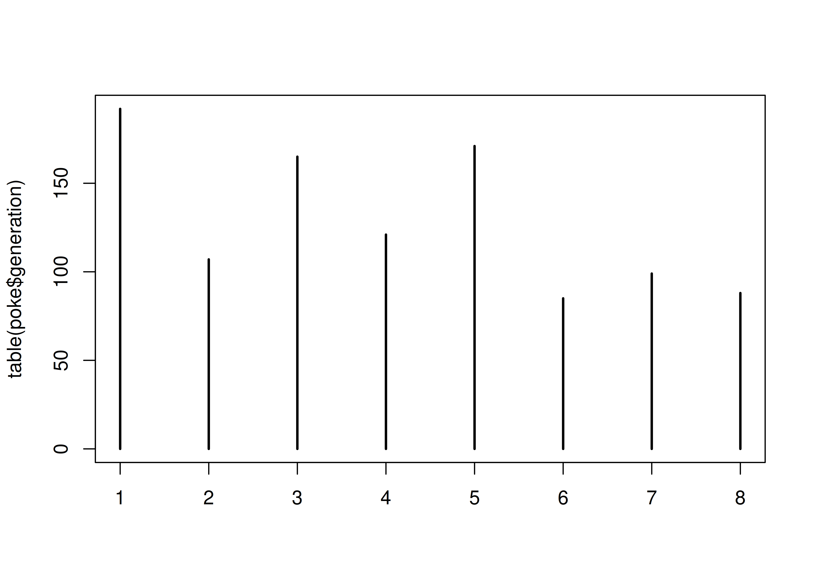

```r


table(poke$type_1, poke$type_2)
          
           Bug Dark Dragon Electric Fairy Fighting Fire Flying Ghost Grass
  Bug        0    0      0        4     2        4    2     14     1     6
  Dark       0    0      4        0     3        2    3      5     2     0
  Dragon     0    0      0        1     1        2    1      6     3     0
  Electric   0    2      2        0     2        0    1      6     1     1
  Fairy      0    0      0        0     0        0    0      2     0     0
  Fighting   0    1      0        0     0        0    0      1     1     0
  Fire       2    1      2        0     0        7    0      7     2     0
  Flying     0    0      2        0     0        0    0      0     0     0
  Ghost      0    1      2        0     1        0    3      3     0    11
  Grass      0    3      5        0     5        3    0      7     1     0
  Ground     0    3      2        1     0        0    1      4     4     0
  Ice        2    0      0        0     1        0    1      2     1     0
  Normal     0    0      1        0     5        4    0     27     0     2
  Poison     1    5      4        0     1        2    2      3     0     0
  Psychic    0    1      1        0     9        3    1      7     3     1
  Rock       2    2      2        3     3        1    2      6     0     2
  Steel      0    0      2        0     4        1    0      2     4     0
  Water      2    7      3        2     4        3    0      7     2     3
          
           Ground Ice Normal Poison Psychic Rock Steel Water
  Bug           2   0      0     12       2    3     7     3
  Dark          0   2      5      0       2    0     2     0
  Dragon        7   3      0      0       4    0     0     0
  Electric      0   2      2      3       1    0     4     1
  Fairy         0   0      0      0       0    0     1     0
  Fighting      0   1      0      0       3    0     3     0
  Fire          3   0      2      0       2    1     1     1
  Flying        0   0      0      0       0    0     1     1
  Ghost         2   0      0      4       0    0     0     0
  Grass         1   3      0     15       2    0     3     0
  Ground        0   0      0      0       2    3     4     0
  Ice           3   0      0      0       2    0     2     3
  Normal        1   0      0      0       3    0     0     1
  Poison        2   0      0      0       0    0     0     3
  Psychic       0   2      2      0       0    0     2     0
  Rock          6   2      0      1       2    0     4     6
  Steel         2   0      0      0       7    3     0     0
  Water        10   4      0      3       6    5     1     0
plot(table(poke$type_1, poke$type_2)) # mosaic plot - hard to read b/c too many categories
```

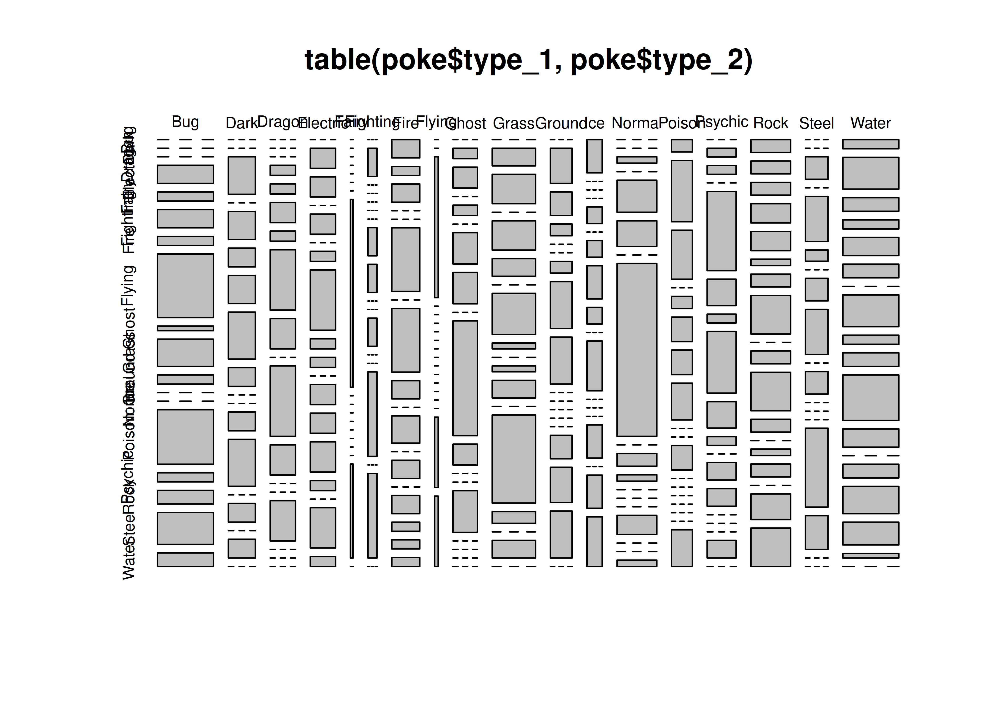
</details>

3. Graphical examinations may be a bit easier to understand    
    
<details class="ex"><summary>There are better options for examining this data, but they are easier to get in ggplot2. </summary>

```r
library(ggplot2)

# define the x and y axis variables first
ggplot(data = poke, aes(x = type_1, y = type_2)) + 
  # define what will be plotted (points)
  # and what aesthetics will be used (size, color)
  # and how those aesthetics will be mapped to values 
  # (proportional to the count in a 2d bin)
  geom_point(aes(size = ..count.., color = ..count..), stat = "bin2d")
```

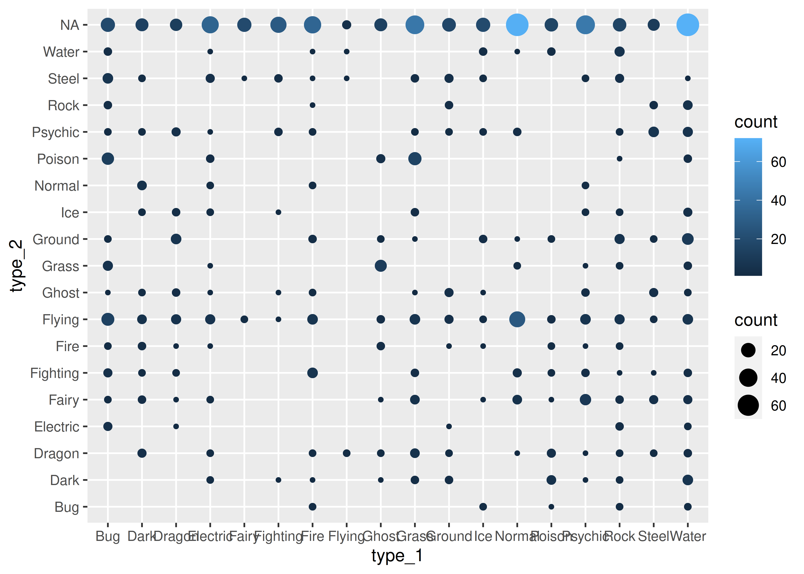

We can also generate histograms or bar charts^[A histogram is a chart which breaks up a continuous variable into ranges, where the height of the bar is proportional to the number of items in the range. A bar chart is similar, but shows the number of occurrences of a discrete variable.] 

By default, R uses ranges of $(a, b]$ in histograms, so we specify which breaks will give us a desireable result. If we do not specify breaks, R will pick them for us.


```r
hist(poke$generation) # This isn't really optimal... we only have whole numbers.
hist(poke$generation, breaks = 0:8) # Much better.
```

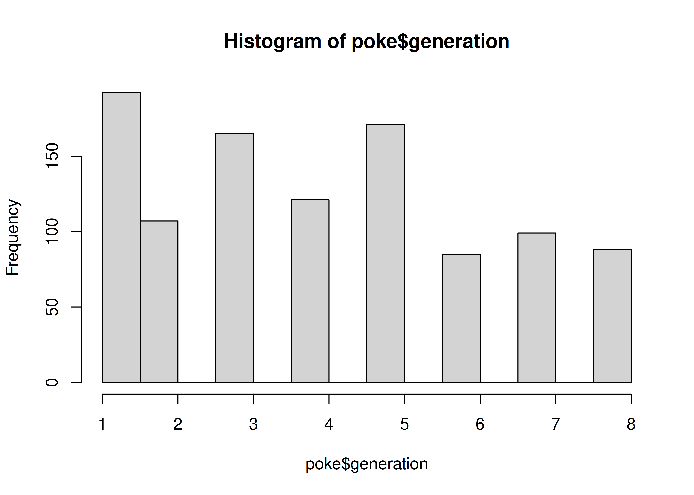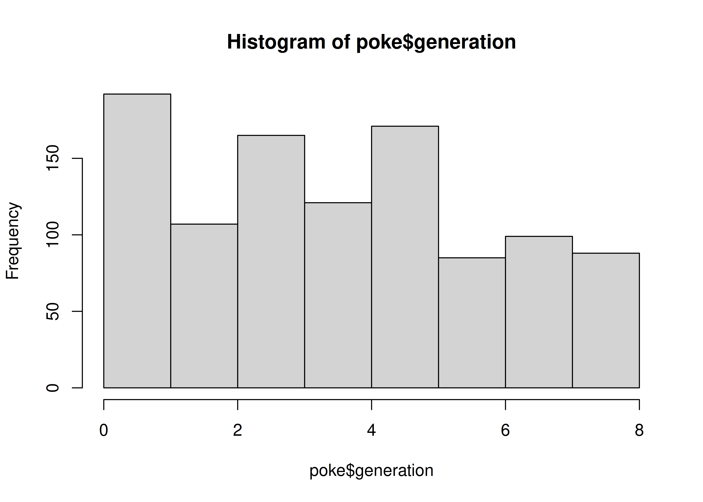

For continuous variables, we can use histograms, or we can examine kernel density plots.
::: .note
Remember that `%>%` is the "pipe" and takes the left side of the pipe to pass as an argument to the right side. This makes code easier to read because it becomes a step-wise "recipe". 
:::

```r
library(magrittr) # This provides the pipe command, %>%

hist(poke$weight_kg)

poke$weight_kg %>%
  log10() %>% # Take the log - will transformation be useful w/ modeling?
  hist() # create a histogram

poke$weight_kg %>%
  density(na.rm = T) %>% # First, we compute the kernel density 
  # (na.rm = T says to ignore NA values)
  plot() # Then, we plot the result

poke$weight_kg %>%
  log10() %>% # Transform the variable
  density(na.rm = T) %>% # Compute the density ignoring missing values
  plot(main = "Density of Log10 pokemon weight in Kg") # Plot the result, 
    # changing the title of the plot to a meaningful value
```

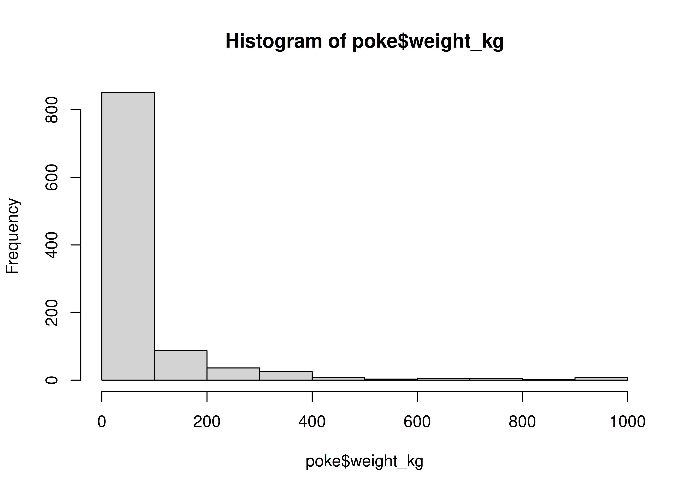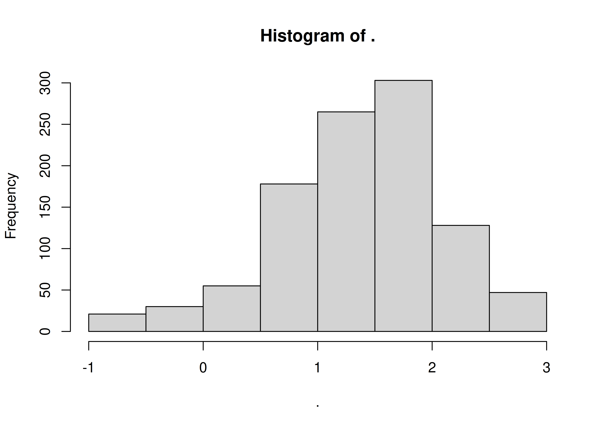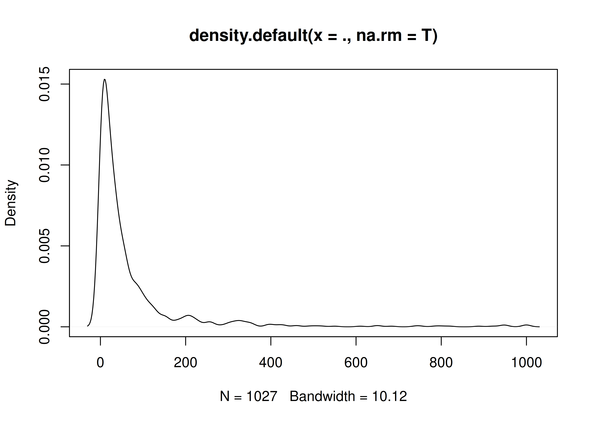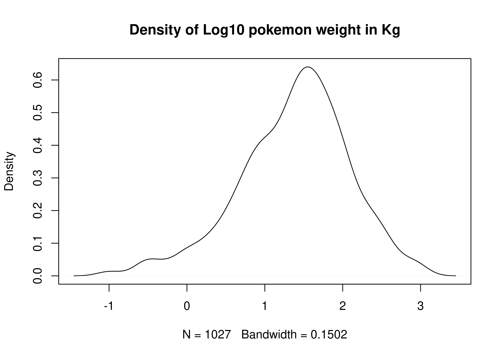
</details>

4. We may also want to look at correlations or relationships between variables.    
    
<details class="ex"><summary>Basic modeling and variable relationship exploration using formulas in R</summary>
In R, most models are specified as `y ~ x1 + x2 + x3`, where the information on the left side of the tilde is the dependent variable, and the information on the right side are any explanatory variables. Interactions are specified using `x1*x2` to get all combinations of x1 and x2 (x1, x2, x1\*x2); single interaction terms are specified as e.g. `x1:x2` and do not include any component terms.

To examine the relationship between a categorical variable and a continuous variable, we might look at boxplots: 

```r

boxplot(log10(height_m) ~ status, data = poke)

boxplot(total_points ~ species, data = poke)
```

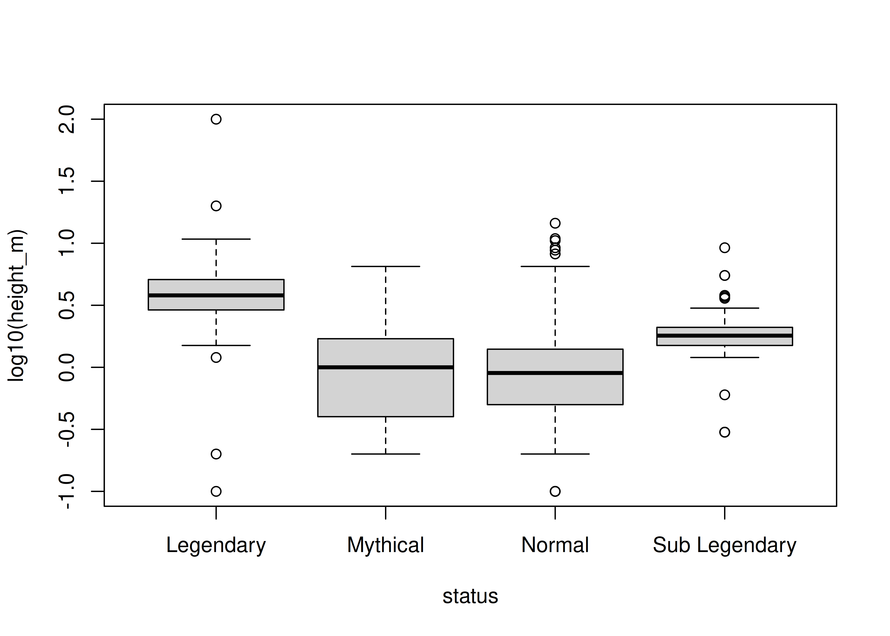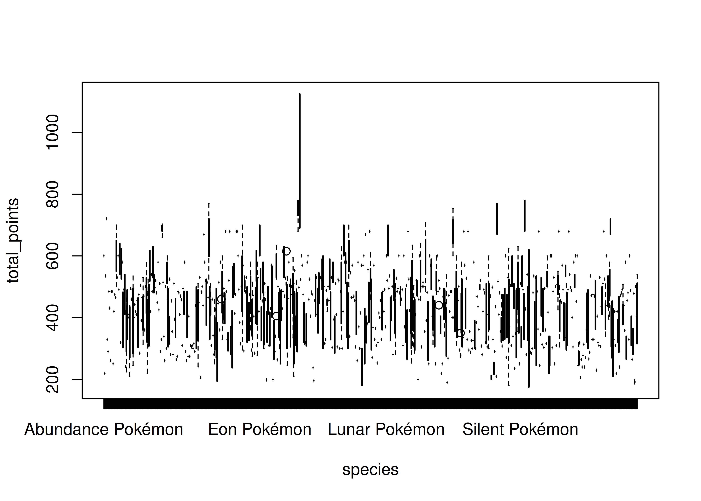
In the second boxplot, there are far too many categories to be able to resolve the relationship clearly, but the plot is still effective in that we can identify that there are one or two species which have a much higher point range than other species. EDA isn't usually about creating pretty plots (or we'd be using `ggplot` right now) but rather about identifying things which may come up in the analysis later.

To look at the relationship between numeric variables, we could compute a numeric correlation, but a plot is more useful.


```r
plot(defense ~ attack, data = poke, type = "p")

cor(poke$defense, poke$attack)
[1] 0.4507656
```

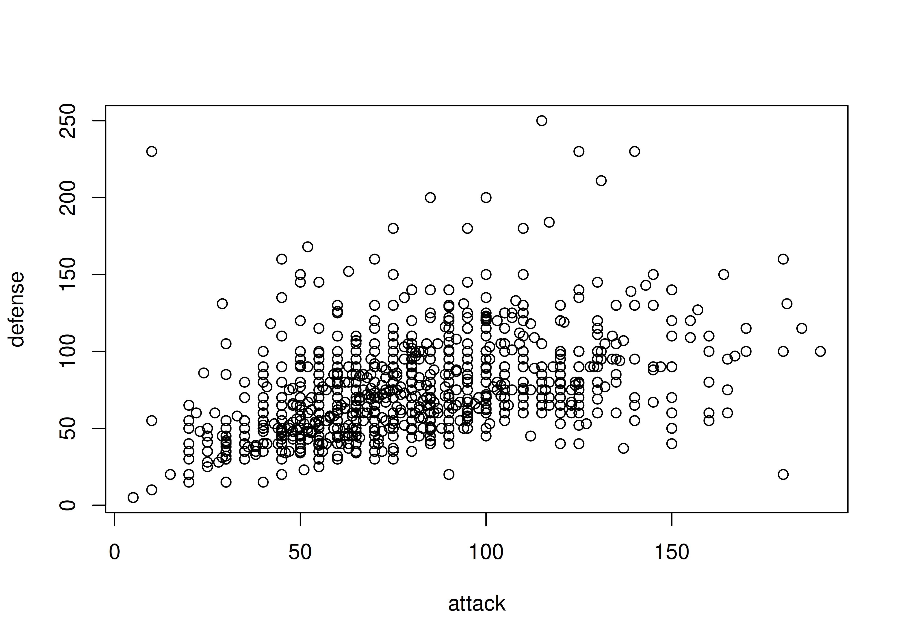
Sometimes, we discover that a variable which appears to be continuous is actually relatively quantized - there are only a few values of base_friendship in the whole dataset. 


```r
plot(x = poke$base_experience, y = poke$base_friendship, type = "p")
```


A scatterplot matrix can also be a useful way to visualize relationships between several variables.

```r
pairs(poke[,19:23]) # hp - sp_defense columns
```


</details>

::: learn-more
[There's more information on how to customize these plots here](http://www.sthda.com/english/wiki/scatter-plot-matrices-r-base-graphs). 
:::

5. The `skimr` package does many of the aforementioned tasks for you with one command!

<details class="ex"><summary>`skimr` demo</summary>


```r
if (!"skimr" %in% installed.packages()) install.packages("skimr")
library(skimr)
skim(police_violence)
```


Table: (\#tab:skimr)Data summary

|                         |                |
|:------------------------|:---------------|
|Name                     |police_violence |
|Number of rows           |7663            |
|Number of columns        |27              |
|_______________________  |                |
|Column type frequency:   |                |
|character                |23              |
|numeric                  |3               |
|POSIXct                  |1               |
|________________________ |                |
|Group variables          |None            |


**Variable type: character**

|skim_variable                                                                                                                                                              | n_missing| complete_rate| min|   max| empty| n_unique| whitespace|
|:--------------------------------------------------------------------------------------------------------------------------------------------------------------------------|---------:|-------------:|---:|-----:|-----:|--------:|----------:|
|Victim's name                                                                                                                                                              |         0|          1.00|   7|    49|     0|     7411|          0|
|Victim's gender                                                                                                                                                            |         8|          1.00|   4|    11|     0|        4|          0|
|Victim's race                                                                                                                                                              |         0|          1.00|   5|    16|     0|        8|          0|
|URL of image of victim                                                                                                                                                     |      3462|          0.55|  27| 10527|     0|     4192|          0|
|Street Address of Incident                                                                                                                                                 |        83|          0.99|   3|    73|     0|     7487|          0|
|City                                                                                                                                                                       |         6|          1.00|   3|    29|     0|     2884|          0|
|State                                                                                                                                                                      |         0|          1.00|   2|     2|     0|       51|          0|
|Zipcode                                                                                                                                                                    |        39|          0.99|   4|     5|     0|     4996|          0|
|County                                                                                                                                                                     |        15|          1.00|   3|    80|     0|     1110|          0|
|Agency responsible for death                                                                                                                                               |        16|          1.00|   7|   177|     0|     2853|          0|
|Cause of death                                                                                                                                                             |         0|          1.00|   4|    39|     0|       30|          0|
|A brief description of the circumstances surrounding the death                                                                                                             |        20|          1.00|  30|  1631|     0|     7581|          0|
|Official disposition of death (justified or other)                                                                                                                         |       256|          0.97|   7|   176|     0|       97|          0|
|Criminal Charges?                                                                                                                                                          |         0|          1.00|   2|    77|     0|       29|          0|
|Link to news article or photo of official document                                                                                                                         |        12|          1.00|  21|   312|     0|     7560|          0|
|Symptoms of mental illness?                                                                                                                                                |        11|          1.00|   2|    19|     0|        6|          0|
|Unarmed                                                                                                                                                                    |         0|          1.00|   7|    15|     0|        4|          0|
|Alleged Weapon (Source: WaPo)                                                                                                                                              |         0|          1.00|   2|    32|     0|      169|          0|
|Alleged Threat Level (Source: WaPo)                                                                                                                                        |      2382|          0.69|   5|    12|     0|        3|          0|
|Fleeing (Source: WaPo)                                                                                                                                                     |      2616|          0.66|   1|    11|     0|        8|          0|
|Body Camera (Source: WaPo)                                                                                                                                                 |      2869|          0.63|   2|    18|     0|        5|          0|
|Off-Duty Killing?                                                                                                                                                          |      7437|          0.03|   8|     8|     0|        1|          0|
|Geography (via Trulia methodology based on zipcode population density: http://jedkolko.com/wp-content/uploads/2015/05/full-ZCTA-urban-suburban-rural-classification.xlsx ) |        67|          0.99|   5|     8|     0|        3|          0|


**Variable type: numeric**

|skim_variable                          | n_missing| complete_rate|    mean|      sd| p0|     p25|  p50|     p75| p100|hist  |
|:--------------------------------------|---------:|-------------:|-------:|-------:|--:|-------:|----:|-------:|----:|:-----|
|Victim's age                           |       206|          0.97|   36.80|   13.21|  1|   27.00|   34|   45.00|  107|▂▇▃▁▁ |
|WaPo ID (If included in WaPo database) |      2785|          0.64| 2723.53| 1534.33|  3| 1402.25| 2722| 4050.75| 5439|▇▇▇▇▇ |
|ID                                     |         0|          1.00| 3832.89| 2213.34|  1| 1916.50| 3832| 5749.50| 7667|▇▇▇▇▇ |


**Variable type: POSIXct**

|skim_variable                     | n_missing| complete_rate|min        |max        |median     | n_unique|
|:---------------------------------|---------:|-------------:|:----------|:----------|:----------|--------:|
|Date of Incident (month/day/year) |         0|             1|2013-01-01 |2019-12-31 |2016-07-07 |     2404|

You may find the summary tables given by the `skimr` package to be more appealing - it separates the variables out by type, provides histograms of numeric variables, and is compatible with rmarkdown/knitr. 

If you want summary statistics by group, you can get that using the `dplyr` package functions `select` and `group_by`, which we will learn more about in the next section. (I'm cheating a bit by mentioning it now, but it's just so useful!)


```r
library(dplyr)
police_violence %>%
  # get variables which are important
  select(matches("age$|race|gender|Cause|Symptoms|Unarmed")) %>% 
  group_by(Unarmed) %>%
  skim()
```


Table: (\#tab:skimr2)Data summary

|                         |           |
|:------------------------|:----------|
|Name                     |Piped data |
|Number of rows           |7663       |
|Number of columns        |6          |
|_______________________  |           |
|Column type frequency:   |           |
|character                |4          |
|numeric                  |1          |
|________________________ |           |
|Group variables          |Unarmed    |


**Variable type: character**

|skim_variable               |Unarmed         | n_missing| complete_rate| min| max| empty| n_unique| whitespace|
|:---------------------------|:---------------|---------:|-------------:|---:|---:|-----:|--------:|----------:|
|Victim's gender             |Allegedly Armed |         3|          1.00|   4|  11|     0|        4|          0|
|Victim's gender             |Unarmed         |         0|          1.00|   4|  11|     0|        4|          0|
|Victim's gender             |Unclear         |         2|          1.00|   4|   7|     0|        3|          0|
|Victim's gender             |Vehicle         |         3|          0.99|   4|  11|     0|        3|          0|
|Victim's race               |Allegedly Armed |         0|          1.00|   5|  16|     0|        8|          0|
|Victim's race               |Unarmed         |         0|          1.00|   5|  16|     0|        8|          0|
|Victim's race               |Unclear         |         0|          1.00|   5|  16|     0|        8|          0|
|Victim's race               |Vehicle         |         0|          1.00|   5|  16|     0|        8|          0|
|Cause of death              |Allegedly Armed |         0|          1.00|   4|  39|     0|       21|          0|
|Cause of death              |Unarmed         |         0|          1.00|   5|  39|     0|       17|          0|
|Cause of death              |Unclear         |         0|          1.00|   5|  25|     0|        8|          0|
|Cause of death              |Vehicle         |         0|          1.00|   5|  14|     0|        4|          0|
|Symptoms of mental illness? |Allegedly Armed |        10|          1.00|   2|  19|     0|        6|          0|
|Symptoms of mental illness? |Unarmed         |         0|          1.00|   2|  19|     0|        4|          0|
|Symptoms of mental illness? |Unclear         |         1|          1.00|   2|  19|     0|        4|          0|
|Symptoms of mental illness? |Vehicle         |         0|          1.00|   2|  19|     0|        4|          0|


**Variable type: numeric**

|skim_variable |Unarmed         | n_missing| complete_rate|  mean|    sd| p0| p25| p50| p75| p100|hist  |
|:-------------|:---------------|---------:|-------------:|-----:|-----:|--:|---:|---:|---:|----:|:-----|
|Victim's age  |Allegedly Armed |       139|          0.97| 37.82| 13.64| 14|  27|  35|  47|  107|▇▇▃▁▁ |
|Victim's age  |Unarmed         |        16|          0.99| 34.36| 12.18|  1|  25|  33|  41|   89|▁▇▅▁▁ |
|Victim's age  |Unclear         |        34|          0.95| 35.36| 11.60| 15|  26|  34|  43|   76|▇▇▆▂▁ |
|Victim's age  |Vehicle         |        17|          0.97| 32.82| 10.75| 15|  25|  31|  38|   77|▆▇▃▁▁ |
This summary allows us to see very quickly that there is a difference in the age distribution of unarmed individuals who died during an encounter with police - unarmed individuals are likely to be significantly older on average. 

If you are using `skimr` in knitr/rmarkdown, your data frame will automatically render as a custom-printed table if the last line in the code chunk is a `skim_df` object. There are many ways to customize the summary statistics detailed in the package that I'm not going to go into here, but you are free to investigate if you like the way these summaries look. 

I mention this package now because it is appropriate for EDA, but it may not be intuitive or easy to use in the way you might want to use it until after we cover the `dplyr` package in the [manipulating data module](#manipulating-data) and the `tidyr` package in the [transforming data module](#transforming-data). 

</details>

&nbsp;

<details><summary>It's not *completely* relevant here, but may be useful as you're reading in data... the `janitor` package is really great for cleaning up your data before you do EDA</summary>

The janitor package has functions for cleaning up messy data. One of its best features is the `clean_names()` function, which creates names based on a capitalization/separation scheme of your choosing. 


</details>


#### Try it out {- .tryitout #police-violence-eda-r}

Explore the variables present in [the police violence data](data/police_violence.xlsx) (see code in the spreadsheets section to read it in). Note that some variables may be too messy to handle with the things that you have seen thus far - that is ok. As you find irregularities, document them - these are things you may need to clean up in the dataset before you conduct a formal analysis.

How does your analysis in R differ from the way that you approached the data in SAS?
<details><summary>Solution</summary>

```r
if (!"readxl" %in% installed.packages()) install.packages("readxl")
library(readxl)
police_violence <- read_xlsx("data/police_violence.xlsx", sheet = 1, guess_max = 7000)

police_violence$`Victim's age` <- as.numeric(police_violence$`Victim's age`)
Warning: NAs introduced by coercion

summary(police_violence)
 Victim's name       Victim's age   Victim's gender    Victim's race     
 Length:7663        Min.   :  1.0   Length:7663        Length:7663       
 Class :character   1st Qu.: 27.0   Class :character   Class :character  
 Mode  :character   Median : 34.0   Mode  :character   Mode  :character  
                    Mean   : 36.8                                        
                    3rd Qu.: 45.0                                        
                    Max.   :107.0                                        
                    NA's   :206                                          
 URL of image of victim Date of Incident (month/day/year)
 Length:7663            Min.   :2013-01-01 00:00:00      
 Class :character       1st Qu.:2014-10-07 00:00:00      
 Mode  :character       Median :2016-07-07 00:00:00      
                        Mean   :2016-07-06 23:33:18      
                        3rd Qu.:2018-04-04 00:00:00      
                        Max.   :2019-12-31 00:00:00      
                                                         
 Street Address of Incident     City              State          
 Length:7663                Length:7663        Length:7663       
 Class :character           Class :character   Class :character  
 Mode  :character           Mode  :character   Mode  :character  
                                                                 
                                                                 
                                                                 
                                                                 
   Zipcode             County          Agency responsible for death
 Length:7663        Length:7663        Length:7663                 
 Class :character   Class :character   Class :character            
 Mode  :character   Mode  :character   Mode  :character            
                                                                   
                                                                   
                                                                   
                                                                   
 Cause of death    
 Length:7663       
 Class :character  
 Mode  :character  
                   
                   
                   
                   
 A brief description of the circumstances surrounding the death
 Length:7663                                                   
 Class :character                                              
 Mode  :character                                              
                                                               
                                                               
                                                               
                                                               
 Official disposition of death (justified or other) Criminal Charges? 
 Length:7663                                        Length:7663       
 Class :character                                   Class :character  
 Mode  :character                                   Mode  :character  
                                                                      
                                                                      
                                                                      
                                                                      
 Link to news article or photo of official document Symptoms of mental illness?
 Length:7663                                        Length:7663                
 Class :character                                   Class :character           
 Mode  :character                                   Mode  :character           
                                                                               
                                                                               
                                                                               
                                                                               
   Unarmed          Alleged Weapon (Source: WaPo)
 Length:7663        Length:7663                  
 Class :character   Class :character             
 Mode  :character   Mode  :character             
                                                 
                                                 
                                                 
                                                 
 Alleged Threat Level (Source: WaPo) Fleeing (Source: WaPo)
 Length:7663                         Length:7663           
 Class :character                    Class :character      
 Mode  :character                    Mode  :character      
                                                           
                                                           
                                                           
                                                           
 Body Camera (Source: WaPo) WaPo ID (If included in WaPo database)
 Length:7663                Min.   :   3                          
 Class :character           1st Qu.:1402                          
 Mode  :character           Median :2722                          
                            Mean   :2724                          
                            3rd Qu.:4051                          
                            Max.   :5439                          
                            NA's   :2785                          
 Off-Duty Killing? 
 Length:7663       
 Class :character  
 Mode  :character  
                   
                   
                   
                   
 Geography (via Trulia methodology based on zipcode population density: http://jedkolko.com/wp-content/uploads/2015/05/full-ZCTA-urban-suburban-rural-classification.xlsx )
 Length:7663                                                                                                                                                               
 Class :character                                                                                                                                                          
 Mode  :character                                                                                                                                                          
                                                                                                                                                                           
                                                                                                                                                                           
                                                                                                                                                                           
                                                                                                                                                                           
       ID      
 Min.   :   1  
 1st Qu.:1916  
 Median :3832  
 Mean   :3833  
 3rd Qu.:5750  
 Max.   :7667  
               
```

Let's examine the numeric and date variables first:

```r
hist(police_violence$`Victim's age`)
```

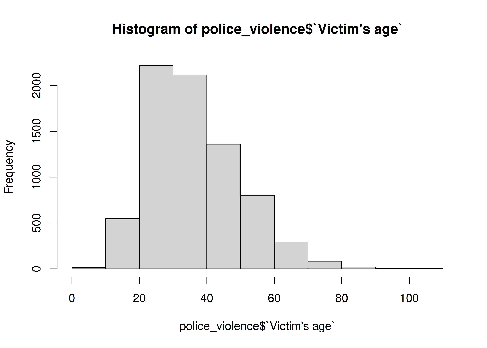

```r

# hist(police_violence$`Date of Incident (month/day/year)`) 
# This didn't work - it wants me to specify breaks

# Instead, lets see if ggplot handles it better - from R4DS
library(ggplot2)
ggplot(police_violence, aes(x = `Date of Incident (month/day/year)`)) + 
  geom_histogram()
`stat_bin()` using `bins = 30`. Pick better value with `binwidth`.
```

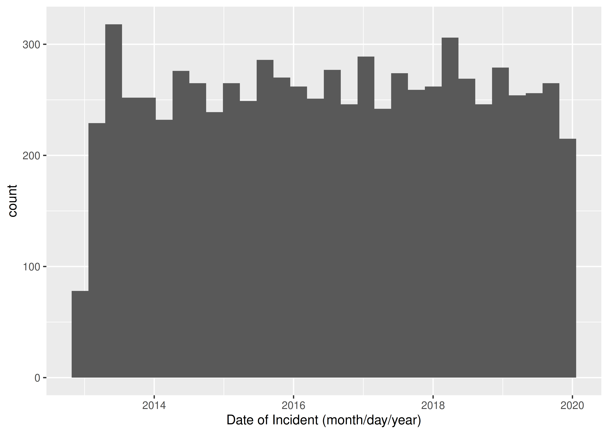

```r
ggplot(police_violence, aes(x = `Date of Incident (month/day/year)`)) + 
  geom_density()
```

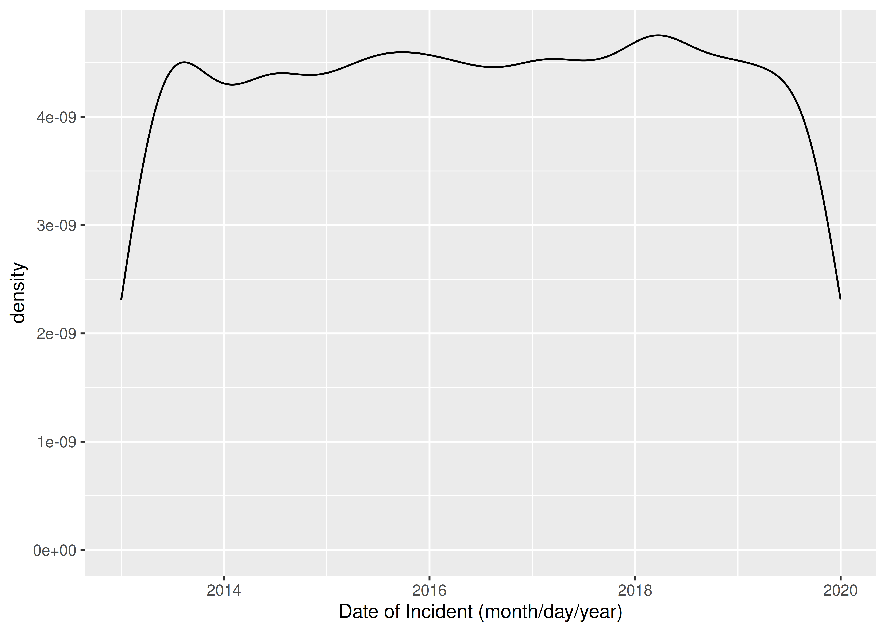

Let's look at the victims' gender and race:

```r
table(police_violence$`Victim's race`, useNA = 'ifany')

           Asian            Black         Hispanic  Native American 
             118             1944             1335              112 
Pacific Islander     Unknown race     Unknown Race            White 
              42              670               64             3378 
table(police_violence$`Victim's gender`)

     Female        Male Transgender     Unknown 
        391        7253           7           4 
table(police_violence$`Victim's race`, police_violence$`Victim's gender`)
                  
                   Female Male Transgender Unknown
  Asian                 6  111           0       1
  Black                69 1871           2       1
  Hispanic             49 1283           1       0
  Native American       7  104           0       0
  Pacific Islander      2   40           0       0
  Unknown race         33  632           1       2
  Unknown Race          2   62           0       0
  White               223 3150           3       0

plot(table(police_violence$`Victim's race`, police_violence$`Victim's gender`),
     main = "Police Killing by Race, Gender")
```


We can also look at the age range for each race:

```r
police_violence %>%
  # get groups with at least 100 observations that aren't unknown
  subset(`Victim's race` %in% c("Asian", "Black", "Native American", "Hispanic", "White")) %>%
  boxplot(`Victim's age` ~ `Victim's race`, data = .)
```


And examine the age range for each gender as well:


```r
police_violence %>%
  boxplot(`Victim's age` ~ `Victim's gender`, data = .)
```

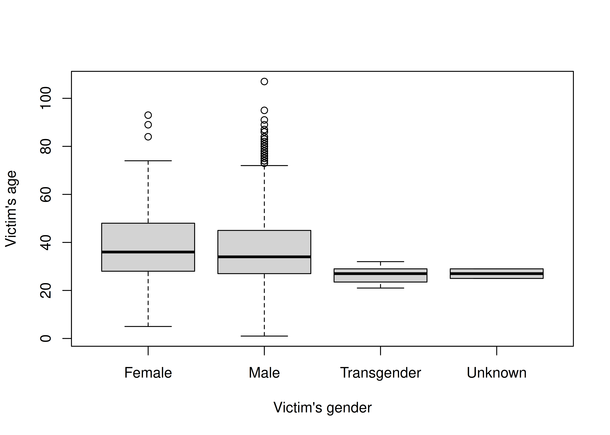
The thing I'm honestly most surprised at with this plot is that there are so many elderly individuals (of both genders) shot. That's not a realization I'd normally construct this plot for, but the visual emphasis on the outliers in a boxplot makes it much easier to focus on that aspect of the data. 

My analysis in R was a bit more free-form than in SAS - in SAS, I proceeded fairly directly through each procedure, while in R, I could investigate things that caught my eye along the way more easily. I didn't focus as much on what we'd need to clean up in R (because the same problems exist that we identified when using SAS). 
</details>


## References and Links {.learn-more -}

- [Reading JSON in SAS](https://support.sas.com/resources/papers/proceedings17/0856-2017.pdf) -- You know SAS documentation is getting weird when they advertise a method as "the sexiest way to import JSON data into SAS". 
- [Reading Rdata files in SAS](http://proc-x.com/2015/05/import-rdata-to-sas-along-with-labels/)
- [Common problems with SAS data files](https://blogs.sas.com/content/sgf/2015/04/17/turning-text-files-into-sas-data-sets-6-common-problems-and-their-solutions/)
- U.S. Department of Transportation, Federal Highway Administration, 2009 National Household 
Travel Survey. URL: http://nhts.ornl.gov. Data acquired from data.world. 
- [RSQLite vignette](https://cran.r-project.org/web/packages/RSQLite/vignettes/RSQLite.html)
- [Slides from Jenny Bryan's talk on spreadsheets](https://speakerdeck.com/jennybc/spreadsheets) (sadly, no audio. It was a good talk.)
- The [`vroom` package](https://www.tidyverse.org/blog/2019/05/vroom-1-0-0/) works like `read_csv` but allows you to read in and write to many files at incredible speeds. 
