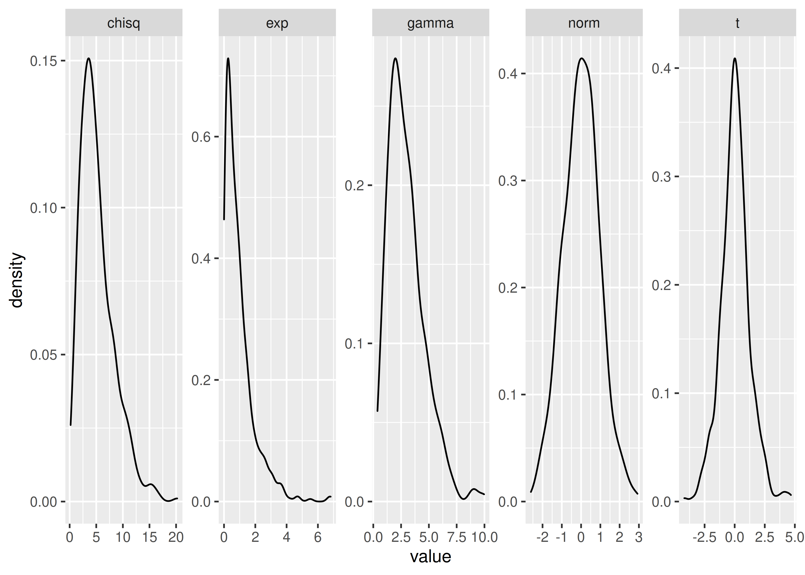
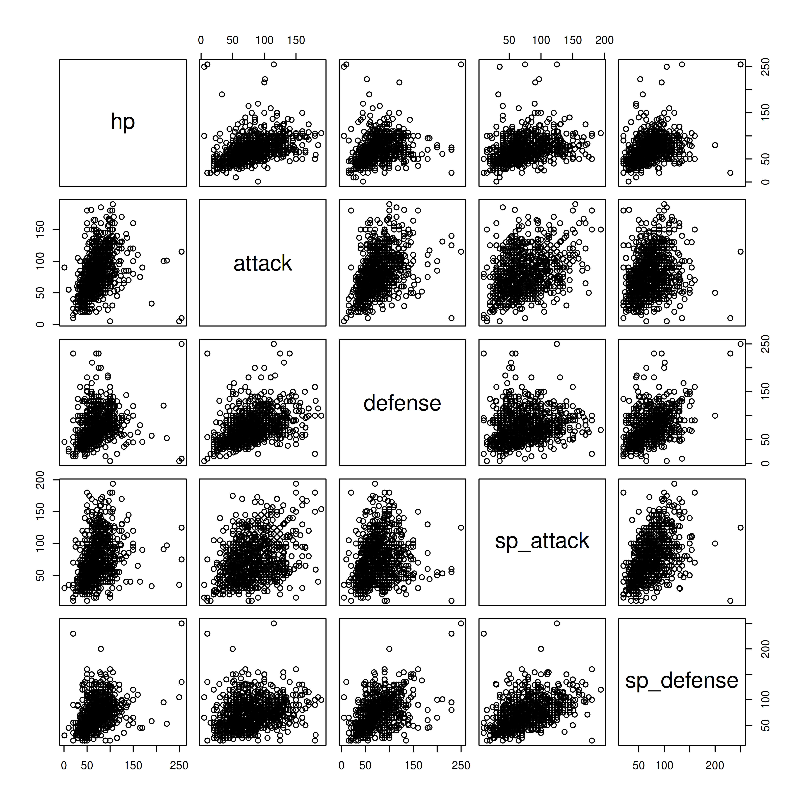
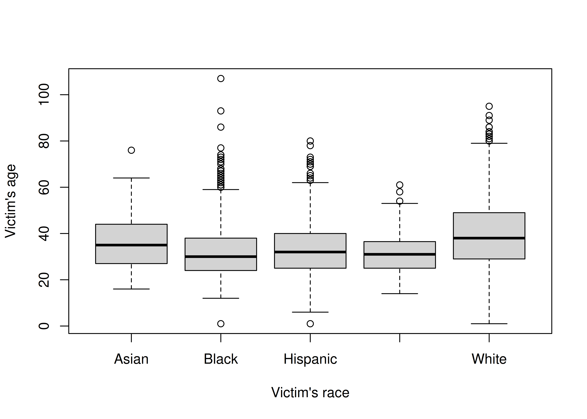
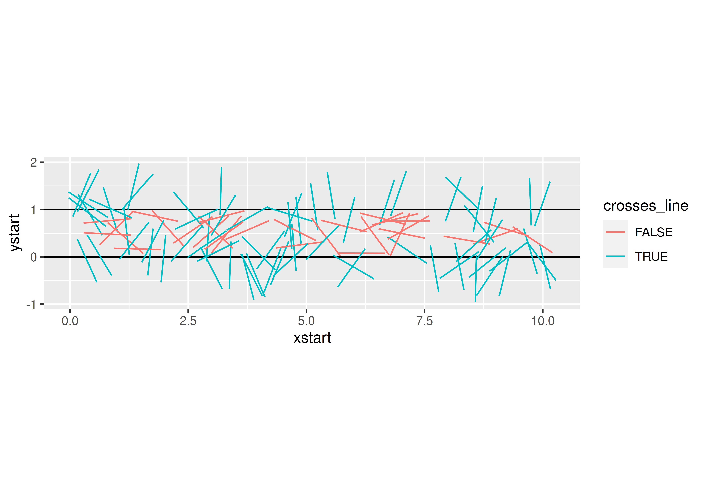
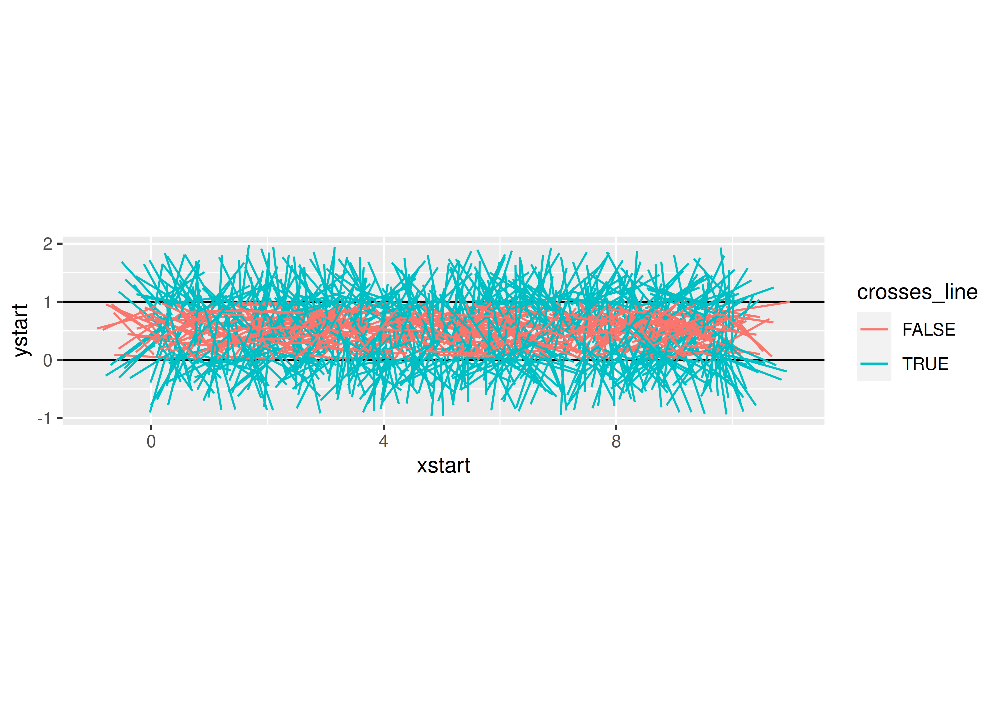

# Simulation and Reproducibility {#simulation}

## Simulation: Module Objectives {-}

- Understand how pseudorandom number generation works and necessary conditions for reproducibility
- Be able to implement a simulation for a specific task, process, or model

Simulation is an extremely important part of computational statistics. Bayesian statistics, in particular, relies on Markov Chain Monte Carlo (MCMC) to get results from even the most basic of models. In this module, we're going to touch on a few foundational pieces of simulation in computing, and you will get more exposure to simulation-based methods in other courses down the line. 

## Pseudorandom Number Generation

Computers are almost entirely deterministic, which makes it very difficult to come up with "random" numbers. In addition to the deterministic nature of computing, it's also somewhat important to be able to run the same code and get the same results every time, which isn't possible if you rely on truly random numbers. 

Historically, **pseudorandom** numbers were generated using [linear congruential generators](https://en.wikipedia.org/wiki/Linear_congruential_generator) (LCGs). These algorithms aren't typically used anymore, but they provide a good demonstration of how one might go about generating numbers that seem "random" but are actually deterministic. LCGs use modular arithmetic: $X_{n+1} = (aX_n + c) \mod m$ where $X_0$ is the start value (the seed), $a$ is the multiplier, $c$ is the increment, and $m$ is the modulus. When using a LCG, the user generally specifies only the seed. 


The important thing to note here is that if you specify the same generator values (a, c, m, and $X_0$), you will always get the same series of numbers. Since a, c, m are usually specified by the implementation, as a user, you should expect that if you specify the same seed, you will get the same results, every time.

<details><summary>It is critically important to set your seed if you want the results to be reproducible and you are using an algorithm that depends on randomness.^[I once helped a friend fit a model for their masters thesis using Simulated Annealing (which relies on random seeds). We got brilliant results, but couldn't ever reproduce them, because I hadn't set the seed first and we never could figure out what the original seed was. Learn from my mistakes.]</summary> Once you set your seed, the remaining results will only be reproducible if you generate the same set of random numbers every time. 


```r
set.seed(342512)

# Get 10 numbers after the seed is set
sample(1:100, 10)
##  [1] 65 51 64 21 45 53  3  6 43  8

# Compute something else that depends on randomness
mean(rnorm(50))
## [1] -0.1095366

# Get 10 more numbers
sample(1:100, 10)
##  [1]  4 57 69 10 76 15 67  1  3 91
```

Compare the results above to these results:


```r
set.seed(342512)

# Get 10 numbers after the seed is set
sample(1:100, 10)
##  [1] 65 51 64 21 45 53  3  6 43  8

# Compute something else that depends on randomness
mean(rnorm(30))
## [1] -0.1936645

# Get 10 more numbers
sample(1:100, 10)
##  [1]  49  37   6  34   9   3 100  43   7  29
```

Notice how the results have changed? To make my documents more reproducible, I will sometimes set a new seed at the start of an important chunk, even if I've already set the seed earlier. This introduces certain "fixed points" where results won't change immediately after I've re-set the seed. This is particularly important when I'm generating bootstrap estimates, fitting models, or simulating data for graphics experiments.
</details>

Pick your seed in any way you want. I tend to just randomly wiggle my fingers over the number keys, but I have also heard of people using the date in yyyymmdd format, favorite people's birthdays, the current time in hhmmss format... basically, you can use anything. 

## Built-in simulations from distributions

Often, we can get away with just simulating data from a known distribution. As both R and SAS are meant for statistical computing, this is extremely easy by design. 
<details><summary>In R</summary>
You can see the various distribution options using `?Distributions`. In general, `dxxx` is the PDF/PMF, `pxxx` is the CDF, `qxxx` is the quantile function, and `rxxx` gives you random nubmers generated from the distribution. (`xxx`, obviously, is whatever distribution you're looking to use.)


```r
library(tibble)
library(dplyr)
## 
## Attaching package: 'dplyr'
## The following objects are masked from 'package:stats':
## 
##     filter, lag
## The following objects are masked from 'package:base':
## 
##     intersect, setdiff, setequal, union
library(tidyr)
## 
## Attaching package: 'tidyr'
## The following object is masked from 'package:magrittr':
## 
##     extract
library(ggplot2)
set.seed(109025879)

tibble(
  norm = rnorm(500),
  gamma = rgamma(500, shape = 3, scale = 1),
  exp = rexp(500, rate = 1), # R uses a exp(-ax) 
  t = rt(500, df = 5),
  chisq = rchisq(500, 5)
) %>%
  pivot_longer(1:5, names_to = "dist", values_to = "value") %>%
  ggplot(aes(x = value)) + geom_density() + facet_wrap(~dist, scales = "free", nrow = 1)
```


</details>
<details><summary>In SAS</summary>
You can see the [various distribution options](https://documentation.sas.com/?docsetId=lefunctionsref&docsetTarget=p0fpeei0opypg8n1b06qe4r040lv.htm&docsetVersion=9.4&locale=en) in the RAND documentation. 

```sashtml
%let N=500; /* size of sample */
  
DATA sample;
call streaminit(12532);
DO i = 1 to &N; /* &N is the value of the macro variable defined above */
  id = i;
  norm = rand("Normal", 0, 1);
  gamma = rand("Gamma", 3, 1);
  exp = rand("Exponential", 1); /* SAS uses 1/a exp(-x/a) */
  t = rand("T", 5);
  chisq = rand("Chisq", 5);
  OUTPUT;
END;
RUN;

PROC TRANSPOSE data=sample out=longsample
  (rename=(COL1 = value)) /* rename output variable ('values_to') */
  NAME = dist /* where the column names go ('names_to') */
;
  BY id;
  VAR norm gamma exp t chisq;
RUN;

PROC SGPANEL data=longsample;
PANELBY dist / COLUMNS = 5 UNISCALE = ROW NOVARNAME;
  DENSITY value / TYPE = KERNEL;
RUN;
```


<div class="branch">
<a name="IDX"></a>
<div>
<div  class="c">

</div>
</div>
<br>
</div>
</details>

### Try it out {- .tryitout}
Generate variables x and y, where x is a sequence from -10 to 10 and y is equal to $x + \epsilon$, $\epsilon \sim N(0, 1)$. Fit a linear regression to your simulated data (in R, `lm`, in SAS, `PROC REG`).

<details><summary>In R</summary>

```r
set.seed(20572983)
data <- tibble(x = seq(-10, 10, .1), 
               y = x + rnorm(length(x)))
regression <- lm(y ~ x, data = data)
summary(regression)
## 
## Call:
## lm(formula = y ~ x, data = data)
## 
## Residuals:
##      Min       1Q   Median       3Q      Max 
## -3.14575 -0.70986  0.03186  0.65429  2.40305 
## 
## Coefficients:
##             Estimate Std. Error t value Pr(>|t|)    
## (Intercept) -0.01876    0.06869  -0.273    0.785    
## x            0.99230    0.01184  83.823   <2e-16 ***
## ---
## Signif. codes:  0 '***' 0.001 '**' 0.01 '*' 0.05 '.' 0.1 ' ' 1
## 
## Residual standard error: 0.9738 on 199 degrees of freedom
## Multiple R-squared:  0.9725,	Adjusted R-squared:  0.9723 
## F-statistic:  7026 on 1 and 199 DF,  p-value: < 2.2e-16
```
</details>
<details><summary>In SAS</summary>

```sashtml
DATA tmp;
call streaminit(20572983);
DO i = -10 to 10 by .1;
  x = i;
  y = x + rand("Normal");
  OUTPUT;
END;
RUN;

PROC REG data = tmp;
MODEL y = x;
RUN;
```


<div class="branch">
<a name="IDX"></a>
<div class="c proctitle">Model: MODEL1</div>
<div class="c proctitle">Dependent Variable: y </div>
<p>
<div>
<div align="center">
<!--BEGINTABLE--><table class="table" cellspacing="0" cellpadding="7" rules="groups" frame="hsides" summary="Procedure Reg: Number of Observations">
<colgroup>
<col>
<col>
</colgroup>
<tbody>
<tr>
<th class="l rowheader" scope="row">Number of Observations Read</th>
<td class="r data">201</td>
</tr>
<tr>
<th class="l rowheader" scope="row">Number of Observations Used</th>
<td class="r data">201</td>
</tr>
</tbody>
</table>
<!--ENDTABLE--></div>
</div>
<br>
<a name="IDX1"></a>
<div>
<div align="center">
<!--BEGINTABLE--><table class="table" cellspacing="0" cellpadding="7" rules="groups" frame="hsides" summary="Procedure Reg: Analysis of Variance">
<colgroup>
<col>
</colgroup>
<colgroup>
<col>
<col>
<col>
<col>
<col>
</colgroup>
<thead>
<tr>
<th class="c b header" colspan="6" scope="colgroup">Analysis of Variance</th>
</tr>
<tr>
<th class="l b header" scope="col">Source</th>
<th class="r b header" scope="col">DF</th>
<th class="r b header" scope="col">Sum of<br/>Squares</th>
<th class="r b header" scope="col">Mean<br/>Square</th>
<th class="r b header" scope="col">F Value</th>
<th class="r b header" scope="col">Pr &gt; F</th>
</tr>
</thead>
<tbody>
<tr>
<th class="l rowheader" scope="row">Model</th>
<td class="r data">1</td>
<td class="r data">6638.19224</td>
<td class="r data">6638.19224</td>
<td class="r data">6592.27</td>
<td class="r data">&lt;.0001</td>
</tr>
<tr>
<th class="l rowheader" scope="row">Error</th>
<td class="r data">199</td>
<td class="r data">200.38634</td>
<td class="r data">1.00697</td>
<td class="r data"> </td>
<td class="r data"> </td>
</tr>
<tr>
<th class="l rowheader" scope="row">Corrected Total</th>
<td class="r data">200</td>
<td class="r data">6838.57858</td>
<td class="r data"> </td>
<td class="r data"> </td>
<td class="r data"> </td>
</tr>
</tbody>
</table>
<!--ENDTABLE--></div>
</div>
<br>
<a name="IDX2"></a>
<div>
<div align="center">
<!--BEGINTABLE--><table class="table" cellspacing="0" cellpadding="7" rules="groups" frame="hsides" summary="Procedure Reg: Fit Statistics">
<colgroup>
<col>
<col>
<col>
<col>
</colgroup>
<tbody>
<tr>
<th class="l rowheader" scope="row">Root MSE</th>
<td class="r data">1.00348</td>
<th class="l rowheader" scope="row">R-Square</th>
<td class="r data">0.9707</td>
</tr>
<tr>
<th class="l rowheader" scope="row">Dependent Mean</th>
<td class="r data" nowrap>-0.09630</td>
<th class="l rowheader" scope="row">Adj R-Sq</th>
<td class="r data">0.9706</td>
</tr>
<tr>
<th class="l rowheader" scope="row">Coeff Var</th>
<td class="r data" nowrap>-1042.03435</td>
<th class="l rowheader" scope="row"> </th>
<td class="r data"> </td>
</tr>
</tbody>
</table>
<!--ENDTABLE--></div>
</div>
<br>
<a name="IDX3"></a>
<div>
<div align="center">
<!--BEGINTABLE--><table class="table" cellspacing="0" cellpadding="7" rules="groups" frame="hsides" summary="Procedure Reg: Parameter Estimates">
<colgroup>
<col>
<col>
</colgroup>
<colgroup>
<col>
<col>
<col>
<col>
</colgroup>
<thead>
<tr>
<th class="c b header" colspan="6" scope="colgroup">Parameter Estimates</th>
</tr>
<tr>
<th class="l b header" scope="col">Variable</th>
<th class="r b header" scope="col">DF</th>
<th class="r b header" scope="col">Parameter<br/>Estimate</th>
<th class="r b header" scope="col">Standard<br/>Error</th>
<th class="r b header" scope="col">t Value</th>
<th class="r b header" scope="col">Pr &gt; |t|</th>
</tr>
</thead>
<tbody>
<tr>
<th class="l rowheader" scope="row">Intercept</th>
<th class="r data">1</th>
<td class="r data" nowrap>-0.09630</td>
<td class="r data">0.07078</td>
<td class="r data" nowrap>-1.36</td>
<td class="r data">0.1752</td>
</tr>
<tr>
<th class="l rowheader" scope="row">x</th>
<th class="r data">1</th>
<td class="r data">0.99044</td>
<td class="r data">0.01220</td>
<td class="r data">81.19</td>
<td class="r data">&lt;.0001</td>
</tr>
</tbody>
</table>
<!--ENDTABLE--></div>
</div>
<br>
<p style="page-break-after: always;"><br/></p><hr size="3"/>
<a name="IDX4"></a>
<div class="c proctitle">Model: MODEL1</div>
<div class="c proctitle">Dependent Variable: y </div>
<p>
<div>
<div  class="c">

</div>
</div>
<br>
<a name="IDX5"></a>
<div>
<div  class="c">

</div>
</div>
<br>
<a name="IDX6"></a>
<div>
<div  class="c">

</div>
</div>
<br>
</div>
</details>


## Simulation to test model assumptions

One of the more powerful ways to use simulation in practice is to use it to test the assumptions of your model. Suppose, for instance, that your data are highly skewed, but you want to use a method that assumes normally distributed errors. How bad will your results be? Where can you trust the results, and where should you be cautious?

<details><summary>Example: Confidence Interval coverage rates</summary>
Suppose, for instance, that we have a lognormal distribution (highly skewed) and we want to compute a 95% confidence interval for the mean of our data. 

```r
set.seed(40295023)

sim <- tibble(
  id = rep(1:100, each = 25), # generate 100 samples of 25 points each
  ln_x = rnorm(25*100), # generate the normal deviates
  x = exp(ln_x), # transform into lognormal deviates
) %>%
  # this creates a 100-row data frame, with one row for each id. 
  # the columns x, ln_x are stored in the data list-column as a tibble.
  nest(data = c(x, ln_x))
  
head(sim)
## # A tibble: 6 x 2
##      id data             
##   <int> <list>           
## 1     1 <tibble [25 × 2]>
## 2     2 <tibble [25 × 2]>
## 3     3 <tibble [25 × 2]>
## 4     4 <tibble [25 × 2]>
## 5     5 <tibble [25 × 2]>
## 6     6 <tibble [25 × 2]>
sim$data[[1]]
## # A tibble: 25 x 2
##        x    ln_x
##    <dbl>   <dbl>
##  1 0.310 -1.17  
##  2 0.622 -0.475 
##  3 0.303 -1.19  
##  4 1.05   0.0525
##  5 0.529 -0.636 
##  6 1.09   0.0891
##  7 1.97   0.676 
##  8 8.94   2.19  
##  9 0.598 -0.514 
## 10 0.183 -1.70  
## # … with 15 more rows
```


You want to assess the coverage probability of a confidence interval computed under two different modeling scenarios: 

1. Working with the log-transformed values, ln(x), and then transform the computed interval back
2. Working with the raw values, x, compute an interval assuming the data are symmetric, essentially treating the lognormal distribution as if it were normal.

Under scenario 1, our theoretical interval should be exp((-1.96/5, 1.96/5)) (because $\mu$ is 0, and $\sigma$ is 1, so $SE(\overline x) = 1/\sqrt{25} = 1/5$). $(0.6757041,1.4799377)$

Under scenario 2, the expected value of the lognormal distribution is $\exp(1/2) = 1.6487213$, the variance is $(\exp(1) - 1)(\exp(1)) = 4.6707743$ and our theoretical interval should be $(0.8015319, 2.4959107)$. This interval contains 0, which is implausible for lognormally distributed data. 

Our expected values are different under scenario 1 and scenario 2: in scenario 1 we are computing an interval for $\mu$, in scenario 2, we are computing an interval for the population mean, which is $\exp(\mu + .5\sigma^2)$. Both are valid quantities we might be interested in, but they do not mean the same thing. 

::: note
The `purrr::map` notation specifies that we're using the `map` function from the `purrr` package. When functions are named generically, and there may be more than one package with a function name, it is often more readable to specify the package name along with the function.

`purrr::map` takes an argument and for each "group" calls the compute_interval function, storing the results in `res`. So each row in `res` is a 1x2 tibble with columns lb and ub.

This pattern is very useful in all sorts of applications. I wish we had time to cover purrr explicitly, but I at least want to expose you to how clean it makes your code.
:::


```r
compute_interval <- function(x) {
  s1 <- exp(mean(log(x)) + c(-1, 1) * qnorm(.975) * sd(log(x))/sqrt(length(x)))
  s2 <- mean(x) + c(-1, 1) * qnorm(.975) * sd(x)/sqrt(length(x))
  tibble(scenario = c("scenario_1", "scenario_2"),
         mean = c(1, exp(1/2)),
         lb = c(s1[1], s2[1]), ub = c(s1[2], s2[2]),
         in_interval = (lb < mean) & (ub > mean))
}


sim_long <- sim %>%
  # This line takes each data entry and computes an interval for x.
  # .$x is code for take the argument you passed in to map and get the x column
  mutate(res = purrr::map(data, ~compute_interval(.$x))) %>%
  # this "frees" res and we end up with two columns: lb and ub, for each scenario
  unnest(res)
  

ci_df <- tibble(scenario = c("scenario_1", "scenario_2"),
                mu = c(1, exp(1/2)),
                lb = c(exp(-1.96/5), exp(.5) - 1.96*sqrt((exp(1) - 1)*exp(1))/5),
                ub = c(exp(1.96/5), exp(.5) + 1.96*sqrt((exp(1) - 1)*exp(1))/5))


ggplot() + 
  geom_rect(aes(xmin = lb, xmax = ub, ymin = -Inf, ymax = Inf), 
            data = ci_df,
            fill = "grey", alpha = .5, color = NA) + 
  geom_vline(aes(xintercept = mu), data = ci_df) + 
  geom_segment(aes(x = lb, xend = ub, y = id, yend = id, color = in_interval),
               data = sim_long) + 
  scale_color_manual(values = c("red", "black")) + 
  theme_bw() + 
  facet_wrap(~scenario)
```



From this, we can see that working with the log-transformed, normally distributed results has better coverage probability than working with the raw data and computing the population mean: the estimates in the latter procedure have lower coverage probability, and many of the intervals are much wider than necessary; in some cases, the interval actually lies outside of the domain. 
</details>

<details><summary>Example: Regression and high-leverage points</summary>
What happens if we have one high-leverage point (e.g. a point which is an outlier in both x and y)? How pathological do our regression coefficient estimates get?

The challenging part here is to design a data generating mechanism.

```r
gen_data <- function(n = 30, o = 1, error_sd = 2) {
  # generate the main part of the regression data
  data <- tibble(x = rnorm(n = n - o, mean = seq(-10, 10, length.out = n - o), sd = .1),
                 y = x + rnorm(length(x), mean = 0, sd = error_sd))
  # generate the outlier - make it at ~(-10, 5)
  outdata <- tibble(x = rnorm(o, -10), y = rnorm(o, 5, error_sd))
  bind_rows(data, outdata)
}

sim_data <- tibble(
  id = 1:300,
  o = rep(0:2, each = 100),
  # call gen_data for each row in sim_data, but don't really use id as a parameter.
  data = purrr::map(o, ~gen_data(o = .)) 
)

head(sim_data)
## # A tibble: 6 x 3
##      id     o data             
##   <int> <int> <list>           
## 1     1     0 <tibble [30 × 2]>
## 2     2     0 <tibble [30 × 2]>
## 3     3     0 <tibble [30 × 2]>
## 4     4     0 <tibble [30 × 2]>
## 5     5     0 <tibble [30 × 2]>
## 6     6     0 <tibble [30 × 2]>

# plot a few datasets just to check they look like we expect:
sim_data %>%
  filter(id %% 100 < 3) %>%
  unnest(data) %>%
  ggplot(aes(x = x, y = y)) + 
  geom_point() + 
  facet_grid(id %% 100 ~ o )
```



```r


library(broom) # the broom package cleans up model objects to tidy form

sim_data <- sim_data %>%
  # fit linear regression
  mutate(model = purrr::map(data, ~lm(y ~ x, data = .)))  %>%
  mutate(tidy_model = purrr::map(model, tidy))

# Get the coefficients out
tidy_coefs <- select(sim_data, id, o, tidy_model) %>%
  unnest(tidy_model) %>%
  mutate(group = case_when(o == 0 ~ "No HLPs",
                           o == 1 ~ "1 HLP",
                           o == 2 ~ "2 HLPs") %>%
           factor(levels = c("No HLPs", "1 HLP", "2 HLPs")))

ggplot(tidy_coefs, aes(x = estimate, color = group)) + 
  facet_grid(term ~ .) + 
  geom_density()
```


Obviously, you should experiment with different methods of generating a high-leverage point (maybe use a different distribution?) but this generating mechanism is simple enough for our purposes and shows that the addition of high leverage points biases the true values (slope = 1, intercept = 0).
<details>

[Here is a similar example worked through in SAS with IML](https://blogs.sas.com/content/iml/2016/09/08/coverage-probability-confidence-intervals.html). Note the use of BY-group processing to analyze each group at once - this is very similar to the use of `purrr::map()` in the R code. 


### Try it out {- .tryitout}

Let's explore what happens to estimates when certain observations are censored. Suppose we have a poorly-designed digital thermometer which cannot detect temperatures above 102$^\circ F$; for these temperatures, the thermometer will record a value of 102.0. 

It is estimated that normal body temperature for dogs and cats is 101 to 102.5 degrees Fahrenheit, and values above 104 degrees F are indicative of illness. Given that you have this poorly calibrated thermometer, design a simulation which estimates the average temperature your thermometer would record for a sample of 100 dogs or cats, and determine the magnitude of the effect of the thermometer's censoring. 

<details><summary>Hint</summary>
If most pets have a normal body temperature between 101 and 102.5 degrees, can you use these bounds to determine appropriate parameters for a normal distribution? What if you assume that 101 and 102.5 are the 2SD bounds?
</details>

<details><summary>Solution</summary>
If 101 and 102.5 are the anchor points we have, let's assume that 95% of normal pet temperatures fall in that range. So our average temperature would be 101.75, and our standard deviation would be .75/2 = 0.375. 

We can simulate 1000 observations from $N(101.75, 0.375)$, create a new variable which truncates them at 102, and compute the mean of both variables to determine just how biased our results are.


```sashtml
DATA dogtemp;
  call streaminit(20572983);
  DO i = 1 to 1000;
    actual = rand("Normal", 101.75, 0.375);
    IF actual > 102 THEN read = 102;
    IF actual <= 102 THEN read = actual;
  OUTPUT;
END;
RUN;

PROC MEANS DATA = dogtemp;
  VAR actual read;
RUN;
```


<div class="branch">
</div>
<div class="branch">
<a name="IDX"></a>
<div>
<div align="center">
<!--BEGINTABLE--><table class="table" cellspacing="0" cellpadding="7" rules="groups" frame="hsides" summary="Procedure Means: Summary statistics">
<colgroup>
<col>
</colgroup>
<colgroup>
<col>
<col>
<col>
<col>
<col>
</colgroup>
<thead>
<tr>
<th class="l b header" scope="col">Variable</th>
<th class="r b header" scope="col">N</th>
<th class="r b header" scope="col">Mean</th>
<th class="r b header" scope="col">Std Dev</th>
<th class="r b header" scope="col">Minimum</th>
<th class="r b header" scope="col">Maximum</th>
</tr>
</thead>
<tbody>
<tr>
<th class="l stacked_cell data"><table width="100%" border="0" cellpadding="7" cellspacing="0">
<tr>
<th class="l data top_stacked_value">actual</th>
</tr>
<tr>
<th class="l data bottom_stacked_value">read</th>
</tr>
</table></th>
<td class="r stacked_cell data"><table width="100%" border="0" cellpadding="7" cellspacing="0">
<tr>
<td class="r data top_stacked_value">1000</td>
</tr>
<tr>
<td class="r data bottom_stacked_value">1000</td>
</tr>
</table></td>
<td class="r stacked_cell data"><table width="100%" border="0" cellpadding="7" cellspacing="0">
<tr>
<td class="r data top_stacked_value">101.7455820</td>
</tr>
<tr>
<td class="r data bottom_stacked_value">101.6862713</td>
</tr>
</table></td>
<td class="r stacked_cell data"><table width="100%" border="0" cellpadding="7" cellspacing="0">
<tr>
<td class="r data top_stacked_value">0.3850419</td>
</tr>
<tr>
<td class="r data bottom_stacked_value">0.3031418</td>
</tr>
</table></td>
<td class="r stacked_cell data"><table width="100%" border="0" cellpadding="7" cellspacing="0">
<tr>
<td class="r data top_stacked_value">100.6693806</td>
</tr>
<tr>
<td class="r data bottom_stacked_value">100.6693806</td>
</tr>
</table></td>
<td class="r stacked_cell data"><table width="100%" border="0" cellpadding="7" cellspacing="0">
<tr>
<td class="r data top_stacked_value">102.9749567</td>
</tr>
<tr>
<td class="r data bottom_stacked_value">102.0000000</td>
</tr>
</table></td>
</tr>
</tbody>
</table>
<!--ENDTABLE--></div>
</div>
<br>
</div>


```r
set.seed(204209527)
dogtemp <- tibble(
  actual = rnorm(1000, 101.75, 0.375),
  read = pmin(actual, 102)
) 
dogtemp %>%
  summarize_all(mean)
## # A tibble: 1 x 2
##   actual  read
##    <dbl> <dbl>
## 1   102.  102.
```
The effect of the thermometer's censoring in both cases is around 0.06 degrees F. 
</details>

## Monte Carlo methods

[Monte carlo methods](https://en.wikipedia.org/wiki/Monte_Carlo_method) are methods which rely on repeated random sampling in order to solve numerical problems. Often, the types of problems approached with MC methods are extremely difficult or impossible to solve analytically. 

In general, a MC problem involves these steps:

1. Define the input domain
2. Generate inputs randomly from an appropriate probability distribution
3. Perform a computation using those inputs
4. Aggregate the results. 

<details><summary>Let's try it out by using MC simulation to estimate the number of uniform (0,1) random variables needed for the sum to exceed 1. </summary>

More precisely, if $u_i \sim U(0,1)$, where \sum_{i=1}^k u_i > 1, what is the expected value of $k$?

1. In this simulation, our input domain is [0,1].
2. Our input is $u_i \sim U(0,1)$
3. We generate new $u_i$ until $\sum_{i=1}^k > 1$ and save the value of $k$
4. We average the result of $N$ such simulations.


```r
# It's easier to think through the code if we write it inefficiently first
sim_fcn <- function() {
  usum <- 0
  k <- 0
  # prevent infinite loops by monitoring the value of k as well
  while (usum < 1 & k < 15) {
    usum <- runif(1) + usum
    k <- k + 1
  }
  return(k)
}

set.seed(302497852)
res <- tibble(k = replicate(1000, sim_fcn(), simplify = T))

mean(res$k)
## [1] 2.717
```
If we want to see whether the result converges to something, we can increase the number of trials we run:


```r
set.seed(20417023)

sim_res <- tibble(samp = replicate(250000, sim_fcn(), simplify = T)) 

sim_res <- sim_res %>%
  mutate(running_avg_est = cummean(samp),
         N = row_number())

ggplot(aes(x = N, y = running_avg_est), data = sim_res) + 
  geom_hline(yintercept = exp(1), color = "red") + 
  geom_line()
```


The expected number of uniform RV draws required to sum to 1 is $e$!

[Explanation of why this works](https://www.jstor.org/stable/2685243)
</details>

Monte Carlo methods are often used to approximate the value of integrals which do not have a closed-form (in particular, these integrals tend to pop up frequently in Bayesian methods). Suppose you want to integrate $$\int_0^1 e^{-x^3}dx$$

You could set up Riemann integration and evaluate the integral using a sum over $K$ points, but that approach only converges for smooth functions (and besides, that's boring calc 2 stuff, right?). 

Instead, let's observe that this is equivalent to $\int_0^1 e^{-x^3}\cdot 1 dx$, where $p(x) = 1$ for a uniform random variable. That is, this integral can be written as the expected value of the function over the interval $[0,1]$. What if we just generate a bunch of uniform(0,1) variables, evaluate the value of the function at that point, and average the result?

<details><summary>Implementation</summary>

```r
set.seed(20491720)
fn <- function(x) exp(-x^3)

sim_data <- tibble(x = runif(100000),
                   y = fn(x))
mean(sim_data$y)
## [1] 0.8076082
```


```sashtml
DATA tmp;
CALL streaminit(20283492);
  DO i = 1 to 100000;
    x = RAND("Uniform", 0, 1);
    y = EXP(-x**3);
    OUTPUT;
  END;
RUN;

PROC MEANS data=tmp;
  VAR y;
RUN;

```


<div class="branch">
<a name="IDX"></a>
<div>
<div align="center">
<!--BEGINTABLE--><table class="table" cellspacing="0" cellpadding="7" rules="groups" frame="hsides" summary="Procedure Means: Summary statistics">
<colgroup>
<col>
<col>
<col>
<col>
<col>
</colgroup>
<thead>
<tr>
<th class="c b header" colspan="5" scope="colgroup">Analysis Variable : y </th>
</tr>
<tr>
<th class="r b header" scope="col">N</th>
<th class="r b header" scope="col">Mean</th>
<th class="r b header" scope="col">Std Dev</th>
<th class="r b header" scope="col">Minimum</th>
<th class="r b header" scope="col">Maximum</th>
</tr>
</thead>
<tbody>
<tr>
<td class="r data">100000</td>
<td class="r data">0.8075430</td>
<td class="r data">0.1965383</td>
<td class="r data">0.3678807</td>
<td class="r data">1.0000000</td>
</tr>
</tbody>
</table>
<!--ENDTABLE--></div>
</div>
<br>
</div>

You can use the law of large numbers to prove that this approach will converge. 
[Example stolen from this set of lecture notes](http://faculty.washington.edu/yenchic/17Sp_403/Lec2_MonteCarlo.pdf)
</details>

### Try it out {- .tryitout}
Buffon's needle is a mathematical problem which can be boiled down to a simple physical simulation. Read [this science friday description of the problem](https://www.sciencefriday.com/articles/estimate-pi-by-dropping-sticks/) and develop a monte carlo simulation method which estimates $\pi$ using the Buffon's needle method. Your method should be a function which 

- allows the user to specify how many sticks are dropped
- plots the result of the physical simulation
- prints out a numerical estimate of pi.

<details><summary>Solution</summary>

Let's start out with horizontal lines at 0 and 1, and set our stick length to 1. We need to randomly generate a position (of one end of the stick) and an angle. The position in $x$ doesn't actually make much of a difference (since what we care about is the $y$ coordinates), but we can draw a picture if we generate $x$ as well. 


```r
needle_sim <- function(sticks = 100) {
  df <- tibble(xstart = runif(sticks, 0, 10), 
         ystart = runif(sticks, 0, 1), 
         angle = runif(sticks, 0, 360),
         xend = xstart + cos(angle/180*pi), 
         yend = ystart + sin(angle/180*pi)
  ) %>%
    # We can see if a stick crosses a line if the floor() function of ystart is 
    # different than floor(yend). Note this only works for integer line values...
  mutate(crosses_line = floor(ystart) != floor(yend)) 
  
  
  gg <- ggplot() + 
  geom_hline(yintercept = c(0, 1)) + 
  geom_segment(aes(x = xstart, y = ystart, xend = xend, yend = yend,
                   color = crosses_line), data = df) + 
  coord_fixed()
  
  return(list(est = 2 * sticks/ sum(df$crosses_line), plot = gg))
}

needle_sim(10)
## $est
## [1] 2.8571429
## 
## $plot
```


```r

needle_sim(100)
## $est
## [1] 2.8985507
## 
## $plot
```



```r

needle_sim(1000)
## $est
## [1] 3.1298905
## 
## $plot
```



```r

needle_sim(10000)
## $est
## [1] 3.1235358
## 
## $plot
```


[This blog post contains code for a SAS implementation](https://blogs.sas.com/content/iml/2012/01/04/simulation-of-buffons-needle-in-sas-2.html)
</details>

## References

- [Simulation](https://bookdown.org/rdpeng/rprogdatascience/simulation.html) (R programming for Data Science chapter)

- [Simulation](http://rstudio-pubs-static.s3.amazonaws.com/302783_75485bd9eb4646698f534a4833a026e5.html#_simulation_) - R Studio lesson

- [Simulation, focusing on statistical modeling](http://www.columbia.edu/~cjd11/charles_dimaggio/DIRE/resources/R/simRreg.pdf) (R)

- [Simulating Data with SAS](https://support.sas.com/content/dam/SAS/support/en/books/simulating-data-with-sas/65378_excerpt.pdf) (Excerpt)

- [Simulating a Drunkard's Walk in 2D in SAS](https://blogs.sas.com/content/iml/2015/08/12/2d-drunkards-walk.html)

- [Simulation from a triangle distribution (SAS)](https://blogs.sas.com/content/iml/2015/07/22/sim-triangular-distrib.html)

- [Simulating the Monty Hall problem (SAS)](https://blogs.sas.com/content/iml/2015/04/01/monty-hall.html)

- [When to use `purrr`](https://education.rstudio.com/blog/2020/07/teaching-the-tidyverse-in-2020-part-4-when-to-purrr/) (part of the 'teaching the tidyverse' series) - essentially, purrr is a great intro to functional programming, but there are other ways to solve iterative problems in R as well, and some of them are easier than purrr (but purrr is a general approach that is very powerful). 
