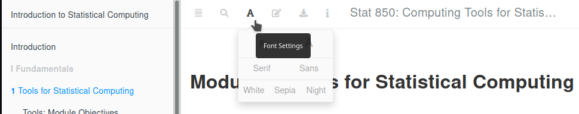
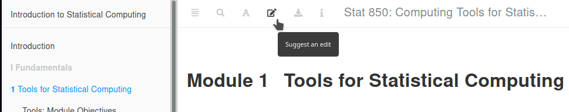
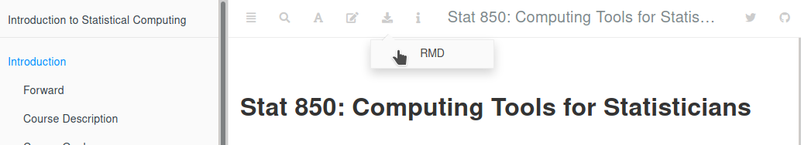
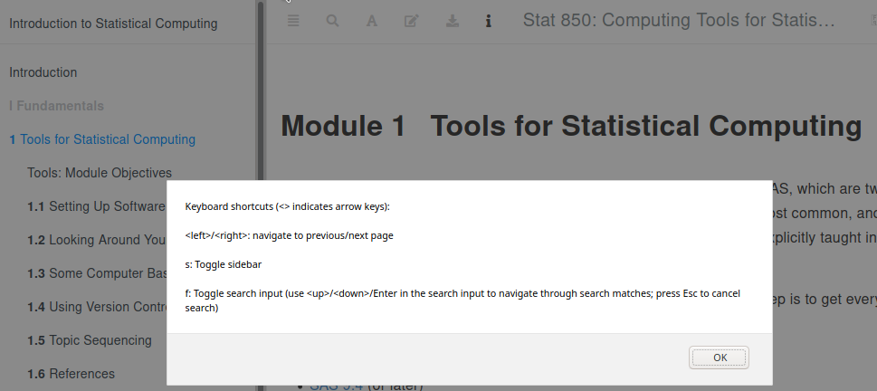
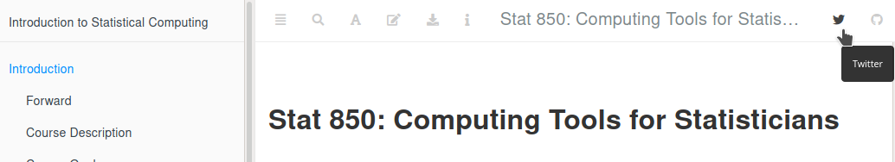
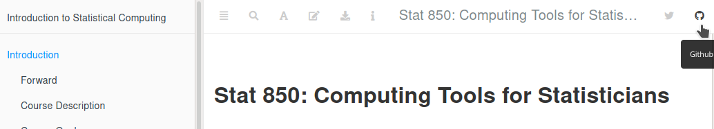

--- 
title: "Stat 850: Computing Tools for Statisticians"
author: "Susan Vanderplas"
date: "`r paste('Last Updated: ', Sys.Date())`"
site: bookdown::bookdown_site
documentclass: book
bibliography: [book.bib, packages.bib]
link-citations: true
biblio-style: apalike
description: "Introductions to statistical computing packages and document preparation software. Topics include: graphical techniques, data management, Monte Carlo simulation, dynamic document preparation, presentation software."
favicon: images/favicon.ico
github-repo: srvanderplas/unl-stat850
cover-image: images/cover.png
url: https://srvanderplas.github.io/unl-stat850/
---


# Introduction {-}

```{r setup, echo = F, message = F, warning = F}
library(magrittr)
library(knitr)
library(SASmarkdown)
sasexe <- "/usr/local/SASHome/SASFoundation/9.4/bin/sas_u8"
sasopts <- "-ls 75"
knitr::opts_chunk$set(collapse = T, cache = T, fig.path = "image/",
                      engine.opts = list(
                        "r" = list(tidy = "styler"), 
                        "sashtmllog" = sasopts, 
                        "saslog" = sasopts,
                        "sas" = sasopts,
                        "sashtml" = sasopts),
                      engine.path = list(
                        sashtmllog = sasexe,
                        saslog = sasexe,
                        sashtml = sasexe,
                        sas = sasexe
                      ),
                      dpi = 300)
```

```{r book-functions, include = F}
.pkgkeeplist <- c("package:stats", "package:graphics", "package:grDevices", "package:utils", "package:datasets", "package:methods", "package:base", "package:SASmarkdown", "package:rmarkdown", "package:knitr", "package:magrittr")

.objkeeplist <- c(".pkgkeeplist", ".objkeeplist", ".reset", "sasexe", "sasopts")

.reset <- function() {
  basic.packages <- .pkgkeeplist

  package.list <- search()[ifelse(unlist(gregexpr("package:", search())) == 1, TRUE, FALSE)]

  package.list <- setdiff(package.list, basic.packages)

  obj.list <- setdiff(ls(), .objkeeplist)

  if (length(package.list) > 0) for (package in package.list) detach(package, character.only = TRUE)
  rm(list = obj.list)
}
```


```{r clear-all-sas-output, include=F, engine='saslog', engine = "sashtmllog", engine.path = sasexe, engine.opts = sasopts, collectcode = F}
/* Clean log and output */
dm log "clear";
dm output "clear";
ods html close;
ods html;
```

```{r pkg-list-update, include = F, cache = F}
# update package list
source("code/collect_packages.R")
```

```{r fa-setup, include=FALSE}
htmltools::tagList(rmarkdown::html_dependency_font_awesome())
```
## Forward {-}

This textbook is intended to be a substitute for hours and hours of video lectures wherein I read code to you. That's awful, and boring^[If you want boring, or have insomnia, check out [this Microsoft Word tutorial from 1989](https://www.youtube.com/watch?v=Jk71bPz5VLo). Youtube says it's the most boring video ever made.], and honestly, as painful for me to have to listen to myself while editing the things as it is for you to watch them.

Instead, I hope  that you'll be able to work through this book, week by week, over the course of Stat 850. I've included comics, snark, gifs, YouTube videos, and more, with the goal of making this a collection of the best information I could find on learning R and SAS and statistical programming. 


## Course Description {-}
Introductions to statistical computing packages and document preparation software. Topics include: graphical techniques, data management, Monte Carlo simulation, dynamic document preparation, presentation software.

## Course Goals {-}
(Broad, amorphous conceptual things that are hard to measure)

1. Learn how to use R and SAS for data analysis, data processing, and data visualization.

2. Become familiar with the process, techniques, and goals of exploratory data analysis.

3. Create, assess, and debug code effectively.

    i. Use online resources to find software to perform a task, comparing approaches taken by competing programs.
    
    ii. Read error messages, find related problems in online forums, and isolate the conditions necessary to generate the error.
    
    iii. Generate minimum working examples or reproducible examples of errors in order to ask for help effectively.

4. Communicate statistical results using reproducible, dynamic tools. Understand the importance of reproducibility in scientific computation.

## Course Objectives {-}
(what you should be able to do at the end of this course)

A. Clean and format the data appropriately for the intended analysis or visualization method. (Goals: 1)

B. Explore a data set using numerical and visual summaries, developing questions which can be answered using statistics. (Goals: 1, 2)

C. Evaluate methods or software to assess relevance to a problem. Compare similar options to determine which are more appropriate for a given application (Goals: 1, 3)

D. Test and debug software, using the following sequence: (Goals: 3, 4)

   1. Reproduce the error in a new environment,
  
   2. Create a minimal reproducible example,
  
   3. Research the error message and evaluate online resources for relevance,
   
   4. Ask for help, describing the error or problem appropriately.

E. Document the data, methods, and results of an analysis using reproducible methods. (Goals: 1, 2, 4)


## How to Use This Book {-}

I've made an effort to use some specific formatting and enable certain features that make this book a useful tool for this class.

### Header Buttons/Links {-}
The header contains a number of buttons which should help - the TOC and search buttons are fairly obvious, but here's a look at what the others will do for you:














### Special Sections {-}

<div class="tryitout"> <h4>Try It Out</h4>

Try it out sections contain activities you should do to reinforce the things you've just read.
</div>

#### Watch Out {-.watchout}

Watch out sections contain things you may want to look out for - common errors, etc.

#### Learn More {-.learn-more}

Learn More sections contain other references that may be useful on a specific topic. Suggestions are welcome (use the edit link at the top to suggest a new reference that I should add), as there's no way for one person to catalog all of the helpful R resources on the internet!


#### Note {-.note}

Note sections contain clarification points (anywhere I would normally say "note that ....) 

#### My Opinion {-.my-opinion}

These sections contain things you should definitely not consider as fact and should just take with a grain of salt. 

#### Expandable Sections {-}
<details><summary>These are expandable sections, with additional information when you click on the line</summary>

This additional information may be information that is helpful but not essential, or it may be that an example just takes a LOT of space and I want to make sure you can skim the book without having to scroll through a ton of output.
</details>
